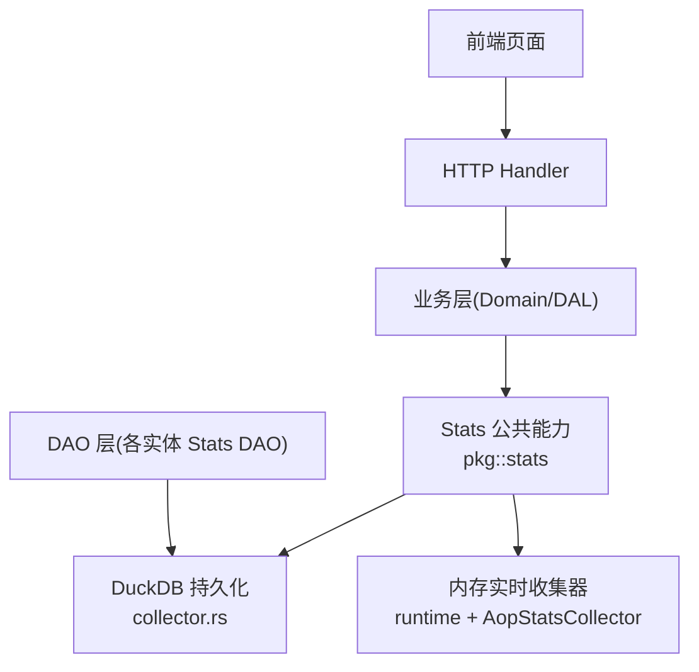
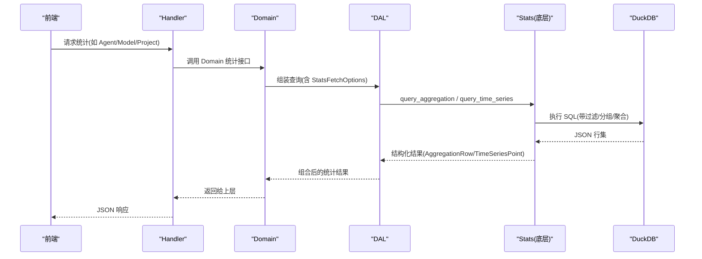
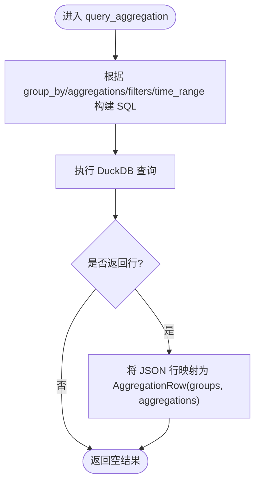
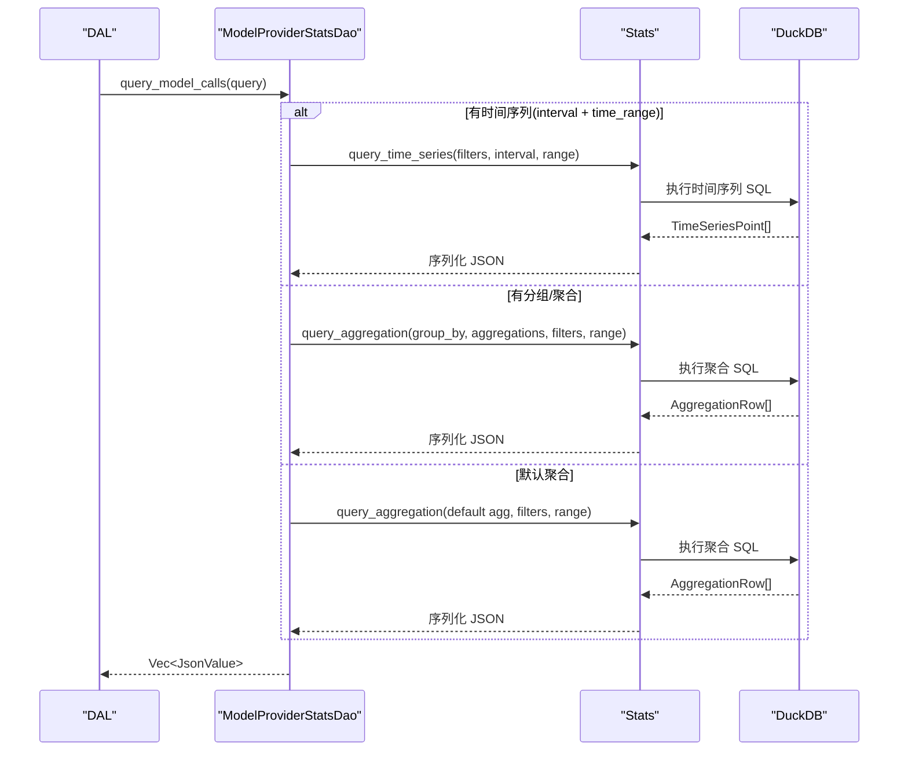
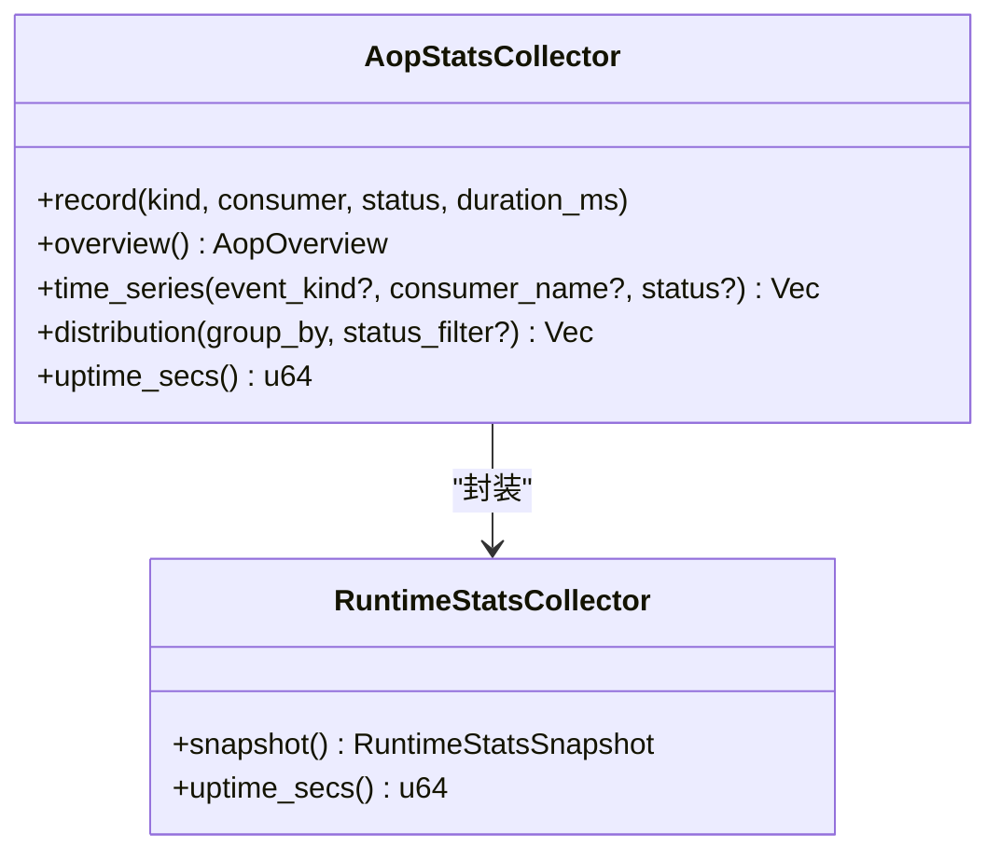
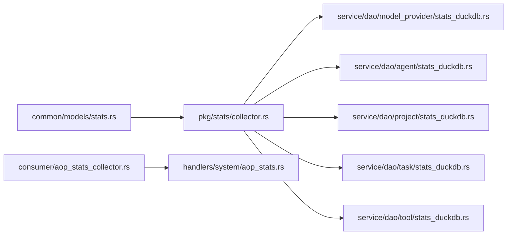

# 统计数据分析对象

<cite>
**本文引用的文件**
- [common/src/models/stats.rs](common/src/models/stats.rs)
- [src/pkg/stats/mod.rs](src/pkg/stats/mod.rs)
- [src/pkg/stats/collector.rs](src/pkg/stats/collector.rs)
- [docs/stats_query_design.md](docs/stats_query_design.md)
- [src/service/dao/model_provider/stats_duckdb.rs](src/service/dao/model_provider/stats_duckdb.rs)
- [src/consumer/aop_stats_collector.rs](src/consumer/aop_stats_collector.rs)
- [src/handlers/system/aop_stats.rs](src/handlers/system/aop_stats.rs)
</cite>

## 目录
1. [简介](#简介)
2. [项目结构](#项目结构)
3. [核心组件](#核心组件)
4. [架构总览](#架构总览)
5. [详细组件分析](#详细组件分析)
6. [依赖关系分析](#依赖关系分析)
7. [性能与大数据优化](#性能与大数据优化)
8. [故障排查指南](#故障排查指南)
9. [结论](#结论)
10. [附录：自定义分析查询开发指南](#附录自定义分析查询开发指南)

## 简介
本文件面向“统计数据分析对象”，系统化说明基于 DuckDB 的分析型数据库操作，覆盖聚合查询、时间序列分析与性能指标统计；并围绕 Agent 调用统计、模型使用分析、项目进度跟踪等关键业务场景，给出复杂分析查询构建、数据聚合算法与报表生成的实现要点。同时提供大数据量处理优化、查询缓存策略与分析结果导出能力建议，以及自定义分析查询的开发指南。

## 项目结构
统计子系统采用“双层实现”：持久化版（DuckDB）+ 内存实时版（运行时收集器）。两者互补：业务事件用持久化版，运行时能力（AOP/SSE/Channel）用内存版。

图表来源
- [src/pkg/stats/mod.rs:1-56](src/pkg/stats/mod.rs#L1-L56)
- [src/pkg/stats/collector.rs:102-132](src/pkg/stats/collector.rs#L102-L132)
- [src/consumer/aop_stats_collector.rs:43-52](src/consumer/aop_stats_collector.rs#L43-L52)

章节来源
- [src/pkg/stats/mod.rs:1-56](src/pkg/stats/mod.rs#L1-L56)
- [docs/stats_query_design.md:61-74](docs/stats_query_design.md#L61-L74)

## 核心组件
- 跨层共享模型：统一的时间粒度、时序点、Token 汇总、调用汇总、获取选项与各实体专属统计结构体。
- 统计底层能力：过滤条件、聚合函数、聚合行、参数类型；提供通用聚合查询与时间序列查询。
- 领域 DAO：按领域划分职责，Agent/Project/Task/Tool 自身维度统计由各自 DAO 负责；模型调用领域由 ModelProviderStatsDao 统一负责。
- 内存实时统计：AOP 事件生命周期内的概览、时序、分布统计，毫秒级响应。
- HTTP 接口：暴露系统级 AOP 统计查询端点。

章节来源
- [common/src/models/stats.rs:8-172](common/src/models/stats.rs#L8-L172)
- [src/pkg/stats/collector.rs:23-78](src/pkg/stats/collector.rs#L23-L78)
- [docs/stats_query_design.md:14-74](docs/stats_query_design.md#L14-L74)
- [src/consumer/aop_stats_collector.rs:16-52](src/consumer/aop_stats_collector.rs#L16-L52)
- [src/handlers/system/aop_stats.rs:16-72](src/handlers/system/aop_stats.rs#L16-L72)

## 架构总览
统计子系统遵循四层单向调用：Adapter → Domain → DAL → DAO，禁止跨层调用与同层互调。Domain 输入为 Command/Query，输出为业务实体与内部事件；DAL 对外接口统一使用业务实体；DAO 仅内部使用 PO。

图表来源
- [src/pkg/stats/collector.rs:314-365](src/pkg/stats/collector.rs#L314-L365)
- [src/pkg/stats/collector.rs:448-527](src/pkg/stats/collector.rs#L448-L527)
- [docs/stats_query_design.md:299-374](docs/stats_query_design.md#L299-L374)

## 详细组件分析

### 共享模型与统计选项
- 时间粒度：Hourly/Daily。
- 时序点：包含区间起始、输入/输出 Token、调用次数。
- Token 汇总：输入/输出 Token 总量与调用次数。
- 调用汇总：总调用次数、平均 QPS（需 time_range）、瞬时 QPS（最近 1 秒）。
- 获取选项：按需开关 call_summary/token_summary/time_series，支持 time_range 与 interval。
- 领域统计：AgentStats/ProjectStats/TaskStats/ToolStats/ModelCallStats/ProjectProgressSummary。

章节来源
- [common/src/models/stats.rs:8-172](common/src/models/stats.rs#L8-L172)

### 统计底层能力（DuckDB）
- 过滤条件：Equals/Range。
- 聚合函数：Count/Sum/Avg。
- 聚合行：分组键与聚合值。
- 参数类型：Int/Double/String，解决 ToSql 非 Send/Sync 的并发问题。
- 批量写入：按表注册事件类型，缓冲达到阈值自动 flush。
- 通用聚合查询：动态拼装 SELECT/GROUP BY/WHERE，支持时间范围与多维过滤。
- 时间序列查询：按小时/天截断时间戳，聚合 tokens_input/tokens_output/call_count。

图表来源
- [src/pkg/stats/collector.rs:314-365](src/pkg/stats/collector.rs#L314-L365)
- [src/pkg/stats/collector.rs:367-446](src/pkg/stats/collector.rs#L367-L446)

章节来源
- [src/pkg/stats/collector.rs:23-78](src/pkg/stats/collector.rs#L23-L78)
- [src/pkg/stats/collector.rs:102-132](src/pkg/stats/collector.rs#L102-L132)
- [src/pkg/stats/collector.rs:314-365](src/pkg/stats/collector.rs#L314-L365)
- [src/pkg/stats/collector.rs:448-527](src/pkg/stats/collector.rs#L448-L527)

### 领域 DAO：模型调用统计（ModelProviderStatsDao）
- 多维度过滤：model_provider_id/agent_id/project_id/task_id。
- 查询分支：
  - 指定 interval 且提供 time_range → 走时间序列查询。
  - 指定 group_by 或 aggregations → 走聚合查询。
  - 否则默认聚合 tokens_input/tokens_output/count。
- 返回 JSON 行集合，便于上层灵活解析。

图表来源
- [src/service/dao/model_provider/stats_duckdb.rs:32-169](src/service/dao/model_provider/stats_duckdb.rs#L32-L169)
- [src/pkg/stats/collector.rs:314-365](src/pkg/stats/collector.rs#L314-L365)
- [src/pkg/stats/collector.rs:448-527](src/pkg/stats/collector.rs#L448-L527)

章节来源
- [src/service/dao/model_provider/stats_duckdb.rs:1-169](src/service/dao/model_provider/stats_duckdb.rs#L1-L169)
- [docs/stats_query_design.md:254-296](docs/stats_query_design.md#L254-L296)

### 领域 DAO：Agent/Project/Task/Tool 自身维度统计
- 职责单一：只负责自身维度的 call_summary（次数与 QPS）。
- 数据来源：
  - Agent：agent_awake_events（唤醒次数与 QPS）。
  - Project/Task：当前从 model_call_events 按维度过滤（未来切换至专属统计表）。
  - Tool：tool_call_events（支持按 agent_id 过滤）。
- 计算方式：通过 query_aggregation 统计 count，结合 time_range 计算 avg_qps，最近 1 秒作为 instant_qps。

章节来源
- [docs/stats_query_design.md:191-252](docs/stats_query_design.md#L191-L252)
- [docs/stats_query_design.md:378-393](docs/stats_query_design.md#L378-L393)

### 内存实时统计：AOP 事件
- 设计哲学：AOP 是运行时能力，重启即丢，纯内存统计收集器与事件生命周期一致。
- 能力：
  - overview：published/published_sync、consuming、success、failed 分类计数与平均耗时。
  - time_series：滑动窗口（最近 60 分钟，按分钟桶），支持 event_kind/consumer_name/status 过滤。
  - distribution：按 consumer/status/kind 分组，支持 status 过滤。
- HTTP 接口：overview/time-series/distribution 三个端点，毫秒级响应。

图表来源
- [src/consumer/aop_stats_collector.rs:43-52](src/consumer/aop_stats_collector.rs#L43-L52)
- [src/consumer/aop_stats_collector.rs:61-195](src/consumer/aop_stats_collector.rs#L61-L195)

章节来源
- [src/consumer/aop_stats_collector.rs:1-307](src/consumer/aop_stats_collector.rs#L1-L307)
- [src/handlers/system/aop_stats.rs:16-72](src/handlers/system/aop_stats.rs#L16-L72)

### 项目进度跟踪
- 项目进度汇总：total_tasks/completed/in_progress/pending/blocked/cancelled/overall_percent。
- 计算方式：由 Domain 层根据项目关联的任务列表实时聚合，不持久化；通过 GetProjectRequest.with_progress_summary=true 按需返回。

章节来源
- [common/src/models/stats.rs:151-172](common/src/models/stats.rs#L151-L172)
- [docs/stats_query_design.md:151-172](docs/stats_query_design.md#L151-L172)

## 依赖关系分析
- 模块耦合：
  - pkg/stats 提供通用能力，被 DAO 层复用。
  - 领域 DAO 仅依赖 pkg/stats 与 common 模型，保持低耦合。
  - AOP 内存统计独立于 DuckDB，避免对主流程产生 IO 阻塞。
- 外部依赖：
  - DuckDB：用于持久化统计与复杂 SQL 查询。
  - serde_json：用于结果序列化与反序列化。
  - tokio：异步并发与锁管理。

图表来源
- [src/pkg/stats/collector.rs:102-132](src/pkg/stats/collector.rs#L102-L132)
- [src/service/dao/model_provider/stats_duckdb.rs:1-169](src/service/dao/model_provider/stats_duckdb.rs#L1-L169)
- [src/consumer/aop_stats_collector.rs:43-52](src/consumer/aop_stats_collector.rs#L43-L52)
- [src/handlers/system/aop_stats.rs:16-72](src/handlers/system/aop_stats.rs#L16-L72)

章节来源
- [docs/stats_query_design.md:61-74](docs/stats_query_design.md#L61-L74)

## 性能与大数据优化
- 批写与缓冲：Stats 按表维护缓冲，达到 batch_size 自动 flush，减少频繁 IO。
- 时间序列分桶：按小时/天截断时间戳进行聚合，降低数据量与计算复杂度。
- 过滤下推：在 SQL 中尽早应用时间范围与 tag 过滤，减少扫描行数。
- 内存实时统计：AOP 统计使用滑动窗口（60 分钟，按分钟桶），内存占用可控，查询毫秒级。
- 查询缓存策略（建议）：
  - 热点聚合结果可加短期缓存（如按查询签名 + 时间窗口 TTL）。
  - 对固定维度（如某 Agent 近 1 小时）的时序数据可缓存最新快照。
  - 注意一致性：缓存失效需与数据更新事件联动。
- 分析结果导出（建议）：
  - 将聚合结果序列化为 CSV/JSON 供外部工具消费。
  - 大结果集分页导出，避免一次性加载到内存。
  - 对敏感字段脱敏后再导出。

[本节为通用指导，不直接分析具体文件]

## 故障排查指南
- DuckDB 连接与表初始化：
  - 检查 initialize_default 是否成功注册所有表。
  - 确认表名与列映射正确（column_sql/metric_sql/filter_*_sql）。
- 查询失败不阻塞主流程：
  - 在 DAL 层对 stats 查询做容错，失败时记录日志并跳过统计注入，避免影响核心业务。
- 内存统计异常：
  - 检查 AopStatsCollector 的 snapshot 与 bucket 清理逻辑，确保滑动窗口正常回收旧数据。
- 性能退化：
  - 检查 time_range 是否合理，避免全表扫描。
  - 检查 group_by 维度是否过多导致笛卡尔积膨胀。

章节来源
- [src/pkg/stats/collector.rs:102-132](src/pkg/stats/collector.rs#L102-L132)
- [docs/superpowers/plans/2026-07-23-runtime-issues-fix.md:1266-1309](docs/superpowers/plans/2026-07-23-runtime-issues-fix.md#L1266-L1309)

## 结论
统计子系统以“领域先行、职责分离”为核心，通过 DuckDB 持久化与内存实时双实现，满足复杂聚合、时间序列与高性能查询需求。DAO 层按领域拆分，DAL 层负责组合查询，Domain 层按需注入统计结果。AOP 内存统计提供毫秒级监控能力，适合实时看板与告警。整体架构清晰、扩展性强，便于后续新增实体与统计维度。

[本节为总结性内容，不直接分析具体文件]

## 附录：自定义分析查询开发指南
- 新增事件类型：
  - 定义 StatEvent 与 StatTable，实现 table_name/column_sql/metric_sql/filter_*_sql。
  - 在 Stats.initialize_default 中注册新表。
- 新增聚合查询：
  - 使用 query_aggregation，传入 group_by 与 aggregations，必要时添加 StatFilter。
  - 如需时间序列，使用 query_time_series，指定 StatsInterval 与 time_range。
- 新增领域 DAO：
  - 参照 ModelProviderStatsDao，实现 query_model_calls/do_query 分支逻辑。
  - 在 DAL 层组合多个 DAO，暴露简洁的 get_stats/get_model_call_stats 接口。
- 前端集成：
  - 通过 FetchOptions + StatsOptions 按需注入统计数据，避免无谓查询。
  - 对热点数据启用短期缓存，提升交互体验。
- 测试与验证：
  - 使用单元测试验证聚合结果与时序数据正确性。
  - 集成测试覆盖端到端查询路径与错误处理。

章节来源
- [docs/stats_query_design.md:61-74](docs/stats_query_design.md#L61-L74)
- [docs/stats_query_design.md:299-374](docs/stats_query_design.md#L299-L374)
- [src/pkg/stats/collector.rs:314-365](src/pkg/stats/collector.rs#L314-L365)
- [src/pkg/stats/collector.rs:448-527](src/pkg/stats/collector.rs#L448-L527)