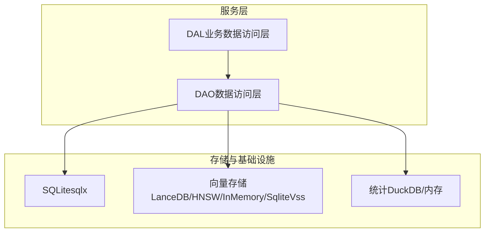
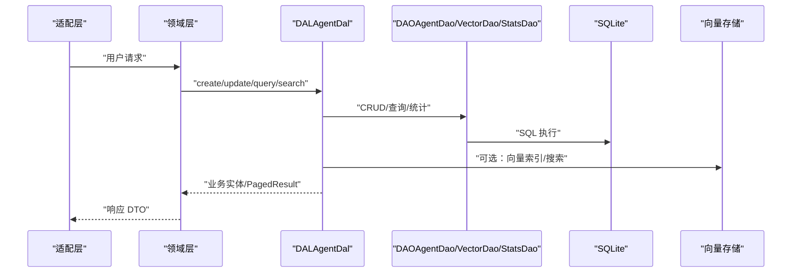
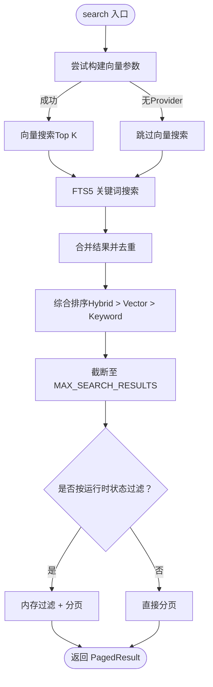
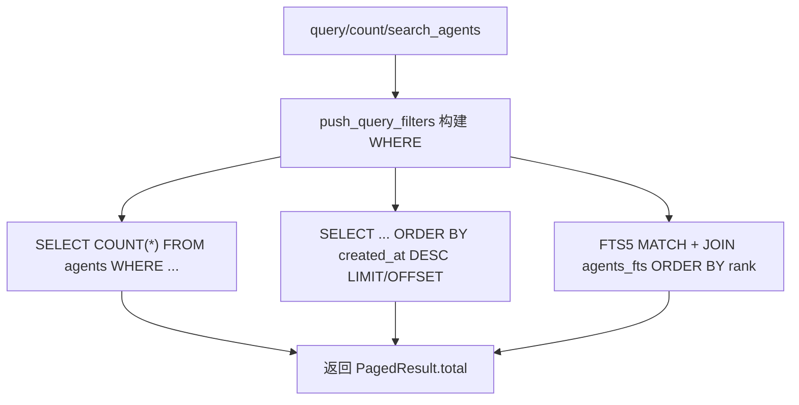
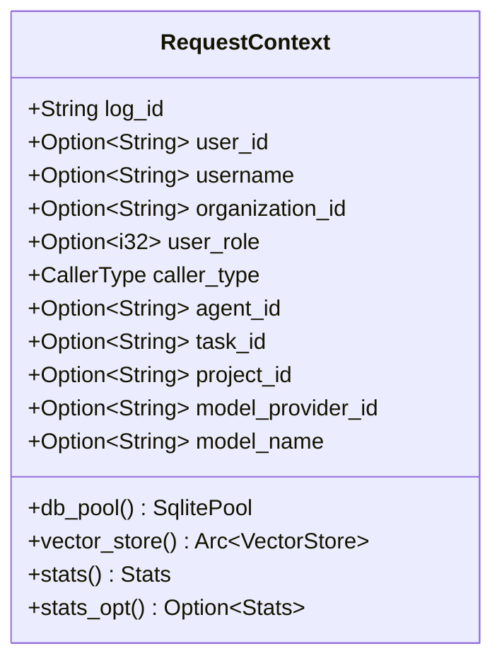
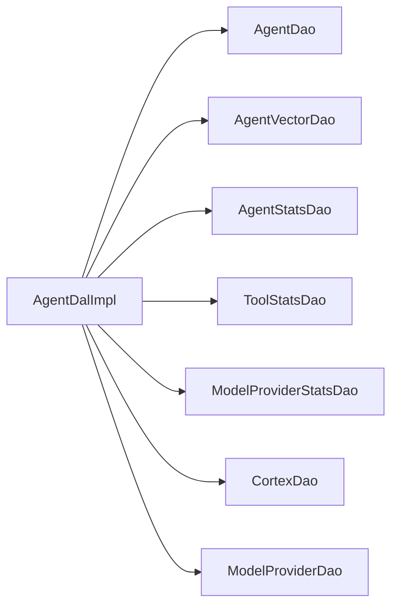

# 数据访问层 (DAL)

<cite>
**本文引用的文件**
- [src/service/dal/mod.rs](src/service/dal/mod.rs)
- [src/service/dao/mod.rs](src/service/dao/mod.rs)
- [src/service/dal/agent/mod.rs](src/service/dal/agent/mod.rs)
- [src/service/dao/agent/mod.rs](src/service/dao/agent/mod.rs)
- [src/service/dao/agent/sqlite.rs](src/service/dao/agent/sqlite.rs)
- [src/pkg/request_context.rs](src/pkg/request_context.rs)
- [docs/ARCHITECTURE.md](docs/ARCHITECTURE.md)
- [AGENTS.md](AGENTS.md)
</cite>

## 目录
1. [简介](#简介)
2. [项目结构](#项目结构)
3. [核心组件](#核心组件)
4. [架构总览](#架构总览)
5. [详细组件分析](#详细组件分析)
6. [依赖关系分析](#依赖关系分析)
7. [性能与优化](#性能与优化)
8. [故障排查指南](#故障排查指南)
9. [结论](#结论)
10. [附录：扩展与最佳实践](#附录：扩展与最佳实践)

## 简介
本文件面向 AI Orz 的数据访问层（DAL），系统性说明 DAL 的架构设计、数据抽象、查询构建器模式、仓储式 DAO/DAL 分层，以及 CRUD、复杂查询、批量处理、事务与一致性保证。同时覆盖异步数据访问、错误处理、缓存策略、连接池配置与数据库性能优化技术，并提供扩展指南、查询优化建议与故障排查方法。

## 项目结构
DAL 位于 service/dal，组合多个 DAO（service/dao）完成业务级数据操作；DAO 负责单一数据源访问（SQLite + SQLx、向量存储、统计等）。DAL 对外暴露业务实体接口，内部使用 PO 进行持久化映射。统一初始化入口在 DAL 与 DAO 模块的 init_all。

图示来源
- [src/service/dal/mod.rs:1-76](src/service/dal/mod.rs#L1-L76)
- [src/service/dao/mod.rs:1-56](src/service/dao/mod.rs#L1-L56)

章节来源
- [src/service/dal/mod.rs:1-76](src/service/dal/mod.rs#L1-L76)
- [src/service/dao/mod.rs:1-56](src/service/dao/mod.rs#L1-L56)
- [docs/ARCHITECTURE.md:24-46](docs/ARCHITECTURE.md#L24-L46)

## 核心组件
- DAL 单例与初始化：每个 DAL 模块通过 OnceLock 暴露 trait 对象单例，init 时注入对应 DAO、向量 DAO、统计 DAO 等依赖。
- 查询参数与分页：统一使用 common::api::PagedResult<T> 与 PaginationParams；DAO 层 query 返回 PagedResult<Po>，DAL 层转换为业务实体并保留 total。
- 搜索与向量化：Agent 搜索支持 FTS5 关键词 + 向量语义混合检索，DAL 层聚合结果、去重、排序并附加匹配信息。
- 上下文传递：所有 service 层公共方法首参为 RequestContext，跨层使用 ctx.clone()；RequestContext 提供 db_pool、vector_store、stats 等能力。

章节来源
- [src/service/dal/agent/mod.rs](src/service/dal/agent/mod.rsL73)
- [src/service/dal/agent/mod.rs](src/service/dal/agent/mod.rsL193)
- [src/service/dao/agent/mod.rs:12-90](src/service/dao/agent/mod.rs#L12-L90)
- [src/pkg/request_context.rs:22-61](src/pkg/request_context.rs#L22-L61)

## 架构总览
DAL 遵循严格单向调用：Adapter → Domain → DAL → DAO → Models。DAL 组合多个 DAO 完成业务级数据操作，PO 仅在 DAO/DAL 内部使用，不暴露到 Domain。

图示来源
- [src/service/dal/agent/mod.rs](src/service/dal/agent/mod.rsL350)
- [src/service/dao/agent/sqlite.rs:109-139](src/service/dao/agent/sqlite.rs#L109-L139)
- [src/service/dal/agent/mod.rs](src/service/dal/agent/mod.rsL699)

章节来源
- [docs/ARCHITECTURE.md:325-385](docs/ARCHITECTURE.md#L325-L385)
- [AGENTS.md:148-186](AGENTS.md#L148-L186)

## 详细组件分析

### Agent DAL：CRUD、查询、搜索、统计
- 创建/更新/删除：写入基础数据后，自动尝试向量化（失败降级 warn），删除时清理向量索引。
- 查询：支持通用查询条件、运行时状态内存过滤、分页；当需要 runtime_state 过滤时，DAL 层查全量再内存过滤并手动分页。
- 搜索：FTS5 关键词 + 向量语义混合检索，按 Hybrid/Vector/Keyword 优先级排序，限制最大结果数，避免 N+1 查询。
- 统计：聚合唤醒次数、工具调用汇总、模型调用统计，失败降级不影响主流程。

图示来源
- [src/service/dal/agent/mod.rs](src/service/dal/agent/mod.rsL699)
- [src/service/dao/agent/sqlite.rs:141-256](src/service/dao/agent/sqlite.rs#L141-L256)

章节来源
- [src/service/dal/agent/mod.rs](src/service/dal/agent/mod.rsL350)
- [src/service/dal/agent/mod.rs](src/service/dal/agent/mod.rsL459)
- [src/service/dal/agent/mod.rs](src/service/dal/agent/mod.rsL699)
- [src/service/dal/agent/mod.rs](src/service/dal/agent/mod.rsL738)
- [src/service/dal/agent/mod.rs](src/service/dal/agent/mod.rsL800)

### Agent DAO：SQLite 查询构建器与 FTS5
- 查询构建器：COUNT 与 LIST 复用 push_query_filters，确保 WHERE 条件一致；支持 ids/status/exclude_status/created_by/model_provider_id/roles 等过滤。
- FTS5 搜索：空关键词直接返回空结果；MATCH 前转义关键词；JOIN agents_fts 并按 rank 排序；限制 search_limit 防止失控。
- 分页：LIMIT/OFFSET 统一处理；当仅 offset 存在时使用 LIMIT -1 兼容 SQLite。

图示来源
- [src/service/dao/agent/sqlite.rs:109-139](src/service/dao/agent/sqlite.rs#L109-L139)
- [src/service/dao/agent/sqlite.rs:141-256](src/service/dao/agent/sqlite.rs#L141-L256)
- [src/service/dao/agent/sqlite.rs:331-383](src/service/dao/agent/sqlite.rs#L331-L383)

章节来源
- [src/service/dao/agent/sqlite.rs:109-139](src/service/dao/agent/sqlite.rs#L109-L139)
- [src/service/dao/agent/sqlite.rs:141-256](src/service/dao/agent/sqlite.rs#L141-L256)
- [src/service/dao/agent/sqlite.rs:331-383](src/service/dao/agent/sqlite.rs#L331-L383)

### 上下文与存储门面：RequestContext
- 职责：贯穿请求生命周期，携带日志追踪 ID、用户身份、组织维度、业务维度、模型维度及存储门面（SQLite、向量、统计）。
- 构造：Builder 模式支持从 header 解析或系统场景创建；to_builder 可克隆扩展字段。
- 能力：db_pool、vector_store、stats、stats_opt；caller_id/caller_role 用于消息发送与统计。

图示来源
- [src/pkg/request_context.rs:22-61](src/pkg/request_context.rs#L22-L61)
- [src/pkg/request_context.rs:483-507](src/pkg/request_context.rs#L483-L507)

章节来源
- [src/pkg/request_context.rs:22-61](src/pkg/request_context.rs#L22-L61)
- [src/pkg/request_context.rs:271-356](src/pkg/request_context.rs#L271-L356)
- [src/pkg/request_context.rs:401-507](src/pkg/request_context.rs#L401-L507)

## 依赖关系分析
- DAL 依赖多个 DAO：AgentDalImpl 持有 AgentDao、AgentVectorDao、AgentStatsDao、ToolStatsDao、ModelProviderStatsDao、CortexDao、ModelProviderDao。
- DAO 实现解耦：sqlite.rs 提供 AgentDaoSqliteImpl；vector/stats 独立模块。
- 初始化顺序：DAL 与 DAO 分别维护 init_all，确保依赖就绪后再注册单例。

图示来源
- [src/service/dal/agent/mod.rs](src/service/dal/agent/mod.rsL204)
- [src/service/dal/agent/mod.rs](src/service/dal/agent/mod.rsL52)

章节来源
- [src/service/dal/agent/mod.rs](src/service/dal/agent/mod.rsL52)
- [src/service/dal/agent/mod.rs](src/service/dal/agent/mod.rsL204)

## 性能与优化
- 查询构建器复用：COUNT 与 LIST 共用 push_query_filters，减少重复逻辑与 SQL 拼接成本。
- 混合搜索优化：向量搜索 Top K 与 FTS5 结果合并去重，避免 N+1 查询；限制最大结果数，控制内存与排序开销。
- 软删除默认过滤：常规查询排除 status=0，减少无效数据扫描。
- 向量化降级：Embedding Provider 缺失或写入失败时 warn 降级，不影响主流程可用性。
- 分页统一：PaginationParams 与 PagedResult 贯穿三层，避免手工 limit/offset 拼接错误。

章节来源
- [src/service/dao/agent/sqlite.rs:109-139](src/service/dao/agent/sqlite.rs#L109-L139)
- [src/service/dal/agent/mod.rs](src/service/dal/agent/mod.rsL699)
- [src/service/dal/agent/mod.rs](src/service/dal/agent/mod.rsL312)
- [AGENTS.md:585-755](AGENTS.md#L585-L755)

## 故障排查指南
- 向量搜索失败：检查 Embedding Provider 是否存在；查看日志中的 vector_search/vector_index 降级告警；必要时重建向量索引。
- 搜索结果异常：确认关键词是否被正确转义；检查 FTS5 表是否可用；验证 roles/json_each 过滤是否正确。
- 分页结果不符预期：核对 pagination.limit/offset 传递链路；确认 list 默认过滤与排序是否符合预期。
- 统计查询失败：stats 查询失败应降级记录，不影响主流程；检查 DuckDB 或内存收集器是否正常初始化。

章节来源
- [src/service/dal/agent/mod.rs](src/service/dal/agent/mod.rsL540)
- [src/service/dal/agent/mod.rs](src/service/dal/agent/mod.rsL312)
- [src/service/dao/agent/sqlite.rs:141-170](src/service/dao/agent/sqlite.rs#L141-L170)
- [src/service/dal/agent/mod.rs](src/service/dal/agent/mod.rsL405)

## 结论
DAL 层通过 DAO 多态与 DAL 继承/组合，实现了高内聚、低耦合的业务数据访问能力。统一的查询构建器、分页规范与混合搜索策略，保障了可扩展性与性能。RequestContext 作为横切关注点，贯穿认证、日志、存储与统计，提升了可观测性与可维护性。

## 附录：扩展与最佳实践
- 新增实体 DAL：定义 DAL trait 与 Impl，组合对应 DAO/VectorDao/StatsDao；在 dal/mod.rs 中注册 init；遵循 PO 不暴露到 Domain 的原则。
- 新增 DAO：实现 sqlite.rs，抽取 push_query_filters，统一 query/count/search；遵循枚举类型安全与 STRICT 模式。
- 查询优化：优先使用 push_query_filters 复用条件；对热点查询添加必要索引；避免在 DAL 层拼接向量文本，改用 Vectorizable trait。
- 事务与一致性：DAL 层组合多个 DAO 时，若需跨表一致性，应在 Domain 层编排事务边界；DAL 保持无副作用的数据组装与转换。
- 异步与错误处理：所有 DAO/DAL 方法为 async；中间步骤失败采用 warn 降级，确保主流程可用；统计/向量等非关键路径失败不应阻塞核心流程。

章节来源
- [AGENTS.md:395-452](AGENTS.md#L395-L452)
- [AGENTS.md:499-583](AGENTS.md#L499-L583)
- [AGENTS.md:585-755](AGENTS.md#L585-L755)
- [docs/ARCHITECTURE.md:398-487](docs/ARCHITECTURE.md#L398-L487)