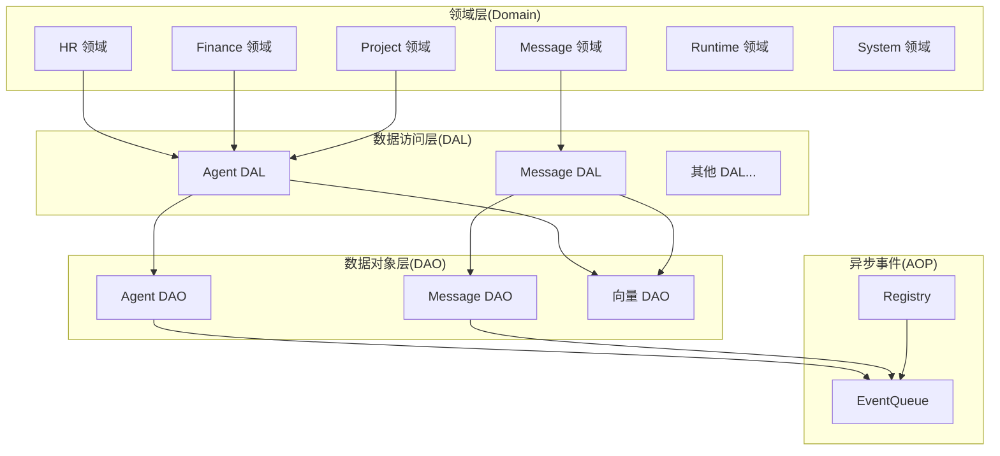
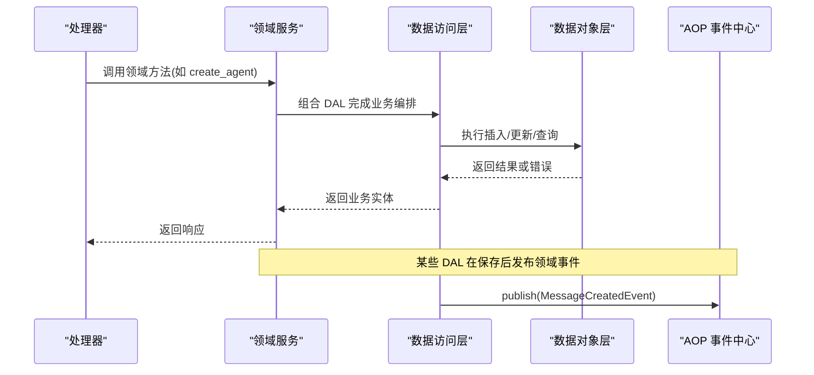
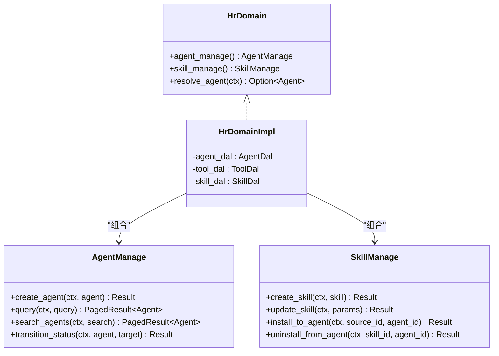
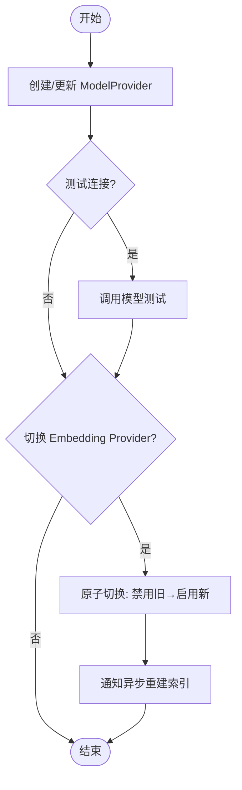
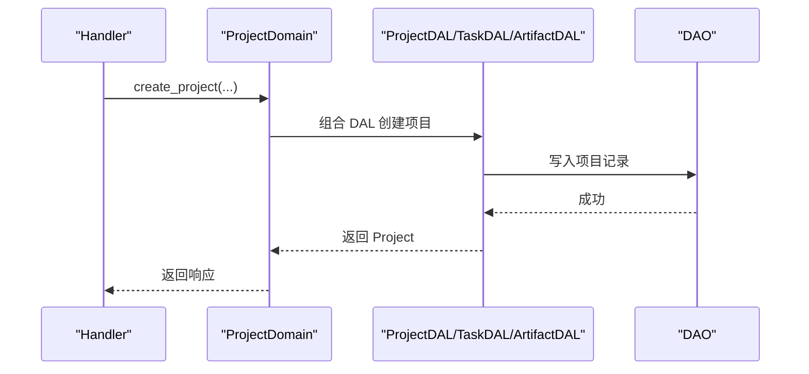
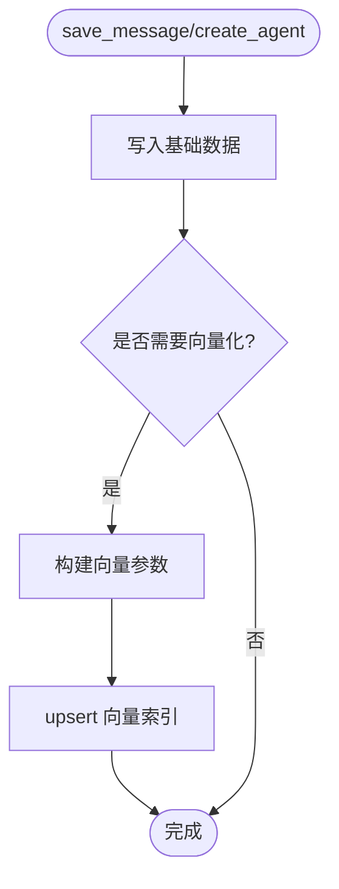
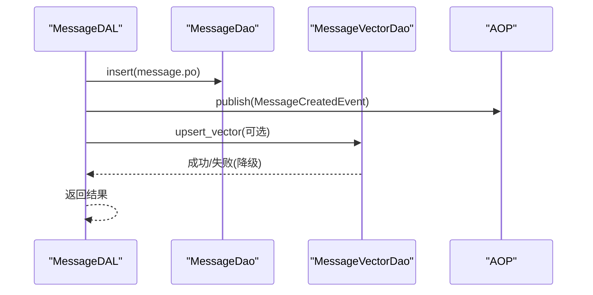
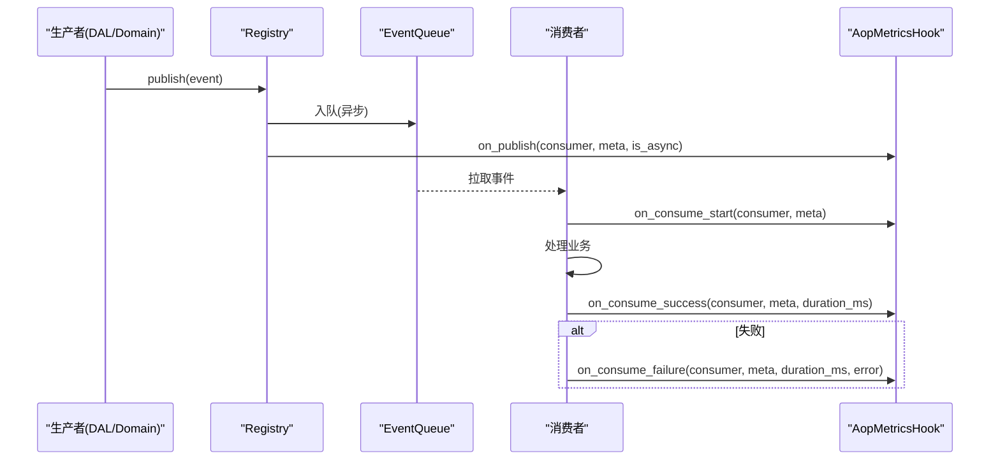
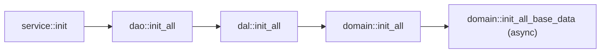

# 服务层

<cite>
**本文引用的文件**
- [src/service/mod.rs](src/service/mod.rs)
- [src/service/dal/mod.rs](src/service/dal/mod.rs)
- [src/service/dao/mod.rs](src/service/dao/mod.rs)
- [src/service/domain/mod.rs](src/service/domain/mod.rs)
- [src/service/domain/hr/mod.rs](src/service/domain/hr/mod.rs)
- [src/service/domain/finance/mod.rs](src/service/domain/finance/mod.rs)
- [src/service/domain/project/mod.rs](src/service/domain/project/mod.rs)
- [src/service/dal/agent/mod.rs](src/service/dal/agent/mod.rs)
- [src/service/dal/message.rs](src/service/dal/message.rs)
- [src/service/dao/agent/mod.rs](src/service/dao/agent/mod.rs)
- [src/service/dao/message/mod.rs](src/service/dao/message/mod.rs)
- [src/pkg/aop/mod.rs](src/pkg/aop/mod.rs)
</cite>

## 目录
1. [简介](#简介)
2. [项目结构](#项目结构)
3. [核心组件](#核心组件)
4. [架构总览](#架构总览)
5. [详细组件分析](#详细组件分析)
6. [依赖关系分析](#依赖关系分析)
7. [性能考虑](#性能考虑)
8. [故障排查指南](#故障排查指南)
9. [结论](#结论)
10. [附录](#附录)

## 简介
本文件面向 AI Orz 的服务层，系统化阐述领域驱动设计在服务层的落地方式：领域模型、领域服务与业务规则的实现；数据访问层（DAL）与数据对象层（DAO）的分层架构；数据抽象、查询构建与事务管理；服务层的依赖注入、缓存策略与异步处理机制；以及领域事件处理、跨领域协调与分布式事务的解决方案。同时提供扩展指南、性能调优建议与故障排查方法，帮助读者快速理解并高效扩展服务层。

## 项目结构
服务层采用清晰的分层组织：
- Domain（领域层）：按业务域划分（hr、finance、project、message、runtime、system），定义领域接口与聚合能力，组合 DAL 完成复杂业务编排。
- DAL（数据访问层）：面向业务对象的访问封装，组合多个 DAO，屏蔽存储细节，提供统一搜索参数与分页等通用能力。
- DAO（数据对象层）：面向持久化的最小单元操作，定义查询条件、向量索引、统计等细粒度接口。
- AOP（异步事件中心）：解耦发布与消费，支撑领域事件与跨领域协调。

图表来源
- [src/service/domain/mod.rs:1-43](src/service/domain/mod.rs#L1-L43)
- [src/service/dal/mod.rs:1-114](src/service/dal/mod.rs#L1-L114)
- [src/service/dao/mod.rs:1-56](src/service/dao/mod.rs#L1-L56)
- [src/pkg/aop/mod.rs:1-61](src/pkg/aop/mod.rs#L1-L61)

章节来源
- [src/service/mod.rs:1-24](src/service/mod.rs#L1-L24)
- [src/service/dal/mod.rs:1-114](src/service/dal/mod.rs#L1-L114)
- [src/service/dao/mod.rs:1-56](src/service/dao/mod.rs#L1-L56)
- [src/service/domain/mod.rs:1-43](src/service/domain/mod.rs#L1-L43)

## 核心组件
- 领域单例与初始化：各 Domain 通过 OnceLock 暴露全局单例，init() 注册实现，支持测试时 new(...) 注入隔离依赖。
- DAL 统一搜索参数：SearchParams 提供关键词、限制、偏移、是否仅向量搜索等统一入口。
- DAO 查询与向量分离：基础 DAO 负责 CRUD 与 FTS5 关键词搜索，Vector DAO 专注向量索引的 upsert/search/clear。
- AOP 事件中心：publish/registry/init_all 提供事件发布、调度与监控钩子，消费者在 consumer 层注册。

章节来源
- [src/service/domain/hr/mod.rs:31-57](src/service/domain/hr/mod.rs#L31-L57)
- [src/service/domain/finance/mod.rs:47-90](src/service/domain/finance/mod.rs#L47-L90)
- [src/service/dal/mod.rs:6-28](src/service/dal/mod.rs#L6-L28)
- [src/service/dao/agent/mod.rs:12-46](src/service/dao/agent/mod.rs#L12-L46)
- [src/service/dao/message/mod.rs:9-57](src/service/dao/message/mod.rs#L9-L57)
- [src/pkg/aop/mod.rs:1-61](src/pkg/aop/mod.rs#L1-L61)

## 架构总览
服务层遵循“领域优先、分层解耦”的原则：
- Domain 不直接调用 DAO，只组合 DAL；返回业务实体而非 PO。
- DAL 组合多个 DAO，屏蔽存储细节，提供统一搜索、分页、运行时状态过滤等能力。
- DAO 聚焦 SQL/向量索引/统计的最小操作单元，接口稳定且可替换。
- AOP 贯穿消息创建、工具执行、任务状态变更等事件，实现跨领域协调与异步处理。

图表来源
- [src/service/dal/message.rs:133-193](src/service/dal/message.rs#L133-L193)
- [src/service/dal/agent/mod.rs](src/service/dal/agent/mod.rsL350)
- [src/pkg/aop/mod.rs:48-51](src/pkg/aop/mod.rs#L48-L51)

## 详细组件分析

### HR 领域（人力资源）
- 职责：Agent、Skill、Tool 的管理与安装/卸载、状态流转、前台 Agent 解析。
- 关键设计：
  - 领域单例 HrDomainImpl，通过 trait 暴露 agent_manage/skill_manage。
  - resolve_agent 路由优先级：带 feishu_reception 角色的 Onboarded Agent → 任意 Onboarded Agent。
  - SkillFileImport/UpdateSkillParams 将外部概念（如 Attachment）转换为领域输入，避免泄漏。
- 典型流程：创建/更新/删除 Agent，校验入职就绪，安装/卸载技能包与工具包。

图表来源
- [src/service/domain/hr/mod.rs:61-152](src/service/domain/hr/mod.rs#L61-L152)
- [src/service/domain/hr/mod.rs:154-291](src/service/domain/hr/mod.rs#L154-L291)
- [src/service/domain/hr/mod.rs:293-393](src/service/domain/hr/mod.rs#L293-L393)

章节来源
- [src/service/domain/hr/mod.rs:1-393](src/service/domain/hr/mod.rs#L1-L393)

### Finance 领域（财务管理）
- 职责：ModelProvider、MessageChannel、ToolProvider、MCP Server/Tool、Attachment 的配置与管理。
- 关键设计：
  - 领域单例 FinanceDomainImpl，暴露 model_provider_manage、message_channel_manage、tool_provider_manage、mcp_server_manage、mcp_tool_manage、attachment_manage。
  - switch_embedding_provider 原子切换 Embedding Provider，返回旧 Provider 供后续异步重建索引。
  - sync_builtin_tools 将内置工具同步到 DB，用于系统首次初始化。
- 典型流程：创建/更新/删除 ModelProvider，测试连接，绑定/解绑工具到 Agent，同步 MCP Tools。

图表来源
- [src/service/domain/finance/mod.rs:117-184](src/service/domain/finance/mod.rs#L117-L184)
- [src/service/domain/finance/mod.rs:360-457](src/service/domain/finance/mod.rs#L360-L457)

章节来源
- [src/service/domain/finance/mod.rs:1-522](src/service/domain/finance/mod.rs#L1-L522)

### Project 领域（项目管理）
- 职责：Project、Task、Artifact 的核心业务，严格分层：Domain 组合 DAL，返回业务实体。
- 关键设计：
  - project_manage/task_manage/artifact_manage 三组 trait，提供 CRUD、查询、搜索、状态流转。
  - search 强调语义相关性（FTS5 + 向量混合），query 强调条件过滤。
  - artifact_to_detail 复用转换逻辑，保证 DTO 一致性。
- 典型流程：创建项目/任务/产物，启动/完成/归档项目，更新进度，查询列表与详情。

图表来源
- [src/service/domain/project/mod.rs:91-226](src/service/domain/project/mod.rs#L91-L226)
- [src/service/domain/project/mod.rs:228-359](src/service/domain/project/mod.rs#L228-L359)
- [src/service/domain/project/mod.rs:361-498](src/service/domain/project/mod.rs#L361-L498)

章节来源
- [src/service/domain/project/mod.rs:1-539](src/service/domain/project/mod.rs#L1-L539)

### Agent DAL（Agent 数据访问层）
- 职责：Agent 实体的 CRUD、搜索（FTS5 + 向量）、统计、唤醒 Brain、向量索引维护。
- 关键设计：
  - AgentFetchOptions 控制附带信息（运行时状态、工具、技能、统计）。
  - apply_runtime_state_filter 内存态过滤 + 手动分页。
  - upsert_vector_index 自动向量化，失败降级不影响主流程。
  - search 实现混合搜索：关键词命中、向量命中、双命中，综合排序。
- 典型流程：创建 Agent 后自动向量化；更新内容变化则重新向量化；删除时清理向量索引。

图表来源
- [src/service/dal/agent/mod.rs](src/service/dal/agent/mod.rsL312)
- [src/service/dal/agent/mod.rs](src/service/dal/agent/mod.rsL350)
- [src/service/dal/message.rs:133-193](src/service/dal/message.rs#L133-L193)

章节来源
- [src/service/dal/agent/mod.rs](src/service/dal/agent/mod.rsL800)
- [src/service/dal/message.rs:1-200](src/service/dal/message.rs#L1-L200)

### Message DAL（消息数据访问层）
- 职责：消息保存、查询、状态更新、搜索、向量索引维护，并在保存后发布领域事件。
- 关键设计：
  - save_message 持久化后发布 MessageCreatedEvent，随后尝试向量化（失败降级）。
  - search 支持关键词与向量混合搜索，返回匹配的消息列表。
- 典型流程：保存消息 → 发布事件 → 向量化 → 可选查询/搜索。

图表来源
- [src/service/dal/message.rs:133-193](src/service/dal/message.rs#L133-L193)
- [src/service/dao/message/mod.rs:162-176](src/service/dao/message/mod.rs#L162-L176)

章节来源
- [src/service/dal/message.rs:1-200](src/service/dal/message.rs#L1-L200)
- [src/service/dao/message/mod.rs:1-229](src/service/dao/message/mod.rs#L1-L229)

### 领域事件与异步处理（AOP）
- 职责：统一事件分发框架，生产-消费解耦，支持指标采集 Hook。
- 关键设计：
  - registry/publish/init_all 提供全局事件中心与调度器。
  - AopMetricsHook 在 publish/consume_start/success/failure 回调中采集指标。
- 典型流程：DAL/Domain 发布事件 → Registry 入队 → 消费者异步处理 → 指标采集。

图表来源
- [src/pkg/aop/mod.rs:1-61](src/pkg/aop/mod.rs#L1-L61)

章节来源
- [src/pkg/aop/mod.rs:1-61](src/pkg/aop/mod.rs#L1-L61)

## 依赖关系分析
- 初始化顺序：service::init → dao::init_all → dal::init_all → domain::init_all → domain::init_all_base_data（异步）。
- 依赖方向：Domain → DAL → DAO；DAL 可能依赖 AOP 发布事件；DAO 可能依赖向量存储与统计存储。
- 潜在循环：无直接循环，但需注意 lark dal 最后初始化以依赖 message_channel + agent dal。

图表来源
- [src/service/mod.rs:5-23](src/service/mod.rs#L5-L23)
- [src/service/dal/mod.rs:54-76](src/service/dal/mod.rs#L54-L76)
- [src/service/dao/mod.rs:29-55](src/service/dao/mod.rs#L29-L55)
- [src/service/domain/mod.rs:23-42](src/service/domain/mod.rs#L23-L42)

章节来源
- [src/service/mod.rs:1-24](src/service/mod.rs#L1-L24)
- [src/service/dal/mod.rs:54-76](src/service/dal/mod.rs#L54-L76)
- [src/service/dao/mod.rs:29-55](src/service/dao/mod.rs#L29-L55)
- [src/service/domain/mod.rs:23-42](src/service/domain/mod.rs#L23-L42)

## 性能考虑
- 混合搜索优化：
  - Agent/Message 搜索采用 FTS5 + 向量混合，先向量 Top-K，再 FTS5，去重后综合排序，避免 N+1 查询。
  - 向量距离阈值可配置，默认 0.8，过滤低相似度结果。
- 运行时状态过滤：
  - runtime_state 为内存态，DAL 层注入 runtime_info 后内存过滤 + 手动分页，避免全表扫描。
- 向量化降级：
  - 无 Embedding Provider 或向量写入失败时降级为关键词搜索或跳过，不影响主流程。
- 统计查询：
  - stats 查询失败不阻塞主流程，保持 None 并 warn 日志，避免重试风暴。
- 批量与分块：
  - 向量搜索结果回填使用 chunk 批量查询（每批 20），减少数据库压力。

[本节为通用性能指导，无需特定文件引用]

## 故障排查指南
- 向量索引问题：
  - 现象：搜索不到结果或向量写入失败。
  - 排查：检查是否有可用 Embedding Provider；查看向量写入日志（warn 降级）；必要时重建向量索引。
- 运行时状态过滤异常：
  - 现象：列表分页不正确。
  - 排查：确认 DAL 层是否正确注入 runtime_info 并应用内存过滤；检查分页参数。
- 统计查询失败：
  - 现象：get_agent 返回缺少 stats。
  - 排查：stats 查询失败会 warn 并跳过，检查 DuckDB/统计表可用性；确保时间范围与聚合参数正确。
- AOP 事件积压：
  - 现象：消费者处理延迟。
  - 排查：通过 AOP 监控接口查看队列状态与事件详情；检查消费者实现与错误处理。

章节来源
- [src/service/dal/agent/mod.rs](src/service/dal/agent/mod.rsL312)
- [src/service/dal/agent/mod.rs](src/service/dal/agent/mod.rsL405)
- [src/service/dal/message.rs:150-193](src/service/dal/message.rs#L150-L193)
- [src/pkg/aop/mod.rs:48-61](src/pkg/aop/mod.rs#L48-L61)

## 结论
AI Orz 服务层以领域驱动设计为核心，通过 Domain/DAL/DAO 三层解耦，结合 AOP 事件中心实现跨领域协调与异步处理。Agent/Message 的混合搜索、运行时状态过滤、向量化降级与统计查询失败保护，共同保障了高可用与高性能。未来可扩展更多领域与存储后端，保持接口稳定与分层清晰。

[本节为总结性内容，无需特定文件引用]

## 附录
- 扩展指南：
  - 新增领域：在 domain/mod.rs 注册 init，实现领域单例与 trait，组合 DAL。
  - 新增 DAL：在 dal/mod.rs 注册 init，实现统一搜索参数与分页。
  - 新增 DAO：在 dao/mod.rs 注册 init，定义查询条件与向量接口。
  - 领域事件：在 DAL/Domain 中 publish 事件，consumer 层注册消费者。
- 事务管理：
  - DAO 层按操作粒度提交事务；DAL 层组合多 DAO 时由上层（如 handler）控制事务边界。
  - 向量索引写入失败降级，不影响主事务。
- 缓存策略：
  - 当前未显式引入缓存；可通过 DAL 层增加缓存中间件（如 Redis）提升热点数据读取性能。
- 异步处理：
  - 使用 AOP 发布事件，消费者异步处理；指标采集通过 AopMetricsHook 注入。

[本节为通用指导，无需特定文件引用]