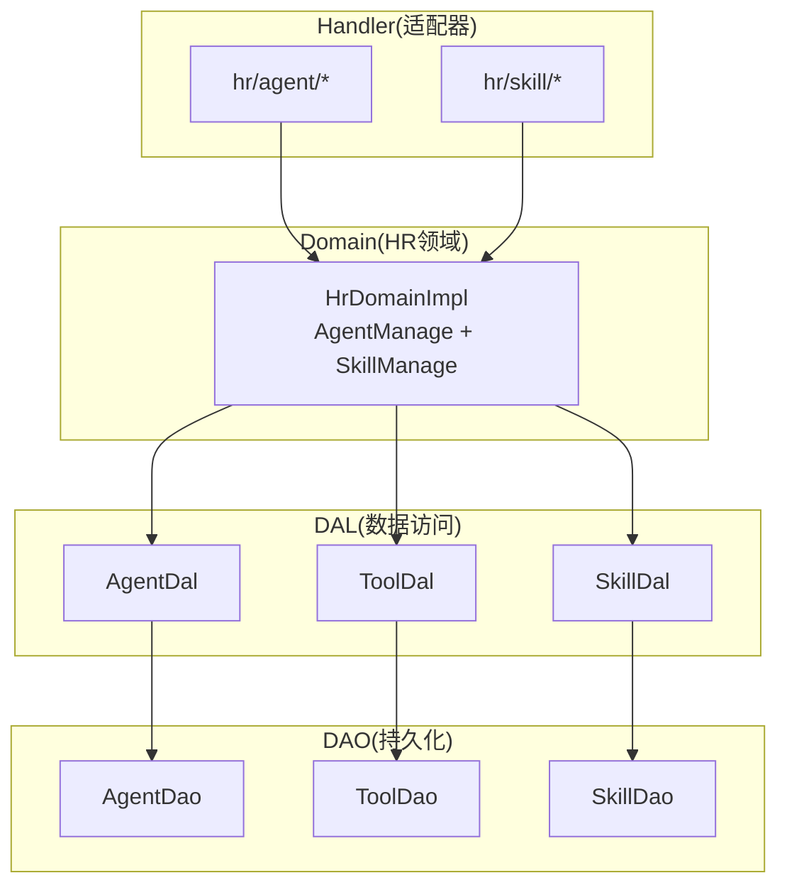
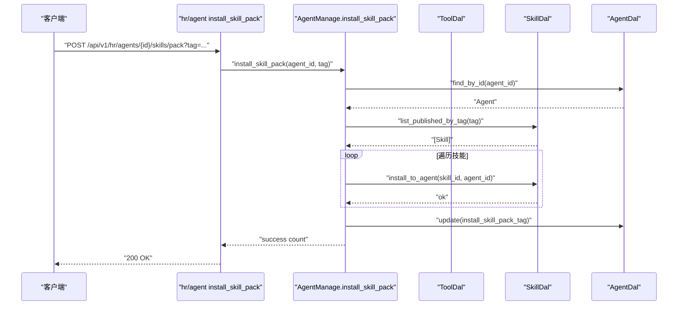
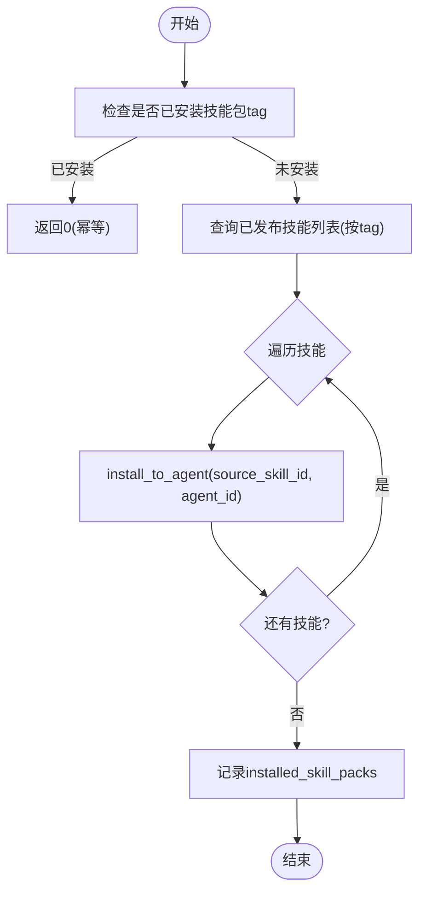
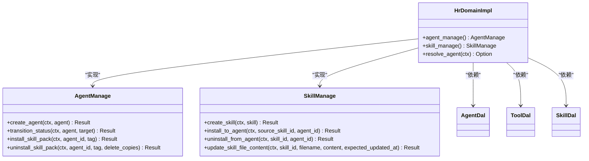

# HR领域

<cite>
**本文引用的文件**
- [src/service/domain/hr/mod.rs](src/service/domain/hr/mod.rs)
- [src/service/domain/hr/agent.rs](src/service/domain/hr/agent.rs)
- [src/service/domain/hr/skill.rs](src/service/domain/hr/skill.rs)
- [common/src/enums/agent.rs](common/src/enums/agent.rs)
- [common/src/enums/skill.rs](common/src/enums/skill.rs)
- [src/models/agent.rs](src/models/agent.rs)
- [src/models/skill.rs](src/models/skill.rs)
- [docs/skill_design.md](docs/skill_design.md)
- [docs/agent_onboarding_design.md](docs/agent_onboarding_design.md)
- [src/handlers/hr/agent/install_skill_pack.rs](src/handlers/hr/agent/install_skill_pack.rs)
- [src/handlers/hr/agent/uninstall_skill_pack.rs](src/handlers/hr/agent/uninstall_skill_pack.rs)
- [src/handlers/hr/agent/list_installed_skill_packs.rs](src/handlers/hr/agent/list_installed_skill_packs.rs)
- [src/handlers/hr/skill/create_skill.rs](src/handlers/hr/skill/create_skill.rs)
- [src/handlers/hr/skill/update_skill.rs](src/handlers/hr/skill/update_skill.rs)
- [src/handlers/hr/skill/install_skill_to_agent.rs](src/handlers/hr/skill/install_skill_to_agent.rs)
- [src/handlers/hr/skill/uninstall_skill_from_agent.rs](src/handlers/hr/skill/uninstall_skill_from_agent.rs)
- [src/handlers/hr/skill/get_skill_file_content.rs](src/handlers/hr/skill/get_skill_file_content.rs)
- [src/handlers/hr/skill/update_skill_file_content.rs](src/handlers/hr/skill/update_skill_file_content.rs)
</cite>

## 目录
1. [简介](#简介)
2. [项目结构](#项目结构)
3. [核心组件](#核心组件)
4. [架构总览](#架构总览)
5. [详细组件分析](#详细组件分析)
6. [依赖关系分析](#依赖关系分析)
7. [性能与事务边界](#性能与事务边界)
8. [故障排查指南](#故障排查指南)
9. [结论](#结论)
10. [附录：常见业务场景示例](#附录：常见业务场景示例)

## 简介
本章节面向 HR 领域的 AI Agent 与 Skill 领域模型，系统性阐述 Agent 生命周期管理、技能包系统、Agent-Skill 绑定关系、权限控制与资源隔离、领域事件与事务边界、以及性能优化建议。文档严格遵循项目的四层单向调用规范（Adapter → Domain → DAL → DAO），并基于仓库中的实际代码进行说明。

## 项目结构
HR 领域位于 service/domain/hr 下，聚合 Agent 管理与 Skill 管理两大子域；Handler 层按功能拆分到 handlers/hr/{agent,skill}，每个动作一个文件，仅编排调用 Domain，不直接访问 DAL/DAO。Domain 通过注入的 AgentDal、ToolDal、SkillDal 完成跨域数据查询与组装。

图表来源
- [src/service/domain/hr/mod.rs:61-127](src/service/domain/hr/mod.rs#L61-L127)
- [src/service/domain/hr/agent.rs:14-655](src/service/domain/hr/agent.rs#L14-L655)
- [src/service/domain/hr/skill.rs:12-339](src/service/domain/hr/skill.rs#L12-L339)

章节来源
- [src/service/domain/hr/mod.rs:1-152](src/service/domain/hr/mod.rs#L1-L152)
- [docs/agent_onboarding_design.md:9-37](docs/agent_onboarding_design.md#L9-L37)

## 核心组件
- HrDomain 单例与入口：提供 agent_manage() 与 skill_manage() 能力，统一 resolve_agent() 路由前台可用 Agent。
- AgentManage：负责 Agent 创建、查询、状态流转、工具/技能包安装卸载、入职就绪校验等。
- SkillManage：负责 Skill 的 CRUD、搜索、文件操作、安装到 Agent、从 Agent 卸载副本等。
- 枚举与实体：
  - AgentStatus：定义 Agent 生命周期状态及转换规则。
  - SkillStatus/SkillAuthorType：定义技能状态与作者类型。
  - AgentRuntimeConfig：记录已安装的工具包与技能包 tag，支持幂等安装/卸载。
  - SkillPo/Skill：持久化对象与业务实体，包含文件列表与搜索元信息。

章节来源
- [src/service/domain/hr/mod.rs:131-393](src/service/domain/hr/mod.rs#L131-L393)
- [common/src/enums/agent.rs:8-30](common/src/enums/agent.rs#L8-L30)
- [common/src/enums/skill.rs:6-19](common/src/enums/skill.rs#L6-L19)
- [src/models/agent.rs:15-167](src/models/agent.rs#L15-L167)
- [src/models/skill.rs:20-124](src/models/skill.rs#L20-L124)

## 架构总览
HR 领域采用严格的分层与单向依赖：
- Handler 仅编排流程，不持有业务规则。
- Domain 封装业务规则与跨域协调（通过 DAL）。
- DAL 做数据组装与跨域查询。
- DAO 专注持久化。

图表来源
- [src/handlers/hr/agent/install_skill_pack.rs](src/handlers/hr/agent/install_skill_pack.rs)
- [src/service/domain/hr/agent.rs:414-499](src/service/domain/hr/agent.rs#L414-L499)

章节来源
- [docs/agent_onboarding_design.md:9-37](docs/agent_onboarding_design.md#L9-L37)

## 详细组件分析

### Agent 生命周期与状态机
- 状态定义：Interviewing → PendingOnboard → Onboarded → PendingOffboard → Offboarded，支持 Deleted 软删除与同状态幂等。
- 状态流转：transition_status 严格校验合法路径，Onboarded 时自动安装 project_management 工具包。
- 入职就绪：validate_onboard_readiness 要求至少绑定 1 个工具，无技能仅告警。

```mermaid
stateDiagram-v2
[*] --> Interviewing
Interviewing --> PendingOnboard : "准备入职"
PendingOnboard --> Onboarded : "正式入职"
Onboarded --> PendingOffboard : "进入待离职"
PendingOffboard --> Offboarded : "完成离职"
Offboarded --> PendingOffboard : "重新激活"
Interviewing --> Interviewing : "幂等同状态"
PendingOnboard --> PendingOnboard : "幂等同状态"
Onboarded --> Onboarded : "幂等同状态"
PendingOffboard --> PendingOffboard : "幂等同状态"
Offboarded --> Offboarded : "幂等同状态"
```

图表来源
- [common/src/enums/agent.rs:8-30](common/src/enums/agent.rs#L8-L30)
- [src/service/domain/hr/agent.rs:213-270](src/service/domain/hr/agent.rs#L213-L270)

章节来源
- [src/service/domain/hr/agent.rs:213-311](src/service/domain/hr/agent.rs#L213-L311)
- [docs/agent_onboarding_design.md:74-106](docs/agent_onboarding_design.md#L74-L106)

### 技能包系统与 Agent-Skill 绑定
- 技能包安装：按 tag 批量安装 Published 技能到 Agent 目录，幂等记录 installed_skill_packs。
- 技能包卸载：移除 tag 关联，可选删除该 tag 下的副本。
- 重装技能包：覆盖已有副本或新建安装，返回处理数量。
- 安装到单个 Agent：install_to_agent 复制源技能为 Agent 私有副本，返回完整 Skill。

图表来源
- [src/service/domain/hr/agent.rs:414-499](src/service/domain/hr/agent.rs#L414-L499)

章节来源
- [src/service/domain/hr/agent.rs:414-653](src/service/domain/hr/agent.rs#L414-L653)
- [docs/skill_design.md:84-106](docs/skill_design.md#L84-L106)

### Skill 定义、版本与依赖解析
- 技能状态：Draft（草稿）、Published（已发布）、Expired（过期/软删除）。
- 作者类型：User/Agent。
- 内容存储：content_path 指向相对路径，区分共享库与 Agent 自有目录。
- 依赖解析：当前以 tag 作为技能包维度，安装时按 tag 批量拉取 Published 技能；副本通过 parent_skill_id 建立继承关系。

章节来源
- [common/src/enums/skill.rs:6-19](common/src/enums/skill.rs#L6-L19)
- [docs/skill_design.md:12-63](docs/skill_design.md#L12-L63)
- [src/models/skill.rs:20-49](src/models/skill.rs#L20-L49)

### 权限控制与资源隔离
- 文件访问权限：Skill 文件读取/更新需校验 author_id == ctx.uid()。
- 副本卸载限制：仅允许卸载通过 install_to_agent 安装的副本（parent_skill_id 非空）且归属指定 Agent。
- 路径安全：导入目标路径必须为安全相对路径，禁止绝对路径、反斜杠、尾随斜杠、覆盖主文件 skill.md 等。

章节来源
- [src/service/domain/hr/skill.rs:186-287](src/service/domain/hr/skill.rs#L186-L287)
- [src/service/domain/hr/skill.rs:290-339](src/service/domain/hr/skill.rs#L290-L339)

### 领域事件与事务边界
- 领域事件：Agent 状态变更、工具/技能包安装/卸载等操作在 Domain/DAL 中通过日志与上下文追踪；具体事件产出点由 AOP/Consumer 层扩展。
- 事务边界：
  - Handler 层只做编排，不直接开启事务。
  - DAL/DAO 层对数据库写操作使用 SQLx 事务（由实现保证原子性）。
  - 文件写入与 DB 更新在同一 DAL 方法内组合，确保一致性。

章节来源
- [docs/skill_design.md:493-527](docs/skill_design.md#L493-L527)
- [src/service/domain/hr/agent.rs:414-499](src/service/domain/hr/agent.rs#L414-L499)

### 性能优化建议
- 向量搜索：Skill 支持向量索引，DAL 层通过 VectorStore 抽象多后端（LanceDB/HNSW/InMemory/SqliteVss）。
- 分页与过滤：Domain 层透传分页参数，避免全量加载。
- 懒加载：Skill 文件小内容预读，大文件按需读取，减少内存占用。
- 幂等设计：安装/卸载接口幂等，降低重试成本。

章节来源
- [docs/skill_design.md:461-491](docs/skill_design.md#L461-L491)
- [src/models/skill.rs:126-150](src/models/skill.rs#L126-L150)

## 依赖关系分析
- HrDomainImpl 依赖 AgentDal、ToolDal、SkillDal，形成稳定的单向依赖。
- AgentManage 与 SkillManage 在 Domain 层解耦，通过 DAL 协作。
- Handler 层仅依赖 Domain，不感知 DAL/DAO 细节。

图表来源
- [src/service/domain/hr/mod.rs:61-127](src/service/domain/hr/mod.rs#L61-L127)
- [src/service/domain/hr/agent.rs:60-655](src/service/domain/hr/agent.rs#L60-L655)
- [src/service/domain/hr/skill.rs:12-339](src/service/domain/hr/skill.rs#L12-L339)

章节来源
- [src/service/domain/hr/mod.rs:61-127](src/service/domain/hr/mod.rs#L61-L127)

## 性能与事务边界
- 向量检索：Skill 向量化文本为“名称+描述+标签”，集合名为 skills，支持多后端降级。
- 文件 I/O：Skill 文件读写通过 DAL/DAO 封装，小文件预读，大文件流式处理。
- 事务一致性：install_to_agent 在 DAL 层原子复制文件并写入 DB；update_skill_file_content 先校验乐观锁再写文件与元数据。

章节来源
- [docs/skill_design.md:461-491](docs/skill_design.md#L461-L491)
- [src/service/domain/hr/skill.rs:233-287](src/service/domain/hr/skill.rs#L233-L287)

## 故障排查指南
- 非法状态流转：transition_status 会拒绝非法路径并返回错误码。
- 权限不足：Skill 文件访问/修改需 author_id 匹配，否则返回 InvalidRequest。
- 路径不安全：导入目标路径校验失败将拒绝请求，提示具体原因。
- 副本卸载限制：仅允许卸载安装副本，否则报错。

章节来源
- [src/service/domain/hr/agent.rs:213-270](src/service/domain/hr/agent.rs#L213-L270)
- [src/service/domain/hr/skill.rs:186-287](src/service/domain/hr/skill.rs#L186-L287)
- [src/service/domain/hr/skill.rs:290-339](src/service/domain/hr/skill.rs#L290-L339)

## 结论
HR 领域通过清晰的 Domain 抽象与 DAL 协作，实现了 Agent 生命周期与 Skill 技能包的完整管理能力。状态机约束、权限校验、路径安全与幂等设计保障了系统的健壮性与可维护性。结合向量搜索与文件懒加载，系统在可扩展性与性能之间取得平衡。

## 附录：常见业务场景示例
以下列出典型业务场景对应的 Handler 与 Domain 调用路径，便于快速定位实现：

- 创建 Agent：Handler → Domain.create_agent
  - [src/handlers/hr/agent/create_agent.rs](src/handlers/hr/agent/create_agent.rs)
  - [src/service/domain/hr/agent.rs:60-84](src/service/domain/hr/agent.rs#L60-L84)

- 安装技能包（按 tag）：Handler → Domain.install_skill_pack
  - [src/handlers/hr/agent/install_skill_pack.rs](src/handlers/hr/agent/install_skill_pack.rs)
  - [src/service/domain/hr/agent.rs:414-499](src/service/domain/hr/agent.rs#L414-L499)

- 卸载技能包（按 tag）：Handler → Domain.uninstall_skill_pack
  - [src/handlers/hr/agent/uninstall_skill_pack.rs](src/handlers/hr/agent/uninstall_skill_pack.rs)
  - [src/service/domain/hr/agent.rs:501-564](src/service/domain/hr/agent.rs#L501-L564)

- 列出已安装技能包 tags：Handler → Domain.list_installed_skill_packs
  - [src/handlers/hr/agent/list_installed_skill_packs.rs](src/handlers/hr/agent/list_installed_skill_packs.rs)
  - [src/service/domain/hr/agent.rs:640-653](src/service/domain/hr/agent.rs#L640-L653)

- 创建 Skill：Handler → Domain.create_skill
  - [src/handlers/hr/skill/create_skill.rs](src/handlers/hr/skill/create_skill.rs)
  - [src/service/domain/hr/skill.rs:16-29](src/service/domain/hr/skill.rs#L16-L29)

- 更新 Skill（含文件导入）：Handler → Domain.update_skill
  - [src/handlers/hr/skill/update_skill.rs](src/handlers/hr/skill/update_skill.rs)
  - [src/service/domain/hr/skill.rs:35-66](src/service/domain/hr/skill.rs#L35-L66)

- 安装 Skill 到 Agent：Handler → Domain.install_to_agent
  - [src/handlers/hr/skill/install_skill_to_agent.rs](src/handlers/hr/skill/install_skill_to_agent.rs)
  - [src/service/domain/hr/skill.rs:141-151](src/service/domain/hr/skill.rs#L141-L151)

- 从 Agent 卸载 Skill 副本：Handler → Domain.uninstall_from_agent
  - [src/handlers/hr/skill/uninstall_skill_from_agent.rs](src/handlers/hr/skill/uninstall_skill_from_agent.rs)
  - [src/service/domain/hr/skill.rs:153-184](src/service/domain/hr/skill.rs#L153-L184)

- 读取 Skill 文件内容：Handler → Domain.get_skill_file_content
  - [src/handlers/hr/skill/get_skill_file_content.rs](src/handlers/hr/skill/get_skill_file_content.rs)
  - [src/service/domain/hr/skill.rs:209-231](src/service/domain/hr/skill.rs#L209-L231)

- 更新 Skill 文件内容（乐观锁）：Handler → Domain.update_skill_file_content
  - [src/handlers/hr/skill/update_skill_file_content.rs](src/handlers/hr/skill/update_skill_file_content.rs)
  - [src/service/domain/hr/skill.rs:233-287](src/service/domain/hr/skill.rs#L233-L287)