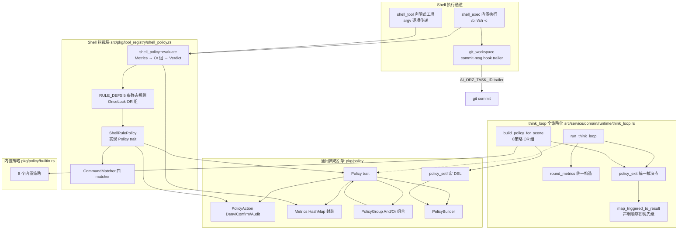

# 策略引擎与 Shell 拦截层

<cite>
**本文引用的文件**
- [src/pkg/policy/mod.rs](src/pkg/policy/mod.rs) — Policy trait 完整定义 + PolicyAction 枚举 + Metrics + PolicyGroup + PolicyBuilder + policy_set! 宏
- [src/pkg/policy/builtin.rs](src/pkg/policy/builtin.rs) — 7 个内置策略：MaxRounds / Timeout / ContextOverflow / UserCancel / TokenBudget / FinalAnswer / ConsecutiveLlmErrors / NoProgress
- [src/pkg/policy/tests.rs](src/pkg/policy/tests.rs) — PolicyAction 动作测试 + policy_set! 宏 DSL 测试 + 内置策略组合测试
- [src/pkg/tool_registry/shell_policy.rs](src/pkg/tool_registry/shell_policy.rs) — ShellRulePolicy 声明式结构 + CommandMatcher 四 matcher + RULE_DEFS 5 条静态规则表 + evaluate 入口
- [src/pkg/tool_registry/shell_exec.rs#L266-L342](src/pkg/tool_registry/shell_exec.rs#L266-L342) — shell_exec call 内 shell_policy::evaluate + env 注入
- [src/pkg/tool_registry/shell_tool.rs#L122-L178](src/pkg/tool_registry/shell_tool.rs#L122-L178) — shell_tool execute_shell_call 内 shell_policy::evaluate
- [src/service/domain/runtime/think_loop.rs#L16-L230](src/service/domain/runtime/think_loop.rs#L16-L230) — round_metrics / policy_exit / build_policy_for_scene / map_triggered_to_result
- [src/pkg/git_workspace.rs](src/pkg/git_workspace.rs) — ensure_workspace_repo + checkpoint_task_commit + commit-msg hook AI_ORZ_TASK_ID/AGENT_ID trailer

**关联 RAG 知识卡**
- [策略引擎 RAG 卡](docs/wiki/knowledge/zh/策略引擎：Policy%20trait%20+%20PolicyGroup%20嵌套组合%20+%20policy_set!%20宏声明式写法%20+%20PolicyAction%20动作上浮%20+%20Shell%20拦截层/策略引擎：Policy%20trait%20+%20PolicyGroup%20嵌套组合%20+%20policy_set!%20宏声明式写法%20+%20PolicyAction%20动作上浮%20+%20Shell%20拦截层.md) — 引擎框架 + 约束红线（**本卡为兄弟视角，策略引擎卡为 SSOT**）
- [Shell 工具全链路 RAG 卡](docs/wiki/knowledge/zh/Shell%20工具全链路：shell_tool%20注册%20+%20shell_policy%20拦截%20+%20shell_exec%20执行/Shell%20工具全链路：shell_tool%20注册%20+%20shell_policy%20拦截%20+%20shell_exec%20执行.md) — shell_exec / shell_tool / shell_policy 三层架构
- [思考循环异常退出兜底总结 RAG 卡](docs/wiki/knowledge/zh/思考循环异常退出兜底总结与错误上报结构化/思考循环异常退出兜底总结与错误上报结构化.md) — abort_summary 兜底路径
- [Agent 思考运行时 RAG 卡](docs/wiki/knowledge/zh/Agent%20思考运行时%20AgentThinkRuntime：挂载清理取消与每轮快照上报/Agent%20思考运行时%20AgentThinkRuntime：挂载清理取消与每轮快照上报.md) — think_runtime.cancel_flag 与 UserCancelPolicy 驱动

**关联 Wiki 长文**
- [运行时领域.md](docs/wiki/zh/content/核心模块/服务层/领域层/运行时领域.md) — think_loop 所在的 Runtime Domain 全景
- [Shell执行工具.md](docs/wiki/zh/content/基础设施/工具注册表/内置工具系统/Shell执行工具.md) — shell_exec 详细安全机制
- [策略引擎设计 Design 文档](docs/design/thinking_task_policy_engine_design.md) — 引擎不感知业务语义的设计哲学

---

## 目录
1. [简介](#简介)
2. [项目结构](#项目结构)
3. [核心组件](#核心组件)
4. [架构总览](#架构总览)
5. [详细组件分析](#详细组件分析)
6. [依赖关系分析](#依赖关系分析)
7. [性能与并发](#性能与并发)
8. [故障排查指南](#故障排查指南)
9. [结论](#结论)
10. [附录：policy_set! 宏 DSL 速查](#附录policy_set-宏-dsl-速查)

## 简介

策略引擎是 pkg 层的通用判断框架（不感知业务语义），解决了两类控制逻辑硬编码分散的问题：

1. **think_loop 退出条件硬编码**（轮次上限/超时/上下文溢出/用户取消/LLM 重试预算）——抽象为 Policy trait + 统一 OR 组 + `policy_exit` 裁决点
2. **Shell 命令拦截硬编码**（scope 结构检查 + 危险命令匹配）——ShellRulePolicy 实现通用 Policy trait + 静态规则表 Or 组

引擎核心三件套：
- **Policy trait**（`evaluate` 返回命中策略 id 列表，`action` 返回可选处置动作，默认 None 向后兼容）
- **Metrics**（HashMap 封装的运行时算子集，think_loop / shell_policy 各自构造注入）
- **policy_set! 声明宏**（消除 `Box::new` 样板，支持纯 OR / 纯 AND / 混合模式三层 DSL）

PolicyAction 三值枚举（Deny/Confirm/Audit）让策略可携带处置动作——PolicyGroup 自动上浮首个命中策略的动作（声明顺序 = 优先级），Shell 拦截层消费此动作短路执行。

## 项目结构

```
pkg/policy/
├── mod.rs            Policy trait + PolicyAction + Metrics + PolicyGroup + PolicyBuilder + policy_set! 宏
├── builtin.rs        7 个内置策略（think_loop 用） + ShellRulePolicy（shell_policy 用，独立文件）
└── tests.rs          单测：PolicyAction 动作 / policy_set! 宏 DSL / 内置策略组合
pkg/tool_registry/
├── shell_policy.rs   ShellRulePolicy 实现 + CommandMatcher + RULE_DEFS 5 条规则表 + evaluate 入口
├── shell_exec.rs     shell_exec 内置工具（call 内 evaluate + env 注入）
└── shell_tool.rs     shell_tool 声明式工具（execute_shell_call 内 evaluate）
pkg/git_workspace.rs  Agent 工作区惰性 git init + commit-msg hook trailer + checkpoint 兜底提交
src/service/domain/runtime/
├── think_loop.rs     round_metrics / policy_exit / build_policy_for_scene / map_triggered_to_result
└── awakening.rs      调用 run_think_loop，传递 policy 参数
```

## 核心组件

| 组件 | 位置 | 职责 |
|------|------|------|
| Policy trait | src/pkg/policy/mod.rs#L52-L83 | 基础判断单元；id/name/condition_desc/required_metrics/evaluate/is_triggered/action；action 默认 None |
| PolicyAction | src/pkg/policy/mod.rs#L21-L43 | 三值枚举 Deny/Confirm/Audit + is_blocking() + reason() 辅助 |
| Metrics | src/pkg/policy/mod.rs#L89-L136 | HashMap 封装 with/get_u64/get_bool/get_f64/get_str/get_str_list |
| PolicyGroup | src/pkg/policy/mod.rs#L149-L276 | 自身实现 Policy；And 全部命中 / Or 任一命中；自动聚合 action（And 全部命中取首个 Some，Or 按声明顺序取首个命中且携带动作的） |
| PolicyBuilder | src/pkg/policy/mod.rs#L282-L328 | with_policy + build(And) / or(Or)；消除手工 Box::new 样板 |
| policy_set! 宏 | src/pkg/policy/mod.rs#L375-L431 | 纯 OR `policy_set! { OR { A(), B() } }` / 纯 AND `policy_set! { AND { A(), B() } }` / 混合模式（平铺策略参与外层 AND，OR/AND {} 子组内部按指定关系） |
| 内置策略 builtin | src/pkg/policy/builtin.rs#L1-L361 | 8 个：MaxRounds / Timeout / ContextOverflow / UserCancel / TokenBudget / FinalAnswer / ConsecutiveLlmErrors / NoProgress |
| ShellRulePolicy | src/pkg/tool_registry/shell_policy.rs#L76-L177 | 声明式结构（id/name/condition_desc/matcher/action/reason）；实现 Policy trait 并覆写 action() 返回 PolicyAction |
| RULE_DEFS | src/pkg/tool_registry/shell_policy.rs#L180-L231 | 5 条静态规则：工作目录越界 Confirm / 身份边界越界 Confirm / 破坏性 fs Confirm / git push-reset-clean Confirm / git commit Audit |
| CommandMatcher | src/pkg/tool_registry/shell_policy.rs#L45-L62 | 四 matcher：ScopeOutsideAllowedPaths / ScopeIdentityBoundary / Regex / Subcommand |
| shell_policy::evaluate | src/pkg/tool_registry/shell_policy.rs#L324-L359 | 适配层入口：构造 Metrics → Or 组 action → PolicyAction.is_blocking 短路 + 放行场景收集 Audit |
| build_policy_for_scene | src/service/domain/runtime/think_loop.rs#L172-L230 | 统一 8 策略 OR 组装配；声明顺序即优先级 |
| policy_exit | src/service/domain/runtime/think_loop.rs#L46-L73 | think_loop 统一退出裁决点；Final 和工具调用都经此 |
| map_triggered_to_result | src/service/domain/runtime/think_loop.rs#L82-L127 | 命中策略 id 列表 → ThinkLoopResult 分派（声明顺序即优先级） |
| round_metrics | src/service/domain/runtime/think_loop.rs#L19-L40 | 统一构造器：round_number/max_rounds/elapsed_secs/total_tokens/context_tokens/tool_calls.{name}/llm_consecutive_errors |

## 架构总览



**策略管线 1：think_loop 退出裁决**

```
每轮循环 → round_metrics 构造 Metrics
        → build_policy_for_scene() 返回 8 策略 Or 组
        → policy_exit(metrics) 调 policy.evaluate(metrics)
        → 命中列表按声明顺序 map_triggered_to_result
          user_cancel → FinalAnswer → ContextOverflow → MaxRounds
          → Timeout → NoProgress → TokenBudget → llm_error_budget
          → 全未命中 → 继续循环
```

**策略管线 2：Shell 命令拦截**

```
shell_exec / shell_tool call 入口
    → shell_policy::evaluate(ShellPolicyInput)
      1. 构造 Metrics（command / working_dir / base_root / user_id / agent_id ...）
      2. RULE_DEFS Or 组 .action(metrics) → 声明顺序上浮首个 PolicyAction
      3. PolicyAction.is_blocking() → Deny/Confirm 短路返回 require_confirmation
      4. Audit 规则收集到 ShellPolicyVerdict.audits
    → 阻断：返回 require_confirmation JSON，不执行
    → 放行：env 注入 AI_ORZ_TASK_ID/AGENT_ID → spawn → 执行
```

## 详细组件分析

### 1. Policy trait + PolicyAction（pkg/policy/mod.rs）

Policy trait 是纯判断框架，禁止在实现里持有 &mut self 或调用 DAO/DAL：

```rust
pub trait Policy: Send + Sync + 'static {
    fn id(&self) -> &str;                       // 唯一 ID（如 "max_rounds"）
    fn name(&self) -> &str;                    // 人类可读
    fn condition_desc(&self) -> &str;         // 条件描述（如 "轮次 >= 365"）
    fn required_metrics(&self) -> Vec<String>; // 声明关注的算子（校验用）
    fn evaluate(&self, metrics: &Metrics) -> Vec<String>; // 返回命中的策略 id 列表
    fn is_triggered(&self, metrics: &Metrics) -> bool { !self.evaluate(metrics).is_empty() } // 默认方法
    fn action(&self, metrics: &Metrics) -> Option<PolicyAction> { None } // 默认 None
}
```

PolicyAction 三值枚举是引擎级通用处置动作——引擎只认识这三个词，不感知具体业务语义（"shell 拦截" / "think_loop 终止"）：

```rust
pub enum PolicyAction {
    Deny(String),    // 拒绝执行
    Confirm(String), // 需要用户确认后才可放行
    Audit(String),   // 放行但记录审计
}
```

向后兼容：action() 默认返回 None——业务侧按命中 id 自行映射。ShellRulePolicy 覆写 action() 返回具体 PolicyAction；think_loop 里的内置策略都**不覆写 action()**（返回 None），由 map_triggered_to_result 按命中 id 做 ThinkLoopResult 分派。

### 2. PolicyGroup 组合与 action 聚合

PolicyGroup 自身实现 Policy trait，支持 And/Or 嵌套。关键是 **action 自动上浮**：

- **And 组**：必须全部子策略命中才上浮，按声明顺序 find_map 取首个 Some；任一未命中 → 整体未命中 → action 返回 None
- **Or 组**：按声明顺序 find_map 遍历，取「首个命中且携带动作」的策略；都未命中 → None

```rust
fn action(&self, metrics: &Metrics) -> Option<PolicyAction> {
    match self.relation {
        PolicyRelation::And => {
            let all_hit = self.policies.iter().all(|p| !p.evaluate(metrics).is_empty());
            if !all_hit { return None; }
            self.policies.iter().find_map(|p| p.action(metrics))
        }
        PolicyRelation::Or => self.policies.iter().find_map(|p| {
            if p.evaluate(metrics).is_empty() { None } else { p.action(metrics) }
        }),
    }
}
```

RULE_DEFS 静态规则表按 Or 组合——声明顺序 = 阻断优先级。破坏性 fs 命令 Confirm 放在 git commit Audit 前面，复合命令 `git commit -m x && git push` 时 push 阻断优先于 commit 审计。

### 3. policy_set! 宏 DSL

三层 DSL 消除手工 `Box::new` + `PolicyBuilder` 样板：

```rust
// 纯 OR（所有策略任一命中即触发）
let policy = policy_set! {
    OR { UserCancelPolicy(flag), MaxRoundsPolicy(365) }
};

// 纯 AND（全部命中才触发）
let policy = policy_set! {
    AND { MaxRoundsPolicy(365), TimeoutPolicy(3600) }
};

// 混合模式（平铺策略参与外层 AND，OR/AND {} 子组内部按指定关系）
// 等价于：MaxRounds AND Timeout AND (UserCancel OR TokenBudget)
let policy = policy_set! {
    MaxRoundsPolicy(365), TimeoutPolicy(3600),
    OR { UserCancelPolicy(flag), TokenBudgetPolicy(10000) }
};
```

### 4. think_loop 全策略化（build_policy_for_scene + policy_exit）

think_loop 的 8 策略统一 OR 组：

```rust
pub(crate) fn build_policy_for_scene(
    agent: &Agent,
    _scene: ThinkingScene,        // 当前统一装配，_scene 保留未使用
    cancel_flag: Arc<AtomicBool>,
) -> Box<dyn Policy> {
    let max_rounds = config_resolve::max_thinking_rounds(agent);
    let timeout_secs = config_resolve::think_timeout_secs(agent);
    let tool_limits: HashMap<String, usize> = agent.tools().iter()
        .filter_map(|t| t.po.config_no_progress_max_calls()
            .map(|limit| (t.po.name.clone(), limit)))
        .collect();
    let token_budget = config::try_get()
        .map(|cfg| cfg.agent.token_budget).unwrap_or(0);

    policy_set! {
        OR {
            UserCancelPolicy(cancel_flag),
            FinalAnswerPolicy(),
            ContextOverflowPolicy(overflow_threshold.unwrap_or(0)),
            MaxRoundsPolicy(max_rounds),
            TimeoutPolicy(timeout_secs),
            NoProgressPolicy(tool_limits),
            TokenBudgetPolicy(token_budget),
            ConsecutiveLlmErrorsPolicy(LLM_ERROR_RETRY_BUDGET),
        }
    }
}
```

`policy_exit` 是 think_loop 的**唯一退出裁决点**——Final 和工具调用两条路径都经此，错误路径（brain_dal think 失败）也过同一策略（`llm_consecutive_errors` 因子）：

```rust
// Final 轮
let metrics = round_metrics(...).with("output_kind", "final");
if let Some(exit) = policy_exit(&ctx, policy, &metrics, ...) { return Ok(exit); }

// 工具调用轮
let metrics = round_metrics(...).with("output_kind", "tool_calls");
if let Some(exit) = policy_exit(&ctx, policy, &metrics, ...) { return Ok(exit); }

// 错误路径
llm_consecutive_errors += 1;
if !policy.evaluate(&metrics).is_empty() {
    return Err(e); // 策略命中，传播错误
}
// 预算内，立即重试
```

### 5. Shell 拦截层（shell_policy::evaluate）

Shell 拦截层是通用 Policy trait 的 shell 领域落地。ShellRulePolicy 覆写 action() 返回 PolicyAction，规则表按 Or 组合：

```rust
pub fn evaluate(input: ShellPolicyInput<'_>) -> ShellPolicyVerdict {
    let mut metrics = Metrics::new()
        .with(keys::COMMAND, input.command)
        .with(keys::WORKING_DIR, input.working_dir.to_string_lossy().into_owned())
        .with(keys::BASE_ROOT, input.base_root)
        .with(keys::ADDITIONAL_ALLOWED_PATHS, input.additional_allowed_paths.to_vec());
    if let Some(uid) = input.user_id { metrics = metrics.with(keys::USER_ID, uid); }
    if let Some(aid) = input.agent_id { metrics = metrics.with(keys::AGENT_ID, aid); }

    let blocking = ruleset().action(&metrics).filter(PolicyAction::is_blocking);

    let audits = if blocking.is_some() { Vec::new() } else {
        let hit_ids = ruleset().evaluate(&metrics);
        RULE_DEFS.iter()
            .filter(|r| r.action == RuleAction::Audit && hit_ids.iter().any(|id| id == r.id))
            .map(|r| (r.id, r.reason)).collect()
    };

    ShellPolicyVerdict { blocking, audits }
}
```

**双执行通道同管线**：shell_exec 和 shell_tool 都调用 `shell_policy::evaluate(ShellPolicyInput)`。拦截逻辑完全一致——scope 越界 Confirm / 身份边界越界 Confirm / 破坏性 fs 命令 Confirm / git push-reset-clean Confirm / git commit Audit。

**env 注入是结构性出口步骤**：两条执行链路都注入 AI_ORZ_TASK_ID / AI_ORZ_AGENT_ID（不可绕），供 git commit-msg hook（pkg/git_workspace.rs）读取追加 Task-Id / Agent-Id trailer。git commit 这条 Audit 规则正是产物锚点产生时刻的审计标记。

### 6. 8 个内置策略一览

| 策略 | id | 评估因子 | 条件 | 禁用条件 | think_loop 映射 |
|------|----|----------|------|----------|-----------------|
| MaxRoundsPolicy | max_rounds | round_number, max_rounds | round ≥ max | 永不禁用 | MaxRoundsExceeded |
| TimeoutPolicy | timeout | elapsed_secs | elapsed ≥ timeout_secs | timeout_secs=0 | MaxRoundsExceeded |
| ContextOverflowPolicy | context_overflow | context_tokens | tokens ≥ threshold | threshold=0 | ContextOverflow |
| UserCancelPolicy | user_cancel | (无) | cancel_flag.load() | 永不禁用 | Cancelled |
| TokenBudgetPolicy | token_budget | total_tokens | tokens ≥ budget | budget=0 | MaxRoundsExceeded |
| FinalAnswerPolicy | final_answer | output_kind | output_kind="final" | 永不禁用 | Final |
| ConsecutiveLlmErrorsPolicy | llm_error_budget | llm_consecutive_errors | errors ≥ budget | budget=0 | 传播错误 |
| NoProgressPolicy | no_progress | tool_calls.{name} | 任一受限工具达上限 | tool_limits 空 | MaxRoundsExceeded |

## 依赖关系分析

```
pkg/policy ← pkg/tool_registry/shell_policy  (ShellRulePolicy 实现 Policy)
pkg/policy ← service/domain/runtime/think_loop  (build_policy_for_scene 用 policy_set!)
shell_policy ← shell_exec / shell_tool  (双执行通道同 evaluate)
shell_policy ← pkg/git_workspace  (env 键 ENV_TASK_ID / ENV_AGENT_ID)
git_workspace ← shell_exec call 内 ensure_workspace_repo
think_loop ← AgentThinkRuntime.cancel_flag → UserCancelPolicy
think_loop → brain_dal → LLM 调用失败 → ConsecutiveLlmErrorsPolicy
```

**层级约束**（严格单向）：
- pkg/policy 是 pkg 层纯框架，只能被上层依赖，禁止反向依赖
- shell_policy 依赖 pkg/policy + pkg/tool_registry/tool_security（crosses_agent_workspace / crosses_user_boundary），不允许依赖 Domain/DAL
- git_workspace 只依赖 pkg/paths + pkg/process，是 best-effort 的基础设施
- think_loop 依赖 pkg/policy + Domain 层（brain_dal），禁止 Domain 层反向依赖 think_loop

## 性能与并发

- **Metrics 构造开销**：think_loop 每轮构造一次（HashMap + serde_json::to_value），O(N) 算子注入，策略 evaluate O(N*M)（N 策略 × M required_metrics 查找）。内置策略数量固定（≤8），开销稳定可忽略。
- **PolicyGroup 自动派生字段**：id/name/condition_desc/required_metrics 在 new 时一次性拼接，后续复用不重新派生。
- **shell_policy 正则缓存**：OnceLock 一次性编译所有 RULE_DEFS 里的 Regex 模式。编译失败 fail-fast（panic），绝不静默跳过。
- **git_workspace 惰性 init**：ensure_workspace_repo best-effort，失败只记日志不阻断 shell_exec 主流程。检查 repo 是否存在走 find_git_root 向上遍历（不超过 base 边界），已是 repo 直接返回根。
- **policy_set! 宏展开**：编译期展开，无运行时开销。

## 故障排查指南

### 1. Policy 命中了但 think_loop 没退出
- 检查 build_policy_for_scene 传的 policy 是否为 None（think_loop 里 policy 参数可选，None 时退化为旧行为）
- 检查 round_metrics 是否漏了某个 key（特别是 Final 轮的 `output_kind="final"`——如果没注入 FinalAnswerPolicy 永远不命中）
- 检查策略 required_metrics 和实际注入的 key 是否一致（大小写敏感，`round_number` vs `rounds` 会 silently miss）

### 2. Shell 命令被 confirm 阻断但不应阻断
- 检查 RULE_DEFS 声明顺序（PolicyGroup action 按声明顺序取首个 Some——如果 scope 规则排在命令规则前面，scope 命中了就不会走到命令规则）
- 检查 working_dir 是否在 base_root 或 additional_allowed_paths 里（ShellExecConfig.additional_allowed_paths 配置缺失会导致合法路径被阻断）
- 检查身份边界（user_id / agent_id 是否传给了 ShellPolicyInput，缺身份时 crosses_user_boundary 会把 users 树视为越界）

### 3. Shell commit 没产生 Task-Id / Agent-Id trailer
- 检查 env 注入（shell_exec / shell_tool 是否把 AI_ORZ_TASK_ID 传进了 process env）
- 检查 ensure_workspace_repo 是否成功 init（repo 根找不到 hook 模板 → git commit 不会追加 trailer）
- 检查 working_dir 路径（ensure_workspace_repo 对 base 外路径直接跳过，git_workspace::ensure_workspace_repo 会返回 None）

### 4. 连续 LLM 失败重试耗尽但没走 abort_summary
- 检查 ConsecutiveLlmErrorsPolicy.budget（默认 LLM_ERROR_RETRY_BUDGET=3，如果策略预算设为 0 则永远不命中 → run_think_loop 直接传播错误 → 调用方走正常 err() 流程而非 abort_summary）
- 检查错误路径是否真的过了 evaluate（brain_dal think 失败后必须先 evaluate，如果策略命中才 return Err(e) 传播错误，否则立即重试）

### 5. think_loop 全是工具调用不结束（疲劳提示没注入）
- 检查 `TOOL_NUDGE_AFTER_CONSECUTIVE_ROUNDS`（默认 8）
- 检查 nudge_injected 标志（已注入一次后设为 true，后续不会重复注入；如果 Agent 被新轮次重启该标志也会重置，这是设计行为）
- 注意疲劳提示只是 System 消息，**不强制退出**——如果模型忽略该提醒继续调工具，最终由 NoProgressPolicy / MaxRoundsPolicy 触发退出

## 结论

策略引擎从硬编码的 think_loop 控制逻辑演变为通用 Policy trait + PolicyGroup 组合 + PolicyAction 动作机制，覆盖了 think_loop 退出裁决 + Shell 命令拦截两大业务域。核心设计决策：

1. **引擎不感知业务语义**——Policy trait 只认 Metrics（HashMap）和 PolicyAction（三值枚举），think_loop 和 Shell 拦截各自注入不同的 Metrics 键
2. **声明顺序即优先级**——Or 组 evaluate 按声明顺序返回命中列表，PolicyGroup.action 按声明顺序上浮首个 Some，map_triggered_to_result 按列表顺序分派
3. **action() 默认 None 向后兼容**——旧内置策略不覆写 action()，think_loop 按命中 id 自行映射 ThinkLoopResult；ShellRulePolicy 覆写 action() 返回 PolicyAction，evaluate 短路执行
4. **废弃 PolicyMixed 硬软分层**——本轮迭代简化为单一 Or 组 + 统一 policy_exit，Final 轮也走策略裁决（FinalAnswerPolicy），不再分层处理

## 附录：policy_set! 宏 DSL 速查

| DSL | 等价 | 适用场景 |
|-----|------|----------|
| `policy_set! { OR { A(), B() } }` | `PolicyBuilder::new().with_policy(A::new()).with_policy(B::new()).or()` | 任一策略命中即触发（think_loop 退出裁决、Shell 拦截层都用这种）|
| `policy_set! { AND { A(), B() } }` | `PolicyBuilder::new().with_policy(A::new()).with_policy(B::new()).build()` | 全部策略命中才触发（严格模式） |
| `policy_set! { A(), B(), OR { C(), D() } }` | `PolicyBuilder::new().with_policy(A::new()).with_policy(B::new()).with(PolicyBuilder::new().with_policy(C::new()).with_policy(D::new()).or()).build()` | 混合：外层 AND，子组内部 OR |

约束：policy_set! 宏自动调用 `$Policy::new($($arg),*)`，所有内置策略必须暴露 `pub fn new(...)` 构造器并返回 Self（不可返回 Result）。特殊构造场景直接使用 PolicyBuilder。
