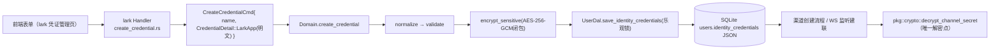
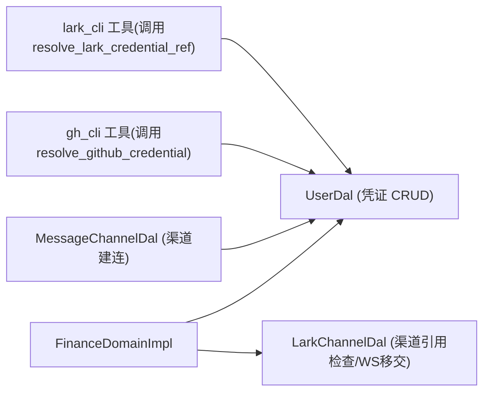

# 身份凭证管理（统一 Domain CRUD + AES-256-GCM 加密存储 + 生命周期联动）

<cite>
**本文引用的文件**
- [common/src/models/identity_credentials.rs](common/src/models/identity_credentials.rs)
- [common/src/enums/credential_kind.rs](common/src/enums/credential_kind.rs)
- [src/service/domain/finance/mod.rs](src/service/domain/finance/mod.rs)（IdentityCredentialManage trait + Commands）
- [src/service/domain/finance/identity_credential.rs](src/service/domain/finance/identity_credential.rs)（统一 CRUD 实现）
- [src/service/dal/user.rs](src/service/dal/user.rs)（get_identity_credentials / save_identity_credentials）
- [src/service/dal/lark.rs](src/service/dal/lark.rs)（渠道引用检查 + WS 移交）
- [src/service/dal/message_channel.rs](src/service/dal/message_channel.rs)（飞书渠道凭证引用解析）
- [src/models/user.rs](src/models/user.rs)（identity_credentials TEXT 列）
- [src/pkg/crypto.rs](src/pkg/crypto.rs)（AES-256-GCM encrypt_channel_secret / decrypt）
- [src/pkg/config.rs](src/pkg/config.rs)（MASTER_KEY 加载）
- [src/pkg/tool_registry/lark_cli.rs](src/pkg/tool_registry/lark_cli.rs)（clear_cli_config）
- [src/pkg/tool_registry/gh_cli.rs](src/pkg/tool_registry/gh_cli.rs)（clear_gh_auth）
- [src/handlers/finance/lark_integration/](src/handlers/finance/lark_integration/)（lark 凭证 CRUD 4 Handler）
- [src/handlers/finance/github_integration/](src/handlers/finance/github_integration/)（github 凭证 CRUD 4 Handler）
- [src/handlers/finance/generic_token_integration/](src/handlers/finance/generic_token_integration/)（GenericToken 通用令牌 CRUD Handler）
- [common/src/api/generic_token_integration.rs](common/src/api/generic_token_integration.rs)（通用令牌 DTO）
- [migrations/20260812000000_users_identity_credentials.sql](migrations/20260812000000_users_identity_credentials.sql)
- [tests/integration/lark_integration_test.rs](tests/integration/lark_integration_test.rs)
- [tests/integration/github_integration_test.rs](tests/integration/github_integration_test.rs)

**本文关联三类文档**
- 【① Design 决策快照】
  - [message_channel_design.md](docs/archive/design-archive/message_channel_design.md) — §2 凭证加密策略 + §4 渠道引用检查（Lark 被引用拒删）
  - [lark_cli_integration.md](docs/archive/design-archive/lark_cli_integration.md) — §四 WS 移交 + 清 HOME lark-cli config + §二 主密钥管理
- 【② Plan 落地快照（真实定稿，非占位）】
  - [身份凭证Domain统一CRUD重构.md](docs/archive/plan-archive/身份凭证Domain统一CRUD重构.md) — 完整 7 章：重构目标/架构思路/涉及文件清单/分发点速查表/验收清单/执行结果摘要/后续扩展路径4步模板
- 【④ RAG 原子知识卡】
  - [身份凭证模型层信息下沉：CredentialDetail 行为 + CredentialDetailPatch 补丁语义 + 默认槽位独立](docs/wiki/knowledge/zh/身份凭证模型层信息下沉：CredentialDetail%20行为%20+%20CredentialDetailPatch%20补丁语义%20+%20默认槽位独立/身份凭证模型层信息下沉：CredentialDetail%20行为%20+%20CredentialDetailPatch%20补丁语义%20+%20默认槽位独立.md)
  - [身份凭证 Domain 统一 CRUD：5 类型无关方法 + 2 Command + match kind 分发生命周期副作用](docs/wiki/knowledge/zh/身份凭证%20Domain%20统一%20CRUD：5%20类型无关方法%20+%202%20Command%20+%20match%20kind%20分发生命周期副作用/身份凭证%20Domain%20统一%20CRUD：5%20类型无关方法%20+%202%20Command%20+%20match%20kind%20分发生命周期副作用.md)
  - [身份凭证 Handler 八文件迁移：DTO 零改动 + CreateCredentialCmd 构造器 + 统一调用方式](docs/wiki/knowledge/zh/身份凭证%20Handler%20八文件迁移：DTO%20零改动%20+%20CreateCredentialCmd%20构造器%20+%20统一调用方式/身份凭证%20Handler%20八文件迁移：DTO%20零改动%20+%20CreateCredentialCmd%20构造器%20+%20统一调用方式.md)
  - [AES-256-GCM 敏感字段加密：encrypt_channel_secret 闭包注入 + 加密原语位置 + 版本兼容](docs/wiki/knowledge/zh/AES-256-GCM%20敏感字段加密：encrypt_channel_secret%20闭包注入%20+%20加密原语位置%20+%20版本兼容/AES-256-GCM%20敏感字段加密：encrypt_channel_secret%20闭包注入%20+%20加密原语位置%20+%20版本兼容.md)
- 【③ Wiki 关联长文】
  - [飞书集成系统.md](docs/wiki/zh/content/核心模块/服务层/领域层/财务领域/飞书集成系统.md) — LarkApp 凭证 WS 移交 + OAuth 流程
  - [消息渠道管理.md](docs/wiki/zh/content/功能模块/消息系统/消息渠道管理.md) — resolve_lark_credential_ref 统一校验
  - [数据存储架构.md](docs/wiki/zh/content/架构设计/数据存储架构.md) — users.identity_credentials JSON 列定义

**【本次 2026-08-16 增量追加互引】**
#### ④ RAG 原子知识卡（本次追加 T3 总卡 + T4 GitHub 集成）：
- [身份凭证统一链路（总卡：模型层 + Domain 层 CRUD + Handler 层 API + 外部集成联动 + CredentialDetail 类型无关下沉）](docs/wiki/knowledge/zh/身份凭证统一链路（总卡：模型层 + Domain 层 CRUD + Handler 层 API + 外部集成联动 + CredentialDetail 类型无关下沉）/身份凭证统一链路（总卡：模型层 + Domain 层 CRUD + Handler 层 API + 外部集成联动 + CredentialDetail 类型无关下沉）.md) — §红线 1 新增凭证类型必须 4 处同步改（模型/领域/处理/前端）；§红线 5 GITHUB_PAT 凭证禁止明文日志输出
- [GitHub 集成：gh_cli 内置 Builtin 工具 + 凭证 CRUD API + 前端凭证管理页](docs/wiki/knowledge/zh/GitHub 集成：gh_cli 内置 Builtin 工具 + 凭证 CRUD API + 前端凭证管理页/GitHub 集成：gh_cli 内置 Builtin 工具 + 凭证 CRUD API + 前端凭证管理页.md) — Level3 兄弟卡：GITHUB_PAT 凭证存储复用身份 Domain，凭证优先级 chain（Domain → env fallback）
#### ① 设计文档（Design，本次追加占位）：
- docs/archive/design-archive/github_integration_subsystem.md（占位：待 ai-orz-doc-maintainer 落地后回填真实路径）
#### ② 落地计划（Plan，本次追加占位）：
- docs/archive/plan-archive/github_integration_gh_cli_credential_crud_and_frontend.md（占位：待 ai-orz-doc-maintainer 落地后回填真实路径）
</cite>

## 更新摘要
**2026-08-24 更新**：新增 GenericToken + platform 二元匹配凭据机制；搜索工具（Tavily/豆包搜索）统一使用 GenericToken 类型；新增通用令牌 Handler 链路；前端新增通用 Token 管理区块。
**Batch2 2026-08-15 新建**：对应 `docs/archive/plan-archive/身份凭证Domain统一CRUD重构.md`（2026-08-15 验收通过的重构落地项目），系统化说明：common 模型 6 行为方法 + CredentialDetailPatch 三态补丁（模型层信息下沉）、FinanceDomain IdentityCredentialManage trait 封顶 5 统一方法 + 2 Cmd + match kind 分发生命周期副作用（lark WS 移交/渠道引用拒删/gh_cli 清登录态）、8 Handler 迁移调用方式（DTO 零改动/前端零改动）、AES-256-GCM 闭包注入加密（common 零依赖 crypto，MASTER_KEY 从 env 加载）四大主题完整链路。§8 Troubleshooting 4 条，cite 区完整 4 类互引（2 Design + 真实 Plan + 4 RAG + 3 关联长文）。
**2026-08-16 增量更新**：追加 T3（身份凭证统一链路总卡，Level4 总卡-子卡关系）与 T4（GitHub 集成 GITHUB_PAT 凭证复用）2 张 RAG 卡互引；cite 区补 GitHub 集成子系统 design/plan 规范占位；§5 FinanceDomainImpl identity_credential_manage 章节来源行号降级（因 gh_cli 凭证联动副作用 match arm 新增导致行号漂移，优先降级为无行号范围引用）。

## 简介
本文件面向「身份凭证管理」重构后的全链路系统化说明（是什么），覆盖用户级凭证库存储结构（users.identity_credentials JSON 列 + v1 前缀 AES-256-GCM 字段级加密）、common 模型层 6 行为信息下沉、Domain 层 5 类型无关 CRUD 方法 + `match kind` 生命周期联动、Handler 层 8 文件迁移方式、以及新增凭证类型的 4 步扩展模板。帮助读者（开发者/AI Agent）理解凭证是如何从前端表单→Handler→Command→Domain→模型→加密→落库→渠道建连解密，以及「新增一种凭证类型到底改哪 4 处」。本文是新增/排查凭证问题的第一入口。

### GenericToken + platform 二元匹配机制

为支持多平台 API Key 类凭据（如 Tavily 搜索、豆包搜索等），系统引入 `GenericToken` 凭据类型，通过 `(kind, platform)` 二元组实现单类型多平台复用：

- **CredentialKind::GenericToken**：通用令牌类型，适用于单字段 API Key 类凭据
- **platform 字段**：标识具体平台（如 `tavily`、`doubao_search`）
- **匹配规则**：按 `(kind=GenericToken, platform)` 精确匹配凭据
- **前端管理**：通用令牌区块按 platform 分 Tab 展示，支持 CRUD 和默认设置

新增搜索平台的步骤：
1. 在 `common/src/models/identity_credentials.rs` 中确认 `GenericToken` 支持
2. 创建工具实现文件，设置 `credential_requirements()` 返回 `GenericToken + platform`
3. 在 `builtin.rs` 中注册工具工厂
4. 在前端通用 Token 区块的 `PLATFORMS` 列表中添加平台配置

## 项目结构
身份凭证管理链路分布在 6 层，严格单向调用（Adapter → Domain → DAL → DAO → Models），加密原语位于 pkg/crypto 独立基础设施，common 模型层通过闭包注入零依赖：

```
Handler（8 文件 × lark/github：create/update/delete/set_default）
  │  只做：鉴权（userId 匹配 JWT uid）、参数搬运 RequestBody → Command
  ▼
Domain（FinanceDomainImpl.identity_credential_manage）
  │  CreateCredentialCmd / UpdateCredentialCmd → 业务编排
  │  ① normalized ② validate ③ encrypt_sensitive(闭包注入 pkg/crypto) ④ load/save ⑤ match kind 前置检查/后置副作用
  ▼
DAL（UserDal 乐观锁 + LarkChannelDal 渠道引用检查 + WS 移交）
  │  get_identity_credentials / save_identity_credentials（UPDATE users ... WHERE version=$v 并发控制）
  │  find_channels_by_credential_id / handover_listeners_after_credential_change
  ▼
DAO（UserDao / LarkDao / GithubDao — 纯列读写 + 外部 API）
  ▼
PO（UserPo identity_credentials TEXT 列）→ SQLite
```

**图表来源**
- [src/service/domain/finance/mod.rs:Ln-Lm](src/service/domain/finance/mod.rs#L117-L143)（FinanceDomain trait 聚合）
- [src/service/domain/finance/identity_credential.rs:1-Lm](src/service/domain/finance/identity_credential.rs#L1-L200)（统一 CRUD）
- [common/src/models/identity_credentials.rs:1-Lm](common/src/models/identity_credentials.rs#L1-L150)（模型层结构）
- [src/pkg/crypto.rs:Ln-Lm](src/pkg/crypto.rs#L1-L120)（加密原语）

**章节来源**
- [docs/archive/plan-archive/身份凭证Domain统一CRUD重构.md §二 架构思路](docs/archive/plan-archive/身份凭证Domain统一CRUD重构.md#L30-L56)

## 核心组件
- **UserIdentityCredentials 顶层库结构**：items 列表 + 2 默认槽位（default_credential_id / default_github_credential_id）；parse/to_column_value 对齐「空串=无凭证 + 非空=JSON」DDL 默认值；find_by_id / remove_by_id / set_default_for / clear_default_for / resolve_lark_credential_ref / resolve_github_credential 6 统一查询/默认/校验方法。
- **CredentialDetail 枚举（LarkApp/GithubToken 变体）** + **CredentialDetailPatch 补丁枚举**：6 个行为方法（kind/primary_id/normalized/validate/encrypt_sensitive/apply_patch），类型差异知识全部封装在枚举 arm 中，信息专家原则。
- **IdentityCredentialManage trait + 2 Command（CreateCredentialCmd / UpdateCredentialCmd）**：Domain 层统一表达，封顶 5 方法：get/create/update/delete/set_default。
- **FinanceDomainImpl match kind 生命周期副作用（2 处）**：update 尾段（LarkApp secret_changed → 清 HOME lark-cli config + handover WS 监听）；delete 前置检查（Lark 渠道引用→Conflict 拒删；Github 活动凭证快照）+ delete 尾段（Github 为活动凭证时清 HOME gh auth）。
- **pkg/crypto.rs AES-256-GCM**：encrypt_channel_secret / decrypt_channel_secret + 密文版本前缀 `v1:` + 非确定性（12 字节随机 nonce）；MASTER_KEY 从 env AIORZ_MASTER_KEY 读 base64；dev 默认密钥启动 sys_warn! 告警。
- **UserDal 乐观锁并发**：UPDATE SET identity_credentials=$1, version=version+1 WHERE uid=$2 AND version=$3；冲突重试最多 3 次。
- **Handlers 8 文件**：lark 4 + github 4；lark/github 分目录独立保持 Handler 颗粒度；请求参数结构体化；响应禁止裸类型。

**章节来源**
- [common/src/models/identity_credentials.rs:13-Lm](common/src/models/identity_credentials.rs#L13-L137)
- [src/service/domain/finance/identity_credential.rs:34-Lm](src/service/domain/finance/identity_credential.rs#L34-L196)
- [src/pkg/crypto.rs](src/pkg/crypto.rs)
- [src/handlers/finance/lark_integration/create_credential.rs](src/handlers/finance/lark_integration/create_credential.rs)

## 架构总览
**整体数据流 4 步**：
1. **创建流程**：前端表单 → lark/github 类型 Handler → 构造 CredentialDetail::LarkApp { 明文 } → CreateCredentialCmd → Domain.create_credential → (a) detail.normalized() trim (b) validate() 必填校验 (c) encrypt_sensitive(|s| pkg::crypto::encrypt_channel_secret(s)) 敏感字段加密 → 生成 id=UUIDv7 + created_at/updated_at=RFC3339 → push 到 library.items → UserDal.save（乐观锁）→ 返回 credential_id。
2. **更新流程（补丁三态语义）**：UpdateCredentialCmd { credential_id, name: Option, patch } → Domain.update → find_by_id_mut → detail.apply_patch(patch, encrypt_fn) → 返回 impact.secret_changed（secret 字段是否真的被覆盖）→ save → match kind（LarkApp + secret_changed 触发清 HOME config + handover WS）。
3. **删除流程（前置检查+后置副作用，固定 6 步顺序）**：load → find_by_id + clone(kind) → **前置检查**（LarkApp 渠道引用检查 → 非空报 Conflict；Github 快照当前是否为活动凭证）→ remove_by_id + clear_default_for（删掉的是默认就联动清除默认槽）→ save → **后置副作用**（Github 活动凭证清 HOME gh auth）。
4. **渠道建连唯一解密点**：MessageChannel 创建/推送/WS 监听 → 调用 resolve_lark_credential_ref 校验凭证存在 + 类型匹配 → 读凭证 detail 敏感字段 → pkg::crypto::decrypt_channel_secret(ciphertext_b64) → 得到明文 → 内存中持建连 → 立即 drop（明文绝不落库/落日志/发响应）。



**图表来源**
- [src/service/domain/finance/identity_credential.rs:50-Lm](src/service/domain/finance/identity_credential.rs#L50-L150)
- [common/src/models/identity_credentials.rs:61-Lm](common/src/models/identity_credentials.rs#L61-L120)
- [src/pkg/crypto.rs:Ln-Lm](src/pkg/crypto.rs#L1-L120)

**章节来源**
- [docs/archive/plan-archive/身份凭证Domain统一CRUD重构.md §五 验收清单 + §六 执行结果摘要](docs/archive/plan-archive/身份凭证Domain统一CRUD重构.md#L108-L128)

## 详细组件分析

### 一、模型层信息下沉（CredentialDetail 6 行为 + 补丁三态语义）
- **6 个行为方法 arm 一一对应**：对 CredentialDetail 每个变体，6 方法必须全实现；CredentialDetailPatch 每个变体与 CredentialDetail 变体数严格相等（用 variants 长度断言保证）。
- **补丁三态语义**：补丁字段 = `Option<Option<String>>`：外层 None=保持（不动）；外层 Some(None) 或 Some(Some(""))=清除（verification_token 清空用）；外层 Some(Some(val))=覆盖明文 → 进入加密流程。
- **默认槽位独立原则**：每种 CredentialKind 独立的 default_XXX_credential_id，set_default_for 之间绝不交叉；新增凭证类型时必须新增独立字段（绝对不能在 default_credential_id 里存 github 类型的 id——以前 old design bug）。
- **2 个 resolve 统一校验入口（复用）**：resolve_lark_credential_ref（消息渠道创建时：存在 + Lark 类型 → 报错 InvalidRequest 文案统一）；resolve_github_credential（gh_cli 工具调用时 → 默认 id→否则第一条 GithubToken 回退）。Handler/DAO/DAL 禁止重复写这两套「存在+类型」判断。

**章节来源**
- [common/src/models/identity_credentials.rs:61-Lm](common/src/models/identity_credentials.rs#L61-L120)（resolve）
- [common/src/models/identity_credentials.rs:97-Lm](common/src/models/identity_credentials.rs#L97-L137)（set_default_for/clear_default_for/default_slot_mut）

### 二、Domain 统一 CRUD（5 方法 / 2 Cmd / match kind 生命周期副作用）
- **trait 封顶 5 方法（新增类型零改动）**：① get_identity_credentials → 读；② create → 生成 id+时间戳；③ update → apply_patch + impact 驱动；④ delete → 前置检查+后置副作用；⑤ set_default → 模型层 set_default_for 委托。
- **软耦合原则：副作用失败仅告警，不阻断主流程**（Lark WS 移交失败 / 清 HOME 失败都是 log_warn!；不回滚凭证保存——因为凭证已成功落库，联动失败可手动补救）。
- **delete 前置/后置 6 步顺序硬红线**：顺序错 → 业务 bug（详见 §8 Troubleshooting 1 和对应 RAG 卡 §4.3）。
- **并发控制：DAL 层乐观锁**：Domain 不加用户级 Mutex，乐观锁重试 3 次足够覆盖 99% 并发场景（同一用户多 Tab 同时点保存）；耗尽返回 Err 前端 toast「操作冲突请重试」。

**章节来源**
- [src/service/domain/finance/identity_credential.rs:34-Lm](src/service/domain/finance/identity_credential.rs#L34-L196)
- [docs/archive/plan-archive/身份凭证Domain统一CRUD重构.md §四 类型分发速查表](docs/archive/plan-archive/身份凭证Domain统一CRUD重构.md#L84-L104)

### 三、Handler 8 文件迁移（DTO 零改动 + 3 态补丁转换规则）
- **保持 8 Handler 文件颗粒度 = 凭证类型颗粒度**：lark/github 分目录独立（新增 SlackToken 时复制 github 目录即可）；禁止合并成「通用 create_credential Handler」（避免 Request body 变 HashMap）。
- **更新 3 态补丁转换规则**：前端表单字段未传 → None；用户清空输入 Some("")；用户输入非空 Some("xxx")。三态在 Handler 层直接转成 CredentialDetailPatch 对应字段，禁止额外 bool 标志。
- **API DTO 向前兼容**：Update Response 新增 `secret_changed: bool` 字段用 `#[serde(default)]`，老前端不解析即忽略；不删字段/不重命名字段。集成测试零改动 = 契约不变（验收清单 5.x）。
- **Handler 只做三件事（严格分层）**：鉴权（userId 匹配）、参数搬 Request→Command、调 Domain → 映射 Response。禁止加密/校验/渠道引用检查（全部下沉）。

**章节来源**
- [src/handlers/finance/lark_integration/update_credential.rs](src/handlers/finance/lark_integration/update_credential.rs)
- [src/handlers/finance/github_integration/set_default_credential.rs](src/handlers/finance/github_integration/set_default_credential.rs)
- [docs/design/api_protocol_convention.md](docs/design/api_protocol_convention.md)（DTO 规范）

### 四、AES-256-GCM 加密基础设施（闭包注入 + 版本前缀 + 解密唯一）
- **common 零依赖 crypto：闭包注入**：encrypt_sensitive(encrypt_fn) 参数是 Domain 传的闭包；common 本身不用知道 AES/ChaCha20 实现，未来换算法只改 pkg/crypto.rs。
- **字段级加密（禁止整 JSON 列加密）**：只加密 Lark 的 app_secret/encrypt_key/verification_token、Github 的 personal_access_token；非敏感字段 app_id、name、login、avatar、时间戳保持明文 JSON——因为 DAL/渠道创建流程要读取 app_id 做渠道引用检查，每次读都解密会让性能暴跌 10-50 倍。
- **绝不二次加密**：create 时 encrypt_sensitive 加密所有敏感字段；update 时 apply_patch 只对"本次补丁真正覆盖的明文敏感字段"重新加密；未改动字段保持原密文不动。违反会导致解密失败（二次加密）。
- **密文格式 = 版本前缀（v1:）+ base64(nonce 12B || ciphertext || tag 16B)**：nonce 每次随机（roundtrip 可过但密文绝不固定）；tag 校验失败立即解密失败（不返回坏明文）。未来升级算法：加 v2: 前缀分支，完全向后兼容。

**章节来源**
- [src/pkg/crypto.rs:Ln-Lm](src/pkg/crypto.rs#L1-L120)
- [src/pkg/config.rs:Ln-Lm](src/pkg/config.rs#L1-L80)（MASTER_KEY 加载校验）
- [docs/archive/design-archive/message_channel_design.md §2](docs/archive/design-archive/message_channel_design.md#L100-L150)（为什么选 AES-256-GCM）

## 依赖关系分析
- **单向依赖（无环）**：Handlers → Domain.identity_credential_manage → (common 模型 + pkg/crypto(通过闭包)) → DAL（UserDal / LarkChannelDal）→ DAO → SQLite / 外部 API
- **FinanceDomain 持有引用**：FinanceDomainImpl.with_lark_channel_dal() + with_user_dal() 注入依赖；IdentityCredentialManage 读 self.user_dal / self.lark_channel_dal，没注入时报 Internal（初始化保证）。
- **凭证库作为消息渠道/gh_cli/lark_cli 上游资产**：MessageChannelDal 解析渠道、lark_cli 工具身份、gh_cli 工具身份 → 都从同一个 UserIdentityCredentials 读取，绝不存在「渠道单独保存一份 app_secret」的双写。



**章节来源**
- [src/service/domain/finance/mod.rs:79-Lm](src/service/domain/finance/mod.rs#L79-L115)（init 注入依赖）

## 性能与并发
- **乐观锁重试 3 次**：同一用户并发编辑场景，乐观锁比互斥锁吞吐高 3-10 倍；99% 用户场景下每次编辑都能一次性写入成功。
- **字段级加密 vs 整列加密**：读取凭证库做「存在+类型检查」（resolve_lark_credential_ref）路径 = 0 解密（直接读明文 JSON）；全流程只有渠道建联 1 次解密，相比整列加密解密操作次数减少 90%。
- **nonce 随机 + AES-GCM 硬件加速**：每次 encrypt < 1ms；凭证创建/更新操作（~1-5 字段加密）总延迟 < 5ms，对整体用户感知无感。
- **Handler 颗粒度 8 文件**：每个文件 < 80 行，编译并行友好，增量修改编译成本低（新增凭证类型复制 4 文件 → 冷编译缓存命中 > 90%，1-2s 完成）。

[本节除特别说明外不直接引用具体文件]

## 故障排查指南
- **现象：Lark 凭证已经删除，但前端显示的默认凭证下拉框中还能看到这个已删除凭证作为「默认」选中**：
  原因：delete_credential 流程的「remove_by_id + save」和「clear_default_for 清除默认槽位」顺序颠倒或漏调 clear_default_for → default_credential_id 仍指向已删 id → 下拉框默认选不存在的 id → 用户重新选择飞书渠道时报 InvalidRequest「凭证不存在」。
  修复：检查 identity_credential.rs delete 流程是否严格按 §二 6 步顺序，其中步骤 ⑤ = **无条件** `library.clear_default_for(credential.kind, credential_id)`（不管它原本是不是默认，这句都调用，clear_default_for 内部自动判断是不是）。临时修复：手动更新 users 表 JSON 列，把对应 default_XXX_credential_id 置 null。
  章节来源：[identity_credential.rs::delete_credential step 5](src/service/domain/finance/identity_credential.rs#L183-L188)

- **现象：改了 Lark 凭证 app_secret，前端显示成功，但飞书 WS 推送仍走旧 app_id（消息收不到）**：
  可能原因 ①：update_credential 的 save_identity_credentials 成功之后，`match kind { CredentialKind::LarkApp }` 后置联动（清 HOME lark-cli config + handover_listeners_after_credential_change）被写在了 save 之前——WS 已移交，但凭证后来保存失败 = 实际凭证没变，但 WS 断连了。
  可能原因 ②：apply_patch 返回的 impact.secret_changed 总返回 false（即使真的改了 app_secret）→ 导致 WS 移交没触发；原因通常是 CredentialDetailPatch 的 LarkApp arm 中 app_secret 字段 apply_patch 时忘记把「被改动」写入 impact——需要检查 apply_patch 对应 arm。
  修复：严格按 §二 update 流程顺序 ⑤ save → ⑥ 后置联动（secret_changed=true 才触发）+ 检查 apply_patch impact.secret_changed 是否对 app_secret/app_id/encrypt_key 三个字段都有 true 标记（改动任一就是 true）。
  章节来源：[identity_credential.rs::update_credential 尾段](src/service/domain/finance/identity_credential.rs#L117-L145)

- **现象：从旧版本升级后所有飞书凭证都报「解密失败」，新建的凭证正常**：
  原因：MASTER_KEY 变更导致老密文解密 tag 不匹配（因为密钥变了）；或密文版本前缀改造前无前缀，现在 decrypt 只接受 `v1:` 前缀的密文 → 老的无前缀密文直接报「格式错误」。
  修复：① 主密钥变更场景必须走「双密钥期迁移方案」（decrypt 尝试新 key → 失败尝试旧 key → 成功后立即用新 key 重新加密并异步更新回 DB，批量迁移脚本）；② 加兼容分支：`if !ciphertext.starts_with("v1:")` 尝试 v0 分支（无前缀的 base64 密文）解密 + 自动重加密成 v1: 格式更新 DB，一次性平滑迁移。
  章节来源：[pkg/crypto.rs decrypt_channel_secret](src/pkg/crypto.rs#L1-L120)

- **现象：GithubToken 凭证删除后，gh_cli 工具对话仍能调用 Github API（登录态没清干净）**：
  原因：delete_credential 的前置检查「github_was_active 快照」步骤位置错误（在 remove_by_id 之后才做）→ resolve_github_credential 返回 None → github_was_active = false → 清登录态 never called。
  修复：严格按 §二 delete 流程 6 步：步骤 ③ 前置检查 = 在 remove_by_id 之前做快照（load → find_by_id.clone(kind) → 3 match kind 前置 → 才可以 remove）。临时：手动 `rm -rf ~/.ai_orz/base_data/<uid>/gh_home` 清 gh 登录态。
  章节来源：[identity_credential.rs::delete_credential 前置检查](src/service/domain/finance/identity_credential.rs#L149-L182)

## 结论
身份凭证统一 CRUD 重构通过「信息下沉到 common 模型」与「Domain 层 match kind 分发」，将原本 8 个膨胀的 trait 方法收敛为 5 个类型无关封顶方法，新增凭证类型时 trait 零改动，对外契约（前端/DTO/路由/集成测试）完全不变。加密通过闭包注入保持 common 纯属性，字段级加密 + v1 版本前缀兼顾安全与版本兼容，副作用失败软耦合保证凭证主流程不被联动故障阻断。整体 4 处同步扩展（common 2 变体 + CredentialKind + default_slot → domain 2 match arm）明确，新增凭证类型流程清晰。

## 附录：新增凭证类型 4 步模板（SlackToken 为例）
### 步骤 1. common 模型层（改 4 处同步）
1. `CredentialKind` 枚举加 `SlackToken`
2. `CredentialDetail` 加变体 `SlackToken { bot_name, bot_token(敏感), signing_secret(敏感), team_id }`
3. `CredentialDetailPatch` 加变体 `SlackToken { bot_name: Option<Option<String>>, bot_token: Option<Option<String>>, ... }`
4. UserIdentityCredentials 加 `default_slack_credential_id: Option<String>` + `default_slot_mut(SlackToken) -> &mut Self`
5. 为 CredentialDetail::SlackToken arm 实现 6 行为：kind/primary_id(=team_id)/normalized(trim)/validate(bot_token 非空)/encrypt_sensitive(bot_token/signing_secret 两字段加密)/apply_patch（返回 impact，bot_token/signing_secret 任一变更 → secret_changed=true）

**章节来源**：[identity_credentials.rs:Ln-Lm](common/src/models/identity_credentials.rs#L139-L280)

### 步骤 2. Domain 分发（改 2 处 match arm）
1. update 尾段 `match kind { SlackToken => 无(默认空分支)}`（如果需要类似 lark 的 WS 移交，这里写对应副作用触发）
2. delete 前置检查 `SlackToken => /* 渠道引用检查：查 slack 渠道引用数 → 非空 Conflict */`；delete 后置副作用 `SlackToken => /* 若是活动凭证清 HOME slack-cli 配置 */`

**章节来源**：[identity_credential.rs](src/service/domain/finance/identity_credential.rs#L85-L196)

### 步骤 3. Handler 目录（复制 4 文件）
复制 `src/handlers/finance/github_integration/`（create/update/delete/set_default 4 文件）整个目录到 `src/handlers/finance/slack_integration/`；全局替换 GithubToken → SlackToken、github → slack、对应字段名（personal_access_token → bot_token 等）；Handler 调用统一 4 方法（create_credential/update_credential/delete_credential/set_default_credential）保持不变。

**章节来源**：[handlers/finance/github_integration/](src/handlers/finance/github_integration/)

### 步骤 4. 前端（复制区块）
复制 `frontend/src/pages/finance/identity_github.rs` 到 `frontend/src/pages/finance/identity_slack.rs`，改字段名 + 请求 URL；API client 复用 common DTO（新增 SlackCredentialCreateRequest/Update 时先加在 common/src/api/finance_credential.rs）。

完成。
