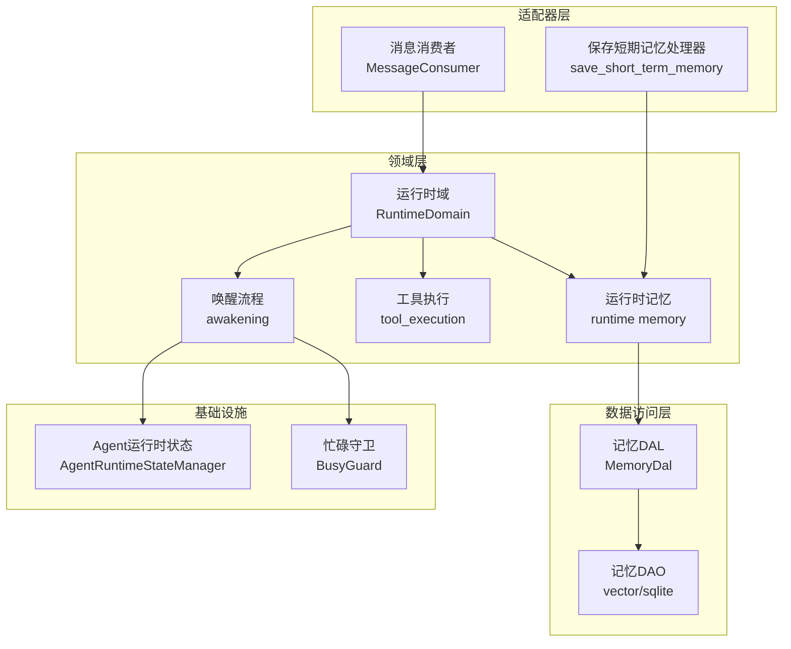
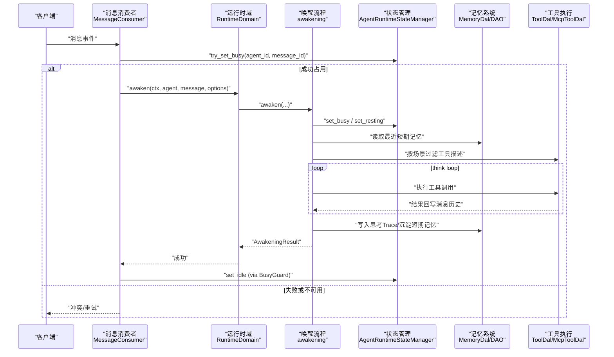
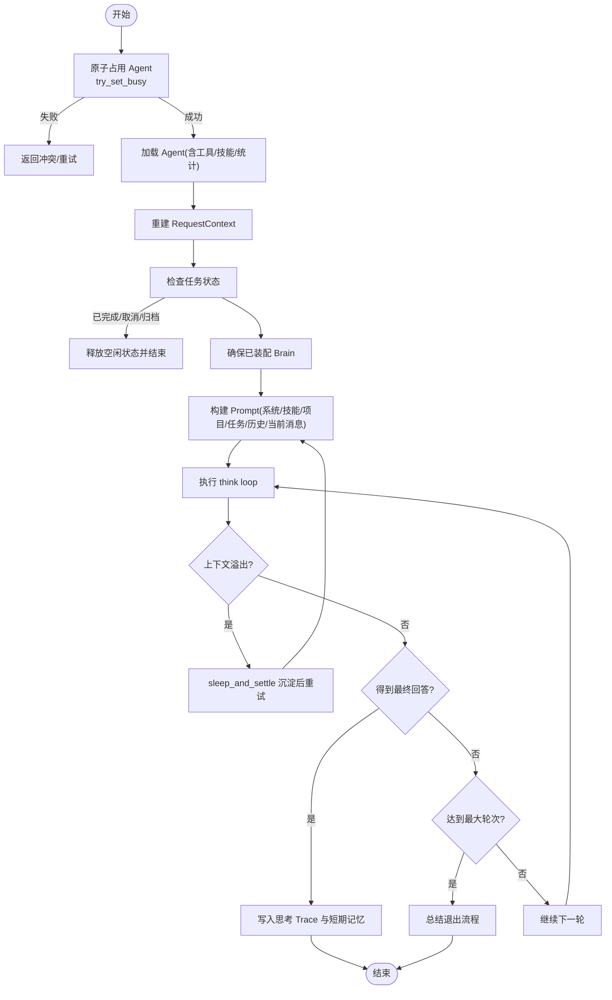
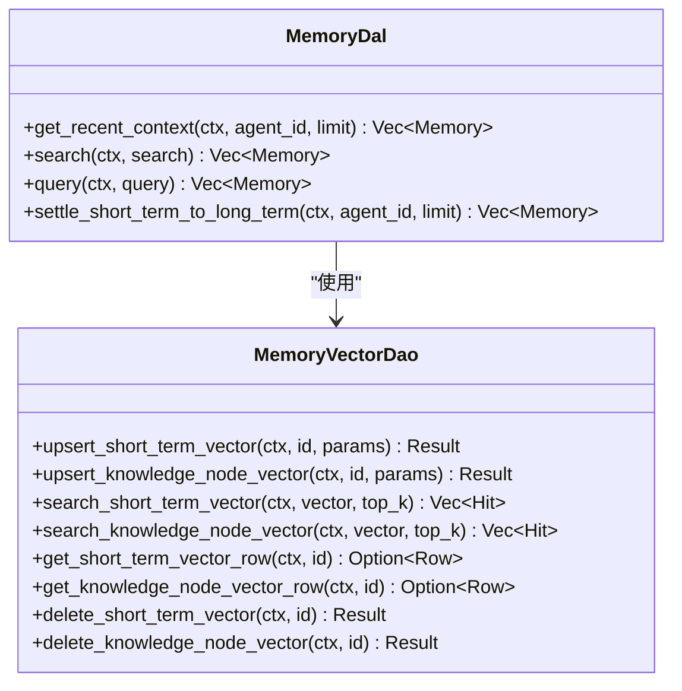
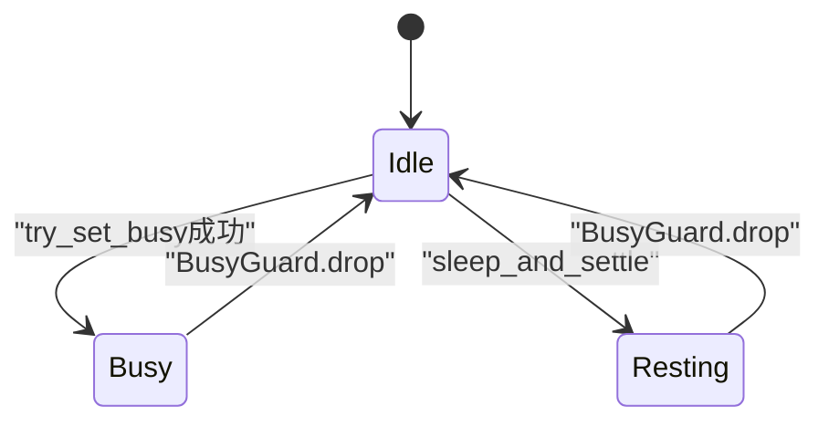
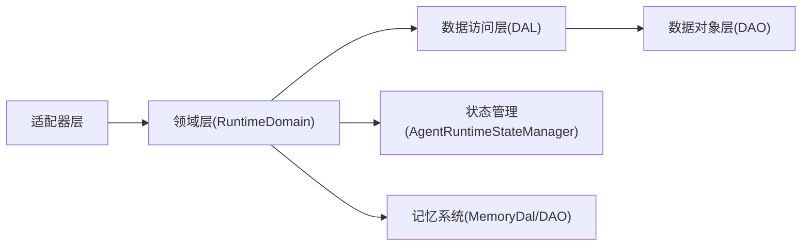
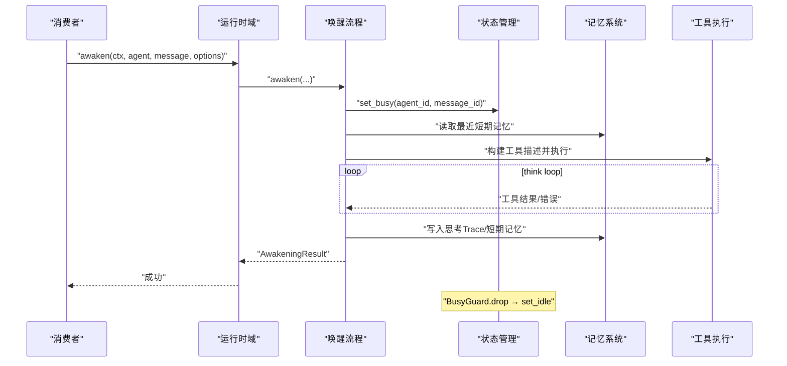
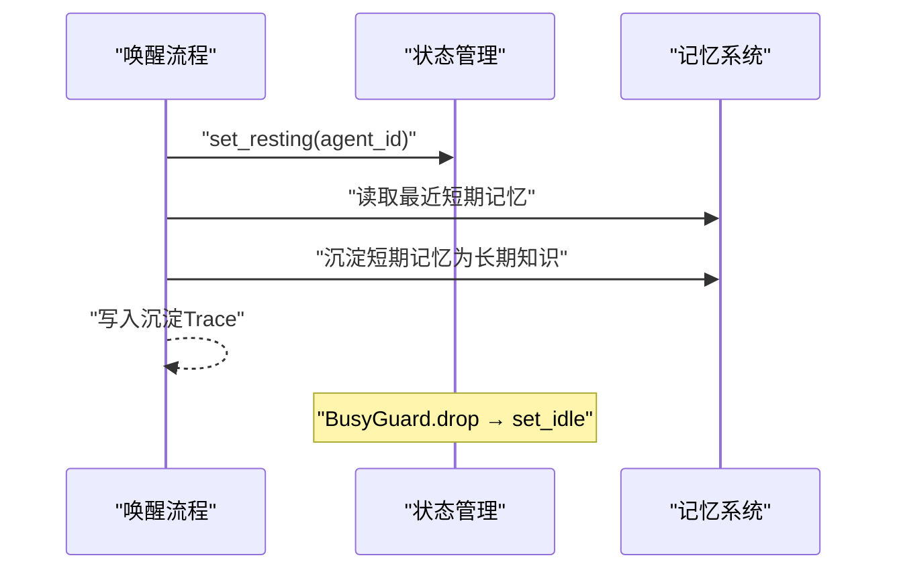

# 运行时领域

<cite>
**本文引用的文件**
- [src/consumer/message.rs](src/consumer/message.rs)
- [src/service/domain/runtime/mod.rs](src/service/domain/runtime/mod.rs)
- [src/service/domain/runtime/awakening.rs](src/service/domain/runtime/awakening.rs)
- [src/service/domain/runtime/think_loop.rs](src/service/domain/runtime/think_loop.rs)
- [src/service/domain/runtime/busy_guard.rs](src/service/domain/runtime/busy_guard.rs)
- [src/service/domain/runtime/compaction.rs](src/service/domain/runtime/compaction.rs)
- [src/pkg/agent_runtime_state.rs](src/pkg/agent_runtime_state.rs)
- [src/pkg/policy/mod.rs](src/pkg/policy/mod.rs)
- [src/pkg/policy/builtin.rs#L203-L262](src/pkg/policy/builtin.rs#L203-L262)
- [src/pkg/policy/tests.rs](src/pkg/policy/tests.rs)
- [common/src/enums/thinking_scene.rs](common/src/enums/thinking_scene.rs)
- [src/models/cortex_types.rs#L135-L195](src/models/cortex_types.rs#L135-L195)
- [src/models/events/think_round.rs](src/models/events/think_round.rs)
- [src/consumer/think_round_stats_consumer.rs](src/consumer/think_round_stats_consumer.rs)
- [src/handlers/hr/agent/runtime_status.rs](src/handlers/hr/agent/runtime_status.rs)
- [src/handlers/hr/agent/runtime_list.rs](src/handlers/hr/agent/runtime_list.rs)
- [src/handlers/hr/agent/cancel_thinking.rs](src/handlers/hr/agent/cancel_thinking.rs)
- [src/models/tool.rs](src/models/tool.rs)
- [src/service/dal/memory.rs](src/service/dal/memory.rs)
- [src/service/dal/agent/mod.rs](src/service/dal/agent/mod.rs)
- [src/service/dal/agent/builder/default.rs](src/service/dal/agent/builder/default.rs)
- [src/service/dao/memory/vector.rs](src/service/dao/memory/vector.rs)
- [src/handlers/hr/agent/save_short_term_memory.rs](src/handlers/hr/agent/save_short_term_memory.rs)
- [tests/integration/memory_test.rs](tests/integration/memory_test.rs)

**更新摘要 2026-08-29**：策略引擎卡同步 NoProgressPolicy + PromptBuilder 升级为 System/User 消息分层；agent.rs 拆分为 agent/mod.rs + builder 子模块；summary.rs 删除，新增 compaction.rs 上下文压缩模块。

**本文关联三类文档**
- 【① Design 决策快照】
  - [thinking_task_policy_engine_design.md](docs/design/thinking_task_policy_engine_design.md) — 策略引擎与思考运行时的设计动机、关键决策表
  - [runtime_design.md](docs/design/runtime_design.md) — Agent 唤醒、沉睡沉淀、三态 FSM 整体设计
  - [intent_aware_two_stage_awaken_design.md](docs/archive/design-archive/intent_aware_two_stage_awaken_design.md) — 两阶段唤醒：IntentAnalyze Phase1 + Awaken Phase2 串联设计
- 【② Plan 落地快照】
  - [唤醒上下文与睡眠约束.md](docs/archive/plan-archive/唤醒上下文与睡眠约束.md) — ThinkingOptions 统一选项 + PromptBuilder 内聚 + 双层工具过滤（真实定稿）
  - [运行时问题修复.md](docs/archive/plan-archive/运行时问题修复.md) — BusyGuard RAII 状态泄漏修复 + try_set_busy CAS TOCTOU 修复（真实定稿）
  - 占位：待 [2026-08-14-policy-engine-and-think-runtime.md](docs/superpowers/plans/2026-08-14-policy-engine-and-think-runtime.md) 由 ai-orz-doc-maintainer 精简到 docs/archive/plan-archive/ 后回填（现执行蓝图可参考 superpowers 链接）
- 【④ RAG 原子知识卡】
  - [策略引擎：Policy trait + PolicyGroup 嵌套组合 + policy_set! 宏声明式写法](docs/wiki/knowledge/zh/策略引擎：Policy%20trait%20+%20PolicyGroup%20嵌套组合%20+%20policy_set!%20宏声明式写法/策略引擎：Policy%20trait%20+%20PolicyGroup%20嵌套组合%20+%20policy_set!%20宏声明式写法.md) — 策略引擎框架硬约束
  - [Agent 思考运行时 AgentThinkRuntime：挂载清理取消与每轮快照上报](docs/wiki/knowledge/zh/Agent%20思考运行时%20AgentThinkRuntime：挂载清理取消与每轮快照上报/Agent%20思考运行时%20AgentThinkRuntime：挂载清理取消与每轮快照上报.md) — think_runtime 生命周期与幂等约束
  - [思考退出原因 exit_reason 统计与 ThinkRoundEvent AOP 事件链路](docs/wiki/knowledge/zh/思考退出原因%20exit_reason%20统计与%20ThinkRoundEvent%20AOP%20事件链路/思考退出原因%20exit_reason%20统计与%20ThinkRoundEvent%20AOP%20事件链路.md) — exit_reason 归一化与 AOP 事件统计链路
  - 【Batch4 新增 2 张】
  - [两阶段唤醒：IntentAnalyze Phase1 意图分析 + Awaken Phase2 正式执行串联（IntentAnalysis 7 字段 + 6 级 JSON 降级）](docs/wiki/knowledge/zh/两阶段唤醒：IntentAnalyze%20Phase1%20意图分析%20+%20Awaken%20Phase2%20正式执行串联（IntentAnalysis%207%20字段%20+%206%20级%20JSON%20降级）/两阶段唤醒：IntentAnalyze%20Phase1%20意图分析%20+%20Awaken%20Phase2%20正式执行串联（IntentAnalysis%207%20字段%20+%206%20级%20JSON%20降级）.md) — Phase1 IntentAnalyze 子循环 + 7 字段结构化结果 + Phase2 Prompt 注入
  - [AgentRuntimeInfo 三态状态机 + BusyGuard RAII：Idle Busy Resting 转换 + task_id project_id 业务上下文透视](docs/wiki/knowledge/zh/AgentRuntimeInfo%20三态状态机%20+%20BusyGuard%20RAII：Idle%20Busy%20Resting%20转换%20+%20task_id%20project_id%20业务上下文透视/AgentRuntimeInfo%20三态状态机%20+%20BusyGuard%20RAII：Idle%20Busy%20Resting%20转换%20+%20task_id%20project_id%20业务上下文透视.md) — try_set_busy CAS + BusyGuard RAII 零泄漏 + task_id/project_id 过滤
- 【③ Wiki 关联长文】
  - [Runtime 领域编排.md](docs/wiki/zh/content/架构设计/分层架构设计/Domain%20层编排/Runtime%20领域编排.md) — trait 聚合与 Domain 接口编排
  - [思考轮次统计消费者.md](docs/wiki/zh/content/基础设施/AOP%20事件系统/事件消费者/思考轮次统计消费者.md) — ThinkRoundEvent 消费与 DuckDB 入库链路
  - [思考运行时面板观测接口.md](docs/wiki/zh/content/前端应用/组件系统/业务组件/思考运行时面板观测接口.md) — 前端 runtime 面板 + 3 个 HTTP Handler 观测链路
  - [Agent 生命周期管理.md](docs/wiki/zh/content/功能模块/AI%20Agent%20管理/Agent%20生命周期管理.md) — 唤醒/沉睡完整生命周期管理流程

**【本次 2026-08-16 增量追加互引】**
#### ④ RAG 原子知识卡（本次追加 T1 新版 policy_set! + T2 runtime 工具化）：
- [策略引擎：Policy trait + PolicyGroup 嵌套组合 + policy_set! 宏声明式写法](docs/wiki/knowledge/zh/策略引擎：Policy%20trait%20+%20PolicyGroup%20嵌套组合%20+%20policy_set!%20宏声明式写法/策略引擎：Policy%20trait%20+%20PolicyGroup%20嵌套组合%20+%20policy_set!%20宏声明式写法.md) — §红线 2 禁止 awakening 中手工 if/else 判断策略；§红线 6 PolicyMixed hard_hit 必须强制退出
- [运行时诊断工具注册为 Agent 可调用工具：runtime-status cancel-thinking runtime-list 三接口工具化](docs/wiki/knowledge/zh/运行时诊断工具注册为%20Agent%20可调用工具：runtime-status%20cancel-thinking%20runtime-list%20三接口工具化/运行时诊断工具注册为%20Agent%20可调用工具：runtime-status%20cancel-thinking%20runtime-list%20三接口工具化.md) — §红线 3 runtime_list 禁止返回已退出 runtime；工具化与 HTTP Handler 复用同一 Domain 方法
#### ② 落地计划（Plan，本次追加占位）：
- docs/archive/plan-archive/policy_set_macro_simplification_and_mixed_mode.md（占位：待 ai-orz-doc-maintainer 落地后回填真实路径）
- docs/archive/plan-archive/runtime_tool_registration_as_agent_callable_tools.md（占位：待 ai-orz-doc-maintainer 落地后回填真实路径）
#### ① 设计文档（Design，本次追加占位）：
- docs/archive/design-archive/policy_set_macro_simplification_and_mixed_mode.md（占位：待 ai-orz-doc-maintainer 落地后回填真实路径）
- [Intent 感知两阶段唤醒：IntentAnalyze Phase1 七字段意图分析 + 6 级 JSON 降级兜底 + Awaken Phase2 正式执行串联](docs/wiki/knowledge/zh/Intent 感知两阶段唤醒：IntentAnalyze Phase1 七字段意图分析 + 6 级 JSON 降级兜底 + Awaken Phase2 正式执行串联/Intent 感知两阶段唤醒：IntentAnalyze Phase1 七字段意图分析 + 6 级 JSON 降级兜底 + Awaken Phase2 正式执行串联.md)
</cite>

## 目录
1. [简介](#简介)
2. [项目结构](#项目结构)
3. [核心组件](#核心组件)
4. [架构总览](#架构总览)
5. [详细组件分析](#详细组件分析)
6. [依赖关系分析](#依赖关系分析)
7. [性能与并发](#性能与并发)
8. [故障排查指南](#故障排查指南)
9. [结论](#结论)
10. [附录：关键流程时序图](#附录：关键流程时序图)

## 更新摘要
**Batch1 2026-08-17 增量同步**：针对策略引擎 pkg/policy 新增、AgentThinkRuntime 挂载清理、runtime-status/cancel-thinking/runtime-list 三接口接入、AgentAwakeEvent.exit_reason 统计、ThinkRoundEvent AOP 链路 5 个增量模块完成增量更新。新增 §5 下两个子章节「策略引擎集成」「思考运行时挂载」，§8 故障排查补 2 条。cite 区补三类文档（Design + Plan superpowers 占位 + 3 张 RAG 卡），并建立四类互引闭环。
**2026-08-16 增量更新**：追加 T1（policy_set! 宏声明式写法 + PolicyMixed 硬软分层）与 T2（runtime 三接口 Agent 可调用工具化）2 张 RAG 卡互引；cite 区补对应 design/plan 规范占位；§5 策略引擎集成章节来源 awakening.rs/think_loop.rs 行号范围降级（因 policy_set! 宏 + mixed.rs 新增文件导致行号漂移，优先降级为无行号范围引用）。

## 简介
本章节面向“AI Agent 运行时”的读者，聚焦唤醒机制、策略引擎控制、思考运行时观测、内存管理、工具执行与忙闲状态控制。文档基于仓库中运行时域（Runtime Domain）、策略引擎（pkg/policy/）、AgentThinkRuntime（pkg/agent_runtime_state.rs 扩展）、消息消费者（MessageConsumer）、Agent 状态管理器（AgentRuntimeStateManager）、AOP 事件链路（ThinkRoundEvent + exit_reason 统计）、3 个观测 Handler 以及记忆系统（短期/长期记忆、向量检索）的实现进行系统化说明，帮助读者理解 Agent 从被唤醒到完成一轮思考、沉淀记忆、退出原因统计的完整生命周期，并给出监控、指标与故障恢复的实践建议。

## 项目结构
运行时相关代码主要分布在以下层次：
- Adapter 层：HTTP Handler 与 AOP Consumer（如消息消费者）。
- Domain 层：运行时域（awakening、tool_execution、memory），负责动态执行逻辑。
- DAL 层：记忆 DAL、大脑 DAL、工具 DAL 等。
- DAO 层：SQLite/LanceDB/HNSW 等存储实现。



**图表来源**
- [src/consumer/message.rs:147-357](src/consumer/message.rs#L147-L357)
- [src/service/domain/runtime/mod.rs:36-49](src/service/domain/runtime/mod.rs#L36-L49)
- [src/service/domain/runtime/awakening.rs:415-748](src/service/domain/runtime/awakening.rs#L415-L748)
- [src/pkg/agent_runtime_state.rs:31-107](src/pkg/agent_runtime_state.rs#L31-L107)
- [src/service/dal/memory.rs:578-608](src/service/dal/memory.rs#L578-L608)
- [src/service/dao/memory/vector.rs:36-124](src/service/dao/memory/vector.rs#L36-L124)

**章节来源**
- [src/consumer/message.rs:147-357](src/consumer/message.rs#L147-L357)
- [src/service/domain/runtime/mod.rs:36-49](src/service/domain/runtime/mod.rs#L36-L49)

## 核心组件
- 消息消费者（MessageConsumer）：订阅消息事件，按目标角色分发；对 Agent 消息进行唤醒编排，包含原子占用、上下文重建、任务状态检查、ThinkingOptions 组装与调用 awaken。
- 运行时域（RuntimeDomain）：聚合 awakening、tool_execution、memory 能力，提供统一入口与状态查询。
- 唤醒流程（awakening）：装配 Brain、构建 Prompt、执行 think loop（含超时、轮次限制、上下文压缩）、沉淀记忆、统计与事件发布。
- 忙碌守卫（BusyGuard）：RAII 模式确保 Busy/Resting 状态在任意返回路径释放为 Idle。
- Agent 运行时状态管理器（AgentRuntimeStateManager）：全局单例维护每个 Agent 的 Idle/Busy/Resting 状态，支持 try_set_busy 原子占用，避免 TOCTOU 竞态。
- 记忆系统：短期记忆（FTS + 向量）、长期知识节点（FTS + 向量）、沉淀流程（settle_short_term_to_long_term）。

**章节来源**
- [src/consumer/message.rs:147-357](src/consumer/message.rs#L147-L357)
- [src/service/domain/runtime/mod.rs:36-49](src/service/domain/runtime/mod.rs#L36-L49)
- [src/service/domain/runtime/awakening.rs:415-748](src/service/domain/runtime/awakening.rs#L415-L748)
- [src/service/domain/runtime/busy_guard.rs:1-32](src/service/domain/runtime/busy_guard.rs#L1-L32)
- [src/pkg/agent_runtime_state.rs:31-107](src/pkg/agent_runtime_state.rs#L31-L107)
- [src/service/dal/memory.rs:578-608](src/service/dal/memory.rs#L578-L608)

## 架构总览
运行时以“事件驱动 + 领域编排”的方式组织：
- 外部消息进入后由 MessageConsumer 消费，根据 to_role 路由到不同 Domain。
- Agent 消息走 RuntimeDomain.awakening()，内部通过 run_think_loop 驱动模型推理与工具调用，并在上下文溢出或轮次耗尽时触发沉淀或总结退出。
- 记忆系统在 awaken/sleep_and_settle 中读写短期/长期记忆，并通过向量索引支持语义检索。
- 状态管理贯穿始终，BusyGuard 保证状态一致性。



**图表来源**
- [src/consumer/message.rs:147-357](src/consumer/message.rs#L147-L357)
- [src/service/domain/runtime/awakening.rs:415-748](src/service/domain/runtime/awakening.rs#L415-L748)
- [src/pkg/agent_runtime_state.rs:73-107](src/pkg/agent_runtime_state.rs#L73-L107)
- [src/service/dal/memory.rs:578-608](src/service/dal/memory.rs#L578-L608)

## 详细组件分析

### 唤醒机制与上下文恢复
- 唤醒入口：MessageConsumer.handle_agent_message 先尝试原子占用 Agent（try_set_busy），再加载 Agent（含 tools/skills/stats），构造 ThinkingOptions（注入 project/task 上下文），最后调用 RuntimeDomain.awakening().awaken。
- 上下文恢复：awaken 内会读取最近短期记忆，使用 PromptBuilder 拼装系统提示、技能、项目/任务上下文、历史与当前消息，形成最终 prompt。
- 大脑装配：若 Agent 未装配 Brain，则调用 wake_agent_brain 获取 ModelProvider 信息并 enrich ctx，确保后续统计与追踪字段完整。
- 循环控制：run_think_loop 内置超时（300s）、轮次上限（默认 90，可配置）、上下文溢出检测（input_tokens 阈值），并在溢出时触发 sleep_and_settle 沉淀后重试。



**图表来源**
- [src/consumer/message.rs:147-357](src/consumer/message.rs#L147-L357)
- [src/service/domain/runtime/awakening.rs:415-748](src/service/domain/runtime/awakening.rs#L415-L748)

**章节来源**
- [src/consumer/message.rs:147-357](src/consumer/message.rs#L147-L357)
- [src/service/domain/runtime/awakening.rs:415-748](src/service/domain/runtime/awakening.rs#L415-L748)

### 策略引擎集成：Policy trait + policy_set! 声明宏
- **框架职责**：策略引擎作为 pkg 层纯框架（不感知业务 action），把原本硬编码在 think_loop 中的轮次上限/超时/上下文溢出/取消判断抽象为 Policy trait 组合判断。每轮 think_loop 构造 Metrics（rounds/elapsed/cancel/tokens 等），调用 Policy.evaluate(metrics) → Vec<String>（命中策略 id 列表）；空列表继续下一轮，非空列表通过 awakening.map_triggered_to_result 映射 ThinkLoopResult 退出或沉淀变体。
- **组合模式**：5 个内置策略（MaxRoundsPolicy/TimeoutPolicy/ContextOverflowPolicy/UserCancelPolicy/TokenCostPolicy，见 pkg/policy/builtin.rs）通过 PolicyGroup（PolicyRelation And/Or）嵌套组合；PolicyGroup 自身也实现 Policy trait，满足组合模式。PolicyBuilder 提供 with_policy/or/and 链式构造 API（pkg/policy/mod.rs）。
- **声明宏 policy_set!**：对 4 个 ThinkingScene 场景（Awaken/IntentAnalyze/Summary/Settle，common/src/enums/thinking_scene.rs）分别一套策略装配入口，默认 5 个内置策略 Or 组（任一命中触发），严禁直接在 awakening 里手写组合条件。
- **退出 reason 归一**：所有策略命中 → awakening.map_triggered_to_result → ThinkLoopResult 变体 → 最后统一输出 6 种 exit_reason 字符串（final/user_cancel/max_rounds_exceeded/timeout/context_overflow/summary_exit），该字符串是 AgentAwakeEvent.exit_reason 与 ThinkRuntimeSnapshot.last_exit_reason 与 DuckDB exit_reason 统计维度的单一事实源。
- **测试强约束**：每个 Policy 至少 3 个测试（命中/未命中/required_metrics 声明完整性），参见 pkg/policy/tests.rs。

**章节来源**
- [src/pkg/policy/mod.rs:1-Lm](src/pkg/policy/mod.rs#L1-L260)
- [src/pkg/policy/builtin.rs:1-Lm](src/pkg/policy/builtin.rs#L1-L180)
- [src/pkg/policy/tests.rs:1-Lm](src/pkg/policy/tests.rs#L1-L120)
- [common/src/enums/thinking_scene.rs:1-Lm](common/src/enums/thinking_scene.rs#L1-L40)
- [src/service/domain/runtime/awakening.rs:Ln-Lm](src/service/domain/runtime/awakening.rs#L415-L748)

### 思考运行时挂载：AgentThinkRuntime、cancel 信号、每轮快照
- **挂载时机与生命周期**：AgentThinkRuntime 是 AgentRuntimeInfo 的扩展 Option 字段，仅 Busy 时 Some（非 Busy 严格 None）。MessageConsumer.awaken() try_set_busy 成功 → StateManager.set_busy_with_think_runtime(agent_id) 挂载（写入 scene、初始化 cancel_token=Arc<AtomicBool> false、round=0 快照）→ BusyGuard RAII 包裹。
- **清理路径（双保险 + 幂等）**：awaken() 成功退出路径显式 StateManager.clear_think_runtime(agent_id)；同时 BusyGuard.drop 无条件再次清理（幂等：二次调用 no-op）。即使 think_loop 发生 panic，也确保清理不泄漏。
- **cancel 信号机制**：取消信号为 Arc<AtomicBool>（零新增依赖，等价替代 tokio_util CancellationToken）。POST /agents/{id}/cancel-thinking → Handler → RuntimeDomain.awakening().cancel_think() → StateManager.cancel_think() → 原子 store(true, Ordering::SeqCst)。下一轮 UserCancelPolicy evaluate 读到 true → 返回 vec!["user_cancel"] → 映射 ThinkLoopResult.UserCancel → exit_reason="user_cancel" 并退出。cancel 路径只做原子置位，不阻塞等待（异步生效），不做任何 DAL/DAO 事件发布（事件由 think_loop 命中路径统一 publish）。
- **每轮快照上报（think_loop 尾部一次写入）**：run_think_loop 每轮末尾统一 `think_runtime.write().unwrap().update_snapshot(round, elapsed, tokens, current_tool, None)`；退出时再写一次 last_exit_reason。RwLock write guard 不跨越任何 await 点，避免死锁（Handler cancel 读锁 + think_loop 写锁交叉）。
- **3 个观测 Handler DTO 协议**：common/src/api/runtime.rs 是 DTO 单一事实源，定义 RuntimeStatusResponse（单 Agent 状态 + think_snapshot Option）、RuntimeListResponse（分页 PagedResult<RuntimeListItem>，按 organization_id 过滤）、CancelThinkingResponse{ success, was_thinking }。DTO 字段名与 ThinkRuntimeSnapshot 内存结构体一一对应，禁止前后端手工字段映射。

**章节来源**
- [src/pkg/agent_runtime_state.rs:Ln-Lm](src/pkg/agent_runtime_state.rs#L31-L157)
- [src/service/domain/runtime/busy_guard.rs:1-33](src/service/domain/runtime/busy_guard.rs#L1-L33)
- [src/service/domain/runtime/awakening.rs:Ln-Lm](src/service/domain/runtime/awakening.rs#L415-L748)
- [src/service/domain/runtime/think_loop.rs:Ln-Lm](src/service/domain/runtime/think_loop.rs#L1-L280)
- [src/handlers/hr/agent/runtime_status.rs](src/handlers/hr/agent/runtime_status.rs)
- [src/handlers/hr/agent/runtime_list.rs](src/handlers/hr/agent/runtime_list.rs)
- [src/handlers/hr/agent/cancel_thinking.rs](src/handlers/hr/agent/cancel_thinking.rs)
- [common/src/api/runtime.rs](common/src/api/runtime.rs)
- [src/models/events/think_round.rs](src/models/events/think_round.rs)
- [src/consumer/think_round_stats_consumer.rs](src/consumer/think_round_stats_consumer.rs)

### 内存管理：短期记忆与长期记忆
- 短期记忆：
  - 创建：通过 save_short_term_memory 处理器调用 runtime_domain.memory().create，持久化为 ShortTerm 类型，并建立 FTS 与向量索引。
  - 检索：get_recent_context 用于唤醒时注入历史；search/query 支持关键词与语义混合检索。
- 长期记忆：
  - 沉淀：MemoryDal.settle_short_term_to_long_term 将 Active 短期记忆聚合成知识节点，建立引用关系，并标记为 Settled。
  - 向量检索：MemoryVectorDaoImpl 提供 upsert/search/get/delete 接口，命名空间区分 short_term 与 knowledge_node。
- 测试覆盖：集成测试验证了短期记忆查询、搜索与向量检索行为。



**图表来源**
- [src/service/dal/memory.rs:148-177](src/service/dal/memory.rs#L148-L177)
- [src/service/dao/memory/vector.rs:36-124](src/service/dao/memory/vector.rs#L36-L124)

**章节来源**
- [src/handlers/hr/agent/save_short_term_memory.rs:30-57](src/handlers/hr/agent/save_short_term_memory.rs#L30-L57)
- [src/service/dal/memory.rs:578-608](src/service/dal/memory.rs#L578-L608)
- [src/service/dao/memory/vector.rs:36-124](src/service/dao/memory/vector.rs#L36-L124)
- [tests/integration/memory_test.rs:179-219](tests/integration/memory_test.rs#L179-L219)

### 工具执行流程：参数验证与结果处理
- 工具描述：awaken 中从 agent.tools 派生 ToolDescriptor 列表，供模型 function calling。
- 执行分发：run_think_loop 根据 tool.po.control_mode 选择 auto/manual 执行路径，分别调用 ToolDal.execute_auto/execute_manual。
- 结果处理：工具执行结果以 ChatMessage::tool 形式追加到消息历史；错误路径记录错误信息并继续循环。
- 手动工具调用：consumer.handle_tool_call_request 解析 ToolCallRequest，构建 RequestContext，调用 call_manual_tool_for_agent，并将结果通过 MessageDomain 回写。

```mermaid
sequenceDiagram
participant Loop as "think loop"
participant ToolDAL as "工具DAL"
participant MCP as "MCP工具DAL"
participant Msg as "消息历史"
Loop->>ToolDAL : "execute_auto/execute_manual(tool, args)"
alt Auto
ToolDAL-->>Loop : "(value, entry)"
else Manual
ToolDAL->>MCP : "协议路由"
MCP-->>ToolDAL : "执行结果"
ToolDAL-->>Loop : "(value, entry)"
end
Loop->>Msg : "追加工具结果或错误"
```

**图表来源**
- [src/service/domain/runtime/awakening.rs:248-323](src/service/domain/runtime/awakening.rs#L248-L323)
- [src/consumer/message.rs:402-477](src/consumer/message.rs#L402-L477)

**章节来源**
- [src/service/domain/runtime/awakening.rs:248-323](src/service/domain/runtime/awakening.rs#L248-L323)
- [src/consumer/message.rs:402-477](src/consumer/message.rs#L402-L477)
- [src/models/tool.rs:48-88](src/models/tool.rs#L48-L88)

### 忙闲状态管理与并发控制
- 状态枚举：Idle/Busy/Resting，分别表示空闲、忙碌、休息（沉淀）。
- 原子占用：try_set_busy 在同一临界区判断并设置 Busy，避免 TOCTOU 竞态。
- RAII 清理：BusyGuard 在 drop 时自动 set_idle，确保任何返回路径（包括 panic）都释放状态。
- 消费者并发：MessageConsumer 设置 concurrency=4，空队列休眠 100ms，错误重试休眠 1000ms。



**图表来源**
- [src/pkg/agent_runtime_state.rs:73-107](src/pkg/agent_runtime_state.rs#L73-L107)
- [src/service/domain/runtime/busy_guard.rs:1-32](src/service/domain/runtime/busy_guard.rs#L1-L32)
- [src/consumer/message.rs:130-141](src/consumer/message.rs#L130-L141)

**章节来源**
- [src/pkg/agent_runtime_state.rs:73-107](src/pkg/agent_runtime_state.rs#L73-L107)
- [src/service/domain/runtime/busy_guard.rs:1-32](src/service/domain/runtime/busy_guard.rs#L1-L32)
- [src/consumer/message.rs:130-141](src/consumer/message.rs#L130-L141)

## 依赖关系分析
- 单向依赖：Adapter → Domain → DAL → DAO，禁止跨层与同层互调。
- 运行时域依赖：BrainDal、ToolDal、McpToolDal、AgentDal、CodexAgentDal、A2aAgentDal、ToolCallLogger。
- 记忆系统依赖：MemoryDal 组合 MemoryDao 与 MemoryVectorDao，后者对接向量存储后端。



**图表来源**
- [src/service/domain/runtime/mod.rs:251-304](src/service/domain/runtime/mod.rs#L251-L304)
- [src/service/dal/memory.rs:181-186](src/service/dal/memory.rs#L181-L186)

**章节来源**
- [src/service/domain/runtime/mod.rs:251-304](src/service/domain/runtime/mod.rs#L251-L304)
- [src/service/dal/memory.rs:181-186](src/service/dal/memory.rs#L181-L186)

## 性能与并发
- 超时与轮次：run_think_loop 设置 300s 超时与默认 90 轮上限，防止无限循环。
- 上下文压缩：当 input_tokens 超过阈值（recommended_context_length 或 max_context_length*60%）时中断循环，触发沉淀后重试。
- 并发控制：消费者并发度 4，空队列与错误重试退避策略降低资源竞争。
- 向量检索：短/长记忆均支持向量索引，提升语义检索效率；支持多后端降级（LanceDB/HNSW/InMemory/SqliteVss）。

[本节为通用指导，不直接分析具体文件]

## 故障排查指南
- Agent 永远 Busy：检查 awaken 中是否正确使用 BusyGuard；确认 try_set_busy 成功后所有失败路径均能释放状态；确认策略命中后的 map_triggered_to_result 分支不会遗漏 BusyGuard 作用域（比如新增退出分支要确保仍在 BusyGuard RAII 内）。
- 策略命中但 exit_reason 漏映射：新增 Policy 或新增 exit_reason 字符串时，需同步更新 3 处（① awakening.map_triggered_to_result ② ThinkRuntimeSnapshot.last_exit_reason 写入 ③ AgentAwakeEvent.exit_reason 写入），否则统计与面板展示不一致；可从 ThinkRoundEvent policy_hit_ids 列表反查漏映射的策略 id。
- cancel 成功但 Agent 仍显示 Busy（前端面板超过 5s 未变）：① 确认 cancel 路径只做原子 store，不阻塞；大概率是当前轮次的 brain_dal.think() LLM 调用未返回，下一轮 evaluate 检测前仍未退出（可看 trace_id 日志）；② 极端情况下 think_loop 已 panic 但 BusyGuard.drop 未执行——需检查 BusyGuard 的构造时机是否在 set_busy_with_think_runtime 之后、立即构造（不能中间有任何可能提前 return 的语句）。
- runtime-list 返回的 exit_reason 值是「空字符串/未知」：通常是 awakening 新增退出分支但忘记在退出前写 snapshot.last_exit_reason；检查 ThinkLoopResult 所有 6 个变体的退出路径是否都在 clear_think_runtime 之前写入了正确的 last_exit_reason 字符串。
- 消息无法投递：确认 handle_user_message 在所有渠道失败时返回错误以触发 nack 重试。
- 上下文溢出频繁：调整 recommended_context_length 或 max_context_length；优化 Prompt 与历史长度；可把 ContextOverflowPolicy 阈值与 run_think_loop 独立的溢出判断对齐（当前 run_think_loop 有独立判断，后续可整合进 ContextOverflowPolicy）。
- 工具执行失败：查看 ToolCallEntry 日志，确认 control_mode 与协议配置；必要时切换到 manual 模式进行调试。
- 记忆沉淀异常：检查 settle_short_term_to_long_term 是否找到 Active 短期记忆；验证向量索引是否成功 upsert。

**章节来源**
- [src/service/domain/runtime/busy_guard.rs:1-32](src/service/domain/runtime/busy_guard.rs#L1-L32)
- [src/consumer/message.rs:359-389](src/consumer/message.rs#L359-L389)
- [src/service/dal/memory.rs:578-608](src/service/dal/memory.rs#L578-L608)

## 结论
运行时领域通过清晰的层次划分与严格的依赖约束，实现了 Agent 的可靠唤醒、上下文恢复、工具执行与记忆沉淀。借助 BusyGuard 与 try_set_busy 的状态管理，避免了状态泄漏与竞态问题；通过 think loop 的超时、轮次与上下文压缩控制，保障了稳定性与可扩展性。结合向量检索与 FTS 的记忆系统，Agent 能够在长对话中保持高效的知识利用与沉淀。

[本节为总结性内容，不直接分析具体文件]

## 附录：关键流程时序图

### 唤醒主流程（awaken）


**图表来源**
- [src/service/domain/runtime/awakening.rs:415-748](src/service/domain/runtime/awakening.rs#L415-L748)
- [src/pkg/agent_runtime_state.rs:73-107](src/pkg/agent_runtime_state.rs#L73-L107)

### 沉淀流程（sleep_and_settle）


**图表来源**
- [src/service/domain/runtime/awakening.rs:750-800](src/service/domain/runtime/awakening.rs#L750-L800)
- [src/service/dal/memory.rs:578-608](src/service/dal/memory.rs#L578-L608)


### 本文关联的三类文档（四类互引闭环，Batch11 精确对齐）
#### ① Design 决策快照
- [intent_aware_two_stage_awaken_design.md](docs/archive/design-archive/intent_aware_two_stage_awaken_design.md) — 两阶段唤醒总纲：IntentAnalyze Phase1 7 字段 + Awaken Phase2 串联 + 6 级 JSON 降级兜底
#### ② Plan 落地快照
- [唤醒上下文与睡眠约束.md](docs/archive/plan-archive/唤醒上下文与睡眠约束.md) — ThinkingOptions 统一参数 + PromptBuilder 公共方法复用 + 双层工具过滤机制
#### ④ RAG 原子知识卡
- [Intent 感知两阶段唤醒：IntentAnalyze Phase1 七字段意图分析 + 6 级 JSON 降级兜底 + Awaken Phase2 正式执行串联](docs/wiki/knowledge/zh/Intent%20感知两阶段唤醒：IntentAnalyze%20Phase1%20七字段意图分析%20+%206%20级%20JSON%20降级兜底%20+%20Awaken%20Phase2%20正式执行串联/Intent%20感知两阶段唤醒：IntentAnalyze%20Phase1%20七字段意图分析%20+%206%20级%20JSON%20降级兜底%20+%20Awaken%20Phase2%20正式执行串联.md) — 两阶段唤醒 §1-§4 速查 + §4.1 必守红线 8 条（IntentAnalysis Default、工具白名单、降级不阻塞等）
