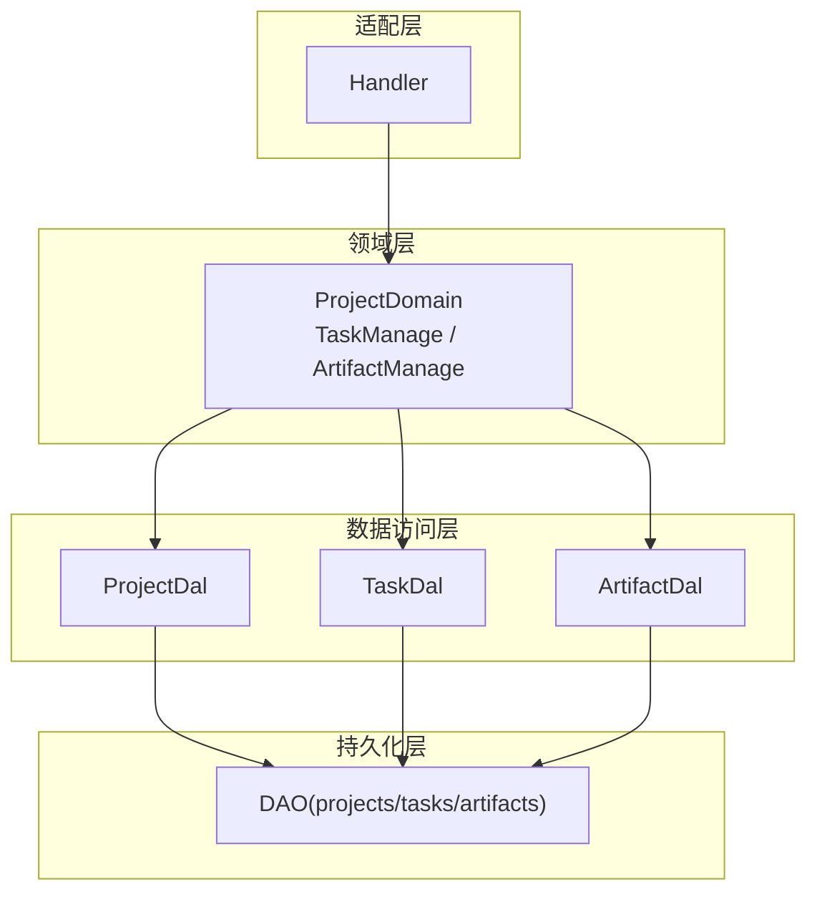
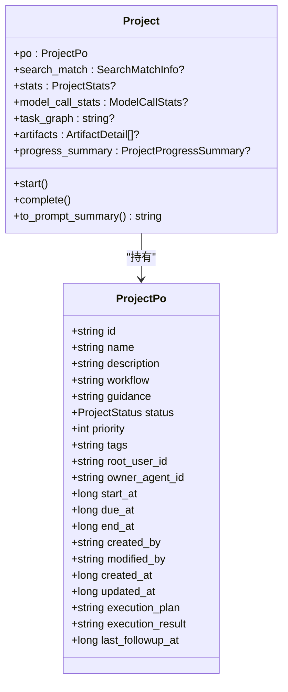
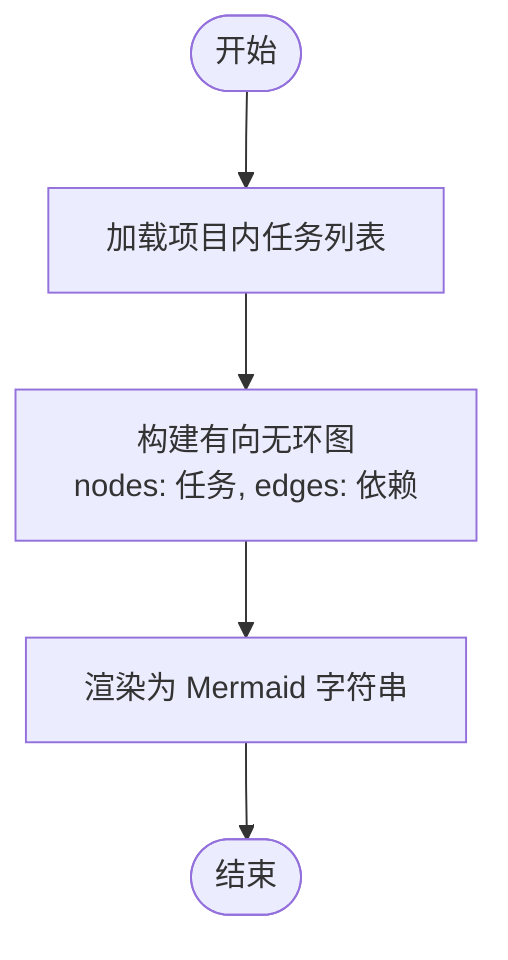
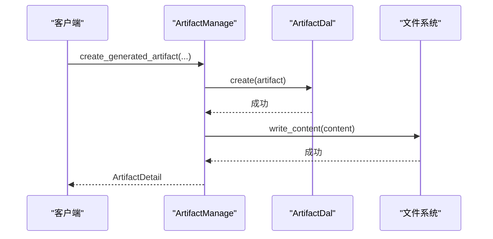
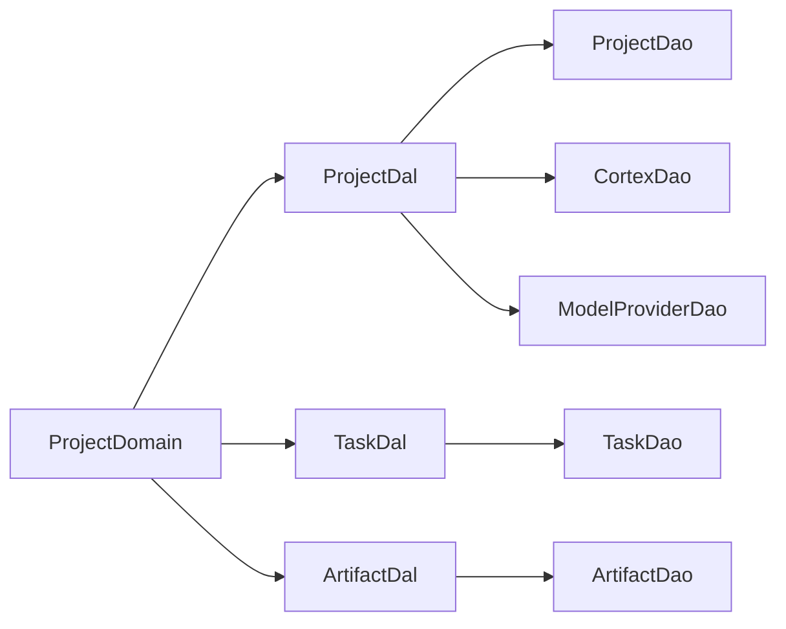
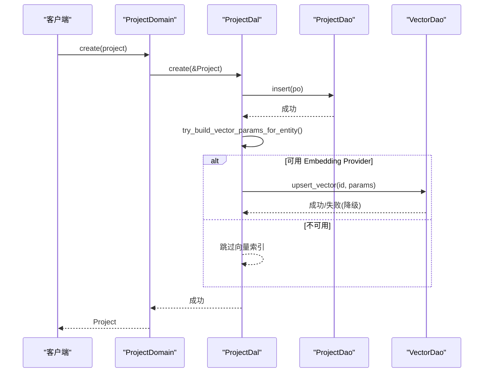

# 项目领域

<cite>
**本文引用的文件**
- [ARCHITECTURE.md](docs/ARCHITECTURE.md)
- [project_design.md](docs/project_design.md)
- [project.rs（模型）](src/models/project.rs)
- [task.rs（模型）](src/models/task.rs)
- [artifact.rs（模型）](src/models/artifact.rs)
- [domain/project/mod.rs](src/service/domain/project/mod.rs)
- [domain/project/artifact.rs](src/service/domain/project/artifact.rs)
- [domain/project/task_graph.rs](src/service/domain/project/task_graph.rs)
- [dal/project.rs](src/service/dal/project.rs)
</cite>

## 目录
1. [引言](#引言)
2. [项目结构](#项目结构)
3. [核心组件](#核心组件)
4. [架构总览](#架构总览)
5. [详细组件分析](#详细组件分析)
6. [依赖关系分析](#依赖关系分析)
7. [性能与并发](#性能与并发)
8. [故障排查指南](#故障排查指南)
9. [结论](#结论)
10. [附录：关键流程时序图](#附录：关键流程时序图)

## 引言
本领域文档聚焦项目管理、任务编排与工件管理的领域模型设计与实现，覆盖项目的创建与生命周期、任务的分配与进度跟踪、工件的版本与内容管理，以及任务图的构建与可视化。同时给出复杂业务流程编排、并发控制与错误处理策略，并通过代码级引用展示协作模式。

## 项目结构
本项目采用严格四层单向调用：Adapter（HTTP Handler / 公开回调 / AOP Producer）→ Domain → DAL → DAO，禁止跨层调用与同层互调。PO（持久化对象）仅在 DAO/DAL 内部使用，Domain 对外只暴露业务实体；所有 service 层方法首参为 RequestContext，跨层传递统一 ctx.clone()。

图表来源
- [ARCHITECTURE.md:11-64](docs/ARCHITECTURE.md#L11-L64)

章节来源
- [ARCHITECTURE.md:11-64](docs/ARCHITECTURE.md#L11-L64)

## 核心组件
- 项目（Project）：聚合根，承载项目元信息、状态、时间戳、执行计划/结果、负责人 Agent、标签等，并提供启动/完成等状态变更语义。
- 任务（Task）：扁平关联到项目，支持依赖、分配、进度、思考深度、执行计划/结果等。
- 工件（Artifact）：产物资源，支持项目级/任务级、来源类型（attachment/generated_content）、软删除、标签、内容读写。
- 领域服务（ProjectDomain）：组合 ProjectDal/TaskDal/ArtifactDal，提供统一的领域能力（创建、查询、状态流转、产物管理等）。
- 数据访问（DAL）：封装 DAO，提供混合搜索、统计、向量索引维护等能力。

章节来源
- [project.rs（模型）:15-80](src/models/project.rs#L15-L80)
- [task.rs（模型）:16-81](src/models/task.rs#L16-L81)
- [artifact.rs（模型）:17-57](src/models/artifact.rs#L17-L57)
- [domain/project/mod.rs:91-226](src/service/domain/project/mod.rs#L91-L226)
- [dal/project.rs:27-209](src/service/dal/project.rs#L27-L209)

## 架构总览
- 分层职责清晰：Handler 仅做 DTO 解析与编排，Domain 负责业务规则与状态机，DAL 组合 DAO 完成数据操作，DAO 专注单一数据源 CRUD。
- 实体分层：PO 不暴露到 Domain 及以上；业务实体内部持有 PO，DAL 负责转换。
- 上下文贯穿：所有 service 方法首参为 RequestContext，跨层使用 ctx.clone()。
- 搜索与统计：ProjectDal 提供 FTS5 + 向量混合搜索，并自动维护向量索引；统计通过专用 DAO 聚合。

章节来源
- [ARCHITECTURE.md:325-385](docs/ARCHITECTURE.md#L325-L385)
- [dal/project.rs:490-703](src/service/dal/project.rs#L490-L703)

## 详细组件分析

### 项目（Project）领域
- 模型设计
  - ProjectPo：包含 id、name、description、workflow、guidance、status、priority、tags、root_user_id、owner_agent_id、start_at、due_at、end_at、created_by/modified_by、时间戳、execution_plan/result、last_followup_at。
  - Project：业务实体，内部持有 po，并可注入 stats、model_call_stats、task_graph、artifacts、progress_summary。
- 生命周期与状态流转
  - 启动：设置状态为进行中，记录 start_at。
  - 完成：设置状态为已完成，记录 end_at。
  - 归档：DAL 层更新状态为已归档，并清理向量索引。
  - 软删除：status=0 视为已删除，常规查询默认过滤。
- 查询与搜索
  - 列表/分页/条件过滤：通过 ProjectQuery 组合 ids/status/root_user_id 等。
  - 混合搜索：关键词走 FTS5，可选向量语义搜索，合并排序后返回。
- 统计与向量化
  - 统计：事件次数汇总、模型调用统计（token/时序）。
  - 向量：create/update 时自动 upsert 向量索引；rebuild_vectors 支持全量重建。

图表来源
- [project.rs（模型）:15-80](src/models/project.rs#L15-L80)
- [project.rs（模型）:82-212](src/models/project.rs#L82-L212)

章节来源
- [project_design.md:9-43](docs/project_design.md#L9-L43)
- [project.rs（模型）:15-80](src/models/project.rs#L15-L80)
- [project.rs（模型）:82-212](src/models/project.rs#L82-L212)
- [dal/project.rs:225-456](src/service/dal/project.rs#L225-L456)

### 任务（Task）领域
- 模型设计
  - TaskPo：包含 title、description、status、priority、tags、due_at/start_at/end_at、dependencies（前置任务 ID 列表 JSON）、root_user_id、assignee_type/assignee_id、project_id、thinking_depth、progress、执行计划/结果等。
  - Task：业务实体，内部持有 po，可注入 stats、model_call_stats、artifacts。
- 任务创建与分配
  - 支持创建时指定优先级、标签、截止时间、依赖、分配对象（Agent/用户）及所属项目。
- 进度跟踪与完成验证
  - 进度：set_progress(0-100)，完成时置 100 并记录 end_at。
  - 思考深度：increment/reset，用于 Agent 轮次控制。
- 任务图（Task Graph）
  - 基于 dependencies 构建 DAG，渲染为 Mermaid 字符串，箭头方向表示“执行流向”（前置指向后置）。
  - 支持跨项目依赖节点标记为 external。

图表来源
- [domain/project/task_graph.rs:17-54](src/service/domain/project/task_graph.rs#L17-L54)

章节来源
- [task.rs（模型）:16-81](src/models/task.rs#L16-L81)
- [task.rs（模型）:237-315](src/models/task.rs#L237-L315)
- [domain/project/task_graph.rs:17-67](src/service/domain/project/task_graph.rs#L17-L67)

### 工件（Artifact）领域
- 模型设计
  - ArtifactPo：id、project_id、task_id（可为空表示项目级）、name、description、file_type、file_meta（JSON）、source_type（attachment/generated_content/remote_url）、tags、status（软删除）、创建/修改信息与时间戳。
  - Artifact：业务实体，内部持有 po。
- 版本控制与内容管理
  - 当前版本策略：不新增独立 version 字段，通过 name/description/tags 表达版本语义；后续可扩展 PUT 接口进行强版本管理。
  - 内容写入：GeneratedContent 支持直接写入内容或从文件复制；Attachment 引用型仅读取 Attachment metadata 组装 FileMeta，不做二次搬运。
  - 路径隔离：生成内容存储于 artifacts/projects/{project_id}/{artifact_id}/{file_name}，并进行路径安全校验。
- 权限与一致性
  - 所有写操作前校验项目归属与任务归属（若传入 task_id），确保 task 属于同一 project。
  - 乐观锁：update_artifact 支持 expected_updated_at 冲突检测。

图表来源
- [domain/project/artifact.rs:342-399](src/service/domain/project/artifact.rs#L342-L399)

章节来源
- [artifact.rs（模型）:17-57](src/models/artifact.rs#L17-L57)
- [artifact.rs（模型）:194-315](src/models/artifact.rs#L194-L315)
- [domain/project/artifact.rs:27-125](src/service/domain/project/artifact.rs#L27-L125)
- [domain/project/artifact.rs:273-340](src/service/domain/project/artifact.rs#L273-L340)
- [project_management_design.md:310-328](docs/project_management_design.md#L310-L328)

### 领域服务（ProjectDomain）
- 职责
  - 组合 ProjectDal/TaskDal/ArtifactDal，提供项目、任务、产物的完整业务能力。
  - 统一状态流转：transition_status 对 Project/Task 进行状态变更与时间戳更新。
  - 权限校验：validate_project_access / validate_project_and_task 保证资源访问合法性。
- 扩展点
  - 单例初始化：init() 注册全局 Domain 实例，便于 Handler 调用。
  - 测试隔离：new() 构造独立实例，避免测试间干扰。

章节来源
- [domain/project/mod.rs:63-89](src/service/domain/project/mod.rs#L63-L89)
- [domain/project/mod.rs:91-226](src/service/domain/project/mod.rs#L91-L226)
- [domain/project/artifact.rs:489-531](src/service/domain/project/artifact.rs#L489-L531)

## 依赖关系分析
- 模块耦合
  - Domain 依赖多个 DAL（Project/Task/Artifact），但彼此解耦，通过 trait 抽象。
  - DAL 依赖 DAO 与外部能力（CortexDao/ModelProviderDao）以支撑向量搜索与统计。
- 循环依赖
  - 通过 trait 与 Arc<dyn Trait> 注入，避免编译期循环依赖。
- 外部依赖
  - 向量存储（LanceDB/HNSW/InMemory/SqliteVss）与全文检索（FTS5）在 DAL 层透明集成。

图表来源
- [dal/project.rs:214-221](src/service/dal/project.rs#L214-L221)
- [domain/project/mod.rs:502-523](src/service/domain/project/mod.rs#L502-L523)

章节来源
- [dal/project.rs:214-221](src/service/dal/project.rs#L214-L221)
- [domain/project/mod.rs:502-523](src/service/domain/project/mod.rs#L502-L523)

## 性能与并发
- 向量索引维护
  - create/update 时增量 upsert，失败降级为 warn，不影响主流程。
  - rebuild_vectors 支持按 model_provider 变化触发全量重建，跳过一致集合。
- 混合搜索
  - FTS5 关键词 + 向量语义双路召回，阈值过滤与统一排序（Hybrid > Vector > Keyword）。
- 并发与顺序
  - 相同 order_key 的事件顺序处理，不同 key 并行；任务图渲染为纯 CPU 计算，无阻塞 IO。
- 内存与 I/O
  - 原始细节按天文件追加，索引在数据库；大文件通过流式写入与路径安全校验。

章节来源
- [dal/project.rs:225-274](src/service/dal/project.rs#L225-L274)
- [dal/project.rs:490-703](src/service/dal/project.rs#L490-L703)
- [ARCHITECTURE.md:229-242](docs/ARCHITECTURE.md#L229-L242)

## 故障排查指南
- 向量索引异常
  - 现象：搜索或索引写入失败。
  - 排查：检查 Embedding Provider 是否可用；查看日志中 vector_index/vector_search 的 warn/debug 输出；必要时执行 rebuild_vectors。
- 权限校验失败
  - 现象：更新/删除工件时报无权访问。
  - 排查：确认 current_user_id 与 project.root_user_id 一致；若涉及 task_id，校验 task.project_id 与 project_id 一致。
- 乐观锁冲突
  - 现象：update_artifact 返回 Conflict。
  - 排查：前端需携带正确的 expected_updated_at；重试前刷新资源。
- 任务图渲染异常
  - 现象：外部依赖未显示或方向错误。
  - 排查：确认 dependencies 字段格式正确；外部节点会标注 (external)。

章节来源
- [dal/project.rs:231-274](src/service/dal/project.rs#L231-L274)
- [domain/project/artifact.rs:273-340](src/service/domain/project/artifact.rs#L273-L340)
- [domain/project/task_graph.rs:31-54](src/service/domain/project/task_graph.rs#L31-L54)

## 结论
项目领域通过清晰的领域模型与分层架构，实现了项目、任务与工件的全生命周期管理。任务图提供了可视化的依赖解析与执行流向；工件管理支持多来源与内容读写，兼顾安全性与可追溯性。DAL 层的混合搜索与向量索引增强了检索能力，Domain 的状态机与权限校验保证了业务一致性与安全边界。

## 附录：关键流程时序图

### 项目创建与向量索引维护

图表来源
- [dal/project.rs:225-274](src/service/dal/project.rs#L225-L274)

### 工件内容写入（GeneratedContent）

图表来源
- [domain/project/artifact.rs:342-399](src/service/domain/project/artifact.rs#L342-L399)