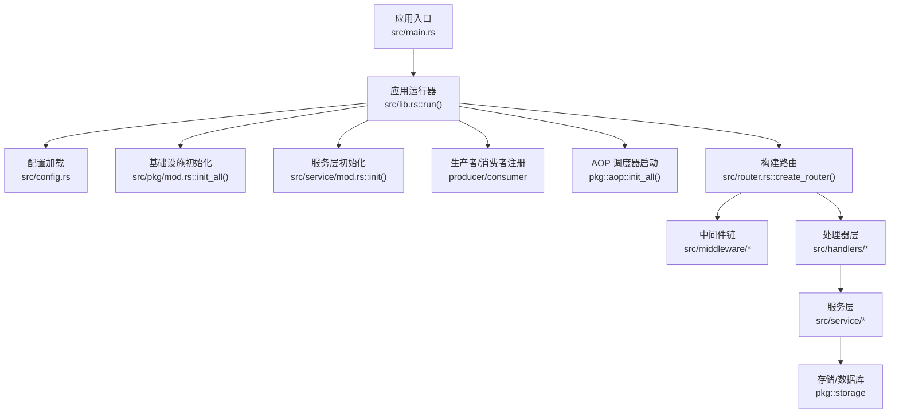
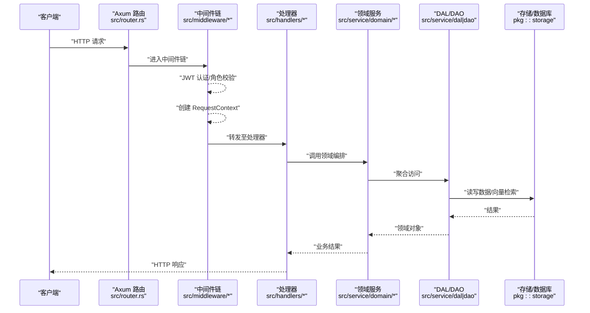
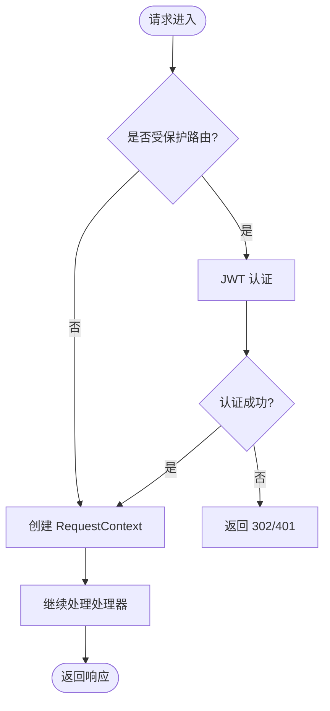
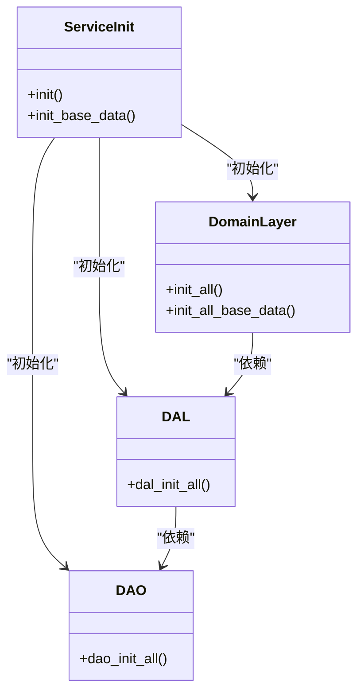
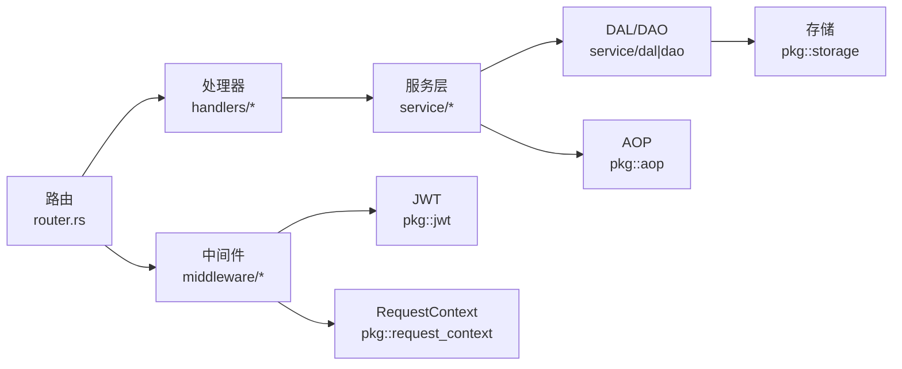

# 核心模块

<cite>
**本文引用的文件**
- [main.rs](src/main.rs)
- [lib.rs](src/lib.rs)
- [router.rs](src/router.rs)
- [config.rs](src/config.rs)
- [middleware/mod.rs](src/middleware/mod.rs)
- [jwt_auth.rs](src/middleware/jwt_auth.rs)
- [request_context.rs](src/middleware/request_context.rs)
- [handlers/mod.rs](src/handlers/mod.rs)
- [service/mod.rs](src/service/mod.rs)
- [domain/mod.rs](src/service/domain/mod.rs)
- [pkg/mod.rs](src/pkg/mod.rs)
</cite>

## 目录
1. [简介](#简介)
2. [项目结构](#项目结构)
3. [核心组件](#核心组件)
4. [架构总览](#架构总览)
5. [详细组件分析](#详细组件分析)
6. [依赖关系分析](#依赖关系分析)
7. [性能考量](#性能考量)
8. [故障排查指南](#故障排查指南)
9. [结论](#结论)
10. [附录](#附录)

## 简介
本文件面向 AI Orz 后端核心模块，聚焦于请求进入后的路由与中间件、处理器层、服务层（DAL/DAO/Domain）、以及基础设施（配置、AOP、存储、JWT、日志等）的协作方式。文档从“入口启动 → 路由装配 → 中间件处理 → 处理器调用 → 服务层编排 → 数据访问”的全链路视角，说明各模块职责、接口契约、通信机制、错误处理策略与扩展点，帮助开发者快速理解并安全扩展系统。

## 项目结构
- 应用入口：主进程通过异步运行时启动，加载配置、初始化 pkg 子系统、注册生产者/消费者、启动 AOP 调度器，最后构建 Axum Router 并监听端口。
- 路由与中间件：统一在路由器中按“公开/受保护/A2A/SSE/健康检查”划分；中间件采用洋葱模型，先鉴权再注入上下文。
- 处理器层：按业务域组织（hr、finance、organization、project、system、user、a2a），每个处理器负责参数校验、权限判断、调用领域服务并返回响应。
- 服务层：分为 DAL（数据访问抽象）、DAO（持久化实现）、Domain（领域编排与规则）。
- 基础设施：配置单例、AOP 事件总线、存储（DB/向量/文件）、JWT、日志、工具注册表等。

**图表来源**
- [main.rs:1-5](src/main.rs#L1-L5)
- [lib.rs:114-175](src/lib.rs#L114-L175)
- [config.rs:26-78](src/config.rs#L26-L78)
- [pkg/mod.rs:21-54](src/pkg/mod.rs#L21-L54)
- [router.rs:12-59](src/router.rs#L12-L59)

**章节来源**
- [main.rs:1-5](src/main.rs#L1-L5)
- [lib.rs:114-175](src/lib.rs#L114-L175)
- [config.rs:26-78](src/config.rs#L26-L78)
- [pkg/mod.rs:21-54](src/pkg/mod.rs#L21-L54)
- [router.rs:12-59](src/router.rs#L12-L59)

## 核心组件
- 路由与中间件
  - 公开路由：系统初始化、登录/登出、组织列表等，仅需要 RequestContext 提取。
  - 受保护路由：HR、财务、组织、项目、任务、用户等，要求 JWT 认证与角色控制。
  - A2A 协议：Agent Card（公开发现）、JSON-RPC（JWT 保护）、SSE 订阅、回调（外部 Agent 推送）。
  - 中间件顺序：外层 jwt_auth_middleware → 内层 request_context_middleware，确保后续可获取已解析的用户上下文。
- 处理器层
  - 按业务域拆分，职责单一：参数校验、权限判定、调用领域服务、组装响应。
- 服务层
  - Domain：业务编排与规则（如消息投递、运行时执行、项目管理等）。
  - DAL：跨 DAO 的聚合访问能力。
  - DAO：具体持久化实现（DB、缓存、向量索引等）。
- 基础设施
  - 配置：编译时默认配置 + 运行时覆盖，提供全局 AppConfig。
  - AOP：事件总线、队列、统计收集与监控。
  - 存储：数据库连接、向量检索、文件存储等。
  - JWT：双模式认证（Cookie/Bearer），将用户信息注入请求头。
  - 日志：带上下文的结构化日志宏，自动 span 注入。

**章节来源**
- [router.rs:12-136](src/router.rs#L12-L136)
- [middleware/mod.rs:1-10](src/middleware/mod.rs#L1-L10)
- [jwt_auth.rs:25-87](src/middleware/jwt_auth.rs#L25-L87)
- [request_context.rs:16-40](src/middleware/request_context.rs#L16-L40)
- [handlers/mod.rs:1-11](src/handlers/mod.rs#L1-L11)
- [service/mod.rs:1-24](src/service/mod.rs#L1-L24)
- [domain/mod.rs:1-43](src/service/domain/mod.rs#L1-L43)
- [pkg/mod.rs:21-54](src/pkg/mod.rs#L21-L54)

## 架构总览
下图展示了从 HTTP 请求到领域服务的完整调用链，包括中间件、处理器、服务层与存储的交互。

**图表来源**
- [router.rs:12-136](src/router.rs#L12-L136)
- [jwt_auth.rs:25-87](src/middleware/jwt_auth.rs#L25-L87)
- [request_context.rs:16-40](src/middleware/request_context.rs#L16-L40)
- [service/mod.rs:1-24](src/service/mod.rs#L1-L24)
- [pkg/mod.rs:21-54](src/pkg/mod.rs#L21-L54)

## 详细组件分析

### 路由与中间件
- 路由分组
  - 公开路由：系统初始化、登录/登出、组织列表等，仅使用 RequestContext。
  - 受保护路由：HR、财务、组织、项目、任务、用户等，强制 JWT 认证与角色控制。
  - A2A 协议：Agent Card（公开）、JSON-RPC（JWT 保护）、SSE 订阅、回调（外部 Agent 推送）。
- 中间件职责
  - JWT 认证：支持 Cookie 与 Bearer 双模式，失败时根据请求类型返回重定向或 401 JSON。
  - 请求上下文：从请求头提取用户信息，生成 LogId 并写回响应头，供后续日志与追踪使用。
  - 角色控制：对敏感路由进行 Admin/SuperAdmin 二次校验。

**图表来源**
- [router.rs:12-136](src/router.rs#L12-L136)
- [jwt_auth.rs:25-87](src/middleware/jwt_auth.rs#L25-L87)
- [request_context.rs:16-40](src/middleware/request_context.rs#L16-L40)

**章节来源**
- [router.rs:12-136](src/router.rs#L12-L136)
- [jwt_auth.rs:25-87](src/middleware/jwt_auth.rs#L25-L87)
- [request_context.rs:16-40](src/middleware/request_context.rs#L16-L40)

### 处理器层
- 组织方式：按业务域划分子模块（hr、finance、organization、project、system、user、a2a），便于维护与测试。
- 职责边界：
  - 参数校验与输入清洗
  - 权限与上下文校验（由中间件完成）
  - 调用领域服务进行业务编排
  - 统一响应格式与错误码
- 扩展建议：新增处理器应遵循现有命名与目录约定，保持无副作用的薄封装。

**章节来源**
- [handlers/mod.rs:1-11](src/handlers/mod.rs#L1-L11)
- [router.rs:145-739](src/router.rs#L145-L739)

### 服务层（DAL/DAO/Domain）
- 初始化顺序
  - DAO 层：注册持久化实现
  - DAL 层：基于 DAO 提供聚合访问能力
  - Domain 层：业务编排与规则
- 第二阶段初始化
  - 幂等写入默认条目（如系统级 cron triggers），失败不阻塞启动
- 领域划分
  - hr：智能体与技能管理
  - finance：模型提供商、工具、消息通道等
  - organization：组织与用户
  - message：消息投递与管理
  - runtime：运行时执行、工具调用查询等
  - project：项目与任务、制品
  - system：定时触发器、备份、种子配置、AOP 监控等

**图表来源**
- [service/mod.rs:1-24](src/service/mod.rs#L1-L24)
- [domain/mod.rs:23-43](src/service/domain/mod.rs#L23-L43)

**章节来源**
- [service/mod.rs:1-24](src/service/mod.rs#L1-L24)
- [domain/mod.rs:1-43](src/service/domain/mod.rs#L1-L43)

### 基础设施（配置、AOP、存储、JWT、日志）
- 配置
  - 默认配置嵌入二进制，首次运行自动生成配置文件；支持环境变量覆盖。
  - 提供全局 AppConfig 单例，供各模块读取。
- AOP
  - 事件总线、队列、统计收集与监控；在启动早期注册生产者和消费者。
- 存储
  - 数据库、向量检索、文件存储等，统一通过 pkg::storage 初始化。
- JWT
  - 双模式认证（Cookie/Bearer），失败时区分浏览器与 API 返回不同响应。
- 日志
  - 带上下文的日志宏，自动创建 span；LogId 自动注入响应头。

**章节来源**
- [config.rs:26-78](src/config.rs#L26-L78)
- [pkg/mod.rs:21-54](src/pkg/mod.rs#L21-L54)
- [jwt_auth.rs:25-87](src/middleware/jwt_auth.rs#L25-L87)
- [request_context.rs:16-40](src/middleware/request_context.rs#L16-L40)

## 依赖关系分析
- 模块耦合
  - 路由强依赖中间件与处理器；处理器依赖服务层；服务层依赖 DAL/DAO；DAL/DAO 依赖存储。
- 外部依赖
  - Axum 作为 Web 框架；Tokio 作为异步运行时；SQLx/TOML 用于数据库与配置；JWT 库用于令牌验证。
- 潜在循环依赖
  - 通过分层与单向依赖避免循环；服务层初始化顺序明确，避免启动期环。

**图表来源**
- [router.rs:12-136](src/router.rs#L12-L136)
- [service/mod.rs:1-24](src/service/mod.rs#L1-L24)
- [pkg/mod.rs:21-54](src/pkg/mod.rs#L21-L54)

**章节来源**
- [router.rs:12-136](src/router.rs#L12-L136)
- [service/mod.rs:1-24](src/service/mod.rs#L1-L24)
- [pkg/mod.rs:21-54](src/pkg/mod.rs#L21-L54)

## 性能考量
- 中间件开销
  - JWT 解码与头部注入为轻量操作；建议在高频路径保持最小化逻辑。
- 数据库与向量检索
  - 合理分页与索引优化；批量写入与事务合并减少 IO 次数。
- AOP 事件
  - 异步消费降低同步路径延迟；注意队列背压与重试策略。
- 静态资源
  - 前端静态文件通过 ServeDir 直接提供，避免应用层负担。

[本节为通用指导，无需特定文件引用]

## 故障排查指南
- 未认证/过期
  - 现象：浏览器 302 重定向到登录页；API 返回 401 JSON。
  - 排查：检查 Cookie 或 Authorization 头是否正确携带；确认 JWT 密钥与有效期配置。
- 缺少上下文
  - 现象：日志无 LogId 或用户信息缺失。
  - 排查：确认 request_context_middleware 已正确挂载；上游是否修改了请求头。
- 路由未命中
  - 现象：404 或 fallback 到前端静态页面。
  - 排查：核对路由前缀与路径匹配；确认嵌套路由层级是否正确。
- 服务层初始化失败
  - 现象：启动阶段日志报错或默认数据未写入。
  - 排查：查看第二阶段 init_base_data 的日志；确认数据库连通性与权限。

**章节来源**
- [jwt_auth.rs:25-87](src/middleware/jwt_auth.rs#L25-L87)
- [request_context.rs:16-40](src/middleware/request_context.rs#L16-L40)
- [router.rs:12-59](src/router.rs#L12-L59)
- [lib.rs:114-175](src/lib.rs#L114-L175)

## 结论
AI Orz 核心模块以清晰的分层与明确的初始化顺序构建了可扩展、可观测的后端基础。路由与中间件保障安全与上下文一致性；处理器层聚焦请求处理；服务层通过 DAL/DAO/Domain 分离关注点；基础设施提供配置、AOP、存储、JWT 与日志支撑。遵循本文档的职责边界与最佳实践，可安全地扩展新功能并保持系统稳定性。

[本节为总结性内容，无需特定文件引用]

## 附录
- 扩展新处理器
  - 在对应业务域 handlers 下新增文件；在 router 中注册路由；必要时添加角色中间件。
- 扩展服务层
  - 在 domain 中定义业务编排；在 dal/dao 中实现数据访问；遵循 init 顺序。
- 扩展中间件
  - 在 middleware 目录下新增模块；在 router 中按需挂载；确保不影响 RequestContext 与 JWT 流程。
- 配置与环境变量
  - 通过环境变量覆盖关键配置（如 JWT_SECRET、JWT_EXPIRY_HOURS、FRONTEND_DIST_DIR）；默认配置位于 common/config/ai_orz.toml。

[本节为通用指导，无需特定文件引用]