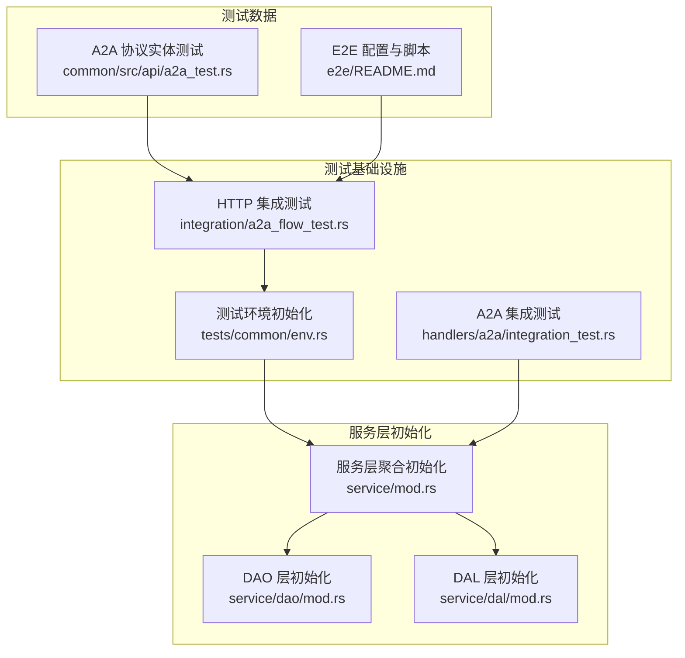
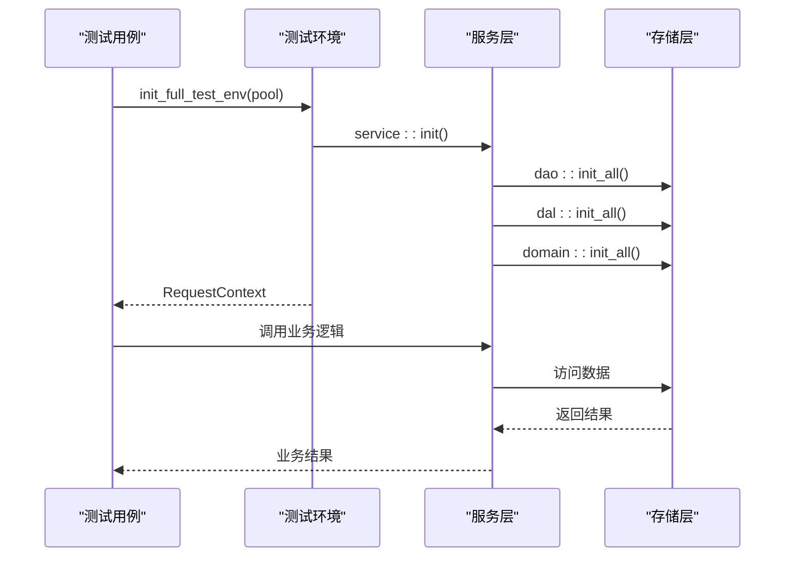
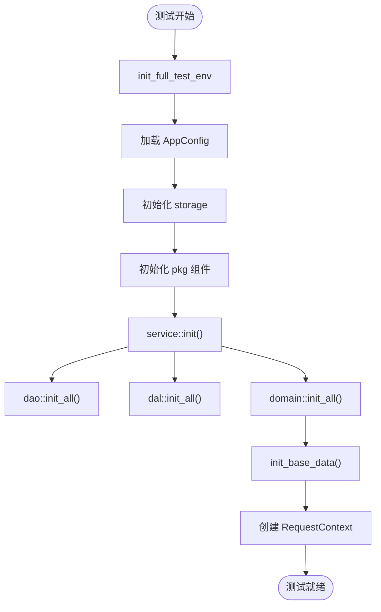
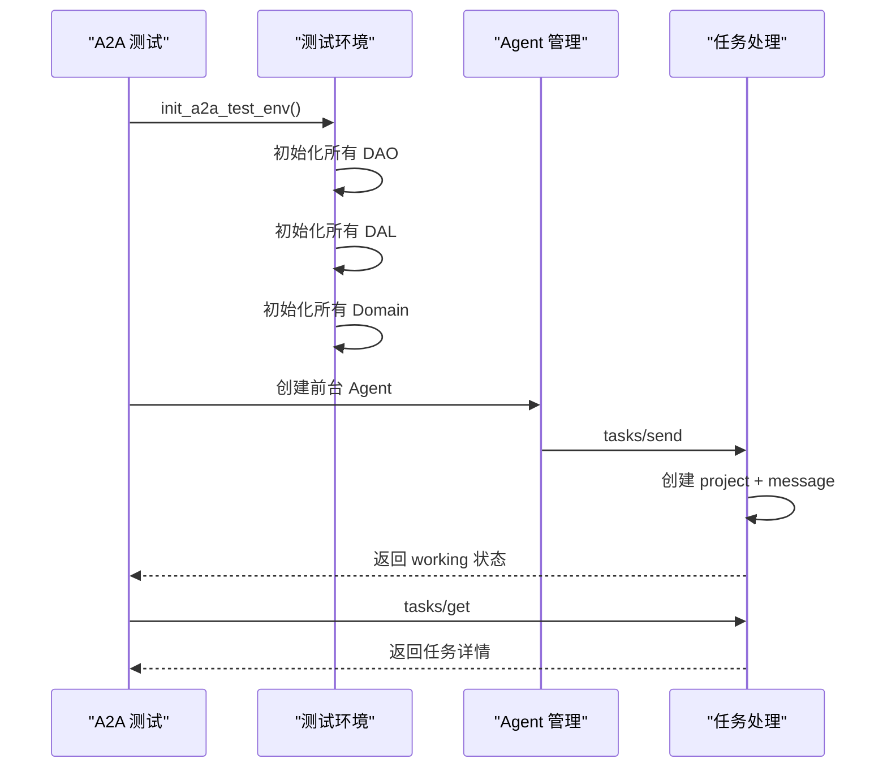
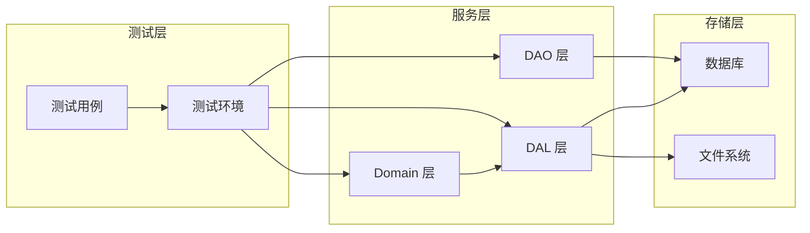

# 端到端测试基础设施

<cite>
**本文引用的文件**
- [tests/common/env.rs](tests/common/env.rs)
- [src/handlers/a2a/integration_test.rs](src/handlers/a2a/integration_test.rs)
- [tests/integration/a2a_flow_test.rs](tests/integration/a2a_flow_test.rs)
- [common/src/api/a2a_test.rs](common/src/api/a2a_test.rs)
- [src/service/mod.rs](src/service/mod.rs)
- [src/service/dao/mod.rs](src/service/dao/mod.rs)
- [src/service/dal/mod.rs](src/service/dal/mod.rs)
- [e2e/README.md](e2e/README.md)
- [docs/design/browser_e2e_test_design.md](docs/design/browser_e2e_test_design.md)
</cite>

## 更新摘要
**变更内容**
- 增强了 A2A 集成测试中的依赖注入链完整性，确保所有必要的 DAO 和 DAL 组件都正确初始化
- 统一了测试环境初始化流程，使用 `service::init()` 替代手动逐个初始化
- 强化了测试隔离机制，通过 `OnceCell` 串行化初始化避免并行测试竞争
- 完善了 A2A 协议端到端测试覆盖，包括 agent card 发现、tasks/send-get 往返流程

## 目录
1. [简介](#简介)
2. [项目结构](#项目结构)
3. [核心组件](#核心组件)
4. [架构总览](#架构总览)
5. [详细组件分析](#详细组件分析)
6. [依赖关系分析](#依赖关系分析)
7. [性能与可观测性](#性能与可观测性)
8. [故障排查指南](#故障排查指南)
9. [结论](#结论)
10. [附录](#附录)

## 简介
本仓库围绕"端到端测试基础设施"的目标，重点增强了 A2A（Agent-to-Agent）协议的集成测试能力。通过完善依赖注入链的完整性，确保所有必要的 DAO 和 DAL 组件在测试环境中正确初始化，实现了从 HTTP 接口到数据库访问的完整链路验证。E2E 工程提供本地回归能力，通过 Playwright 驱动浏览器执行导航巡检与冒烟用例，保障前后端协议一致性与交互稳定性。

## 项目结构
本次增强主要涉及测试基础设施的核心组件：
- **测试环境初始化**：统一的 `init_full_test_env` 函数，通过 `OnceCell` 串行化初始化，避免并行测试竞争
- **A2A 集成测试**：完整的协议流程测试，包括 agent card 发现和 JSON-RPC 任务处理
- **服务层初始化**：通过 `service::init()` 一行代码替代 30+ 个手动 init 调用
- **DAO/DAL 依赖管理**：确保正确的初始化顺序，特别是 user DAO 必须在 DAL 层之前初始化

**图表来源**
- [tests/common/env.rs:25-87](tests/common/env.rs#L25-L87)
- [src/handlers/a2a/integration_test.rs:10-67](src/handlers/a2a/integration_test.rs#L10-L67)
- [tests/integration/a2a_flow_test.rs:30-201](tests/integration/a2a_flow_test.rs#L30-L201)
- [src/service/mod.rs:6-20](src/service/mod.rs#L6-L20)
- [src/service/dao/mod.rs:29-55](src/service/dao/mod.rs#L29-L55)
- [src/service/dal/mod.rs:54-76](src/service/dal/mod.rs#L54-L76)

**章节来源**
- [tests/common/env.rs:25-87](tests/common/env.rs#L25-L87)
- [src/handlers/a2a/integration_test.rs:10-67](src/handlers/a2a/integration_test.rs#L10-L67)
- [tests/integration/a2a_flow_test.rs:30-201](tests/integration/a2a_flow_test.rs#L30-L201)
- [src/service/mod.rs:6-20](src/service/mod.rs#L6-L20)
- [src/service/dao/mod.rs:29-55](src/service/dao/mod.rs#L29-L55)
- [src/service/dal/mod.rs:54-76](src/service/dal/mod.rs#L54-L76)

## 核心组件
- **测试环境初始化器**：使用 `tokio::sync::OnceCell` 实现幂等初始化，确保所有集成测试共享全局数据库实例，通过唯一 ID 隔离数据
- **A2A 协议测试套件**：覆盖 agent card 发现、JSON-RPC 任务发送获取、状态转换等完整流程
- **服务层聚合初始化**：通过 `service::init()` 统一管理 DAO、DAL、Domain 层的初始化顺序和依赖关系
- **依赖注入链管理**：确保 user DAO 在 DAL 层之前初始化，支持飞书凭证引用解析等复杂依赖场景

**章节来源**
- [tests/common/env.rs:25-87](tests/common/env.rs#L25-L87)
- [src/handlers/a2a/integration_test.rs:10-67](src/handlers/a2a/integration_test.rs#L10-L67)
- [src/service/mod.rs:6-20](src/service/mod.rs#L6-L20)

## 架构总览
整体遵循三层单向调用：测试环境 → 服务层 → 存储层。测试环境通过 `init_full_test_env` 完成所有单例初始化，然后创建 RequestContext 供测试使用。A2A 测试覆盖从 HTTP 接口到数据库的完整链路。

**图表来源**
- [tests/common/env.rs:25-87](tests/common/env.rs#L25-L87)
- [src/service/mod.rs:6-20](src/service/mod.rs#L6-L20)

**章节来源**
- [tests/common/env.rs:25-87](tests/common/env.rs#L25-L87)
- [src/service/mod.rs:6-20](src/service/mod.rs#L6-L20)

## 详细组件分析

### 测试环境初始化器
**更新** 增强了依赖注入链的完整性，确保所有必要的组件都正确初始化

测试环境初始化器使用 `OnceCell` 实现串行化初始化，避免并行测试时的竞争条件。初始化流程包括：
1. 加载全局 AppConfig
2. 初始化 pkg::storage（临时目录 + InMemory 向量库）
3. 初始化 JWT、工具追踪、工具注册表
4. 通过 `service::init()` 一行代码完成所有 DAO/DAL/Domain 初始化
5. 初始化 AOP 生产者和消费者
6. 异步初始化基础数据

**图表来源**
- [tests/common/env.rs:25-87](tests/common/env.rs#L25-L87)

**章节来源**
- [tests/common/env.rs:25-87](tests/common/env.rs#L25-L87)

### A2A 集成测试
**更新** 完善了依赖注入链的完整性，确保所有必要的 DAO 和 DAL 组件都正确初始化

A2A 集成测试覆盖了完整的协议流程，包括 agent card 发现和 JSON-RPC 任务处理。测试环境初始化时特别注意了依赖顺序：
- user DAO 必须先于 DAL 层初始化（用于飞书凭证引用解析）
- 消息渠道 DAO 需要在 DAL 层之前初始化
- Domain 层初始化需要等待所有 DAL 就绪

**图表来源**
- [src/handlers/a2a/integration_test.rs:10-67](src/handlers/a2a/integration_test.rs#L10-L67)
- [tests/integration/a2a_flow_test.rs:78-201](tests/integration/a2a_flow_test.rs#L78-L201)

**章节来源**
- [src/handlers/a2a/integration_test.rs:10-67](src/handlers/a2a/integration_test.rs#L10-L67)
- [tests/integration/a2a_flow_test.rs:78-201](tests/integration/a2a_flow_test.rs#L78-L201)

### 服务层聚合初始化
**更新** 简化了测试环境初始化，通过聚合函数统一管理依赖注入

服务层聚合初始化函数 `service::init()` 提供了统一的初始化入口，内部按正确顺序调用各层初始化函数：
1. DAO 层初始化
2. DAL 层初始化（依赖 DAO）
3. 设置 lark_cli 凭证解析器
4. Domain 层初始化（依赖 DAL）

这种设计确保了依赖关系的正确性，同时简化了测试环境的搭建过程。

**章节来源**
- [src/service/mod.rs:6-20](src/service/mod.rs#L6-L20)
- [src/service/dao/mod.rs:29-55](src/service/dao/mod.rs#L29-L55)
- [src/service/dal/mod.rs:54-76](src/service/dal/mod.rs#L54-L76)

## 依赖关系分析
**更新** 明确了依赖注入链的初始化顺序，确保所有必要的组件都正确初始化

测试基础设施的关键依赖关系：
- **测试环境** → **服务层** → **存储层**
- **user DAO** 必须在 **DAL 层** 之前初始化（用于飞书凭证引用解析）
- **消息渠道 DAO** 需要在 **DAL 层** 之前初始化
- **Domain 层** 必须等待所有 **DAL** 就绪

**图表来源**
- [tests/common/env.rs:25-87](tests/common/env.rs#L25-L87)
- [src/service/mod.rs:6-20](src/service/mod.rs#L6-L20)

**章节来源**
- [tests/common/env.rs:25-87](tests/common/env.rs#L25-L87)
- [src/service/mod.rs:6-20](src/service/mod.rs#L6-L20)

## 性能与可观测性
- **串行化初始化**：使用 `OnceCell` 确保测试环境只初始化一次，避免重复开销
- **临时目录隔离**：storage 使用临时目录，避免污染开发环境
- **InMemory 向量库**：测试中使用内存向量库，避免磁盘 IO 开销
- **工具追踪**：初始化 ToolCallLogger，记录工具调用轨迹便于调试

[本节为一般性指导，不直接分析具体文件]

## 故障排查指南
**更新** 新增了依赖注入链相关的故障排查指南

- **测试环境初始化失败**：检查 `service::init()` 是否正确调用，确认所有依赖都已初始化
- **A2A 测试失败**：确认 agent card 端点可用，JWT 配置正确，agent 状态为 Onboarded
- **依赖注入错误**：检查 user DAO 是否在 DAL 层之前初始化，消息渠道 DAO 是否已初始化
- **并发测试问题**：确认使用 `OnceCell` 串行化初始化，避免多个测试同时初始化
- **数据隔离问题**：确认每个测试使用唯一的 ID，不依赖数据库初始状态

**章节来源**
- [tests/common/env.rs:25-87](tests/common/env.rs#L25-L87)
- [src/handlers/a2a/integration_test.rs:10-67](src/handlers/a2a/integration_test.rs#L10-L67)
- [tests/integration/a2a_flow_test.rs:30-201](tests/integration/a2a_flow_test.rs#L30-L201)

## 结论
本次更新显著增强了端到端测试基础设施的可靠性，特别是 A2A 集成测试中的依赖注入链完整性。通过统一的测试环境初始化机制和严格的依赖管理，确保了所有必要的 DAO 和 DAL 组件都能正确初始化。新的测试框架提供了完整的 A2A 协议覆盖，包括 agent card 发现和 JSON-RPC 任务处理的端到端验证。这种改进使得测试更加稳定可靠，能够更好地捕捉集成层面的问题。

[本节为总结性内容，不直接分析具体文件]

## 附录
- **关键测试文件**：
  - `tests/common/env.rs`：测试环境初始化
  - `src/handlers/a2a/integration_test.rs`：A2A 集成测试
  - `tests/integration/a2a_flow_test.rs`：HTTP 集成测试
- **服务层初始化**：
  - `src/service/mod.rs`：服务层聚合初始化
  - `src/service/dao/mod.rs`：DAO 层初始化
  - `src/service/dal/mod.rs`：DAL 层初始化

**章节来源**
- [tests/common/env.rs:25-87](tests/common/env.rs#L25-L87)
- [src/handlers/a2a/integration_test.rs:10-67](src/handlers/a2a/integration_test.rs#L10-L67)
- [tests/integration/a2a_flow_test.rs:30-201](tests/integration/a2a_flow_test.rs#L30-L201)
- [src/service/mod.rs:6-20](src/service/mod.rs#L6-L20)
- [src/service/dao/mod.rs:29-55](src/service/dao/mod.rs#L29-L55)
- [src/service/dal/mod.rs:54-76](src/service/dal/mod.rs#L54-L76)