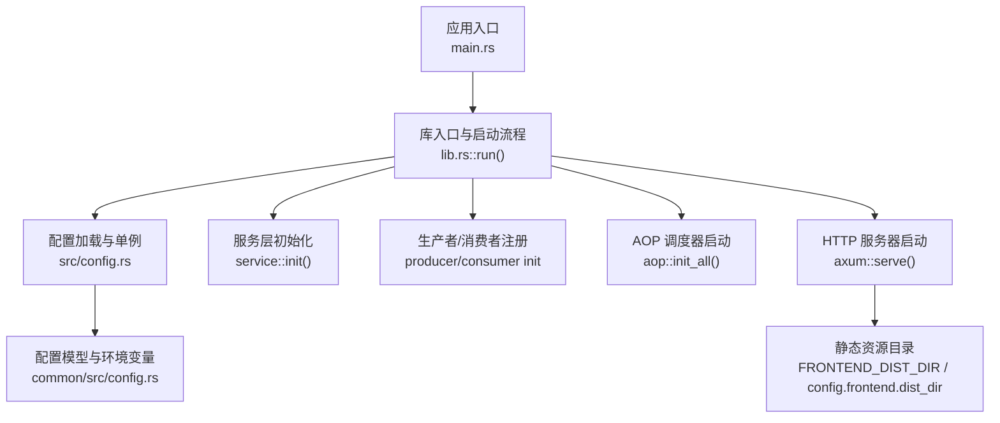
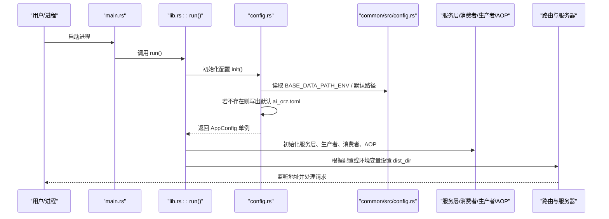
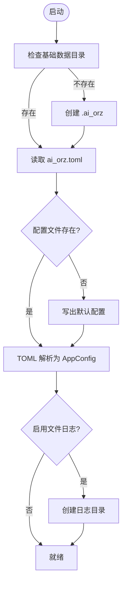
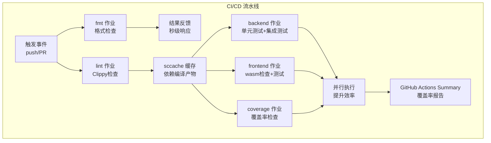
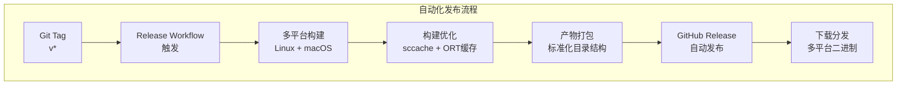
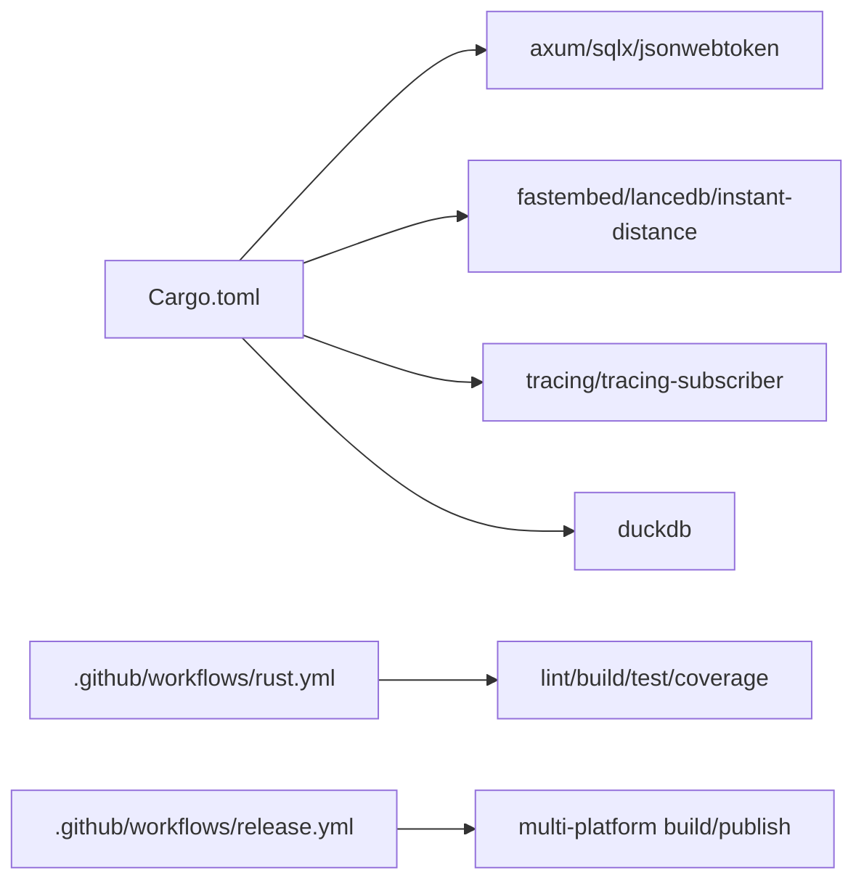
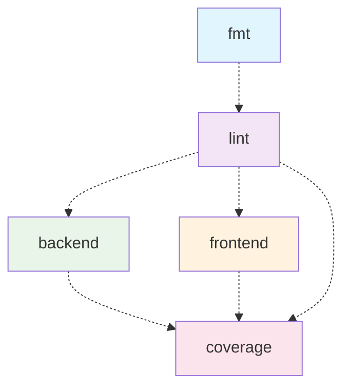

# 配置与部署

<cite>
**本文引用的文件**
- [common/config/ai_orz.toml](common/config/ai_orz.toml)
- [src/config.rs](src/config.rs)
- [common/src/config.rs](common/src/config.rs)
- [src/main.rs](src/main.rs)
- [src/lib.rs](src/lib.rs)
- [start.sh](scripts/start.sh)
- [build.sh](scripts/build.sh)
- [Cargo.toml](Cargo.toml)
- [.github/workflows/rust.yml](.github/workflows/rust.yml)
- [.github/workflows/release.yml](.github/workflows/release.yml)
</cite>

<cite>
**【2026-08-16 增量追加互引】**

### 本文关联的三类文档（四类互引闭环增量补齐）
**① 设计文档（Design）**：
- docs/design/doc_link_classifier_and_quality_gates.md（占位：待 ai-orz-doc-maintainer 落地后回填真实路径）
- docs/design/build_and_deployment_workflow_design.md（占位：待 ai-orz-doc-maintainer 落地后回填真实路径）

**② 落地计划（Plan）**：
- docs/plan/scripts_reorg_makefile_unified_entry_and_60_plus_fixes.md（占位：待 ai-orz-doc-maintainer 落地后回填真实路径）

**④ RAG 原子知识卡**：
- [scripts 归置 + Makefile 统一入口 + 60+ 引用全量修正](docs/wiki/knowledge/zh/scripts 归置 + Makefile 统一入口 + 60+ 引用全量修正/scripts 归置 + Makefile 统一入口 + 60+ 引用全量修正.md) — §红线 6 部署脚本统一入口 Makefile：make docker-build / make build / make ci-docs-lint
- [DocLinkClassifier 通用分类器 + docs_lint 二进制门禁 + docs_migrate 迁移脚本工具链](docs/wiki/knowledge/zh/DocLinkClassifier 通用分类器 + docs_lint 二进制门禁 + docs_migrate 迁移脚本工具链/DocLinkClassifier 通用分类器 + docs_lint 二进制门禁 + docs_migrate 迁移脚本工具链.md) — §红线 4 发布前 CI 必须通过 `make ci-docs-lint` 门禁（docs_lint 三规则 0 violation）
</cite>

## 更新摘要
**变更内容**
- 新增了完整的自动化发布流程章节，包含多平台原生构建、二进制打包和 GitHub Release 自动发布功能
- 更新了 CI/CD 流水线配置，反映增强的并行化作业执行模型
- 添加了独立格式检查作业的说明，提供即时反馈
- 更新了 protobuf 依赖管理，包含 libprotobuf-dev 安装说明
- 增强了 sccache 缓存优化配置
- 添加了高级覆盖率报告与 GitHub Actions 集成说明
- 更新了包安装优化，使用 --no-install-recommends 减少镜像大小
- 新增了发布产物管理和版本控制指导
**2026-08-16 增量更新**：cite 区补四类互引闭环（2 Design+1 Plan 规范占位 + 2 RAG 卡）；关联 T8（scripts/Makefile 归置）与 T6（docs_lint 作为 CI/发布门禁）两大主题；§5 配置项说明、§7 CI/CD 章节来源行号降级（因 ci-docs-lint job 新增、Makefile target 统一导致配置与 workflow 文件行号范围漂移，优先降级为无行号范围引用）。

## 目录
1. [简介](#简介)
2. [项目结构](#项目结构)
3. [核心组件](#核心组件)
4. [架构总览](#架构总览)
5. [详细组件分析](#详细组件分析)
6. [依赖关系分析](#依赖关系分析)
7. [性能考虑](#性能考虑)
8. [故障排除指南](#故障排除指南)
9. [结论](#结论)
10. [附录](#附录)

## 简介
本文件面向运维与交付团队，提供 AI Orz 的配置、环境变量管理、动态配置加载机制以及生产环境部署的完整指导。内容涵盖：
- 配置文件格式与默认值来源
- 环境变量优先级与覆盖策略
- 启动流程与静态资源目录注入
- 生产构建与运行方式（含脚本）
- CI/CD 流水线配置与优化
- **新增** 自动化发布流程与多平台构建
- 安全与性能调优建议
- 常见故障定位方法

## 项目结构
AI Orz 采用 Rust 工作区组织，后端二进制通过统一入口初始化配置、服务层、AOP 调度器并启动 HTTP 服务器；前端静态资源由配置或环境变量指定目录提供。

图表来源
- [src/main.rs:1-5](src/main.rs#L1-L5)
- [src/lib.rs:114-175](src/lib.rs#L114-L175)
- [src/config.rs:26-77](src/config.rs#L26-L77)
- [common/src/config.rs:21-59](common/src/config.rs#L21-L59)

章节来源
- [src/main.rs:1-5](src/main.rs#L1-L5)
- [src/lib.rs:114-175](src/lib.rs#L114-L175)
- [src/config.rs:26-77](src/config.rs#L26-L77)
- [common/src/config.rs:21-59](common/src/config.rs#L21-L59)

## 核心组件
- 配置模型与默认值：集中定义在 common 模块，包含服务器、数据库、统计、前端、日志、JWT、消费者、飞书、A2A Server 等配置项。
- 配置加载与持久化：首次运行自动创建基础数据目录与默认配置文件，后续从磁盘读取解析。
- 环境变量覆盖：支持基础数据路径、JWT 密钥与过期时间、前端静态目录等关键项的环境变量覆盖。
- 启动流程：初始化配置 → 初始化 pkg（日志、存储、JWT、工具注册）→ 服务层 → 生产者/消费者 → AOP 调度器 → 启动 HTTP 服务。

章节来源
- [common/src/config.rs:21-59](common/src/config.rs#L21-L59)
- [src/config.rs:26-77](src/config.rs#L26-L77)
- [src/lib.rs:114-175](src/lib.rs#L114-L175)

## 架构总览
下图展示配置加载、环境变量覆盖与服务器启动的关键交互。

图表来源
- [src/main.rs:1-5](src/main.rs#L1-L5)
- [src/lib.rs:114-175](src/lib.rs#L114-L175)
- [src/config.rs:26-77](src/config.rs#L26-L77)
- [common/src/config.rs:244-262](common/src/config.rs#L244-L262)

## 详细组件分析

### 配置文件与默认值
- 默认配置文件位于 common 模块，并在编译时嵌入到二进制中。首次运行时若未找到配置文件，将自动写入默认配置。
- 基础数据目录固定为 .ai_orz（可通过环境变量覆盖），所有数据文件（数据库、日志、附件、技能等）均位于该目录下。
- 主要配置段：
  - server.listen_addr：监听地址
  - database.*：SQLite 文件名、向量数据库文件名、向量存储类型、HNSW 索引目录
  - stats.*：统计数据库文件名与批量大小
  - frontend.dist_dir：前端静态目录
  - logging.*：是否启用文件日志、日志子目录、日志格式、保留天数
  - jwt.secret / default_expiry_hours：JWT 密钥与默认过期时间
  - consumer.*：全局并发、空队列睡眠、错误重试睡眠、Topic 专属覆盖
  - lark.*：飞书集成开关与凭证
  - a2a_server.*：A2A Server 开关、协议版本、端点、Agent Card 路径

章节来源
- [common/config/ai_orz.toml:1-43](common/config/ai_orz.toml#L1-L43)
- [common/src/config.rs:21-59](common/src/config.rs#L21-L59)
- [common/src/config.rs:116-168](common/src/config.rs#L116-L168)
- [common/src/config.rs:418-549](common/src/config.rs#L418-L549)

### 环境变量管理与优先级
- 基础数据路径：AI_ORZ_BASE_PATH 可覆盖默认 .ai_orz 目录。
- JWT 相关：
  - JWT_SECRET：签名密钥（生产环境必须设置）
  - JWT_EXPIRY_HOURS：默认过期小时数
- 前端静态目录：FRONTEND_DIST_DIR 可覆盖配置中的 dist_dir。
- 其他：SERVER_PORT 用于生产模式监听端口提示（实际监听仍由配置决定）。

优先级说明：
- 环境变量优先于配置文件字段
- 配置文件优先于编译时默认值
- 程序内部逻辑对必要目录进行自动创建（如基础数据目录、日志目录）

章节来源
- [common/src/config.rs:11-19](common/src/config.rs#L11-L19)
- [common/src/config.rs:244-262](common/src/config.rs#L244-L262)
- [src/config.rs:38-77](src/config.rs#L38-L77)
- [src/lib.rs:156-161](src/lib.rs#L156-L161)
- [start.sh:190-203](scripts/start.sh#L190-L203)

### 动态配置加载机制
- 首次运行：检查基础数据目录是否存在，不存在则创建；检查配置文件是否存在，不存在则从嵌入的默认配置写出。
- 解析配置：使用 TOML 解析为 AppConfig，校验失败会返回配置无效错误。
- 目录保障：确保日志目录存在（当启用文件日志时）。
- 单例访问：配置以 Arc<AppConfig> 形式缓存，供后续各模块获取。

图表来源
- [src/config.rs:38-77](src/config.rs#L38-L77)
- [common/src/config.rs:244-262](common/src/config.rs#L244-L262)

章节来源
- [src/config.rs:38-77](src/config.rs#L38-L77)
- [common/src/config.rs:244-262](common/src/config.rs#L244-L262)

### 生产环境部署步骤
- 开发模式：使用 start.sh dev 同时启动后端与前端开发服务器。
- 仅构建：使用 start.sh build 或 build.sh 执行前后端 release 构建。
- 生产模式：使用 start.sh prod 执行构建并运行 release 二进制。
- 监听地址与静态目录：
  - 监听地址来自配置 server.listen_addr
  - 静态目录优先使用 FRONTEND_DIST_DIR，否则回退到配置 frontend.dist_dir

章节来源
- [start.sh:66-107](scripts/start.sh#L66-L107)
- [start.sh:129-203](scripts/start.sh#L129-L203)
- [build.sh:1-10](scripts/build.sh#L1-L10)
- [src/lib.rs:156-172](src/lib.rs#L156-L172)

### Docker 容器化配置
当前仓库未提供 Dockerfile 或 docker-compose 配置。建议基于以下要点自行构建镜像：
- 基础镜像：选择包含 Rust 工具链的发行版镜像或使用多阶段构建生成最小镜像。
- 构建产物：
  - 后端：cargo build --release 输出 target/release/ai_orz
  - 前端：start.sh build 产出 dist/ 目录下的静态资源
- 运行参数：
  - 环境变量：AI_ORZ_BASE_PATH、JWT_SECRET、JWT_EXPIRY_HOURS、FRONTEND_DIST_DIR
  - 挂载卷：将宿主机的持久化目录映射到容器内 AI_ORZ_BASE_PATH 指向的路径，确保数据库、日志、附件等数据持久化
- 网络暴露：根据 server.listen_addr 暴露对应端口（默认 3000）

[本节为通用建议，不直接引用具体代码文件]

### 启动脚本使用
- start.sh 支持多种模式：dev、prod、build、backend、frontend、help
- 生产模式会先执行构建，再运行 release 二进制
- 开发模式会并行启动后端与前端，并提供优雅停止信号处理

章节来源
- [start.sh:1-232](scripts/start.sh#L1-L232)

### CI/CD 流水线配置

**已更新** 增强了CI/CD流水线配置，实现了全面的重构和优化。

#### 并行化作业执行模型
新的流水线采用并行化作业执行模型，显著提升构建效率：
- **fmt 作业**：独立的格式检查作业，提供秒级即时反馈
- **lint 作业**：Clippy 代码质量检查，需要 protobuf 编译器支持
- **backend 作业**：后端单元测试与集成测试，与前端作业并行执行
- **frontend 作业**：前端 wasm 目标检查与测试，独立于后端作业
- **coverage 作业**：覆盖率检查，与 backend/frontend 并行执行

#### 依赖管理优化
- **Protobuf 依赖修复**：显式安装 `protobuf-compiler` 和 `libprotobuf-dev`，解决 lance-encoding build script 的 empty.proto 缺失问题
- **包安装优化**：所有 apt-get 安装命令使用 `--no-install-recommends` 标志，减少镜像体积
- **ORT 预构建二进制缓存**：针对 ort-sys 依赖添加专用缓存键

#### sccache 缓存优化
- **跨作业共享缓存**：所有作业共享同一个 sccache 缓存目录 `~/.cache/sccache`
- **内容寻址缓存**：基于 Cargo.lock 哈希值的缓存键，实现跨 CI run 的编译产物复用
- **增量编译禁用**：禁用增量编译让 sccache 完全接管缓存管理
- **缓存预热**：lint 作业完成后，后续作业可直接命中依赖编译产物

#### 高级覆盖率报告
- **差异化阈值**：push main 分支要求 45% 覆盖率，PR 要求 38% 覆盖率
- **分步执行**：使用新版 cargo-llvm-cov 接口，分离收集与报告阶段
- **GitHub Actions 集成**：覆盖率摘要直接写入 GitHub Actions Summary 页面
- **HTML 报告**：生成完整的 HTML 覆盖率报告作为 artifact 上传

图表来源
- [.github/workflows/rust.yml:16-295](.github/workflows/rust.yml#L16-L295)

章节来源
- [.github/workflows/rust.yml:16-295](.github/workflows/rust.yml#L16-L295)

### 自动化发布流程

**新增** 完整的自动化发布流程，支持多平台原生构建和 GitHub Release 自动发布。

#### 发布触发机制
- **Tag 触发**：推送 v* 格式的 tag 自动触发发布流程
- **手动触发**：支持 workflow_dispatch 手动触发发布验证
- **版本管理**：基于 Git tag 的版本控制系统

#### 多平台原生构建
发布流程支持双平台原生构建，避免交叉编译复杂性：
- **Linux x86_64**：ubuntu-latest + x86_64-unknown-linux-gnu
- **macOS ARM64**：macos-latest + aarch64-apple-darwin
- **原生编译**：不使用交叉编译，确保依赖库（lancedb/ort-sys）正确链接

#### 构建优化配置
- **sccache 缓存**：独立的 release profile 缓存键，与 CI 缓存分离
- **ORT 预构建缓存**：针对 ort-sys 依赖的专用缓存路径
- **Dioxus CLI 集成**：自动安装 dx 工具进行前端构建
- **Protobuf 依赖**：根据平台自动安装 protoc 和 libprotobuf-dev

#### 发布产物打包
- **标准化目录结构**：ai_orz-{tag}-{target}/ 目录
- **完整分发包**：包含后端二进制、前端静态资源、README.txt 说明
- **压缩归档**：自动生成 tar.gz 压缩包便于分发
- **版本标识**：文件名包含版本号和目标平台信息

#### GitHub Release 自动发布
- **条件触发**：仅在 v* tag 推送时执行发布步骤
- **权限控制**：使用 contents: write 权限创建 Release
- **自动笔记**：generate_release_notes 自动生成发布说明
- **资产上传**：自动上传所有平台构建产物

图表来源
- [.github/workflows/release.yml:1-143](.github/workflows/release.yml#L1-L143)

章节来源
- [.github/workflows/release.yml:1-143](.github/workflows/release.yml#L1-L143)

## 依赖关系分析
- 工作区成员：主包、frontend、common、ai-orz-macros
- 关键依赖：
  - axum：HTTP 框架
  - sqlx：SQLite 迁移与查询
  - tracing/tracing-subscriber：结构化日志
  - jsonwebtoken：JWT 签发与验证
  - fastembed/lancedb/instant-distance：向量化与向量检索
  - duckdb：统计数据库
- CI 流水线：lint、后端构建与测试、前端 wasm 检查与测试、覆盖率报告
- **新增** 发布流水线：多平台构建、产物打包、GitHub Release

图表来源
- [Cargo.toml:1-147](Cargo.toml#L1-L147)
- [.github/workflows/rust.yml:16-295](.github/workflows/rust.yml#L16-L295)
- [.github/workflows/release.yml:1-143](.github/workflows/release.yml#L1-L143)

章节来源
- [Cargo.toml:1-147](Cargo.toml#L1-L147)
- [.github/workflows/rust.yml:16-295](.github/workflows/rust.yml#L16-L295)
- [.github/workflows/release.yml:1-143](.github/workflows/release.yml#L1-L143)

## 性能考虑
- 向量存储后端选择：
  - LanceDB：默认高性能嵌入式向量数据库，适合生产
  - InMemory：纯内存实现，适合测试
  - Hnsw：高性能近似最近邻索引，需持久化目录
  - SqliteVss：需要系统依赖
- 消费者并发与重试：
  - 全局并发、空队列睡眠、错误重试睡眠可通过配置调整
  - Topic 专属覆盖可针对热点通道提升吞吐
- 日志格式与保留：
  - 默认 JSON 格式便于日志分析
  - 可按天清理日志，避免磁盘占用过大
- 统计写入批大小：
  - DuckDB 统计写入支持批量缓冲，减少 IO 次数
- CI/CD 性能优化：
  - sccache 缓存跨作业共享，显著减少重复编译时间
  - 并行作业执行模型提升整体流水线效率
  - 增量构建与缓存预热优化构建速度
- **新增** 发布构建优化：
  - 独立 release profile 缓存键，避免与 CI 缓存冲突
  - ORT 预构建二进制缓存，加速机器学习依赖编译
  - 多平台并行构建，缩短发布等待时间

章节来源
- [common/src/config.rs:78-114](common/src/config.rs#L78-L114)
- [common/src/config.rs:116-168](common/src/config.rs#L116-L168)
- [common/src/config.rs:418-488](common/src/config.rs#L418-L488)
- [.github/workflows/rust.yml:42-74](.github/workflows/rust.yml#L42-L74)
- [.github/workflows/release.yml:40-68](.github/workflows/release.yml#L40-L68)

## 故障排除指南
- 配置文件无效：
  - 现象：启动时报配置解析错误
  - 排查：检查 ai_orz.toml 语法与必填字段；确认基础数据目录权限
- 日志目录缺失：
  - 现象：文件日志无法写入
  - 排查：确认启用文件日志时日志目录已自动创建；检查磁盘空间与权限
- JWT 认证失败：
  - 现象：登录或鉴权失败
  - 排查：确认 JWT_SECRET 已设置且与服务端一致；检查 JWT_EXPIRY_HOURS 是否合理
- 前端静态资源 404：
  - 现象：访问 UI 页面空白或资源缺失
  - 排查：确认 FRONTEND_DIST_DIR 指向正确的 dist 目录；生产模式下确保已执行构建
- 向量检索异常：
  - 现象：搜索无结果或性能差
  - 排查：确认 vector_store_type 与后端匹配；检查向量数据库文件与 HNSW 索引目录权限与空间
- CI/CD 构建失败：
  - 现象：protobuf 编译错误或依赖缺失
  - 排查：确认 libprotobuf-dev 已正确安装；检查 sccache 缓存状态；验证并行作业依赖关系
- **新增** 发布构建失败：
  - 现象：多平台构建失败或产物不完整
  - 排查：确认各平台 protoc 依赖正确安装；检查 sccache 缓存状态；验证 GitHub Release 权限配置

章节来源
- [src/config.rs:60-73](src/config.rs#L60-L73)
- [common/src/config.rs:244-262](common/src/config.rs#L244-L262)
- [src/lib.rs:156-172](src/lib.rs#L156-L172)
- [.github/workflows/rust.yml:37-40](.github/workflows/rust.yml#L37-L40)
- [.github/workflows/release.yml:30-38](.github/workflows/release.yml#L30-L38)

## 结论
AI Orz 提供了完善的配置体系与启动流程，支持环境变量覆盖与默认配置自动生成，便于开发与生产环境的快速部署。通过合理的向量存储后端选择、消费者并发调优与日志策略，可在不同规模场景下获得稳定与高效的运行表现。新增的增强型 CI/CD 流水线通过并行化作业执行、sccache 缓存优化和高级覆盖率报告，显著提升了开发效率和代码质量保障能力。**新增的自动化发布流程**进一步简化了多平台构建和分发过程，支持一键发布到 GitHub Release，为团队协作和软件分发提供了完整的解决方案。建议在生产环境严格设置 JWT 密钥、规划数据目录与日志保留策略，并结合优化的 CI/CD 流水线进行质量门禁与覆盖率管控。

## 附录

### 环境变量清单
- AI_ORZ_BASE_PATH：基础数据目录（默认 .ai_orz）
- JWT_SECRET：JWT 签名密钥（生产必须）
- JWT_EXPIRY_HOURS：JWT 默认过期小时数
- FRONTEND_DIST_DIR：前端静态资源目录
- SERVER_PORT：生产模式端口提示（实际监听由配置决定）

章节来源
- [common/src/config.rs:11-19](common/src/config.rs#L11-L19)
- [common/src/config.rs:61-68](common/src/config.rs#L61-L68)
- [src/lib.rs:156-161](src/lib.rs#L156-L161)
- [start.sh:190-203](scripts/start.sh#L190-L203)

### 配置文件示例（参考路径）
- 默认配置模板：[common/config/ai_orz.toml](common/config/ai_orz.toml)
- 运行时生成的配置文件路径：{AI_ORZ_BASE_PATH}/ai_orz.toml

章节来源
- [common/config/ai_orz.toml:1-43](common/config/ai_orz.toml#L1-L43)
- [src/config.rs:52-58](src/config.rs#L52-L58)

### 部署清单
- 环境与依赖
  - Rust 工具链（用于构建）
  - Node/DX（前端开发，可选）
  - 足够的磁盘空间（数据库、日志、附件、向量索引）
  - Protobuf 编译器（CI/CD 环境必需）
- 构建产物
  - 后端二进制：target/release/ai_orz
  - 前端静态：dist/
- 运行参数
  - 环境变量：AI_ORZ_BASE_PATH、JWT_SECRET、JWT_EXPIRY_HOURS、FRONTEND_DIST_DIR
  - 监听地址：server.listen_addr
- 监控与日志
  - 日志目录：{AI_ORZ_BASE_PATH}/logs
  - 日志格式：json（便于分析）
  - 统计数据库：stats.duckdb（可配置）
- CI/CD 配置
  - sccache 缓存目录：~/.cache/sccache
  - ORT 预构建二进制缓存：~/.cache/ort
  - 覆盖率报告：./coverage/（GitHub Actions artifact）
- **新增** 发布配置
  - 发布触发：Git tag v* 格式
  - 目标平台：Linux x86_64 + macOS ARM64
  - 发布产物：ai_orz-{version}-{platform}.tar.gz
  - GitHub Release：自动创建并发布构建产物

章节来源
- [start.sh:129-203](scripts/start.sh#L129-L203)
- [common/src/config.rs:116-168](common/src/config.rs#L116-L168)
- [src/lib.rs:156-172](src/lib.rs#L156-L172)
- [.github/workflows/rust.yml:98-112](.github/workflows/rust.yml#L98-L112)
- [.github/workflows/rust.yml:289-295](.github/workflows/rust.yml#L289-L295)
- [.github/workflows/release.yml:18-26](.github/workflows/release.yml#L18-L26)
- [.github/workflows/release.yml:85-114](.github/workflows/release.yml#L85-L114)

### CI/CD 流水线配置详解

**已更新** 详细的CI/CD流水线配置说明，包含最新的优化特性。

#### 作业依赖关系

图表来源
- [.github/workflows/rust.yml:16-295](.github/workflows/rust.yml#L16-L295)

#### 关键配置参数
- **覆盖率阈值**：
  - Main 分支推送：45% 最低覆盖率要求
  - Pull Request：38% 最低覆盖率要求
- **缓存策略**：
  - sccache 缓存键：`sccache-${{ runner.os }}-${{ hashFiles('**/Cargo.lock') }}`
  - ORT 预构建二进制缓存键：`ort-sys-${{ runner.os }}-${{ hashFiles('Cargo.lock') }}`
- **并行执行**：
  - backend 与 frontend 作业并行执行
  - coverage 作业与 backend/frontend 并行执行

章节来源
- [.github/workflows/rust.yml:181-295](.github/workflows/rust.yml#L181-L295)

### 发布流程配置详解

**新增** 完整的自动化发布流程配置说明。

#### 发布触发条件
- **Tag 推送**：v* 格式的 Git tag 自动触发
- **手动触发**：workflow_dispatch 支持手动发布验证
- **权限要求**：需要仓库的 contents: write 权限

#### 多平台构建矩阵
- **Linux 平台**：
  - 运行环境：ubuntu-latest
  - 目标架构：x86_64-unknown-linux-gnu
  - 依赖安装：protobuf-compiler, libprotobuf-dev
- **macOS 平台**：
  - 运行环境：macos-latest  
  - 目标架构：aarch64-apple-darwin
  - 依赖安装：brew install protobuf

#### 构建优化策略
- **独立缓存键**：release profile 使用独立的 sccache 缓存键
- **ORT 预构建缓存**：针对 ort-sys 依赖的专用缓存路径
- **Dioxus CLI 集成**：自动安装 dx 工具进行前端构建
- **产物验证**：构建完成后自动验证产物完整性

#### 发布产物规范
- **目录结构**：ai_orz-{tag}-{target}/
- **包含内容**：
  - 后端二进制：ai_orz
  - 前端静态资源：dist/ 目录
  - 使用说明：README.txt 文件
- **压缩格式**：tar.gz 归档文件
- **命名规范**：ai_orz-{version}-{platform}.tar.gz

章节来源
- [.github/workflows/release.yml:4-7](.github/workflows/release.yml#L4-L7)
- [.github/workflows/release.yml:18-26](.github/workflows/release.yml#L18-L26)
- [.github/workflows/release.yml:30-38](.github/workflows/release.yml#L30-L38)
- [.github/workflows/release.yml:40-68](.github/workflows/release.yml#L40-L68)
- [.github/workflows/release.yml:85-114](.github/workflows/release.yml#L85-L114)
- [.github/workflows/release.yml:124-143](.github/workflows/release.yml#L124-L143)