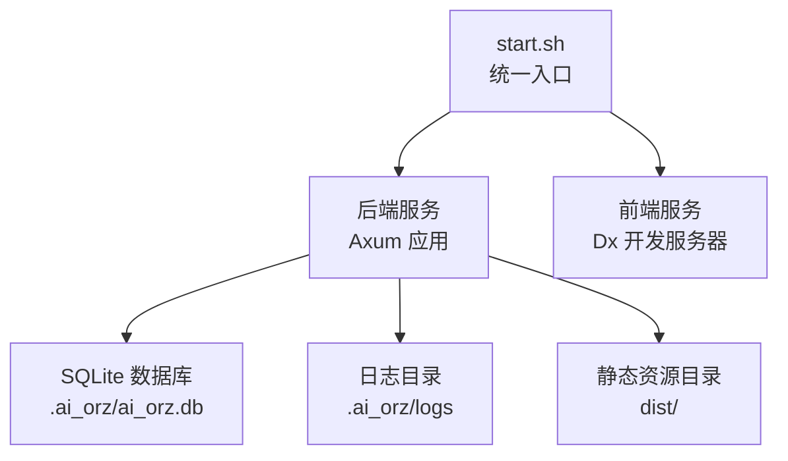
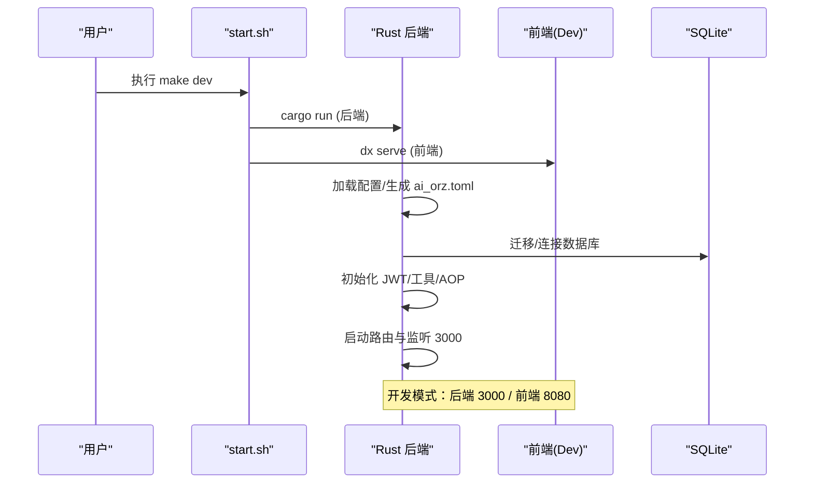
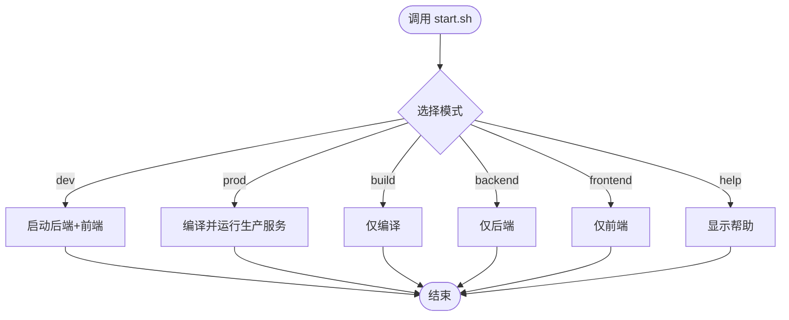
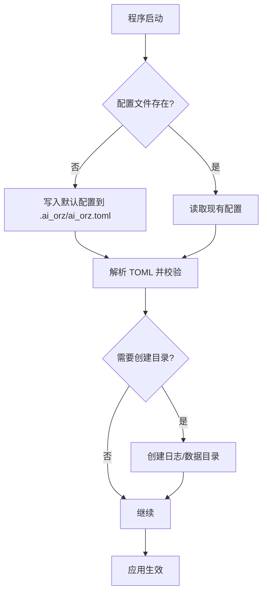
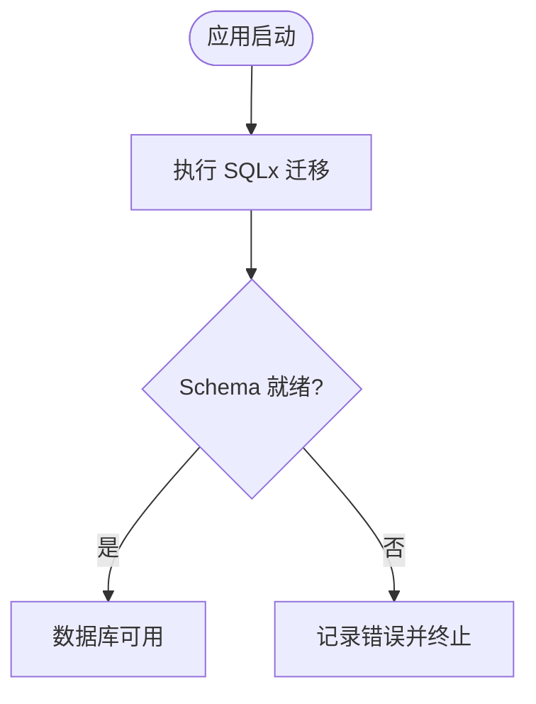
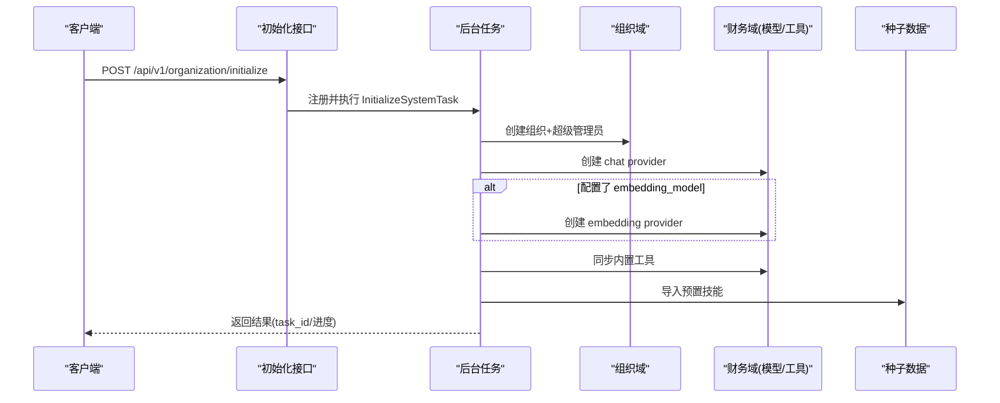
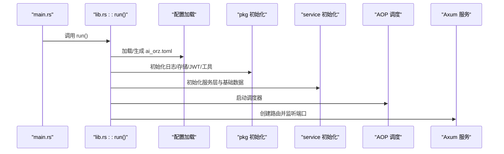
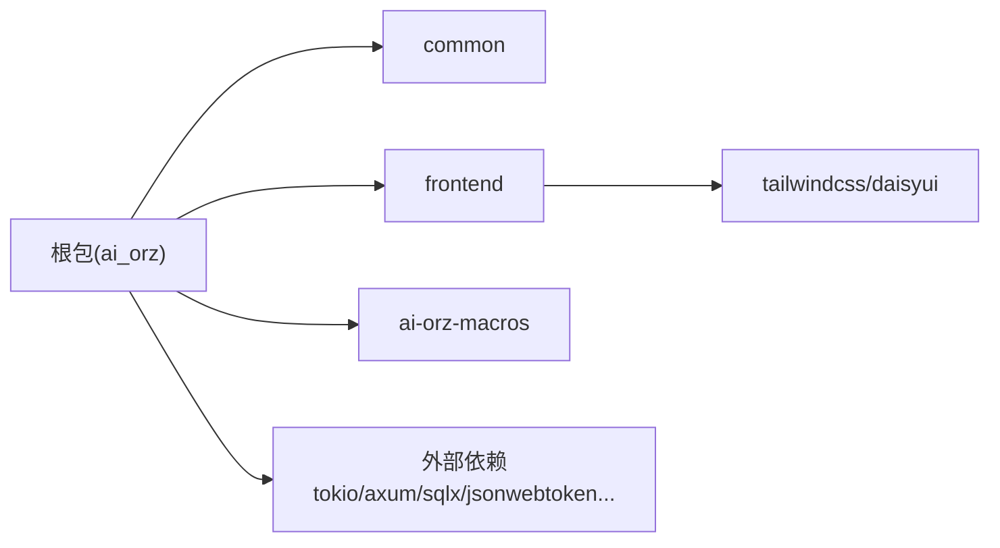

# 快速开始指南

<cite>
**本文引用的文件**
- [start.sh](scripts/start.sh)
- [ai_orz.toml](common/config/ai_orz.toml)
- [Cargo.toml](Cargo.toml)
- [rust-toolchain.toml](rust-toolchain.toml)
- [package.json](frontend/package.json)
- [main.rs](src/main.rs)
- [lib.rs](src/lib.rs)
- [config.rs](src/config.rs)
- [initialize_system.rs](src/handlers/organization/initialize_system.rs)
- [20260420000000_initial.sql](migrations/20260420000000_initial.sql)
- [20260819000000_user_credentials.sql](migrations/20260819000000_user_credentials.sql)
- [Makefile](Makefile)
- [scripts/build.sh](scripts/build.sh)
- [scripts/test.sh](scripts/test.sh)
- [scripts/doctor.sh](scripts/doctor.sh)

### 本文关联的设计/计划文档
- [时间戳处理约定](docs/design/timestamp_convention.md) — 毫秒级 Unix 时间戳统一规范
- [用户身份凭证独立表设计](docs/design/user_credentials_design.md) — user_credentials 表结构与迁移
- [用户身份凭证独立表落地](docs/plan/用户身份凭证独立表落地.md) — 迁移步骤与 DAO/DAL 变更
</cite>

## 更新摘要
**2026-08-19 增量更新**：
- 新增迁移脚本引用：`migrations/20260819000000_user_credentials.sql`（用户凭证独立表）
- 新增依赖检查：`scripts/doctor.sh` 提供后端依赖预检
- 新增 design/plan 引用：时间戳处理约定、用户身份凭证独立表设计与落地
- 原 2026-08-16 更新（Makefile 统一入口、四类互引闭环）仍然有效

## 目录
1. [简介](#简介)
2. [项目结构](#项目结构)
3. [核心组件](#核心组件)
4. [架构总览](#架构总览)
5. [详细组件分析](#详细组件分析)
6. [依赖分析](#依赖分析)
7. [性能考虑](#性能考虑)
8. [故障排除指南](#故障排除指南)
9. [结论](#结论)
10. [附录](#附录)

## 简介
本指南面向首次接触 AI Orz 的新用户，目标是帮助你在最短时间内完成环境准备、安装、启动与初始化，并成功访问前端界面。你将学会：
- 使用 start.sh 的多种模式（dev/prod/build/backend/frontend/help）
- 生成和修改配置文件 ai_orz.toml
- 数据库自动迁移与管理员账户创建流程
- 验证安装成功的测试方法
- 常见问题的定位与解决

## 项目结构
AI Orz 采用 Rust 后端 + Dioxus 前端（WASM）的双端工程，通过统一脚本 start.sh 管理开发/生产构建与运行。关键要点：
- 后端基于 Axum 提供 HTTP API，默认监听 0.0.0.0:3000
- 前端在开发模式下由 dx serve 提供热重载服务，默认端口 8080
- 生产模式下后端会提供 dist/ 下的静态资源
- 数据持久化使用 SQLite，数据库文件位于 .ai_orz/ 目录下
- 配置默认从二进制内嵌模板生成到 .ai_orz/ai_orz.toml，支持环境变量覆盖

图表来源
- [start.sh:66-107](scripts/start.sh#L66-L107)
- [start.sh:190-203](scripts/start.sh#L190-L203)
- [ai_orz.toml:9-29](common/config/ai_orz.toml#L9-L29)
- [lib.rs:156-172](src/lib.rs#L156-L172)

章节来源
- [start.sh:1-232](scripts/start.sh#L1-L232)
- [ai_orz.toml:1-43](common/config/ai_orz.toml#L1-L43)
- [lib.rs:114-175](src/lib.rs#L114-L175)

## 核心组件
- 启动脚本 start.sh：封装 dev/prod/build/backend/frontend/help 等模式，负责前后端进程管理与产物复制
- 配置加载 config.rs：首次运行自动生成 ai_orz.toml，确保基础目录存在，解析 TOML 配置
- 应用入口 lib.rs：初始化配置、存储、JWT、工具注册、AOP、生产者/消费者、路由与监听
- 系统初始化 initialize_system.rs：异步后台任务创建组织、超级管理员、模型提供商、内置工具与预置技能
- 数据库迁移 migrations：SQL 脚本定义初始表结构与索引

章节来源
- [start.sh:37-64](scripts/start.sh#L37-L64)
- [config.rs:26-78](src/config.rs#L26-L78)
- [lib.rs:114-175](src/lib.rs#L114-L175)
- [initialize_system.rs:24-224](src/handlers/organization/initialize_system.rs#L24-L224)
- [20260420000000_initial.sql:10-273](migrations/20260420000000_initial.sql#L10-L273)

## 架构总览
下图展示了从启动到服务的整体流程：脚本触发后端/前端，后端加载配置、初始化基础设施、执行幂等基础数据注入、启动 AOP 调度器、绑定路由与监听端口；前端在开发模式独立运行，生产模式由后端提供静态资源。

图表来源
- [start.sh:66-107](scripts/start.sh#L66-L107)
- [config.rs:26-78](src/config.rs#L26-L78)
- [lib.rs:114-175](src/lib.rs#L114-L175)

## 详细组件分析

### 启动脚本 start.sh 用法详解
- dev（默认）：同时启动后端与前端开发服务器
  - 后端：cargo run，监听 http://localhost:3000
  - 前端：dx serve，监听 http://localhost:8080
- prod：编译 release 并运行生产二进制，监听 0.0.0.0:3000，提供 dist/ 静态资源
- build：仅编译前端 release 与后端 release，不启动服务
- backend：仅启动后端开发服务器
- frontend：仅启动前端开发服务器
- help：显示帮助信息

图表来源
- [start.sh:37-64](scripts/start.sh#L37-L64)
- [start.sh:66-107](scripts/start.sh#L66-L107)
- [start.sh:129-188](scripts/start.sh#L129-L188)
- [start.sh:190-203](scripts/start.sh#L190-L203)

章节来源
- [start.sh:1-232](scripts/start.sh#L1-L232)

### 配置文件 ai_orz.toml 的生成与修改
- 首次运行会自动在 .ai_orz/ 下生成 ai_orz.toml（来自二进制内嵌模板）
- 可编辑的关键项：
  - server.listen_addr：监听地址与端口（默认 0.0.0.0:3000）
  - database.db_file_name：SQLite 文件名（相对 .ai_orz/）
  - frontend.dist_dir：静态资源目录（默认 dist）
  - logging.enable_file_log/log_subdir：是否启用文件日志及子目录
  - a2a_server.enabled：是否启用 A2A Server
  - jwt.secret/jwt.default_expiry_hours：JWT 密钥与过期时间（生产务必修改 secret）
- 环境变量可覆盖配置（如 AI_ORZ_LISTEN_ADDR、SECRET_KEY、JWT_SECRET、JWT_EXPIRY_HOURS、FRONTEND_DIST_DIR 等；首次初始化会把用户设置固化进配置文件）

图表来源
- [config.rs:26-78](src/config.rs#L26-L78)
- [ai_orz.toml:9-43](common/config/ai_orz.toml#L9-L43)

章节来源
- [config.rs:26-78](src/config.rs#L26-L78)
- [ai_orz.toml:1-43](common/config/ai_orz.toml#L1-L43)

### 数据库初始化与迁移
- 使用 SQLx 进行数据库迁移，首次运行将自动应用 migrations 中的 SQL 脚本
- 初始 schema 包含组织、用户、Agent、消息、工件、工具、技能等核心表与索引
- 数据库文件默认位于 .ai_orz/ai_orz.db（可通过配置调整）

图表来源
- [20260420000000_initial.sql:10-273](migrations/20260420000000_initial.sql#L10-L273)

章节来源
- [20260420000000_initial.sql:1-273](migrations/20260420000000_initial.sql#L1-L273)

### 管理员账户创建与系统初始化
- 系统未初始化时，调用初始化接口会创建一个后台任务，顺序执行：
  1) 创建组织与超级管理员
  2) 创建对话模型提供商（chat provider）
  3) 可选：创建向量模型提供商（embedding provider）
  4) 同步内置工具到数据库
  5) 导入预置技能
- 前端或客户端可通过检查接口确认系统是否已初始化，并通过登录获取 JWT

图表来源
- [initialize_system.rs:24-224](src/handlers/organization/initialize_system.rs#L24-L224)

章节来源
- [initialize_system.rs:1-284](src/handlers/organization/initialize_system.rs#L1-L284)

### 应用启动流程（后端）
- main.rs 调用 ai_orz::run()
- run() 中依次：
  - 初始化配置与基础数据目录
  - 初始化 pkg（日志、存储、JWT、工具注册）
  - 初始化 service 层与业务生产者/消费者
  - 执行幂等的基础数据注入
  - 启动 AOP 调度器
  - 根据配置加载静态资源目录与监听地址
  - 创建路由并启动 Axum 服务

图表来源
- [main.rs:1-5](src/main.rs#L1-L5)
- [lib.rs:114-175](src/lib.rs#L114-L175)

章节来源
- [main.rs:1-5](src/main.rs#L1-L5)
- [lib.rs:114-175](src/lib.rs#L114-L175)

## 依赖分析
- 工作区成员：根包、frontend、common、ai-orz-macros
- 后端关键依赖：tokio、axum、sqlx（sqlite）、toml、jsonwebtoken、fastembed、lancedb 等
- 前端依赖：TailwindCSS、DaisyUI（用于样式），构建脚本由 package.json 管理

图表来源
- [Cargo.toml:1-7](Cargo.toml#L1-L7)
- [Cargo.toml:17-71](Cargo.toml#L17-L71)
- [package.json:1-14](frontend/package.json#L1-L14)

章节来源
- [Cargo.toml:1-147](Cargo.toml#L1-L147)
- [package.json:1-14](frontend/package.json#L1-L14)

## 性能考虑
- 开发模式建议仅启动必要服务（backend/frontend），避免不必要的编译开销
- 生产模式使用 release 构建，减少运行时开销
- 向量搜索与嵌入模型可能带来较大启动与内存占用，可按需配置 embedding_model（可选）
- 合理设置日志级别与文件输出，避免磁盘 IO 瓶颈

[本节为通用指导，无需特定文件引用]

## 故障排除指南
- 无法启动后端
  - 检查端口占用（默认 3000），必要时修改 listen_addr
  - 查看 .ai_orz/logs 下的日志文件定位错误
  - 确认 SQLite 数据库文件权限与路径正确
- 前端无法访问
  - 开发模式确认 dx serve 是否监听 8080
  - 生产模式确认 dist/ 目录是否存在且包含前端产物
- 系统未初始化
  - 调用初始化接口创建组织与管理员，或通过前端引导流程完成
  - 使用检查接口确认 initialized=true
- JWT 相关错误
  - 生产环境务必修改 jwt.secret，避免使用默认值
  - 检查 JWT 过期时间与请求携带的 token 是否正确

章节来源
- [ai_orz.toml:9-43](common/config/ai_orz.toml#L9-L43)
- [initialize_system.rs:227-284](src/handlers/organization/initialize_system.rs#L227-L284)

## 结论
通过 start.sh 的统一入口，配合自动生成的 ai_orz.toml 与 SQLx 迁移，AI Orz 可在本地快速搭建并提供完整的后端 API 与前端界面。按照本指南完成环境准备、启动与初始化后，即可进入系统进行后续配置与使用。

[本节为总结性内容，无需特定文件引用]

## 附录

### 环境与工具要求
- Rust 工具链：stable（由 rust-toolchain.toml 指定），推荐版本 1.85+
- Node.js/Dx：用于前端开发与构建（dx serve/build）
- 其他：SQLite 驱动由 sqlx 管理，无需额外安装

章节来源
- [rust-toolchain.toml:1-5](rust-toolchain.toml#L1-L5)
- [package.json:1-14](frontend/package.json#L1-L14)

### 常用命令速查
- 开发全栈：make dev（等价 ./scripts/start.sh dev）
- 生产部署：make prod
- 仅构建：make build
- 仅后端：make run
- 仅前端：make serve
- 帮助：make help（全部命令一览）

章节来源
- [start.sh:37-64](scripts/start.sh#L37-L64)

### 端口与访问
- 后端 API：http://localhost:3000（生产模式监听 0.0.0.0:3000）
- 前端 UI（开发模式）：http://localhost:8080
- 生产模式静态资源：由后端提供 dist/ 目录

章节来源
- [start.sh:66-107](scripts/start.sh#L66-L107)
- [start.sh:190-203](scripts/start.sh#L190-L203)
- [lib.rs:156-172](src/lib.rs#L156-L172)

### 验证安装成功
- 健康检查：访问后端健康接口（若暴露）或使用浏览器访问前端页面
- 系统初始化检查：调用检查接口确认 initialized=true
- 登录获取 JWT：使用管理员账户登录并获取令牌

章节来源
- [initialize_system.rs:227-284](src/handlers/organization/initialize_system.rs#L227-L284)