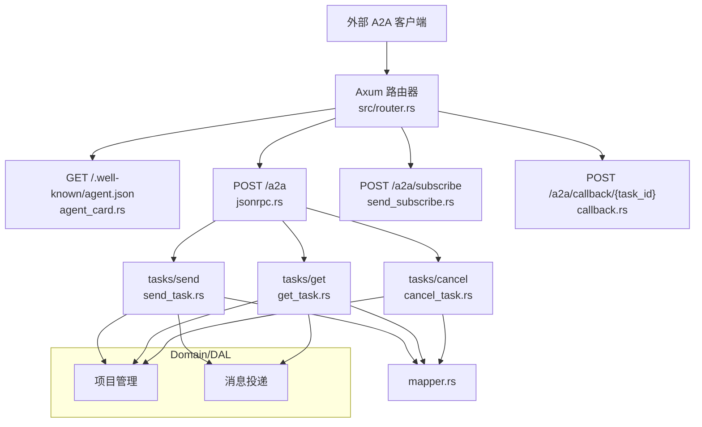
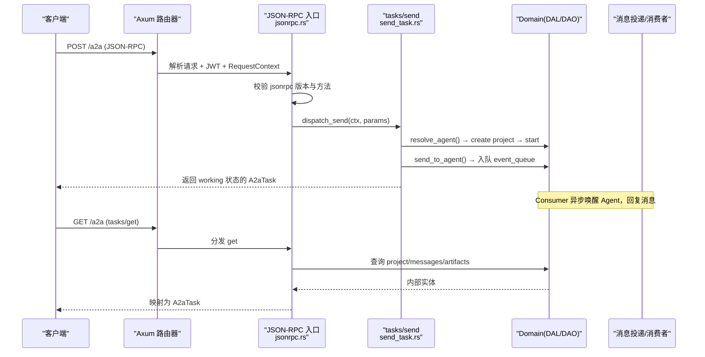
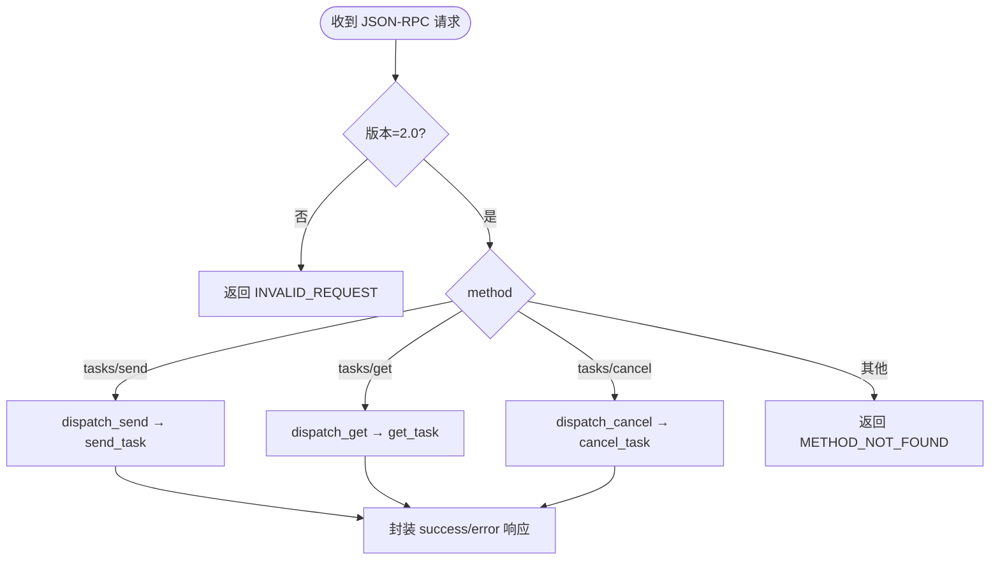
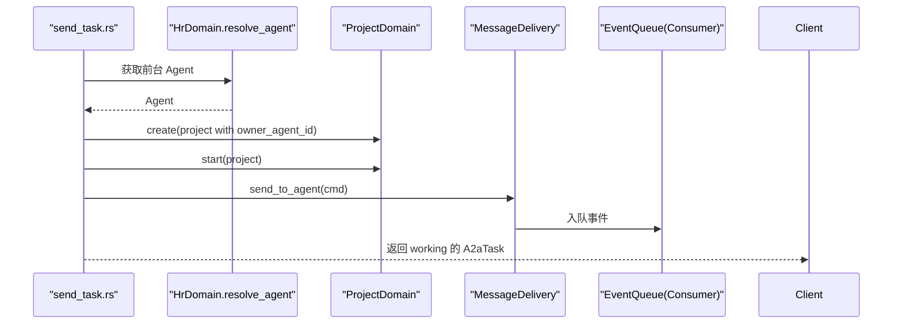
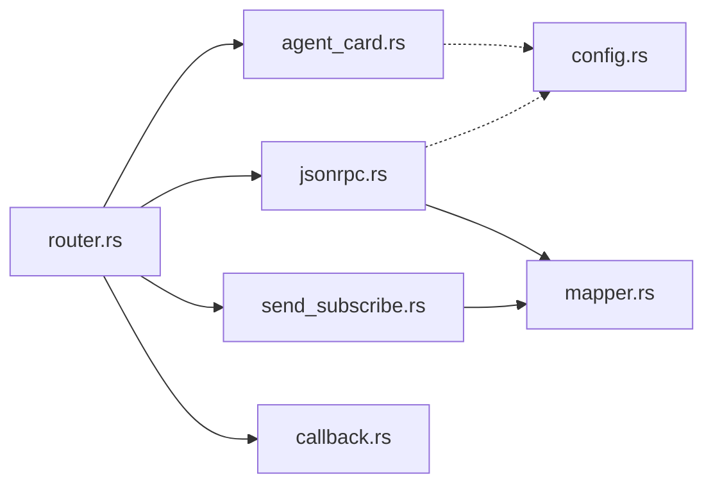

# A2A Server 模式

<cite>
**本文引用的文件**
- [common/src/api/a2a.rs](common/src/api/a2a.rs)
- [src/handlers/a2a/mod.rs](src/handlers/a2a/mod.rs)
- [src/handlers/a2a/jsonrpc.rs](src/handlers/a2a/jsonrpc.rs)
- [src/handlers/a2a/agent_card.rs](src/handlers/a2a/agent_card.rs)
- [src/handlers/a2a/send_task.rs](src/handlers/a2a/send_task.rs)
- [src/handlers/a2a/get_task.rs](src/handlers/a2a/get_task.rs)
- [src/handlers/a2a/cancel_task.rs](src/handlers/a2a/cancel_task.rs)
- [src/handlers/a2a/callback.rs](src/handlers/a2a/callback.rs)
- [src/handlers/a2a/mapper.rs](src/handlers/a2a/mapper.rs)
- [src/router.rs](src/router.rs)
- [common/src/config.rs](common/src/config.rs)
- [docs/archive/design-archive/a2a_server_design.md](docs/archive/design-archive/a2a_server_design.md)
- （2026-09-04 清理：superpowers 目录已归档，待 doc-maintainer 跟进）
</cite>

## 目录
1. [简介](#简介)
2. [项目结构](#项目结构)
3. [核心组件](#核心组件)
4. [架构总览](#架构总览)
5. [详细组件分析](#详细组件分析)
6. [依赖关系分析](#依赖关系分析)
7. [性能与可靠性](#性能与可靠性)
8. [故障排查指南](#故障排查指南)
9. [结论](#结论)
10. [附录：配置与集成示例](#附录配置与集成示例)

## 简介
本文件面向将 ai_orz 作为 A2A Server 对外暴露标准 A2A 协议（JSON-RPC 2.0）端点的部署与集成场景。内容涵盖：
- agent.json 发现机制
- JSON-RPC 方法注册与分发
- 回调 URL 配置与推送通知
- 任务生命周期管理、SSE 流式推送、异步结果回传
- 安全认证、限流控制、监控日志等企业级特性建议
- 完整配置示例与集成指南

## 项目结构
A2A Server 能力集中在 handlers/a2a 模块，协议实体定义在 common/src/api/a2a.rs，路由统一在 src/router.rs 中注册，配置项位于 common/src/config.rs。

图表来源
- [src/router.rs:12-59](src/router.rs#L12-L59)
- [src/handlers/a2a/jsonrpc.rs:21-94](src/handlers/a2a/jsonrpc.rs#L21-L94)
- [src/handlers/a2a/agent_card.rs:9-36](src/handlers/a2a/agent_card.rs#L9-L36)
- [src/handlers/a2a/send_task.rs:31-128](src/handlers/a2a/send_task.rs#L31-L128)
- [src/handlers/a2a/get_task.rs:17-49](src/handlers/a2a/get_task.rs#L17-L49)
- [src/handlers/a2a/cancel_task.rs:17-55](src/handlers/a2a/cancel_task.rs#L17-L55)
- [src/handlers/a2a/mapper.rs:14-99](src/handlers/a2a/mapper.rs#L14-L99)

章节来源
- [src/handlers/a2a/mod.rs:1-28](src/handlers/a2a/mod.rs#L1-L28)
- [src/router.rs:12-59](src/router.rs#L12-L59)

## 核心组件
- 协议实体：AgentCard、JsonRpcRequest/Response、A2aTask/A2aMessage/A2aArtifact 等，定义于 common/src/api/a2a.rs。
- 发现端点：GET /.well-known/agent.json，公开返回组织级能力描述。
- JSON-RPC 入口：POST /a2a，校验版本与方法分发。
- 任务处理：
  - tasks/send：异步提交，创建 project + message，立即返回 working；唤醒由 consumer 异步闭环。
  - tasks/get：查询 project + messages + artifacts，映射为 A2aTask。
  - tasks/cancel：归档 project，返回 canceled 状态。
- SSE 流式：POST /a2a/subscribe，复用现有 message_push 广播通道，按项目推送完整 A2aTask。
- 回调：POST /a2a/callback/{task_id}，接收远程 Agent 的任务更新并同步到本地任务与消息。
- 映射层：mapper.rs 负责 A2A ↔ ai_orz 实体转换，domain 层不感知 A2A。

章节来源
- [common/src/api/a2a.rs:1-306](common/src/api/a2a.rs#L1-L306)
- [src/handlers/a2a/jsonrpc.rs:21-94](src/handlers/a2a/jsonrpc.rs#L21-L94)
- [src/handlers/a2a/send_task.rs:31-128](src/handlers/a2a/send_task.rs#L31-L128)
- [src/handlers/a2a/get_task.rs:17-49](src/handlers/a2a/get_task.rs#L17-L49)
- [src/handlers/a2a/cancel_task.rs:17-55](src/handlers/a2a/cancel_task.rs#L17-L55)
- [src/handlers/a2a/callback.rs:17-198](src/handlers/a2a/callback.rs#L17-L198)
- [src/handlers/a2a/mapper.rs:14-99](src/handlers/a2a/mapper.rs#L14-L99)

## 架构总览
A2A Server 严格遵循四层单向调用：Adapter（HTTP Handler / 公开回调 Handler / AOP Producer）→ Domain → DAL → DAO。Handler 层完成 A2A 协议实体与内部实体的转换，Domain 层零侵入。

图表来源
- [src/router.rs:21-38](src/router.rs#L21-L38)
- [src/handlers/a2a/jsonrpc.rs:21-94](src/handlers/a2a/jsonrpc.rs#L21-L94)
- [src/handlers/a2a/send_task.rs:31-128](src/handlers/a2a/send_task.rs#L31-L128)
- [src/handlers/a2a/get_task.rs:17-49](src/handlers/a2a/get_task.rs#L17-L49)

## 详细组件分析

### 发现机制：agent.json
- 端点：GET /.well-known/agent.json（无需认证）
- 行为：返回组织级 AgentCard，包含 name/description/version/url/capabilities/skills/default_input_modes/default_output_modes
- 能力声明：streaming/push_notifications；当前实现 streaming=false，push_notifications=true
- 技能列表：组织级对外能力（如“对话协作”），不暴露具体内部 Agent

章节来源
- [src/handlers/a2a/agent_card.rs:9-36](src/handlers/a2a/agent_card.rs#L9-L36)
- [common/src/api/a2a.rs:12-62](common/src/api/a2a.rs#L12-L62)
- [src/router.rs:21-26](src/router.rs#L21-L26)

### JSON-RPC 方法与分发
- 端点：POST /a2a（JWT 保护）
- 校验：jsonrpc 版本必须为 "2.0"
- 方法：
  - tasks/send：异步提交任务
  - tasks/get：查询任务
  - tasks/cancel：取消任务
- 未知方法返回 METHOD_NOT_FOUND

图表来源
- [src/handlers/a2a/jsonrpc.rs:21-94](src/handlers/a2a/jsonrpc.rs#L21-L94)

章节来源
- [src/handlers/a2a/jsonrpc.rs:21-94](src/handlers/a2a/jsonrpc.rs#L21-L94)

### 任务生命周期：tasks/send
- 流程要点：
  - 从 RequestContext 提取用户身份
  - 通过 HrDomain.resolve_agent 获取前台 Agent（agent 与 project 解耦）
  - 创建 project（对应 A2A task），绑定 owner_agent_id
  - 启动项目（InProgress）
  - 发送消息（from=user, to=agent），自动入队 event_queue
  - 立即返回 working 状态的 A2aTask（不等待 Agent 回复）
  - 若提供 notification_url，创建 A2aCallback 渠道（PushNotifications），后续消息推送时按 scope_project 过滤推送到该 URL

图表来源
- [src/handlers/a2a/send_task.rs:31-128](src/handlers/a2a/send_task.rs#L31-L128)

章节来源
- [src/handlers/a2a/send_task.rs:31-128](src/handlers/a2a/send_task.rs#L31-L128)

### 任务查询：tasks/get
- 根据 task_id（= project_id）查询 project
- 查询关联 messages 与 artifacts
- 使用 mapper.build_a2a_task 转换为 A2aTask 返回

章节来源
- [src/handlers/a2a/get_task.rs:17-49](src/handlers/a2a/get_task.rs#L17-L49)
- [src/handlers/a2a/mapper.rs:57-84](src/handlers/a2a/mapper.rs#L57-L84)

### 任务取消：tasks/cancel
- 查询 project（确保存在）
- 归档 project（对应 A2A canceled）
- 重新查询最新状态，组装 messages + artifacts
- 返回 canceled 状态的 A2aTask

章节来源
- [src/handlers/a2a/cancel_task.rs:17-55](src/handlers/a2a/cancel_task.rs#L17-L55)

### SSE 流式推送：tasks/sendSubscribe
- 端点：POST /a2a/subscribe（JWT 保护）
- 流程：
  - 创建 project + message（同 tasks/send）
  - 订阅用户的 SSE channel（复用 message_push 机制）
  - 返回 SSE 流：每次收到消息更新时推送完整 A2aTask
- 注意：当前仅推送 messages，artifacts 暂为空；后续可纳入统一事件系统

章节来源
- [src/router.rs:39-48](src/router.rs#L39-L48)
- [src/handlers/a2a/send_subscribe.rs:1-101](src/handlers/a2a/send_subscribe.rs#L1-L101)

### 回调与异步结果回传：/a2a/callback/{task_id}
- 端点：POST /a2a/callback/{task_id}（公开，无需 JWT）
- 行为：
  - 校验本地任务是否存在且未处于终态
  - 校验 remote task id 与本地标签一致
  - 将远程 agent 的新消息同步到本地用户消息
  - 根据远程状态推进本地任务状态（Completed/Failed/Canceled/Working/Submitted/InputRequired）
  - 记录同步计数标签，避免重复推送

章节来源
- [src/handlers/a2a/callback.rs:17-198](src/handlers/a2a/callback.rs#L17-L198)
- [src/router.rs:49-56](src/router.rs#L49-L56)

### 映射层：A2A ↔ ai_orz 实体转换
- project_status_to_a2a_state：Active/PendingReview → Submitted；InProgress → Working；Completed → Completed；Archived → Canceled；Deleted → Failed
- message_to_a2a：from_role=User → role="user"，其余 → role="agent"
- artifact_to_a2a：产物名称与描述映射
- build_a2a_task：聚合 status/messages/artifacts 构建 A2aTask
- extract_text_from_a2a_message：拼接所有 Text part，忽略 File/Data

章节来源
- [src/handlers/a2a/mapper.rs:14-99](src/handlers/a2a/mapper.rs#L14-L99)

## 依赖关系分析
- 路由层：router.rs 统一注册 A2A 相关路由，区分公开与受保护中间件顺序（jwt_auth → request_context）
- Handler 层：各 handler 专注协议适配与业务流程编排，调用 Domain 层
- Domain/DAL/DAO：纯业务逻辑与数据访问，无 A2A 概念
- 配置：AppConfig.a2a_server 控制开关与协议版本、端点等

图表来源
- [src/router.rs:12-59](src/router.rs#L12-L59)
- [src/handlers/a2a/jsonrpc.rs:21-94](src/handlers/a2a/jsonrpc.rs#L21-L94)
- [src/handlers/a2a/agent_card.rs:9-36](src/handlers/a2a/agent_card.rs#L9-L36)
- [src/handlers/a2a/send_subscribe.rs:1-101](src/handlers/a2a/send_subscribe.rs#L1-L101)
- [src/handlers/a2a/callback.rs:17-198](src/handlers/a2a/callback.rs#L17-L198)
- [common/src/config.rs:22-59](common/src/config.rs#L22-L59)

章节来源
- [src/router.rs:12-59](src/router.rs#L12-L59)
- [common/src/config.rs:22-59](common/src/config.rs#L22-L59)

## 性能与可靠性
- 异步处理：tasks/send 立即返回 working，唤醒由 consumer 异步闭环，避免阻塞请求线程
- SSE 推送：复用 message_push 广播通道，减少额外基础设施成本
- 幂等与去重：回调中通过标签记录已同步消息数，避免重复推送
- 错误处理：JSON-RPC 统一错误码（PARSE_ERROR/INVALID_REQUEST/METHOD_NOT_FOUND/INVALID_PARAMS/INTERNAL_ERROR）
- 扩展性：handler 层只做协议适配，domain 层保持内聚，便于后续接入更多 A2A 方法或事件源

[本节为通用指导，不直接分析具体文件]

## 故障排查指南
- 无法发现 agent.json：确认路由挂载与公开中间件是否正确；检查 AppConfig.a2a_server.enabled 是否影响（当前实现未在此端点做开关判断）
- JSON-RPC 报错：
  - 版本错误：检查 jsonrpc 字段是否为 "2.0"
  - 方法未找到：确认 method 为 tasks/send/get/cancel
  - 参数无效：检查 params 结构与类型
- 任务未推进：检查 consumer 是否正常消费 event_queue；查看消息投递与唤醒链路
- SSE 无推送：确认 subscribe 成功并建立连接；检查消息投递是否触发 SSE 推送；核对 project_id 过滤
- 回调失败：检查 task_id 与本地任务标签一致性；确认回调路径正确且未被防火墙拦截

章节来源
- [src/handlers/a2a/jsonrpc.rs:21-94](src/handlers/a2a/jsonrpc.rs#L21-L94)
- [src/handlers/a2a/callback.rs:17-198](src/handlers/a2a/callback.rs#L17-L198)

## 结论
A2A Server 以最小侵入方式将 ai_orz 暴露为标准 A2A 协议服务：通过 agent.json 发现、JSON-RPC 方法分发、SSE 流式推送与回调机制，实现了任务的全生命周期管理与异步结果回传。handler 层专注协议适配，domain 层保持内聚，便于企业级集成与安全加固。

[本节为总结，不直接分析具体文件]

## 附录：配置与集成示例

### 配置项（ai_orz.toml）
- a2a_server.enabled：是否启用 A2A Server
- a2a_server.protocol_version：协议版本（如 "0.3.0"）
- a2a_server.endpoint：JSON-RPC 端点路径（如 "/a2a"）
- a2a_server.card_path：Agent Card 路径（如 "/.well-known/agent.json"）

章节来源
- [common/src/config.rs:22-59](common/src/config.rs#L22-L59)
- [docs/archive/design-archive/a2a_server_design.md:421-433](docs/archive/design-archive/a2a_server_design.md#L421-L433)

### 端点清单
- GET /.well-known/agent.json：公开，无需认证
- POST /a2a：JWT 保护，JSON-RPC 2.0
- POST /a2a/subscribe：JWT 保护，SSE 流式
- POST /a2a/callback/{task_id}：公开，外部 Agent 回调

章节来源
- [src/router.rs:21-56](src/router.rs#L21-L56)

### 集成步骤
- 启用 A2A Server：设置 a2a_server.enabled=true
- 配置前端/客户端：
  - 拉取 agent.json 获取 capabilities 与 endpoint
  - 使用 JWT 调用 POST /a2a 发起 tasks/send
  - 轮询 tasks/get 或订阅 tasks/sendSubscribe 获取实时进展
  - 可选：提供 notification_url 启用 PushNotifications
- 安全加固建议：
  - 网关层限流：对 /a2a 与 /a2a/subscribe 实施速率限制
  - 鉴权：强制 JWT，必要时结合 IP 白名单
  - 审计：开启结构化日志，记录请求 ID、方法、耗时、错误码
  - 监控：暴露健康检查与健康指标，观察队列积压与 SSE 连接数

章节来源
- （2026-09-04 清理：superpowers 目录已归档，待 doc-maintainer 跟进）
- [docs/archive/design-archive/a2a_server_design.md:104-131](docs/archive/design-archive/a2a_server_design.md#L104-L131)