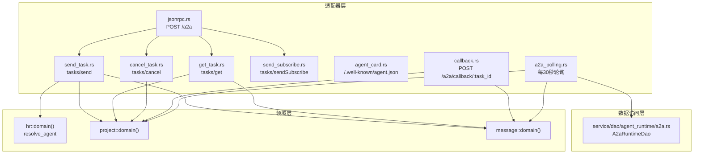
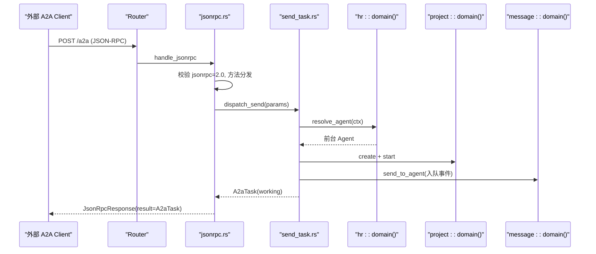
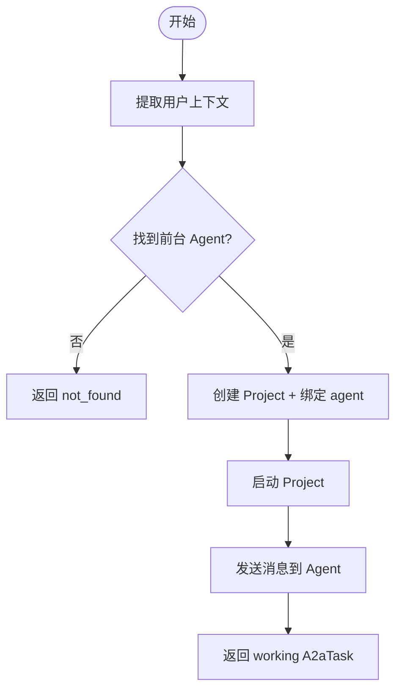
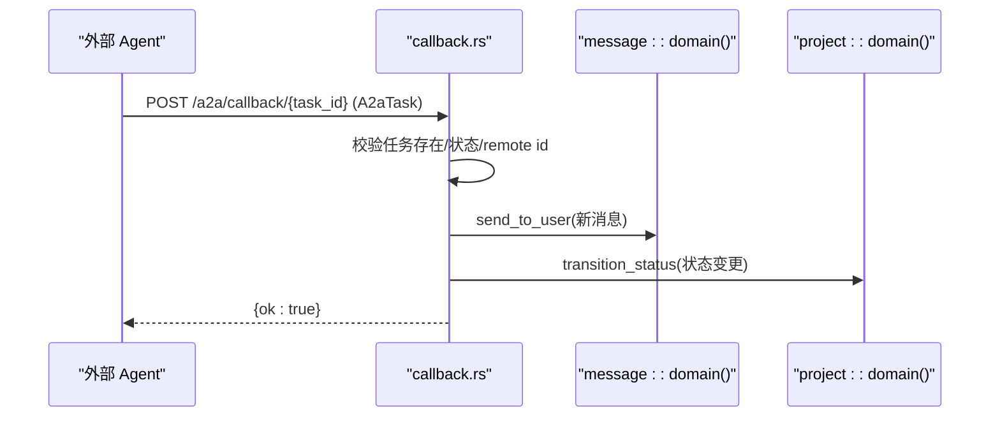
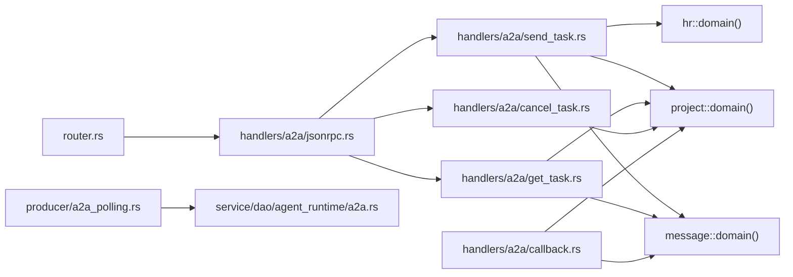

# A2A 协议支持

<cite>
**本文引用的文件**
- [common/src/api/a2a.rs](common/src/api/a2a.rs)
- [src/handlers/a2a/mod.rs](src/handlers/a2a/mod.rs)
- [src/handlers/a2a/jsonrpc.rs](src/handlers/a2a/jsonrpc.rs)
- [src/handlers/a2a/send_task.rs](src/handlers/a2a/send_task.rs)
- [src/handlers/a2a/get_task.rs](src/handlers/a2a/get_task.rs)
- [src/handlers/a2a/cancel_task.rs](src/handlers/a2a/cancel_task.rs)
- [src/handlers/a2a/send_subscribe.rs](src/handlers/a2a/send_subscribe.rs)
- [src/handlers/a2a/agent_card.rs](src/handlers/a2a/agent_card.rs)
- [src/handlers/a2a/callback.rs](src/handlers/a2a/callback.rs)
- [src/handlers/a2a/mapper.rs](src/handlers/a2a/mapper.rs)
- [src/router.rs](src/router.rs)
- [common/src/config.rs](common/src/config.rs)
- [src/service/dao/agent_runtime/a2a.rs](src/service/dao/agent_runtime/a2a.rs)
- [src/producer/a2a_polling.rs](src/producer/a2a_polling.rs)
- [docs/archive/a2a_server_design.md](docs/archive/a2a_server_design.md)
- [docs/external_agent_design.md](docs/external_agent_design.md)
</cite>

## 目录
1. [简介](#简介)
2. [项目结构](#项目结构)
3. [核心组件](#核心组件)
4. [架构总览](#架构总览)
5. [详细组件分析](#详细组件分析)
6. [依赖关系分析](#依赖关系分析)
7. [性能与可靠性](#性能与可靠性)
8. [故障排查指南](#故障排查指南)
9. [结论](#结论)
10. [附录：API 端点文档](#附录api-端点文档)

## 简介
本文件为 A2A（Agent-to-Agent）协议支持的完整技术文档，覆盖 Server 模式与 Client 模式实现、任务委派、异步结果回传、取消任务、JSON-RPC 消息格式、任务状态流转、回调机制、外部 Agent 注册与通信方式、错误处理策略、重试与超时等高级特性，并提供集成示例与故障排查指引。

A2A Server 通过 JSON-RPC 2.0 暴露统一入口，将外部请求映射到内部 Project/Message/Artifact 领域模型；A2A Client 通过 HTTP 调用远程 A2A 服务，并以 Push 回调或 Poll 轮询两种通道获取远端任务更新。

## 项目结构
A2A 相关代码按“适配器层（Handler/Producer）→ Domain → DAL → DAO”的单向调用组织，Domain 层不感知 A2A 协议实体，协议转换集中在 handlers/a2a 模块。

图表来源
- [src/handlers/a2a/jsonrpc.rs:22-75](src/handlers/a2a/jsonrpc.rs#L22-L75)
- [src/handlers/a2a/send_task.rs:32-127](src/handlers/a2a/send_task.rs#L32-L127)
- [src/handlers/a2a/get_task.rs:18-48](src/handlers/a2a/get_task.rs#L18-L48)
- [src/handlers/a2a/cancel_task.rs:18-54](src/handlers/a2a/cancel_task.rs#L18-L54)
- [src/handlers/a2a/send_subscribe.rs:36-124](src/handlers/a2a/send_subscribe.rs#L36-L124)
- [src/handlers/a2a/agent_card.rs:13-36](src/handlers/a2a/agent_card.rs#L13-L36)
- [src/handlers/a2a/callback.rs:17-197](src/handlers/a2a/callback.rs#L17-L197)
- [src/producer/a2a_polling.rs:60-270](src/producer/a2a_polling.rs#L60-L270)
- [src/service/dao/agent_runtime/a2a.rs:86-135](src/service/dao/agent_runtime/a2a.rs#L86-L135)

章节来源
- [src/handlers/a2a/mod.rs:1-28](src/handlers/a2a/mod.rs#L1-L28)
- [src/router.rs:21-56](src/router.rs#L21-L56)

## 核心组件
- 协议类型定义：common/src/api/a2a.rs 定义了 AgentCard、JsonRpcRequest/Response、Task/Message/Artifact、方法参数等共享类型。
- JSON-RPC 路由：src/handlers/a2a/jsonrpc.rs 负责解析请求、校验版本、分发 tasks/send、tasks/get、tasks/cancel。
- 任务提交与查询：send_task.rs、get_task.rs、cancel_task.rs 分别实现创建任务、查询任务、取消任务。
- 流式响应：send_subscribe.rs 提供 SSE 流式推送，复用现有 message_push 基础设施。
- 能力发现：agent_card.rs 公开 /.well-known/agent.json。
- 回调与轮询：callback.rs 接收外部 Agent 推送；a2a_polling.rs 作为兜底轮询。
- 映射器：mapper.rs 完成 A2A ↔ ai_orz 实体的双向转换。
- 配置：common/src/config.rs 提供 a2a_server 开关与协议版本等配置。

章节来源
- [common/src/api/a2a.rs:1-306](common/src/api/a2a.rs#L1-L306)
- [src/handlers/a2a/jsonrpc.rs:22-75](src/handlers/a2a/jsonrpc.rs#L22-L75)
- [src/handlers/a2a/send_task.rs:32-127](src/handlers/a2a/send_task.rs#L32-L127)
- [src/handlers/a2a/get_task.rs:18-48](src/handlers/a2a/get_task.rs#L18-L48)
- [src/handlers/a2a/cancel_task.rs:18-54](src/handlers/a2a/cancel_task.rs#L18-L54)
- [src/handlers/a2a/send_subscribe.rs:36-124](src/handlers/a2a/send_subscribe.rs#L36-L124)
- [src/handlers/a2a/agent_card.rs:13-36](src/handlers/a2a/agent_card.rs#L13-L36)
- [src/handlers/a2a/callback.rs:17-197](src/handlers/a2a/callback.rs#L17-L197)
- [src/handlers/a2a/mapper.rs:14-99](src/handlers/a2a/mapper.rs#L14-L99)
- [common/src/config.rs:22-59](common/src/config.rs#L22-L59)

## 架构总览
A2A Server 以 JSON-RPC 2.0 暴露统一入口，所有业务逻辑委托给 Domain 层，DAO 层仅负责持久化与外部系统交互。A2A Client 通过 HTTP 调用远程 A2A 服务，并通过 Push 回调或 Poll 轮询获取任务更新。

图表来源
- [src/router.rs:21-38](src/router.rs#L21-L38)
- [src/handlers/a2a/jsonrpc.rs:22-75](src/handlers/a2a/jsonrpc.rs#L22-L75)
- [src/handlers/a2a/send_task.rs:32-127](src/handlers/a2a/send_task.rs#L32-L127)

章节来源
- [docs/archive/a2a_server_design.md:40-131](docs/archive/a2a_server_design.md#L40-L131)

## 详细组件分析

### JSON-RPC 入口与方法分发
- 入口：POST /a2a，挂载 JWT 中间件与 RequestContext。
- 校验：检查 jsonrpc 版本是否为 "2.0"，未启用时返回 METHOD_NOT_FOUND。
- 分发：根据 method 字段调用 send_task、get_task、cancel_task。
- 错误：未知方法返回 -32601，内部异常封装为 -32603。

章节来源
- [src/handlers/a2a/jsonrpc.rs:22-75](src/handlers/a2a/jsonrpc.rs#L22-L75)
- [src/router.rs:21-38](src/router.rs#L21-L38)

### 任务提交（tasks/send）
- 流程：
  1) 从 RequestContext 提取用户身份。
  2) 调用 hr::domain().resolve_agent(ctx) 选择前台 Agent。
  3) 创建 Project（对应 A2A Task），绑定 owner_agent_id。
  4) 启动 Project 进入 InProgress。
  5) 发送消息到 Agent（入队事件，唤醒由 consumer 异步闭环）。
  6) 立即返回 working 状态的 A2aTask。
- 可选：若提供 notification_url，创建 A2aCallback 渠道用于后续推送。

图表来源
- [src/handlers/a2a/send_task.rs:32-127](src/handlers/a2a/send_task.rs#L32-L127)

章节来源
- [src/handlers/a2a/send_task.rs:32-127](src/handlers/a2a/send_task.rs#L32-L127)

### 任务查询（tasks/get）
- 流程：
  1) 根据 task_id 查询 Project。
  2) 查询关联 Message 列表。
  3) 查询关联 Artifact 列表。
  4) 使用 mapper 构建 A2aTask 返回。

章节来源
- [src/handlers/a2a/get_task.rs:18-48](src/handlers/a2a/get_task.rs#L18-L48)
- [src/handlers/a2a/mapper.rs:57-84](src/handlers/a2a/mapper.rs#L57-L84)

### 任务取消（tasks/cancel）
- 流程：
  1) 校验任务存在。
  2) 归档 Project（对应 A2A canceled）。
  3) 重新查询最新状态并构建 A2aTask 返回。

章节来源
- [src/handlers/a2a/cancel_task.rs:18-54](src/handlers/a2a/cancel_task.rs#L18-L54)

### 流式提交（tasks/sendSubscribe）
- 功能：创建 Project + Message 后订阅用户 SSE，每次消息更新推送完整 A2aTask。
- 关键点：复用 message_push 广播通道；连接关闭时自动注销。

章节来源
- [src/handlers/a2a/send_subscribe.rs:36-124](src/handlers/a2a/send_subscribe.rs#L36-L124)
- [src/handlers/a2a/send_subscribe.rs:184-211](src/handlers/a2a/send_subscribe.rs#L184-L211)

### 能力发现（Agent Card）
- 端点：GET /.well-known/agent.json（公开，无需认证）。
- 内容：组织级能力描述、协议版本、能力声明、默认输入输出模式等。

章节来源
- [src/handlers/a2a/agent_card.rs:13-36](src/handlers/a2a/agent_card.rs#L13-L36)
- [common/src/api/a2a.rs:12-62](common/src/api/a2a.rs#L12-L62)

### 回调机制（Push Notifications）
- 端点：POST /a2a/callback/:task_id（公开，无需 JWT）。
- 行为：
  - 校验本地任务存在且非终态。
  - 校验外部 task_id 与本地 tags 一致。
  - 增量同步 agent/assistant 角色消息（基于 a2a_synced_msgs:N 去重）。
  - 根据 A2A 状态映射更新本地任务状态。
- 幂等：终态直接跳过；失败可重试。

图表来源
- [src/handlers/a2a/callback.rs:17-197](src/handlers/a2a/callback.rs#L17-L197)

章节来源
- [src/handlers/a2a/callback.rs:17-197](src/handlers/a2a/callback.rs#L17-L197)

### 轮询兜底（Polling）
- 组件：A2aPollingProducer，每 30 秒执行一次。
- 流程：
  1) 列出所有 Remote Agent。
  2) 对每个 Agent 查询其 InProgress 任务。
  3) 通过 A2aRuntimeDao.fetch_task 拉取远端任务。
  4) 增量同步消息并更新本地任务状态。
- 优势：天然支持重试，避免单点推送失败导致数据不一致。

章节来源
- [src/producer/a2a_polling.rs:60-270](src/producer/a2a_polling.rs#L60-L270)
- [docs/external_agent_design.md:107-199](docs/external_agent_design.md#L107-L199)

### 映射器（A2A ↔ ai_orz）
- 方向：
  - A2A Message → ai_orz MessagePo（入向）
  - ai_orz ProjectStatus → A2A TaskState（出向）
  - ai_orz Message → A2A Message（出向）
  - ai_orz Artifact → A2A Artifact（出向）
- 作用：确保 Domain 层无 A2A 概念，转换集中管理。

章节来源
- [src/handlers/a2a/mapper.rs:14-99](src/handlers/a2a/mapper.rs#L14-L99)

### A2A Client（出站 DAO）
- 组件：A2aRuntimeDao，通过 HTTP JSON-RPC 2.0 调用远程 Agent。
- 能力：
  - 构造 JsonRpcRequest（单调递增 id）。
  - 支持可选 Bearer Token。
  - 统一错误包装与解析。
- 用途：当本地 Agent 类型为 Remote 时，通过该 DAO 发起 tasks/send/fetch 等调用。

章节来源
- [src/service/dao/agent_runtime/a2a.rs:86-135](src/service/dao/agent_runtime/a2a.rs#L86-L135)
- [docs/external_agent_design.md:17-28](docs/external_agent_design.md#L17-L28)

## 依赖关系分析
- Router 将 A2A 路由挂载到根路径，区分公开与受保护端点。
- jsonrpc.rs 依赖 common::api::a2a 类型与 handler 子模块。
- send_task/get_task/cancel_task 依赖 hr/project/message domain。
- callback.rs 与 a2a_polling.rs 依赖 message/project domain 以及 A2A tags 工具。
- A2aRuntimeDao 依赖 reqwest 与 JSON-RPC 类型。

图表来源
- [src/router.rs:21-56](src/router.rs#L21-L56)
- [src/handlers/a2a/jsonrpc.rs:22-75](src/handlers/a2a/jsonrpc.rs#L22-L75)
- [src/handlers/a2a/send_task.rs:32-127](src/handlers/a2a/send_task.rs#L32-L127)
- [src/handlers/a2a/get_task.rs:18-48](src/handlers/a2a/get_task.rs#L18-L48)
- [src/handlers/a2a/cancel_task.rs:18-54](src/handlers/a2a/cancel_task.rs#L18-L54)
- [src/handlers/a2a/callback.rs:17-197](src/handlers/a2a/callback.rs#L17-L197)
- [src/producer/a2a_polling.rs:60-270](src/producer/a2a_polling.rs#L60-L270)
- [src/service/dao/agent_runtime/a2a.rs:86-135](src/service/dao/agent_runtime/a2a.rs#L86-L135)

## 性能与可靠性
- 异步处理：tasks/send 立即返回 working，唤醒由 consumer 异步闭环，降低请求延迟。
- 流式推送：tasks/sendSubscribe 复用 SSE 广播通道，减少轮询开销。
- 幂等性：回调与轮询均支持幂等处理，避免重复推送导致的副作用。
- 去重机制：通过 a2a_synced_msgs:N 记录已同步消息数量，保证增量同步。
- 超时与重试：A2aRuntimeDao 支持超时配置；轮询每 30 秒执行，天然具备重试能力。
- 降级策略：Push 失败时可通过 Poll 兜底，保障最终一致性。

[本节为通用指导，不直接分析具体文件]

## 故障排查指南
- 常见错误码：
  - -32700 解析错误：检查 JSON 结构与字段类型。
  - -32600 无效请求：jsonrpc 版本不为 "2.0"。
  - -32601 方法未找到：method 不在支持列表。
  - -32602 参数无效：params 解析失败。
  - -32603 内部错误：handler/DAL/DAO 异常。
- 认证问题：
  - /a2a 需要有效 JWT；/.well-known/agent.json 无需认证。
- 任务不存在：
  - get/cancel 返回 not_found，请确认 task_id 正确。
- 回调失败：
  - 检查外部 Agent 是否能访问 /a2a/callback/:task_id；确认 remote task_id 与本地 tags 一致。
- 轮询无更新：
  - 检查 Remote Agent 是否配置 endpoint/auth_token/timeout_secs；查看日志中 fetch_task 错误。

章节来源
- [src/handlers/a2a/jsonrpc.rs:22-75](src/handlers/a2a/jsonrpc.rs#L22-L75)
- [src/handlers/a2a/callback.rs:17-197](src/handlers/a2a/callback.rs#L17-L197)
- [src/producer/a2a_polling.rs:60-270](src/producer/a2a_polling.rs#L60-L270)

## 结论
A2A 协议支持在本项目中实现了完整的 Server 与 Client 能力：Server 通过 JSON-RPC 暴露统一入口，Client 通过 HTTP 调用远程 A2A 服务；任务生命周期通过 Project/Message/Artifact 领域模型统一管理；回调与轮询双通道保障可靠性；映射器与 Domain 解耦确保扩展性与可维护性。建议在生产环境开启 Push 回调并保留 Poll 兜底，结合 SSE 提升用户体验。

[本节为总结，不直接分析具体文件]

## 附录：API 端点文档

### 公共端点
- GET /.well-known/agent.json
  - 说明：组织级能力发现，无需认证。
  - 响应：AgentCard（name/description/version/url/capabilities/skills/default_input_modes/default_output_modes）。

章节来源
- [src/handlers/a2a/agent_card.rs:13-36](src/handlers/a2a/agent_card.rs#L13-L36)
- [common/src/api/a2a.rs:12-62](common/src/api/a2a.rs#L12-L62)

### 受保护端点（JWT）
- POST /a2a
  - 说明：JSON-RPC 2.0 入口，支持 tasks/send、tasks/get、tasks/cancel。
  - 请求体：JsonRpcRequest（jsonrpc/method/id/params）。
  - 响应：JsonRpcResponse（result/error）。

章节来源
- [src/handlers/a2a/jsonrpc.rs:22-75](src/handlers/a2a/jsonrpc.rs#L22-L75)
- [common/src/api/a2a.rs:64-145](common/src/api/a2a.rs#L64-L145)

- POST /a2a/subscribe
  - 说明：SSE 流式提交任务，返回任务实时更新的 A2aTask。
  - 请求体：SendTaskParams。
  - 事件：task（完整 A2aTask）、error、ping。

章节来源
- [src/handlers/a2a/send_subscribe.rs:36-124](src/handlers/a2a/send_subscribe.rs#L36-L124)
- [common/src/api/a2a.rs:269-288](common/src/api/a2a.rs#L269-L288)

### JSON-RPC 方法
- tasks/send
  - 参数：SendTaskParams（id/message/session_id/metadata/notification_url）。
  - 行为：创建 Project + Message，立即返回 working 状态。
  - 注意：唤醒由 consumer 异步完成。

章节来源
- [src/handlers/a2a/send_task.rs:32-127](src/handlers/a2a/send_task.rs#L32-L127)
- [common/src/api/a2a.rs:269-288](common/src/api/a2a.rs#L269-L288)

- tasks/get
  - 参数：GetTaskParams（id/history_length）。
  - 行为：查询 Project + Messages + Artifacts，构建 A2aTask。

章节来源
- [src/handlers/a2a/get_task.rs:18-48](src/handlers/a2a/get_task.rs#L18-L48)
- [common/src/api/a2a.rs:290-298](common/src/api/a2a.rs#L290-L298)

- tasks/cancel
  - 参数：CancelTaskParams（id）。
  - 行为：归档 Project，返回 canceled 状态。

章节来源
- [src/handlers/a2a/cancel_task.rs:18-54](src/handlers/a2a/cancel_task.rs#L18-L54)
- [common/src/api/a2a.rs:300-305](common/src/api/a2a.rs#L300-L305)

### 回调端点（公开）
- POST /a2a/callback/:task_id
  - 说明：外部 Agent 推送任务更新，无需认证。
  - 请求体：A2aTask。
  - 行为：增量同步消息、更新任务状态，返回 ok。

章节来源
- [src/handlers/a2a/callback.rs:17-197](src/handlers/a2a/callback.rs#L17-L197)

### 配置项
- [a2a_server]
  - enabled：是否启用 A2A Server。
  - protocol_version：协议版本。
  - endpoint：JSON-RPC 端点路径。
  - card_path：Agent Card 路径。

章节来源
- [common/src/config.rs:22-59](common/src/config.rs#L22-L59)
- [docs/archive/a2a_server_design.md:421-433](docs/archive/a2a_server_design.md#L421-L433)

### 外部 Agent 注册与通信
- 注册 Remote Agent：在 HR 管理端创建 External Agent，kind=Remote，填写 endpoint/agent_name/auth_token/timeout_secs。
- 通信方式：
  - 出站：A2aRuntimeDao 通过 HTTP JSON-RPC 调用远程 Agent。
  - 入站：外部 Agent 通过 /a2a/callback/:task_id 推送更新；或 A2aPollingProducer 每 30 秒轮询。

章节来源
- [docs/external_agent_design.md:17-28](docs/external_agent_design.md#L17-L28)
- [src/service/dao/agent_runtime/a2a.rs:29-47](src/service/dao/agent_runtime/a2a.rs#L29-L47)
- [src/producer/a2a_polling.rs:60-270](src/producer/a2a_polling.rs#L60-L270)