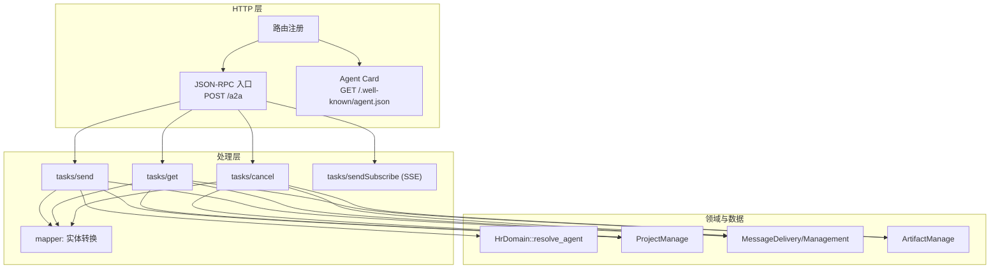
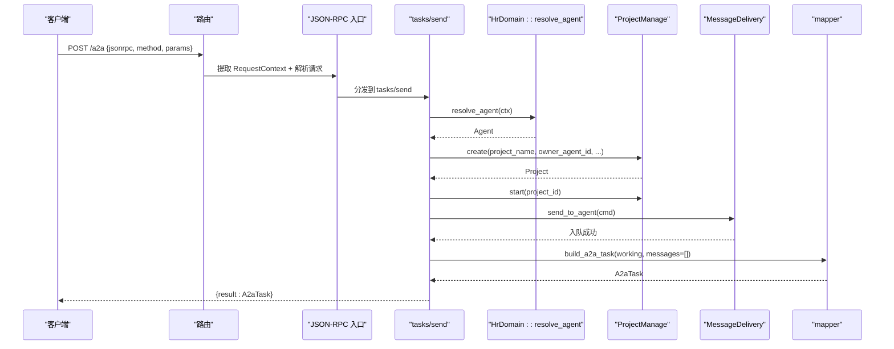
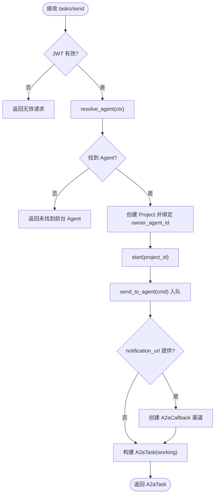
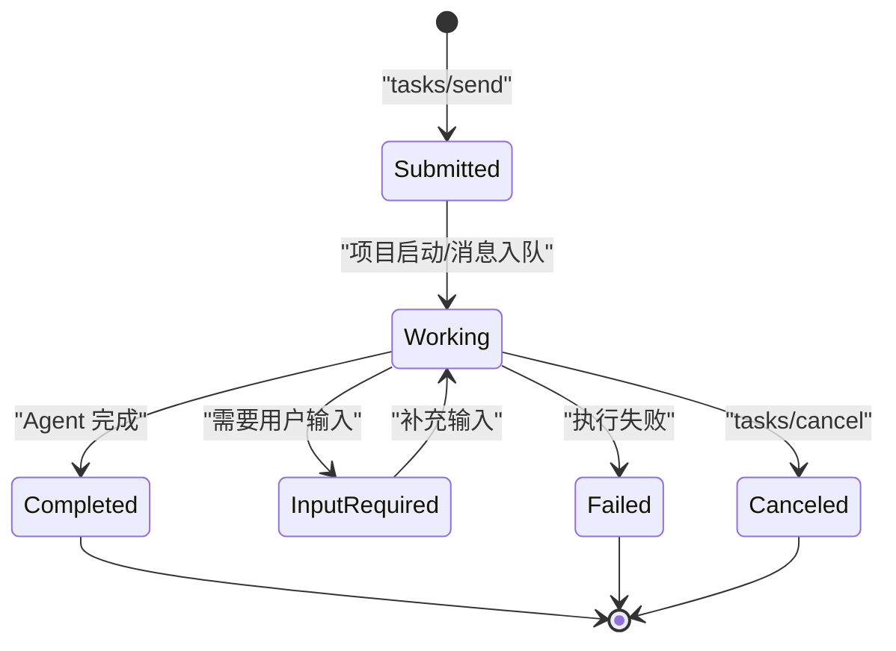
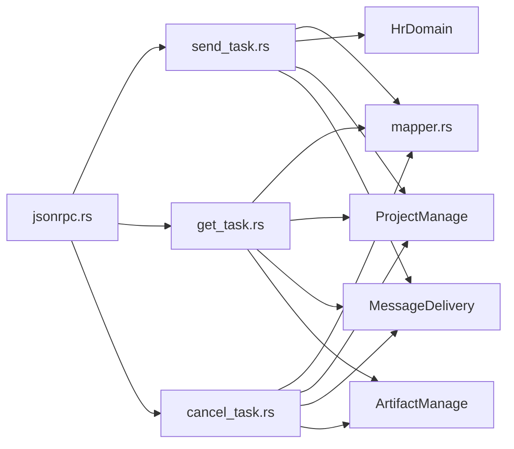

# A2A 协议规范

<cite>
**本文引用的文件**
- [common/src/api/a2a.rs](common/src/api/a2a.rs)
- [src/handlers/a2a/mod.rs](src/handlers/a2a/mod.rs)
- [src/handlers/a2a/jsonrpc.rs](src/handlers/a2a/jsonrpc.rs)
- [src/handlers/a2a/send_task.rs](src/handlers/a2a/send_task.rs)
- [src/handlers/a2a/get_task.rs](src/handlers/a2a/get_task.rs)
- [src/handlers/a2a/cancel_task.rs](src/handlers/a2a/cancel_task.rs)
- [src/handlers/a2a/mapper.rs](src/handlers/a2a/mapper.rs)
- [src/handlers/a2a/agent_card.rs](src/handlers/a2a/agent_card.rs)
- [src/handlers/a2a/send_subscribe.rs](src/handlers/a2a/send_subscribe.rs)
- [common/src/config.rs](common/src/config.rs)
- [common/src/error/code.rs](common/src/error/code.rs)
- [tests/integration/a2a_flow_test.rs](tests/integration/a2a_flow_test.rs)
</cite>

## 目录
1. [简介](#简介)
2. [项目结构](#项目结构)
3. [核心组件](#核心组件)
4. [架构总览](#架构总览)
5. [详细组件分析](#详细组件分析)
6. [依赖关系分析](#依赖关系分析)
7. [性能与扩展性](#性能与扩展性)
8. [故障排查指南](#故障排查指南)
9. [结论](#结论)
10. [附录：接口定义与数据模型](#附录接口定义与数据模型)

## 简介
本规范基于仓库中已实现的 A2A Server，定义对外暴露的 JSON-RPC 2.0 协议能力。A2A Server 通过 HTTP POST /a2a 提供 tasks/send、tasks/get、tasks/cancel 等方法；可选支持 tasks/sendSubscribe（SSE 流式）。任务在内部映射为 Project，消息映射为 Message，产物映射为 Artifact。认证沿用系统 JWT，Agent 路由通过 HrDomain::resolve_agent 统一兜底。

## 项目结构
A2A 协议相关代码集中在 handlers/a2a 模块，协议类型定义在 common/api/a2a，配置在 common/config，错误码在 common/error/code。

图表来源
- [src/handlers/a2a/jsonrpc.rs:22-75](src/handlers/a2a/jsonrpc.rs#L22-L75)
- [src/handlers/a2a/send_task.rs:32-127](src/handlers/a2a/send_task.rs#L32-L127)
- [src/handlers/a2a/get_task.rs:18-48](src/handlers/a2a/get_task.rs#L18-L48)
- [src/handlers/a2a/cancel_task.rs:18-53](src/handlers/a2a/cancel_task.rs#L18-L53)
- [src/handlers/a2a/mapper.rs:15-84](src/handlers/a2a/mapper.rs#L15-L84)
- [src/handlers/a2a/agent_card.rs:13-35](src/handlers/a2a/agent_card.rs#L13-L35)

章节来源
- [src/handlers/a2a/mod.rs:1-28](src/handlers/a2a/mod.rs#L1-L28)

## 核心组件
- JSON-RPC 2.0 请求/响应与错误对象：定义于 common/api/a2a，包含标准错误码常量。
- Agent Card：组织级能力描述，公开端点无需认证。
- 方法处理器：
  - tasks/send：异步提交任务，立即返回 working。
  - tasks/get：查询任务状态、消息与产物。
  - tasks/cancel：归档任务并返回 canceled 状态。
  - tasks/sendSubscribe（可选）：SSE 推送完整 A2A Task 更新。
- 实体映射器：将内部 ProjectStatus/Message/Artifact 转换为 A2A 协议类型。
- 配置开关：A2aServerConfig.enabled 控制是否启用 A2A Server。

章节来源
- [common/src/api/a2a.rs:66-145](common/src/api/a2a.rs#L66-L145)
- [src/handlers/a2a/agent_card.rs:13-35](src/handlers/a2a/agent_card.rs#L13-L35)
- [src/handlers/a2a/jsonrpc.rs:22-75](src/handlers/a2a/jsonrpc.rs#L22-L75)
- [src/handlers/a2a/send_task.rs:32-127](src/handlers/a2a/send_task.rs#L32-L127)
- [src/handlers/a2a/get_task.rs:18-48](src/handlers/a2a/get_task.rs#L18-L48)
- [src/handlers/a2a/cancel_task.rs:18-53](src/handlers/a2a/cancel_task.rs#L18-L53)
- [src/handlers/a2a/mapper.rs:15-84](src/handlers/a2a/mapper.rs#L15-L84)
- [common/src/config.rs:512-549](common/src/config.rs#L512-L549)

## 架构总览
A2A Server 严格遵循 Adapter → Domain → DAL → DAO 单向调用。协议解析与分发在 handler 层完成，业务逻辑委托给 Domain，持久化通过 DAL/DAO。

图表来源
- [src/handlers/a2a/jsonrpc.rs:22-75](src/handlers/a2a/jsonrpc.rs#L22-L75)
- [src/handlers/a2a/send_task.rs:32-127](src/handlers/a2a/send_task.rs#L32-L127)
- [src/handlers/a2a/mapper.rs:57-84](src/handlers/a2a/mapper.rs#L57-L84)

## 详细组件分析

### JSON-RPC 2.0 消息格式
- 版本：固定 "2.0"，非 2.0 直接返回 INVALID_REQUEST。
- 字段：jsonrpc、id、method、params。
- 响应：result 与 error 互斥；错误使用 JsonRpcError{code, message, data}。
- 标准错误码：PARSE_ERROR、INVALID_REQUEST、METHOD_NOT_FOUND、INVALID_PARAMS、INTERNAL_ERROR。

章节来源
- [common/src/api/a2a.rs:66-145](common/src/api/a2a.rs#L66-L145)
- [src/handlers/a2a/jsonrpc.rs:37-57](src/handlers/a2a/jsonrpc.rs#L37-L57)

### 支持的 RPC 方法与语义

#### tasks/send（异步提交）
- 认证：JWT（复用系统中间件），缺少用户上下文返回无效请求。
- 流程：
  1) resolve_agent(ctx) 获取前台 Agent；
  2) 创建 Project（绑定 agent.id 作为 owner_agent_id）；
  3) 启动项目（进入 InProgress）；
  4) 发送消息到 Agent（自动入队 event_queue）；
  5) 可选：若提供 notification_url，创建 A2aCallback 渠道用于 PushNotifications；
  6) 立即返回 working 状态的 A2aTask。
- 注意：唤醒由 consumer 异步闭环，handler 不等待 Agent 回复。

图表来源
- [src/handlers/a2a/send_task.rs:32-127](src/handlers/a2a/send_task.rs#L32-L127)

章节来源
- [src/handlers/a2a/send_task.rs:32-127](src/handlers/a2a/send_task.rs#L32-L127)

#### tasks/get（轮询查询）
- 根据 task_id（即 project_id）查询 Project、Messages、Artifacts，并转换为 A2aTask 返回。
- 不存在时返回 not_found。

章节来源
- [src/handlers/a2a/get_task.rs:18-48](src/handlers/a2a/get_task.rs#L18-L48)

#### tasks/cancel（取消任务）
- 查询 Project 存在后归档（对应 A2A canceled），再读取最新状态与消息/产物，返回 A2aTask。
- 不存在时返回 not_found。

章节来源
- [src/handlers/a2a/cancel_task.rs:18-53](src/handlers/a2a/cancel_task.rs#L18-L53)

#### tasks/sendSubscribe（SSE 流式，可选）
- 同 tasks/send 创建 Project 与消息，随后订阅用户 SSE channel，按项目过滤推送完整 A2A Task 事件。
- 当前仅推送消息，artifacts 为空数组；后续可接入统一事件系统。

章节来源
- [src/handlers/a2a/send_subscribe.rs:36-124](src/handlers/a2a/send_subscribe.rs#L36-L124)
- [src/handlers/a2a/send_subscribe.rs:184-211](src/handlers/a2a/send_subscribe.rs#L184-L211)

### 消息类型与数据模型
- A2aTask：id、session_id、status、messages、artifacts、metadata。
- A2aTaskStatus：state、timestamp、message。
- A2aTaskState：submitted、working、input_required、completed、failed、canceled。
- A2aMessage：role（"user"/"agent"）、parts、message_id、task_id。
- A2aMessagePart：text、file、data。
- A2aFilePart：name、mime_type、bytes、uri。
- A2aArtifact：artifact_id、name、parts。

章节来源
- [common/src/api/a2a.rs:149-265](common/src/api/a2a.rs#L149-L265)

### 任务状态机与事件流转
- 内部 ProjectStatus 与 A2A TaskState 映射：
  - Active/PendingReview → Submitted
  - InProgress → Working
  - Completed → Completed
  - Archived → Canceled
  - Deleted → Failed
- 事件流转：
  - tasks/send 立即返回 Working；
  - consumer 消费消息并唤醒 Agent，产出回复消息；
  - 客户端通过 tasks/get 轮询或 subscribe 接收更新；
  - tasks/cancel 将任务归档为 Canceled。

图表来源
- [src/handlers/a2a/mapper.rs:15-23](src/handlers/a2a/mapper.rs#L15-L23)
- [src/handlers/a2a/send_task.rs:69-127](src/handlers/a2a/send_task.rs#L69-L127)
- [src/handlers/a2a/cancel_task.rs:26-53](src/handlers/a2a/cancel_task.rs#L26-L53)

章节来源
- [src/handlers/a2a/mapper.rs:15-23](src/handlers/a2a/mapper.rs#L15-L23)

### 错误码规范
- JSON-RPC 标准错误码：
  - PARSE_ERROR(-32700)、INVALID_REQUEST(-32600)、METHOD_NOT_FOUND(-32601)、INVALID_PARAMS(-32602)、INTERNAL_ERROR(-32603)。
- 业务错误：
  - 未启用 A2A Server：METHOD_NOT_FOUND；
  - 参数解析失败：INVALID_PARAMS；
  - 未找到资源：not_found（转为 INTERNAL_ERROR 在 JSON-RPC 响应中携带）；
  - 其他异常：INTERNAL_ERROR。

章节来源
- [common/src/api/a2a.rs:133-145](common/src/api/a2a.rs#L133-L145)
- [src/handlers/a2a/jsonrpc.rs:28-75](src/handlers/a2a/jsonrpc.rs#L28-L75)
- [common/src/error/code.rs:1-146](common/src/error/code.rs#L1-L146)

### 版本兼容性与扩展机制
- 协议版本：v0.3.0（Agent Card 中 version 字段来自配置）。
- 向后兼容：
  - 新增可选字段（如 session_id、metadata、notification_url）默认跳过序列化；
  - 未知方法返回 METHOD_NOT_FOUND，不破坏旧客户端；
  - 状态映射保持稳定，新增内部状态需显式映射。
- 扩展点：
  - AgentCard.skills 可扩展技能列表；
  - A2aMessagePart 支持 text/file/data 三种部分；
  - 可通过 notification_url 实现 PushNotifications；
  - 未来可接入统一事件系统以推送 artifacts/task 变更。

章节来源
- [src/handlers/a2a/agent_card.rs:13-35](src/handlers/a2a/agent_card.rs#L13-L35)
- [common/src/api/a2a.rs:16-62](common/src/api/a2a.rs#L16-L62)
- [common/src/api/a2a.rs:269-288](common/src/api/a2a.rs#L269-L288)

## 依赖关系分析
- Handler 层依赖 Domain（hr/project/message/artifact），DAL/DAO 仅在 Domain/DAL 内使用。
- 配置通过全局单例读取，控制 A2A Server 开关与协议版本。
- 测试覆盖关键路径：resolve_agent、get/cancel 不存在场景。

图表来源
- [src/handlers/a2a/jsonrpc.rs:47-93](src/handlers/a2a/jsonrpc.rs#L47-L93)
- [src/handlers/a2a/send_task.rs:32-127](src/handlers/a2a/send_task.rs#L32-L127)
- [src/handlers/a2a/get_task.rs:18-48](src/handlers/a2a/get_task.rs#L18-L48)
- [src/handlers/a2a/cancel_task.rs:18-53](src/handlers/a2a/cancel_task.rs#L18-L53)
- [src/handlers/a2a/mapper.rs:57-84](src/handlers/a2a/mapper.rs#L57-L84)

章节来源
- [tests/integration/a2a_flow_test.rs:105-134](tests/integration/a2a_flow_test.rs#L105-L134)

## 性能与扩展性
- 异步提交：tasks/send 不阻塞等待 Agent 回复，降低请求延迟。
- SSE 推送：tasks/sendSubscribe 复用现有 message_push 广播通道，减少轮询开销。
- 批量与降级：向量存储与全文检索采用多后端策略，不影响 A2A 协议层。
- 扩展建议：
  - 将 artifact/task 运行时变更纳入统一事件系统，提升推送粒度；
  - 对 notification_url 增加重试与幂等保障；
  - 对 history_length 进行服务端分页优化。

[本节为通用指导，不直接分析具体文件]

## 故障排查指南
- 常见问题定位：
  - 未启用 A2A Server：检查配置 a2a_server.enabled；
  - 参数解析失败：核对 JSON-RPC params 结构与类型；
  - 未找到任务：确认 task_id 是否存在；
  - 无可用前台 Agent：检查 hr domain 的 resolve_agent 策略与 Agent 状态。
- 日志与追踪：
  - 集成测试初始化工具链（DAO/DAL/Domain）确保环境一致；
  - 工具调用追踪目录可在测试中指定。

章节来源
- [src/handlers/a2a/jsonrpc.rs:28-44](src/handlers/a2a/jsonrpc.rs#L28-L44)
- [tests/integration/a2a_flow_test.rs:9-63](tests/integration/a2a_flow_test.rs#L9-L63)

## 结论
本规范定义了 A2A Server 的 JSON-RPC 2.0 接口、任务状态机、错误码与扩展机制。实现严格遵循分层架构，Handler 层负责协议适配与分发，Domain 层承载业务逻辑，DAL/DAO 负责持久化。通过 tasks/send/get/cancel 与可选的 SSE 推送，满足外部 A2A Client 对前台 Agent 的异步协作需求。

[本节为总结，不直接分析具体文件]

## 附录：接口定义与数据模型

### 端点与方法
- GET /.well-known/agent.json：公开，返回组织级 AgentCard。
- POST /a2a：JSON-RPC 2.0，受 JWT 保护。
  - tasks/send：异步提交任务，返回 working。
  - tasks/get：查询任务状态、消息与产物。
  - tasks/cancel：取消任务，返回 canceled。
  - tasks/sendSubscribe（可选）：SSE 推送任务更新。

章节来源
- [src/handlers/a2a/agent_card.rs:13-35](src/handlers/a2a/agent_card.rs#L13-L35)
- [src/handlers/a2a/jsonrpc.rs:22-75](src/handlers/a2a/jsonrpc.rs#L22-L75)

### 数据模型映射
- A2aTask ↔ Project（id 等同 project id）
- A2aMessage ↔ Message（role/user→"user"，其余→"agent"）
- A2aArtifact ↔ Artifact（名称与描述映射为文本部分）
- ProjectStatus ↔ A2aTaskState（见状态映射表）

章节来源
- [src/handlers/a2a/mapper.rs:15-55](src/handlers/a2a/mapper.rs#L15-L55)
- [common/src/api/a2a.rs:149-265](common/src/api/a2a.rs#L149-L265)

### 配置项（A2aServerConfig）
- enabled：是否启用 A2A Server
- protocol_version：协议版本（如 "0.3.0"）
- endpoint：协议端点 URL（如 "http://host/a2a"）

章节来源
- [common/src/config.rs:512-549](common/src/config.rs#L512-L549)