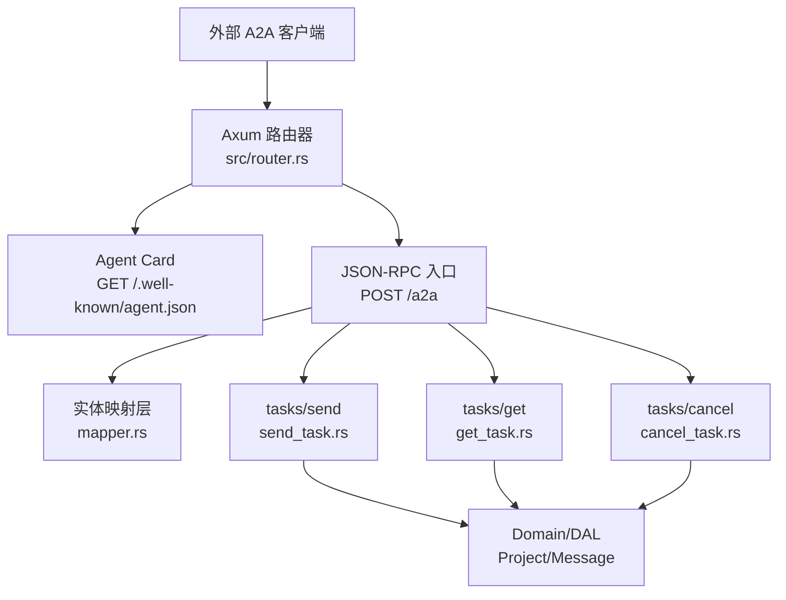
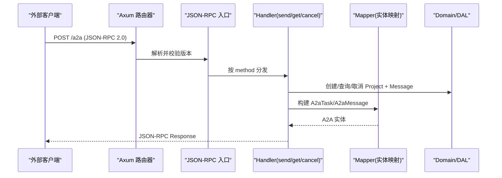
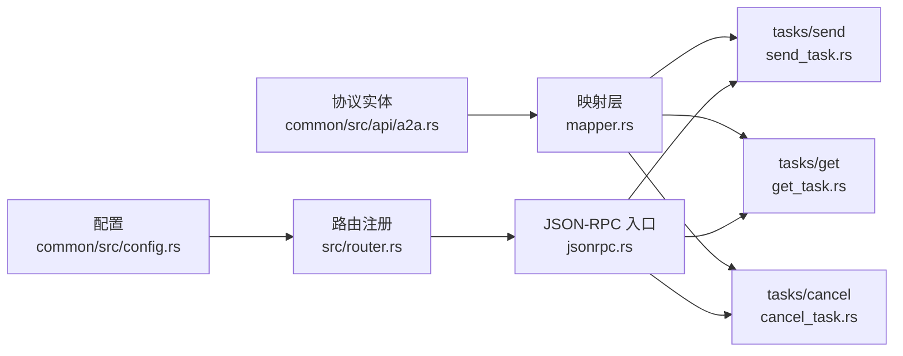

# A2A 集成指南

<cite>
**本文引用的文件**
- [common/src/api/a2a.rs](common/src/api/a2a.rs)
- [src/handlers/a2a/mod.rs](src/handlers/a2a/mod.rs)
- [src/handlers/a2a/jsonrpc.rs](src/handlers/a2a/jsonrpc.rs)
- [src/handlers/a2a/mapper.rs](src/handlers/a2a/mapper.rs)
- [src/handlers/a2a/send_task.rs](src/handlers/a2a/send_task.rs)
- [src/handlers/a2a/get_task.rs](src/handlers/a2a/get_task.rs)
- [src/handlers/a2a/cancel_task.rs](src/handlers/a2a/cancel_task.rs)
- [src/handlers/a2a/agent_card.rs](src/handlers/a2a/agent_card.rs)
- [src/router.rs](src/router.rs)
- [common/src/config.rs](common/src/config.rs)
- [docs/archive/a2a_server_design.md](docs/archive/a2a_server_design.md)
- [docs/superpowers/plans/2026-07-19-a2a-server.md](docs/superpowers/plans/2026-07-19-a2a-server.md)
</cite>

## 目录
1. [简介](#简介)
2. [项目结构](#项目结构)
3. [核心组件](#核心组件)
4. [架构总览](#架构总览)
5. [详细组件分析](#详细组件分析)
6. [依赖关系分析](#依赖关系分析)
7. [性能考虑](#性能考虑)
8. [故障排查指南](#故障排查指南)
9. [结论](#结论)
10. [附录：从零开始集成步骤与示例](#附录从零开始集成步骤与示例)

## 简介
本指南面向希望将 ai_orz 作为 A2A Server 进行集成的外部 Agent（CLI 工具、远程服务）。文档提供从零开始的完整集成步骤，包括环境准备、依赖安装、配置设置；详细说明如何注册外部 Agent、配置连接参数、测试连通性；并提供多种集成场景的完整示例代码路径（同步调用、异步回调、批量处理等模式）；同时包含故障排查清单、性能优化建议与安全最佳实践。

## 项目结构
A2A 能力集中在 handlers/a2a 模块中，对外暴露两类端点：
- 公开发现端点：GET /.well-known/agent.json（Agent Card）
- 受保护 JSON-RPC 端点：POST /a2a（JWT 认证）

路由在 src/router.rs 中统一注册，配置项在 common/src/config.rs 中定义。协议实体定义在 common/src/api/a2a.rs。

图表来源
- [src/router.rs:12-58](src/router.rs#L12-L58)
- [src/handlers/a2a/jsonrpc.rs:21-75](src/handlers/a2a/jsonrpc.rs#L21-L75)
- [src/handlers/a2a/agent_card.rs:9-36](src/handlers/a2a/agent_card.rs#L9-L36)

章节来源
- [src/router.rs:12-58](src/router.rs#L12-L58)
- [src/handlers/a2a/mod.rs:1-28](src/handlers/a2a/mod.rs#L1-L28)

## 核心组件
- 协议实体：AgentCard、JsonRpcRequest/Response、A2aTask、A2aMessage、A2aArtifact 等，定义于 common/src/api/a2a.rs
- 路由与中间件：公开端点无需 JWT；JSON-RPC 端点需 JWT + RequestContext
- Handler 层：
  - agent_card.rs：返回组织级 Agent Card
  - jsonrpc.rs：解析 JSON-RPC 请求并按 method 分发到 send/get/cancel
  - mapper.rs：A2A ↔ ai_orz 内部实体的转换
  - send_task.rs：异步提交任务（立即返回 working，唤醒由 consumer 异步闭环）
  - get_task.rs：查询任务状态与消息历史
  - cancel_task.rs：取消任务（归档 project）
- 配置：A2aServerConfig（enabled、protocol_version、endpoint、card_path）

章节来源
- [common/src/api/a2a.rs:1-306](common/src/api/a2a.rs#L1-L306)
- [src/handlers/a2a/jsonrpc.rs:21-94](src/handlers/a2a/jsonrpc.rs#L21-L94)
- [src/handlers/a2a/mapper.rs:1-99](src/handlers/a2a/mapper.rs#L1-L99)
- [src/handlers/a2a/send_task.rs:1-128](src/handlers/a2a/send_task.rs#L1-L128)
- [src/handlers/a2a/get_task.rs:1-49](src/handlers/a2a/get_task.rs#L1-L49)
- [src/handlers/a2a/cancel_task.rs:1-55](src/handlers/a2a/cancel_task.rs#L1-L55)
- [src/handlers/a2a/agent_card.rs:1-37](src/handlers/a2a/agent_card.rs#L1-L37)
- [common/src/config.rs:512-549](common/src/config.rs#L512-L549)

## 架构总览
A2A 采用“只在 handler 层做内外实体转换”的设计原则，domain 层不感知 A2A 概念。所有协议转换集中在 mapper.rs，业务逻辑通过 Domain/DAL 复用现有 Project/Message 管理能力。

图表来源
- [src/router.rs:21-58](src/router.rs#L21-L58)
- [src/handlers/a2a/jsonrpc.rs:21-75](src/handlers/a2a/jsonrpc.rs#L21-L75)
- [src/handlers/a2a/mapper.rs:57-84](src/handlers/a2a/mapper.rs#L57-L84)

## 详细组件分析

### JSON-RPC 入口与分发（jsonrpc.rs）
- 职责：验证 JSON-RPC 版本、检查 A2A Server 是否启用、按 method 分发到具体 handler
- 错误处理：未知方法返回 METHOD_NOT_FOUND；参数解析失败返回 INVALID_PARAMS；内部错误返回 INTERNAL_ERROR

章节来源
- [src/handlers/a2a/jsonrpc.rs:21-94](src/handlers/a2a/jsonrpc.rs#L21-L94)

### 实体映射层（mapper.rs）
- 职责：将 ai_orz 内部实体（ProjectStatus、Message、Artifact）转换为 A2A 协议实体（A2aTaskState、A2aMessage、A2aArtifact），并构建 A2aTask
- 关键点：角色映射（User→user，其余→agent）、状态映射（Active/PendingReview→Submitted，InProgress→Working，Completed→Completed，Archived→Canceled，Deleted→Failed）

章节来源
- [src/handlers/a2a/mapper.rs:14-84](src/handlers/a2a/mapper.rs#L14-L84)

### tasks/send（send_task.rs）
- 流程：
  1) 从 RequestContext 提取用户身份
  2) 调用 HrDomain.resolve_agent(ctx) 获取前台 Agent（agent 与 project 维度分离）
  3) 创建 Project（绑定 owner_agent_id），启动为 InProgress
  4) 创建 Message（自动入队事件队列），唤醒由 consumer 异步闭环
  5) 立即返回 working 状态的 A2aTask（不等待 Agent 回复）
  6) 可选：若提供 notification_url，创建 A2aCallback 渠道用于推送通知
- 注意：handler 不调用 wake_agent_brain/awaken，唤醒由 consumer 完成

章节来源
- [src/handlers/a2a/send_task.rs:1-128](src/handlers/a2a/send_task.rs#L1-L128)

### tasks/get（get_task.rs）
- 流程：根据 task_id（=project_id）查询 Project → 查询关联 Messages → 查询关联 Artifacts → 构建 A2aTask 返回

章节来源
- [src/handlers/a2a/get_task.rs:1-49](src/handlers/a2a/get_task.rs#L1-L49)

### tasks/cancel（cancel_task.rs）
- 流程：查询 Project → 归档 Project（对应 canceled 状态）→ 重新查询最新状态 → 查询 Messages + Artifacts → 构建 A2aTask 返回

章节来源
- [src/handlers/a2a/cancel_task.rs:1-55](src/handlers/a2a/cancel_task.rs#L1-L55)

### Agent Card（agent_card.rs）
- 公开端点：GET /.well-known/agent.json，无需 JWT
- 返回组织级能力描述（名称、版本、能力声明、技能列表、默认输入/输出模式）

章节来源
- [src/handlers/a2a/agent_card.rs:1-37](src/handlers/a2a/agent_card.rs#L1-L37)

### 路由与中间件（router.rs）
- 公开路由：/.well-known/agent.json（仅 RequestContext）
- 受保护路由：/a2a（JWT + RequestContext）
- SSE 流式：/a2a/subscribe（JWT + RequestContext）
- 回调端点：/a2a/callback/{task_id}（公开，外部 Agent 推送任务更新）

章节来源
- [src/router.rs:12-58](src/router.rs#L12-L58)

## 依赖关系分析
- 协议实体依赖：common/src/api/a2a.rs
- Handler 依赖：
  - jsonrpc.rs 依赖 mapper.rs 与各方法处理器
  - send_task.rs 依赖 HrDomain.resolve_agent、ProjectDomain、MessageDomain
  - get_task.rs 依赖 ProjectDomain、MessageDomain
  - cancel_task.rs 依赖 ProjectDomain、MessageDomain
- 配置依赖：common/src/config.rs 中的 A2aServerConfig
- 路由依赖：src/router.rs 注册所有 A2A 端点

图表来源
- [common/src/api/a2a.rs:1-306](common/src/api/a2a.rs#L1-L306)
- [src/handlers/a2a/mapper.rs:1-99](src/handlers/a2a/mapper.rs#L1-L99)
- [src/handlers/a2a/jsonrpc.rs:21-94](src/handlers/a2a/jsonrpc.rs#L21-L94)
- [src/router.rs:12-58](src/router.rs#L12-L58)
- [common/src/config.rs:512-549](common/src/config.rs#L512-L549)

章节来源
- [src/handlers/a2a/mod.rs:1-28](src/handlers/a2a/mod.rs#L1-L28)
- [src/router.rs:12-58](src/router.rs#L12-L58)

## 性能考虑
- 异步提交：tasks/send 立即返回 working，唤醒由 consumer 异步闭环，避免阻塞 HTTP 请求
- 轮询策略：客户端通过 tasks/get 轮询任务状态，建议合理设置轮询间隔（如 1-5 秒）
- 消息历史长度：tasks/get 支持 history_length 限制，避免大响应
- SSE 流式：P2 已实现 tasks/sendSubscribe，适合实时场景
- 向量存储：后端使用 LanceDB 默认，支持多后端降级（HNSW/InMemory/SqliteVss）

[本节为通用指导，不直接分析具体文件]

## 故障排查指南
- 401 未认证：确保携带有效 JWT（Authorization: Bearer <token>）
- 404 未找到：确认 A2A Server 已启用（config.a2a_server.enabled = true），且任务 ID 存在
- 400 参数错误：检查 JSON-RPC 参数格式与方法名
- 未知方法：确认 method 为 tasks/send、tasks/get、tasks/cancel
- 无可用前台 Agent：检查 HrDomain.resolve_agent 是否能返回 Agent（角色 feishu_reception 或任意 Onboarded Agent）
- 唤醒失败：确认 consumer 正常运行，事件队列可消费

章节来源
- [src/handlers/a2a/jsonrpc.rs:21-75](src/handlers/a2a/jsonrpc.rs#L21-L75)
- [src/handlers/a2a/send_task.rs:31-43](src/handlers/a2a/send_task.rs#L31-L43)

## 结论
ai_orz 作为 A2A Server 提供了标准化的 JSON-RPC 2.0 接口，支持外部 Agent 通过协议调用前台 Agent。通过统一的 resolve_agent 路由、严格的 handler 层实体转换、以及复用的 Domain/DAL 能力，实现了低耦合、高内聚的集成体验。结合 SSE 流式与推送通知，可满足同步、异步、批量等多种集成场景。

[本节为总结，不直接分析具体文件]

## 附录：从零开始集成步骤与示例

### 环境准备
- 技术栈：Rust + Axum + serde + tokio + sqlx
- 数据库：SQLite（.sqlx 离线查询缓存）+ DuckDB 统计
- 前端：Dioxus 0.7（WASM）+ Tailwind CSS v4 + DaisyUI v5
- 向量搜索：LanceDB 0.26 默认，支持 HNSW/InMemory/SqliteVss 多后端降级

章节来源
- [docs/superpowers/plans/2026-07-19-a2a-server.md:130-136](docs/superpowers/plans/2026-07-19-a2a-server.md#L130-L136)

### 依赖安装
- 安装 Rust 工具链（rust-toolchain.toml 指定版本）
- 安装依赖：cargo build
- 初始化数据库：运行迁移脚本（migrations/）
- 生成 .sqlx 缓存：sqlx prepare

章节来源
- [Cargo.toml:1-50](Cargo.toml#L1-L50)
- [migrations/20260420000000_initial.sql:1-100](migrations/20260420000000_initial.sql#L1-L100)

### 配置设置
- 配置文件：ai_orz.toml
- A2A 配置段：
  - enabled：是否启用 A2A Server
  - protocol_version：协议版本（如 "0.3.0"）
  - endpoint：JSON-RPC 端点路径（如 "/a2a"）
  - card_path：Agent Card 路径（如 "/.well-known/agent.json"）
- 启用后，/a2a 和 /.well-known/agent.json 生效；否则返回 404

章节来源
- [common/src/config.rs:512-549](common/src/config.rs#L512-L549)
- [docs/archive/a2a_server_design.md:421-433](docs/archive/a2a_server_design.md#L421-L433)

### 注册外部 Agent（CLI 工具、远程服务）
- CLI 工具：
  - 获取 JWT：调用登录接口获取 token
  - 调用 Agent Card：GET /.well-known/agent.json 获取能力描述
  - 调用 JSON-RPC：POST /a2a，method 为 tasks/send/tasks/get/tasks/cancel
- 远程服务：
  - 配置回调 URL（notification_url）以接收推送通知
  - 实现重试机制与幂等处理

章节来源
- [src/handlers/a2a/agent_card.rs:9-36](src/handlers/a2a/agent_card.rs#L9-L36)
- [src/handlers/a2a/jsonrpc.rs:21-75](src/handlers/a2a/jsonrpc.rs#L21-L75)

### 配置连接参数
- 服务器地址：配置 server.listen_addr
- 数据库：配置 database.db_file_name、vector_db_file_name
- JWT：配置 jwt.secret、jwt.default_expiry_hours
- A2A：配置 a2a_server.enabled、a2a_server.endpoint、a2a_server.card_path

章节来源
- [common/src/config.rs:21-59](common/src/config.rs#L21-L59)
- [common/src/config.rs:61-68](common/src/config.rs#L61-L68)
- [common/src/config.rs:71-96](common/src/config.rs#L71-L96)
- [common/src/config.rs:512-549](common/src/config.rs#L512-L549)

### 测试连通性
- 测试 Agent Card：curl GET /.well-known/agent.json
- 测试 JSON-RPC：curl -X POST /a2a -H "Authorization: Bearer <token>" -d '{"jsonrpc":"2.0","id":1,"method":"tasks/send","params":{"id":"test-task","message":{"role":"user","parts":[{"type":"text","text":"Hello"}]}}}'
- 测试轮询：curl -X POST /a2a -H "Authorization: Bearer <token>" -d '{"jsonrpc":"2.0","id":2,"method":"tasks/get","params":{"id":"test-task"}}'
- 测试取消：curl -X POST /a2a -H "Authorization: Bearer <token>" -d '{"jsonrpc":"2.0","id":3,"method":"tasks/cancel","params":{"id":"test-task"}}'

章节来源
- [src/router.rs:21-58](src/router.rs#L21-L58)
- [src/handlers/a2a/jsonrpc.rs:21-94](src/handlers/a2a/jsonrpc.rs#L21-L94)

### 集成场景示例代码路径
- 同步调用：tasks/send（立即返回 working，轮询 tasks/get）
  - 参考：[src/handlers/a2a/send_task.rs:31-128](src/handlers/a2a/send_task.rs#L31-L128)
- 异步回调：tasks/send 支持 notification_url，后续状态变更推送
  - 参考：[src/handlers/a2a/send_task.rs:93-114](src/handlers/a2a/send_task.rs#L93-L114)
- 批量处理：通过多次 tasks/send 调用，或使用 tasks/sendSubscribe SSE 流式
  - 参考：[src/router.rs:39-56](src/router.rs#L39-L56)

章节来源
- [src/handlers/a2a/send_task.rs:31-128](src/handlers/a2a/send_task.rs#L31-L128)
- [src/router.rs:39-56](src/router.rs#L39-L56)

### 安全最佳实践
- 使用 JWT 认证：所有 /a2a 请求必须携带有效 token
- 最小权限原则：仅授予必要角色（如 Admin/SuperAdmin 访问系统管理）
- 输入验证：严格校验 JSON-RPC 参数与方法名
- 日志审计：记录所有 A2A 请求与响应（含 user_id、org_id）
- 网络安全：使用 HTTPS，限制 CORS 白名单

章节来源
- [src/router.rs:21-58](src/router.rs#L21-L58)
- [common/src/config.rs:61-68](common/src/config.rs#L61-L68)

### 性能优化建议
- 合理设置轮询间隔：避免过频请求导致服务器压力
- 使用 SSE 流式：对于实时场景，优先使用 tasks/sendSubscribe
- 限制历史消息长度：通过 history_length 控制响应大小
- 异步处理：利用 consumer 异步闭环，避免阻塞 HTTP 请求

[本节为通用指导，不直接分析具体文件]