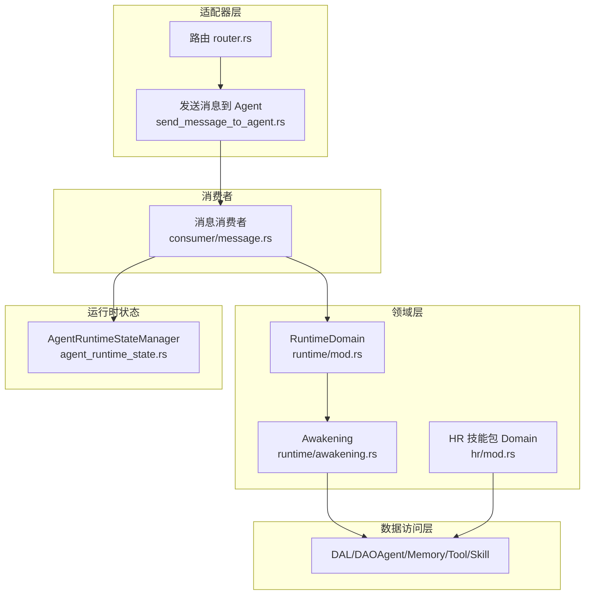
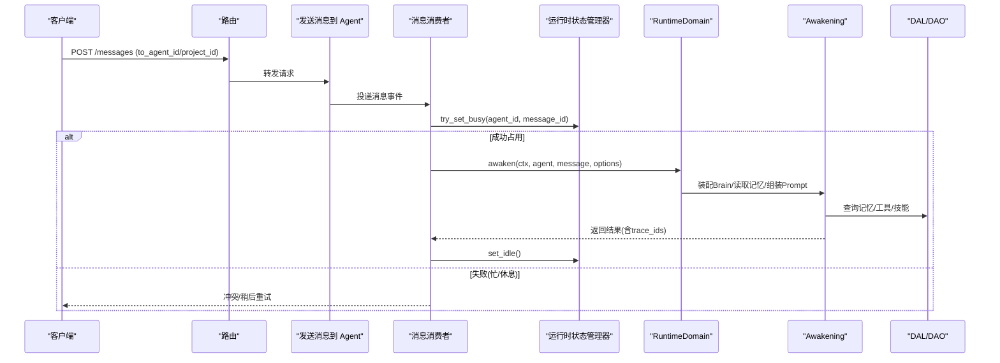
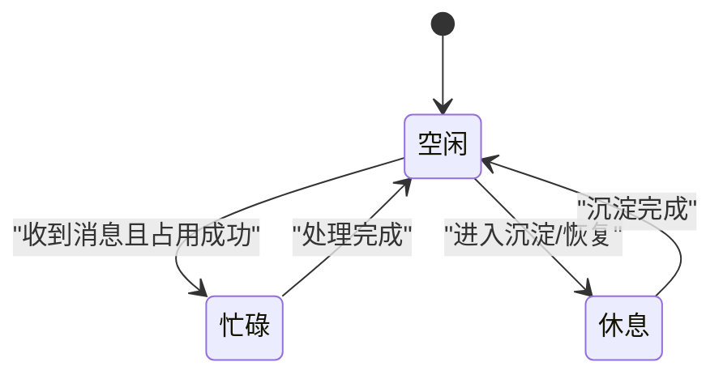
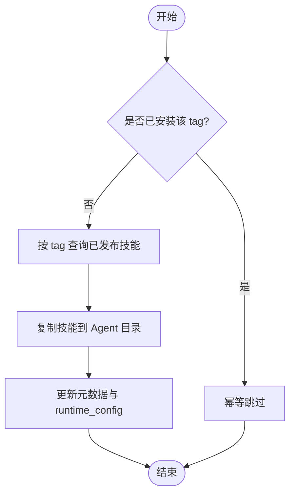
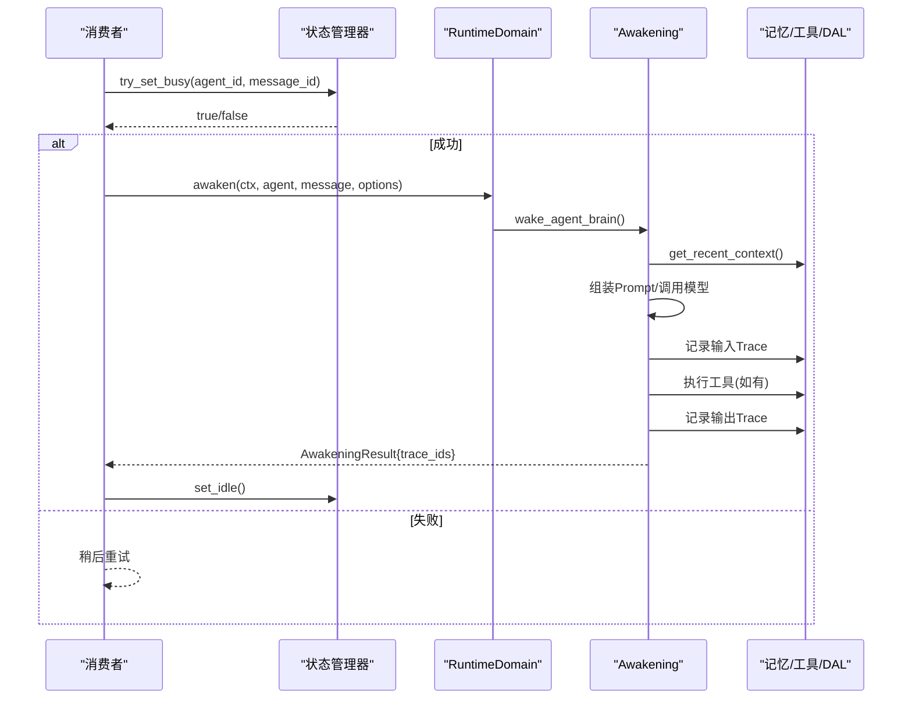
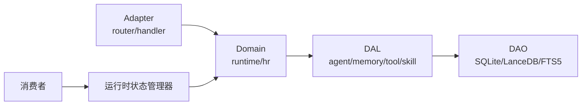

# Agent 全生命周期管理

<cite>
**本文引用的文件**
- [common/enums/agent.rs](common/src/enums/agent.rs)
- [models/agent.rs](src/models/agent.rs)
- [pkg/agent_runtime_state.rs](src/pkg/agent_runtime_state.rs)
- [service/domain/runtime/mod.rs](src/service/domain/runtime/mod.rs)
- [service/domain/runtime/awakening.rs](src/service/domain/runtime/awakening.rs)
- [consumer/message.rs](src/consumer/message.rs)
- [router.rs](src/router.rs)
- [handlers/finance/message/send_message_to_agent.rs](src/handlers/finance/message/send_message_to_agent.rs)
- [service/domain/hr/mod.rs](src/service/domain/hr/mod.rs)
- [service/dao/skill/sqlite.rs](src/service/dao/skill/sqlite.rs)
- [frontend/components/workspace_graph.rs](frontend/src/components/workspace_graph.rs)
</cite>

## 目录
1. [简介](#简介)
2. [项目结构](#项目结构)
3. [核心组件](#核心组件)
4. [架构总览](#架构总览)
5. [详细组件分析](#详细组件分析)
6. [依赖关系分析](#依赖关系分析)
7. [性能考量](#性能考量)
8. [故障排查指南](#故障排查指南)
9. [结论](#结论)
10. [附录](#附录)

## 简介
本文件面向“Agent 全生命周期管理”能力，系统性说明 Agent 的创建、配置、状态管理、技能绑定、工具绑定、自动入职流程、Agent 间通信机制、唤醒循环工作原理，以及如何在项目中协调多个 Agent 协作完成任务。文档同时给出监控与调试方法，并说明如何扩展自定义 Agent 类型。

## 项目结构
本项目采用严格四层单向调用：Adapter（HTTP Handler / 公开回调 / AOP Producer）→ Domain → DAL → DAO。Agent 生命周期相关代码主要分布在以下位置：
- 枚举与运行时状态：common/enums/agent.rs、src/pkg/agent_runtime_state.rs
- Agent 业务实体与运行时配置：src/models/agent.rs
- 运行时领域（唤醒、记忆、工具执行等）：src/service/domain/runtime/*
- 消息消费者（触发唤醒）：src/consumer/message.rs
- HTTP 路由与 Handler：src/router.rs、src/handlers/finance/message/send_message_to_agent.rs
- 技能包安装与卸载（Domain/DAO）：src/service/domain/hr/mod.rs、src/service/dao/skill/sqlite.rs
- 前端可视化（Project/Task/Agent 关联图）：frontend/src/components/workspace_graph.rs

图表来源
- [router.rs:329-364](src/router.rs#L329-L364)
- [handlers/finance/message/send_message_to_agent.rs:37-57](src/handlers/finance/message/send_message_to_agent.rs#L37-L57)
- [consumer/message.rs:122-162](src/consumer/message.rs#L122-L162)
- [service/domain/runtime/mod.rs:108-173](src/service/domain/runtime/mod.rs#L108-L173)
- [service/domain/runtime/awakening.rs:1-804](src/service/domain/runtime/awakening.rs#L1-L804)
- [service/domain/hr/mod.rs:249-291](src/service/domain/hr/mod.rs#L249-L291)
- [pkg/agent_runtime_state.rs:31-157](src/pkg/agent_runtime_state.rs#L31-L157)

章节来源
- [router.rs:329-364](src/router.rs#L329-L364)
- [handlers/finance/message/send_message_to_agent.rs:37-57](src/handlers/finance/message/send_message_to_agent.rs#L37-L57)
- [consumer/message.rs:122-162](src/consumer/message.rs#L122-L162)
- [service/domain/runtime/mod.rs:108-173](src/service/domain/runtime/mod.rs#L108-L173)
- [service/domain/runtime/awakening.rs:1-804](src/service/domain/runtime/awakening.rs#L1-L804)
- [service/domain/hr/mod.rs:249-291](src/service/domain/hr/mod.rs#L249-L291)
- [pkg/agent_runtime_state.rs:31-157](src/pkg/agent_runtime_state.rs#L31-L157)

## 核心组件
- Agent 状态机
  - 生命周期状态（持久化）：面试中 → 待入职 → 已入职 → 待离职 → 已离职；删除态用于软删除。
  - 运行时状态（内存）：空闲 → 忙碌 → 休息；Busy/Resting 不可接受新消息。
- Agent 运行时配置
  - 最大思考深度、单次唤醒最大思考轮次、思考间隔、单步最大工具调用次数、是否启用反思、是否需要用户确认、已安装工具包 tag、已安装技能包 tag、外部 Agent 执行配置（CLI/A2A）。
- 运行时状态管理器
  - 全局单例，提供 set_idle/set_busy/set_resting/try_set_busy/get_state/is_unavailable 等方法，并在状态变更时发布 AOP 事件。
- 运行时领域（RuntimeDomain）
  - 聚合记忆、唤醒、工具执行能力；对外暴露 awaken/sleep_and_settle/wake_agent_brain 等接口。
- 唤醒实现（Awakening）
  - 负责装配 Brain、读取短期记忆、拼装 Prompt、调用模型推理、记录 Trace、上下文压缩与总结沉淀。
- 消息消费者
  - 消费消息后原子占用 Agent（try_set_busy），失败则重试；成功后进入 RuntimeDomain 唤醒链路。
- 技能包安装/卸载
  - 按 tag 批量安装/卸载技能到 Agent 目录；支持重新安装覆盖；列出已安装 tags。

章节来源
- [common/enums/agent.rs:8-111](common/src/enums/agent.rs#L8-L111)
- [models/agent.rs:15-167](src/models/agent.rs#L15-L167)
- [pkg/agent_runtime_state.rs:31-157](src/pkg/agent_runtime_state.rs#L31-L157)
- [service/domain/runtime/mod.rs:108-173](src/service/domain/runtime/mod.rs#L108-L173)
- [service/domain/runtime/awakening.rs:1-804](src/service/domain/runtime/awakening.rs#L1-L804)
- [consumer/message.rs:122-162](src/consumer/message.rs#L122-L162)
- [service/domain/hr/mod.rs:249-291](src/service/domain/hr/mod.rs#L249-L291)

## 架构总览
下图展示从 HTTP 请求到 Agent 唤醒、执行、沉淀的完整链路，以及状态管理与 AOP 事件的交互。

图表来源
- [handlers/finance/message/send_message_to_agent.rs:37-57](src/handlers/finance/message/send_message_to_agent.rs#L37-L57)
- [consumer/message.rs:122-162](src/consumer/message.rs#L122-L162)
- [service/domain/runtime/mod.rs:108-173](src/service/domain/runtime/mod.rs#L108-L173)
- [service/domain/runtime/awakening.rs:1-804](src/service/domain/runtime/awakening.rs#L1-L804)
- [pkg/agent_runtime_state.rs:85-107](src/pkg/agent_runtime_state.rs#L85-L107)

## 详细组件分析

### Agent 状态机与生命周期
- 生命周期状态（持久化）
  - 面试中：创建后的初始状态。
  - 待入职：确认入职，开始自动入职流程（安装工具包/技能包）。
  - 已入职：正常可用，可被分配任务。
  - 待离职/已离职：交接或归档。
- 运行时状态（内存）
  - 空闲：可接收新消息。
  - 忙碌：正在处理消息。
  - 休息：不接受新消息，用于沉淀、压缩上下文、构建知识突触等。
- 状态转换关键点
  - 收到消息：try_set_busy 原子抢占，避免并发重复唤醒。
  - 唤醒完成：set_idle。
  - 沉淀阶段：set_resting → 沉淀 → set_idle。

图表来源
- [common/enums/agent.rs:64-111](common/src/enums/agent.rs#L64-L111)
- [pkg/agent_runtime_state.rs:51-107](src/pkg/agent_runtime_state.rs#L51-L107)

章节来源
- [common/enums/agent.rs:8-111](common/src/enums/agent.rs#L8-L111)
- [pkg/agent_runtime_state.rs:51-107](src/pkg/agent_runtime_state.rs#L51-L107)

### Agent 创建与配置
- 创建
  - 通过 HR 域创建 AgentPo，默认状态为“面试中”，附带角色、描述、灵魂设定、模型提供商等。
- 运行时配置
  - 存储在 agents.runtime_config JSON，包含最大思考深度、单次唤醒最大思考轮次、思考间隔、单步最大工具调用次数、反思开关、用户确认开关、已安装工具包/技能包 tags、外部 Agent 配置（CLI/A2A）。
- 外部 Agent 类型
  - Local：本地进程内执行，具备 Cortex + ModelProvider。
  - Cli：子进程执行器（如 Codex/Claude Code/Aider），可配置命令、参数、工作目录、环境变量、超时、prompt 模板。
  - Remote：A2A 远程执行器，配置 endpoint、agent_name、auth_token、超时。

章节来源
- [models/agent.rs:15-167](src/models/agent.rs#L15-L167)
- [models/agent.rs:330-553](src/models/agent.rs#L330-L553)

### 自动入职流程（安装工具包和技能包）
- 工具包安装/卸载
  - 通过路由 POST/DELETE /agents/{agent_id}/tool-packs/{tag} 进行安装/卸载。
  - 安装后，对应 tag 的工具在唤醒时自动注入到 Prompt（免绑定）。
- 技能包安装/卸载
  - 通过路由 POST/DELETE /agents/{agent_id}/skill-packs/{tag} 进行安装/卸载。
  - 安装时按 tag 查询已发布技能，批量复制到 Agent 目录；支持 reinstall 覆盖更新；支持列出已安装 tags。
  - 卸载时可选项删除副本（delete_copies=true）。
- 技能包底层实现
  - 使用 SQL 聚合 distinct tags；安装时生成新的 skill id，写入 Agent 私有目录 agents/{agent_id}/skills/{skill_id}。

图表来源
- [router.rs:329-364](src/router.rs#L329-L364)
- [service/domain/hr/mod.rs:249-291](src/service/domain/hr/mod.rs#L249-L291)
- [service/dao/skill/sqlite.rs:261-295](src/service/dao/skill/sqlite.rs#L261-L295)

章节来源
- [router.rs:329-364](src/router.rs#L329-L364)
- [service/domain/hr/mod.rs:249-291](src/service/domain/hr/mod.rs#L249-L291)
- [service/dao/skill/sqlite.rs:261-295](src/service/dao/skill/sqlite.rs#L261-L295)

### 工具绑定方式
- 路由
  - POST/DELETE /agents/{agent_id}/tools/{tool_id}/bind 进行绑定/解绑。
- 行为
  - 绑定后，工具可在 Agent 执行时被调用；也可通过“已安装工具包 tag”免绑定自动注入。
- 前端
  - 详情页支持搜索/选择工具并进行绑定/解绑操作。

章节来源
- [router.rs:329-364](src/router.rs#L329-L364)

### 唤醒循环的工作原理
- 入口
  - 消息消费者收到消息后，尝试原子占用 Agent（try_set_busy），失败则稍后重试。
- 唤醒流程
  - 装配 Brain（Local 加载 tools + Cortex；External 构造虚拟 Brain）。
  - 读取最近短期记忆作为历史。
  - 收集关联 trace_id 列表。
  - 拼装 Prompt（含 project/task 上下文）。
  - 记录输入 Trace，调用模型推理。
  - 记录输出 Trace，返回 AwakeningResult（含 trace_ids）。
- 思考循环
  - 若 LLM 返回 tool_call，系统执行工具后将结果回传给 Agent，继续下一轮思考。
  - 达到 max_thinking_rounds 或上下文溢出时，进入总结退出流程。
- 沉淀
  - 唤醒完成后，可进入 sleep_and_settle：设置 Resting → 沉淀 Prompt → think → 写 Trace → Idle。

图表来源
- [consumer/message.rs:122-162](src/consumer/message.rs#L122-L162)
- [service/domain/runtime/mod.rs:108-173](src/service/domain/runtime/mod.rs#L108-L173)
- [service/domain/runtime/awakening.rs:1-804](src/service/domain/runtime/awakening.rs#L1-L804)
- [pkg/agent_runtime_state.rs:85-107](src/pkg/agent_runtime_state.rs#L85-L107)

章节来源
- [consumer/message.rs:122-162](src/consumer/message.rs#L122-L162)
- [service/domain/runtime/mod.rs:108-173](src/service/domain/runtime/mod.rs#L108-L173)
- [service/domain/runtime/awakening.rs:1-804](src/service/domain/runtime/awakening.rs#L1-L804)

### Agent 间通信机制
- 消息路由策略
  - 显式 to_agent_id 优先；否则根据 project.owner_agent_id 取目标；若未指定则 resolve_agent 兜底。
- 协作场景
  - 默认对话框：无 project_id，后端走 resolve_agent 兜底。
  - Project 对话框：有 project_id，后端从 project.owner_agent_id 取目标。
- 可视化
  - 前端 WorkspaceGraph 通过 Task.assignee_type=Agent 建立 Project ↔ Agent 边，便于观察协作关系。

章节来源
- [handlers/finance/message/send_message_to_agent.rs:37-57](src/handlers/finance/message/send_message_to_agent.rs#L37-L57)
- [frontend/components/workspace_graph.rs:114-151](frontend/src/components/workspace_graph.rs#L114-L151)
- [frontend/components/workspace_graph.rs:257-331](frontend/src/components/workspace_graph.rs#L257-L331)

### 在项目与任务中协调多 Agent 协作
- 关系建模
  - Task 持有 project_id 与 assignee_id（assignee_type=Agent），由此推断 Project ↔ Agent 关联。
- 视图呈现
  - Global 视图：所有 Project ↔ Agent 关联。
  - ProjectDetail 视图：选中 Project 的 Task + Agent 节点。
  - AgentDetail 视图：选中 Agent 的 Task + Project 节点。
- 协作流程
  - 通过消息将任务分派给不同 Agent；各 Agent 独立唤醒、执行、沉淀；前端以图形式展示协作拓扑。

章节来源
- [frontend/components/workspace_graph.rs:114-151](frontend/src/components/workspace_graph.rs#L114-L151)
- [frontend/components/workspace_graph.rs:257-331](frontend/src/components/workspace_graph.rs#L257-L331)
- [frontend/components/workspace_graph.rs:398-436](frontend/src/components/workspace_graph.rs#L398-L436)

### 监控与调试
- 运行时状态事件
  - AgentRuntimeStateManager 在状态变更时发布 AgentStateEvent（idle/busy/resting），可用于监控面板与告警。
- 工具调用追踪
  - RuntimeDomain 提供工具调用查询接口，支持按范围查询 ToolCallEntry，便于定位问题。
- 思考轮次与上下文
  - 通过 AwakeningResult.trace_ids 串联输入/输出 Trace；结合 MemoryTrace 可回溯完整思考链。

章节来源
- [pkg/agent_runtime_state.rs:134-157](src/pkg/agent_runtime_state.rs#L134-L157)
- [service/domain/runtime/mod.rs:175-228](src/service/domain/runtime/mod.rs#L175-L228)
- [service/domain/runtime/awakening.rs:424-455](src/service/domain/runtime/awakening.rs#L424-L455)

### 扩展自定义 Agent 类型
- 新增 AgentKind
  - 在枚举中定义新类型（如 Custom），并在 is_local/is_cli/is_remote/is_external 等判断中补充逻辑。
- 适配 PromptBuilder
  - 在 RuntimeDomainImpl.prompt_builder 中为新 kind 返回对应的 PromptBuilder。
- 外部执行配置
  - 在 ExternalAgentConfig 中添加新 executor 变体，并在 AgentPo 的 get_*_config 中提供便捷访问。
- 装配与执行
  - 在 wake_agent_brain 中为新类型构造合适的 Brain（可能不带 Cortex），并确保工具/技能加载路径兼容。

章节来源
- [service/domain/runtime/mod.rs:361-378](src/service/domain/runtime/mod.rs#L361-L378)
- [models/agent.rs:71-105](src/models/agent.rs#L71-L105)
- [models/agent.rs:467-553](src/models/agent.rs#L467-L553)

## 依赖关系分析
- 分层依赖
  - Adapter（router/handler）→ Domain（runtime/hr）→ DAL（agent/memory/tool/skill）→ DAO（SQLite/LanceDB/FTS5）。
- 关键耦合点
  - 消息消费者强依赖运行时状态管理器以避免并发唤醒。
  - Awakening 依赖 Memory、Tool、Skill 的 DAL 以获取上下文与能力。
  - Skill 安装依赖 DAO 的 tags 聚合与文件复制逻辑。
- 潜在风险
  - 并发抢占：已通过 try_set_busy 解决 TOCTOU 竞态。
  - 上下文溢出：通过 max_thinking_rounds 与上下文压缩控制。
  - 外部 Agent 超时：Cli/Remote 配置需合理设置 timeout_secs。

图表来源
- [consumer/message.rs:122-162](src/consumer/message.rs#L122-L162)
- [service/domain/runtime/mod.rs:248-378](src/service/domain/runtime/mod.rs#L248-L378)
- [service/domain/hr/mod.rs:249-291](src/service/domain/hr/mod.rs#L249-L291)
- [service/dao/skill/sqlite.rs:261-295](src/service/dao/skill/sqlite.rs#L261-L295)

章节来源
- [consumer/message.rs:122-162](src/consumer/message.rs#L122-L162)
- [service/domain/runtime/mod.rs:248-378](src/service/domain/runtime/mod.rs#L248-L378)
- [service/domain/hr/mod.rs:249-291](src/service/domain/hr/mod.rs#L249-L291)
- [service/dao/skill/sqlite.rs:261-295](src/service/dao/skill/sqlite.rs#L261-L295)

## 性能考量
- 并发安全
  - 使用 try_set_busy 原子抢占，避免同一 Agent 被多次唤醒。
- 思考轮次限制
  - max_thinking_rounds 控制单次唤醒的最大思考轮次，防止无限循环。
- 上下文压缩
  - 当上下文超限时触发压缩，减少后续 token 消耗。
- 工具调用节流
  - thinking_interval_ms 与 max_tool_calls_per_step 控制调用频率与批大小。
- 外部 Agent 超时
  - Cli/Remote 配置中的 timeout_secs 避免长时间阻塞。

[本节为通用指导，不直接分析具体文件]

## 故障排查指南
- 常见错误
  - 冲突：Agent 忙或休息导致消息无法投递，消费者会重试。
  - 上下文溢出：需检查 max_thinking_rounds 与上下文压缩策略。
  - 外部 Agent 超时：检查 Cli/Remote 配置的 timeout_secs 与 endpoint/auth_token。
- 定位方法
  - 查看 AgentStateEvent 日志，确认状态切换是否正确。
  - 通过工具调用追踪查询 ToolCallEntry，定位具体工具执行问题。
  - 使用 AwakeningResult.trace_ids 串联 Trace，回溯思考链。

章节来源
- [consumer/message.rs:122-162](src/consumer/message.rs#L122-L162)
- [pkg/agent_runtime_state.rs:134-157](src/pkg/agent_runtime_state.rs#L134-L157)
- [service/domain/runtime/mod.rs:175-228](src/service/domain/runtime/mod.rs#L175-L228)

## 结论
本方案通过严格的分层架构与清晰的职责划分，实现了 Agent 的全生命周期管理：从创建、配置、自动入职，到唤醒循环、工具/技能绑定、沉淀与监控。借助运行时状态管理器与 AOP 事件，系统具备良好的可观测性与可扩展性。未来可通过新增 AgentKind 与 PromptBuilder 灵活扩展自定义 Agent 类型，满足多样化业务需求。

[本节为总结，不直接分析具体文件]

## 附录
- API 参考（示例路径）
  - 安装工具包：POST /agents/{agent_id}/tool-packs/{tag}
  - 卸载工具包：DELETE /agents/{agent_id}/tool-packs/{tag}
  - 安装技能包：POST /agents/{agent_id}/skill-packs/{tag}
  - 卸载技能包：DELETE /agents/{agent_id}/skill-packs/{tag}?delete_copies=true
  - 绑定工具：POST /agents/{agent_id}/tools/{tool_id}/bind
  - 解绑工具：DELETE /agents/{agent_id}/tools/{tool_id}/bind
  - 发送消息到 Agent：POST /messages（支持 to_agent_id 或 project_id）

章节来源
- [router.rs:329-364](src/router.rs#L329-L364)
- [handlers/finance/message/send_message_to_agent.rs:37-57](src/handlers/finance/message/send_message_to_agent.rs#L37-L57)