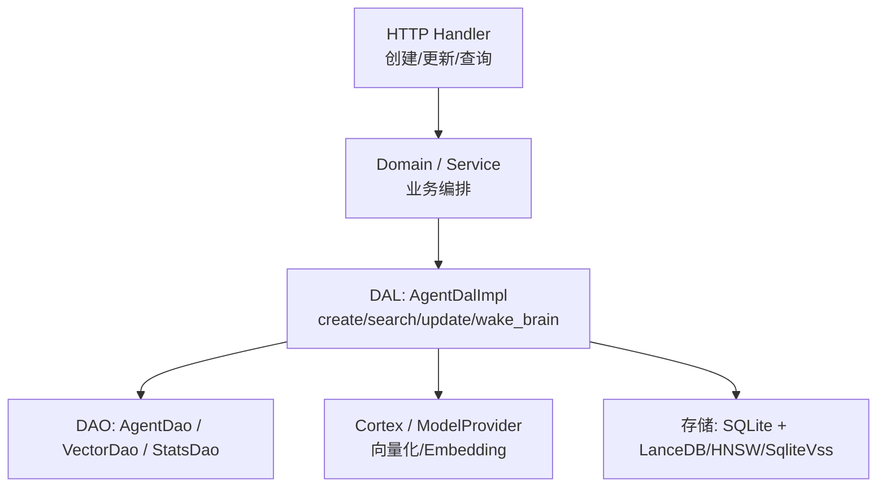
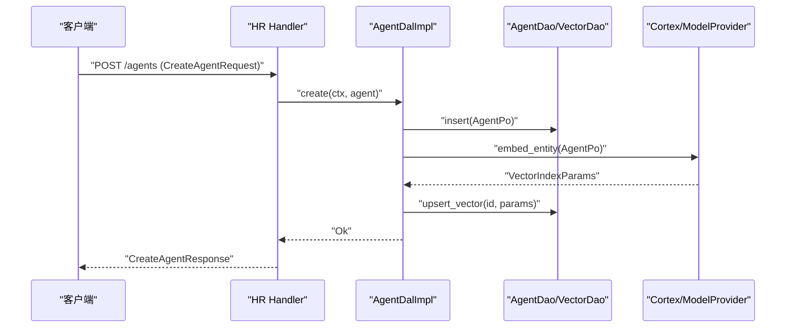
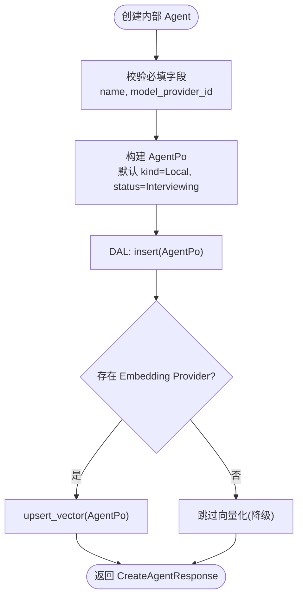
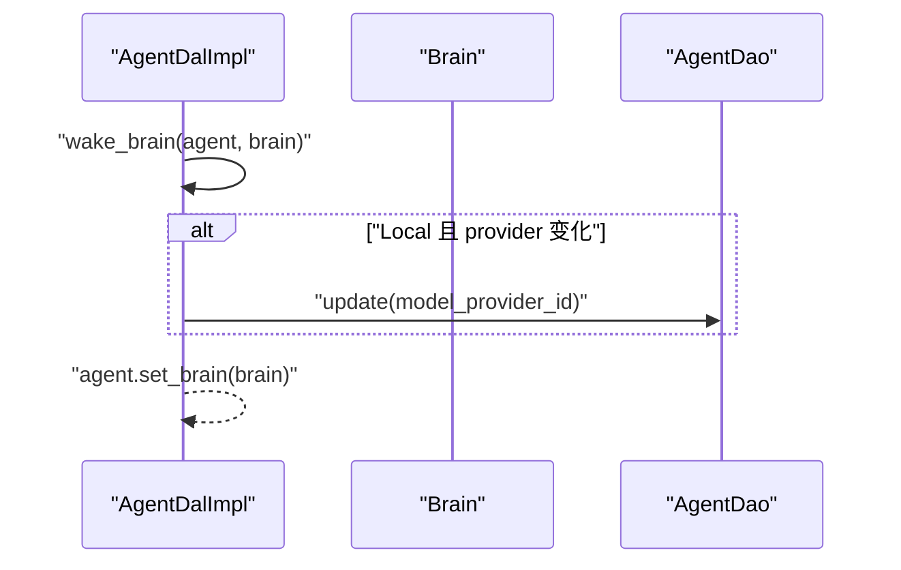
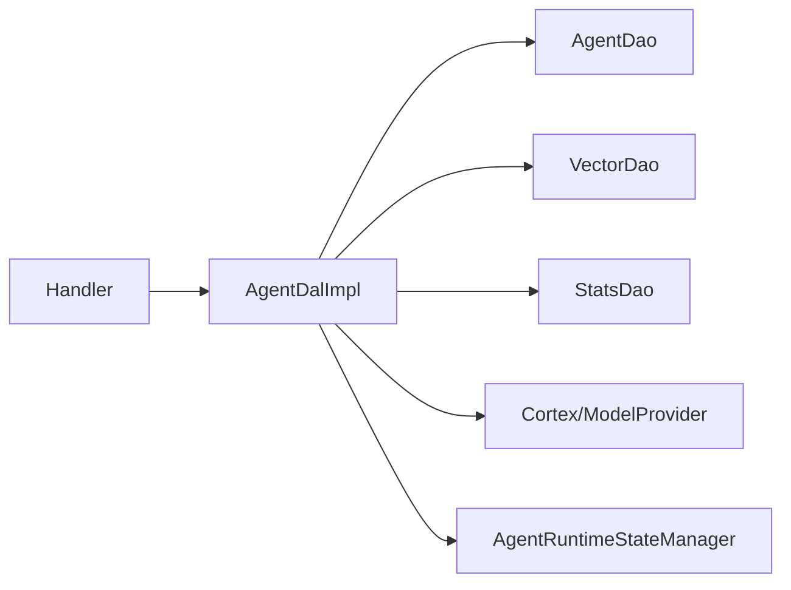

# Agent 创建与配置

<cite>
**本文引用的文件**
- [common/src/api/agent.rs](common/src/api/agent.rs)
- [common/src/api/external_agent.rs](common/src/api/external_agent.rs)
- [common/src/enums/agent.rs](common/src/enums/agent.rs)
- [common/src/enums/agent_kind.rs](common/src/enums/agent_kind.rs)
- [src/models/agent.rs](src/models/agent.rs)
- [src/service/dal/agent/mod.rs](src/service/dal/agent/mod.rs)
- [src/handlers/hr/agent/create_agent.rs](src/handlers/hr/agent/create_agent.rs)
- [src/handlers/hr/agent/create_external_agent.rs](src/handlers/hr/agent/create_external_agent.rs)
- [src/handlers/hr/agent/install_tool_pack.rs](src/handlers/hr/agent/install_tool_pack.rs)
- [src/handlers/hr/agent/uninstall_tool_pack.rs](src/handlers/hr/agent/uninstall_tool_pack.rs)
- [src/handlers/hr/agent/list_installed_tool_packs.rs](src/handlers/hr/agent/list_installed_tool_packs.rs)
</cite>

## 目录
1. [简介](#简介)
2. [项目结构](#项目结构)
3. [核心组件](#核心组件)
4. [架构总览](#架构总览)
5. [详细组件分析](#详细组件分析)
6. [依赖关系分析](#依赖关系分析)
7. [性能考量](#性能考量)
8. [故障排查指南](#故障排查指南)
9. [结论](#结论)
10. [附录：API 参考与最佳实践](#附录api-参考与最佳实践)

## 简介
本文件面向“Agent 创建与配置”能力，覆盖内部 Agent（Local）与外部 Agent（CLI、Remote）的创建方式、结构化配置项、系统提示词生成、模型选择与参数调优、初始化自动流程（默认技能包安装、工具包绑定、记忆初始化等），并提供完整 API 调用示例与最佳实践。文档严格遵循四层单向调用规范：Adapter → Domain → DAL → DAO，所有业务对象在 DAL 层统一使用业务实体，PO 仅在 DAO/DAL 内部使用。

## 项目结构
围绕 Agent 创建与配置的代码主要分布在以下位置：
- 公共 API DTO：定义创建/更新/查询请求与响应结构，以及外部 Agent 配置结构
- 枚举类型：Agent 生命周期状态、运行时状态、Agent 类型（Local/Cli/Remote）
- 领域模型：Agent 业务对象、持久化对象、运行时配置、外部执行器配置、System Prompt 生成
- DAL 层：Agent 数据访问抽象与实现，包含创建、搜索、统计、向量索引重建、唤醒装配等
- Handler 层：HTTP 处理器，负责接收请求、校验参数、调用 Domain/DAL、返回响应



图表来源
- [src/service/dal/agent/mod.rs](src/service/dal/agent/mod.rsL761)
- [src/models/agent.rs:15-121](src/models/agent.rs#L15-L121)

章节来源
- [common/src/api/agent.rs:10-182](common/src/api/agent.rs#L10-L182)
- [common/src/api/external_agent.rs:9-75](common/src/api/external_agent.rs#L9-L75)
- [common/src/enums/agent.rs:8-78](common/src/enums/agent.rs#L8-L78)
- [common/src/enums/agent_kind.rs:8-80](common/src/enums/agent_kind.rs#L8-L80)
- [src/models/agent.rs:15-121](src/models/agent.rs#L15-L121)
- [src/service/dal/agent/mod.rs](src/service/dal/agent/mod.rsL761)

## 核心组件
- Agent 类型与状态
  - AgentKind：决定执行后端（Local/Cli/Remote）
  - AgentStatus：生命周期状态（面试中→待入职→已入职→待离职→已离职→已删除）
  - AgentRuntimeState：内存态运行状态（空闲/休息/忙碌）
- Agent 运行时配置（JSON 序列化到 agents.runtime_config）
  - 最大思考深度、单次唤醒最大思考轮次、思考间隔、单步最大工具调用次数
  - 是否启用反思模式、是否需要用户确认
  - 已安装的工具包 tag、已安装的技能包 tag
  - 外部执行器配置（CLI/Remote）
- Agent 业务对象与持久化对象
  - AgentPo：持久化字段（名称、角色、描述、能力、灵魂、模型提供商 ID、运行时配置、状态、类型、创建/修改信息等）
  - Agent：组合 Po、Brain、Tools、Skills、运行时信息、统计数据、搜索匹配信息
- System Prompt 生成
  - 基于 AgentPo 生成头部提示词，包含 Agent ID、名称、角色描述、灵魂设定

章节来源
- [common/src/enums/agent_kind.rs:8-80](common/src/enums/agent_kind.rs#L8-L80)
- [common/src/enums/agent.rs:8-78](common/src/enums/agent.rs#L8-L78)
- [src/models/agent.rs:15-121](src/models/agent.rs#L15-L121)
- [src/models/agent.rs:330-376](src/models/agent.rs#L330-L376)

## 架构总览
Agent 创建与配置涉及三层协作：
- Adapter（Handler）：接收 HTTP 请求，校验并映射为 Domain/DAL 输入
- Domain/Service：业务编排（如创建 Agent、安装工具包、设置外部执行器配置）
- DAL：数据访问与装配（创建记录、向量化、唤醒 Brain、注入运行时信息）



图表来源
- [src/service/dal/agent/mod.rs](src/service/dal/agent/mod.rsL350)
- [src/service/dal/agent/mod.rs](src/service/dal/agent/mod.rsL312)
- [common/src/api/agent.rs:10-38](common/src/api/agent.rs#L10-L38)

## 详细组件分析

### 内部 Agent（Local）创建与配置
- 必填字段
  - name：Agent 名称
  - model_provider_id：关联的模型提供商 ID（用于 Local 推理）
- 可选字段
  - roles：角色标签列表
  - description：描述
  - capabilities：能力列表
  - soul：灵魂提示词（将参与 System Prompt 头部）
- 默认行为
  - kind 默认为 Local
  - status 初始为 Interviewing
  - runtime_config 使用默认值（最大思考深度、轮次限制、工具调用限制、用户确认开启等）
  - 自动向量化：创建后尝试生成向量索引（失败降级不影响主流程）



图表来源
- [common/src/api/agent.rs:10-38](common/src/api/agent.rs#L10-L38)
- [src/models/agent.rs:378-404](src/models/agent.rs#L378-L404)
- [src/service/dal/agent/mod.rs](src/service/dal/agent/mod.rsL350)
- [src/service/dal/agent/mod.rs](src/service/dal/agent/mod.rsL312)

章节来源
- [common/src/api/agent.rs:10-38](common/src/api/agent.rs#L10-L38)
- [src/models/agent.rs:378-404](src/models/agent.rs#L378-L404)
- [src/service/dal/agent/mod.rs](src/service/dal/agent/mod.rsL350)

### 外部 Agent（CLI/Remote）创建与配置
- 通过 kind 区分 CLI 与 Remote
- CLI 配置（kind=cli 时必填）
  - command：启动命令
  - args：命令参数
  - work_dir：工作目录
  - env：环境变量
  - timeout_secs：超时时间（秒）
  - prompt_template：自定义 prompt 模板（使用 {prompt} 占位符）
- Remote 配置（kind=remote 时必填）
  - endpoint：A2A Server 的 base URL
  - agent_name：目标 Agent 名称
  - auth_token：认证 token（Bearer）
  - timeout_secs：超时时间（秒）
- 默认行为
  - external_config 写入 runtime_config.external_config
  - 自动向量化（同内部 Agent）

```mermaid
classDiagram
class AgentRuntimeConfig {
+int max_thinking_depth
+int max_thinking_rounds
+int thinking_interval_ms
+int max_tool_calls_per_step
+bool enable_reflection
+bool require_user_confirm
+string[] installed_tags
+string[] installed_skill_packs
+ExternalAgentConfig external_config
}
class ExternalAgentConfig {
<<enum>>
Cli{command,args,work_dir,env,timeout_secs,prompt_template}
Remote{endpoint,agent_name,auth_token,timeout_secs}
}
AgentRuntimeConfig --> ExternalAgentConfig : "包含"
```

图表来源
- [src/models/agent.rs:15-121](src/models/agent.rs#L15-L121)
- [common/src/api/external_agent.rs:9-75](common/src/api/external_agent.rs#L9-L75)

章节来源
- [common/src/api/external_agent.rs:9-75](common/src/api/external_agent.rs#L9-L75)
- [src/models/agent.rs:15-121](src/models/agent.rs#L15-L121)

### 系统提示词与模型选择
- 系统提示词头部由 AgentPo::to_system_prompt 生成，包含 Agent ID、名称、角色描述、灵魂设定
- 模型选择
  - Local Agent：通过 model_provider_id 关联模型提供商
  - wake_brain：若 Brain 中的模型提供商与 AgentPo 不一致，自动更新数据库



图表来源
- [src/models/agent.rs:359-376](src/models/agent.rs#L359-L376)
- [src/service/dal/agent/mod.rs](src/service/dal/agent/mod.rsL761)

章节来源
- [src/models/agent.rs:359-376](src/models/agent.rs#L359-L376)
- [src/service/dal/agent/mod.rs](src/service/dal/agent/mod.rsL761)

### 参数调优与运行时配置
- 最大思考深度：控制跨消息累计工具调用数，防止无限循环
- 单次唤醒最大思考轮次：控制 think loop 轮次，达到阈值进入总结退出
- 思考间隔：避免过快调用
- 单步最大工具调用次数：限制每步工具调用数量
- 反思模式：可启用反思以提升质量
- 用户确认机制：默认开启，需用户确认关键操作
- 工具包/技能包 tag：安装后在唤醒时自动注入到 Prompt（免绑定）

章节来源
- [src/models/agent.rs:15-121](src/models/agent.rs#L15-L121)

### 初始化自动流程
- 默认技能包安装：可通过安装技能包 tag 记录，唤醒时加载对应技能副本
- 工具包绑定：通过安装/卸载工具包 tag 管理；唤醒时自动注入相关工具
- 记忆初始化：记忆相关接口独立于 Agent 创建，但可在入职流程中按需初始化短/长期记忆
- 向量索引：创建/更新 Agent 内容变化时自动 upsert 向量索引（失败降级）

章节来源
- [src/models/agent.rs:123-167](src/models/agent.rs#L123-L167)
- [src/service/dal/agent/mod.rs](src/service/dal/agent/mod.rsL312)
- [src/service/dal/agent/mod.rs](src/service/dal/agent/mod.rsL721)

### API 调用示例
- 创建内部 Agent
  - 请求体字段：name、model_provider_id（必填）；roles、description、capabilities、soul（可选）
  - 响应：id、name、description、created_at
- 创建外部 Agent（CLI/Remote）
  - 请求体字段：name、kind（必填）；根据 kind 提供 CLI 或 Remote 配置
  - 响应：id、name、kind、created_at
- 安装/卸载工具包
  - 安装：POST /agents/{agent_id}/tool_packs/{tag}
  - 卸载：DELETE /agents/{agent_id}/tool_packs/{tag}
  - 列出已安装：GET /agents/{agent_id}/installed_tool_packs

章节来源
- [common/src/api/agent.rs:10-38](common/src/api/agent.rs#L10-L38)
- [common/src/api/external_agent.rs:9-75](common/src/api/external_agent.rs#L9-L75)
- [src/handlers/hr/agent/install_tool_pack.rs](src/handlers/hr/agent/install_tool_pack.rs)
- [src/handlers/hr/agent/uninstall_tool_pack.rs](src/handlers/hr/agent/uninstall_tool_pack.rs)
- [src/handlers/hr/agent/list_installed_tool_packs.rs](src/handlers/hr/agent/list_installed_tool_packs.rs)

## 依赖关系分析
- Handler 依赖 DAL 接口进行数据访问与装配
- DAL 依赖 DAO 进行持久化、向量索引、统计查询
- 向量化依赖 Cortex/ModelProvider，失败降级不影响主流程
- 运行时状态由 AgentRuntimeStateManager 注入，内存过滤在 DAL 层完成



图表来源
- [src/service/dal/agent/mod.rs](src/service/dal/agent/mod.rsL204)
- [src/service/dal/agent/mod.rs](src/service/dal/agent/mod.rsL312)

章节来源
- [src/service/dal/agent/mod.rs](src/service/dal/agent/mod.rsL204)
- [src/service/dal/agent/mod.rs](src/service/dal/agent/mod.rsL312)

## 性能考量
- 向量索引：创建/更新时自动 upsert，失败降级；无 Embedding Provider 时跳过
- 搜索优化：混合搜索（FTS5 + 向量）合并结果，限制最大结果数（20），内存态 runtime_state 过滤
- 统计查询：stats 查询失败不阻塞 agent 加载，避免重试风暴
- 工具调用限制：通过 max_tool_calls_per_step 与 max_thinking_rounds 控制资源消耗

章节来源
- [src/service/dal/agent/mod.rs](src/service/dal/agent/mod.rsL699)
- [src/service/dal/agent/mod.rs](src/service/dal/agent/mod.rsL423)

## 故障排查指南
- 向量索引失败
  - 现象：创建/更新后无法搜索或搜索结果不完整
  - 排查：检查是否存在可用的 Embedding Provider；查看日志中的降级警告
- 模型提供商变更未生效
  - 现象：wake_brain 后模型未更新
  - 排查：确认 Brain 中的 model_provider_id 是否与 AgentPo 一致；必要时手动 update
- 工具包未生效
  - 现象：安装工具包后未注入到 Prompt
  - 排查：确认 tag 是否正确安装；检查唤醒流程是否读取 installed_tags

章节来源
- [src/service/dal/agent/mod.rs](src/service/dal/agent/mod.rsL312)
- [src/service/dal/agent/mod.rs](src/service/dal/agent/mod.rsL761)

## 结论
Agent 创建与配置通过清晰的 DTO、枚举、领域模型与 DAL 抽象实现，支持内部与外部 Agent 的灵活配置。系统提示词生成、模型选择、参数调优与初始化自动流程共同构成完整的 Agent 生命周期管理能力。建议在生产环境中合理配置思考深度与轮次限制，确保向量索引可用，并通过工具包/技能包 tag 管理扩展能力。

## 附录：API 参考与最佳实践

### API 参考
- 创建内部 Agent
  - 请求：CreateAgentRequest（name、model_provider_id 必填）
  - 响应：CreateAgentResponse
- 创建外部 Agent
  - 请求：CreateExternalAgentRequest（name、kind 必填；按 kind 提供 CLI 或 Remote 配置）
  - 响应：CreateExternalAgentResponse
- 工具包管理
  - 安装：InstallToolPackRequest（agent_id、tag）
  - 卸载：UninstallToolPackRequest（agent_id、tag）
  - 列出：ListInstalledToolPacksRequest（agent_id）

章节来源
- [common/src/api/agent.rs:10-38](common/src/api/agent.rs#L10-L38)
- [common/src/api/external_agent.rs:9-75](common/src/api/external_agent.rs#L9-L75)
- [src/handlers/hr/agent/install_tool_pack.rs](src/handlers/hr/agent/install_tool_pack.rs)
- [src/handlers/hr/agent/uninstall_tool_pack.rs](src/handlers/hr/agent/uninstall_tool_pack.rs)
- [src/handlers/hr/agent/list_installed_tool_packs.rs](src/handlers/hr/agent/list_installed_tool_packs.rs)

### 最佳实践
- 明确 Agent 类型：Local 用于内置推理，CLI/Remote 用于外部执行器
- 合理设置运行时配置：根据任务复杂度调整思考深度与轮次限制
- 使用工具包/技能包 tag：通过 tag 管理扩展能力，避免硬编码
- 维护模型提供商：确保 Local Agent 的 model_provider_id 有效
- 监控向量索引：确保 Embedding Provider 可用，提升搜索效果

章节来源
- [src/models/agent.rs:15-121](src/models/agent.rs#L15-L121)
- [src/service/dal/agent/mod.rs](src/service/dal/agent/mod.rsL312)
- [common/src/enums/agent_kind.rs:8-80](common/src/enums/agent_kind.rs#L8-L80)