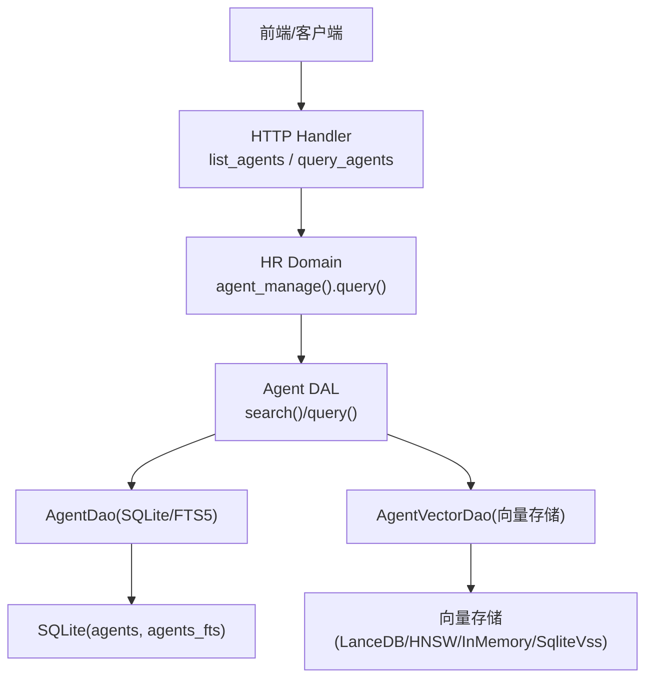
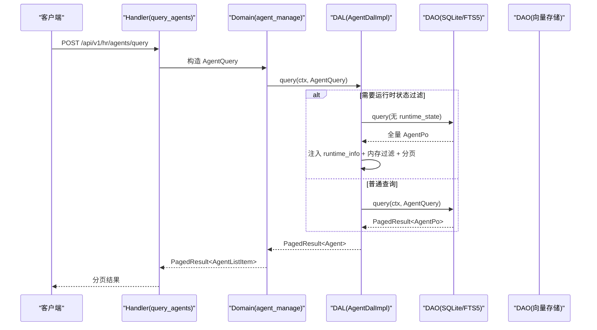
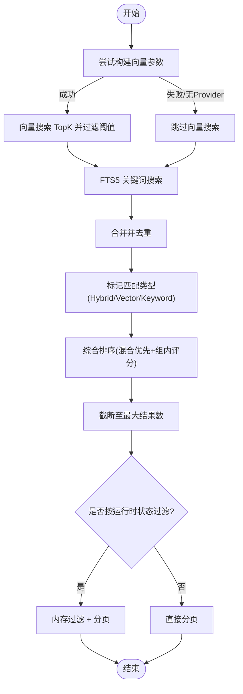
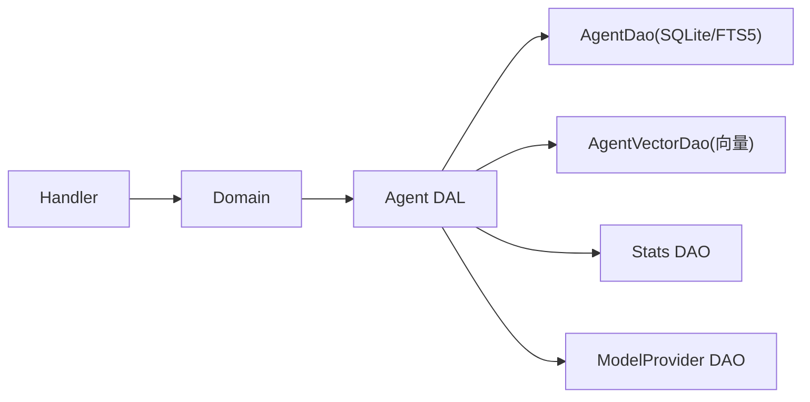

# Agent 搜索与查询

<cite>
**本文引用的文件**
- [common/src/api/agent.rs](common/src/api/agent.rs)
- [src/handlers/hr/agent/list_agents.rs](src/handlers/hr/agent/list_agents.rs)
- [src/handlers/hr/agent/query_agents.rs](src/handlers/hr/agent/query_agents.rs)
- [src/service/dal/agent.rs](src/service/dal/agent.rs)
- [src/service/dao/agent/mod.rs](src/service/dao/agent/mod.rs)
- [src/service/dao/agent/sqlite.rs](src/service/dao/agent/sqlite.rs)
- [common/src/enums/agent.rs](common/src/enums/agent.rs)
</cite>

## 目录
1. [简介](#简介)
2. [项目结构](#项目结构)
3. [核心组件](#核心组件)
4. [架构总览](#架构总览)
5. [详细组件分析](#详细组件分析)
6. [依赖关系分析](#依赖关系分析)
7. [性能考虑](#性能考虑)
8. [故障排查指南](#故障排查指南)
9. [结论](#结论)
10. [附录：API 与使用示例](#附录api-与使用示例)

## 简介
本章节面向“Agent 搜索与查询”能力，系统性说明以下要点：
- 多维度搜索：名称/描述关键词、角色标签过滤、状态筛选、运行时状态筛选等。
- 查询 API：分页、排序、条件组合、混合检索（FTS5 + 向量语义）。
- 推荐机制：基于能力、技能、使用历史等的智能推荐思路与落地位置。
- 复杂发现需求：通过组合查询实现精准定位。
- 性能优化与索引：FTS5、向量索引、内存态过滤策略。
- 评分与排序规则：三态匹配优先级、BM25 与向量距离的组内排序。

## 项目结构
Agent 搜索与查询遵循四层单向调用：Adapter（HTTP Handler）→ Domain → DAL → DAO。DTO 定义在 common 层，Handler 负责参数绑定与响应映射，DAL 封装业务查询与搜索逻辑，DAO 负责 SQL/向量存储访问。

图表来源
- [src/handlers/hr/agent/list_agents.rs:1-62](src/handlers/hr/agent/list_agents.rs#L1-L62)
- [src/handlers/hr/agent/query_agents.rs:1-69](src/handlers/hr/agent/query_agents.rs#L1-L69)
- [src/service/dal/agent.rs:425-699](src/service/dal/agent.rs#L425-L699)
- [src/service/dao/agent/mod.rs:12-46](src/service/dao/agent/mod.rs#L12-L46)
- [src/service/dao/agent/sqlite.rs:141-200](src/service/dao/agent/sqlite.rs#L141-L200)

章节来源
- [src/handlers/hr/agent/list_agents.rs:1-62](src/handlers/hr/agent/list_agents.rs#L1-L62)
- [src/handlers/hr/agent/query_agents.rs:1-69](src/handlers/hr/agent/query_agents.rs#L1-L69)
- [src/service/dal/agent.rs:425-699](src/service/dal/agent.rs#L425-L699)
- [src/service/dao/agent/mod.rs:12-46](src/service/dao/agent/mod.rs#L12-L46)
- [src/service/dao/agent/sqlite.rs:141-200](src/service/dao/agent/sqlite.rs#L141-L200)

## 核心组件
- 请求/响应 DTO：统一在 common 层定义，包含列表、通用查询、搜索请求与分页结果。
- HTTP Handler：提供 list_agents（语法糖列表）与 query_agents（完整查询）。
- DAL：实现综合查询与混合搜索（FTS5 + 向量），注入运行时状态并执行内存态过滤与分页。
- DAO：SQLite FTS5 全文检索；向量存储抽象用于语义检索；统计 DAO 用于唤醒次数等指标。
- 枚举：AgentStatus（生命周期）、AgentRuntimeState（运行时状态）。

章节来源
- [common/src/api/agent.rs:254-316](common/src/api/agent.rs#L254-L316)
- [common/src/enums/agent.rs:8-78](common/src/enums/agent.rs#L8-L78)
- [src/service/dao/agent/mod.rs:12-90](src/service/dao/agent/mod.rs#L12-L90)
- [src/service/dal/agent.rs:115-142](src/service/dal/agent.rs#L115-L142)

## 架构总览
下图展示从请求到数据返回的完整链路，包括混合搜索、内存态过滤与分页。

图表来源
- [src/handlers/hr/agent/query_agents.rs:24-44](src/handlers/hr/agent/query_agents.rs#L24-L44)
- [src/service/dal/agent.rs:425-455](src/service/dal/agent.rs#L425-L455)
- [src/service/dao/agent/sqlite.rs:109-139](src/service/dao/agent/sqlite.rs#L109-L139)

## 详细组件分析

### 搜索与查询 API
- list_agents：GET 列表语法糖，固定排除已删除，仅支持分页。
- query_agents：POST 通用查询，支持 ids、keyword、status、created_by、model_provider_id、roles、runtime_state、pagination。
- search_agents（DAL 内部）：混合搜索入口，支持 keyword、query_vector、top_k、vector_distance_threshold、filters（复用 AgentQuery）。

章节来源
- [src/handlers/hr/agent/list_agents.rs:21-36](src/handlers/hr/agent/list_agents.rs#L21-L36)
- [src/handlers/hr/agent/query_agents.rs:24-44](src/handlers/hr/agent/query_agents.rs#L24-L44)
- [src/service/dao/agent/mod.rs:12-46](src/service/dao/agent/mod.rs#L12-L46)
- [common/src/api/agent.rs:254-316](common/src/api/agent.rs#L254-L316)

### 混合搜索流程（FTS5 + 向量）
- 步骤：
  1) 准备向量搜索结果容器。
  2) 若有关键词，尝试构建向量参数并执行向量搜索（Top K=20，按阈值过滤）。
  3) 执行 FTS5 关键词搜索（DAO 返回 Po + BM25 评分）。
  4) 聚合结果：向量命中且不在关键词命中中的 ID 批量查询补齐。
  5) 去重后为每个 Agent 附加 SearchMatchInfo（Hybrid/Vector/Keyword）。
  6) 综合排序：Hybrid > Vector > Keyword/None；组内按向量距离升序或 BM25 升序。
  7) 截断至 MAX_SEARCH_RESULTS（默认 20），再根据 runtime_state 进行内存过滤与分页。

图表来源
- [src/service/dal/agent.rs:474-699](src/service/dal/agent.rs#L474-L699)
- [src/service/dao/agent/sqlite.rs:141-200](src/service/dao/agent/sqlite.rs#L141-L200)

章节来源
- [src/service/dal/agent.rs:474-699](src/service/dal/agent.rs#L474-L699)
- [src/service/dao/agent/sqlite.rs:141-200](src/service/dao/agent/sqlite.rs#L141-L200)

### 运行时状态过滤与分页
- runtime_state 为内存态，DAO 无法 SQL 过滤。DAL 在查询后注入 runtime_info，再进行内存过滤与手动分页。
- 当存在 runtime_state 过滤时，先查全量（去除分页），过滤后再应用分页。

章节来源
- [src/service/dal/agent.rs:216-242](src/service/dal/agent.rs#L216-L242)
- [src/service/dal/agent.rs:425-455](src/service/dal/agent.rs#L425-L455)

### 评分与排序规则
- 匹配类型优先级：Hybrid（同时命中向量与关键词）> Vector（仅向量）> Keyword/None（仅关键词或未命中）。
- 组内排序：
  - Hybrid/Vector：按向量距离升序（越小越相似）。
  - Keyword：按 FTS5 BM25 评分升序（越小越相关）。
- 总结果上限：搜索场景限制为 20 条，避免无限分页。

章节来源
- [src/service/dal/agent.rs:594-699](src/service/dal/agent.rs#L594-L699)

### 推荐算法与智能推荐
- 当前代码中未实现显式的“推荐”接口；但混合搜索的匹配类型与评分可作为推荐的基础信号。
- 可结合使用历史（如唤醒次数、工具调用统计）与模型调用统计，对候选 Agent 进行加权排序，形成“更相关/更活跃”的推荐顺序。
- 建议扩展点：在 DAL 层聚合 stats（唤醒次数、工具调用、模型调用）后，对搜索结果进行二次打分与排序。

章节来源
- [src/service/dal/agent.rs:763-831](src/service/dal/agent.rs#L763-L831)
- [src/service/dao/agent/mod.rs:128-204](src/service/dao/agent/mod.rs#L128-L204)

### 索引与向量化
- FTS5：agents_fts 表用于全文检索，MATCH 短语匹配，BM25 评分。
- 向量索引：创建/更新 Agent 时自动 upsert 向量索引；更新内容变化时重新向量化；删除时清理向量索引。
- 重建向量：支持清空集合并按当前 Embedding Provider 重建，元数据记录 provider_id 以判断是否需要重建。

章节来源
- [src/service/dal/agent.rs:244-336](src/service/dal/agent.rs#L244-L336)
- [src/service/dal/agent.rs:701-738](src/service/dal/agent.rs#L701-L738)
- [src/service/dal/agent.rs:833-879](src/service/dal/agent.rs#L833-L879)
- [src/service/dao/agent/sqlite.rs:141-200](src/service/dao/agent/sqlite.rs#L141-L200)

## 依赖关系分析
- Handler 依赖 Domain 暴露的 agent_manage() 进行查询。
- Domain 调用 DAL 的 query/search。
- DAL 依赖多个 DAO：AgentDao（SQL/FTS5）、AgentVectorDao（向量存储）、Stats DAO（唤醒/工具调用统计）、ModelProvider DAO（Embedding Provider）。
- 向量存储后端支持 LanceDB、HNSW、InMemory、SqliteVss 等多实现，DAL 层做降级处理。

图表来源
- [src/handlers/hr/agent/query_agents.rs:24-44](src/handlers/hr/agent/query_agents.rs#L24-L44)
- [src/service/dal/agent.rs:54-73](src/service/dal/agent.rs#L54-L73)
- [src/service/dao/agent/mod.rs:63-90](src/service/dao/agent/mod.rs#L63-L90)

章节来源
- [src/service/dal/agent.rs:54-73](src/service/dal/agent.rs#L54-L73)
- [src/service/dao/agent/mod.rs:63-90](src/service/dao/agent/mod.rs#L63-L90)

## 性能考虑
- 混合搜索限制 Top K=20，避免大结果集带来的内存与网络开销。
- 向量搜索失败或无 Embedding Provider 时降级为关键词搜索，保证可用性。
- 运行时状态过滤在内存中进行，减少数据库压力；必要时才拉取全量再过滤。
- 向量索引按需重建，元数据记录 provider_id，避免重复重建。
- 统计查询失败降级，不阻塞主流程。

章节来源
- [src/service/dal/agent.rs:494-542](src/service/dal/agent.rs#L494-L542)
- [src/service/dal/agent.rs:681-699](src/service/dal/agent.rs#L681-L699)
- [src/service/dal/agent.rs:833-879](src/service/dal/agent.rs#L833-L879)

## 故障排查指南
- 向量搜索失败：检查 Embedding Provider 配置与向量存储后端可用性；日志会 warn 降级。
- 无关键词命中：FTS5 空关键词直接返回空结果，需确保关键词非空。
- 运行时状态过滤结果为空：确认 Agent 实际运行时状态与过滤条件一致。
- 统计查询失败：stats 查询失败不影响 Agent 加载，查看日志定位 DuckDB/统计表问题。

章节来源
- [src/service/dal/agent.rs:494-542](src/service/dal/agent.rs#L494-L542)
- [src/service/dal/agent.rs:763-831](src/service/dal/agent.rs#L763-L831)
- [src/service/dao/agent/sqlite.rs:141-153](src/service/dao/agent/sqlite.rs#L141-L153)

## 结论
本项目实现了高可用、可扩展的 Agent 搜索与查询能力：
- 支持多维度过滤与混合检索（FTS5 + 向量），并提供内存态运行时过滤。
- 统一的查询 API 与分页、排序、条件组合，满足复杂发现需求。
- 具备完善的降级与容错机制，保障服务稳定性。
- 推荐能力可通过统计维度进一步扩展，提升“智能推荐”体验。

## 附录：API 与使用示例

### 常用查询字段
- 列表语法糖：ListAgentsRequest（仅分页）。
- 通用查询：AgentQueryRequest（ids、keyword、status、created_by、model_provider_id、roles、runtime_state、pagination）。
- 搜索请求：SearchAgentsRequest（keyword、status、created_by、model_provider_id、roles、runtime_state、pagination）。

章节来源
- [common/src/api/agent.rs:254-316](common/src/api/agent.rs#L254-L316)

### 典型用法
- 名称/描述关键词搜索：设置 keyword，配合 status/roles 过滤。
- 标签过滤：roles 数组 OR 语义，匹配任一角色即命中。
- 状态筛选：status 生命周期状态；runtime_state 运行时状态（Idle/Resting/Busy）。
- 分页与排序：limit/offset 分页；默认排序 created_at DESC（列表），搜索按混合评分排序。

章节来源
- [src/handlers/hr/agent/list_agents.rs:21-36](src/handlers/hr/agent/list_agents.rs#L21-L36)
- [src/handlers/hr/agent/query_agents.rs:24-44](src/handlers/hr/agent/query_agents.rs#L24-L44)
- [src/service/dal/agent.rs:425-455](src/service/dal/agent.rs#L425-L455)
- [src/service/dal/agent.rs:631-699](src/service/dal/agent.rs#L631-L699)