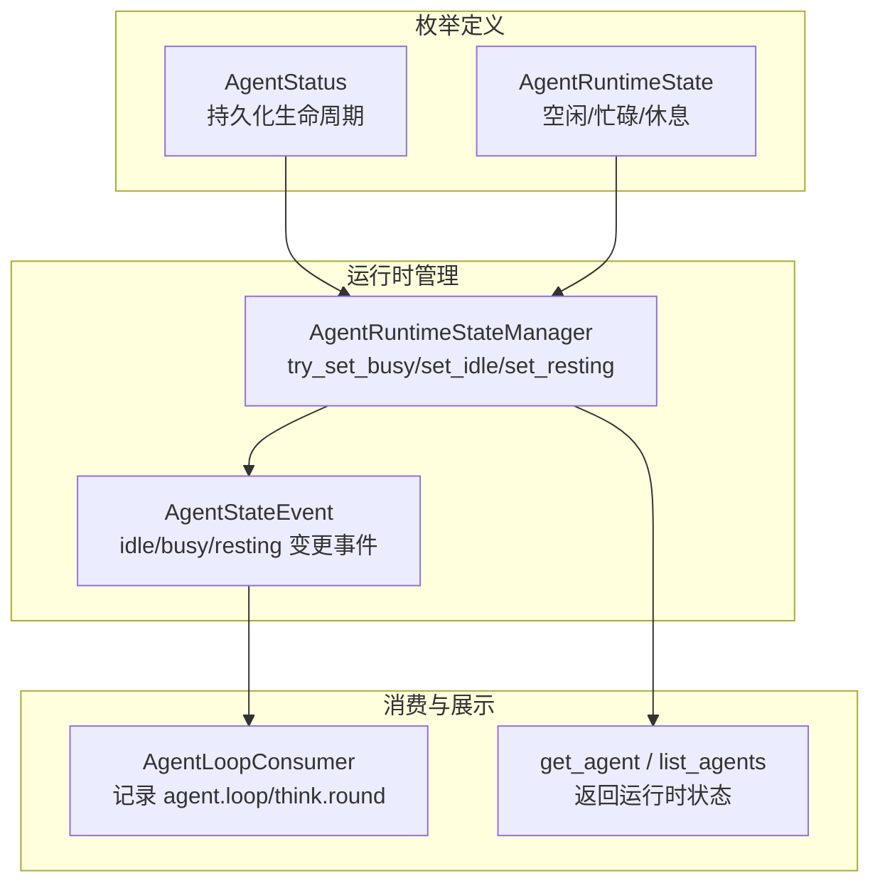
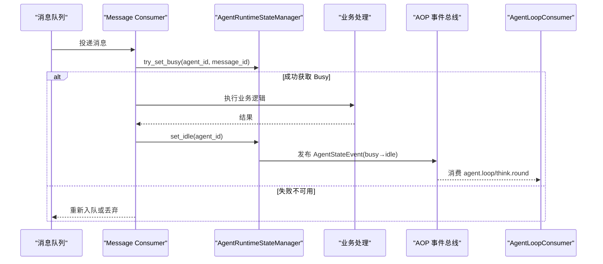
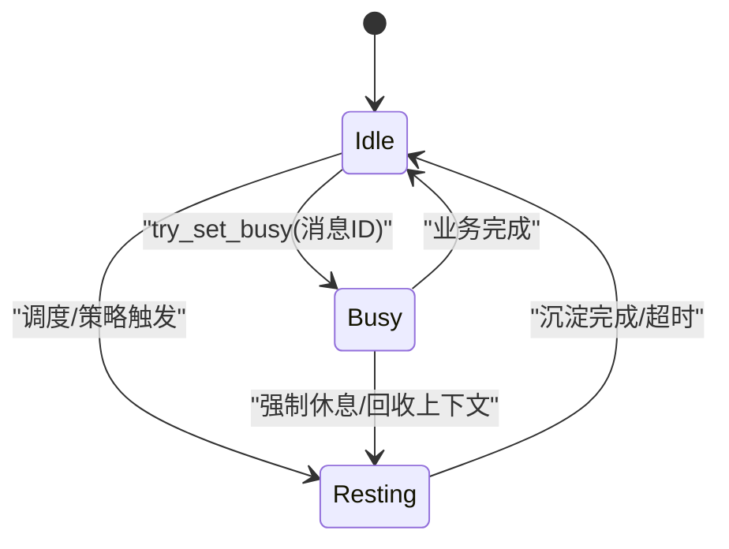
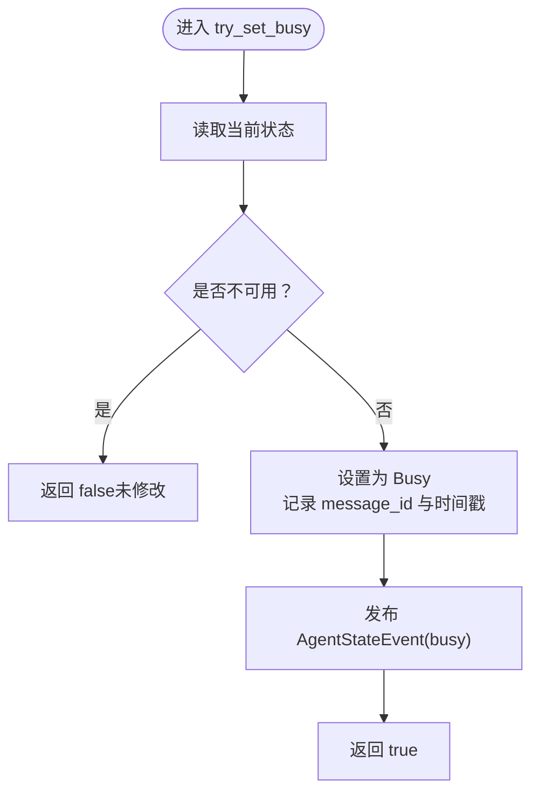
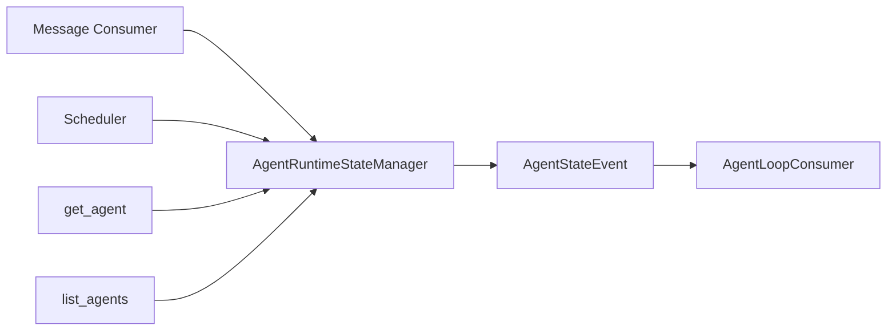

# Agent 状态管理

<cite>
**本文引用的文件**
- [common/src/enums/agent.rs](common/src/enums/agent.rs)
- [src/pkg/agent_runtime_state.rs](src/pkg/agent_runtime_state.rs)
- [src/models/events/agent_state.rs](src/models/events/agent_state.rs)
- [src/models/events/agent_loop.rs](src/models/events/agent_loop.rs)
- [src/consumer/message.rs](src/consumer/message.rs)
- [src/consumer/scheduler.rs](src/consumer/scheduler.rs)
- [src/handlers/hr/agent/get_agent.rs](src/handlers/hr/agent/get_agent.rs)
- [src/handlers/hr/agent/list_agents.rs](src/handlers/hr/agent/list_agents.rs)
- [src/consumer/agent_loop_consumer.rs](src/consumer/agent_loop_consumer.rs)
</cite>

## 目录
1. [简介](#简介)
2. [项目结构](#项目结构)
3. [核心组件](#核心组件)
4. [架构总览](#架构总览)
5. [详细组件分析](#详细组件分析)
6. [依赖关系分析](#依赖关系分析)
7. [性能考虑](#性能考虑)
8. [故障排查指南](#故障排查指南)
9. [结论](#结论)
10. [附录](#附录)

## 简介
本文件围绕 Agent 的状态管理进行系统化说明，覆盖：
- 完整状态机设计：创建、就绪、唤醒、执行、休息、沉淀等状态的转换条件与触发机制。
- 状态更新 API 的使用方式与状态同步机制（内存态 + AOP 事件）。
- 生命周期关键事件：唤醒循环、任务执行、资源释放等。
- 状态监控与调试：如何查看当前状态、历史变更日志。
- 异常处理与问题排查：并发安全、失败回滚、可观测性定位。

## 项目结构
Agent 状态管理涉及三层职责：
- 枚举定义层：统一状态类型与语义（持久化状态与运行时状态分离）。
- 运行时管理层：纯内存状态管理器，提供原子切换与事件发布。
- 消费与展示层：AOP 消费者记录循环与轮次指标；Handler 暴露查询接口。



图表来源
- [common/src/enums/agent.rs:8-78](common/src/enums/agent.rs#L8-L78)
- [src/pkg/agent_runtime_state.rs:11-157](src/pkg/agent_runtime_state.rs#L11-L157)
- [src/models/events/agent_state.rs:4-52](src/models/events/agent_state.rs#L4-L52)
- [src/consumer/agent_loop_consumer.rs:26-96](src/consumer/agent_loop_consumer.rs#L26-L96)
- [src/handlers/hr/agent/get_agent.rs:90-100](src/handlers/hr/agent/get_agent.rs#L90-L100)
- [src/handlers/hr/agent/list_agents.rs:35-50](src/handlers/hr/agent/list_agents.rs#L35-L50)

章节来源
- [common/src/enums/agent.rs:8-78](common/src/enums/agent.rs#L8-L78)
- [src/pkg/agent_runtime_state.rs:11-157](src/pkg/agent_runtime_state.rs#L11-L157)
- [src/models/events/agent_state.rs:4-52](src/models/events/agent_state.rs#L4-L52)
- [src/consumer/agent_loop_consumer.rs:26-96](src/consumer/agent_loop_consumer.rs#L26-L96)
- [src/handlers/hr/agent/get_agent.rs:90-100](src/handlers/hr/agent/get_agent.rs#L90-L100)
- [src/handlers/hr/agent/list_agents.rs:35-50](src/handlers/hr/agent/list_agents.rs#L35-L50)

## 核心组件
- AgentStatus：Agent 的持久化生命周期状态（面试中、待入职、已入职、待离职、已离职、已删除），用于业务侧对 Agent 可用性的长期控制。
- AgentRuntimeState：Agent 的纯内存运行时状态（空闲、休息、忙碌），服务重启后重置，通过消息/任务/事件链路可追溯。
- AgentRuntimeStateManager：全局单例，提供 set_idle、set_resting、set_busy、try_set_busy、get_state、is_unavailable 等方法，并在每次状态变更时异步发布 AgentStateEvent。
- AgentStateEvent：描述 idle/busy/resting 的变更事件，包含 from/to 状态、关联消息 ID、时间戳等。
- AgentLoopEvent：描述 awaken/settle 循环的开始与结束，含场景、阶段、耗时、状态等。
- AgentLoopConsumer：订阅 agent.loop 与 agent.think.round 事件，输出结构化日志便于追踪。

章节来源
- [common/src/enums/agent.rs:8-78](common/src/enums/agent.rs#L8-L78)
- [src/pkg/agent_runtime_state.rs:11-157](src/pkg/agent_runtime_state.rs#L11-L157)
- [src/models/events/agent_state.rs:4-52](src/models/events/agent_state.rs#L4-L52)
- [src/models/events/agent_loop.rs:4-79](src/models/events/agent_loop.rs#L4-L79)
- [src/consumer/agent_loop_consumer.rs:26-96](src/consumer/agent_loop_consumer.rs#L26-L96)

## 架构总览
Agent 状态管理的调用方向严格遵循 Adapter → Domain → DAL → DAO 单向原则。状态相关的关键路径如下：
- 消息消费路径：Message Consumer 在尝试唤醒 Agent 时使用 try_set_busy 原子获取 Busy 状态，避免重复唤醒；成功执行业务后最终 set_idle 释放。
- 调度器路径：定时任务按 Agent 运行时状态决定是否派发任务。
- 查询路径：Handler 读取内存状态并返回给前端或外部系统。
- 事件路径：状态变更通过 AOP 发布 AgentStateEvent；循环与思考轮次通过 AgentLoopEvent 与 ThinkRoundEvent 被消费记录。



图表来源
- [src/consumer/message.rs:140-195](src/consumer/message.rs#L140-L195)
- [src/pkg/agent_runtime_state.rs:85-107](src/pkg/agent_runtime_state.rs#L85-L107)
- [src/models/events/agent_state.rs:4-52](src/models/events/agent_state.rs#L4-L52)
- [src/consumer/agent_loop_consumer.rs:26-96](src/consumer/agent_loop_consumer.rs#L26-L96)

## 详细组件分析

### 状态机设计与转换规则
- 持久化状态（AgentStatus）：用于业务生命周期管理（如是否接受新任务），由上层流程驱动（入职/离职等）。
- 运行时状态（AgentRuntimeState）：
  - Idle：空闲，可接受新消息。
  - Busy：忙碌，正在处理消息，关联 current_message_id。
  - Resting：休息，不接受新消息，用于恢复精力、压缩上下文、构建知识突触等。
- 转换条件与触发：
  - Idle → Busy：消息消费端使用 try_set_busy 原子切换，防止并发重复唤醒。
  - Busy → Idle：业务处理完成后释放，清理 current_message_id。
  - Idle/Busy → Resting：可由调度器或内部策略触发（例如定时沉淀/压缩）。
  - Resting → Idle：沉淀完成或达到休息时长后恢复空闲。



图表来源
- [common/src/enums/agent.rs:64-99](common/src/enums/agent.rs#L64-L99)
- [src/pkg/agent_runtime_state.rs:51-107](src/pkg/agent_runtime_state.rs#L51-L107)
- [src/consumer/scheduler.rs:150-170](src/consumer/scheduler.rs#L150-L170)

章节来源
- [common/src/enums/agent.rs:64-99](common/src/enums/agent.rs#L64-L99)
- [src/pkg/agent_runtime_state.rs:51-107](src/pkg/agent_runtime_state.rs#L51-L107)
- [src/consumer/scheduler.rs:150-170](src/consumer/scheduler.rs#L150-L170)

### 状态更新 API 与同步机制
- 原子设置 Busy：try_set_busy(agent_id, message_id) 在 DashMap 内原子检查 is_unavailable 并写入状态，避免 TOCTOU 竞态。
- 显式设置 Idle/Resting：set_idle、set_resting 在业务或调度结束时调用，记录 state_started_at 并发布事件。
- 事件同步：notify_state_change 使用 tokio::spawn 异步发布 AgentStateEvent，不影响主流程。
- 查询接口：get_state、is_unavailable、get_all_states 供 Handler 与监控使用。



图表来源
- [src/pkg/agent_runtime_state.rs:85-107](src/pkg/agent_runtime_state.rs#L85-L107)
- [src/pkg/agent_runtime_state.rs:134-157](src/pkg/agent_runtime_state.rs#L134-L157)

章节来源
- [src/pkg/agent_runtime_state.rs:51-107](src/pkg/agent_runtime_state.rs#L51-L107)
- [src/pkg/agent_runtime_state.rs:134-157](src/pkg/agent_runtime_state.rs#L134-L157)

### 生命周期关键事件
- 唤醒循环（awaken）：
  - 开始：发布 AgentLoopEvent(phase=started, scene=awaken)。
  - 结束：发布 AgentLoopEvent(phase=finished, status/duration_ms)，用于统计与排障。
- 思考轮次（think round）：
  - 每轮 think 发布 ThinkRoundEvent，记录轮次、耗时、工具调用次数、模型用量与上下文信息。
- 资源释放：
  - 业务结束后 set_idle，清理 current_message_id，确保后续可再次唤醒。

```mermaid
sequenceDiagram
participant Loop as "Awaken/Settle 循环"
participant AOP as "AOP 事件总线"
participant Cons as "AgentLoopConsumer"
Loop->>AOP : 发布 agent.loop(started)
Note over Loop : 执行多轮 think
Loop->>AOP : 发布 agent.think.round(每轮)
Loop->>AOP : 发布 agent.loop(finished)
AOP-->>Cons : 消费并记录日志
```

图表来源
- [src/models/events/agent_loop.rs:4-79](src/models/events/agent_loop.rs#L4-L79)
- [src/consumer/agent_loop_consumer.rs:26-96](src/consumer/agent_loop_consumer.rs#L26-L96)

章节来源
- [src/models/events/agent_loop.rs:4-79](src/models/events/agent_loop.rs#L4-L79)
- [src/consumer/agent_loop_consumer.rs:26-96](src/consumer/agent_loop_consumer.rs#L26-L96)

### 状态监控与调试
- 查看当前状态：
  - get_agent：返回单个 Agent 的运行时状态（若不存在则为 Idle）。
  - list_agents：批量返回所有 Agent 的运行时状态。
- 历史状态变更日志：
  - 通过 AOP 事件 agent.state.changed 与 agent.loop/think.round 的消费日志，结合 trace_id、agent_id、message_id 进行追踪。
- 建议：
  - 在 Handler 层将运行时状态纳入响应体，便于前端展示。
  - 在消费端对异常路径统一 set_idle，保证状态一致性。

章节来源
- [src/handlers/hr/agent/get_agent.rs:90-100](src/handlers/hr/agent/get_agent.rs#L90-L100)
- [src/handlers/hr/agent/list_agents.rs:35-50](src/handlers/hr/agent/list_agents.rs#L35-L50)
- [src/models/events/agent_state.rs:4-52](src/models/events/agent_state.rs#L4-L52)
- [src/consumer/agent_loop_consumer.rs:26-96](src/consumer/agent_loop_consumer.rs#L26-L96)

### 异常处理与问题排查
- 并发重复唤醒：
  - 现象：同一 Agent 被多个 worker 同时唤醒。
  - 原因：is_unavailable 检查与 set_busy 之间存在窗口。
  - 解决：使用 try_set_busy 原子切换，失败则放弃本次唤醒。
- 状态不一致：
  - 现象：Busy 未释放导致无法再次唤醒。
  - 原因：异常路径未调用 set_idle。
  - 解决：在所有退出分支（成功/失败/取消）统一 set_idle。
- 可观测性不足：
  - 现象：难以定位具体轮次与耗时。
  - 解决：完善 agent.loop/think.round 事件字段，结合 trace_id 串联日志。

章节来源
- [src/pkg/agent_runtime_state.rs:85-107](src/pkg/agent_runtime_state.rs#L85-L107)
- [src/consumer/message.rs:140-195](src/consumer/message.rs#L140-L195)
- [src/models/events/agent_loop.rs:4-79](src/models/events/agent_loop.rs#L4-L79)

## 依赖关系分析
- 模块耦合：
  - Message Consumer 依赖 AgentRuntimeStateManager 进行状态切换。
  - Scheduler 依赖运行时状态决定任务派发。
  - Handler 依赖运行时状态提供查询能力。
  - 事件子系统解耦状态变更与日志/统计。
- 外部依赖：
  - DashMap 提供并发安全的内存状态存储。
  - AOP 事件总线用于异步事件发布与消费。



图表来源
- [src/consumer/message.rs:140-195](src/consumer/message.rs#L140-L195)
- [src/consumer/scheduler.rs:150-170](src/consumer/scheduler.rs#L150-L170)
- [src/handlers/hr/agent/get_agent.rs:90-100](src/handlers/hr/agent/get_agent.rs#L90-L100)
- [src/handlers/hr/agent/list_agents.rs:35-50](src/handlers/hr/agent/list_agents.rs#L35-L50)
- [src/pkg/agent_runtime_state.rs:134-157](src/pkg/agent_runtime_state.rs#L134-L157)
- [src/consumer/agent_loop_consumer.rs:26-96](src/consumer/agent_loop_consumer.rs#L26-L96)

章节来源
- [src/consumer/message.rs:140-195](src/consumer/message.rs#L140-L195)
- [src/consumer/scheduler.rs:150-170](src/consumer/scheduler.rs#L150-L170)
- [src/handlers/hr/agent/get_agent.rs:90-100](src/handlers/hr/agent/get_agent.rs#L90-L100)
- [src/handlers/hr/agent/list_agents.rs:35-50](src/handlers/hr/agent/list_agents.rs#L35-L50)
- [src/pkg/agent_runtime_state.rs:134-157](src/pkg/agent_runtime_state.rs#L134-L157)
- [src/consumer/agent_loop_consumer.rs:26-96](src/consumer/agent_loop_consumer.rs#L26-L96)

## 性能考虑
- 原子切换：try_set_busy 在内存锁粒度内完成检查与写入，避免额外 RPC/DB 开销。
- 异步事件：状态变更事件通过 tokio::spawn 异步发布，不阻塞主流程。
- 内存存储：DashMap 支持高并发读写，适合热点 Agent 状态管理。
- 建议：
  - 合理设置休息周期与时长，避免频繁状态切换造成抖动。
  - 对高频 Agent 的查询接口做缓存或聚合，减少遍历成本。

[本节为通用指导，无需特定文件引用]

## 故障排查指南
- 常见问题
  - Agent 无法再次唤醒：检查是否存在异常路径未调用 set_idle。
  - 重复唤醒：确认是否正确使用 try_set_busy，而非先 is_unavailable 再 set_busy。
  - 状态不同步：核对 AgentStateEvent 与消费日志，确认事件是否丢失或消费失败。
- 定位方法
  - 使用 trace_id 串联 awaken/settle 与 think.round 日志。
  - 通过 get_agent/list_agents 快速确认当前运行时状态。
  - 关注 AgentLoopConsumer 输出的 started/finished 日志，定位耗时瓶颈。
- 修复建议
  - 在业务处理的所有退出分支统一 set_idle。
  - 对 try_set_busy 失败的路径增加告警与重试策略。
  - 完善事件字段（如 model_provider_id、tokens 等）以便更精细分析。

章节来源
- [src/pkg/agent_runtime_state.rs:85-107](src/pkg/agent_runtime_state.rs#L85-L107)
- [src/consumer/message.rs:140-195](src/consumer/message.rs#L140-L195)
- [src/consumer/agent_loop_consumer.rs:26-96](src/consumer/agent_loop_consumer.rs#L26-L96)

## 结论
Agent 状态管理通过“持久化生命周期 + 纯内存运行时状态”的双层设计，实现了高并发下的安全切换与可观测性。核心要点包括：
- 使用 try_set_busy 原子切换 Busy，避免并发重复唤醒。
- 通过 AOP 事件实现状态变更与循环指标的解耦记录。
- 在 Handler 层暴露运行时状态，便于监控与前端展示。
- 在异常路径统一释放状态，保障一致性。

[本节为总结，无需特定文件引用]

## 附录
- 术语
  - 唤醒循环：指 awaken/settle 的完整执行过程，包含多轮 think。
  - 沉淀：指休息阶段的上下文压缩与知识整理。
- 最佳实践
  - 所有状态变更必须伴随事件发布。
  - 所有退出路径必须释放状态（set_idle）。
  - 对关键路径添加 trace_id，便于端到端追踪。

[本节为补充说明，无需特定文件引用]


### 本文关联的三类文档（四类互引闭环，Batch11 精确对齐）
#### ① Design 决策快照
- [intent_aware_two_stage_awaken_design.md](docs/design/intent_aware_two_stage_awaken_design.md) — Busy 状态内两阶段流程状态转换：IntentAnalyze → Awaken → Idle（Phase1 失败不影响 Phase2，降级 Level 5/6 等价单阶段流程）
#### ② Plan 落地快照
- [唤醒上下文与睡眠约束.md](docs/plan/唤醒上下文与睡眠约束.md) — BusyGuard RAII 防护 + Resting 状态内沉淀不被新消息打断（排队不丢）
#### ④ RAG 原子知识卡
- [Intent 感知两阶段唤醒：IntentAnalyze Phase1 七字段意图分析 + 6 级 JSON 降级兜底 + Awaken Phase2 正式执行串联](docs/wiki/knowledge/zh/Intent%20感知两阶段唤醒：IntentAnalyze%20Phase1%20七字段意图分析%20+%206%20级%20JSON%20降级兜底%20+%20Awaken%20Phase2%20正式执行串联/Intent%20感知两阶段唤醒：IntentAnalyze%20Phase1%20七字段意图分析%20+%206%20级%20JSON%20降级兜底%20+%20Awaken%20Phase2%20正式执行串联.md) — §4.1 红线 3 need_clarification 绝不短路 + Level 6 降级绝不中断 awaken 链路
