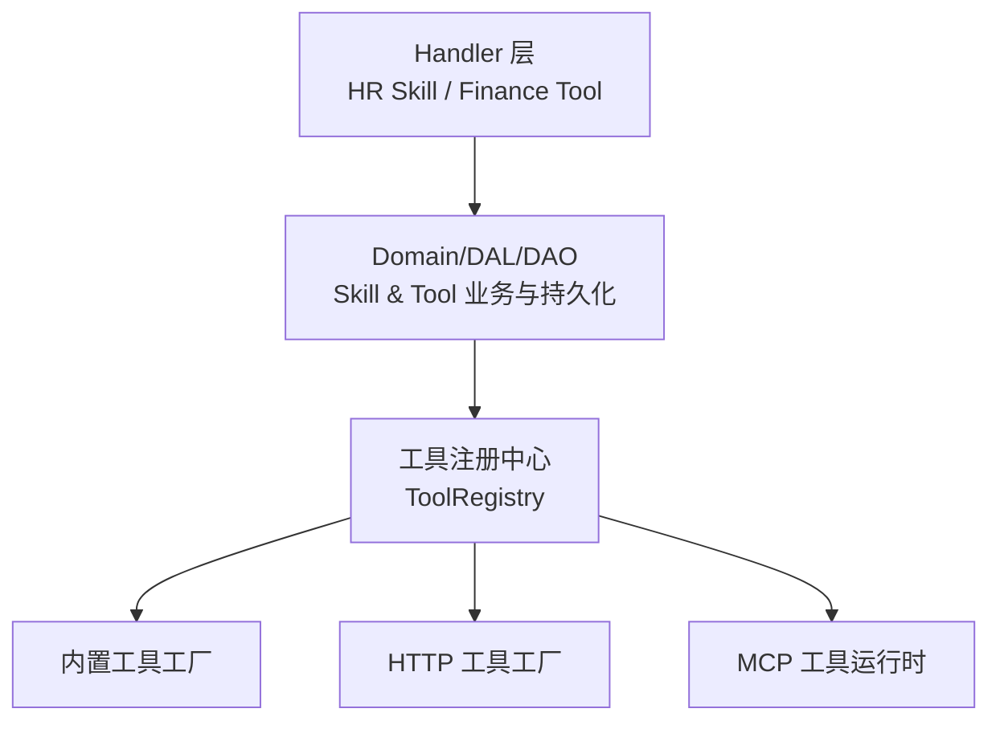
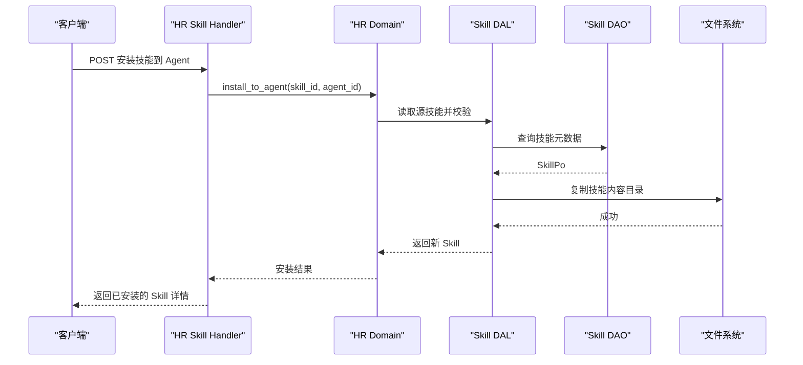
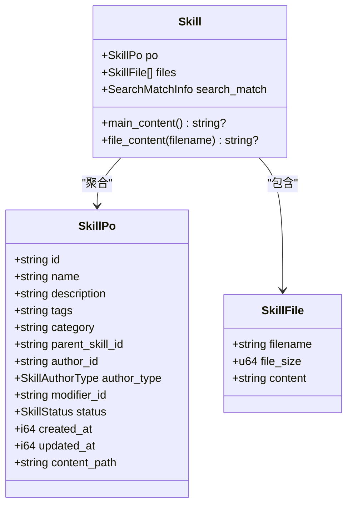
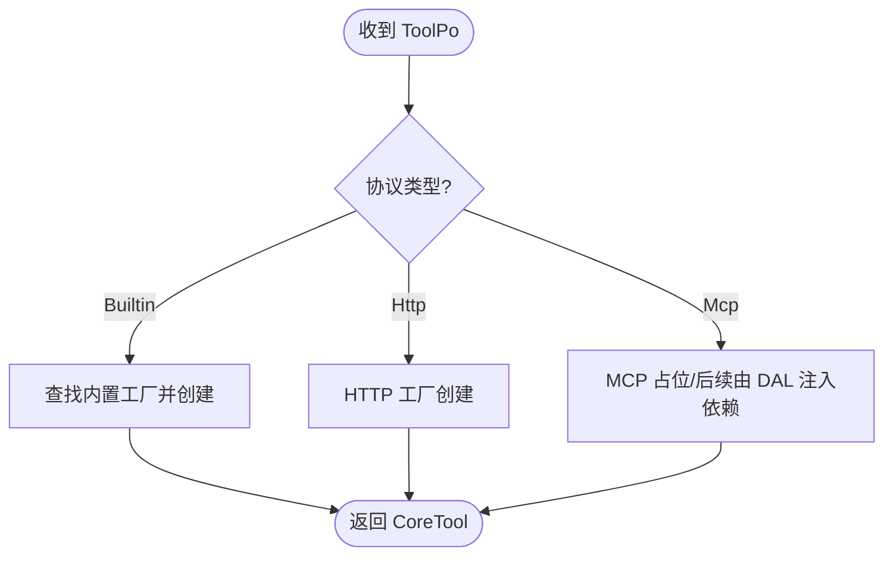
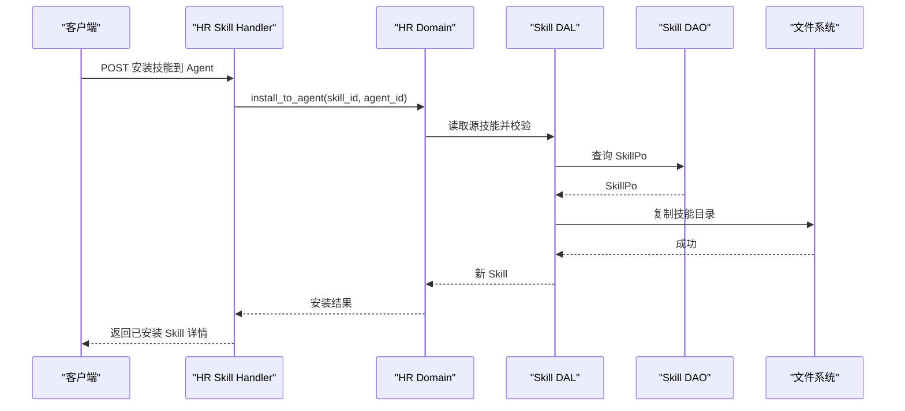
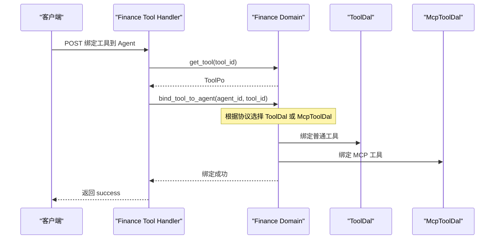
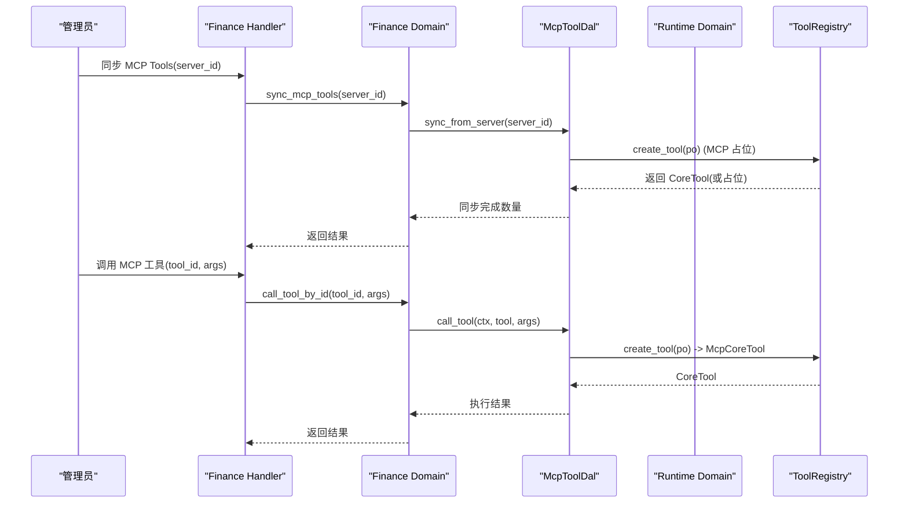
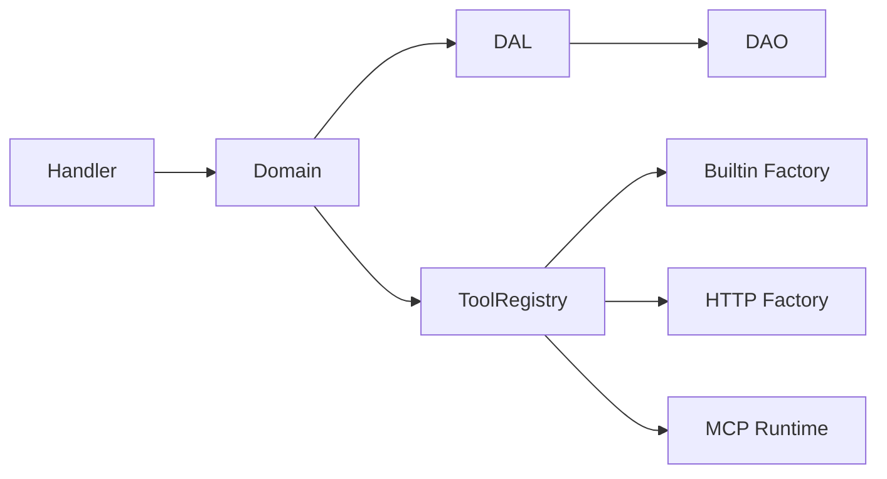

# 技能与工具绑定

<cite>
**本文引用的文件**
- [docs/skill_design.md](docs/skill_design.md)
- [docs/mcp_tool_design.md](docs/mcp_tool_design.md)
- [common/src/api/skill.rs](common/src/api/skill.rs)
- [common/src/enums/skill.rs](common/src/enums/skill.rs)
- [common/src/enums/tool.rs](common/src/enums/tool.rs)
- [src/models/skill.rs](src/models/skill.rs)
- [src/pkg/tool_registry/mod.rs](src/pkg/tool_registry/mod.rs)
- [src/handlers/hr/skill/install_skill_to_agent.rs](src/handlers/hr/skill/install_skill_to_agent.rs)
- [src/handlers/finance/tool/bind_tool_to_agent.rs](src/handlers/finance/tool/bind_tool_to_agent.rs)
- [Skill 系统增强：5 套 TEMPLATE 预置包 + install_skill_pack 幂等 Tag 分发 + Agent 入职绑定 + Prompt Token 熔断](docs/wiki/knowledge/zh/Skill 系统增强：5 套 TEMPLATE 预置包 + install_skill_pack 幂等 Tag 分发 + Agent 入职绑定 + Prompt Token 熔断/Skill 系统增强：5 套 TEMPLATE 预置包 + install_skill_pack 幂等 Tag 分发 + Agent 入职绑定 + Prompt Token 熔断.md)
</cite>

## 目录
1. [简介](#简介)
2. [项目结构](#项目结构)
3. [核心组件](#核心组件)
4. [架构总览](#架构总览)
5. [详细组件分析](#详细组件分析)
6. [依赖关系分析](#依赖关系分析)
7. [性能考虑](#性能考虑)
8. [故障排查指南](#故障排查指南)
9. [结论](#结论)
10. [附录：API 速查与示例](#附录api-速查与示例)

## 简介
本文件面向“Agent 技能与工具绑定”能力，覆盖以下主题：
- 技能包与工具包的安装、卸载、查询与管理操作
- 技能包的结构定义、版本管理与依赖关系（以状态与作者类型体现）
- 工具绑定的机制：内置工具、HTTP 工具、MCP 工具的绑定与执行差异
- 具体 API 调用路径与调用顺序说明
- 技能包与工具包的发布、分发与版本控制策略
- 技能开发指南与工具扩展方法

## 项目结构
围绕技能与工具的核心代码分布在如下位置：
- 公共 DTO 与枚举：common/src/api/skill.rs、common/src/enums/skill.rs、common/src/enums/tool.rs
- 模型与实体：src/models/skill.rs
- 工具注册中心：src/pkg/tool_registry/mod.rs
- 管理面 Handler：src/handlers/hr/skill/*、src/handlers/finance/tool/*
- 设计文档：docs/skill_design.md、docs/mcp_tool_design.md

图表来源
- [src/handlers/hr/skill/install_skill_to_agent.rs:1-37](src/handlers/hr/skill/install_skill_to_agent.rs#L1-L37)
- [src/handlers/finance/tool/bind_tool_to_agent.rs:1-39](src/handlers/finance/tool/bind_tool_to_agent.rs#L1-L39)
- [src/pkg/tool_registry/mod.rs:29-102](src/pkg/tool_registry/mod.rs#L29-L102)

章节来源
- [docs/skill_design.md:1-120](docs/skill_design.md#L1-L120)
- [docs/mcp_tool_design.md:1-120](docs/mcp_tool_design.md#L1-L120)

## 核心组件
- 技能模型与状态
  - 技能持久化对象与业务实体：SkillPo、Skill
  - 技能状态：Expired/Published/Draft；作者类型：User/Agent
- 工具协议与控制模式
  - 工具协议：Builtin/Http/Mcp
  - 控制模式：Auto/Manual（默认 Manual 用于 MCP）
- 工具注册中心
  - 按协议分发的全局工具注册表，负责从 ToolPo 创建可执行 CoreTool
- 管理面 Handler
  - HR Skill：安装技能到 Agent、文件读写、列表/搜索等
  - Finance Tool：将工具绑定到 Agent、同步 MCP Tools 等

章节来源
- [src/models/skill.rs:20-193](src/models/skill.rs#L20-L193)
- [common/src/enums/skill.rs:6-79](common/src/enums/skill.rs#L6-L79)
- [common/src/enums/tool.rs:9-162](common/src/enums/tool.rs#L9-L162)
- [src/pkg/tool_registry/mod.rs:29-102](src/pkg/tool_registry/mod.rs#L29-L102)
- [src/handlers/hr/skill/install_skill_to_agent.rs:1-37](src/handlers/hr/skill/install_skill_to_agent.rs#L1-L37)
- [src/handlers/finance/tool/bind_tool_to_agent.rs:1-39](src/handlers/finance/tool/bind_tool_to_agent.rs#L1-L39)

## 架构总览
系统遵循四层单向调用：Adapter（Handler）→ Domain → DAL → DAO。技能与工具在 Handler 层暴露 HTTP 接口，进入 Domain/DAL/DAO 完成持久化与资源管理；工具执行通过工具注册中心与协议专用运行时完成。

图表来源
- [src/handlers/hr/skill/install_skill_to_agent.rs:1-37](src/handlers/hr/skill/install_skill_to_agent.rs#L1-L37)
- [docs/skill_design.md:315-360](docs/skill_design.md#L315-L360)
- [docs/skill_design.md:493-524](docs/skill_design.md#L493-L524)

## 详细组件分析

### 技能包结构与生命周期
- 数据结构
  - SkillPo：数据库持久化对象，包含 id/name/description/tags/category/author_id/author_type/status/content_path 等字段
  - Skill：业务实体，聚合 PO、文件列表与可选的搜索匹配信息
- 状态与作者类型
  - 状态：Expired/Published/Draft；Published 表示可被共享库检索和使用，Draft 为 Agent 私有草稿
  - 作者类型：User/Agent，用于区分技能来源
- 文件存储
  - 共享技能目录与 Agent 自有技能目录分离，content_path 存储相对路径
  - 支持主文件 skill.md 与附加文本文件的小文件编辑与导入
- 版本与依赖
  - 通过 parent_skill_id 表达继承来源，形成技能树演进
  - 通过 status 实现软删除与发布控制，配合 tags 进行分组与批量安装

图表来源
- [src/models/skill.rs:20-193](src/models/skill.rs#L20-L193)
- [common/src/enums/skill.rs:6-79](common/src/enums/skill.rs#L6-L79)

章节来源
- [docs/skill_design.md:12-63](docs/skill_design.md#L12-L63)
- [docs/skill_design.md:315-360](docs/skill_design.md#L315-L360)
- [docs/skill_design.md:493-524](docs/skill_design.md#L493-L524)
- [src/models/skill.rs:20-193](src/models/skill.rs#L20-L193)
- [common/src/enums/skill.rs:6-79](common/src/enums/skill.rs#L6-L79)

### 工具协议与控制模式
- 工具协议
  - Builtin：内置工具，由编译期注册的工厂创建实例
  - Http：远程 HTTP 工具，配置驱动
  - Mcp：外部 MCP Server 暴露的工具，需连接 Server 并调用 tools/call
- 控制模式
  - Auto：交由 Rig 自动处理（适合简单工具）
  - Manual：走自建消息链路（MCP 默认 Manual，避免直接进入 auto tool calling）

章节来源
- [common/src/enums/tool.rs:9-162](common/src/enums/tool.rs#L9-L162)
- [docs/mcp_tool_design.md:1-30](docs/mcp_tool_design.md#L1-L30)

### 工具注册中心与执行分发
- 全局注册表
  - 按协议维护工厂或单例，create_tool 根据 ToolPo.protocol 分发到对应工厂
- 协议分发
  - Builtin：查找已注册的内置工厂
  - Http：使用 HTTP 工厂创建
  - Mcp：当前阶段为占位，后续由 McpToolDal 准备 server/runtime 依赖后构造

图表来源
- [src/pkg/tool_registry/mod.rs:29-102](src/pkg/tool_registry/mod.rs#L29-L102)

章节来源
- [src/pkg/tool_registry/mod.rs:29-102](src/pkg/tool_registry/mod.rs#L29-L102)

### 技能包安装与卸载流程
- 安装技能到 Agent
  - Handler 接收请求，设置 RequestContext.agent_id
  - 调用 HR Domain 的 install_to_agent，DAL/DAO 完成源技能查询与文件复制，返回新 Skill
- 卸载技能包
  - 支持按 tag 卸载（移除 Agent 侧的 installed_skill_packs 关联），可选择是否删除副本
  - 支持单技能卸载（删除 Agent 目录中的技能副本）

图表来源
- [src/handlers/hr/skill/install_skill_to_agent.rs:1-37](src/handlers/hr/skill/install_skill_to_agent.rs#L1-L37)
- [docs/skill_design.md:493-524](docs/skill_design.md#L493-L524)

章节来源
- [src/handlers/hr/skill/install_skill_to_agent.rs:1-37](src/handlers/hr/skill/install_skill_to_agent.rs#L1-L37)
- [common/src/api/skill.rs:173-193](common/src/api/skill.rs#L173-L193)
- [common/src/api/skill.rs:366-425](common/src/api/skill.rs#L366-L425)
- [docs/skill_design.md:493-524](docs/skill_design.md#L493-L524)

### 工具绑定到 Agent 的流程
- 绑定工具到 Agent
  - Handler 校验工具存在，设置 RequestContext.agent_id
  - 调用 Finance Domain 的 bind_tool_to_agent，完成绑定
- 协议路由
  - 通用工具（Builtin/Http）走 ToolDal
  - MCP 工具走 McpToolDal，确保 server/runtime 依赖正确注入

图表来源
- [src/handlers/finance/tool/bind_tool_to_agent.rs:1-39](src/handlers/finance/tool/bind_tool_to_agent.rs#L1-L39)
- [docs/mcp_tool_design.md:713-766](docs/mcp_tool_design.md#L713-L766)

章节来源
- [src/handlers/finance/tool/bind_tool_to_agent.rs:1-39](src/handlers/finance/tool/bind_tool_to_agent.rs#L1-L39)
- [docs/mcp_tool_design.md:713-766](docs/mcp_tool_design.md#L713-L766)

### MCP 工具同步与执行闭环
- 同步 MCP Tools
  - 通过 Finance Domain 触发 sync_from_server，调用 MCP runtime 的 tools/list，upsert 为标准 ToolPo
- 执行 MCP 工具
  - Runtime Domain 按协议路由：MCP 走 McpToolDal，组装 McpCoreTool 并调用 client_runtime.call_tool
  - 结果经脱敏/截断/标准化后写回消息链路

图表来源
- [docs/mcp_tool_design.md:299-349](docs/mcp_tool_design.md#L299-L349)
- [docs/mcp_tool_design.md:581-635](docs/mcp_tool_design.md#L581-L635)
- [docs/mcp_tool_design.md:713-766](docs/mcp_tool_design.md#L713-L766)

章节来源
- [docs/mcp_tool_design.md:299-349](docs/mcp_tool_design.md#L299-L349)
- [docs/mcp_tool_design.md:581-635](docs/mcp_tool_design.md#L581-L635)
- [docs/mcp_tool_design.md:713-766](docs/mcp_tool_design.md#L713-L766)

## 依赖关系分析
- Handler 仅做 DTO 映射与权限上下文装配，不直接访问 DAO/DAL
- Domain 编排跨模块能力（如 HR Skill 与 Finance Attachment 的协作）
- DAL 组合多个 DAO，封装业务实体转换与文件/向量索引等复杂逻辑
- DAO 专注持久化与基础文件操作
- 工具注册中心按协议分发，避免协议细节污染上层

图表来源
- [src/handlers/hr/skill/install_skill_to_agent.rs:1-37](src/handlers/hr/skill/install_skill_to_agent.rs#L1-L37)
- [src/handlers/finance/tool/bind_tool_to_agent.rs:1-39](src/handlers/finance/tool/bind_tool_to_agent.rs#L1-L39)
- [src/pkg/tool_registry/mod.rs:29-102](src/pkg/tool_registry/mod.rs#L29-L102)

章节来源
- [docs/skill_design.md:671-704](docs/skill_design.md#L671-L704)
- [docs/mcp_tool_design.md:152-195](docs/mcp_tool_design.md#L152-L195)

## 性能考虑
- 技能文件小文件预读：列表时自动预读小文件内容，减少多次 IO
- 向量索引：Skill 支持向量语义搜索，结合 FTS5 全文搜索提升检索效率
- 工具执行缓存：MCP client/session 生命周期由 McpToolCallDaoImpl 统一管理，避免重复初始化
- 分页与过滤：列表与搜索统一分页契约，避免独立 count 查询条件漂移

章节来源
- [docs/skill_design.md:416-427](docs/skill_design.md#L416-L427)
- [docs/skill_design.md:461-491](docs/skill_design.md#L461-L491)
- [docs/mcp_tool_design.md:152-195](docs/mcp_tool_design.md#L152-L195)

## 故障排查指南
- 技能安装失败
  - 检查源技能是否存在且非过期状态
  - 检查目标 Agent 目录权限与磁盘空间
  - 查看 DAL/DAO 日志确认文件复制与数据库写入是否成功
- 工具绑定失败
  - 确认工具存在且未被禁用
  - 对于 MCP 工具，检查 server 配置与连接状态，必要时执行 test_connection 或 sync_tools
- MCP 工具执行异常
  - 检查 McpServerPo.config 是否完整（command/env/url/headers）
  - 查看 McpClientRuntime 日志，确认 session 建立与 tools/call 响应
  - 注意错误脱敏，避免泄露敏感信息

章节来源
- [docs/skill_design.md:588-610](docs/skill_design.md#L588-L610)
- [docs/mcp_tool_design.md:196-220](docs/mcp_tool_design.md#L196-L220)
- [docs/mcp_tool_design.md:637-766](docs/mcp_tool_design.md#L637-L766)

## 结论
- 技能系统提供完整的 CRUD、文件编辑、安装/卸载与搜索能力，支持状态与作者类型管理，便于沉淀与复用 Agent 经验
- 工具系统支持内置、HTTP、MCP 三类协议，默认 MCP 工具采用 Manual 模式并通过消息链路执行，保证安全与可控
- 分层架构清晰，Handler 仅做编排，Domain/DAL/DAO 职责明确，工具注册中心按协议分发，便于扩展与维护
- 建议在生产环境关注 MCP 的安全策略（SSRF/header/redirect）、脱敏与可观测性，以及技能文件的并发编辑与乐观锁

## 附录：API 速查与示例
- 技能管理
  - 安装技能到 Agent：POST /api/v1/hr/agents/{agent_id}/skills/{skill_id}
  - 列出 Agent 已安装技能：GET /api/v1/hr/agents/{agent_id}/skills
  - 更新技能文件内容：PUT /api/v1/hr/skills/{skill_id}/files/{*filename}
  - 列出技能标签：GET /api/v1/hr/skills/tags
- 工具管理
  - 绑定工具到 Agent：POST /api/v1/agents/{agent_id}/tools/{tool_id}/bind
  - 同步 MCP Tools：POST /api/v1/finance/mcp-servers/{server_id}/tools/sync
  - 按 Server 查询 MCP Tools：GET /api/v1/finance/mcp-servers/{server_id}/tools

章节来源
- [common/src/api/skill.rs:173-193](common/src/api/skill.rs#L173-L193)
- [common/src/api/skill.rs:366-425](common/src/api/skill.rs#L366-L425)
- [src/handlers/hr/skill/install_skill_to_agent.rs:1-37](src/handlers/hr/skill/install_skill_to_agent.rs#L1-L37)
- [src/handlers/finance/tool/bind_tool_to_agent.rs:1-39](src/handlers/finance/tool/bind_tool_to_agent.rs#L1-L39)
- [docs/mcp_tool_design.md:260-289](docs/mcp_tool_design.md#L260-L289)