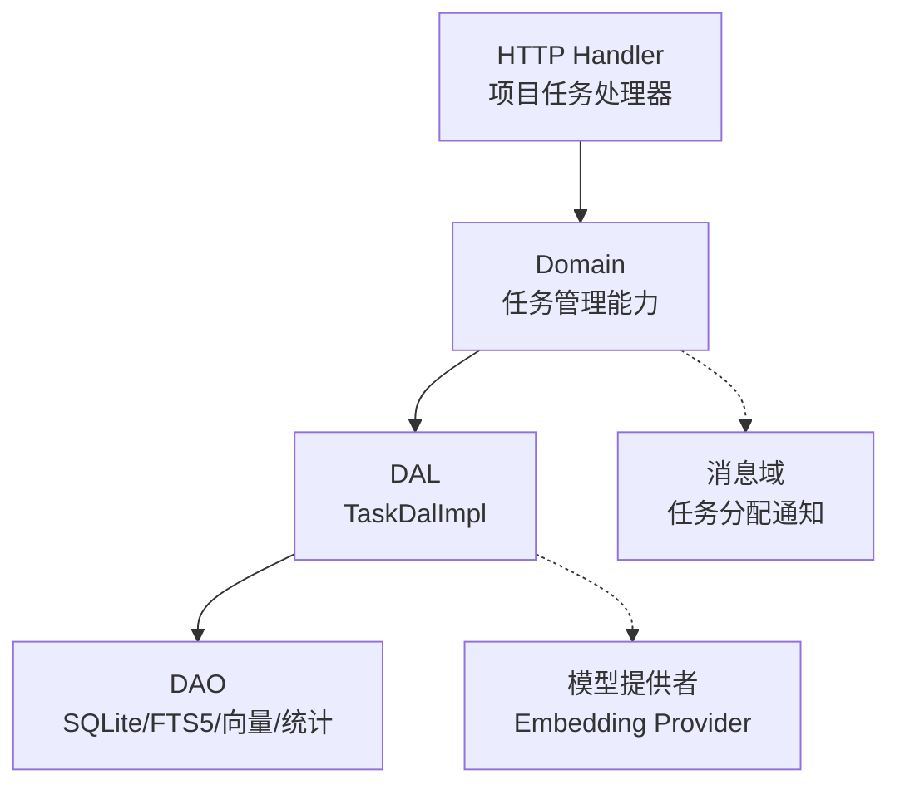
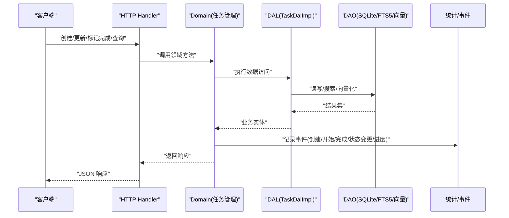
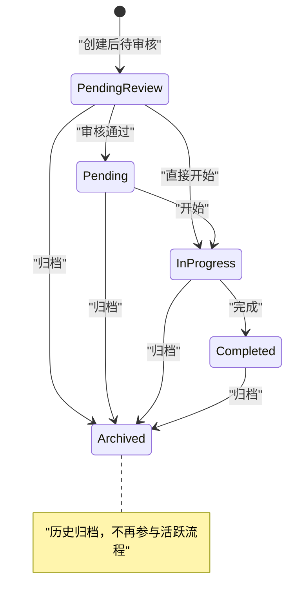
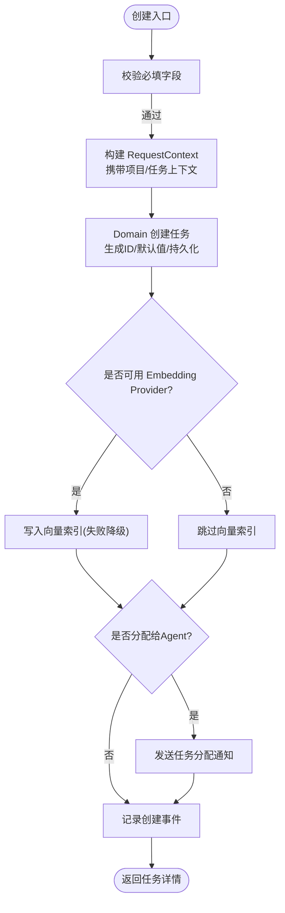
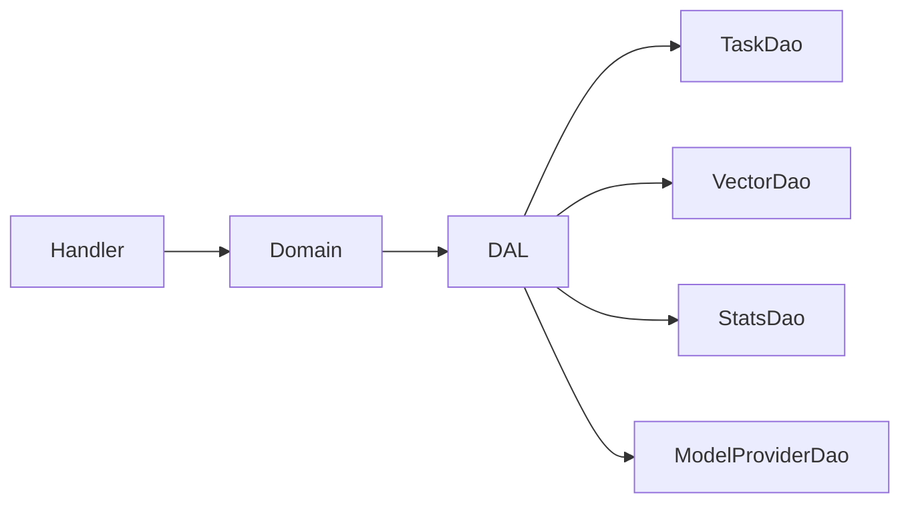

# 任务生命周期管理

<cite>
**本文引用的文件**
- [common/src/enums/task.rs](common/src/enums/task.rs)
- [common/src/api/task.rs](common/src/api/task.rs)
- [src/models/task.rs](src/models/task.rs)
- [src/service/domain/project/task.rs](src/service/domain/project/task.rs)
- [src/service/dal/task.rs](src/service/dal/task.rs)
- [src/handlers/project/task/create_task.rs](src/handlers/project/task/create_task.rs)
- [src/handlers/project/task/update_task_status.rs](src/handlers/project/task/update_task_status.rs)
- [src/handlers/project/task/list_tasks.rs](src/handlers/project/task/list_tasks.rs)
</cite>

## 目录
1. [简介](#简介)
2. [项目结构](#项目结构)
3. [核心组件](#核心组件)
4. [架构总览](#架构总览)
5. [详细组件分析](#详细组件分析)
6. [依赖关系分析](#依赖关系分析)
7. [性能与并发](#性能与并发)
8. [故障排查指南](#故障排查指南)
9. [结论](#结论)
10. [附录：API 示例](#附录api-示例)

## 简介
本文件围绕“任务”这一核心业务实体，系统化说明其完整生命周期、状态机约束、创建/更新/完成等关键流程，以及查询过滤能力。文档严格遵循四层单向调用规范（Adapter → Domain → DAL → DAO），所有跨层传递统一通过 RequestContext，PO 仅在 DAO/DAL 内部使用，Domain 对外暴露业务实体与事件。

## 项目结构
任务相关代码按职责分层组织：
- Adapter（HTTP Handler）：负责参数校验、上下文构建、调用 Domain。
- Domain（领域服务）：封装任务创建、查询、状态流转、进度更新等业务规则，并记录事件。
- DAL（数据访问抽象）：聚合 DAO 与向量/统计等扩展能力，提供统一的 TaskDal 接口。
- DAO（持久化实现）：SQLite 读写、FTS5 关键词搜索、向量索引维护、统计查询。

图表来源
- [src/handlers/project/task/create_task.rs:1-86](src/handlers/project/task/create_task.rs#L1-L86)
- [src/service/domain/project/task.rs:1-526](src/service/domain/project/task.rs#L1-L526)
- [src/service/dal/task.rs:1-800](src/service/dal/task.rs#L1-L800)

章节来源
- [src/handlers/project/task/create_task.rs:1-86](src/handlers/project/task/create_task.rs#L1-L86)
- [src/service/domain/project/task.rs:1-526](src/service/domain/project/task.rs#L1-L526)
- [src/service/dal/task.rs:1-800](src/service/dal/task.rs#L1-L800)

## 核心组件
- 任务状态枚举：定义 Cancelled/PendingReview/Pending/InProgress/Completed/Archived 六种状态及转换工具方法。
- 任务 DTO：Create/Get/List/Search/Update/Status/Progress 请求与响应契约，供前后端共享。
- 任务模型：TaskPo（持久化对象）与 Task（业务实体），包含启动、完成、取消、进度设置等方法。
- 领域服务：任务创建、查询、列表、搜索、状态流转、进度更新，以及事件记录。
- 数据访问层：混合搜索（FTS5 + 向量）、统计注入、向量索引维护、批量重建等。

章节来源
- [common/src/enums/task.rs:1-100](common/src/enums/task.rs#L1-L100)
- [common/src/api/task.rs:1-299](common/src/api/task.rs#L1-L299)
- [src/models/task.rs:1-343](src/models/task.rs#L1-L343)
- [src/service/domain/project/task.rs:1-526](src/service/domain/project/task.rs#L1-L526)
- [src/service/dal/task.rs:1-800](src/service/dal/task.rs#L1-L800)

## 架构总览
任务生命周期贯穿 Adapter → Domain → DAL → DAO，并在关键节点发布事件用于统计与下游消费。

图表来源
- [src/handlers/project/task/create_task.rs:1-86](src/handlers/project/task/create_task.rs#L1-L86)
- [src/service/domain/project/task.rs:1-526](src/service/domain/project/task.rs#L1-L526)
- [src/service/dal/task.rs:1-800](src/service/dal/task.rs#L1-L800)

## 详细组件分析

### 任务状态机与转换规则
- 状态集合：Cancelled(0)、PendingReview(1)、Pending(2)、InProgress(3)、Completed(4)、Archived(5)。
- 合法转换（由 Domain 的 transition_status 校验）：
  - PendingReview → Pending / InProgress / Archived
  - Pending → InProgress / Archived
  - InProgress → Completed / Archived
  - Completed → Archived
  - 同态转换允许（如 Pending → Pending）
- 特殊约束：
  - 禁止通过通用状态接口将任务置为 Cancelled；取消需走专用取消动作。
  - 进入 InProgress 时若 start_at 为空则自动填充当前时间戳。
  - 进入 Completed 时自动设置 end_at 与 progress=100。
  - 取消通过专用 cancel 路径，同时清理向量索引。

图表来源
- [src/service/domain/project/task.rs:394-482](src/service/domain/project/task.rs#L394-L482)
- [src/service/dal/task.rs:607-658](src/service/dal/task.rs#L607-L658)

章节来源
- [src/service/domain/project/task.rs:394-482](src/service/domain/project/task.rs#L394-L482)
- [src/service/dal/task.rs:607-658](src/service/dal/task.rs#L607-L658)

### 任务创建流程与必填字段
- 必填字段：
  - title：任务标题（非空）。
  - assignee_id：分配对象 ID（非空）。
  - root_user_id：根用户 ID（可选，默认取当前登录用户）。
- 可选配置与默认值：
  - description：描述（可选）。
  - priority：优先级（可选，默认 0）。
  - tags：标签列表（可选，默认空）。
  - assignee_type：分配类型（可选，默认 Agent）。
  - project_id：所属项目（可选）。
  - due_at：截止时间（可选）。
  - dependencies：前置任务 ID 列表（可选，默认空）。
- 创建后行为：
  - 生成唯一 task_id，写入 SQLite，尝试建立向量索引（失败降级不影响主流程）。
  - 若分配给 Agent，发送任务分配通知消息（由消息域处理）。
  - 记录创建事件（含组织、操作者、目标状态等）。

图表来源
- [src/handlers/project/task/create_task.rs:1-86](src/handlers/project/task/create_task.rs#L1-L86)
- [src/service/domain/project/task.rs:21-109](src/service/domain/project/task.rs#L21-L109)
- [src/service/dal/task.rs:223-255](src/service/dal/task.rs#L223-L255)

章节来源
- [src/handlers/project/task/create_task.rs:1-86](src/handlers/project/task/create_task.rs#L1-L86)
- [src/service/domain/project/task.rs:21-109](src/service/domain/project/task.rs#L21-L109)
- [src/service/dal/task.rs:223-255](src/service/dal/task.rs#L223-L255)

### 任务更新与权限控制
- 基本信息更新：支持标题、描述、优先级、标签、截止时间、依赖、执行计划、执行结果等字段的增量更新。
- 权限与上下文：
  - 所有公共方法首参为 ctx: RequestContext，跨层传递使用 ctx.clone()。
  - 更新前会读取任务以 enrich_ctx，确保日志与审计上下文完整。
  - modified_by 始终设置为当前调用者 UID。
- 并发安全：
  - 更新通过 DAL 的 update 原子写库；状态变更在 DAL 中触发 TaskStatusChangedEvent（AOP 异步消费，不阻塞主流程）。
  - 取消操作软删除（status=Cancelled）并清理向量索引，失败降级不影响主流程。

章节来源
- [src/service/domain/project/task.rs:227-279](src/service/domain/project/task.rs#L227-L279)
- [src/service/dal/task.rs:573-658](src/service/dal/task.rs#L573-L658)

### 任务完成与后续处理
- 完成逻辑：
  - 设置 status=Completed，progress=100，end_at=当前时间戳。
  - 记录 completed 事件（含组织、操作者、目标状态等）。
- 后续处理：
  - 状态变更后，DAL 发布 TaskStatusChangedEvent，供订阅方（如前端 SSE、统计系统）消费。
  - 向量索引保持最新（如需可重建）。

章节来源
- [src/service/domain/project/task.rs:317-356](src/service/domain/project/task.rs#L317-L356)
- [src/service/dal/task.rs:607-643](src/service/dal/task.rs#L607-L643)

### 任务进度更新
- 进度范围限制：0-100，超出范围会被截断。
- 更新时自动刷新 updated_at，并记录 progress_updated 事件。

章节来源
- [src/models/task.rs:210-214](src/models/task.rs#L210-L214)
- [src/service/domain/project/task.rs:484-524](src/service/domain/project/task.rs#L484-L524)

### 任务查询与过滤 API
- 全局列表：GET /api/v1/tasks，仅分页，内部排除已取消任务。
- 按项目/Agent 列表：分别支持按 project_id 或 agent_id 筛选，并可附加状态过滤与数量限制。
- 通用查询：POST body 支持 ids、keyword、project_id、assignee_type、assignee_id、status_in、分页。
- 搜索：POST body 支持 keyword（FTS5 + 向量语义混合搜索）、ids、project_id、assignee_type、assignee_id、status_in、分页。
- 获取详情：GET /api/v1/tasks/{id}，支持 with_stats、with_model_call_stats、with_artifacts 等选项。

章节来源
- [common/src/api/task.rs:1-299](common/src/api/task.rs#L1-L299)
- [src/handlers/project/task/list_tasks.rs:1-38](src/handlers/project/task/list_tasks.rs#L1-L38)
- [src/service/dal/task.rs:353-571](src/service/dal/task.rs#L353-L571)

## 依赖关系分析
- 模块耦合：
  - Handler 仅依赖 Domain 暴露的能力，不直接访问 DAL/DAO。
  - Domain 依赖 DAL 提供的 TaskDal 接口，并通过 RequestContext 传递上下文。
  - DAL 组合多个 DAO（任务、向量、统计、模型提供者），对上层屏蔽细节。
- 外部依赖：
  - SQLite（sqlx）用于持久化。
  - FTS5 用于关键词检索。
  - LanceDB/HNSW/InMemory/SqliteVss 作为向量后端，默认 LanceDB。
  - AOP 事件队列用于异步消费状态变更与统计。

图表来源
- [src/service/dal/task.rs:1-800](src/service/dal/task.rs#L1-L800)

章节来源
- [src/service/dal/task.rs:1-800](src/service/dal/task.rs#L1-L800)

## 性能与并发
- 混合搜索优化：
  - 关键词存在时优先 FTS5；向量存在时进行相似度检索并按距离阈值过滤；两者合并去重排序。
  - 结果集上限与分页控制，避免大结果集拖慢响应。
- 向量索引：
  - 创建/更新时异步降级策略：向量化失败仅告警，不影响主流程。
  - 取消时清理向量索引，失败降级。
  - 支持重建全量向量索引，且当 model_provider_id 未变化时跳过重建。
- 统计与事件：
  - 状态变更事件通过 AOP 异步发布，不阻塞主事务。
  - 统计查询按需加载，减少不必要的数据传输。

章节来源
- [src/service/dal/task.rs:366-571](src/service/dal/task.rs#L366-L571)
- [src/service/dal/task.rs:723-800](src/service/dal/task.rs#L723-L800)

## 故障排查指南
- 无法创建任务：
  - 检查 title 与 assignee_id 是否为空。
  - 确认 RequestContext 中 uid 有效。
- 状态流转失败：
  - 检查当前状态到目标状态的合法性（参考状态机）。
  - 注意 Cancelled 不能通过通用状态接口设置。
- 搜索结果为空：
  - 确认关键词是否存在于 FTS5 索引。
  - 检查向量搜索是否可用（Embedding Provider 是否配置）。
- 向量索引异常：
  - 查看告警日志中的 vector_index 错误信息。
  - 必要时执行重建向量索引。

章节来源
- [src/handlers/project/task/create_task.rs:21-86](src/handlers/project/task/create_task.rs#L21-L86)
- [src/service/domain/project/task.rs:394-482](src/service/domain/project/task.rs#L394-L482)
- [src/service/dal/task.rs:223-255](src/service/dal/task.rs#L223-L255)

## 结论
任务生命周期通过清晰的状态机与分层架构实现：Handler 负责入参与上下文，Domain 承载业务规则与事件，DAL 整合多源数据访问，DAO 专注持久化与索引。该设计保证了可扩展性、可观测性与高可用性，同时通过降级策略保障核心流程稳定。

## 附录：API 示例
以下为常用任务查询与操作的请求示例（基于 common/src/api/task.rs 定义的 DTO）：

- 创建任务
  - 方法：POST
  - 路径：/api/v1/tasks
  - 请求体关键字段：title、assignee_id、root_user_id（可选）、assignee_type（可选，默认 Agent）、project_id（可选）、due_at（可选）、dependencies（可选）、priority（可选）、tags（可选）、description（可选）
  - 响应：任务详情

- 更新任务状态
  - 方法：PUT
  - 路径：/api/v1/tasks/{id}/status
  - 请求体关键字段：status（必须，受状态机约束）
  - 响应：任务详情

- 更新任务进度
  - 方法：PUT
  - 路径：/api/v1/tasks/{id}/progress
  - 请求体关键字段：progress（0-100）
  - 响应：任务详情

- 全局任务列表
  - 方法：GET
  - 路径：/api/v1/tasks
  - 查询参数：pagination（limit、offset）
  - 说明：内部排除已取消任务

- 按项目/Agent 列表
  - 方法：GET
  - 路径：/api/v1/projects/{project_id}/tasks 或 /api/v1/agents/{agent_id}/tasks
  - 查询参数：status（可选）、limit（可选）

- 通用查询
  - 方法：POST
  - 路径：/api/v1/tasks/query
  - 请求体关键字段：ids（可选）、keyword（可选）、project_id（可选）、assignee_type（可选）、assignee_id（可选）、status_in（可选）、pagination（必选）

- 搜索任务
  - 方法：POST
  - 路径：/api/v1/tasks/search
  - 请求体关键字段：keyword（可选，FTS5+向量混合）、ids（可选）、project_id（可选）、assignee_type（可选）、assignee_id（可选）、status_in（可选）、pagination（必选）

- 获取任务详情
  - 方法：GET
  - 路径：/api/v1/tasks/{id}
  - 查询参数：with_stats（可选）、with_model_call_stats（可选）、stats_time_start（可选）、stats_time_end（可选）、stats_interval（可选）、with_artifacts（可选）

章节来源
- [common/src/api/task.rs:1-299](common/src/api/task.rs#L1-L299)
- [src/handlers/project/task/list_tasks.rs:1-38](src/handlers/project/task/list_tasks.rs#L1-L38)