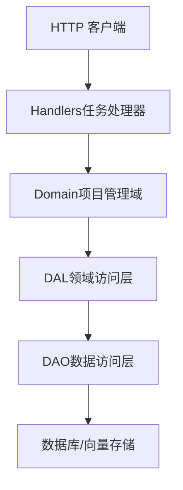
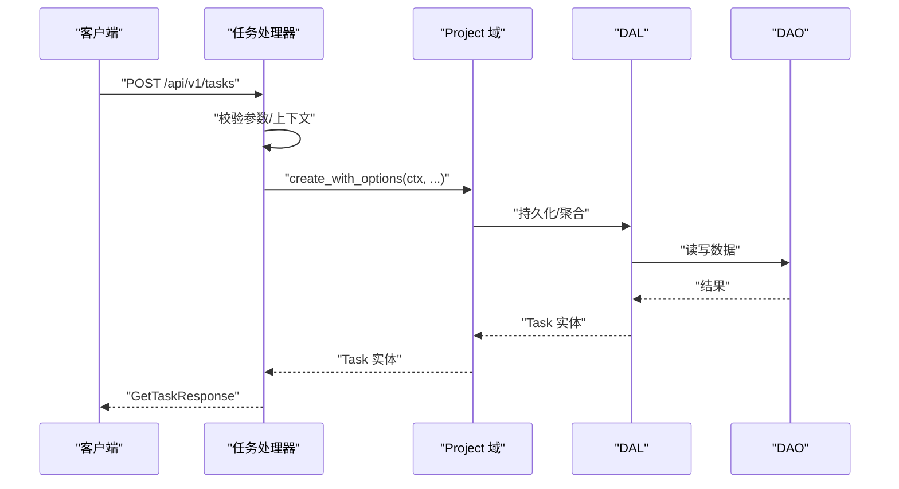
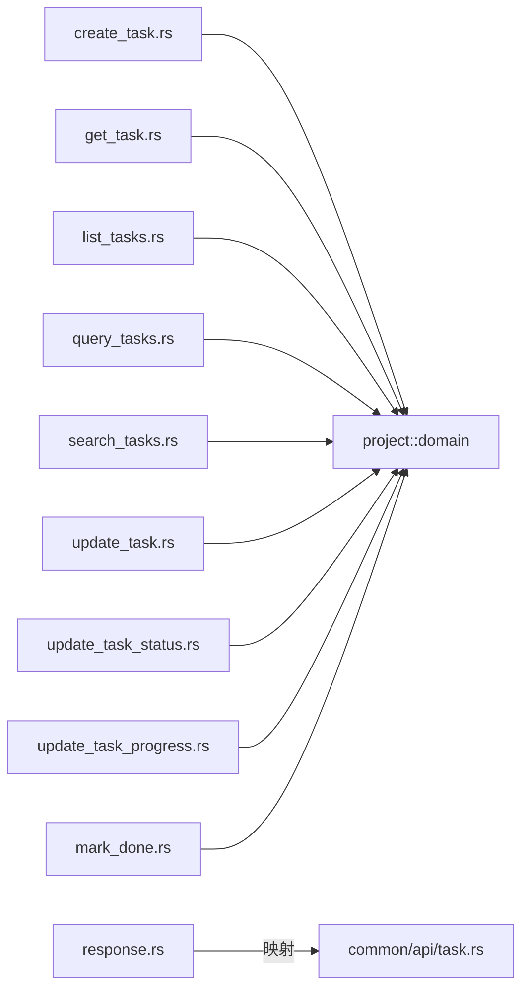

# 任务管理 API 参考

<cite>
**本文引用的文件**
- [common/src/api/task.rs](common/src/api/task.rs)
- [src/handlers/project/task/mod.rs](src/handlers/project/task/mod.rs)
- [src/handlers/project/task/create_task.rs](src/handlers/project/task/create_task.rs)
- [src/handlers/project/task/get_task.rs](src/handlers/project/task/get_task.rs)
- [src/handlers/project/task/list_tasks.rs](src/handlers/project/task/list_tasks.rs)
- [src/handlers/project/task/query_tasks.rs](src/handlers/project/task/query_tasks.rs)
- [src/handlers/project/task/search_tasks.rs](src/handlers/project/task/search_tasks.rs)
- [src/handlers/project/task/update_task.rs](src/handlers/project/task/update_task.rs)
- [src/handlers/project/task/update_task_status.rs](src/handlers/project/task/update_task_status.rs)
- [src/handlers/project/task/update_task_progress.rs](src/handlers/project/task/update_task_progress.rs)
- [src/handlers/project/task/mark_done.rs](src/handlers/project/task/mark_done.rs)
- [src/handlers/project/task/list_agent_tasks.rs](src/handlers/project/task/list_agent_tasks.rs)
- [src/handlers/project/task/list_project_tasks.rs](src/handlers/project/task/list_project_tasks.rs)
- [src/handlers/project/task/response.rs](src/handlers/project/task/response.rs)
</cite>

## 目录
1. [简介](#简介)
2. [项目结构](#项目结构)
3. [核心组件](#核心组件)
4. [架构总览](#架构总览)
5. [详细端点说明](#详细端点说明)
6. [依赖关系分析](#依赖关系分析)
7. [性能与最佳实践](#性能与最佳实践)
8. [故障排查指南](#故障排查指南)
9. [结论](#结论)
10. [附录：数据模型与查询语法](#附录：数据模型与查询语法)

## 简介
本参考文档面向任务管理相关的 RESTful API，覆盖任务的创建、查询、更新、状态流转、进度更新、搜索与列表能力。文档包含每个接口的 HTTP 方法、URL、请求参数、响应格式、认证与权限要求、输入校验规则、错误码处理、分页/排序/过滤/搜索语法说明，以及批量操作建议与性能优化策略。

## 项目结构
任务相关接口位于 handlers 层，按方法粒度拆分；DTO 定义在 common/api；响应转换集中在 response 模块。调用方向严格遵循 Adapter → Domain → DAL → DAO 的单向调用规范。

图表来源
- [src/handlers/project/task/mod.rs:1-28](src/handlers/project/task/mod.rs#L1-L28)
- [src/handlers/project/task/create_task.rs:1-86](src/handlers/project/task/create_task.rs#L1-L86)

章节来源
- [src/handlers/project/task/mod.rs:1-28](src/handlers/project/task/mod.rs#L1-L28)

## 核心组件
- DTO 与枚举：任务请求/响应、分页、状态、分配对象类型等定义于 common/api/task.rs。
- 处理器：每个任务操作一个独立 handler，负责参数解析、鉴权上下文、调用 Domain 并返回响应。
- 响应转换：response.rs 将内部 Task 实体映射为对外 DTO。

章节来源
- [common/src/api/task.rs:1-299](common/src/api/task.rs#L1-L299)
- [src/handlers/project/task/response.rs:1-60](src/handlers/project/task/response.rs#L1-L60)

## 架构总览
任务 API 采用四层单向调用：Adapter（HTTP Handler）→ Domain（project::domain）→ DAL → DAO。所有公共方法首参为 RequestContext，跨层使用 ctx.clone()。

图表来源
- [src/handlers/project/task/create_task.rs:1-86](src/handlers/project/task/create_task.rs#L1-L86)
- [src/handlers/project/task/get_task.rs:1-47](src/handlers/project/task/get_task.rs#L1-L47)

## 详细端点说明

### 通用说明
- 基础路径：/api/v1
- 认证：需要有效的用户上下文（ctx.uid()），未登录或上下文缺失会返回无效请求错误。
- 权限：由 RequestContext 与 Domain 共同控制，部分写操作需具备对应资源权限（如项目维度）。
- 输入验证：处理器层对必填字段进行非空校验；状态流转由 Domain 校验。
- 分页：统一使用 PaginationParams（limit、offset）。
- 错误：常见错误包括 InvalidRequest、NotFound 等，具体以错误模块为准。

### 创建任务
- 方法：POST
- 路径：/api/v1/tasks
- 请求体：CreateTaskRequest
- 响应：GetTaskResponse
- 认证与权限：需要登录用户上下文；若 assignee_type=Agent，会触发任务分配通知。
- 输入校验：title 不能为空；assignee_id 不能为空；root_user_id 为空时使用当前用户。
- 典型成功响应：包含任务 ID、标题、描述、状态、优先级、标签、截止时间、依赖、根用户、分配对象、项目、思考深度、进度、创建/修改者、时间戳等。
- 常见错误：InvalidRequest（缺少上下文或必填字段）、业务校验失败。

章节来源
- [src/handlers/project/task/create_task.rs:1-86](src/handlers/project/task/create_task.rs#L1-L86)
- [common/src/api/task.rs:10-36](common/src/api/task.rs#L10-L36)

### 获取任务详情
- 方法：GET
- 路径：/api/v1/tasks/{id}
- 查询参数：with_stats、with_model_call_stats、stats_time_start、stats_time_end、stats_interval、with_artifacts
- 响应：GetTaskResponse
- 认证与权限：需要登录用户上下文；需具备读取该任务的权限。
- 高级功能：可按需加载统计信息、模型调用统计、产物列表；支持按小时/天粒度统计。
- 常见错误：NotFound（任务不存在）。

章节来源
- [src/handlers/project/task/get_task.rs:1-47](src/handlers/project/task/get_task.rs#L1-L47)
- [common/src/api/task.rs:38-62](common/src/api/task.rs#L38-L62)

### 全局任务列表（轻量）
- 方法：GET
- 路径：/api/v1/tasks
- 查询参数：pagination（limit、offset）
- 响应：PagedResult<TaskListItem>
- 行为：排除已删除任务；默认按 priority DESC、created_at DESC 排序。
- 适用场景：简单列表展示。

章节来源
- [src/handlers/project/task/list_tasks.rs:1-38](src/handlers/project/task/list_tasks.rs#L1-L38)
- [common/src/api/task.rs:92-99](common/src/api/task.rs#L92-L99)

### 通用任务查询（复杂条件）
- 方法：POST
- 路径：/api/v1/tasks/query
- 请求体：TaskQueryRequest（ids、keyword、project_id、assignee_type、assignee_id、status_in、pagination）
- 响应：PagedResult<TaskListItem>
- 适用场景：组合过滤、关键词检索、多条件筛选。

章节来源
- [src/handlers/project/task/query_tasks.rs:1-45](src/handlers/project/task/query_tasks.rs#L1-L45)
- [common/src/api/task.rs:254-272](common/src/api/task.rs#L254-L272)

### 任务搜索（语义+FTS5）
- 方法：POST
- 路径：/api/v1/tasks/search
- 请求体：SearchTasksRequest（keyword、ids、project_id、assignee_type、assignee_id、status_in、pagination）
- 响应：PagedResult<TaskListItem>
- 特性：FTS5 + 向量语义混合搜索，适合自然语言关键词检索。

章节来源
- [src/handlers/project/task/search_tasks.rs:1-45](src/handlers/project/task/search_tasks.rs#L1-L45)
- [common/src/api/task.rs:274-295](common/src/api/task.rs#L274-L295)

### 按 Agent 列出任务
- 方法：GET
- 路径：/api/v1/agents/{agent_id}/tasks
- 查询参数：status、limit
- 响应：Vec<TaskListItem>
- 用途：查看某 Agent 被分配的任务集合。

章节来源
- [src/handlers/project/task/list_agent_tasks.rs:1-39](src/handlers/project/task/list_agent_tasks.rs#L1-L39)
- [common/src/api/task.rs:64-76](common/src/api/task.rs#L64-L76)

### 按项目列出任务
- 方法：GET
- 路径：/api/v1/projects/{project_id}/tasks
- 查询参数：status、limit
- 响应：Vec<TaskListItem>
- 用途：查看某项目下的任务集合。

章节来源
- [src/handlers/project/task/list_project_tasks.rs:1-38](src/handlers/project/task/list_project_tasks.rs#L1-L38)
- [common/src/api/task.rs:78-90](common/src/api/task.rs#L78-L90)

### 更新任务基本信息
- 方法：PUT
- 路径：/api/v1/tasks/{id}
- 请求体：UpdateTaskRequest（title、description、priority、tags、due_at、dependencies、execution_plan、execution_result）
- 响应：GetTaskResponse
- 用途：编辑任务元数据与执行计划/结果。

章节来源
- [src/handlers/project/task/update_task.rs:1-41](src/handlers/project/task/update_task.rs#L1-L41)
- [common/src/api/task.rs:190-217](common/src/api/task.rs#L190-L217)

### 更新任务状态（状态机）
- 方法：PUT
- 路径：/api/v1/tasks/{id}/status
- 请求体：UpdateTaskStatusRequest（id、status）
- 响应：GetTaskResponse
- 说明：状态流转合法性由 Project Domain 校验。
- 常见错误：非法状态转移、任务不存在。

章节来源
- [src/handlers/project/task/update_task_status.rs:1-41](src/handlers/project/task/update_task_status.rs#L1-L41)
- [common/src/api/task.rs:219-232](common/src/api/task.rs#L219-L232)

### 更新任务进度
- 方法：PUT
- 路径：/api/v1/tasks/{id}/progress
- 请求体：UpdateTaskProgressRequest（id、progress，范围 0-100）
- 响应：GetTaskResponse

章节来源
- [src/handlers/project/task/update_task_progress.rs:1-30](src/handlers/project/task/update_task_progress.rs#L1-L30)
- [common/src/api/task.rs:234-245](common/src/api/task.rs#L234-L245)

### 标记任务完成
- 方法：POST（根据处理器命名推断）
- 路径：/api/v1/tasks/{task_id}/mark-done（示例路径，实际以路由注册为准）
- 请求体：MarkDoneParams（task_id）
- 响应：MarkDoneResponse（task_id、status）
- 说明：将任务状态转换为 Completed；若非可完成状态则失败。

章节来源
- [src/handlers/project/task/mark_done.rs:1-40](src/handlers/project/task/mark_done.rs#L1-L40)

## 依赖关系分析
- Handler 依赖 common/api 中的 DTO 与 enums。
- Handler 通过 project::domain().task_manage() 调用领域服务。
- 响应转换集中在 response.rs，保证对外数据结构稳定。

图表来源
- [src/handlers/project/task/create_task.rs:1-86](src/handlers/project/task/create_task.rs#L1-L86)
- [src/handlers/project/task/get_task.rs:1-47](src/handlers/project/task/get_task.rs#L1-L47)
- [src/handlers/project/task/list_tasks.rs:1-38](src/handlers/project/task/list_tasks.rs#L1-L38)
- [src/handlers/project/task/query_tasks.rs:1-45](src/handlers/project/task/query_tasks.rs#L1-L45)
- [src/handlers/project/task/search_tasks.rs:1-45](src/handlers/project/task/search_tasks.rs#L1-L45)
- [src/handlers/project/task/update_task.rs:1-41](src/handlers/project/task/update_task.rs#L1-L41)
- [src/handlers/project/task/update_task_status.rs:1-41](src/handlers/project/task/update_task_status.rs#L1-L41)
- [src/handlers/project/task/update_task_progress.rs:1-30](src/handlers/project/task/update_task_progress.rs#L1-L30)
- [src/handlers/project/task/mark_done.rs:1-40](src/handlers/project/task/mark_done.rs#L1-L40)
- [src/handlers/project/task/response.rs:1-60](src/handlers/project/task/response.rs#L1-L60)
- [common/src/api/task.rs:1-299](common/src/api/task.rs#L1-L299)

## 性能与最佳实践
- 分页与限制
  - 列表与查询接口均支持 pagination（limit、offset）。合理设置 limit，避免一次性拉取过多数据。
  - 对于“按 Agent/项目”列表，可使用 limit 限制返回条数。
- 排序
  - 全局列表默认按 priority DESC、created_at DESC；如需自定义排序，建议使用 query/search 并在后端扩展排序字段。
- 过滤与搜索
  - 简单过滤：使用 query 接口（ids、project_id、assignee_type、assignee_id、status_in）。
  - 关键词检索：优先使用 search 接口，结合 FTS5 + 向量语义提升相关性。
- 按需加载
  - 获取详情时通过 with_stats、with_model_call_stats、with_artifacts 控制是否加载额外数据，减少不必要开销。
- 缓存策略
  - 列表与搜索结果可基于“项目/负责人/状态”等维度做短期缓存；注意失效策略（状态变更、进度更新后清除）。
- 限流机制
  - 对高频写入接口（更新状态/进度）与搜索接口实施限流，防止滥用。
- 批量操作建议
  - 当前仓库未提供专用批量更新/删除端点。可通过多次调用单个更新接口实现；或在 Domain/DAL 层封装批量事务以提升一致性。
- 并发与幂等
  - 状态更新应保证幂等；前端重试时需确保重复请求不产生副作用。

[本节为通用指导，不直接分析具体文件]

## 故障排查指南
- 无效请求（InvalidRequest）
  - 可能原因：缺少用户上下文、必填字段为空（如 title、assignee_id）。
  - 处理：检查认证头与请求体字段完整性。
- 未找到（NotFound）
  - 可能原因：任务 ID 不存在。
  - 处理：确认 ID 正确性，或先查询是否存在。
- 状态流转失败
  - 可能原因：目标状态不符合状态机约束。
  - 处理：查看当前状态与目标状态，调整至合法转移。
- 搜索无结果
  - 可能原因：关键词不匹配或索引未构建。
  - 处理：尝试简化关键词或使用 query 接口进行精确过滤。

章节来源
- [src/handlers/project/task/create_task.rs:21-35](src/handlers/project/task/create_task.rs#L21-L35)
- [src/handlers/project/task/get_task.rs:39-46](src/handlers/project/task/get_task.rs#L39-L46)
- [src/handlers/project/task/update_task_status.rs:25-39](src/handlers/project/task/update_task_status.rs#L25-L39)
- [src/handlers/project/task/mark_done.rs:18-39](src/handlers/project/task/mark_done.rs#L18-L39)

## 结论
任务管理 API 提供了完整的 CRUD、状态流转、进度更新与搜索能力，并通过分页、过滤与语义搜索满足多样化查询需求。遵循认证与权限控制、输入校验与状态机约束，可获得稳定可靠的交互体验。在生产环境中建议结合缓存、限流与批量操作优化性能与稳定性。

## 附录：数据模型与查询语法

### 关键请求/响应模型
- CreateTaskRequest：创建任务所需字段（标题、描述、优先级、标签、根用户、分配对象、项目、截止时间、依赖）。
- GetTaskResponse：任务详情（含可选统计与产物）。
- UpdateTaskRequest：更新任务基本信息与执行计划/结果。
- UpdateTaskStatusRequest：状态更新（受状态机约束）。
- UpdateTaskProgressRequest：进度更新（0-100）。
- TaskQueryRequest：通用查询（ids、keyword、project_id、assignee_type、assignee_id、status_in、pagination）。
- SearchTasksRequest：搜索（keyword、ids、project_id、assignee_type、assignee_id、status_in、pagination）。
- ListTasksRequest：轻量列表（仅分页）。

章节来源
- [common/src/api/task.rs:10-299](common/src/api/task.rs#L10-L299)

### 分页与排序
- 分页：limit、offset 用于控制返回数量与偏移。
- 排序：全局列表默认 priority DESC、created_at DESC；其他场景可在 Domain/DAL 扩展排序。

章节来源
- [src/handlers/project/task/list_tasks.rs:20-37](src/handlers/project/task/list_tasks.rs#L20-L37)
- [common/src/api/task.rs:92-99](common/src/api/task.rs#L92-L99)

### 过滤与搜索语法
- 过滤：ids、project_id、assignee_type、assignee_id、status_in（OR 语义）。
- 搜索：keyword 支持 FTS5 + 向量语义混合检索，适合自然语言查询。

章节来源
- [src/handlers/project/task/query_tasks.rs:23-44](src/handlers/project/task/query_tasks.rs#L23-L44)
- [src/handlers/project/task/search_tasks.rs:23-44](src/handlers/project/task/search_tasks.rs#L23-L44)
- [common/src/api/task.rs:254-295](common/src/api/task.rs#L254-L295)

### 状态流转与完成
- 状态更新通过 update_task_status 接口，合法性由 Domain 校验。
- 标记完成接口将任务转为 Completed，非可完成状态会失败。

章节来源
- [src/handlers/project/task/update_task_status.rs:21-40](src/handlers/project/task/update_task_status.rs#L21-L40)
- [src/handlers/project/task/mark_done.rs:18-39](src/handlers/project/task/mark_done.rs#L18-L39)