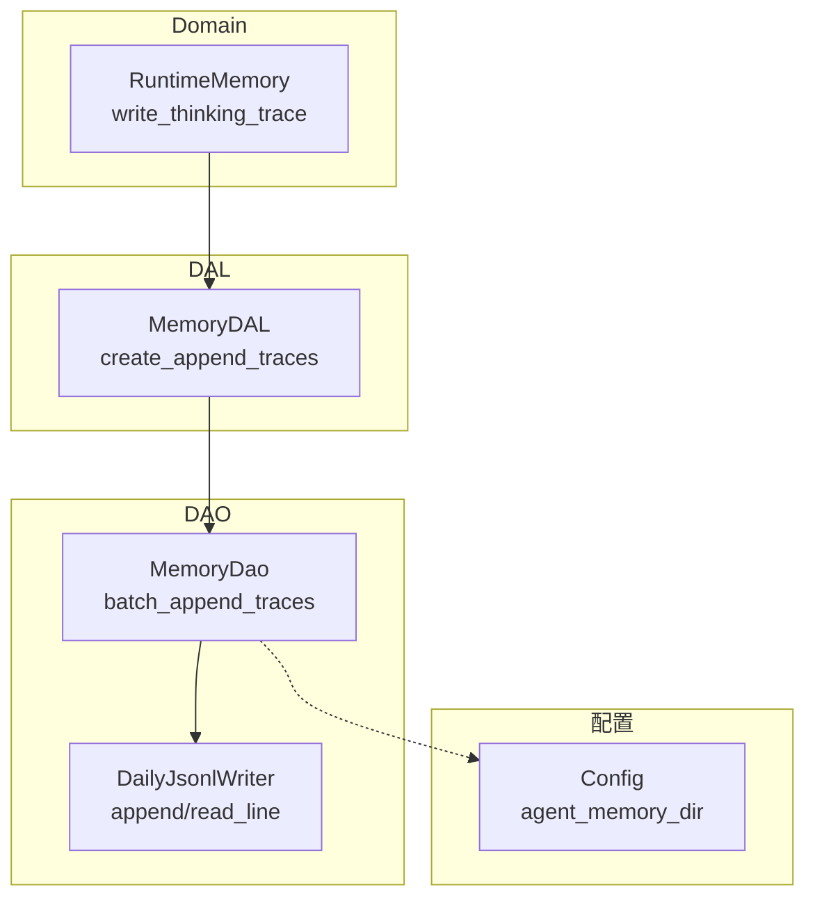
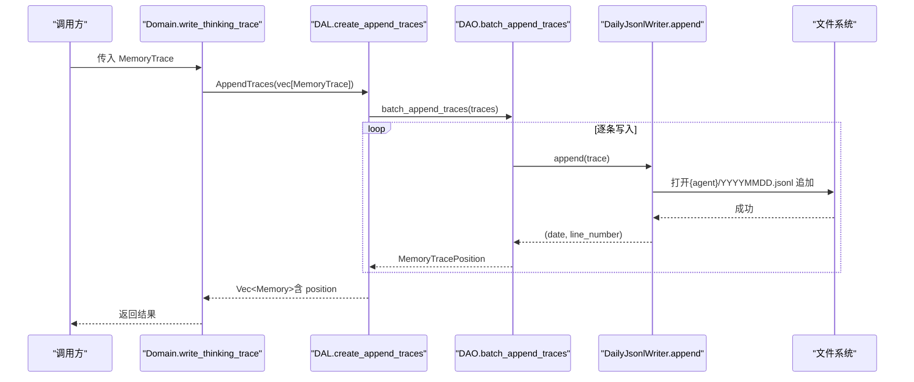
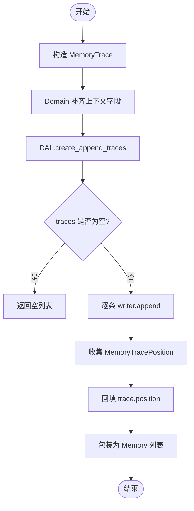
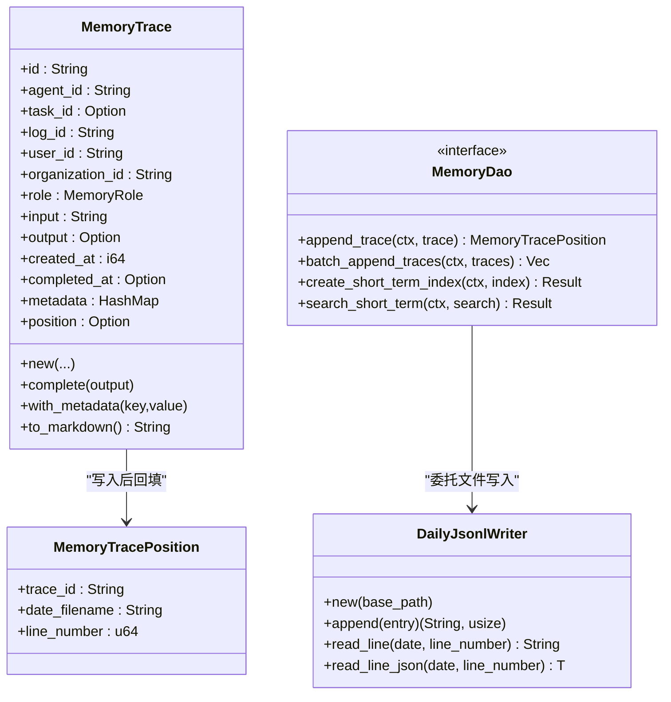

# 原始记忆追踪

<cite>
**本文引用的文件**
- [memory.rs](src/models/memory.rs)
- [daily_jsonl.rs](src/pkg/daily_jsonl.rs)
- [memory_dao_mod.rs](src/service/dao/memory/mod.rs)
- [memory_dao_sqlite.rs](src/service/dao/memory/sqlite.rs)
- [runtime_memory.rs](src/service/domain/runtime/memory.rs)
- [dal_memory.rs](src/service/dal/memory.rs)
- [config.rs](common/src/config.rs)
- [sqlite_test.rs](src/service/dao/memory/sqlite_test.rs)
</cite>

## 目录
1. [简介](#简介)
2. [项目结构](#项目结构)
3. [核心组件](#核心组件)
4. [架构总览](#架构总览)
5. [详细组件分析](#详细组件分析)
6. [依赖关系分析](#依赖关系分析)
7. [性能考量](#性能考量)
8. [故障排查指南](#故障排查指南)
9. [结论](#结论)
10. [附录：示例与最佳实践](#附录示例与最佳实践)

## 简介
本技术文档聚焦“原始记忆追踪”机制，围绕 MemoryTrace 数据结构、JSONL 文件存储格式、trace_id 生成规则、元数据管理、写入流程（append_traces）、位置记录（MemoryTracePosition）以及后续索引关联与溯源查询进行系统化说明。同时给出创建、查询与格式化使用路径，并讨论 JSONL 滚动策略、压缩机制与备份方案。

## 项目结构
原始记忆追踪贯穿四层单向调用：Adapter → Domain → DAL → DAO。其中：
- Domain 层负责业务编排与上下文补全；
- DAL 层协调 DAO 的批量写入与后续索引构建；
- DAO 层实现 JSONL 追加与 SQLite 索引操作；
- pkg 层提供通用的每日 JSONL 写入器。

图表来源
- [runtime_memory.rs:35-67](src/service/domain/runtime/memory.rs#L35-L67)
- [dal_memory.rs:1355-1379](src/service/dal/memory.rs#L1355-L1379)
- [memory_dao_mod.rs:66-100](src/service/dao/memory/mod.rs#L66-L100)
- [daily_jsonl.rs:14-73](src/pkg/daily_jsonl.rs#L14-L73)
- [config.rs:321-329](common/src/config.rs#L321-L329)

章节来源
- [runtime_memory.rs:35-67](src/service/domain/runtime/memory.rs#L35-L67)
- [dal_memory.rs:1355-1379](src/service/dal/memory.rs#L1355-L1379)
- [memory_dao_mod.rs:66-100](src/service/dao/memory/mod.rs#L66-L100)
- [daily_jsonl.rs:14-73](src/pkg/daily_jsonl.rs#L14-L73)
- [config.rs:321-329](common/src/config.rs#L321-L329)

## 核心组件
- MemoryTrace：原始记忆条目，包含完整思考闭环信息（输入、输出、时间戳、角色、元数据等），用于不可变持久化到 JSONL。
- MemoryTracePosition：记录 trace 在每日 JSONL 中的物理位置（日期文件名 + 行号），用于后续索引与溯源。
- DailyJsonlWriter：通用每日 JSONL 写入器，按日期分区落盘，支持 append 与 read_line。
- MemoryDao 接口：定义 append_trace/batch_append_traces 等能力，SQLite 实现委托 DailyJsonlWriter 完成文件写入。
- DAL 层 create_append_traces：批量写入 trace 到 JSONL，回填 position，再包装为 Memory 返回。
- Domain 层 write_thinking_trace：统一补充上下文字段后调用 DAL 写入。

章节来源
- [memory.rs:15-67](src/models/memory.rs#L15-L67)
- [memory.rs:69-156](src/models/memory.rs#L69-L156)
- [daily_jsonl.rs:14-109](src/pkg/daily_jsonl.rs#L14-L109)
- [memory_dao_mod.rs:66-100](src/service/dao/memory/mod.rs#L66-L100)
- [memory_dao_sqlite.rs:126-163](src/service/dao/memory/sqlite.rs#L126-L163)
- [dal_memory.rs:1355-1379](src/service/dal/memory.rs#L1355-L1379)
- [runtime_memory.rs:35-67](src/service/domain/runtime/memory.rs#L35-L67)

## 架构总览
原始记忆写入采用“先写文件、再建索引”的两阶段设计：
- 阶段一：将 MemoryTrace 以 JSONL 形式追加到 agent 专属目录下的当日文件 YYYYMMDD.jsonl，并返回 MemoryTracePosition。
- 阶段二：基于 position 构造短期记忆索引或知识引用，建立可检索与可溯源的关联。

图表来源
- [runtime_memory.rs:35-67](src/service/domain/runtime/memory.rs#L35-L67)
- [dal_memory.rs:1355-1379](src/service/dal/memory.rs#L1355-L1379)
- [memory_dao_sqlite.rs:143-163](src/service/dao/memory/sqlite.rs#L143-L163)
- [daily_jsonl.rs:54-73](src/pkg/daily_jsonl.rs#L54-L73)

## 详细组件分析

### MemoryTrace 数据结构与 trace_id 生成
- 字段要点：
  - id：唯一标识，由 new() 自动生成，格式为 trace-{agent_id}-{timestamp_nanos}-{random_suffix}，避免并发碰撞。
  - agent_id/task_id/log_id/user_id/organization_id：归属与溯源信息。
  - role：System/User/Assistant/Summary。
  - input/output/created_at/completed_at：思考闭环内容与时序。
  - metadata：可扩展键值对。
  - position：DAO 写入后回填，不参与序列化。
- 辅助方法：
  - complete(output)：回填输出与完成时间。
  - with_metadata(key,value)：链式添加元数据。
  - to_markdown()：便于人类阅读与调试。

章节来源
- [memory.rs:15-67](src/models/memory.rs#L15-L67)
- [memory.rs:69-156](src/models/memory.rs#L69-L156)

### MemoryTracePosition 的作用与使用场景
- 作用：记录 trace 在 JSONL 中的精确位置（日期文件名 + 行号），用于：
  - 构造 KnowledgeReferencePo，建立知识节点对原始细节的引用；
  - 后续创建 ShortTermMemoryIndexPo 时关联 trace_ids；
  - 通过 date_path + line_number 直接读取原始内容，实现溯源。
- 使用场景：
  - 短期记忆聚合：将多条 trace 聚合成短期记忆索引，并通过 trace_ids 关联；
  - 知识图谱引用：KnowledgeReferencePo 中保存 date_path 与 line_number，以便回溯原始输入。

章节来源
- [memory.rs:53-67](src/models/memory.rs#L53-L67)
- [memory.rs:287-307](src/models/memory.rs#L287-L307)
- [memory_dao_sqlite.rs:105-123](src/service/dao/memory/sqlite.rs#L105-L123)

### JSONL 文件存储格式与滚动策略
- 存储格式：
  - 每个 MemoryTrace 序列化为单行 JSON，追加到 {base_data_path}/agents/{agent_id}/memory/YYYYMMDD.jsonl。
  - 行号为 0-based，append 返回当前行号，read_line 可按行号读取。
- 滚动策略：
  - 按自然日滚动：每日一个文件，文件名 YYYYMMDD.jsonl；跨日自动切换新文件。
  - 不存在则创建目录与文件；存在则追加。
- 读取方式：
  - read_line(date, line_number) 支持按日期与行号定位读取；
  - read_line_json 可直接反序列化为目标类型。

章节来源
- [daily_jsonl.rs:14-109](src/pkg/daily_jsonl.rs#L14-L109)
- [config.rs:321-329](common/src/config.rs#L321-L329)

### 原始记忆写入流程（append_traces）
- Domain 层：
  - write_thinking_trace 接收外部构造的 MemoryTrace，若缺失 log_id/user_id/organization_id/task_id 则从 RequestContext 补齐，然后调用 DAL。
- DAL 层：
  - create_append_traces 调用 DAO 的 batch_append_traces，顺序写入，并将返回的 positions 回填到 traces 的 position 字段，最后包装为 Memory 返回。
- DAO 层：
  - batch_append_traces 遍历 traces，逐条调用 DailyJsonlWriter::append，收集 MemoryTracePosition 列表返回。
  - 单条写入 append_trace 同理，返回单个 position。

图表来源
- [runtime_memory.rs:35-67](src/service/domain/runtime/memory.rs#L35-L67)
- [dal_memory.rs:1355-1379](src/service/dal/memory.rs#L1355-L1379)
- [memory_dao_sqlite.rs:143-163](src/service/dao/memory/sqlite.rs#L143-L163)
- [daily_jsonl.rs:54-73](src/pkg/daily_jsonl.rs#L54-L73)

章节来源
- [runtime_memory.rs:35-67](src/service/domain/runtime/memory.rs#L35-L67)
- [dal_memory.rs:1355-1379](src/service/dal/memory.rs#L1355-L1379)
- [memory_dao_sqlite.rs:126-163](src/service/dao/memory/sqlite.rs#L126-L163)

### 后续索引关联与溯源查询
- 短期记忆索引：
  - 基于已写入的 trace 集合，构造 ShortTermMemoryIndexPo（含 summary/tags/trace_ids/status 等），调用 create_short_term_index 写入 SQLite。
  - 搜索时使用 FTS5 MATCH + BM25 排序，支持 tags、task_id、agent_id 过滤。
- 知识引用：
  - KnowledgeReferencePo 记录 knowledge_id、short_term_id、trace_id、date_path、line_number，用于从知识节点追溯到原始记忆细节。
- 溯源读取：
  - 通过 KnowledgeReferencePo 的 date_path 与 line_number，使用 DailyJsonlReader 读取对应行，反序列化为 MemoryTrace，获取原始 input 等。

章节来源
- [memory.rs:158-210](src/models/memory.rs#L158-L210)
- [memory.rs:287-307](src/models/memory.rs#L287-L307)
- [memory_dao_sqlite.rs:165-192](src/service/dao/memory/sqlite.rs#L165-L192)
- [memory_dao_sqlite.rs:383-484](src/service/dao/memory/sqlite.rs#L383-L484)
- [memory_dao_sqlite.rs:105-123](src/service/dao/memory/sqlite.rs#L105-L123)

### 创建、查询与格式化示例路径
- 创建：
  - 使用 MemoryTrace::new 构造，随后通过 Domain.write_thinking_trace 或 DAL.create_append_traces 写入。
  - 参考测试用例：sqlite_test.rs 中 test_append_trace_and_create_short_term_index 展示 append 与索引创建流程。
- 查询：
  - 短期记忆：MemorySearch/MemoryQuery 组合关键词、tags、task_id、agent_id 等条件，调用 DAL.search/query。
  - 知识节点：类似查询接口，支持 node_type 与 include_shared。
- 格式化：
  - MemoryTrace::to_markdown 可将单条 trace 转为 Markdown 文本，便于日志查看与调试。

章节来源
- [sqlite_test.rs:15-53](src/service/dao/memory/sqlite_test.rs#L15-L53)
- [memory_dao_mod.rs:162-182](src/service/dao/memory/mod.rs#L162-L182)
- [memory.rs:120-156](src/models/memory.rs#L120-L156)

## 依赖关系分析
- 模块耦合：
  - Domain 仅依赖 DAL 的 create/search/query 接口，不感知 DAO 与文件细节；
  - DAL 组合 MemoryDao 与向量索引相关 DAO，屏蔽底层差异；
  - DAO 依赖 DailyJsonlWriter 与配置，专注 I/O 与 SQL；
  - pkg 层无业务感知，提供通用 JSONL 工具。
- 外部依赖：
  - sqlx（SQLite）用于短期记忆索引与知识图谱；
  - serde/serde_json 用于 JSON 序列化与反序列化；
  - chrono 用于日期与时间处理。

图表来源
- [memory.rs:15-67](src/models/memory.rs#L15-L67)
- [memory.rs:69-156](src/models/memory.rs#L69-L156)
- [daily_jsonl.rs:14-109](src/pkg/daily_jsonl.rs#L14-L109)
- [memory_dao_mod.rs:66-100](src/service/dao/memory/mod.rs#L66-L100)

章节来源
- [memory.rs:15-67](src/models/memory.rs#L15-L67)
- [memory.rs:69-156](src/models/memory.rs#L69-L156)
- [daily_jsonl.rs:14-109](src/pkg/daily_jsonl.rs#L14-L109)
- [memory_dao_mod.rs:66-100](src/service/dao/memory/mod.rs#L66-L100)

## 性能考量
- 写入性能：
  - 每日 JSONL 追加为 O(1) 文件尾追加，适合高吞吐写入；
  - 批量写入减少系统调用次数，提升整体吞吐。
- 读取性能：
  - read_line 按行扫描，适用于精确定位；如需频繁随机访问，建议结合索引（短期记忆索引/知识引用）。
- 存储扩展：
  - 按日分文件天然支持滚动与归档；
  - 可通过外部工具对历史 JSONL 进行压缩与迁移。

## 故障排查指南
- 常见错误：
  - 文件未找到：read_line 当日期文件不存在时返回错误；检查日期字符串与路径是否正确。
  - 行号越界：请求的行号超出文件行数；确认写入时的行号与读取一致。
  - JSON 解析失败：反序列化目标类型与存储不一致；确保 MemoryTrace 的序列化/反序列化兼容。
- 排查步骤：
  - 确认 agent_memory_dir 路径正确（config.agent_memory_dir）；
  - 检查 YYYYMMDD.jsonl 是否存在且可写；
  - 验证 MemoryTracePosition 的 date_filename 与 line_number 是否匹配实际文件；
  - 如为知识引用溯源，核对 KnowledgeReferencePo 的 date_path 与 line_number。

章节来源
- [daily_jsonl.rs:75-103](src/pkg/daily_jsonl.rs#L75-L103)
- [memory_dao_sqlite.rs:105-123](src/service/dao/memory/sqlite.rs#L105-L123)
- [config.rs:321-329](common/src/config.rs#L321-L329)

## 结论
原始记忆追踪通过 MemoryTrace 与 JSONL 实现了不可变、可溯源的记忆持久化；配合 MemoryTracePosition 与短期记忆索引/知识引用，构建了完整的“原始细节—摘要—知识节点”链路。该设计满足高吞吐写入、按日滚动、可检索与可追溯的需求，并为后续向量化与全文检索提供了坚实基础。

## 附录：示例与最佳实践
- 创建示例路径：
  - 构造 MemoryTrace：参考 memory.rs 的 new 方法与 sqlite_test.rs 的测试用例。
  - 写入示例：参考 runtime_memory.rs 的 write_thinking_trace 与 dal_memory.rs 的 create_append_traces。
- 查询示例路径：
  - 短期记忆搜索：参考 memory_dao_mod.rs 的 MemorySearch/MemoryQuery 与 sqlite.rs 的 search_short_term。
  - 知识节点查询：参考 sqlite.rs 的 query_knowledge_nodes/search_knowledge_nodes。
- 格式化示例路径：
  - 使用 MemoryTrace::to_markdown 将单条 trace 转为可读文本。
- 滚动策略：
  - 按日滚动，YYYYMMDD.jsonl；跨日自动切换新文件。
- 压缩机制：
  - 代码层未内置压缩；建议通过外部工具对历史 JSONL 进行压缩归档。
- 备份方案：
  - 建议定期备份 agents/{agent_id}/memory 目录与 SQLite 数据库；
  - 可结合系统级备份任务（如 cron）对 JSONL 与 DB 进行快照与异地容灾。

章节来源
- [sqlite_test.rs:15-53](src/service/dao/memory/sqlite_test.rs#L15-L53)
- [runtime_memory.rs:35-67](src/service/domain/runtime/memory.rs#L35-L67)
- [dal_memory.rs:1355-1379](src/service/dal/memory.rs#L1355-L1379)
- [memory_dao_mod.rs:162-182](src/service/dao/memory/mod.rs#L162-L182)
- [memory.rs:120-156](src/models/memory.rs#L120-L156)