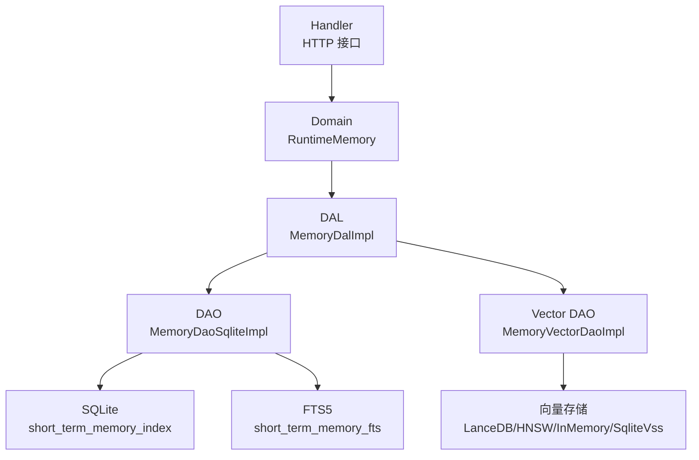
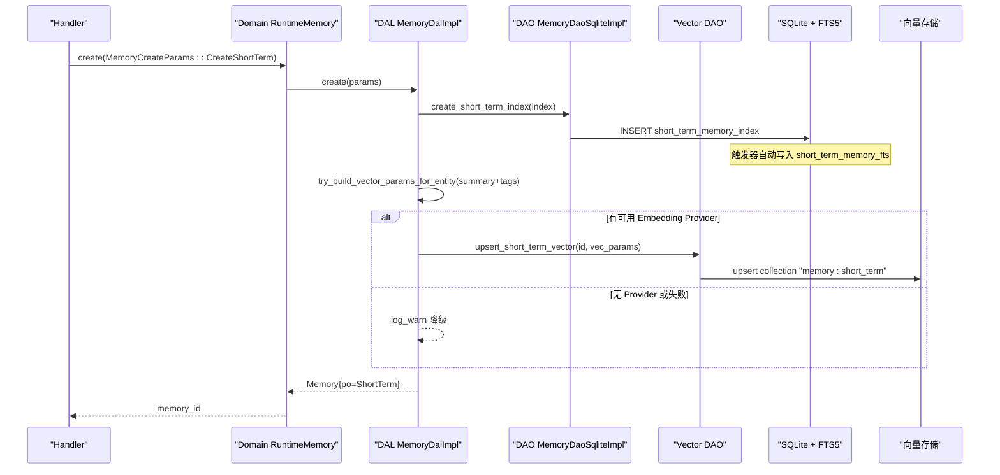
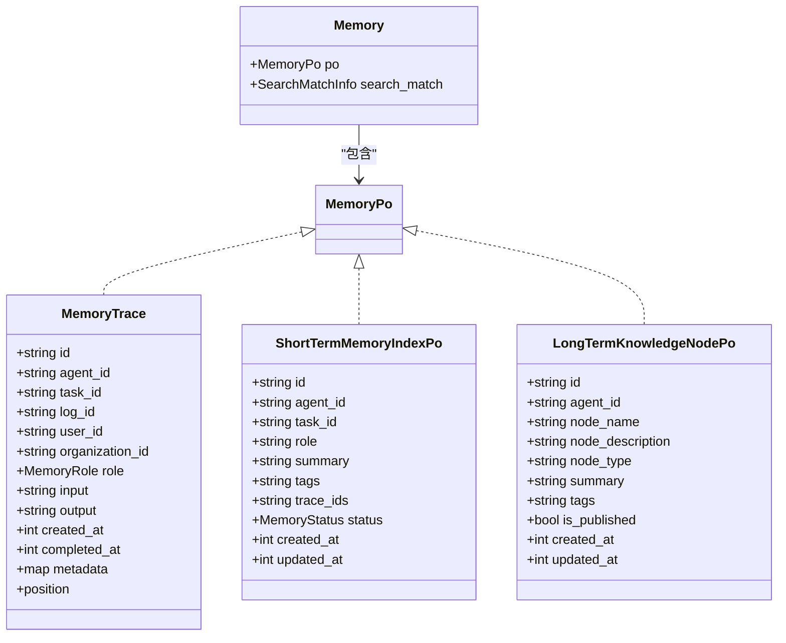
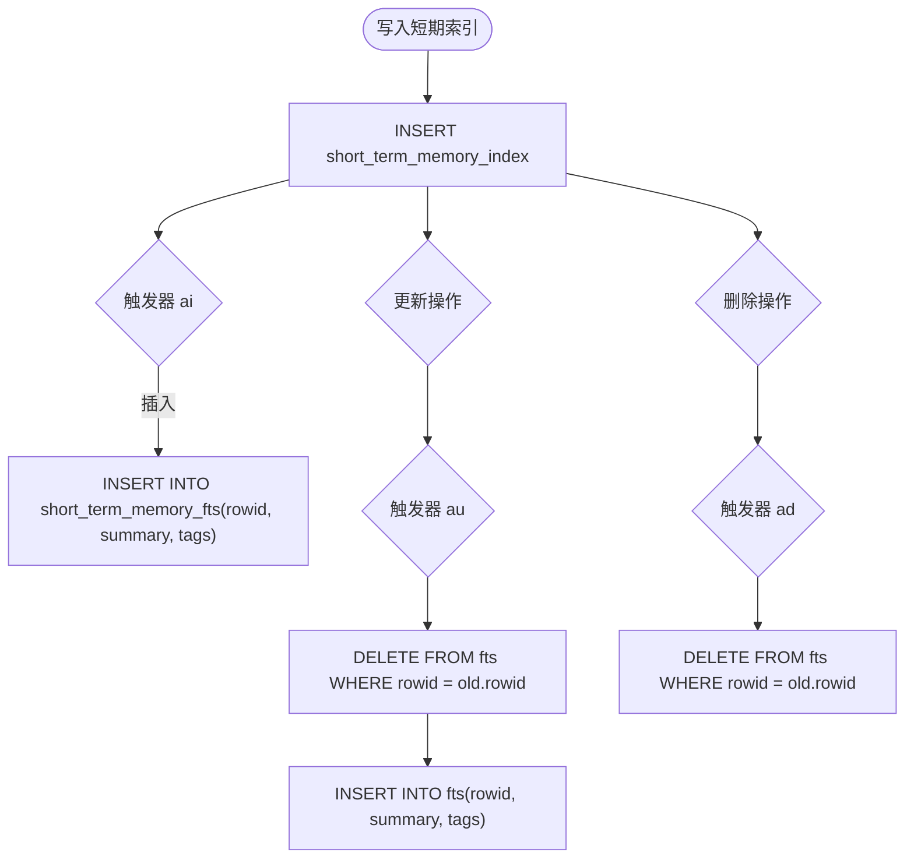
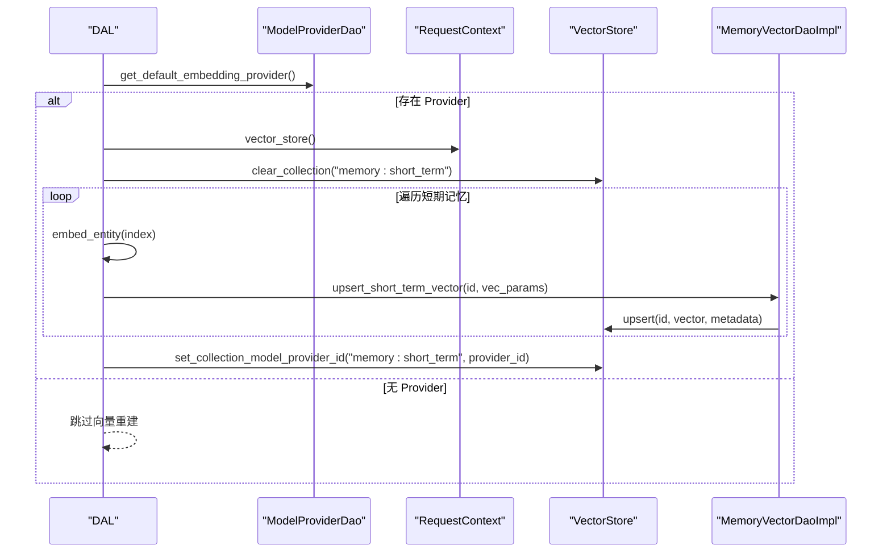
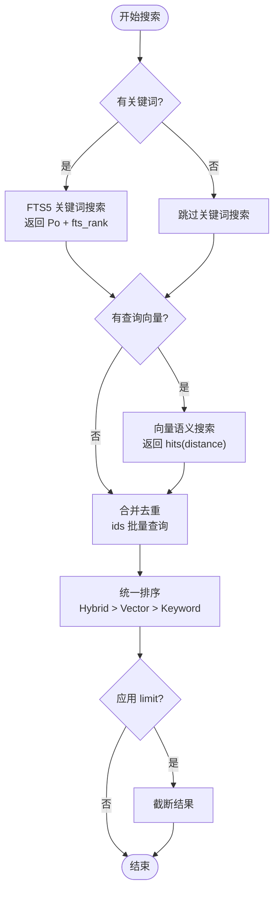
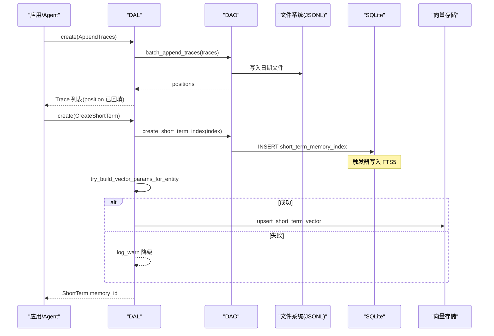
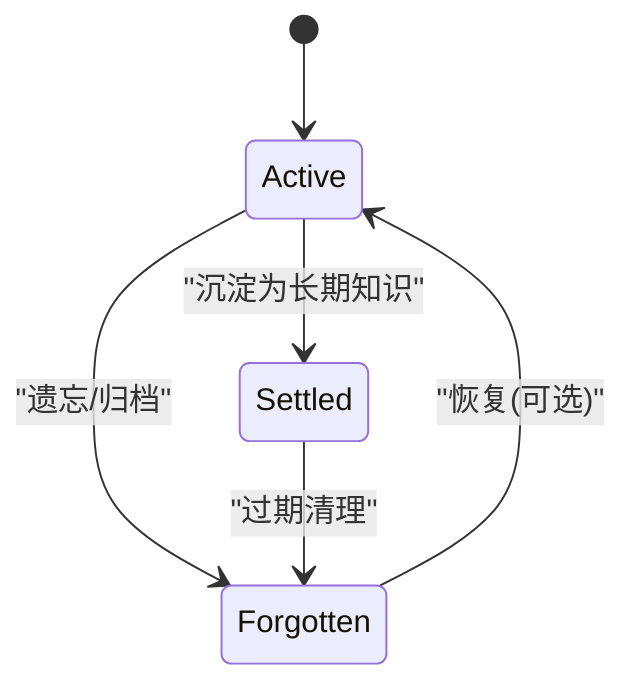
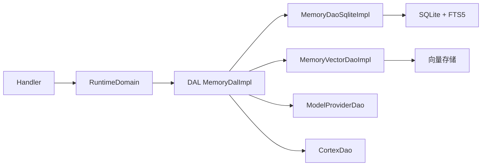

# 短期记忆（Short-term Memory）

<cite>
**本文引用的文件**
- [src/models/memory.rs](src/models/memory.rs)
- [src/service/dal/memory.rs](src/service/dal/memory.rs)
- [src/service/dao/memory/mod.rs](src/service/dao/memory/mod.rs)
- [src/service/dao/memory/sqlite.rs](src/service/dao/memory/sqlite.rs)
- [src/service/dao/memory/vector.rs](src/service/dao/memory/vector.rs)
- [migrations/20260712000000_memory_fts5.sql](migrations/20260712000000_memory_fts5.sql)
- [common/src/enums/memory.rs](common/src/enums/memory.rs)
- [src/handlers/hr/agent/create_memory.rs](src/handlers/hr/agent/create_memory.rs)
- [src/handlers/hr/agent/save_short_term_memory.rs](src/handlers/hr/agent/save_short_term_memory.rs)
- [tests/integration/memory_test.rs](tests/integration/memory_test.rs)
</cite>

## 目录
1. [简介](#简介)
2. [项目结构](#项目结构)
3. [核心组件](#核心组件)
4. [架构总览](#架构总览)
5. [详细组件分析](#详细组件分析)
6. [依赖关系分析](#依赖关系分析)
7. [性能考量](#性能考量)
8. [故障排查指南](#故障排查指南)
9. [结论](#结论)
10. [附录：API 使用示例](#附录api-使用示例)

## 简介
短期记忆层负责将 Agent 的原始思考轨迹（MemoryTrace）聚合为可检索、可语义匹配的“短期记忆索引”，并提供全文搜索与向量语义搜索能力。其设计遵循四层单向调用原则：Adapter → Domain → DAL → DAO，PO 仅在 DAO/DAL 内部使用，Domain 对外暴露业务实体 Memory。短期记忆的生命周期包括：原始 trace 落盘 → 生成摘要并创建短期索引 → 可选沉淀为长期知识节点 → 定时清理或遗忘归档。

## 项目结构
短期记忆相关代码分布在以下模块：
- 模型层：定义 MemoryTrace、ShortTermMemoryIndexPo、LongTermKnowledgeNodePo 等 PO 及 Memory 业务实体
- DAL 层：编排跨 DAO 流程（向量化、混合搜索、结果聚合排序、生命周期管理）
- DAO 层：SQLite 持久化、FTS5 全文索引、向量索引 CRUD
- Handler 层：提供 HTTP API 入口（创建、保存、查询、搜索、删除）
- 迁移脚本：FTS5 虚拟表与触发器、存量回填

图表来源
- [src/handlers/hr/agent/create_memory.rs:43-77](src/handlers/hr/agent/create_memory.rs#L43-L77)
- [src/service/domain/runtime/memory.rs:14-79](src/service/domain/runtime/memory.rs#L14-L79)
- [src/service/dal/memory.rs:190-276](src/service/dal/memory.rs#L190-L276)
- [src/service/dao/memory/sqlite.rs:165-192](src/service/dao/memory/sqlite.rs#L165-L192)
- [src/service/dao/memory/vector.rs:1-34](src/service/dao/memory/vector.rs#L1-L34)
- [migrations/20260712000000_memory_fts5.sql:16-29](migrations/20260712000000_memory_fts5.sql#L16-L29)

章节来源
- [src/models/memory.rs:15-210](src/models/memory.rs#L15-L210)
- [src/service/dal/memory.rs:1-177](src/service/dal/memory.rs#L1-L177)
- [src/service/dao/memory/mod.rs:14-58](src/service/dao/memory/mod.rs#L14-L58)
- [migrations/20260712000000_memory_fts5.sql:1-92](migrations/20260712000000_memory_fts5.sql#L1-L92)

## 核心组件
- MemoryTrace：原始记忆追踪，记录一次完整思考闭环（输入→输出），写入每日 JSONL 文件，不进入向量库
- ShortTermMemoryIndexPo：短期记忆索引，聚合多条相关 trace，包含 summary/tags/trace_ids，支持 FTS5 和向量化
- LongTermKnowledgeNodePo：长期知识节点，由短期记忆沉淀而来，支持 FTS5 和向量化
- Memory：业务实体，封装 PO 与搜索匹配信息（MatchType、fts_rank、vector_distance）
- MemoryQuery/MemorySearch：统一查询与搜索参数，支持 keyword、query_vector、filters、top_k、距离阈值等
- MemoryDalImpl：实现混合搜索（Hybrid/Vector/Keyword）、结果聚合排序、生命周期管理（沉淀、重建向量）
- MemoryDaoSqliteImpl：SQLite 读写、FTS5 同步、JSONL 追加
- MemoryVectorDaoImpl：向量索引 upsert/search/delete，解耦于基础数据

章节来源
- [src/models/memory.rs:15-210](src/models/memory.rs#L15-L210)
- [src/service/dal/memory.rs:190-276](src/service/dal/memory.rs#L190-L276)
- [src/service/dao/memory/mod.rs:62-192](src/service/dao/memory/mod.rs#L62-L192)
- [src/service/dao/memory/sqlite.rs:127-200](src/service/dao/memory/sqlite.rs#L127-L200)
- [src/service/dao/memory/vector.rs:1-34](src/service/dao/memory/vector.rs#L1-L34)

## 架构总览
短期记忆的创建与检索链路如下：
- 创建链路：Handler 构造 ShortTermMemoryIndexPo → DAL create(CreateShortTerm) → DAO 写 SQLite → 自动触发 FTS5 → DAL 尝试向量化 → 失败降级仅 warn
- 检索链路：DAL search 根据参数选择策略（keyword → FTS5；query_vector → 向量；两者都有 → 混合）→ 聚合去重 → 统一排序（Hybrid > Vector > Keyword）

图表来源
- [src/handlers/hr/agent/create_memory.rs:43-77](src/handlers/hr/agent/create_memory.rs#L43-L77)
- [src/service/dal/memory.rs:1381-1390](src/service/dal/memory.rs#L1381-L1390)
- [src/service/dao/memory/sqlite.rs:165-192](src/service/dao/memory/sqlite.rs#L165-L192)
- [migrations/20260712000000_memory_fts5.sql:35-54](migrations/20260712000000_memory_fts5.sql#L35-L54)

## 详细组件分析

### 数据模型与存储结构
- MemoryTrace：原始轨迹，ID 唯一，角色区分 System/User/Assistant/Summary，包含 input/output、时间戳、metadata、位置（date_path + line_number）
- ShortTermMemoryIndexPo：短期索引，字段包括 id、agent_id、task_id、role、summary、tags（JSON 数组字符串）、trace_ids（JSON 数组字符串）、status、created_at、updated_at
- LongTermKnowledgeNodePo：长期节点，包含 node_name、node_description、node_type、summary、tags、is_published 等
- 向量文本构建：ShortTerm 使用 summary + tags 拼接；LongTerm 使用 node_description + summary + tags 拼接；tags 解析为空时回退到主文本

图表来源
- [src/models/memory.rs:15-210](src/models/memory.rs#L15-L210)
- [common/src/enums/memory.rs:12-30](common/src/enums/memory.rs#L12-L30)

章节来源
- [src/models/memory.rs:15-210](src/models/memory.rs#L15-L210)
- [common/src/enums/memory.rs:12-30](common/src/enums/memory.rs#L12-L30)

### FTS5 全文搜索与触发器
- 虚拟表：short_term_memory_fts（索引 summary、tags，分词器 trigram）
- 触发器：AFTER INSERT/UPDATE/DELETE 自动同步主表到 FTS5
- 查询：DAO 层 search_short_term 返回 (ShortTermMemoryIndexPo, Option<fts_rank>)，BM25 越小越相关
- 存量回填：迁移脚本执行 INSERT INTO fts SELECT ... FROM main_table

图表来源
- [migrations/20260712000000_memory_fts5.sql:35-54](migrations/20260712000000_memory_fts5.sql#L35-L54)
- [migrations/20260712000000_memory_fts5.sql:85-92](migrations/20260712000000_memory_fts5.sql#L85-L92)

章节来源
- [migrations/20260712000000_memory_fts5.sql:1-92](migrations/20260712000000_memory_fts5.sql#L1-L92)
- [src/service/dao/memory/mod.rs:169-182](src/service/dao/memory/mod.rs#L169-L182)

### 向量嵌入生成与存储
- 向量化文本：ShortTermMemoryIndexPo.vectorize_text() 返回 summary + tags 拼接
- 提供者：通过 ModelProviderDao 获取默认 Embedding Provider；CortexDao 负责 embed_entity
- 存储：MemoryVectorDaoImpl 基于通用 VectorStore trait，集合名 "memory:short_term"
- 重建：rebuild_vectors 清空集合后逐条重新生成 embedding，记录 model_provider_id 以判断是否需要重建

图表来源
- [src/service/dal/memory.rs:654-750](src/service/dal/memory.rs#L654-L750)
- [src/service/dao/memory/vector.rs:1-34](src/service/dao/memory/vector.rs#L1-L34)

章节来源
- [src/models/memory.rs:186-210](src/models/memory.rs#L186-L210)
- [src/service/dal/memory.rs:654-750](src/service/dal/memory.rs#L654-L750)
- [src/service/dao/memory/vector.rs:1-34](src/service/dao/memory/vector.rs#L1-L34)

### 混合搜索算法与相似度计算
- 策略选择：
  - 仅 keyword → FTS5 MATCH + BM25
  - 仅 query_vector → 向量语义搜索
  - 两者都有 → 混合搜索，合并结果
- 结果聚合：
  - 向量结果按 top_k 与距离阈值过滤
  - 关键词结果携带 fts_rank
  - 用 ids 批量查询避免 N+1
- 排序规则：
  - Hybrid 优先 > Vector 次之 > Keyword/None 最后
  - 组内排序：Hybrid/Vector 按向量距离升序；Keyword 按 fts_rank 升序（BM25 越小越相关）

图表来源
- [src/service/dal/memory.rs:190-276](src/service/dal/memory.rs#L190-L276)
- [src/service/dal/memory.rs:1074-1109](src/service/dal/memory.rs#L1074-L1109)

章节来源
- [src/service/dal/memory.rs:190-276](src/service/dal/memory.rs#L190-L276)
- [src/service/dal/memory.rs:1074-1109](src/service/dal/memory.rs#L1074-L1109)

### 短期记忆创建流程（从 trace 到聚合摘要）
- 阶段一：AppendTraces 写入每日 JSONL，返回 position（date_filename + line_number）
- 阶段二：CreateShortTerm 构造 ShortTermMemoryIndexPo（含 trace_ids、summary、tags），写入 SQLite，自动触发 FTS5，尝试向量化
- 阶段三（可选）：settle_short_term_to_long_term 将 Active 短期记忆沉淀为长期知识节点，标记为 Settled

图表来源
- [src/service/dal/memory.rs:1355-1390](src/service/dal/memory.rs#L1355-L1390)
- [src/service/dao/memory/sqlite.rs:127-163](src/service/dao/memory/sqlite.rs#L127-L163)
- [migrations/20260712000000_memory_fts5.sql:35-54](migrations/20260712000000_memory_fts5.sql#L35-L54)

章节来源
- [src/service/dal/memory.rs:1355-1390](src/service/dal/memory.rs#L1355-L1390)
- [src/service/dao/memory/sqlite.rs:127-163](src/service/dao/memory/sqlite.rs#L127-L163)

### 生命周期管理与清理策略
- 状态管理：MemoryStatus（Forgotten/Active/Settled），默认查询过滤 Forgotten，Settled 表示已沉淀
- 软删除：forget_short_term_index 标记为 Forgotten，不参与检索但保留数据
- 沉淀：settle_short_term_to_long_term 将 Active 短期记忆转为长期知识节点，并标记为 Settled
- 向量重建：rebuild_vectors 根据当前 Provider 决定是否清空并重建集合

图表来源
- [common/src/enums/memory.rs:12-30](common/src/enums/memory.rs#L12-L30)
- [src/service/dal/memory.rs:578-652](src/service/dal/memory.rs#L578-L652)

章节来源
- [common/src/enums/memory.rs:12-30](common/src/enums/memory.rs#L12-L30)
- [src/service/dal/memory.rs:578-652](src/service/dal/memory.rs#L578-L652)

## 依赖关系分析
- DAL 依赖：
  - MemoryDao：SQLite 读写、FTS5 搜索、JSONL 追加
  - MemoryVectorDao：向量索引 CRUD
  - ModelProviderDao：获取默认 Embedding Provider
  - CortexDao：embed_entity 生成向量
- DAO 依赖：
  - SqlitePool：数据库连接
  - DailyJsonlWriter：文件写入/读取
  - FTS5 虚拟表与触发器：自动同步
- Handler 依赖：
  - RuntimeDomain：统一入口，转发到 DAL

图表来源
- [src/service/dal/memory.rs:41-68](src/service/dal/memory.rs#L41-L68)
- [src/service/dao/memory/mod.rs:560-568](src/service/dao/memory/mod.rs#L560-L568)

章节来源
- [src/service/dal/memory.rs:41-68](src/service/dal/memory.rs#L41-L68)
- [src/service/dao/memory/mod.rs:560-568](src/service/dao/memory/mod.rs#L560-L568)

## 性能考量
- FTS5 全文搜索：使用 trigram 分词器支持中文，MATCH + BM25 排序，触发器保证一致性
- 向量搜索：LanceDB 默认，支持 HNSW/InMemory/SqliteVss 多后端降级；距离阈值过滤减少噪声
- 混合搜索：先并行/顺序执行 FTS5 与向量搜索，再聚合去重，避免 N+1 查询
- 索引维护：更新/删除时自动清理向量索引；重建时按 Provider 差异选择性清空
- 建议优化：
  - 合理设置 top_k 与距离阈值，控制结果集大小
  - 批量操作（batch_append_traces、batch_save_knowledge_nodes）减少 IO
  - 定期重建向量索引以适配模型切换

[本节为通用指导，无需特定文件引用]

## 故障排查指南
- 向量搜索失败：检查是否安装 vss0 扩展或配置 Embedding Provider；日志中会降级到关键词搜索
- FTS5 不同步：检查触发器是否存在；确认迁移脚本已执行；验证 INSERT/UPDATE/DELETE 后 FTS 表是否有对应记录
- 向量重建无效：检查集合的 model_provider_id 是否与当前 Provider 一致；必要时手动 clear_collection 后重建
- 短期记忆不可见：确认 status 不为 Forgotten；检查 agent_id/task_id 过滤条件

章节来源
- [src/service/dal/skill.rs:351-385](src/service/dal/skill.rs#L351-L385)
- [migrations/20260712000000_memory_fts5.sql:35-54](migrations/20260712000000_memory_fts5.sql#L35-L54)
- [src/service/dal/memory.rs:654-750](src/service/dal/memory.rs#L654-L750)

## 结论
短期记忆层通过“原始 trace 落盘 + 索引聚合 + FTS5 + 向量语义”的组合，实现了高效、可扩展的记忆检索能力。其分层清晰、职责明确，支持混合搜索与多后端向量存储降级，具备完整的生命周期管理与重建机制。在实际使用中，应合理配置搜索参数、定期维护向量索引，并结合业务需求进行沉淀与清理。

[本节为总结性内容，无需特定文件引用]

## 附录：API 使用示例
以下为短期记忆的常见操作示例（基于 Handler 与 DAL 接口）：

- 创建短期记忆
  - 路径：POST /api/memory/create
  - 入参：content、summary（可选）、tags（可选）、task_id（可选）
  - 行为：构造 ShortTermMemoryIndexPo，调用 DAL create(CreateShortTerm)，返回 memory_id
  - 参考实现
    - [src/handlers/hr/agent/create_memory.rs:43-77](src/handlers/hr/agent/create_memory.rs#L43-L77)
    - [src/service/dal/memory.rs:1381-1390](src/service/dal/memory.rs#L1381-L1390)

- 保存短期记忆（带 trace_ids）
  - 路径：POST /api/memory/save_short_term
  - 入参：id、summary、tags、trace_ids、task_id
  - 行为：组装 ShortTermMemoryIndexPo，调用 DAL create(CreateShortTerm)
  - 参考实现
    - [src/handlers/hr/agent/save_short_term_memory.rs:30-57](src/handlers/hr/agent/save_short_term_memory.rs#L30-L57)

- 查询短期记忆
  - 路径：GET /api/memory/query
  - 入参：agent_id、status、limit、memory_type=ShortTerm、task_id（可选）
  - 行为：DAL query(MemoryQuery)，返回 Memory 列表
  - 参考实现
    - [src/service/dal/memory.rs:278-312](src/service/dal/memory.rs#L278-L312)

- 搜索短期记忆（FTS5 关键词）
  - 路径：POST /api/memory/search
  - 入参：query="自然语言"、memory_type="short_term"、max_results=20、agent_id
  - 行为：DAL search(MemorySearch)，若仅 keyword 则走 FTS5 MATCH + BM25
  - 参考实现
    - [tests/integration/memory_test.rs:332-371](tests/integration/memory_test.rs#L332-L371)
    - [src/service/dal/memory.rs:190-276](src/service/dal/memory.rs#L190-L276)

- 删除短期记忆
  - 路径：DELETE /api/memory/{id}
  - 行为：DAL delete(Memory{po=ShortTerm})，软删除索引并清理向量索引
  - 参考实现
    - [src/service/dal/memory.rs:477-516](src/service/dal/memory.rs#L477-L516)

章节来源
- [src/handlers/hr/agent/create_memory.rs:43-77](src/handlers/hr/agent/create_memory.rs#L43-L77)
- [src/handlers/hr/agent/save_short_term_memory.rs:30-57](src/handlers/hr/agent/save_short_term_memory.rs#L30-L57)
- [src/service/dal/memory.rs:278-312](src/service/dal/memory.rs#L278-L312)
- [tests/integration/memory_test.rs:332-371](tests/integration/memory_test.rs#L332-L371)
- [src/service/dal/memory.rs:477-516](src/service/dal/memory.rs#L477-L516)