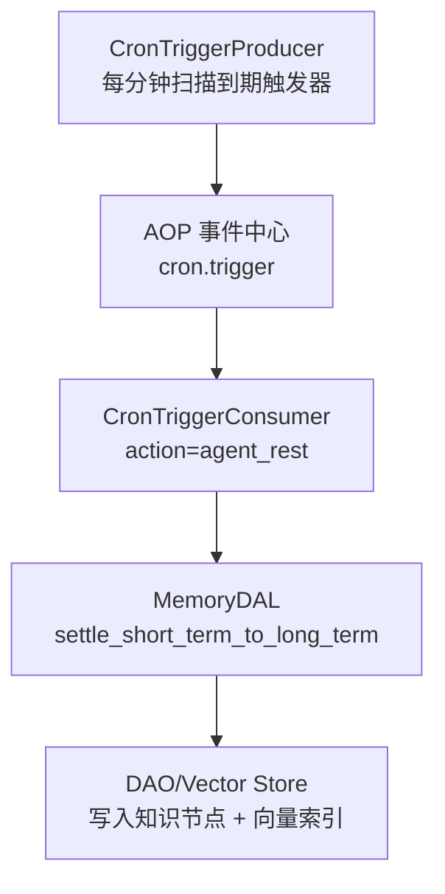
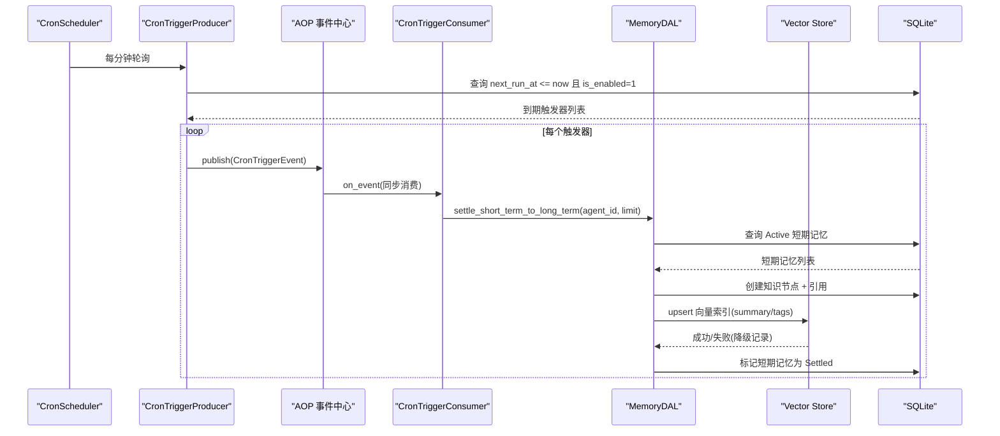
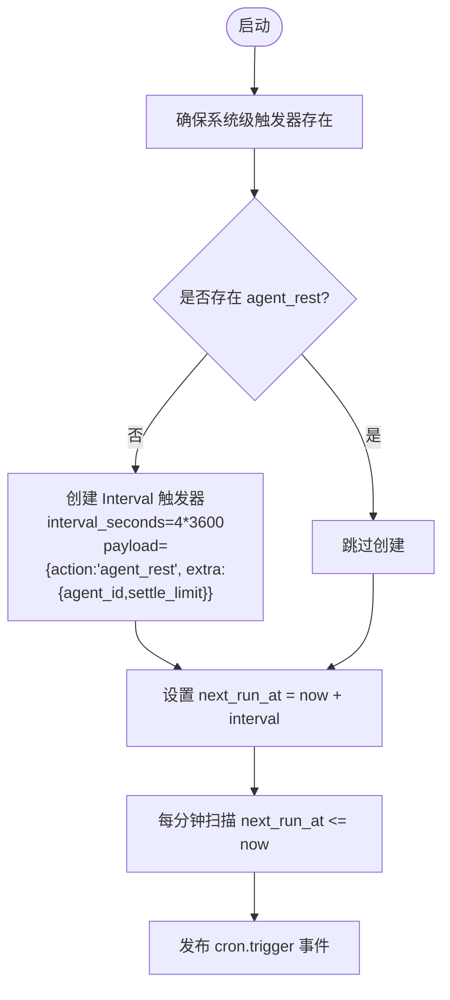
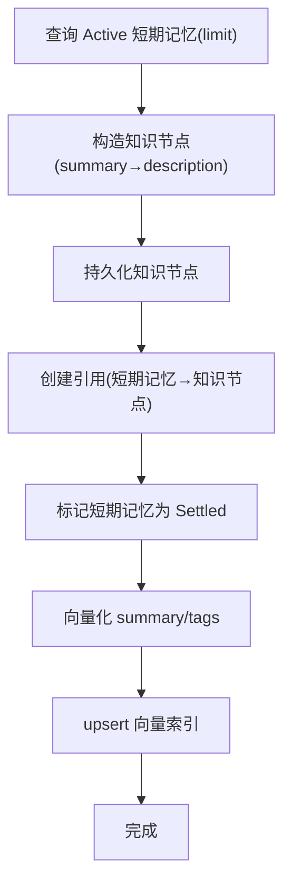
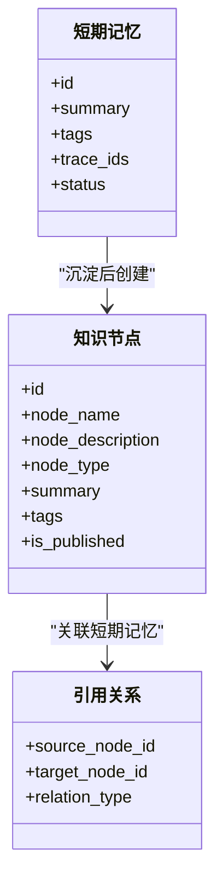
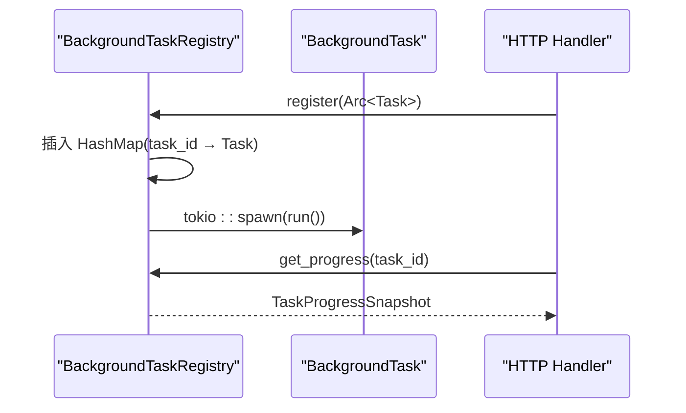
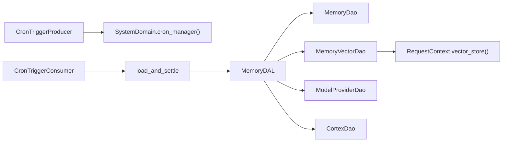

# 记忆沉淀机制

<cite>
**本文引用的文件**
- [scheduler.rs](src/consumer/scheduler.rs)
- [memory.rs](src/service/dal/memory.rs)
- [vector.rs](src/service/dao/memory/vector.rs)
- [agent.rs](src/service/dal/agent.rs)
- [cron_trigger.rs](src/producer/cron_trigger.rs)
- [sqlite.rs](src/service/dao/cron_trigger/sqlite.rs)
- [get_cron_trigger.rs](src/handlers/system/cron_trigger/get_cron_trigger.rs)
- [update_cron_trigger.rs](src/handlers/system/cron_trigger/update_cron_trigger.rs)
- [mod.rs](src/pkg/background_task/mod.rs)
- [registry.rs](src/pkg/background_task/registry.rs)
- [task_progress.rs](src/handlers/system/task_progress.rs)
- [rebuild_vectors_task.rs](src/handlers/finance/model_provider/rebuild_vectors_task.rs)
- [system_cron_triggers_test.rs](tests/integration/system_cron_triggers_test.rs)
- [skill.md](docs/agent_loop_engine_plan.md)
- [TEMPLATE_MEMORY_COGNITION_skill.md](docs/agent_loop_engine_plan.md)
- [system/mod.rs](src/service/domain/system/mod.rs)
- [settle_memory.rs](src/handlers/hr/agent/settle_memory.rs)

**本文关联三类文档（四类互引闭环）**
- 【① Design 决策快照】
  - [memory_system_enhancement_design.md](docs/archive/design-archive/memory_system_enhancement_design.md) — §1 决策 3：SystemDomain + CronManager；§1 决策 4：休息双轨
  - [runtime_design.md](docs/design/runtime_design.md) — AgentRuntimeInfo::Resting 状态 + BusyGuard 防沉淀并发冲突
- 【② Plan 落地快照（真实定稿）】
  - （占位：沉淀调度与 Cron 专项 Plan 待 ai-orz-doc-maintainer 从 superpowers 蓝图精简到 docs/archive/plan-archive/；当前可参考的落地结果见 Batch5 新增两张 RAG 卡 §4.1 必守红线）
- 【④ RAG 原子知识卡（Batch5 新增 2 张 + 关联 1 张）】
  - [agent_rest 定时休息沉淀：ensure_system_cron_triggers 每天4点 + CronTriggerConsumer 调度 + load_and_settle 链路](docs/wiki/knowledge/zh/agent_rest%20定时休息沉淀：ensure_system_cron_triggers%20每天4点%20+%20CronTriggerConsumer%20调度%20+%20load_and_settle%20链路/agent_rest%20定时休息沉淀：ensure_system_cron_triggers%20每天4点%20+%20CronTriggerConsumer%20调度%20+%20load_and_settle%20链路.md) — 沉淀的上游调度链路（Producer → Consumer → 动作路由）
  - [四层记忆沉淀：save_short_term 与 save_long_term 工具拆分 + settle 向量去重合并策略](docs/wiki/knowledge/zh/四层记忆沉淀：save_short_term%20与%20save_long_term%20工具拆分%20+%20settle%20向量去重合并策略/四层记忆沉淀：save_short_term%20与%20save_long_term%20工具拆分%20+%20settle%20向量去重合并策略.md) — 沉淀真正执行逻辑（DAL settle_short_term_to_long_term 核心实现）
  - 【关联】[AgentRuntimeInfo 三态状态机 + BusyGuard RAII：Idle Busy Resting 转换 + task_id project_id 业务上下文透视](docs/wiki/knowledge/zh/AgentRuntimeInfo%20三态状态机%20+%20BusyGuard%20RAII：Idle%20Busy%20Resting%20转换%20+%20task_id%20project_id%20业务上下文透视/AgentRuntimeInfo%20三态状态机%20+%20BusyGuard%20RAII：Idle%20Busy%20Resting%20转换%20+%20task_id%20project_id%20业务上下文透视.md) — Resting 状态 RAII 保护
- 【③ Wiki 关联长文】
  - [四层记忆系统.md](docs/wiki/zh/content/项目概述/核心功能特性/四层记忆系统/四层记忆系统.md) — 四层认知模型总入口
  - [系统定时任务管理.md](docs/wiki/zh/content/功能模块/系统管理功能/系统定时任务管理.md) — CronTrigger 面板：暂停/恢复/手工触发
  - [记忆系统管理.md](docs/wiki/zh/content/功能模块/AI%20Agent%20管理/记忆系统管理.md) — 沉淀后的知识节点管理 + 画布展示
</cite>

## 目录
1. [简介](#简介)
2. [项目结构](#项目结构)
3. [核心组件](#核心组件)
4. [架构总览](#架构总览)
5. [详细组件分析](#详细组件分析)
6. [依赖关系分析](#依赖关系分析)
7. [性能考量](#性能考量)
8. [故障排查指南](#故障排查指南)
9. [结论](#结论)
10. [附录](#附录)

## 简介
本技术文档围绕“记忆沉淀机制”展开，聚焦 agent_rest 定时任务如何每 4 小时触发一次，将短期记忆转化为长期知识，并构建可检索、可遍历的知识图谱。文档覆盖：
- 调度机制与触发条件（间隔型 Cron 触发器）
- 短期记忆到长期知识的转化流程（AI 总结、知识提取规则、图谱构建）
- 沉淀任务的工作队列管理（调度、并发控制、错误重试）
- 监控与调试接口（任务状态查询、执行日志、问题诊断）
- 沉淀策略的可配置项（阈值、质量过滤、人工审核）

## 项目结构
记忆沉淀涉及三层协作：
- 生产者层：CronTriggerProducer 每分钟扫描到期触发器，发布 cron.trigger 事件
- 消费者层：CronTriggerConsumer 消费事件，按 action 路由到业务处理（agent_rest）
- 领域层：MemoryDAL 编排短期记忆聚合、向量化、知识节点创建与引用建立

**图表来源**
- [cron_trigger.rs:38-87](src/producer/cron_trigger.rs#L38-L87)
- [scheduler.rs:39-95](src/consumer/scheduler.rs#L39-L95)
- [memory.rs:578-652](src/service/dal/memory.rs#L578-L652)
- [vector.rs:81-124](src/service/dao/memory/vector.rs#L81-L124)

**章节来源**
- [cron_trigger.rs:38-87](src/producer/cron_trigger.rs#L38-L87)
- [scheduler.rs:39-95](src/consumer/scheduler.rs#L39-L95)
- [memory.rs:578-652](src/service/dal/memory.rs#L578-L652)
- [vector.rs:81-124](src/service/dao/memory/vector.rs#L81-L124)

## 核心组件
- CronTriggerProducer：周期扫描到期触发器，发布事件；每次最多拉取固定数量，避免一次性压垮系统
- CronTriggerConsumer：同步消费者，解析 payload.action，调用领域方法完成沉淀
- MemoryDAL：统一混合搜索、关系遍历、短期记忆沉淀为知识节点、重建向量索引
- Vector DAO：封装向量存储集合操作（search/get/delete/clear），支持多后端降级
- BackgroundTaskRegistry：后台任务注册中心，提供进度快照与清理策略

**章节来源**
- [cron_trigger.rs:38-87](src/producer/cron_trigger.rs#L38-L87)
- [scheduler.rs:39-95](src/consumer/scheduler.rs#L39-L95)
- [memory.rs:72-177](src/service/dal/memory.rs#L72-L177)
- [vector.rs:81-124](src/service/dao/memory/vector.rs#L81-L124)
- [mod.rs:46-72](src/pkg/background_task/mod.rs#L46-L72)
- [registry.rs:25-92](src/pkg/background_task/registry.rs#L25-L92)

## 架构总览
从触发到落库的端到端时序如下：

**图表来源**
- [cron_trigger.rs:42-87](src/producer/cron_trigger.rs#L42-L87)
- [scheduler.rs:53-95](src/consumer/scheduler.rs#L53-L95)
- [memory.rs:578-652](src/service/dal/memory.rs#L578-L652)
- [vector.rs:81-124](src/service/dao/memory/vector.rs#L81-L124)
- [sqlite.rs:166-213](src/service/dao/cron_trigger/sqlite.rs#L166-L213)

## 详细组件分析

### 定时任务调度与触发条件
- 触发类型：Interval（固定间隔）
- 默认间隔：4 小时（系统级默认任务）
- 首次执行时间：启动后延迟一个间隔
- 负载参数：payload 包含 action=agent_rest 与 extra.agent_id、extra.settle_limit（默认 10）
- 数据库侧：next_run_at 维护下次执行时间，is_enabled 控制启停

**图表来源**
- [system_cron_triggers_test.rs:70-100](tests/integration/system_cron_triggers_test.rs#L70-L100)
- [sqlite.rs:166-213](src/service/dao/cron_trigger/sqlite.rs#L166-L213)
- [cron_trigger.rs:42-87](src/producer/cron_trigger.rs#L42-L87)

**章节来源**
- [system_cron_triggers_test.rs:70-100](tests/integration/system_cron_triggers_test.rs#L70-L100)
- [sqlite.rs:166-213](src/service/dao/cron_trigger/sqlite.rs#L166-L213)
- [cron_trigger.rs:42-87](src/producer/cron_trigger.rs#L42-L87)

### 短期记忆到长期知识的转化流程
- 输入：Agent 的 Active 短期记忆（status=Active）
- 聚合：按时间/主题分组（由 DAL 内部实现决定）
- 输出：
  - 知识节点（node_name/node_description/node_type/summary/tags）
  - 引用关系（关联原始短期记忆）
  - 短期记忆状态更新为 Settled
- 向量化：对 summary/tags 生成向量并 upsert 到向量集合

**图表来源**
- [memory.rs:578-652](src/service/dal/memory.rs#L578-L652)
- [vector.rs:81-124](src/service/dao/memory/vector.rs#L81-L124)

**章节来源**
- [memory.rs:578-652](src/service/dal/memory.rs#L578-L652)
- [vector.rs:81-124](src/service/dao/memory/vector.rs#L81-L124)

### AI 总结算法与知识提取规则
- 总结要求：摘要应提炼要点而非复述原文；只沉淀可复用模式/抽象经验/核心概念
- 图谱迭代：新建/更新节点时先检索已有节点，避免重复；必要时拆分大节点并建立 contains 关系
- 共享策略：对跨 Agent 有共享价值的节点添加 published 标签
- 追溯性：沉淀结果需携带 trace_ids，便于回溯原始对话

**图表来源**
- [skill.md:23-62](docs/agent_loop_engine_plan.md#L23-L62)
- [agent.rs:1185-1204](src/service/dal/agent.rs#L1185-L1204)

**章节来源**
- [skill.md:23-62](docs/agent_loop_engine_plan.md#L23-L62)
- [agent.rs:1185-1204](src/service/dal/agent.rs#L1185-L1204)

### 工作队列管理与并发控制
- 事件消费模式：Sync（同步消费），保证顺序性与一致性
- 批量限制：Cron 生产者每次最多拉取固定数量（如 100），避免风暴
- 任务注册中心：BackgroundTaskRegistry 以 Arc<dyn BackgroundTask> 管理任务生命周期，提供进度快照与清理策略
- 并发模型：tokio::spawn 异步执行任务体，外部通过 registry 查询进度

**图表来源**
- [mod.rs:46-72](src/pkg/background_task/mod.rs#L46-L72)
- [registry.rs:25-92](src/pkg/background_task/registry.rs#L25-L92)
- [task_progress.rs:12-25](src/handlers/system/task_progress.rs#L12-L25)

**章节来源**
- [scheduler.rs:39-95](src/consumer/scheduler.rs#L39-L95)
- [cron_trigger.rs:42-87](src/producer/cron_trigger.rs#L42-L87)
- [mod.rs:46-72](src/pkg/background_task/mod.rs#L46-L72)
- [registry.rs:25-92](src/pkg/background_task/registry.rs#L25-L92)
- [task_progress.rs:12-25](src/handlers/system/task_progress.rs#L12-L25)

### 错误处理与重试机制
- 向量索引失败：DAL 在更新/重建向量索引时捕获异常并以 warn 降级，不影响主流程
- 触发器执行：生产者发布事件后更新 last_run_at/next_run_at；消费者解析失败返回错误
- 后台任务：run 返回 Err 时记录日志；任务内部负责设置 Failed 状态与错误信息
- Agent 状态保护：避免 Busy/Resting 状态下无意义重试堆积

**章节来源**
- [memory.rs:400-460](src/service/dal/memory.rs#L400-L460)
- [memory.rs:654-799](src/service/dal/memory.rs#L654-L799)
- [registry.rs:36-44](src/pkg/background_task/registry.rs#L36-L44)
- [rebuild_vectors_task.rs:74-106](src/handlers/finance/model_provider/rebuild_vectors_task.rs#L74-L106)

### 监控与调试接口
- 队列监控：AOP 队列统计与事件查询（前端页面展示 pending/in_progress/order_key 分布）
- 任务进度：统一接口 GET /api/v1/system/tasks/{task_id}/progress 返回 TaskProgressSnapshot
- 触发器管理：CRUD 接口用于查看/更新/暂停/恢复触发器
- 日志查询：系统日志级别分布与时序查询

**章节来源**
- [task_progress.rs:12-25](src/handlers/system/task_progress.rs#L12-L25)
- [get_cron_trigger.rs:11-25](src/handlers/system/cron_trigger/get_cron_trigger.rs#L11-L25)
- [update_cron_trigger.rs:11-57](src/handlers/system/cron_trigger/update_cron_trigger.rs#L11-L57)

### 沉淀策略的可配置选项
- settle_limit：每次处理的未沉淀记忆条数（默认 10），通过 trigger payload.extra.settle_limit 配置
- 向量距离阈值：搜索时可通过 vector_distance_threshold 控制向量匹配严格度（测试中默认 0.8）
- 质量过滤：仅沉淀可复用模式/抽象经验，不沉淀一次性细节或临时 ID
- 人工审核：通过 published 标签控制跨 Agent 共享范围；私有节点不写 published

**章节来源**
- [scheduler.rs:104-131](src/consumer/scheduler.rs#L104-L131)
- [memory_test.rs:1679-1706](src/service/dal/memory_test.rs#L1679-L1706)
- [skill.md:23-62](docs/agent_loop_engine_plan.md#L23-L62)

## 依赖关系分析
- CronTriggerProducer 依赖 SystemDomain.cron_manager() 获取到期触发器
- CronTriggerConsumer 依赖 handlers::hr::agent::settle_memory::load_and_settle 复用沉淀逻辑
- MemoryDAL 依赖 MemoryDao/MemoryVectorDao/ModelProviderDao/CortexDao
- Vector DAO 依赖 RequestContext.vector_store() 进行集合操作

**图表来源**
- [cron_trigger.rs:55-87](src/producer/cron_trigger.rs#L55-L87)
- [scheduler.rs:104-131](src/consumer/scheduler.rs#L104-L131)
- [memory.rs:181-186](src/service/dal/memory.rs#L181-L186)
- [vector.rs:81-124](src/service/dao/memory/vector.rs#L81-L124)

**章节来源**
- [cron_trigger.rs:55-87](src/producer/cron_trigger.rs#L55-L87)
- [scheduler.rs:104-131](src/consumer/scheduler.rs#L104-L131)
- [memory.rs:181-186](src/service/dal/memory.rs#L181-L186)
- [vector.rs:81-124](src/service/dao/memory/vector.rs#L81-L124)

## 性能考量
- 批量限制：Cron 生产者每次最多拉取固定数量，避免一次性大量事件
- 向量降级：向量化失败仅 warn，不阻塞主流程
- 重建优化：rebuild_vectors 仅在 provider 变更时清空并重建对应集合
- 搜索排序：Hybrid > Vector > Keyword，组内按距离/FTS rank 排序，减少无关结果

**章节来源**
- [cron_trigger.rs:55-87](src/producer/cron_trigger.rs#L55-L87)
- [memory.rs:400-460](src/service/dal/memory.rs#L400-L460)
- [memory.rs:654-799](src/service/dal/memory.rs#L654-L799)
- [memory.rs:220-275](src/service/dal/memory.rs#L220-L275)

## 故障排查指南
- 触发器未执行：检查 is_enabled 与 next_run_at；确认 CronTriggerProducer 已注册并轮询
- 沉淀无结果：确认存在 Active 短期记忆；检查 settle_limit 是否过小
- 向量索引缺失：查看向量 store 集合 model_provider_id 是否与当前 provider 一致；必要时触发 rebuild_vectors
- 任务进度不可见：确认任务已通过 registry.register 注册；使用 task_progress 接口查询
- 错误定位：查看后台任务 error 字段与日志级别分布

**章节来源**
- [sqlite.rs:166-213](src/service/dao/cron_trigger/sqlite.rs#L166-L213)
- [memory.rs:654-799](src/service/dal/memory.rs#L654-L799)
- [task_progress.rs:12-25](src/handlers/system/task_progress.rs#L12-L25)
- [registry.rs:36-44](src/pkg/background_task/registry.rs#L36-L44)

## 结论
记忆沉淀机制通过“定时触发 → 事件驱动 → 领域编排 → 向量索引”的闭环，实现了从短期记忆到长期知识的自动化转化。其关键优势包括：
- 明确的调度与触发条件（Interval 4 小时）
- 可配置的沉淀策略（limit、阈值、published）
- 健壮的降级与监控（向量失败降级、任务进度查询）
- 可扩展的知识图谱（节点 + 关系 + 遍历）

建议在生产环境中结合 AOP 队列监控与日志分析，持续优化 settle_limit 与向量距离阈值，确保知识质量与系统稳定性。

## 附录
- 系统默认触发器：agent_rest（每 4 小时）、project_followup（每 1 小时）
- 向量后端：LanceDB 默认，支持 HNSW/InMemory/SqliteVss 降级
- 全文搜索：FTS5 + trigram 分词器

### 本文关联的三类文档（四类互引闭环，Batch11 精确对齐）
#### ① Design 决策快照
- [memory_system_enhancement_design.md](docs/archive/design-archive/memory_system_enhancement_design.md) — 6 条关键决策：写入拆分/SystemDomain Cron 建设/休息双轨/冲突合并 0.78 阈值/沉淀 LLM 调用放 Runtime
#### ② Plan 落地快照
- [唤醒上下文与睡眠约束.md](docs/archive/plan-archive/唤醒上下文与睡眠约束.md) — sleep_and_settle 双层工具过滤 + build_sleep_prompt 内聚约束 6 步 SOP
#### ④ RAG 原子知识卡
- [Memory 系统增强与休息沉淀：四层记忆（Core／Working／Short／Long）+ agent_rest 每天 4 点 settle + load_and_settle 向量去重合并](docs/wiki/knowledge/zh/Memory%20系统增强与休息沉淀：四层记忆（Core%2FWorking%2FShort%2FLong）+%20agent_rest%20每天%204%20点%20settle%20+%20load_and_settle%20向量去重合并/Memory%20系统增强与休息沉淀：四层记忆（Core%2FWorking%2FShort%2FLong）+%20agent_rest%20每天%204%20点%20settle%20+%20load_and_settle%20向量去重合并.md) — §3 端到端沉淀全链路（Step1-6） + §4.1 红线 10 条（幂等/冲突阈值/双层过滤/Prompt 内聚）
