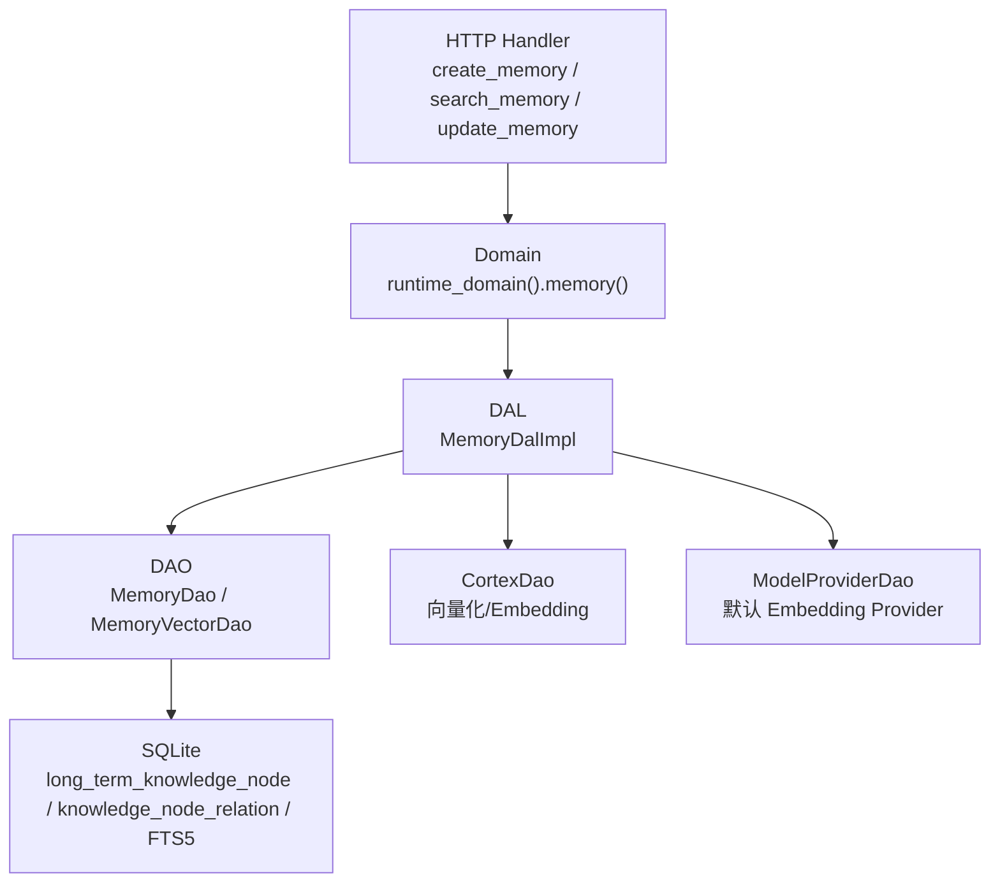
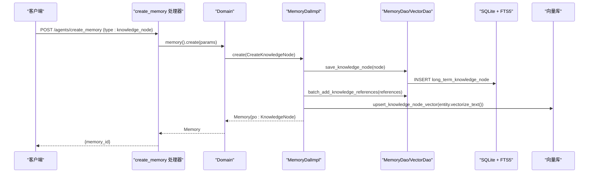
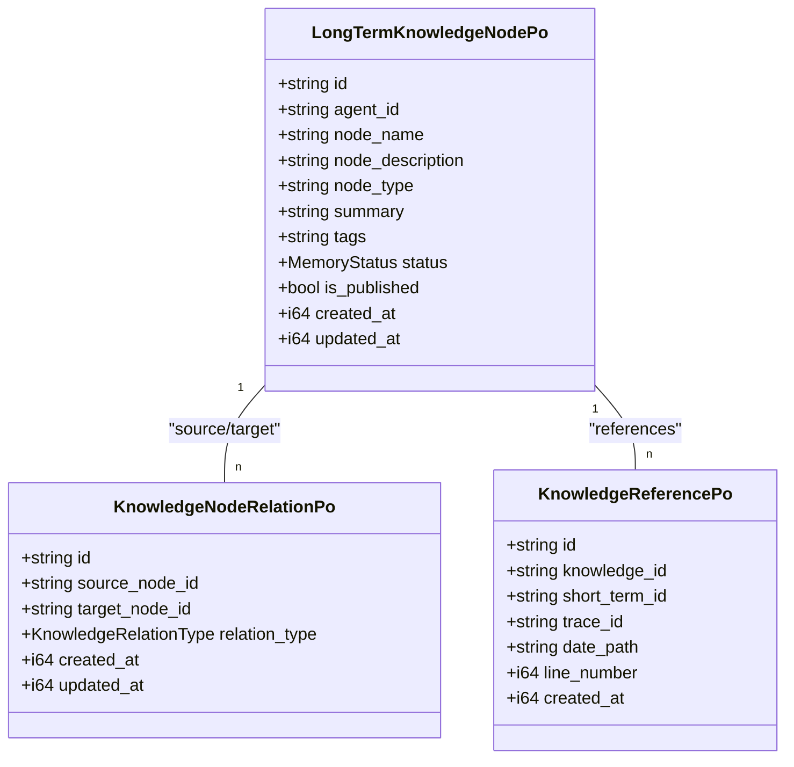
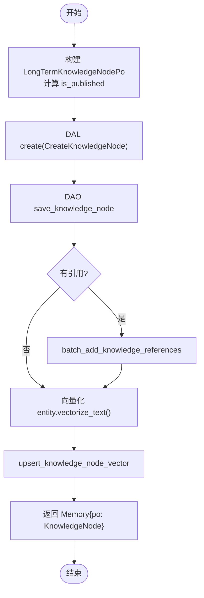
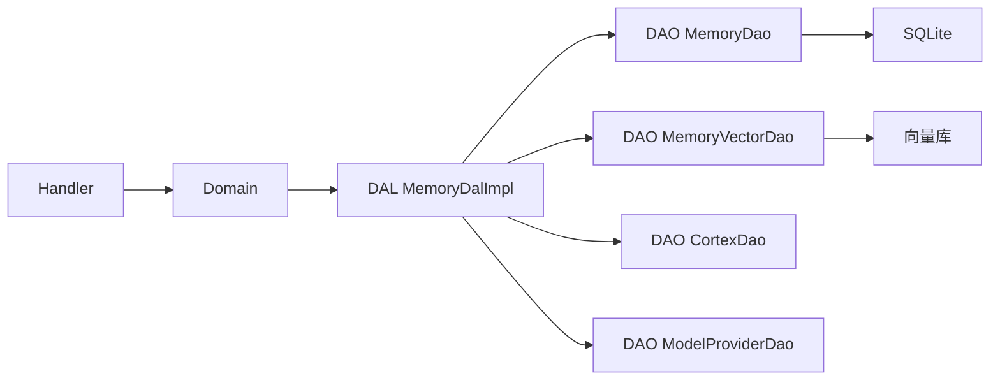

# 知识节点管理

<cite>
**本文引用的文件**
- [memory.rs](src/models/memory.rs)
- [memory.rs (DAL)](src/service/dal/memory.rs)
- [sqlite.rs (DAO)](src/service/dao/memory/sqlite.rs)
- [create_memory.rs (Handler)](src/handlers/hr/agent/create_memory.rs)
- [search_memory.rs (Handler)](src/handlers/hr/agent/search_memory.rs)
- [update_memory.rs (Handler)](src/handlers/hr/agent/update_memory.rs)
- [save_long_term_memory.rs (Handler)](src/handlers/hr/agent/save_long_term_memory.rs)
- [router.rs](src/router.rs)
- （2026-09-04 清理：superpowers 目录已归档，待 doc-maintainer 跟进）
- （2026-09-04 清理：superpowers 目录已归档，待 doc-maintainer 跟进）
</cite>

## 目录
1. [简介](#简介)
2. [项目结构](#项目结构)
3. [核心组件](#核心组件)
4. [架构总览](#架构总览)
5. [详细组件分析](#详细组件分析)
6. [依赖关系分析](#依赖关系分析)
7. [性能考虑](#性能考虑)
8. [故障排查指南](#故障排查指南)
9. [结论](#结论)
10. [附录：API 调用示例与模式](#附录api-调用示例与模式)

## 简介
本技术文档围绕“知识节点管理”展开，聚焦于长期知识图谱中的知识节点（LongTermKnowledgeNodePo）的数据结构设计、创建流程（含从短期记忆到知识提炼的 AI 处理与质量评估）、更新策略（内容修订、版本控制与变更历史）、CRUD 操作接口、以及发布机制（蜂巢共享、权限与访问控制）。文档严格遵循四层单向调用规范：Adapter（HTTP Handler / AOP Producer）→ Domain → DAL → DAO，PO 仅在 DAO/DAL 内部使用，Domain 对外暴露业务实体。

## 项目结构
知识节点相关代码分布在以下层次：
- Adapter 层：HTTP Handler 负责接收请求、参数校验、上下文注入，并调用 Domain。
- Domain 层：编排业务流程，协调 DAL 完成搜索、遍历、沉淀等跨 DAO 流程。
- DAL 层：实现 MemoryDalImpl，封装混合搜索、向量重建、图谱遍历、短期记忆沉淀为知识节点等。
- DAO 层：SQLite 持久化，包含知识节点表、关系表、FTS5 全文索引、触发器维护等。

图表来源
- [create_memory.rs:21-41](src/handlers/hr/agent/create_memory.rs#L21-L41)
- [memory.rs (DAL):72-177](src/service/dal/memory.rs#L72-L177)
- [sqlite.rs (DAO):619-650](src/service/dao/memory/sqlite.rs#L619-L650)

章节来源
- [create_memory.rs:21-41](src/handlers/hr/agent/create_memory.rs#L21-L41)
- [memory.rs (DAL):72-177](src/service/dal/memory.rs#L72-L177)
- [sqlite.rs (DAO):619-650](src/service/dao/memory/sqlite.rs#L619-L650)

## 核心组件
- LongTermKnowledgeNodePo：长期知识节点 PO，包含 id、agent_id、node_name、node_description、node_type、summary、tags、status、is_published、created_at、updated_at。
- KnowledgeNodeRelationPo：知识节点关系 PO，描述源节点与目标节点的关系类型及时间戳。
- KnowledgeReferencePo：知识节点引用原始短期记忆的追踪信息，支持溯源。
- MemoryDalImpl：统一混合搜索、图谱遍历、短期记忆沉淀、向量重建等核心逻辑。
- MemorySearch/MemoryQuery：搜索与查询参数，支持关键词、向量、标签、任务 ID、Agent ID、是否包含共享节点等过滤。

章节来源
- [memory.rs:212-266](src/models/memory.rs#L212-L266)
- [memory.rs:268-320](src/models/memory.rs#L268-L320)
- [memory.rs (DAL):72-177](src/service/dal/memory.rs#L72-L177)

## 架构总览
知识节点的生命周期包括：
- 创建：通过 create_memory 或 save_long_term_memory 创建 LongTermKnowledgeNodePo，写入 SQLite，建立引用与关系，生成向量索引。
- 搜索：支持关键词（FTS5）+ 向量语义（LanceDB/HNSW/InMemory/SqliteVss），混合排序，支持标签过滤与 Agent 范围。
- 遍历：基于种子节点进行广度优先或深度优先遍历，支持跨 Agent 的 published 节点作为桥梁。
- 更新：支持内容修订、标签更新（含 published），自动重新向量化；删除采用软删除（标记 Forgotten）。
- 沉淀：将未沉淀的短期记忆总结为知识节点，并标记原短期记忆为 Settled。
- 发布：通过 tags 包含 "published" 实现蜂巢共享，is_published 冗余字段加速查询与可见性控制。

图表来源
- [create_memory.rs:79-125](src/handlers/hr/agent/create_memory.rs#L79-L125)
- [memory.rs (DAL):1424-1473](src/service/dal/memory.rs#L1424-L1473)
- [sqlite.rs (DAO):619-650](src/service/dao/memory/sqlite.rs#L619-L650)

## 详细组件分析

### 数据模型与类型系统
- LongTermKnowledgeNodePo：
  - node_type：用于分类（如 concept/event/preference/skill/general/summary 等），便于前端展示与过滤。
  - node_description：节点详细描述，参与向量索引与 FTS5 检索。
  - summary：综合摘要，用于 Prompt 可读性与搜索结果摘要。
  - tags：JSON 数组字符串，支持标签过滤与全文索引；包含 "published" 时 is_published 为 true。
  - status：Active/Settled/Forgotten，控制生命周期状态。
  - is_published：冗余字段，加速查询与可见性控制。
- KnowledgeNodeRelationPo：source_node_id、target_node_id、relation_type（枚举），支持多关系边。
- KnowledgeReferencePo：记录知识节点引用的原始短期记忆位置（date_path + line_number），支持溯源。

图表来源
- [memory.rs:212-320](src/models/memory.rs#L212-L320)

章节来源
- [memory.rs:212-320](src/models/memory.rs#L212-L320)

### 知识节点创建流程（含 AI 处理与质量评估）
- 入口：create_memory（knowledge_node）或 save_long_term_memory。
- 步骤：
  1. 构造 LongTermKnowledgeNodePo，计算 is_published（基于 tags 是否包含 "published"）。
  2. 调用 DAL create(CreateKnowledgeNode)。
  3. DAO 写入 SQLite（long_term_knowledge_node），可选批量添加引用（knowledge_reference）。
  4. 向量化：调用 CortexDao embed_entity，生成 vector_index_params，upsert 到向量库。
  5. 返回 Memory{po: KnowledgeNode}，提取 id。
- 质量评估：
  - 向量化失败仅 warn 降级，不影响主流程。
  - 可通过后续 update_memory 修正内容、标签、状态。
  - settle_short_term_to_long_term 将短期记忆总结为知识节点，体现 AI 提炼过程。

图表来源
- [create_memory.rs:79-125](src/handlers/hr/agent/create_memory.rs#L79-L125)
- [memory.rs (DAL):1424-1473](src/service/dal/memory.rs#L1424-L1473)

章节来源
- [create_memory.rs:79-125](src/handlers/hr/agent/create_memory.rs#L79-L125)
- [memory.rs (DAL):1424-1473](src/service/dal/memory.rs#L1424-L1473)

### 知识节点更新策略（内容修订、版本控制、变更历史）
- 更新接口：update_memory（KnowledgeNode 分支）。
- 支持字段：content（node_description）、summary、node_tags（同步 is_published）、status。
- 版本控制：
  - 无显式版本字段，但通过 updated_at 记录更新时间。
  - 软删除：delete_knowledge_node 将 status 设为 Forgotten，保留数据可恢复。
  - 变更历史：可通过 FTS5 与向量索引变化间接追溯；如需完整审计日志，可在上层扩展。
- 重新向量化：更新后自动重新向量化，失败 warn 降级。

章节来源
- [update_memory.rs:70-104](src/handlers/hr/agent/update_memory.rs#L70-L104)
- [sqlite.rs (DAO):933-952](src/service/dao/memory/sqlite.rs#L933-L952)
- [memory.rs (DAL):431-475](src/service/dal/memory.rs#L431-L475)

### 知识节点 CRUD 操作示例
- 创建：POST /agents/create_memory，body 包含 memory_type="knowledge_node"、content、summary、tags。
- 查询：POST /agents/query_memory，filters 指定 memory_type=KnowledgeNode、agent_id、tags、status。
- 更新：POST /agents/update_memory，传入 MemoryPo::KnowledgeNode 的更新字段。
- 删除：POST /agents/delete_memory，传入 MemoryPo::KnowledgeNode，软删除。

章节来源
- [create_memory.rs:21-41](src/handlers/hr/agent/create_memory.rs#L21-L41)
- [search_memory.rs:24-53](src/handlers/hr/agent/search_memory.rs#L24-L53)
- [update_memory.rs:70-104](src/handlers/hr/agent/update_memory.rs#L70-L104)

### 知识节点发布机制（蜂巢共享、权限控制、访问控制）
- 发布标签：tags 包含 "published" 时 is_published=true，表示该节点可被其他 Agent 检索。
- 查询可见性：
  - 搜索时 include_shared=true（KnowledgeNode 或 All 类型）包含 published 节点。
  - 遍历 fetch_nodes_by_ids 过滤：仅允许 agent_id 匹配或 is_published=true 的节点。
- 权限控制：
  - 私有节点：agent_id 必须匹配。
  - 共享节点：任何 Agent 可检索，但遍历时需确保 is_published。
- 蜂巢共享：通过 published 标签让 Agent 主动共享知识节点，其他 Agent 可检索并通过它作为桥梁遍历跨 Agent 的知识网络。

章节来源
- [search_memory.rs:51-53](src/handlers/hr/agent/search_memory.rs#L51-L53)
- [memory.rs (DAL):969-976](src/service/dal/memory.rs#L969-L976)
- （2026-09-04 清理：superpowers 目录已归档，待 doc-maintainer 跟进）

### 知识图谱遍历与推荐起点
- 遍历策略：BreadthFirst 或 DepthFirst，支持 max_depth、max_breadth。
- 推荐起点：recommend_seed_nodes 按节点关联度数（入边+出边）倒序返回 Top N，用于图谱页面“推荐起点”。
- 前端集成：knowledge_graph 页面支持搜索、标签过滤、推荐起点、Canvas/SVG 渲染。

章节来源
- [memory.rs (DAL):314-375](src/service/dal/memory.rs#L314-L375)
- [memory.rs (DAL):518-576](src/service/dal/memory.rs#L518-L576)

## 依赖关系分析
- Handler 依赖 Domain：create_memory、search_memory、update_memory 均调用 runtime_domain().memory()。
- Domain 依赖 DAL：MemoryDalImpl 提供 search、query、traverse_knowledge_graph、settle_short_term_to_long_term、rebuild_vectors。
- DAL 依赖 DAO：MemoryDao（SQLite）、MemoryVectorDao（向量库）、CortexDao（Embedding）、ModelProviderDao（Provider 配置）。
- DAO 依赖 SQLite：long_term_knowledge_node、knowledge_node_relation、knowledge_node_fts（FTS5）。

图表来源
- [create_memory.rs:21-41](src/handlers/hr/agent/create_memory.rs#L21-L41)
- [memory.rs (DAL):72-177](src/service/dal/memory.rs#L72-L177)

章节来源
- [create_memory.rs:21-41](src/handlers/hr/agent/create_memory.rs#L21-L41)
- [memory.rs (DAL):72-177](src/service/dal/memory.rs#L72-L177)

## 性能考虑
- 混合搜索：FTS5 关键词 + 向量语义，Hybrid 优先，Vector 次之，Keyword 最后，提升召回率与相关性。
- 向量降级：向量化失败仅 warn，不影响主流程，保证可用性。
- 标签过滤：tags 字段 JSON 数组，支持 json_each 解析，避免全表扫描。
- 遍历优化：max_breadth 限制每层展开数，避免爆炸式增长。
- 推荐起点：limit=500 上限保护，避免节点过多拖慢统计。

## 故障排查指南
- 向量化失败：检查 ModelProviderDao 是否配置默认 Embedding Provider，CortexDao 是否可用。
- 搜索无结果：确认 FTS5 索引是否重建，tags 是否正确设置，agent_id 过滤是否过严。
- 遍历为空：检查 seed_node_ids 是否存在，max_depth/max_breadth 是否合理，is_published 过滤是否阻止了跨 Agent 访问。
- 更新无效：确认 update_memory 传入的字段是否正确，is_published 是否与 tags 同步。

章节来源
- [memory.rs (DAL):1503-1547](src/service/dal/memory.rs#L1503-L1547)
- [sqlite.rs (DAO):933-952](src/service/dao/memory/sqlite.rs#L933-L952)

## 结论
知识节点管理通过清晰的分层架构与丰富的功能（混合搜索、图谱遍历、短期记忆沉淀、蜂巢共享）实现了高效、可扩展的知识图谱能力。开发者可通过标准 API 进行 CRUD 操作，并利用标签与状态控制节点生命周期与可见性。建议在生产环境中结合监控与日志，持续优化向量化与搜索性能。

## 附录：API 调用示例与模式
- 创建知识节点：
  - 端点：POST /agents/create_memory
  - 请求体：{ "memory_type": "knowledge_node", "content": "...", "summary": "...", "tags": ["published"] }
  - 响应：{ "memory_id": "kn_..." }
- 搜索知识节点：
  - 端点：POST /agents/search_memory
  - 请求体：{ "query": "...", "memory_type": "knowledge_node", "agent_id": "...", "tags": ["..."], "max_results": 50 }
  - 响应：{ "results": [...] }
- 更新知识节点：
  - 端点：POST /agents/update_memory
  - 请求体：{ "id": "kn_...", "content": "...", "summary": "...", "node_tags": ["published"], "status": "Active" }
  - 响应：{ "memory_id": "kn_..." }
- 删除知识节点：
  - 端点：POST /agents/delete_memory
  - 请求体：{ "id": "kn_..." }
  - 响应：{ "success": true }

章节来源
- [create_memory.rs:79-125](src/handlers/hr/agent/create_memory.rs#L79-L125)
- [search_memory.rs:24-153](src/handlers/hr/agent/search_memory.rs#L24-L153)
- [update_memory.rs:70-104](src/handlers/hr/agent/update_memory.rs#L70-L104)
- [router.rs:399-413](src/router.rs#L399-L413)