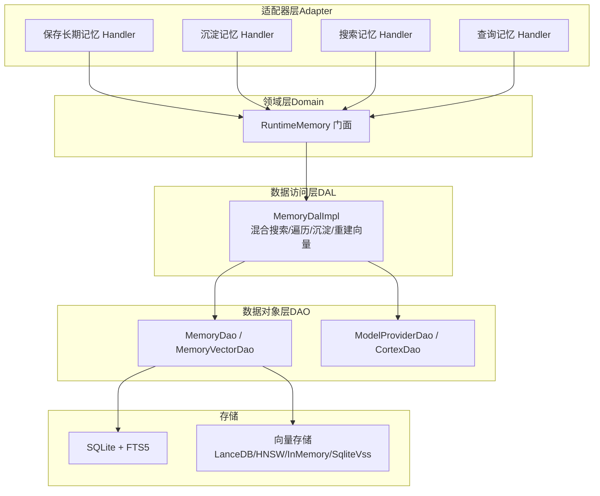
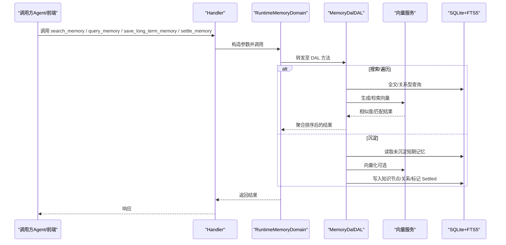
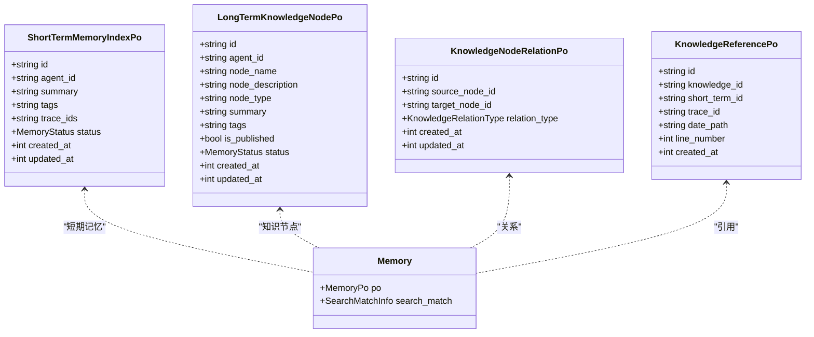
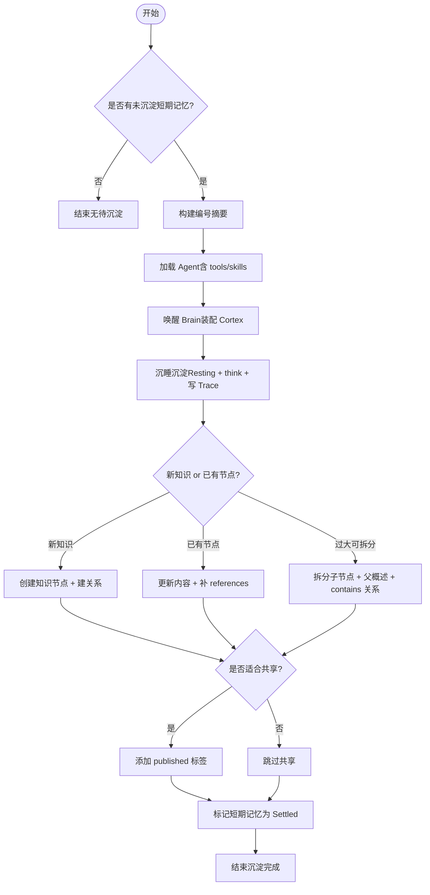
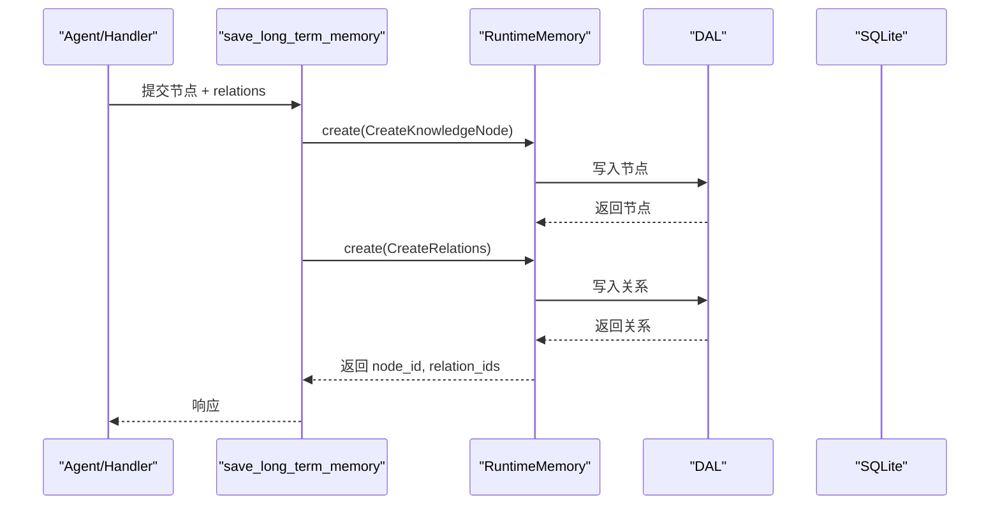
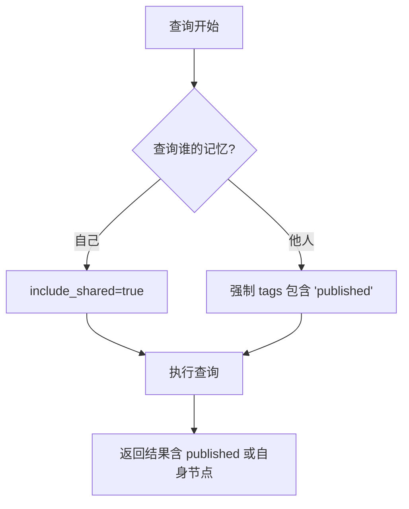
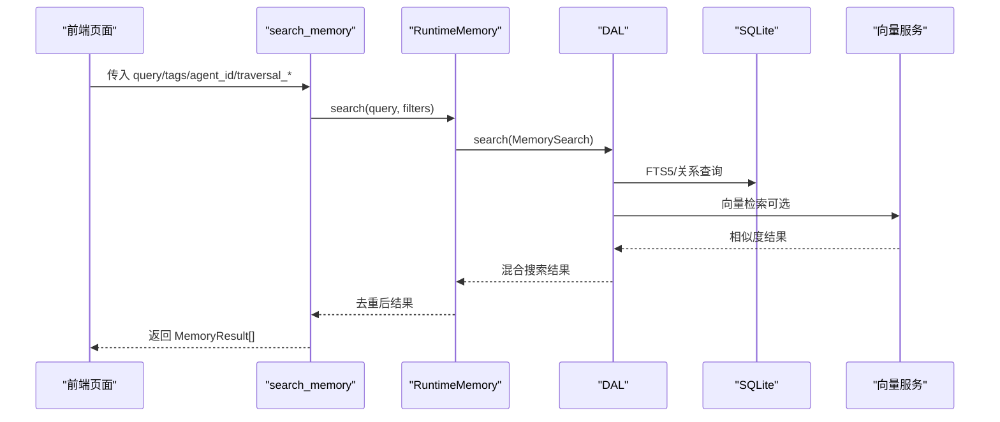
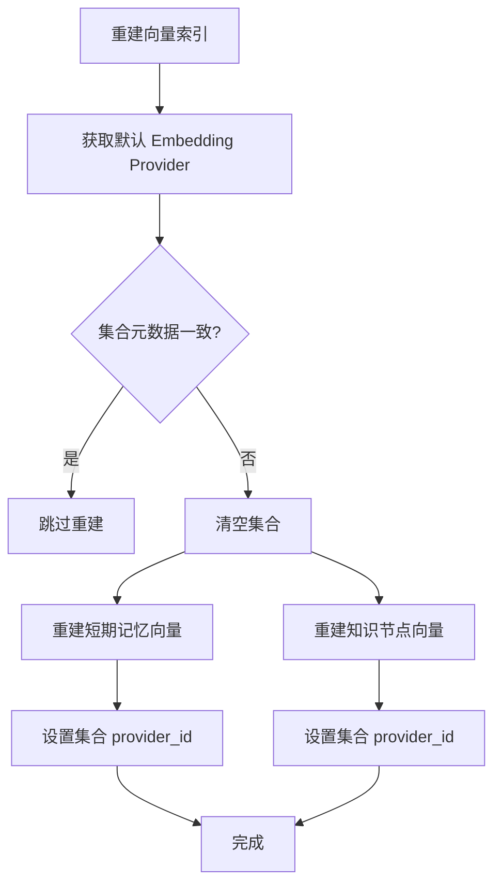
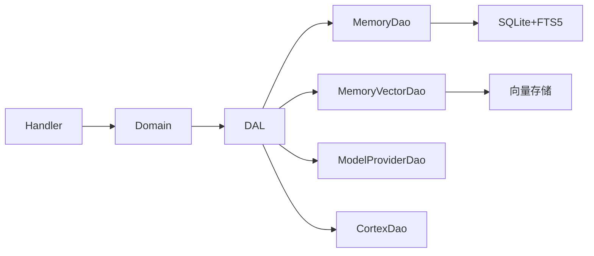

# 长期记忆（Long-term Memory）

<cite>
**本文引用的文件**
- [memory.rs](src/models/memory.rs)
- [memory.rs](common/src/enums/memory.rs)
- [memory.rs](src/service/dal/memory.rs)
- [memory.rs](src/service/domain/runtime/memory.rs)
- [save_long_term_memory.rs](src/handlers/hr/agent/save_long_term_memory.rs)
- [settle_memory.rs](src/handlers/hr/agent/settle_memory.rs)
- [search_memory.rs](src/handlers/hr/agent/search_memory.rs)
- [query_memory.rs](src/handlers/hr/agent/query_memory.rs)
- [knowledge_graph.rs](frontend/src/pages/hr/knowledge_graph.rs)
- [20260724000000_knowledge_node_tags.sql](migrations/20260724000000_knowledge_node_tags.sql)
- [20260731000001_knowledge_node_is_published.sql](migrations/20260731000001_knowledge_node_is_published.sql)
- （2026-09-04 清理：superpowers 目录已归档，待 doc-maintainer 跟进）
- [TEMPLATE_MEMORY_COGNITION/skill.md](src/service/domain/system/seed/skills/TEMPLATE_MEMORY_COGNITION/skill.md)
</cite>

## 目录
1. [简介](#简介)
2. [项目结构](#项目结构)
3. [核心组件](#核心组件)
4. [架构总览](#架构总览)
5. [详细组件分析](#详细组件分析)
6. [依赖关系分析](#依赖关系分析)
7. [性能考虑](#性能考虑)
8. [故障排查指南](#故障排查指南)
9. [结论](#结论)
10. [附录](#附录)

## 简介
本技术文档聚焦“长期记忆层”的知识图谱设计与实现，覆盖以下目标：
- 知识图谱设计：节点类型、关系定义与图谱结构。
- 知识节点创建流程：从短期记忆沉淀到知识提炼的 AI 处理过程。
- 关系管理：实体关系抽取、关系类型分类与图谱更新策略。
- 发布机制：蜂巢共享、权限控制与版本管理。
- 查询 API：节点查询、关系遍历与图谱分析示例。
- 维护策略：定期整理、冲突解决与性能优化。

## 项目结构
长期记忆系统遵循四层单向调用：Adapter（Handler/工具）→ Domain → DAL → DAO，禁止跨层调用与同层互调。PO 仅在 DAO/DAL 内部使用；Domain 输入为 Command/Query，输出业务实体；DAL 对外统一使用业务实体。

图表来源
- [memory.rs:72-177](src/service/dal/memory.rs#L72-L177)
- [memory.rs:11-119](src/service/domain/runtime/memory.rs#L11-L119)
- [save_long_term_memory.rs:21-109](src/handlers/hr/agent/save_long_term_memory.rs#L21-L109)
- [settle_memory.rs:74-123](src/handlers/hr/agent/settle_memory.rs#L74-L123)
- [search_memory.rs:24-153](src/handlers/hr/agent/search_memory.rs#L24-L153)
- [query_memory.rs:21-74](src/handlers/hr/agent/query_memory.rs#L21-L74)

章节来源
- [memory.rs:72-177](src/service/dal/memory.rs#L72-L177)
- [memory.rs:11-119](src/service/domain/runtime/memory.rs#L11-L119)
- [save_long_term_memory.rs:21-109](src/handlers/hr/agent/save_long_term_memory.rs#L21-L109)
- [settle_memory.rs:74-123](src/handlers/hr/agent/settle_memory.rs#L74-L123)
- [search_memory.rs:24-153](src/handlers/hr/agent/search_memory.rs#L24-L153)
- [query_memory.rs:21-74](src/handlers/hr/agent/query_memory.rs#L21-L74)

## 核心组件
- 模型与枚举
  - 短期记忆索引 PO、长期知识节点 PO、知识节点关系 PO、引用 PO、Memory 业务实体。
  - 记忆状态（Active/Settled/Forgotten）、角色（System/User/Assistant/Summary）、关系类型（related/contains/depends/prerequisite/followup/similar/opposite/causes/instance_of/category_of/attribute_of/value_of/custom）。
- DAL 能力
  - 统一混合搜索（关键词 + 向量），通用查询，推荐种子节点，创建/更新/删除，知识图谱遍历（BFS/DFS），短期记忆沉淀为长期知识，向量索引重建。
- Domain 门面
  - RuntimeMemory 暴露 search/query/recommend_seed_nodes/create/update/delete/traverse_graph 等能力给 Handler 和 Agent 工具。
- Handler/工具
  - save_long_term_memory：创建知识节点与关系。
  - settle_memory：触发 Agent 沉睡沉淀，生成摘要并执行沉淀工作流。
  - search_memory：支持按关键词/语义检索，支持图谱遍历扩展结果。
  - query_memory：结构化过滤查询，含权限控制（他人仅见 published）。

章节来源
- [memory.rs:158-320](src/models/memory.rs#L158-L320)
- [memory.rs:12-30](common/src/enums/memory.rs#L12-L30)
- [memory.rs:96-182](common/src/enums/memory.rs#L96-L182)
- [memory.rs:72-177](src/service/dal/memory.rs#L72-L177)
- [memory.rs:11-119](src/service/domain/runtime/memory.rs#L11-L119)
- [save_long_term_memory.rs:21-109](src/handlers/hr/agent/save_long_term_memory.rs#L21-L109)
- [settle_memory.rs:74-123](src/handlers/hr/agent/settle_memory.rs#L74-L123)
- [search_memory.rs:24-153](src/handlers/hr/agent/search_memory.rs#L24-L153)
- [query_memory.rs:21-74](src/handlers/hr/agent/query_memory.rs#L21-L74)

## 架构总览
长期记忆层通过 DAL 编排 DAO 与向量服务，提供统一的搜索、查询、图谱遍历与沉淀能力。Domain 作为门面屏蔽 DAL 细节，Handler/工具通过 Domain 暴露能力。

图表来源
- [memory.rs:72-177](src/service/dal/memory.rs#L72-L177)
- [memory.rs:11-119](src/service/domain/runtime/memory.rs#L11-L119)
- [search_memory.rs:24-153](src/handlers/hr/agent/search_memory.rs#L24-L153)
- [settle_memory.rs:74-123](src/handlers/hr/agent/settle_memory.rs#L74-L123)

## 详细组件分析

### 知识图谱数据模型与结构
- 节点类型
  - 短期记忆索引：用于聚合原始 trace，支持向量化与全文检索。
  - 长期知识节点：经过归纳总结的知识单元，支持 tags 与 published 标签，支持 FTS5 全文索引。
  - 关系：源节点、目标节点与关系类型，独立表便于查询与维护。
  - 引用：记录知识节点对原始短期记忆的引用及位置信息，可追溯。
- 关系类型
  - related/contains/contained_by/depends/depended_by/prerequisite/followup/similar/opposite/causes/caused_by/instance_of/category_of/attribute_of/value_of/custom。
- 图谱结构
  - 以知识节点为顶点、关系为边，支持 BFS/DFS 遍历，支持按 agent_id/tags/status 过滤，支持 published 共享可见性。

图表来源
- [memory.rs:158-320](src/models/memory.rs#L158-L320)
- [memory.rs:12-30](common/src/enums/memory.rs#L12-L30)
- [memory.rs:96-182](common/src/enums/memory.rs#L96-L182)

章节来源
- [memory.rs:158-320](src/models/memory.rs#L158-L320)
- [memory.rs:12-30](common/src/enums/memory.rs#L12-L30)
- [memory.rs:96-182](common/src/enums/memory.rs#L96-L182)

### 知识节点创建流程（AI 沉淀）
- 触发方式
  - 直接调用 save_long_term_memory 创建节点与关系。
  - 调用 settle_memory 进入沉淀模式，由 Agent 在 Resting 状态下自主完成归纳、建节点、建关系、加 published 标签、标记短期记忆为 Settled。
- 沉淀约束
  - 内循环只使用记忆工具，不发送消息；先检索再创建，优先更新旧节点；关系方向精确；及时纠错与拆分大节点；published 谨慎开放。
- 自动沉淀路径
  - DAL 的 settle_short_term_to_long_term：查询 Active 短期记忆 → 创建知识节点 → 标记为 Settled。

图表来源
- [settle_memory.rs:74-123](src/handlers/hr/agent/settle_memory.rs#L74-L123)
- [memory.rs:148-177](src/service/dal/memory.rs#L148-L177)
- [memory.rs:578-652](src/service/dal/memory.rs#L578-L652)
- [TEMPLATE_MEMORY_COGNITION/skill.md:45-109](src/service/domain/system/seed/skills/TEMPLATE_MEMORY_COGNITION/skill.md#L45-L109)

章节来源
- [settle_memory.rs:74-123](src/handlers/hr/agent/settle_memory.rs#L74-L123)
- [memory.rs:148-177](src/service/dal/memory.rs#L148-L177)
- [memory.rs:578-652](src/service/dal/memory.rs#L578-L652)
- [TEMPLATE_MEMORY_COGNITION/skill.md:45-109](src/service/domain/system/seed/skills/TEMPLATE_MEMORY_COGNITION/skill.md#L45-L109)

### 关系管理与图谱更新策略
- 关系抽取
  - Handler 支持批量创建关系，自动生成关系 ID 并持久化。
  - 沉淀过程中建议“两个节点间可多条边描述不同维度”，但单节点总关系数建议小于 10 避免噪声。
- 关系类型分类
  - 预定义多种语义关系（包含、依赖、前置/后续、相似/相反、因果、实例/分类/属性/值等），未知类型回退为 custom。
- 图谱更新策略
  - 新建/更新节点时主动检索关联节点补充关系；发现错误记忆用 update/delete 纠正；推翻旧认知建立 opposite 关系保留痕迹。

图表来源
- [save_long_term_memory.rs:21-109](src/handlers/hr/agent/save_long_term_memory.rs#L21-L109)
- [memory.rs:72-177](src/service/dal/memory.rs#L72-L177)

章节来源
- [save_long_term_memory.rs:21-109](src/handlers/hr/agent/save_long_term_memory.rs#L21-L109)
- [memory.rs:96-182](common/src/enums/memory.rs#L96-L182)
- [TEMPLATE_MEMORY_COGNITION/skill.md:45-109](src/service/domain/system/seed/skills/TEMPLATE_MEMORY_COGNITION/skill.md#L45-L109)

### 发布机制（蜂巢共享、权限控制、版本管理）
- 共享与权限
  - 知识节点通过 tags 中的 "published" 标记表示可共享；is_published 冗余字段加速查询。
  - 查询他人记忆时强制只返回 published 节点；查询自己时可包含 published 共享节点。
  - 搜索时默认 include_shared=true（KnowledgeNode/All），短期记忆私有不可共享。
- 版本管理
  - 当前批次不新增独立 version 字段，通过 name/description/tags 表达版本；必要时后续可扩展。

图表来源
- [query_memory.rs:44-74](src/handlers/hr/agent/query_memory.rs#L44-L74)
- [search_memory.rs:51-53](src/handlers/hr/agent/search_memory.rs#L51-L53)
- [20260731000001_knowledge_node_is_published.sql:1-12](migrations/20260731000001_knowledge_node_is_published.sql#L1-L12)
- （2026-09-04 清理：superpowers 目录已归档，待 doc-maintainer 跟进）

章节来源
- [query_memory.rs:44-74](src/handlers/hr/agent/query_memory.rs#L44-L74)
- [search_memory.rs:51-53](src/handlers/hr/agent/search_memory.rs#L51-L53)
- [20260731000001_knowledge_node_is_published.sql:1-12](migrations/20260731000001_knowledge_node_is_published.sql#L1-L12)
- （2026-09-04 清理：superpowers 目录已归档，待 doc-maintainer 跟进）

### 查询 API 使用示例
- 节点查询
  - 使用 query_memory 按 agent_id/memory_type/tags/status/task_id 过滤；他人查询仅返回 published。
- 关系遍历
  - 使用 search_memory 的 traversal_depth/breadth/strategy/seed_node_ids 进行图谱遍历，支持 BFS/DFS。
- 图谱分析
  - 使用 recommend_seed_nodes 获取 Top N 高连接度节点作为图谱起点；前端可视化展示。

图表来源
- [search_memory.rs:24-153](src/handlers/hr/agent/search_memory.rs#L24-L153)
- [memory.rs:72-177](src/service/dal/memory.rs#L72-L177)

章节来源
- [search_memory.rs:24-153](src/handlers/hr/agent/search_memory.rs#L24-L153)
- [query_memory.rs:21-74](src/handlers/hr/agent/query_memory.rs#L21-L74)
- [memory.rs:88-102](src/service/dal/memory.rs#L88-L102)

### 维护策略（定期整理、冲突解决、性能优化）
- 定期整理
  - 通过 settle_memory 或 CronTrigger agent_rest 周期性触发沉淀；DAL 提供 settle_short_term_to_long_term 自动沉淀路径。
- 冲突解决
  - 更新节点内容并补充 references；对矛盾认知建立 opposite 关系保留历史；拆分大节点降低噪声。
- 性能优化
  - 向量重建：rebuild_vectors 检查 model_provider_id，按需清空集合并重建 short_term/knowledge_node 向量索引。
  - FTS5 索引：tags 纳入 FTS5 虚拟表，提升关键词检索效率；is_published 冗余字段与部分索引加速 published 查询。

图表来源
- [memory.rs:654-799](src/service/dal/memory.rs#L654-L799)
- [20260724000000_knowledge_node_tags.sql:1-77](migrations/20260724000000_knowledge_node_tags.sql#L1-L77)
- [20260731000001_knowledge_node_is_published.sql:1-12](migrations/20260731000001_knowledge_node_is_published.sql#L1-L12)

章节来源
- [memory.rs:654-799](src/service/dal/memory.rs#L654-L799)
- [20260724000000_knowledge_node_tags.sql:1-77](migrations/20260724000000_knowledge_node_tags.sql#L1-L77)
- [20260731000001_knowledge_node_is_published.sql:1-12](migrations/20260731000001_knowledge_node_is_published.sql#L1-L12)

## 依赖关系分析
- 模块耦合
  - Handler 依赖 Domain 门面；Domain 依赖 DAL；DAL 组合多个 DAO（MemoryDao/MemoryVectorDao/ModelProviderDao/CortexDao）。
- 外部依赖
  - SQLite + FTS5 全文检索；向量存储（LanceDB/HNSW/InMemory/SqliteVss）；Embedding Provider。
- 潜在循环
  - 严格单向依赖，无循环；DAO 之间不互相依赖，DAL 编排。

图表来源
- [memory.rs:72-177](src/service/dal/memory.rs#L72-L177)
- [memory.rs:11-119](src/service/domain/runtime/memory.rs#L11-L119)

章节来源
- [memory.rs:72-177](src/service/dal/memory.rs#L72-L177)
- [memory.rs:11-119](src/service/domain/runtime/memory.rs#L11-L119)

## 性能考虑
- 混合搜索优先级：Hybrid > Vector > Keyword/None；组内按向量距离或 BM25 rank 排序。
- 向量重建幂等：基于集合元数据判断是否需要重建，避免重复计算。
- 全文索引增强：tags 纳入 FTS5，is_published 冗余字段与部分索引提升查询效率。
- 图谱遍历限制：max_depth/max_breadth 控制展开规模，防止爆炸式增长。

[本节为通用指导，无需特定文件来源]

## 故障排查指南
- 向量索引失败降级
  - 更新/重建时若向量化失败，记录 warn 日志并继续主流程；检查 Embedding Provider 配置与可用性。
- 沉淀异常
  - 检查是否存在未沉淀短期记忆；确认 Agent 状态空闲；查看沉淀 prompt 与工具可用范围。
- 权限问题
  - 查询他人记忆时仅返回 published；确认 tags 中是否包含 "published"；校验 include_shared 设置。
- 图谱遍历异常
  - 检查 seed_node_ids 是否为空；调整 traversal_depth/breadth；确认关系存在且方向正确。

章节来源
- [memory.rs:392-475](src/service/dal/memory.rs#L392-L475)
- [memory.rs:654-799](src/service/dal/memory.rs#L654-L799)
- [query_memory.rs:44-74](src/handlers/hr/agent/query_memory.rs#L44-L74)
- [search_memory.rs:67-121](src/handlers/hr/agent/search_memory.rs#L67-L121)

## 结论
长期记忆层通过清晰的层次划分与严格的单向依赖，实现了从短期记忆到长期知识的沉淀、关系管理与共享发布。DAL 提供强大的混合搜索、图谱遍历与向量重建能力，Handler/工具暴露简洁接口供 Agent 与前端使用。配合 FTS5 与向量索引优化，系统在准确性与性能上取得平衡。未来可进一步扩展版本管理与更细粒度的权限控制。

[本节为总结，无需特定文件来源]

## 附录
- 前端知识图谱页面
  - 渐进式加载：搜索种子节点 → 点击节点展开关联 → 渲染图结构。
  - 节点类型识别：knowledge_node/short_term/relation 等，标签与摘要展示。

章节来源
- [knowledge_graph.rs:30-56](frontend/src/pages/hr/knowledge_graph.rs#L30-L56)