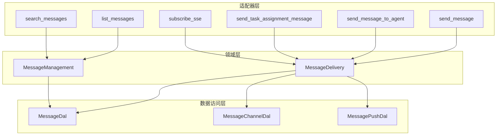
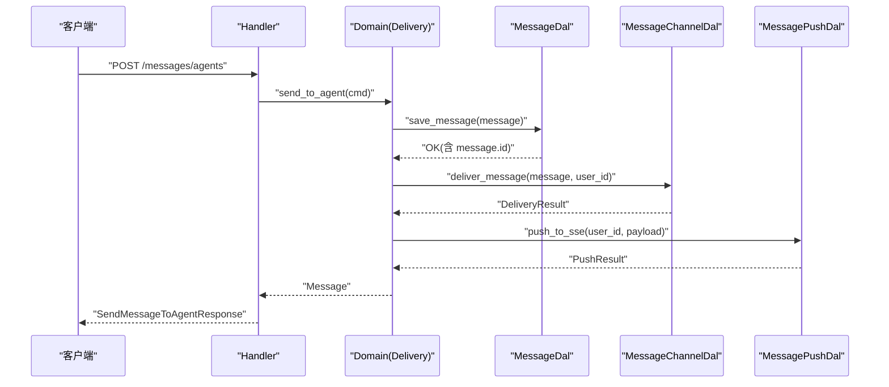
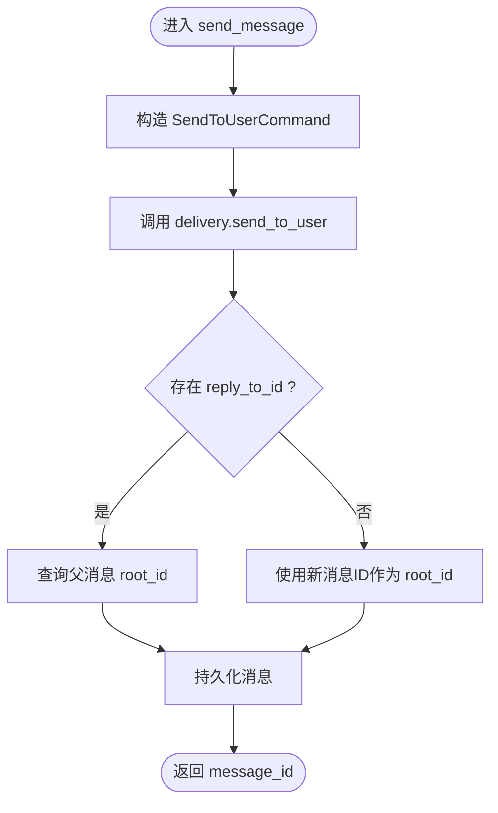
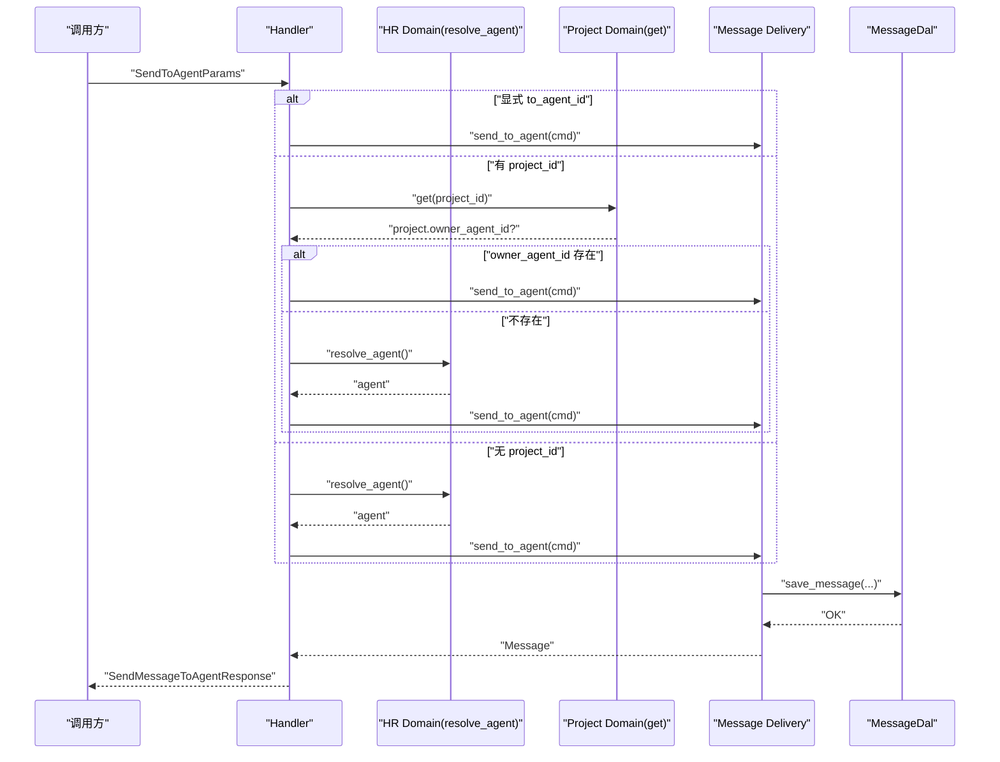
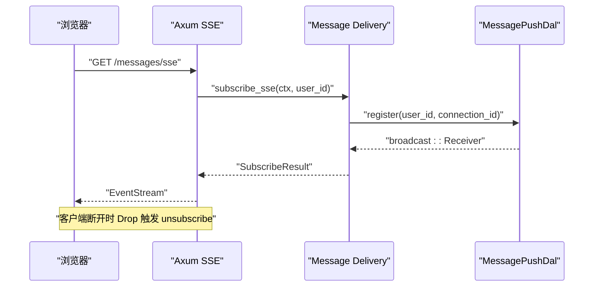
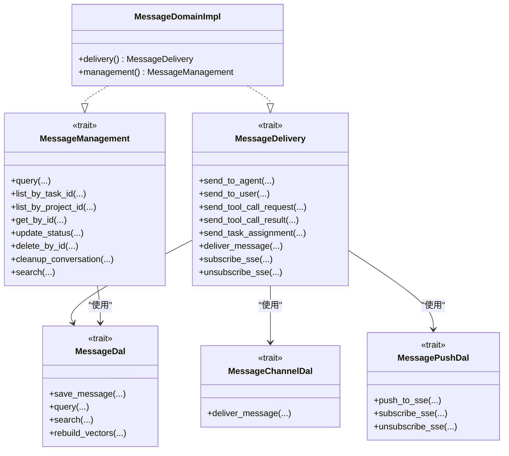

# 消息处理核心

<cite>
**本文引用的文件**
- [send_message.rs](src/handlers/finance/message/send_message.rs)
- [send_message_to_agent.rs](src/handlers/finance/message/send_message_to_agent.rs)
- [send_task_assignment_message.rs](src/handlers/finance/message/send_task_assignment_message.rs)
- [list_messages.rs](src/handlers/finance/message/list_messages.rs)
- [search_messages.rs](src/handlers/finance/message/search_messages.rs)
- [subscribe_sse.rs](src/handlers/finance/message/subscribe_sse.rs)
- [domain/mod.rs](src/service/domain/message/mod.rs)
- [delivery.rs](src/service/domain/message/delivery.rs)
- [management.rs](src/service/domain/message/management.rs)
- [message_dal.rs](src/service/dal/message.rs)
- [message_channel.rs](src/service/dal/message_channel.rs)
- [message_push.rs](src/service/dal/message_push.rs)
</cite>

## 目录
1. [简介](#简介)
2. [项目结构](#项目结构)
3. [核心组件](#核心组件)
4. [架构总览](#架构总览)
5. [详细组件分析](#详细组件分析)
6. [依赖关系分析](#依赖关系分析)
7. [性能考虑](#性能考虑)
8. [故障排查指南](#故障排查指南)
9. [结论](#结论)
10. [附录：API 调用示例与错误处理](#附录api-调用示例与错误处理)

## 简介
本模块为消息处理核心，覆盖消息发送、路由、查询、搜索与 SSE 实时推送。遵循四层单向调用：Adapter（HTTP Handler）→ Domain → DAL → DAO，禁止跨层调用与同层互调；Domain 输入输出使用业务实体与命令/查询对象；DAL 封装持久化与外部能力；DAO 负责具体存储实现。所有公共方法首参为 RequestContext，跨层传递统一 ctx.clone()。

## 项目结构
- Handler 层：暴露 HTTP 接口，构造 Command/Query，调用 Domain。
- Domain 层：消息投递（delivery）与消息管理（management），编排业务规则、上下文增强、事件发布与向量索引。
- DAL 层：消息数据访问（message）、渠道分发（message_channel）、SSE 推送（message_push）。
- DAO 层：SQLite/FTS5/LanceDB/HNSW 等存储与检索实现（由 DAL 内部持有）。

图表来源
- [send_message.rs:1-41](src/handlers/finance/message/send_message.rs#L1-L41)
- [send_message_to_agent.rs:1-98](src/handlers/finance/message/send_message_to_agent.rs#L1-L98)
- [send_task_assignment_message.rs:1-49](src/handlers/finance/message/send_task_assignment_message.rs#L1-L49)
- [list_messages.rs:1-122](src/handlers/finance/message/list_messages.rs#L1-L122)
- [search_messages.rs:1-79](src/handlers/finance/message/search_messages.rs#L1-L79)
- [subscribe_sse.rs:1-93](src/handlers/finance/message/subscribe_sse.rs#L1-L93)
- [domain/mod.rs:1-378](src/service/domain/message/mod.rs#L1-L378)
- [delivery.rs:1-461](src/service/domain/message/delivery.rs#L1-L461)
- [management.rs:1-81](src/service/domain/message/management.rs#L1-L81)
- [message_dal.rs:1-580](src/service/dal/message.rs#L1-L580)
- [message_channel.rs:1-407](src/service/dal/message_channel.rs#L1-L407)
- [message_push.rs:1-163](src/service/dal/message_push.rs#L1-L163)

章节来源
- [domain/mod.rs:1-378](src/service/domain/message/mod.rs#L1-L378)
- [delivery.rs:1-461](src/service/domain/message/delivery.rs#L1-L461)
- [management.rs:1-81](src/service/domain/message/management.rs#L1-L81)
- [message_dal.rs:1-580](src/service/dal/message.rs#L1-L580)
- [message_channel.rs:1-407](src/service/dal/message_channel.rs#L1-L407)
- [message_push.rs:1-163](src/service/dal/message_push.rs#L1-L163)

## 核心组件
- 消息投递（MessageDelivery）
  - send_to_user：发送文本消息给用户，支持 project/task/reply_to 上下文。
  - send_to_agent：发送消息给 Agent，支持附件链、reply_to 继承 root_id、消息类型扩展。
  - send_tool_call_request/result：工具调用请求与结果消息，携带追踪引用与上下文。
  - send_task_assignment：任务分配消息，自动关联 task_id。
  - deliver_message：分发消息到用户已配置的渠道（飞书/微信/Slack/邮件/Webhook/A2A回调），并同步推送到 SSE。
  - subscribe_sse/unsubscribe_sse：订阅/取消订阅 SSE 广播通道。
- 消息管理（MessageManagement）
  - query/list_by_task_id/list_by_project_id/get_by_id/update_status/delete_by_id/cleanup_conversation/search。
- 数据访问（DAL）
  - MessageDal：保存消息、查询、计数、删除、混合搜索（FTS5 + 向量）、重建向量索引。
  - MessageChannelDal：渠道配置管理与按 scope_project 过滤后的多渠道分发。
  - MessagePushDal：SSE 推送、注册/注销连接、统计在线连接数。

章节来源
- [domain/mod.rs:121-377](src/service/domain/message/mod.rs#L121-L377)
- [delivery.rs:51-461](src/service/domain/message/delivery.rs#L51-L461)
- [management.rs:12-81](src/service/domain/message/management.rs#L12-L81)
- [message_dal.rs:124-580](src/service/dal/message.rs#L124-L580)
- [message_channel.rs:131-407](src/service/dal/message_channel.rs#L131-L407)
- [message_push.rs:61-163](src/service/dal/message_push.rs#L61-L163)

## 架构总览

图表来源
- [send_message_to_agent.rs:20-98](src/handlers/finance/message/send_message_to_agent.rs#L20-L98)
- [delivery.rs:51-158](src/service/domain/message/delivery.rs#L51-L158)
- [message_dal.rs:133-193](src/service/dal/message.rs#L133-L193)
- [message_channel.rs:226-284](src/service/dal/message_channel.rs#L226-L284)
- [message_push.rs:73-84](src/service/dal/message_push.rs#L73-L84)

## 详细组件分析

### 发送消息给用户 send_message
- 职责：将文本消息从当前 Agent 发送到指定用户，支持 project/task/reply_to 上下文。
- 流程：
  - Handler 解析参数，构造 SendToUserCommand。
  - Domain.delivery().send_to_user 生成 ID、计算 root_id（继承父消息 root_id 或自身）、写入消息并返回。
- 关键点：
  - reply_to_id 用于构建消息链，root_id 保证对话分组。
  - 通过 enrich_ctx 注入 project/task 上下文，便于后续 AOP/日志/向量索引。

图表来源
- [send_message.rs:9-41](src/handlers/finance/message/send_message.rs#L9-L41)
- [delivery.rs:160-208](src/service/domain/message/delivery.rs#L160-L208)

章节来源
- [send_message.rs:9-41](src/handlers/finance/message/send_message.rs#L9-L41)
- [delivery.rs:160-208](src/service/domain/message/delivery.rs#L160-L208)

### 发送给 Agent 的消息 send_message_to_agent
- 职责：向另一个 AI Agent 发送协作消息，支持默认对话框与 Project 对话框两种场景。
- 路由优先级：
  1) 显式 to_agent_id；
  2) 若提供 project_id，则取 project.owner_agent_id；
  3) 否则 resolve_agent 兜底选择前台 Agent。
- 流程：
  - Handler 解析参数并确定 to_agent_id。
  - 构造 SendToAgentCommand，包含 from_role、attachment_ids、message_type 等。
  - Domain.delivery().send_to_agent 创建根消息与可选附件消息，维护 root_id 链。
- 关键点：
  - 附件消息以 reply_to_id 链接回根消息，确保对话完整性。
  - 支持多种 MessageType（Text/Image/Audio/Video/File）。

图表来源
- [send_message_to_agent.rs:20-98](src/handlers/finance/message/send_message_to_agent.rs#L20-L98)
- [delivery.rs:51-158](src/service/domain/message/delivery.rs#L51-L158)
- [message_dal.rs:133-193](src/service/dal/message.rs#L133-L193)

章节来源
- [send_message_to_agent.rs:20-98](src/handlers/finance/message/send_message_to_agent.rs#L20-L98)
- [delivery.rs:51-158](src/service/domain/message/delivery.rs#L51-L158)

### 任务分配消息 send_task_assignment_message
- 职责：Agent 间任务分配通知，立即返回，接收方在下一轮 awaken 中收到任务分配。
- 流程：
  - Handler 构造 SendTaskAssignmentCommand。
  - Domain.delivery().send_task_assignment 创建 TaskAssignmentMessage，设置 task_id/project_id/from/to。
  - 持久化后返回 message_id。
- 关键点：
  - 消息类型为 TaskAssignment，便于消费者识别与去重。

章节来源
- [send_task_assignment_message.rs:9-49](src/handlers/finance/message/send_task_assignment_message.rs#L9-L49)
- [delivery.rs:332-379](src/service/domain/message/delivery.rs#L332-L379)

### 消息列表 list_messages
- 功能：分页与双向时间游标翻页，支持按 project/task/from/to 过滤。
- 行为：
  - after_timestamp 时按 created_at ASC 拉取新消息；
  - before_timestamp 时按 created_at DESC 拉取历史消息；
  - 同时提供 before/after 可限定时间窗口；
  - limit 默认 10，实际查询会多取一定余量用于前端过滤。
- 输出：消息项列表与 total（当前页数量）。

章节来源
- [list_messages.rs:10-122](src/handlers/finance/message/list_messages.rs#L10-L122)
- [management.rs:12-19](src/service/domain/message/management.rs#L12-L19)
- [message_dal.rs:195-198](src/service/dal/message.rs#L195-L198)

### 消息搜索 search_messages
- 功能：混合搜索（关键词 FTS5 + 向量语义），支持按 project/task/from/to 过滤。
- 行为：
  - 若提供 keyword 且未提供 query_vector，尝试调用嵌入服务生成查询向量；
  - 分别执行关键词匹配与向量匹配，合并并按权重排序（关键词权重更高）；
  - 返回 match_type（keyword/vector/hybrid）、fts_rank、vector_distance 等元信息。
- 输出：搜索结果列表与 total。

章节来源
- [search_messages.rs:11-79](src/handlers/finance/message/search_messages.rs#L11-L79)
- [message_dal.rs:357-572](src/service/dal/message.rs#L357-L572)

### SSE 订阅 subscribe_sse
- 功能：建立 SSE 长连接，实时推送消息。
- 行为：
  - 从 JWT 获取用户 ID，无需路径参数；
  - 订阅 broadcast 通道，返回 receiver；
  - 包装流，客户端断开或服务关闭时自动注销连接，避免内存泄漏；
  - 保持心跳 keep-alive。
- 推送：
  - 当消息被 deliver_message 时，通过 MessagePushDal.push_to_sse 推送给该用户的所有在线连接。

图表来源
- [subscribe_sse.rs:52-93](src/handlers/finance/message/subscribe_sse.rs#L52-L93)
- [delivery.rs:438-459](src/service/domain/message/delivery.rs#L438-L459)
- [message_push.rs:86-99](src/service/dal/message_push.rs#L86-L99)

章节来源
- [subscribe_sse.rs:52-93](src/handlers/finance/message/subscribe_sse.rs#L52-L93)
- [delivery.rs:438-459](src/service/domain/message/delivery.rs#L438-L459)
- [message_push.rs:86-99](src/service/dal/message_push.rs#L86-L99)

## 依赖关系分析

图表来源
- [domain/mod.rs:70-117](src/service/domain/message/mod.rs#L70-L117)
- [domain/mod.rs:277-377](src/service/domain/message/mod.rs#L277-L377)
- [message_dal.rs:49-122](src/service/dal/message.rs#L49-L122)
- [message_channel.rs:63-126](src/service/dal/message_channel.rs#L63-L126)
- [message_push.rs:40-59](src/service/dal/message_push.rs#L40-L59)

章节来源
- [domain/mod.rs:70-117](src/service/domain/message/mod.rs#L70-L117)
- [domain/mod.rs:277-377](src/service/domain/message/mod.rs#L277-L377)
- [message_dal.rs:49-122](src/service/dal/message.rs#L49-L122)
- [message_channel.rs:63-126](src/service/dal/message_channel.rs#L63-L126)
- [message_push.rs:40-59](src/service/dal/message_push.rs#L40-L59)

## 性能考虑
- 向量索引降级：当 Embedding Provider 不可用或失败时，自动降级为仅关键词搜索，不影响可用性。
- 批量与分页：list_messages 采用时间游标与 limit 控制，减少不必要的数据传输。
- SSE 资源清理：通过 CleanupStream 的 Drop 钩子确保连接及时释放，防止内存泄漏。
- 搜索合并策略：关键词与向量结果按权重合并，提升相关性同时限制 top_k。

[本节为通用指导，不直接分析具体文件]

## 故障排查指南
- 缺少组织/用户上下文：list_messages/search_messages 会在缺少 organization_id 或 uid 时报错。
- 附件权限校验：send_to_agent 中若附件不属于当前用户，将拒绝。
- 向量索引失败：DAL 层记录警告并降级，不影响主流程。
- 渠道推送失败：MessageChannelDal 记录每个渠道的成功/失败详情，便于定位。
- SSE 连接泄漏：确认客户端断开后是否触发 unsubscribe_sse；服务端 keep-alive 间隔合理。

章节来源
- [list_messages.rs:29-36](src/handlers/finance/message/list_messages.rs#L29-L36)
- [search_messages.rs:23-30](src/handlers/finance/message/search_messages.rs#L23-L30)
- [delivery.rs:84-98](src/service/domain/message/delivery.rs#L84-L98)
- [message_dal.rs:150-193](src/service/dal/message.rs#L150-L193)
- [message_channel.rs:262-284](src/service/dal/message_channel.rs#L262-L284)
- [subscribe_sse.rs:73-85](src/handlers/finance/message/subscribe_sse.rs#L73-L85)

## 结论
消息处理核心围绕“发送—路由—存储—检索—推送”形成闭环。通过 Domain 抽象出投递与管理两大能力，DAL 封装多渠道与 SSE 推送，Handler 聚焦参数转换与上下文注入。整体设计清晰、可扩展性强，具备降级与容错能力，适合在多 Agent 协作场景中稳定运行。

[本节为总结性内容，不直接分析具体文件]

## 附录：API 调用示例与错误处理

- 发送消息给用户 send_message
  - 请求：POST /api/v1/messages
  - 参数：to_user_id、content、project_id（可选）、task_id（可选）、reply_to_id（可选）
  - 响应：{ message_id }
  - 错误：InvalidRequest（缺少上下文）、ResourceNotFound（附件不存在）

- 发送给 Agent 的消息 send_message_to_agent
  - 请求：POST /api/v1/messages/agents
  - 参数：to_agent_id（可选）、content、project_id（可选）、task_id（可选）、reply_to_id（可选）、attachment_ids（可选）、message_type（默认 Text）
  - 响应：{ message_id }
  - 错误：not_found（Project 不存在/无可用前台 Agent）、InvalidRequest（参数非法）

- 任务分配消息 send_task_assignment_message
  - 请求：POST /api/v1/messages/tasks
  - 参数：task_id、task_title、task_description（可选）、from_id、from_role、to_agent_id、project_id（可选）
  - 响应：{ message_id }
  - 错误：Internal（序列化失败）

- 消息列表 list_messages
  - 请求：GET /api/v1/messages
  - 参数：limit（默认 10）、before_timestamp（可选）、after_timestamp（可选）、project_id（可选）、task_id（可选）、from_id（可选）、to_id（可选）
  - 响应：{ messages[], total }
  - 错误：InvalidRequest（缺少组织/用户上下文）

- 消息搜索 search_messages
  - 请求：POST /api/v1/finance/messages/search
  - 参数：keyword（可选）、limit（可选）、project_id（可选）、task_id（可选）、from_id（可选）、to_id（可选）
  - 响应：{ messages[], total }，每条消息含 match_type、fts_rank、vector_distance
  - 错误：InvalidRequest（缺少组织/用户上下文）

- SSE 订阅 subscribe_sse
  - 请求：GET /api/v1/finance/messages/sse
  - 认证：JWT Cookie
  - 响应：EventStream，包含 keep-alive 心跳
  - 错误：连接异常时自动断开并触发注销

章节来源
- [send_message.rs:9-41](src/handlers/finance/message/send_message.rs#L9-L41)
- [send_message_to_agent.rs:20-98](src/handlers/finance/message/send_message_to_agent.rs#L20-L98)
- [send_task_assignment_message.rs:9-49](src/handlers/finance/message/send_task_assignment_message.rs#L9-L49)
- [list_messages.rs:10-122](src/handlers/finance/message/list_messages.rs#L10-L122)
- [search_messages.rs:11-79](src/handlers/finance/message/search_messages.rs#L11-L79)
- [subscribe_sse.rs:52-93](src/handlers/finance/message/subscribe_sse.rs#L52-L93)