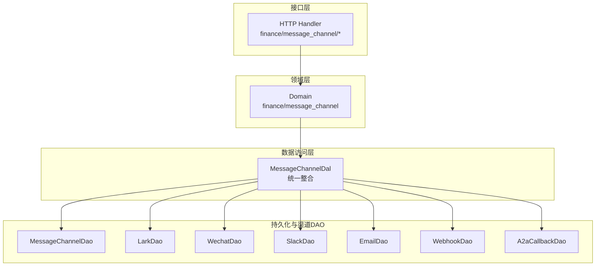
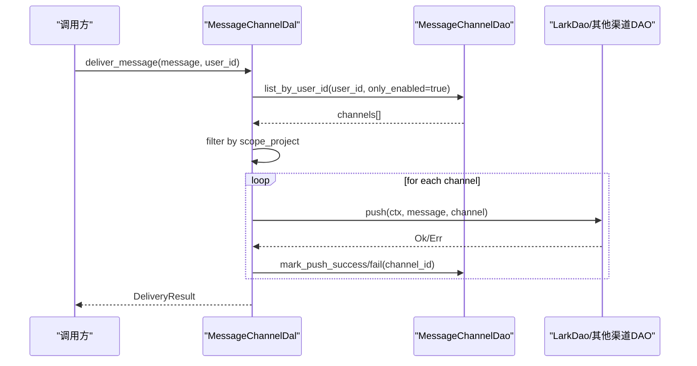
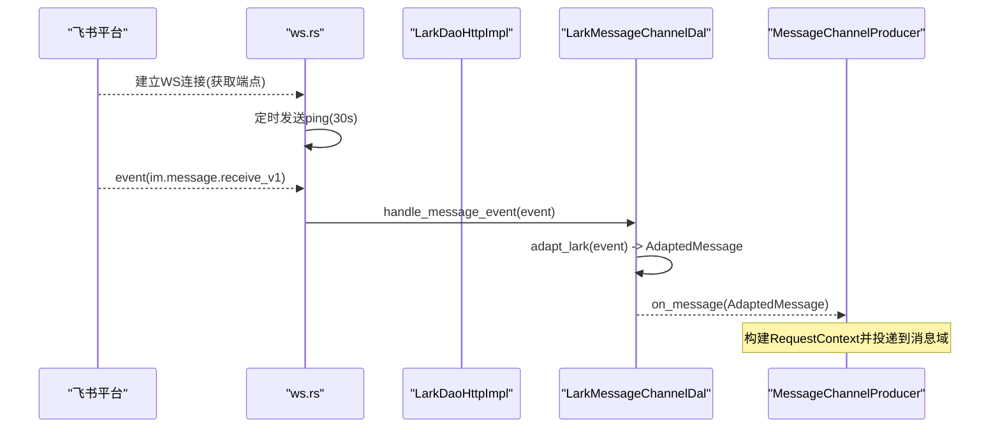
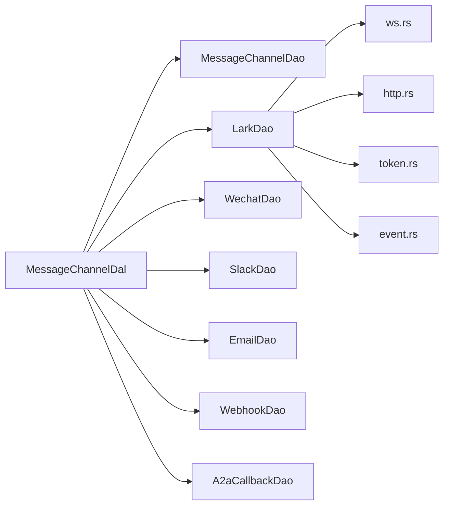

# 消息渠道适配器

<cite>
**本文引用的文件**
- [common/src/enums/message_channel.rs](common/src/enums/message_channel.rs)
- [src/models/message_channel.rs](src/models/message_channel.rs)
- [src/service/dal/message_channel.rs](src/service/dal/message_channel.rs)
- [src/service/dao/lark/mod.rs](src/service/dao/lark/mod.rs)
- [src/service/dao/lark/http.rs](src/service/dao/lark/http.rs)
- [src/service/dao/lark/ws.rs](src/service/dao/lark/ws.rs)
- [src/service/dal/lark.rs](src/service/dal/lark.rs)
- [src/handlers/finance/message_channel/update_message_channel.rs](src/handlers/finance/message_channel/update_message_channel.rs)
- [common/src/api/message_channel.rs](common/src/api/message_channel.rs)
- [src/producer/message_channel.rs](src/producer/message_channel.rs)
- [migrations/20260508000000_message_channels.sql](migrations/20260508000000_message_channels.sql)
- [docs/archive/design-archive/message_channel_design.md](docs/archive/design-archive/message_channel_design.md)
- [src/pkg/adapter/message_inbound.rs](src/pkg/adapter/message_inbound.rs)
- [src/consumer/lark_event_dispatcher.rs](src/consumer/lark_event_dispatcher.rs)

**本文关联三类文档（四类互引闭环）**
- 【① Design 决策快照】
  - [message_channel_design.md](docs/archive/design-archive/message_channel_design.md) — 渠道架构：入站适配中台 + 出站推送 + 凭证引用
  - [lark_cli_integration.md](docs/archive/design-archive/lark_cli_integration.md) — 飞书 WS 指数退避 + 凭证用户级管理
- 【② Plan 落地快照（真实定稿）】
  - [飞书P2P消息集成.md](docs/archive/plan-archive/飞书P2P消息集成.md) — v4 AOP 入站中台落地 + 飞书私信双向闭环
  - [lark-cli_集成二期.md](docs/archive/plan-archive/lark-cli_集成二期.md) — 凭证用户级 + OAuth 身份 + WS 稳定性增强
- 【④ RAG 原子知识卡（Batch4 新增 2 张）】
  - [消息渠道入站适配中台：MessageInboundAdapter trait + MessageAdapterRegistry 全局注册 + start_all stop_all 生命周期](docs/wiki/knowledge/zh/消息渠道入站适配中台：MessageInboundAdapter%20trait%20+%20MessageAdapterRegistry%20全局注册%20+%20start_all%20stop_all%20生命周期/消息渠道入站适配中台：MessageInboundAdapter%20trait%20+%20MessageAdapterRegistry%20全局注册%20+%20start_all%20stop_all%20生命周期.md) — pkg/adapter 纯基础设施抽象 + start_all 非 fail-fast
  - [Lark P2P WS 私信入站：身份凭证引用解析 + app_id 聚合 WS + open_id 自动映射 + LarkWsMetrics 健康指标](docs/wiki/knowledge/zh/Lark%20P2P%20WS%20私信入站：身份凭证引用解析%20+%20app_id%20聚合%20WS%20+%20open_id%20自动映射%20+%20LarkWsMetrics%20健康指标/Lark%20P2P%20WS%20私信入站：身份凭证引用解析%20+%20app_id%20聚合%20WS%20+%20open_id%20自动映射%20+%20LarkWsMetrics%20健康指标.md) — 飞书双向闭环（凭证解析→WS聚合→用户映射→健康指标）
- 【③ Wiki 关联长文】
  - [消息渠道管理.md](docs/wiki/zh/content/功能模块/消息系统/消息渠道管理.md) — 渠道生命周期 CRUD + 凭证解析联动
  - [飞书集成系统.md](docs/wiki/zh/content/核心模块/服务层/领域层/财务领域/飞书集成系统.md) — 飞书多应用化 + OAuth 设备流 + WS 健康指标聚合
  - [多渠道消息系统.md](docs/wiki/zh/content/项目概述/核心功能特性/多渠道消息系统/多渠道消息系统.md) — 多渠道系统整体架构与出站推送链路
</cite>

## 目录
1. [简介](#简介)
2. [项目结构](#项目结构)
3. [核心组件](#核心组件)
4. [架构总览](#架构总览)
5. [详细组件分析](#详细组件分析)
6. [依赖关系分析](#依赖关系分析)
7. [性能与可靠性](#性能与可靠性)
8. [故障排查指南](#故障排查指南)
9. [结论](#结论)
10. [附录：API 使用示例](#附录api-使用示例)

## 简介
本文件面向“消息渠道适配器系统”，系统性说明渠道注册、配置管理、连接管理与消息分发的整体设计，重点覆盖飞书 P2P 私信的 WebSocket 长连接建立、维护、重连策略与出站消息推送；同时给出扩展新渠道（微信、Slack、Webhook、邮件等）的开发指南与最佳实践，并说明渠道生命周期管理（创建、更新、测试连接、启用禁用）、安全存储与权限控制要点，以及渠道管理的 API 使用示例。

## 项目结构
消息渠道相关代码遵循严格分层：Adapter（HTTP Handler / 入站回调 Adapter / AOP Producer）→ Domain → DAL → DAO。渠道枚举与 DTO 位于 common 层；模型实体在 models；DAL 统一整合配置管理与消息分发；DAO 按渠道拆分独立实现；Handler 仅做请求解析与编排。

图表来源
- [src/service/dal/message_channel.rs:60-126](src/service/dal/message_channel.rs#L60-L126)
- [src/service/dal/message_channel.rs:130-142](src/service/dal/message_channel.rs#L130-L142)
- [src/service/dal/message_channel.rs:299-313](src/service/dal/message_channel.rs#L299-L313)

章节来源
- [docs/message_channel_design.md:235-474](docs/message_channel_design.md#L235-L474)
- [src/service/dal/message_channel.rs:1-126](src/service/dal/message_channel.rs#L1-L126)

## 核心组件
- 渠道类型与状态枚举：定义支持的渠道类型与状态流转规则。
- 渠道实体与配置：MessageChannel 业务实体与 ChannelConfig 扩展配置。
- DAL 统一整合：提供渠道 CRUD、查询、状态切换、连接测试与消息分发。
- 渠道 DAO：各渠道独立的 HTTP/WS 实现，包含推送、测试与事件监听能力。
- 飞书 P2P 适配：WebSocket 长连接、心跳、事件解析与出站消息发送。
- 入站适配与生产者：将外部事件转换为内部消息并投递到消息域。

章节来源
- [common/src/enums/message_channel.rs:9-122](common/src/enums/message_channel.rs#L9-L122)
- [src/models/message_channel.rs:19-113](src/models/message_channel.rs#L19-L113)
- [src/service/dal/message_channel.rs:60-126](src/service/dal/message_channel.rs#L60-L126)
- [src/service/dao/lark/mod.rs:26-82](src/service/dao/lark/mod.rs#L26-L82)
- [src/service/dal/lark.rs:89-226](src/service/dal/lark.rs#L89-L226)
- [src/producer/message_channel.rs:11-38](src/producer/message_channel.rs#L11-L38)

## 架构总览
系统采用纯 match 分发模式，DAL 聚合所有渠道 DAO，新增渠道只需在匹配分支中增加一行，编译期即可保证完整性。消息分发时先查询用户启用的渠道并按 scope_project 过滤，再逐个调用对应 DAO 推送，最后记录成功或失败详情。

图表来源
- [src/service/dal/message_channel.rs:226-284](src/service/dal/message_channel.rs#L226-L284)
- [src/service/dal/message_channel.rs:315-335](src/service/dal/message_channel.rs#L315-L335)

章节来源
- [src/service/dal/message_channel.rs:226-335](src/service/dal/message_channel.rs#L226-L335)

## 详细组件分析

### 渠道类型与状态
- ChannelType：支持 Lark、Wechat、Slack、Email、Webhook、A2aCallback，并提供 i32 互转与字符串表示。
- ChannelStatus：Deleted、Active、Disabled，提供可用目标状态与迁移校验。

章节来源
- [common/src/enums/message_channel.rs:9-122](common/src/enums/message_channel.rs#L9-L122)

### 渠道实体与配置
- MessageChannel 包裹 PO，提供 id/user_id/agent_id/channel_type/status/is_enabled 等便捷方法，以及状态迁移 available_statuses/can_transition_to/transition_status。
- ChannelConfig 集中存放各渠道扩展字段（如 lark_open_id、wechat_open_id、email_*、slack_*、webhook_*），通过 JSON 序列化持久化。

章节来源
- [src/models/message_channel.rs:19-113](src/models/message_channel.rs#L19-L113)
- [src/models/message_channel.rs:197-255](src/models/message_channel.rs#L197-L255)

### DAL：渠道配置与消息分发
- 配置管理：create/update/delete/get/list/query/set_status/test_channel。
- 消息分发：deliver_message 查询启用渠道、按 scope_project 过滤、逐渠道 push、记录结果。
- 纯 match 分发：push_to_channel 根据 channel_type 路由至具体 DAO，新增渠道需在此处添加分支。

章节来源
- [src/service/dal/message_channel.rs:60-126](src/service/dal/message_channel.rs#L60-L126)
- [src/service/dal/message_channel.rs:202-222](src/service/dal/message_channel.rs#L202-L222)
- [src/service/dal/message_channel.rs:226-335](src/service/dal/message_channel.rs#L226-L335)

### 飞书 P2P 私信：入站与出站
- 入站事件监听：
  - 通过 ws 模块获取飞书 WS 端点，建立连接，启动心跳任务（每 30s 发送 ping）。
  - 接收事件后仅处理 im.message.receive_v1 文本 P2P 消息，回调 LarkEventHandler。
  - 错误与关闭均被捕获并记录日志，不中断循环。
- 出站消息推送：
  - 从 channel.config().lark_open_id 取目标用户 open_id。
  - 获取 tenant_access_token（带缓存与提前刷新），调用 IM 文本消息接口发送。
- 适配桥接：
  - LarkMessageChannelDal 实现 MessageInboundAdapter，注册到消息适配中台。
  - 将 LarkMessageEvent 适配为 AdaptedMessage，交由上层 consumer 路由到 Agent。

图表来源
- [src/service/dao/lark/ws.rs:92-143](src/service/dao/lark/ws.rs#L92-L143)
- [src/service/dao/lark/ws.rs:145-228](src/service/dao/lark/ws.rs#L145-L228)
- [src/service/dao/lark/ws.rs:230-279](src/service/dao/lark/ws.rs#L230-L279)
- [src/service/dal/lark.rs:148-226](src/service/dal/lark.rs#L148-L226)
- [src/producer/message_channel.rs:25-38](src/producer/message_channel.rs#L25-L38)

章节来源
- [src/service/dao/lark/mod.rs:26-82](src/service/dao/lark/mod.rs#L26-L82)
- [src/service/dao/lark/http.rs:80-216](src/service/dao/lark/http.rs#L80-L216)
- [src/service/dao/lark/http.rs:221-288](src/service/dao/lark/http.rs#L221-L288)
- [src/service/dao/lark/ws.rs:1-298](src/service/dao/lark/ws.rs#L1-L298)
- [src/service/dal/lark.rs:49-73](src/service/dal/lark.rs#L49-L73)
- [src/service/dal/lark.rs:89-226](src/service/dal/lark.rs#L89-L226)
- [src/producer/message_channel.rs:11-38](src/producer/message_channel.rs#L11-L38)

### 渠道生命周期管理
- 创建/更新/删除/查询：由 DAL 暴露统一方法，Handler 负责参数解析与归属校验。
- 状态切换：通过 MessageChannel::transition_status 校验可迁移状态，禁止从 Deleted 恢复。
- 测试连接：test_channel 按 channel_type 分发到对应 DAO 的 test_connection。
- 启用/禁用：set_channel_status 持久化状态变更。

章节来源
- [src/service/dal/message_channel.rs:67-107](src/service/dal/message_channel.rs#L67-L107)
- [src/service/dal/message_channel.rs:202-222](src/service/dal/message_channel.rs#L202-L222)
- [src/models/message_channel.rs:67-107](src/models/message_channel.rs#L67-L107)

### 扩展新渠道（微信、Slack、Webhook、邮件等）
- 步骤：
  1) 在 service/dao 下新建渠道子模块，实现 push/test_connection 等方法。
  2) 在 MessageChannelDalImpl 中添加该 DAO 字段。
  3) 在 push_to_channel 与 test_channel 的 match 分支中加入新渠道。
  4) 如需入站事件，实现 MessageInboundAdapter 并注册到适配中台。
- 约束：
  - 保持无 trait 抽象，纯 match 分发。
  - 错误统一为 AppError，不引入独立错误类型。
  - 新增渠道漏加分支会导致编译失败，确保完备性。

章节来源
- [docs/message_channel_design.md:478-614](docs/message_channel_design.md#L478-L614)
- [src/service/dal/message_channel.rs:299-313](src/service/dal/message_channel.rs#L299-L313)

### 安全存储与权限控制
- 敏感字段：access_token、secret、config_json 中的密码/密钥等，响应 DTO 以布尔位（has_access_token、has_secret、has_config_secret）表达存在性，避免明文泄露。
- 权限：Handler 基于 RequestContext 的组织与用户上下文进行归属校验，确保只能操作自身或授权范围内的渠道。
- 加密：当前设计文档指出初期明文存储，后续统一接入加密层。

章节来源
- [common/src/api/message_channel.rs:242-314](common/src/api/message_channel.rs#L242-L314)
- [docs/message_channel_design.md:148-153](docs/message_channel_design.md#L148-L153)

## 依赖关系分析
- DAL 对 DAO 单向依赖，DAO 之间相互独立。
- 飞书模块内部分为 http/token/ws/event/error，职责清晰。
- 入站适配通过 MessageInboundAdapter 注册到消息适配中台，由 consumer 统一启停。

图表来源
- [src/service/dal/message_channel.rs:130-142](src/service/dal/message_channel.rs#L130-L142)
- [src/service/dao/lark/mod.rs:16-24](src/service/dao/lark/mod.rs#L16-L24)

章节来源
- [src/service/dal/message_channel.rs:130-142](src/service/dal/message_channel.rs#L130-L142)
- [src/service/dao/lark/mod.rs:1-24](src/service/dao/lark/mod.rs#L1-L24)

## 性能与可靠性
- 令牌缓存：tenant_access_token 带缓存与提前刷新，减少重复鉴权开销。
- 并发推送：deliver_message 顺序遍历但每个渠道 push 为异步 IO，失败隔离且不影响主流程。
- 心跳保活：WS 每 30s 发送 ping，服务端关闭或网络异常会优雅退出并重连（由上层消费端或调度器负责重启）。
- 范围过滤：按 scope_project 过滤渠道，减少不必要推送。

章节来源
- [src/service/dao/lark/http.rs:80-100](src/service/dao/lark/http.rs#L80-L100)
- [src/service/dal/message_channel.rs:234-284](src/service/dal/message_channel.rs#L234-L284)
- [src/service/dao/lark/ws.rs:174-195](src/service/dao/lark/ws.rs#L174-L195)

## 故障排查指南
- 飞书 WS 连接失败：检查 app_id/app_secret 是否有效，确认 WS 端点返回正常；查看日志中 ws_endpoint 与 connect 错误。
- 推送失败：确认 channel.config().lark_open_id 已配置；检查 last_error 字段；验证 token 是否过期。
- Webhook 未实现：当前通用 Webhook 返回 unsupported_operation，集成测试断言 failed=1；实现后改为 success=1。
- 状态不可用：检查 transition_status 是否允许目标状态；Deleted 为终态不可通过状态接口恢复。

章节来源
- [src/service/dao/lark/ws.rs:92-143](src/service/dao/lark/ws.rs#L92-L143)
- [src/service/dao/lark/http.rs:221-258](src/service/dao/lark/http.rs#L221-L258)
- [docs/message_channel_design.md:23-36](docs/message_channel_design.md#L23-L36)
- [src/models/message_channel.rs:67-107](src/models/message_channel.rs#L67-L107)

## 结论
消息渠道适配器系统以 DAL 统一整合、DAO 独立实现的架构，结合纯 match 分发机制，实现了可扩展、可测试、可观测的消息渠道体系。飞书 P2P 私信通过 WebSocket 长连接与心跳保活完成入站事件接收，并通过 HTTP 接口完成出站消息推送。系统提供了完善的渠道生命周期管理与安全脱敏响应，便于扩展更多渠道并保持编译期安全保障。

## 附录：API 使用示例
以下列出渠道管理常用接口及用途（实际路径与参数以 Handler 与 DTO 为准）：
- 创建渠道：POST /api/v1/finance/message-channels，携带 CreateMessageChannelRequest。
- 查询渠道列表：GET /api/v1/finance/message-channels，支持 user_id、agent_id、channel_type、only_enabled、分页。
- 查询单个渠道：GET /api/v1/finance/message-channels/{id}。
- 更新渠道：PUT /api/v1/finance/message-channels/{id}，支持增量更新各渠道配置字段。
- 更新状态：PUT /api/v1/finance/message-channels/{id}/status，携带 ChannelStatus。
- 测试连接：POST /api/v1/finance/message-channels/{id}/test，触发对应渠道的 test_connection。

章节来源
- [docs/message_channel_design.md:52-69](docs/message_channel_design.md#L52-L69)
- [common/src/api/message_channel.rs:9-228](common/src/api/message_channel.rs#L9-L228)
- [src/handlers/finance/message_channel/update_message_channel.rs:64-103](src/handlers/finance/message_channel/update_message_channel.rs#L64-L103)