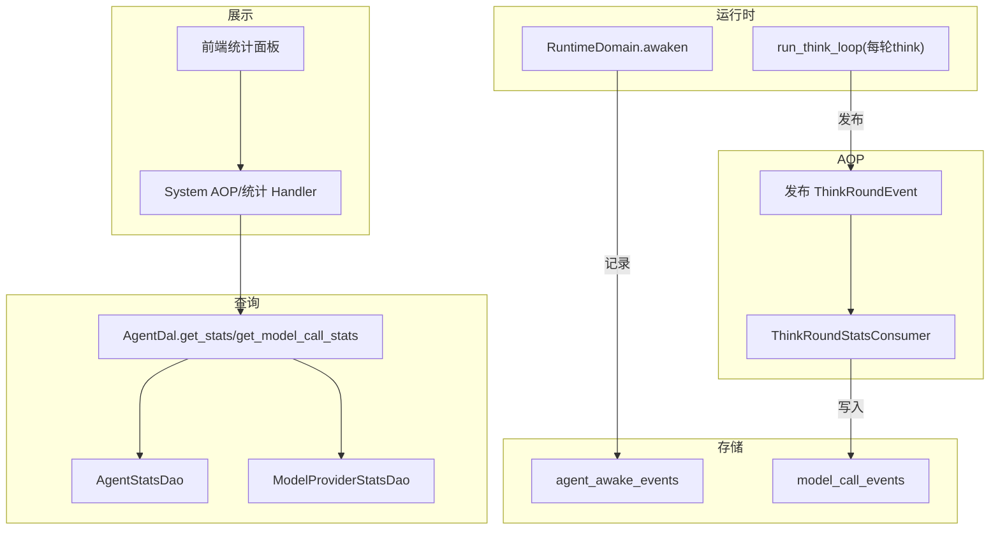
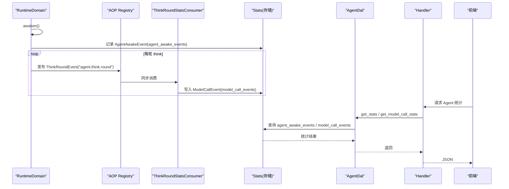
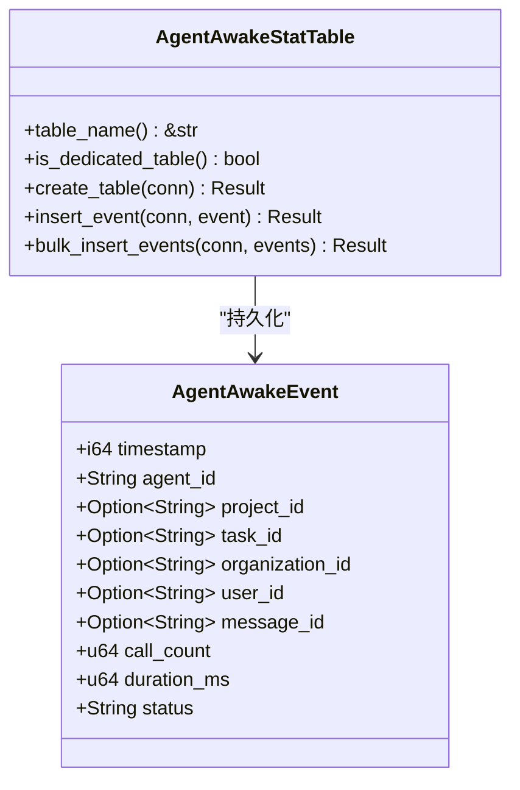
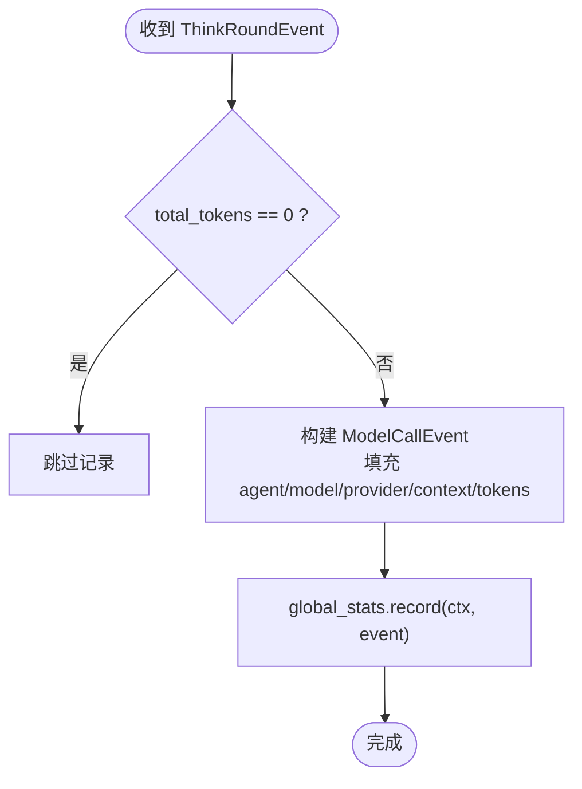
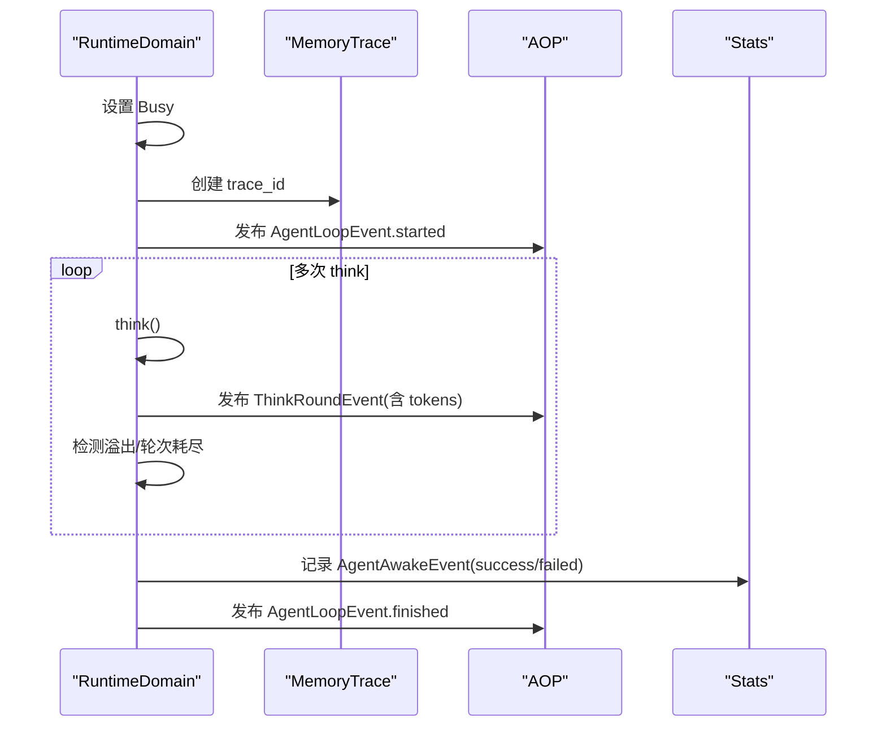
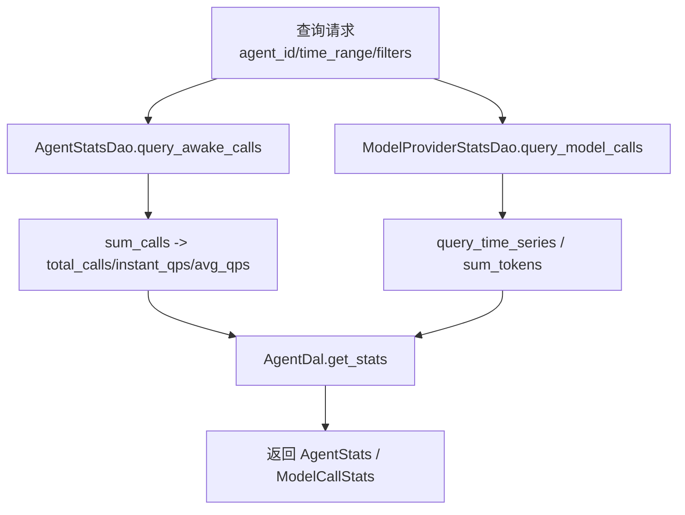
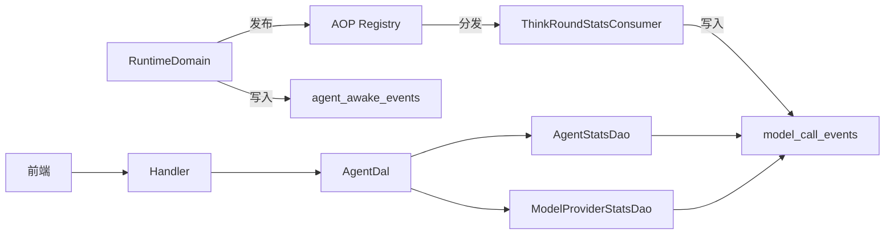

# Agent 维度统计

<cite>
**本文引用的文件**
- [src/pkg/stats/agent_awake.rs](src/pkg/stats/agent_awake.rs)
- [src/consumer/think_round_stats_consumer.rs](src/consumer/think_round_stats_consumer.rs)
- [src/models/events/think_round.rs](src/models/events/think_round.rs)
- [src/service/domain/runtime/awakening.rs](src/service/domain/runtime/awakening.rs)
- [docs/stats_query_design.md](docs/stats_query_design.md)
- [src/service/dal/agent/mod.rs](src/service/dal/agent/mod.rs)
- [src/handlers/system/aop_stats.rs](src/handlers/system/aop_stats.rs)
- [src/consumer/aop_stats_collector.rs](src/consumer/aop_stats_collector.rs)
- [src/consumer/aop_stats_hook.rs](src/consumer/aop_stats_hook.rs)
- [frontend/src/components/stats.rs](frontend/src/components/stats.rs)
- [DuckDB 多维统计双层互补：record_event! 宏自动表推断 + RuntimeStatsCollector 内存滑动窗口 + 5 维度开箱即用表](docs/wiki/knowledge/zh/DuckDB 多维统计双层互补：record_event! 宏自动表推断 + RuntimeStatsCollector 内存滑动窗口 + 5 维度开箱即用表/DuckDB 多维统计双层互补：record_event! 宏自动表推断 + RuntimeStatsCollector 内存滑动窗口 + 5 维度开箱即用表.md)
</cite>

## 目录
1. [简介](#简介)
2. [项目结构](#项目结构)
3. [核心组件](#核心组件)
4. [架构总览](#架构总览)
5. [详细组件分析](#详细组件分析)
6. [依赖关系分析](#依赖关系分析)
7. [性能考量](#性能考量)
8. [故障排查指南](#故障排查指南)
9. [结论](#结论)
10. [附录](#附录)

## 简介
本文件围绕“Agent 维度统计”展开，系统说明 Agent 唤醒、思考轮次、状态变化等核心指标的采集机制与查询使用方式。重点解释：
- AgentAwakeEvent 的采集点、字段含义与持久化表；
- ThinkRoundStatsConsumer 如何消费每轮 think 事件并落库模型调用指标；
- 基于 Stats DAO/DAL 的查询接口设计（按时间范围、Agent ID、状态等维度）；
- 前端可视化展示与报表能力；
- 性能优化策略与数据归档建议。

## 项目结构
Agent 统计涉及“事件定义 → AOP 发布 → Consumer 消费 → 存储 → DAO/DAL 查询 → Handler 暴露 → 前端渲染”的完整链路。关键位置如下：
- 事件与存储：Agent 唤醒事件在 pkg/stats 中定义并绑定专用表；思考轮次事件在 models/events 中定义并通过 AOP 同步转发。
- 采集点：RuntimeDomain.awaken 记录唤醒事件；run_think_loop 每轮 think 后发布 ThinkRoundEvent。
- 消费者：ThinkRoundStatsConsumer 订阅 agent.think.round 并将 token 用量写入模型调用统计表。
- 查询层：stats_query_design 定义了领域化的 Stats DAO（Agent/Project/Task/Tool/ModelProvider），DAL 组合查询并提供统一接口。
- 展示层：Handler 暴露统计查询端点，前端通过组件渲染卡片与时序图。

图表来源
- [src/service/domain/runtime/awakening.rs:415-748](src/service/domain/runtime/awakening.rs#L415-L748)
- [src/consumer/think_round_stats_consumer.rs:29-72](src/consumer/think_round_stats_consumer.rs#L29-L72)
- [docs/stats_query_design.md:195-361](docs/stats_query_design.md#L195-L361)

章节来源
- [src/service/domain/runtime/awakening.rs:415-748](src/service/domain/runtime/awakening.rs#L415-L748)
- [docs/stats_query_design.md:195-361](docs/stats_query_design.md#L195-L361)

## 核心组件
- AgentAwakeEvent：用于记录 Agent 每次唤醒（消息消费触发）的调用次数、耗时、状态等指标，绑定专用表 agent_awake_events。
- ThinkRoundEvent：描述每轮 think 的轮次、耗时、是否触发工具调用、token 用量及上下文信息。
- ThinkRoundStatsConsumer：订阅 agent.think.round，将 ThinkRoundEvent 转换为 ModelCallEvent 并写入模型调用统计表。
- Stats DAO/DAL：按领域划分职责，AgentStatsDao 负责 Agent 自身维度的唤醒次数与 QPS；ModelProviderStatsDao 负责模型调用领域的 call_summary、token_summary、时序聚合。
- System AOP/统计 Handler：提供内存级 AOP 实时统计查询（publish/consume/success/failure 分布与时序）。
- 前端统计面板：在 Agent 详情页按需注入并渲染唤醒次数、QPS、Token 用量等指标。

章节来源
- [src/pkg/stats/agent_awake.rs:12-198](src/pkg/stats/agent_awake.rs#L12-L198)
- [src/models/events/think_round.rs:1-124](src/models/events/think_round.rs#L1-L124)
- [src/consumer/think_round_stats_consumer.rs:1-73](src/consumer/think_round_stats_consumer.rs#L1-L73)
- [docs/stats_query_design.md:195-361](docs/stats_query_design.md#L195-L361)
- [src/handlers/system/aop_stats.rs](src/handlers/system/aop_stats.rs)
- [frontend/src/components/stats.rs:303-425](frontend/src/components/stats.rs#L303-L425)

## 架构总览
Agent 统计采用“事件驱动 + 领域化 DAO/DAL”的分层架构：
- 采集层：RuntimeDomain 在 awaken 时记录 AgentAwakeEvent；run_think_loop 每轮 think 发布 ThinkRoundEvent。
- 消费层：ThinkRoundStatsConsumer 同步消费 ThinkRoundEvent，写入模型调用统计表。
- 查询层：Stats DAO 按领域拆分，AgentStatsDao 从 agent_awake_events 计算唤醒次数与 QPS；ModelProviderStatsDao 从 model_call_events 计算 Token 与调用时序。
- 展示层：Handler 暴露查询接口，前端按需加载并渲染。

图表来源
- [src/service/domain/runtime/awakening.rs:415-748](src/service/domain/runtime/awakening.rs#L415-L748)
- [src/consumer/think_round_stats_consumer.rs:29-72](src/consumer/think_round_stats_consumer.rs#L29-L72)
- [docs/stats_query_design.md:300-361](docs/stats_query_design.md#L300-L361)

## 详细组件分析

### Agent 唤醒事件 AgentAwakeEvent
- 作用：记录 Agent 被唤醒的调用次数、耗时、状态以及关联的组织、用户、项目、任务、消息等上下文。
- 存储：绑定专用表 agent_awake_events，支持批量插入。
- 采集点：RuntimeDomain.awaken 成功路径与失败路径均记录，确保统计完整性。

图表来源
- [src/pkg/stats/agent_awake.rs:12-198](src/pkg/stats/agent_awake.rs#L12-L198)

章节来源
- [src/pkg/stats/agent_awake.rs:12-198](src/pkg/stats/agent_awake.rs#L12-L198)
- [src/service/domain/runtime/awakening.rs:624-728](src/service/domain/runtime/awakening.rs#L624-L728)

### 思考轮次统计 ThinkRoundStatsConsumer
- 作用：订阅 agent.think.round 事件，将每轮 think 的 token 用量写入模型调用统计表。
- 行为：跳过 total_tokens=0 的轮次（如外部 agent 无 model_provider），构造 ModelCallEvent 并记录。
- 模式：同步消费，保证统计及时性与顺序性。

图表来源
- [src/consumer/think_round_stats_consumer.rs:29-72](src/consumer/think_round_stats_consumer.rs#L29-L72)
- [src/models/events/think_round.rs:1-124](src/models/events/think_round.rs#L1-L124)

章节来源
- [src/consumer/think_round_stats_consumer.rs:1-73](src/consumer/think_round_stats_consumer.rs#L1-L73)
- [src/models/events/think_round.rs:1-124](src/models/events/think_round.rs#L1-L124)

### RuntimeDomain 中的采集点
- awaken：设置 Busy 状态、发布循环启动事件、执行 think 循环、记录 Trace、总结退出流程、记录 AgentAwakeEvent（成功/失败）、发布循环完成事件。
- run_think_loop：每轮 think 后发布 ThinkRoundEvent，携带模型用量与上下文；检测上下文溢出与最大轮次耗尽，分别进入沉淀或总结退出流程。

图表来源
- [src/service/domain/runtime/awakening.rs:415-748](src/service/domain/runtime/awakening.rs#L415-L748)

章节来源
- [src/service/domain/runtime/awakening.rs:415-748](src/service/domain/runtime/awakening.rs#L415-L748)

### 统计查询接口与使用示例
- 领域划分：AgentStatsDao 仅负责 Agent 自身维度的 call_summary（来自 agent_awake_events）；ModelProviderStatsDao 负责模型调用领域的所有统计（call_summary、token_summary、time_series）。
- DAL 统一接口：get_stats(id, options) 与 get_model_call_stats(id, options)，列表默认不加载统计，详情页按需动态注入。
- 查询参数：支持 agent_id、project_id、task_id、organization_id、user_id、message_id、时间范围、分组与聚合。

图表来源
- [docs/stats_query_design.md:195-361](docs/stats_query_design.md#L195-L361)
- [src/service/dal/agent/mod.rs](src/service/dal/agent/mod.rsL781)

章节来源
- [docs/stats_query_design.md:195-361](docs/stats_query_design.md#L195-L361)
- [src/service/dal/agent/mod.rs](src/service/dal/agent/mod.rsL781)

### 可视化展示与报表
- 前端组件：AgentStatsPanel 展示唤醒次数、平均/瞬时 QPS；同时展示模型调用的调用次数与 Token 用量。
- 页面集成：Agent 详情页在获取详情时可选择开启 with_stats / with_model_call_stats，并传入 interval（如 daily）以获取时序数据。
- 实时 AOP 统计：System AOP Handler 暴露内存统计查询（publish/consume/success/failure 概览、时序、分布），供监控页轮询渲染。

章节来源
- [frontend/src/components/stats.rs:303-425](frontend/src/components/stats.rs#L303-L425)
- [src/handlers/system/aop_stats.rs](src/handlers/system/aop_stats.rs)
- [src/consumer/aop_stats_collector.rs](src/consumer/aop_stats_collector.rs)
- [src/consumer/aop_stats_hook.rs](src/consumer/aop_stats_hook.rs)

## 依赖关系分析
- 采集依赖：RuntimeDomain 依赖 RequestContext 提取组织/用户/项目/任务上下文；依赖 AOP 发布 ThinkRoundEvent；依赖 Stats 记录 AgentAwakeEvent。
- 消费依赖：ThinkRoundStatsConsumer 依赖 global_stats 单例与 ModelCallEvent 持久化。
- 查询依赖：AgentDal 组合 AgentStatsDao 与 ModelProviderStatsDao；Handler 暴露查询接口；前端依赖响应结构体渲染。

图表来源
- [src/service/domain/runtime/awakening.rs:415-748](src/service/domain/runtime/awakening.rs#L415-L748)
- [src/consumer/think_round_stats_consumer.rs:29-72](src/consumer/think_round_stats_consumer.rs#L29-L72)
- [docs/stats_query_design.md:300-361](docs/stats_query_design.md#L300-L361)

章节来源
- [src/service/domain/runtime/awakening.rs:415-748](src/service/domain/runtime/awakening.rs#L415-L748)
- [src/consumer/think_round_stats_consumer.rs:1-73](src/consumer/think_round_stats_consumer.rs#L1-L73)
- [docs/stats_query_design.md:300-361](docs/stats_query_design.md#L300-L361)

## 性能考量
- 事件落库非阻塞：统计写入失败仅记录警告，不阻塞业务主流程（awaken 成功/失败路径均容错）。
- 专用表与批量插入：AgentAwakeStatTable 使用专用表并支持 bulk_insert_events，减少 IO 开销。
- 同步消费控制：ThinkRoundStatsConsumer 使用同步模式，避免异步队列带来的延迟与复杂度过高。
- 上下文溢出与轮次限制：run_think_loop 内置超时、上下文压缩阈值与最大轮次限制，防止长时间占用资源。
- 内存级 AOP 统计：AopStatsCollector 维护滑动窗口与计数器，零 DAO/DAL 依赖，适合实时监控与快速查询。

[本节为通用指导，无需特定文件引用]

## 故障排查指南
- 统计缺失：检查 awaken 成功/失败路径是否正确记录 AgentAwakeEvent；确认 ThinkRoundStatsConsumer 是否订阅到 agent.think.round 且 total_tokens>0。
- 表不存在：确认 agent_awake_events 表已创建（AgentAwakeStatTable.create_table）。
- 查询为空：确认查询参数（agent_id、time_range、filters）是否正确；检查 DAL 是否启用 with_call_summary。
- 前端未显示：确认详情页是否传入 with_stats / with_model_call_stats；检查 Handler 返回结构与前端组件映射。

章节来源
- [src/pkg/stats/agent_awake.rs:106-198](src/pkg/stats/agent_awake.rs#L106-L198)
- [src/consumer/think_round_stats_consumer.rs:43-70](src/consumer/think_round_stats_consumer.rs#L43-L70)
- [docs/stats_query_design.md:222-250](docs/stats_query_design.md#L222-L250)
- [frontend/src/components/stats.rs:342-368](frontend/src/components/stats.rs#L342-L368)

## 结论
Agent 维度统计通过“事件驱动 + 领域化 DAO/DAL”实现了高内聚、低耦合的采集与查询体系。AgentAwakeEvent 保障唤醒指标可观测，ThinkRoundStatsConsumer 将每轮 think 的 token 用量纳入模型调用统计，DAL 提供统一的查询接口，前端按需渲染。结合内存级 AOP 统计，系统具备实时监控与报表能力。未来可扩展更多实体专属统计表与更细粒度的聚合维度。

[本节为总结，无需特定文件引用]

## 附录
- 事件类型与表名对照：
  - Agent 唤醒：AgentAwakeEvent → agent_awake_events
  - 模型调用：ModelCallEvent → model_call_events
  - 思考轮次：ThinkRoundEvent → AOP 事件（由 Consumer 转为 ModelCallEvent 落库）
- 查询选项：
  - with_call_summary：返回 total_calls、avg_qps、instant_qps
  - with_token_summary：返回输入/输出/总计 token
  - with_time_series：返回按小时/天的时序点
  - time_range：限定起止时间戳（毫秒）
  - filters/aggregations/group_by：灵活过滤与聚合

[本节为补充说明，无需特定文件引用]