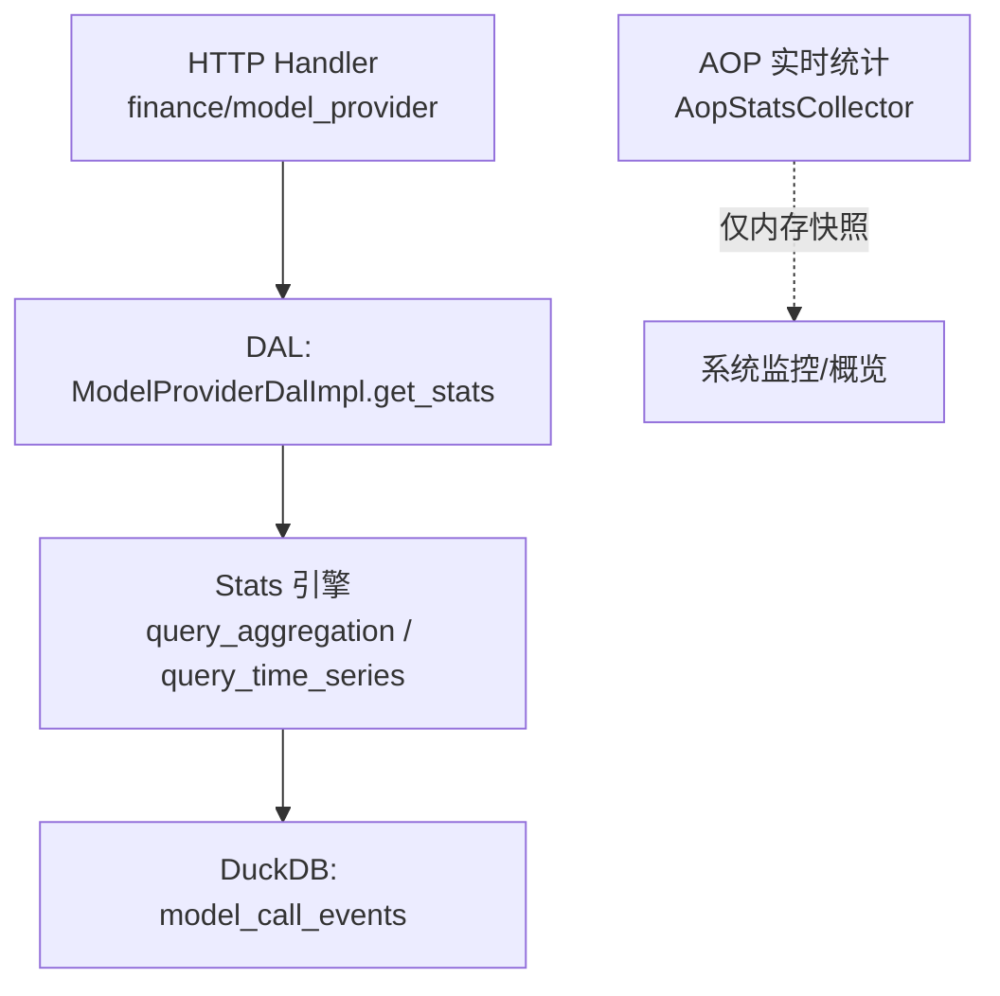
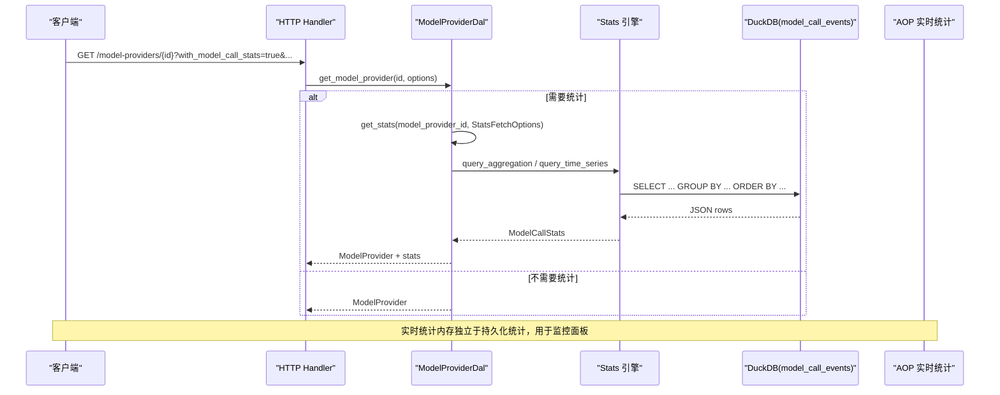
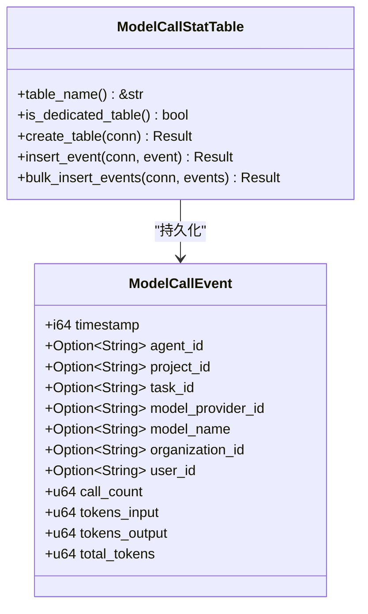
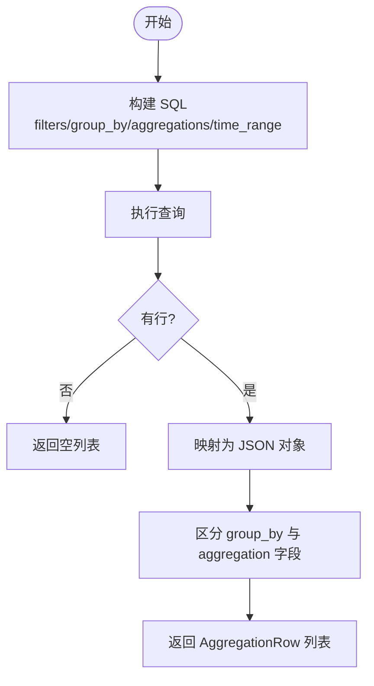
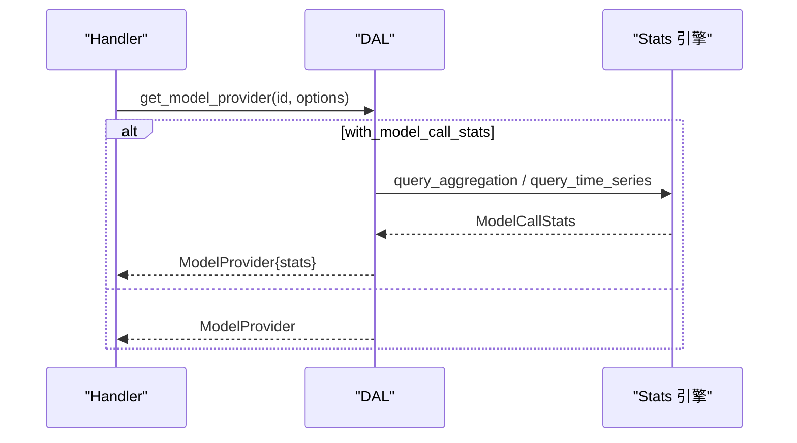
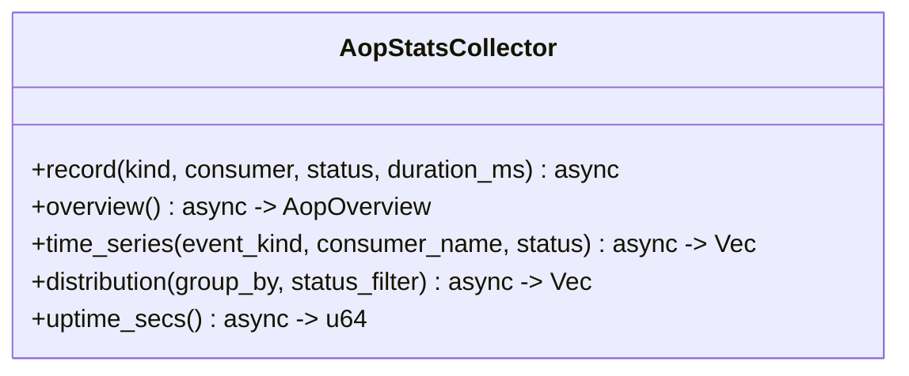
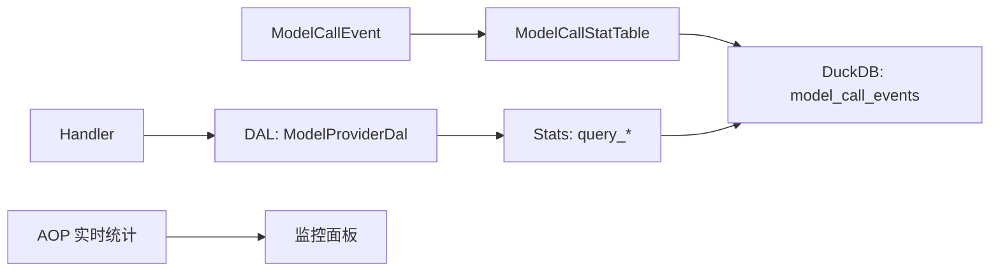

# ModelProvider 维度统计

<cite>
**本文引用的文件**
- [src/pkg/stats/model_call.rs](src/pkg/stats/model_call.rs)
- [src/pkg/stats/collector.rs](src/pkg/stats/collector.rs)
- [common/src/models/stats.rs](common/src/models/stats.rs)
- [src/service/dal/model_provider.rs](src/service/dal/model_provider.rs)
- [common/src/api/model_provider.rs](common/src/api/model_provider.rs)
- [src/handlers/finance/model_provider/mod.rs](src/handlers/finance/model_provider/mod.rs)
- [src/consumer/aop_stats_collector.rs](src/consumer/aop_stats_collector.rs)
</cite>

## 目录
1. [简介](#简介)
2. [项目结构](#项目结构)
3. [核心组件](#核心组件)
4. [架构总览](#架构总览)
5. [详细组件分析](#详细组件分析)
6. [依赖关系分析](#依赖关系分析)
7. [性能与成本考量](#性能与成本考量)
8. [故障排查指南](#故障排查指南)
9. [结论](#结论)
10. [附录：查询接口与使用示例](#附录：查询接口与使用示例)

## 简介
本文件围绕“ModelProvider 维度统计”进行系统化说明，聚焦模型调用级别的指标采集与分析。内容涵盖：
- 指标定义：API 调用次数、Token 用量（输入/输出/总计）、响应延迟、错误率等
- 事件模型：ModelCallEvent 的字段含义与统计落库逻辑
- 查询能力：按模型类型、调用时间、组织/用户/任务等维度聚合与时序分析
- 高级能力：实时监控（内存统计）、配额与成本控制思路、压缩存储与长期趋势分析建议
- 集成点：DAL/DAO 层统计查询、Handler 暴露的 API 参数约定

## 项目结构
围绕 ModelProvider 维度的统计链路涉及以下关键位置：
- 事件与表：src/pkg/stats/model_call.rs 定义 ModelCallEvent 及 model_call_events 表
- 统计引擎：src/pkg/stats/collector.rs 提供批量写入、聚合查询、时序查询
- 领域模型：common/src/models/stats.rs 定义通用统计结果结构（如 TimeSeriesPoint、ModelCallStats）
- DAL 层：src/service/dal/model_provider.rs 提供 get_stats 封装，统一组装统计查询
- API 契约：common/src/api/model_provider.rs 定义 GetModelProviderRequest 中的 with_model_call_stats 等参数
- Handler 路由：src/handlers/finance/model_provider/mod.rs 暴露相关 HTTP 方法入口
- 实时统计：src/consumer/aop_stats_collector.rs 提供进程内实时概览/分布/时序（非持久化）

图表来源
- [src/handlers/finance/model_provider/mod.rs:1-25](src/handlers/finance/model_provider/mod.rs#L1-L25)
- [src/service/dal/model_provider.rs:98-104](src/service/dal/model_provider.rs#L98-L104)
- [src/pkg/stats/collector.rs:319-365](src/pkg/stats/collector.rs#L319-L365)
- [src/pkg/stats/collector.rs:451-527](src/pkg/stats/collector.rs#L451-L527)
- [src/consumer/aop_stats_collector.rs:74-195](src/consumer/aop_stats_collector.rs#L74-L195)

章节来源
- [src/pkg/stats/model_call.rs:12-39](src/pkg/stats/model_call.rs#L12-L39)
- [src/pkg/stats/collector.rs:102-132](src/pkg/stats/collector.rs#L102-L132)
- [common/src/models/stats.rs:17-28](common/src/models/stats.rs#L17-L28)
- [src/service/dal/model_provider.rs:124-156](src/service/dal/model_provider.rs#L124-L156)
- [common/src/api/model_provider.rs:82-133](common/src/api/model_provider.rs#L82-L133)

## 核心组件
- ModelCallEvent：记录每次模型调用的标签与度量，包括 agent/project/task/model_provider_id/model_name/organization/user 等标签，以及 call_count/tokens_input/tokens_output/total_tokens 等度量
- Stats 引擎：负责注册表、批量写入、聚合查询、时序查询；支持过滤条件、分组、聚合函数
- ModelProvider DAL：对外暴露 get_stats，将请求参数转换为统计查询并返回 ModelCallStats
- 公共统计模型：TimeSeriesPoint、ModelCallStats、StatsFetchOptions 等跨层共享
- AOP 实时统计：内存中维护发布/消费/成功/失败等状态与耗时，用于实时监控

章节来源
- [src/pkg/stats/model_call.rs:12-39](src/pkg/stats/model_call.rs#L12-L39)
- [src/pkg/stats/collector.rs:319-365](src/pkg/stats/collector.rs#L319-L365)
- [src/service/dal/model_provider.rs:98-104](src/service/dal/model_provider.rs#L98-L104)
- [common/src/models/stats.rs:17-28](common/src/models/stats.rs#L17-L28)
- [src/consumer/aop_stats_collector.rs:74-195](src/consumer/aop_stats_collector.rs#L74-L195)

## 架构总览
下图展示从 HTTP 请求到统计落库与查询的整体流程，以及实时统计的并行路径。

图表来源
- [common/src/api/model_provider.rs:82-133](common/src/api/model_provider.rs#L82-L133)
- [src/service/dal/model_provider.rs:124-156](src/service/dal/model_provider.rs#L124-L156)
- [src/pkg/stats/collector.rs:319-365](src/pkg/stats/collector.rs#L319-L365)
- [src/pkg/stats/collector.rs:451-527](src/pkg/stats/collector.rs#L451-L527)

## 详细组件分析

### ModelCallEvent 与持久化表
- 事件字段
  - 标签（tag）：agent_id、project_id、task_id、model_provider_id、model_name、organization_id、user_id
  - 度量（metric）：call_count、tokens_input、tokens_output、total_tokens
  - 时间戳：timestamp
- 表结构
  - 表名：model_call_events
  - 主键：id(UUID v7)
  - 列：timestamp、各 tag、各 metric
- 写入策略
  - 单条插入与批量插入均实现，批量插入逐条执行 INSERT（当前实现），可通过调整批大小优化吞吐
- 复杂度
  - 单次插入 O(1)，批量插入 O(n)
  - 查询聚合/时序由 DuckDB 承担，SQL 由引擎动态构建

图表来源
- [src/pkg/stats/model_call.rs:12-39](src/pkg/stats/model_call.rs#L12-L39)
- [src/pkg/stats/model_call.rs:110-219](src/pkg/stats/model_call.rs#L110-L219)

章节来源
- [src/pkg/stats/model_call.rs:12-39](src/pkg/stats/model_call.rs#L12-L39)
- [src/pkg/stats/model_call.rs:122-219](src/pkg/stats/model_call.rs#L122-L219)

### 统计查询与聚合
- 聚合查询
  - 支持 equals/range 过滤、group by、count/sum/avg 聚合
  - 默认表可切换，针对 model_call_events 可查询 tokens_input/tokens_output/call_count 等
- 时序查询
  - 支持按小时/天粒度聚合，返回 TimeSeriesPoint
- 参数与结果
  - 过滤：StatFilter::Equals / Range
  - 聚合：StatAggregation::Count / Sum(metric) / Avg(metric)
  - 结果：AggregationRow(groups, aggregations)

图表来源
- [src/pkg/stats/collector.rs:319-365](src/pkg/stats/collector.rs#L319-L365)
- [src/pkg/stats/collector.rs:368-446](src/pkg/stats/collector.rs#L368-L446)
- [src/pkg/stats/collector.rs:529-566](src/pkg/stats/collector.rs#L529-L566)

章节来源
- [src/pkg/stats/collector.rs:319-365](src/pkg/stats/collector.rs#L319-L365)
- [src/pkg/stats/collector.rs:368-446](src/pkg/stats/collector.rs#L368-L446)
- [src/pkg/stats/collector.rs:451-527](src/pkg/stats/collector.rs#L451-L527)

### DAL 层统计装配
- get_stats：根据 StatsFetchOptions 决定返回 call_summary/token_summary/time_series
- get_model_provider：当 with_model_call_stats=true 时注入 ModelCallStats，失败降级不阻断主流程

图表来源
- [src/service/dal/model_provider.rs:124-156](src/service/dal/model_provider.rs#L124-L156)
- [src/service/dal/model_provider.rs:206-221](src/service/dal/model_provider.rs#L206-L221)

章节来源
- [src/service/dal/model_provider.rs:124-156](src/service/dal/model_provider.rs#L124-L156)
- [src/service/dal/model_provider.rs:206-221](src/service/dal/model_provider.rs#L206-L221)

### 实时监控（内存统计）
- AopStatsCollector 提供：
  - overview：published/consuming/success/failed 累计与平均耗时
  - time_series：按分钟桶的调用量
  - distribution：按 consumer/status/kind 分组
- 特点：纯内存、重启即重置，适合短期监控与告警

图表来源
- [src/consumer/aop_stats_collector.rs:49-195](src/consumer/aop_stats_collector.rs#L49-L195)

章节来源
- [src/consumer/aop_stats_collector.rs:74-195](src/consumer/aop_stats_collector.rs#L74-L195)

## 依赖关系分析
- 事件与表：ModelCallEvent → ModelCallStatTable → model_call_events
- 查询链路：Handler → DAL.get_model_provider/get_stats → Stats.query_aggregation/query_time_series → DuckDB
- 实时链路：AOP Hook → AopStatsCollector（内存）→ 监控面板
- 外部依赖：DuckDB（统计库）、Axum（HTTP）、sqlx（业务库，统计用 DuckDB）

图表来源
- [src/pkg/stats/model_call.rs:110-219](src/pkg/stats/model_call.rs#L110-L219)
- [src/pkg/stats/collector.rs:319-365](src/pkg/stats/collector.rs#L319-L365)
- [src/consumer/aop_stats_collector.rs:74-195](src/consumer/aop_stats_collector.rs#L74-L195)

章节来源
- [src/pkg/stats/model_call.rs:110-219](src/pkg/stats/model_call.rs#L110-L219)
- [src/pkg/stats/collector.rs:319-365](src/pkg/stats/collector.rs#L319-L365)
- [src/consumer/aop_stats_collector.rs:74-195](src/consumer/aop_stats_collector.rs#L74-L195)

## 性能与成本考量
- 写入性能
  - 当前 bulk_insert 逐条 INSERT，可在高吞吐场景改为事务批量提交以提升性能
  - 合理设置 batch_size，避免频繁 flush
- 查询性能
  - 使用合适的 time_range 与 filters 减少扫描范围
  - 对高频查询字段（如 model_provider_id、timestamp）建立索引（在 DuckDB 中按需优化）
- 成本估算
  - 通过 tokens_input/tokens_output 汇总计算 Token 成本，结合模型单价进行成本核算
  - 结合 call_count 与 error_rate（需扩展错误标签）评估质量与成本平衡
- 压缩与归档
  - 建议对历史数据按天/月归档至冷存储，保留热数据窗口（如最近 30 天）
  - 可对大文本字段（如有）进行压缩或采样

[本节为通用指导，无需具体文件引用]

## 故障排查指南
- 统计未生效
  - 检查是否已注册对应 StatTable（initialize_default 包含 ModelCallStatTable）
  - 确认 record 调用链路与 batch_size 触发 flush
- 查询结果为空
  - 校验 time_range 与 filters 是否正确
  - 确认 model_provider_id 等 tag 是否一致
- 实时统计缺失
  - AopStatsCollector 为内存统计，重启后丢失属预期行为
- 常见错误定位
  - 查看 DuckDB 连接与语句准备/执行错误信息
  - 关注 DAL 层统计注入失败的降级日志

章节来源
- [src/pkg/stats/collector.rs:102-132](src/pkg/stats/collector.rs#L102-L132)
- [src/pkg/stats/collector.rs:568-656](src/pkg/stats/collector.rs#L568-L656)
- [src/service/dal/model_provider.rs:144-150](src/service/dal/model_provider.rs#L144-L150)

## 结论
本项目实现了以 ModelProvider 为核心的模型调用统计体系：
- 事件模型清晰，覆盖调用次数与 Token 用量等关键指标
- 查询引擎支持灵活过滤、分组与聚合，满足多维度分析需求
- DAL 层提供统一的统计装配与可选注入，兼顾性能与可用性
- 实时统计提供短周期监控能力，便于快速发现异常
- 建议在后续版本中增强错误率统计、成本核算、压缩归档与索引优化

[本节为总结，无需具体文件引用]

## 附录：查询接口与使用示例
- 获取模型提供方详情并附带统计
  - 请求参数：with_model_call_stats、stats_start_time、stats_end_time、stats_interval
  - 返回字段：stats 中包含 call_summary、token_summary、model_call_time_series
- 统计查询要点
  - 过滤：按 model_provider_id、timestamp 范围、组织/用户/任务等标签
  - 聚合：count/sum/avg 任意组合，支持 group by 多字段
  - 时序：Hourly/Daily 两种粒度，返回 TimeSeriesPoint

章节来源
- [common/src/api/model_provider.rs:82-133](common/src/api/model_provider.rs#L82-L133)
- [common/src/models/stats.rs:17-28](common/src/models/stats.rs#L17-L28)
- [src/pkg/stats/collector.rs:451-527](src/pkg/stats/collector.rs#L451-L527)