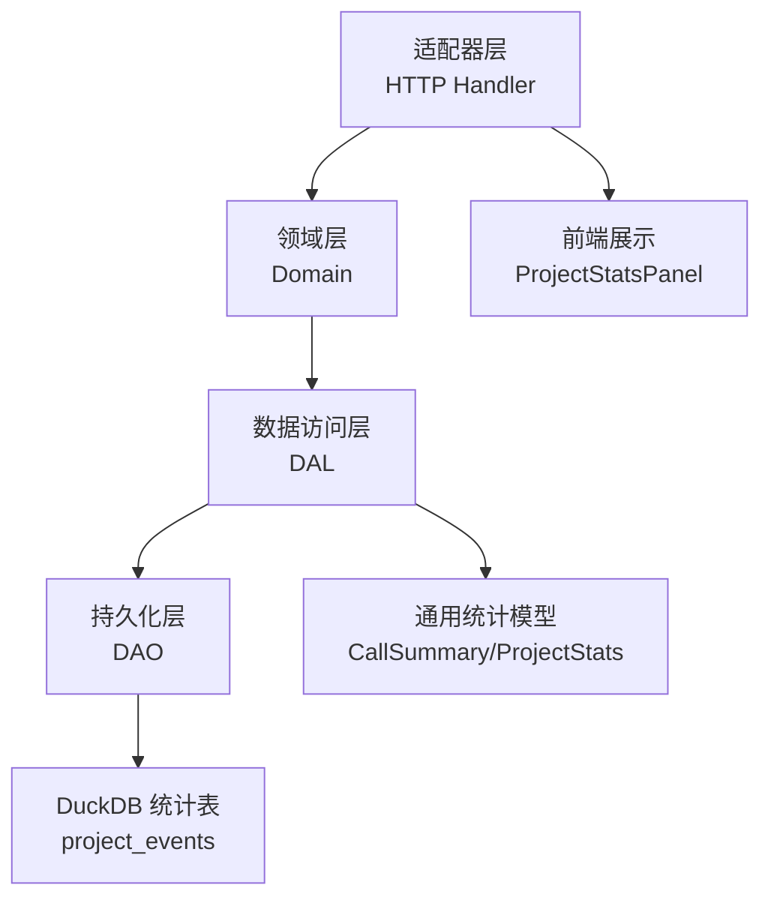
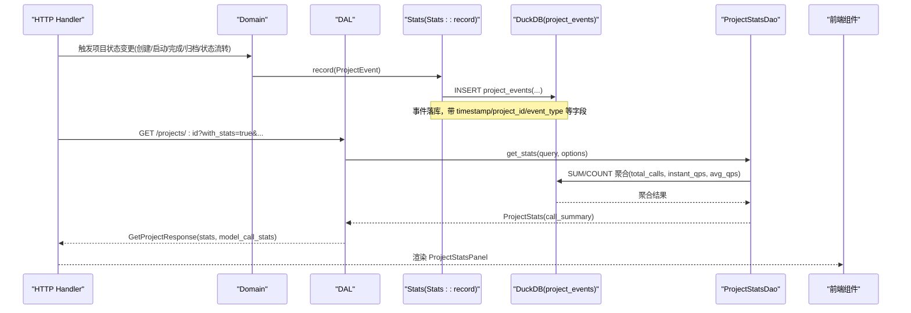
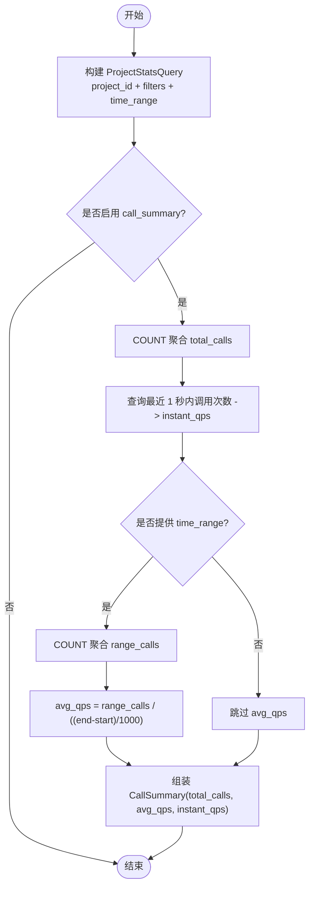
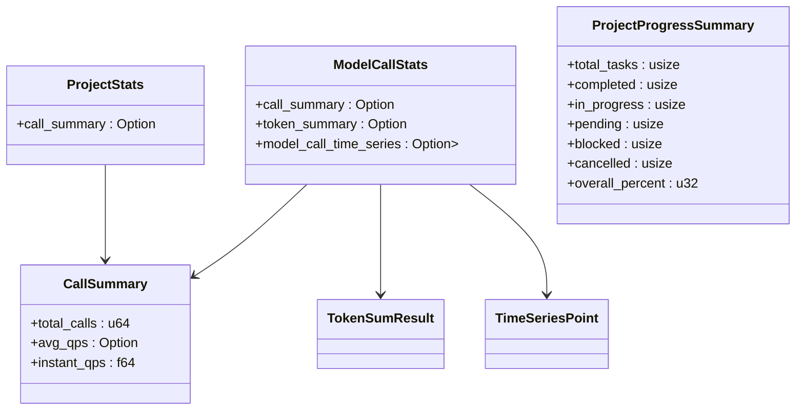
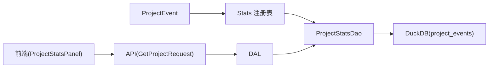

# Project 维度统计

<cite>
**本文引用的文件**
- [src/pkg/stats/project_event.rs](src/pkg/stats/project_event.rs)
- [src/service/dao/project/mod.rs](src/service/dao/project/mod.rs)
- [common/src/models/stats.rs](common/src/models/stats.rs)
- [common/src/api/project.rs](common/src/api/project.rs)
- [src/service/dal/project.rs](src/service/dal/project.rs)
- [docs/stats_query_design.md](docs/stats_query_design.md)
- [frontend/src/components/stats.rs](frontend/src/components/stats.rs)
- [src/pkg/stats/tool_call.rs](src/pkg/stats/tool_call.rs)
- [src/pkg/stats/task_event.rs](src/pkg/stats/task_event.rs)
</cite>

## 目录
1. [简介](#简介)
2. [项目结构](#项目结构)
3. [核心组件](#核心组件)
4. [架构总览](#架构总览)
5. [详细组件分析](#详细组件分析)
6. [依赖关系分析](#依赖关系分析)
7. [性能考量](#性能考量)
8. [故障排查指南](#故障排查指南)
9. [结论](#结论)
10. [附录](#附录)

## 简介
本文件面向“Project 维度统计”，系统性说明项目级别的事件采集、处理与查询，覆盖项目创建、任务分配、进度更新等业务事件。重点解释 ProjectEvent 的数据结构与统计逻辑，给出项目活跃度、任务完成率、资源使用率等关键指标的计算方法；提供按项目、时间范围、状态等多维度的查询与分析接口；并给出趋势分析、异常检测与预警机制建议，以及存储优化与历史数据管理策略。

## 项目结构
本项目采用严格四层单向调用：Adapter（HTTP Handler / AOP Producer）→ Domain → DAL → DAO，禁止跨层调用与同层互调。统计相关的关键路径如下：
- 事件定义与持久化：pkg/stats 中的 ProjectEvent 绑定 project_events 表，负责项目生命周期事件的写入。
- 领域统计 DAO：service/dao/project 中的 ProjectStatsDao 提供项目自身维度的统计查询（当前为业务事件次数汇总）。
- 领域模型与 API：common/models/stats 定义通用统计结构体（CallSummary、ProjectStats、ModelCallStats 等），common/api/project 暴露获取项目详情及可选加载统计的接口参数。
- DAL 组装：service/dal/project 将项目基础信息与统计信息按需组合返回。
- 前端展示：frontend/components/stats 渲染项目统计面板，包括事件次数、平均 QPS、模型调用与 Token 用量等。

图表来源
- [src/service/dao/project/mod.rs:162-237](src/service/dao/project/mod.rs#L162-L237)
- [common/src/models/stats.rs:41-149](common/src/models/stats.rs#L41-L149)
- [common/src/api/project.rs:33-63](common/src/api/project.rs#L33-L63)
- [frontend/src/components/stats.rs:153-183](frontend/src/components/stats.rs#L153-L183)

章节来源
- [src/service/dao/project/mod.rs:162-237](src/service/dao/project/mod.rs#L162-L237)
- [common/src/models/stats.rs:41-149](common/src/models/stats.rs#L41-L149)
- [common/src/api/project.rs:33-63](common/src/api/project.rs#L33-L63)
- [frontend/src/components/stats.rs:153-183](frontend/src/components/stats.rs#L153-L183)

## 核心组件
- ProjectEvent：项目业务统计事件，绑定 project_events 表，记录项目生命周期关键动作（创建、启动、完成、归档、状态流转等），包含标签字段（project_id、event_type、组织/操作者/所有者信息、状态变更前后、耗时、优先级）与度量字段（duration_ms、priority）。
- ProjectStatsDao：项目统计 DAO 接口，提供底层通用查询 query_project_calls、聚合 sum_calls、以及 get_stats 组装 CallSummary（total_calls、avg_qps、instant_qps）。
- 通用统计模型：CallSummary、ProjectStats、ModelCallStats、TokenSumResult、TimeSeriesPoint、StatsFetchOptions 等，用于统一表达统计结果与查询选项。
- 项目 API：GetProjectRequest 支持 with_stats、with_model_call_stats、stats_time_start/end、stats_interval 等参数，按需加载项目统计与模型调用统计。
- DAL 组装：DAL 在获取项目详情时，根据 options 决定是否加载 stats，并将统计结果注入到项目实体中。
- 前端面板：ProjectStatsPanel 展示事件次数、平均 QPS、模型调用次数、输入/输出 Token 等，并可渲染时序图。

章节来源
- [src/pkg/stats/project_event.rs:12-41](src/pkg/stats/project_event.rs#L12-L41)
- [src/service/dao/project/mod.rs:162-237](src/service/dao/project/mod.rs#L162-L237)
- [common/src/models/stats.rs:41-149](common/src/models/stats.rs#L41-L149)
- [common/src/api/project.rs:33-63](common/src/api/project.rs#L33-L63)
- [src/service/dal/project.rs:281-301](src/service/dal/project.rs#L281-L301)
- [frontend/src/components/stats.rs:153-183](frontend/src/components/stats.rs#L153-L183)

## 架构总览
下图展示了从事件产生到统计查询的前后端链路，涵盖事件埋点、DuckDB 存储、DAO 聚合、DAL 组装与前端展示。

图表来源
- [src/pkg/stats/project_event.rs:12-41](src/pkg/stats/project_event.rs#L12-L41)
- [src/service/dao/project/mod.rs:162-237](src/service/dao/project/mod.rs#L162-L237)
- [common/src/api/project.rs:33-63](common/src/api/project.rs#L33-L63)
- [frontend/src/components/stats.rs:153-183](frontend/src/components/stats.rs#L153-L183)

## 详细组件分析

### ProjectEvent 数据结构与统计逻辑
- 字段分类
  - 时间戳：timestamp（毫秒）
  - 标签（tag）：project_id、event_type、organization_id、operator_type、operator_id、root_user_id、owner_type、owner_id、from_status、to_status
  - 度量（metric）：duration_ms、priority
- 事件类型与触发时机
  - created：项目创建时
  - started：项目启动时
  - completed：项目完成时
  - archived：项目归档时
  - status_changed：状态流转时（transition_status）
- 统计逻辑
  - 通过 ProjectStatsDao.sum_calls 对 project_events 进行 COUNT 聚合得到 total_calls
  - 瞬时 QPS：最近 1 秒内的调用次数作为 instant_qps
  - 平均 QPS：当传入 time_range 时，按 (end-start)/1000 秒计算 avg_qps = range_calls / duration_secs
  - 这些指标封装在 CallSummary 中，并通过 ProjectStats.call_summary 返回

图表来源
- [src/service/dao/project/mod.rs:162-237](src/service/dao/project/mod.rs#L162-L237)
- [common/src/models/stats.rs:41-72](common/src/models/stats.rs#L41-L72)

章节来源
- [src/pkg/stats/project_event.rs:12-41](src/pkg/stats/project_event.rs#L12-L41)
- [src/service/dao/project/mod.rs:162-237](src/service/dao/project/mod.rs#L162-L237)
- [docs/stats_query_design.md:453-465](docs/stats_query_design.md#L453-L465)
- [common/src/models/stats.rs:41-72](common/src/models/stats.rs#L41-L72)

### 项目活跃度、任务完成率、资源使用率计算方法
- 项目活跃度
  - 基于 project_events 的 total_calls 与 QPS（instant_qps、avg_qps）衡量项目活跃程度
  - 可按 event_type 过滤（如 started/completed/archived）观察不同阶段活跃度
- 任务完成率
  - 通过 TaskEvent 的 event_type（created/started/completed/cancelled/status_changed）统计任务状态分布
  - 结合 ProjectStats 的 call_summary 与任务列表，可计算整体进度百分比（由 ProjectProgressSummary 实时聚合）
- 资源使用率
  - 通过 ModelCallStats 的 token_summary（输入/输出 Token）与 call_summary（调用次数）评估资源消耗
  - 结合 TimeSeriesPoint 可观察时段内资源使用趋势

章节来源
- [src/pkg/stats/task_event.rs:12-45](src/pkg/stats/task_event.rs#L12-L45)
- [common/src/models/stats.rs:114-149](common/src/models/stats.rs#L114-L149)
- [docs/stats_query_design.md:416-465](docs/stats_query_design.md#L416-L465)

### 项目统计数据查询与分析接口
- 请求参数（GET /projects/:id）
  - with_stats：是否加载项目统计（call_summary）
  - with_model_call_stats：是否加载模型调用统计（token、时序）
  - stats_time_start/stats_time_end：统计时间范围（毫秒）
  - stats_interval：时序粒度（hourly/daily）
  - with_task_graph/with_artifacts/with_progress_summary：按需加载任务图、产物、进度汇总
- 响应结构
  - stats：ProjectStats（call_summary）
  - model_call_stats：ModelCallStats（call_summary、token_summary、model_call_time_series）
  - progress_summary：ProjectProgressSummary（任务总数、各状态计数、overall_percent）

图表来源
- [common/src/models/stats.rs:41-149](common/src/models/stats.rs#L41-L149)
- [common/src/api/project.rs:33-63](common/src/api/project.rs#L33-L63)

章节来源
- [common/src/api/project.rs:33-63](common/src/api/project.rs#L33-L63)
- [common/src/models/stats.rs:41-149](common/src/models/stats.rs#L41-L149)

### 趋势分析、异常检测与预警机制
- 趋势分析
  - 使用 ModelCallStats.model_call_time_series（TimeSeriesPoint）按小时/天分组，观察调用量与 Token 用量趋势
  - 结合 ProjectStats.call_summary 的 avg_qps 与 instant_qps 对比，识别短期波动
- 异常检测
  - 基于 AOP 指标采集 Hook（on_consume_start/success/failure）监控消费者处理耗时与失败率
  - 若某时间段内 failure 比例突增或耗时显著上升，可判定异常
- 预警机制
  - 设置阈值：如 instant_qps 超过上限、failure_rate > 阈值、avg_qps 持续下降等
  - 通过系统日志与告警通道（如 webhook）推送预警

章节来源
- （2026-09-04 清理：superpowers 目录已归档，待 doc-maintainer 跟进）

### 存储优化与历史数据管理策略
- 存储优化
  - 使用 DuckDB 统计表（project_events、task_events、tool_call_events）进行高效聚合查询
  - 通过 StatsFetchOptions.with_* 控制查询维度，避免不必要的计算
  - 批量插入 bulk_insert_events 提升写入吞吐
- 历史数据管理
  - 按时间范围查询（time_range）减少扫描范围
  - 定期归档或清理过期事件（例如超过 N 天的 project_events）
  - 结合 FTS5 与向量索引（项目搜索）提高检索效率，但统计查询仍聚焦 DuckDB 统计表

章节来源
- [src/pkg/stats/project_event.rs:126-235](src/pkg/stats/project_event.rs#L126-L235)
- [common/src/models/stats.rs:57-72](common/src/models/stats.rs#L57-L72)

## 依赖关系分析
- 事件定义依赖 ai_orz_macros::StatsEvent 生成表映射与插入逻辑
- ProjectStatsDao 依赖 Stats 注册表获取表名，并基于 DuckDB 执行聚合
- DAL 依赖 DAO 提供的 get_stats 组装 ProjectStats，并在 GetProjectResponse 中返回
- 前端依赖 common/models/stats 的结构体进行渲染

图表来源
- [src/pkg/stats/project_event.rs:12-41](src/pkg/stats/project_event.rs#L12-L41)
- [src/service/dao/project/mod.rs:162-237](src/service/dao/project/mod.rs#L162-L237)
- [common/src/api/project.rs:33-63](common/src/api/project.rs#L33-L63)
- [frontend/src/components/stats.rs:153-183](frontend/src/components/stats.rs#L153-L183)

章节来源
- [src/pkg/stats/project_event.rs:12-41](src/pkg/stats/project_event.rs#L12-L41)
- [src/service/dao/project/mod.rs:162-237](src/service/dao/project/mod.rs#L162-L237)
- [common/src/api/project.rs:33-63](common/src/api/project.rs#L33-L63)
- [frontend/src/components/stats.rs:153-183](frontend/src/components/stats.rs#L153-L183)

## 性能考量
- 事件写入：使用批量插入 bulk_insert_events 降低 IO 开销
- 统计查询：通过 StatsFetchOptions 精确控制查询维度，避免全量扫描
- QPS 计算：instant_qps 仅查最近 1 秒，avg_qps 需显式传入 time_range，避免无意义计算
- 前端渲染：按需加载 with_stats/with_model_call_stats，减少不必要的数据传输

[本节为通用指导，不直接分析具体文件]

## 故障排查指南
- 事件未落库
  - 检查 Stats::record 是否被调用，确认 RequestContext.stats_opt() 可用
  - 验证 project_events 表是否存在且字段匹配
- 统计结果为空
  - 确认 ProjectStatsQuery.project_id 是否正确
  - 检查 time_range 是否过短导致无数据
- QPS 异常
  - instant_qps 为 0：可能最近 1 秒无事件
  - avg_qps 为 None：未传入 time_range
- 前端显示异常
  - 确认 API 返回的 stats/model_call_stats 是否为空
  - 检查前端组件对 Option 的处理逻辑

章节来源
- [src/pkg/stats/project_event.rs:160-235](src/pkg/stats/project_event.rs#L160-L235)
- [src/service/dao/project/mod.rs:184-237](src/service/dao/project/mod.rs#L184-L237)
- [frontend/src/components/stats.rs:153-183](frontend/src/components/stats.rs#L153-L183)

## 结论
Project 维度统计以 ProjectEvent 为核心，通过 DuckDB 统计表与 ProjectStatsDao 实现高效聚合，结合 DAL 组装与 API 按需加载，为前端提供项目活跃度、任务完成率、资源使用率等关键指标。借助 AOP 指标采集 Hook 可实现趋势分析与异常检测，配合合理的存储优化与历史数据管理策略，保障系统在大规模场景下的稳定性与可观测性。

[本节为总结，不直接分析具体文件]

## 附录
- 事件类型与触发时机参考：docs/stats_query_design.md
- 工具调用与 Agent 唤醒统计参考：docs/stats_query_design.md
- 项目状态与关系参考：docs/project_design.md

[本节为补充材料，不直接分析具体文件]