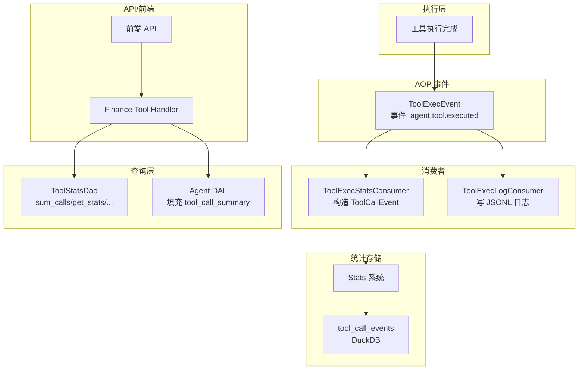
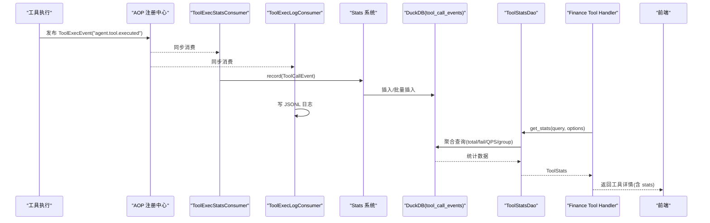
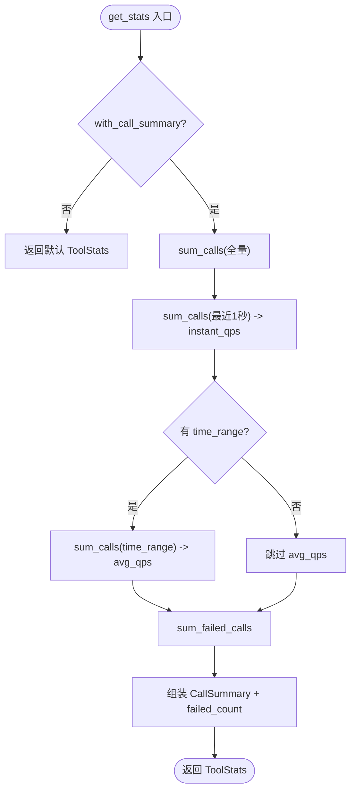
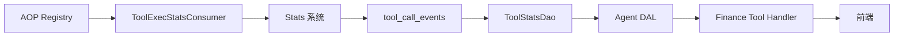

# Tool 维度统计

<cite>
**本文引用的文件**
- [src/pkg/stats/tool_call.rs](src/pkg/stats/tool_call.rs)
- [src/models/events/tool_exec.rs](src/models/events/tool_exec.rs)
- [src/consumer/tool_exec_stats_consumer.rs](src/consumer/tool_exec_stats_consumer.rs)
- [src/consumer/tool_exec_log_consumer.rs](src/consumer/tool_exec_log_consumer.rs)
- [src/service/dao/tool/mod.rs](src/service/dao/tool/mod.rs)
- [src/service/dal/agent.rs](src/service/dal/agent.rs)
- [src/service/domain/runtime/tool_call_query.rs](src/service/domain/runtime/tool_call_query.rs)
- [src/handlers/finance/tool/response.rs](src/handlers/finance/tool/response.rs)
- [frontend/src/api/finance.rs](frontend/src/api/finance.rs)
- [ai-orz-macros/src/lib.rs](ai-orz-macros/src/lib.rs)
- [ai-orz-macros/src/stats_event.rs](ai-orz-macros/src/stats_event.rs)
- [src/pkg/aop/core/registry.rs](src/pkg/aop/core/registry.rs)
- [DuckDB 多维统计双层互补：record_event! 宏自动表推断 + RuntimeStatsCollector 内存滑动窗口 + 5 维度开箱即用表](docs/wiki/knowledge/zh/DuckDB 多维统计双层互补：record_event! 宏自动表推断 + RuntimeStatsCollector 内存滑动窗口 + 5 维度开箱即用表/DuckDB 多维统计双层互补：record_event! 宏自动表推断 + RuntimeStatsCollector 内存滑动窗口 + 5 维度开箱即用表.md)
</cite>

## 目录
1. [简介](#简介)
2. [项目结构](#项目结构)
3. [核心组件](#核心组件)
4. [架构总览](#架构总览)
5. [详细组件分析](#详细组件分析)
6. [依赖关系分析](#依赖关系分析)
7. [性能与优化](#性能与优化)
8. [故障排查指南](#故障排查指南)
9. [结论](#结论)
10. [附录](#附录)

## 简介
本文件面向“工具调用级别”的统计体系，覆盖从一次工具执行到指标落库、聚合查询、前端展示的全链路。重点说明：
- 采集指标：执行次数、响应时间、错误率、参数/结果大小等
- 事件模型：ToolExecEvent（AOP 事件）与 ToolCallEvent（Stats 事件）
- 聚合逻辑：按工具类型、调用方、时间范围等多维筛选
- 查询接口：后端 DAO/DAL 提供的统计查询能力与前端 API 对接
- 监控告警：基于 AOP 实时内存收集器与队列状态
- 缓存与批量：DuckDB 统计表、批量写入、滑动窗口时序

## 项目结构
围绕 Tool 维度统计的关键路径如下：
- 执行侧：工具执行完成后发布 AOP 事件 ToolExecEvent
- 消费侧：ToolExecStatsConsumer 将 AOP 事件转换为 Stats 事件 ToolCallEvent 并记录
- 存储侧：ToolCallStatTable 将事件持久化到 DuckDB 的 tool_call_events 表
- 查询侧：ToolStatsDao 提供 sum_calls / get_stats / sum_calls_by_tool 等聚合查询
- 展示侧：DAL/Handler 组合统计结果并通过 HTTP 返回给前端

图表来源
- [src/models/events/tool_exec.rs:1-65](src/models/events/tool_exec.rs#L1-L65)
- [src/consumer/tool_exec_stats_consumer.rs:1-73](src/consumer/tool_exec_stats_consumer.rs#L1-L73)
- [src/consumer/tool_exec_log_consumer.rs:1-52](src/consumer/tool_exec_log_consumer.rs#L1-L52)
- [src/pkg/stats/tool_call.rs:1-228](src/pkg/stats/tool_call.rs#L1-L228)
- [src/service/dao/tool/mod.rs:66-239](src/service/dao/tool/mod.rs#L66-L239)
- [src/service/dal/agent.rs:783-814](src/service/dal/agent.rs#L783-L814)
- [src/handlers/finance/tool/response.rs:1-46](src/handlers/finance/tool/response.rs#L1-L46)
- [frontend/src/api/finance.rs:116-150](frontend/src/api/finance.rs#L116-L150)

章节来源
- [src/models/events/tool_exec.rs:1-65](src/models/events/tool_exec.rs#L1-L65)
- [src/consumer/tool_exec_stats_consumer.rs:1-73](src/consumer/tool_exec_stats_consumer.rs#L1-L73)
- [src/consumer/tool_exec_log_consumer.rs:1-52](src/consumer/tool_exec_log_consumer.rs#L1-L52)
- [src/pkg/stats/tool_call.rs:1-228](src/pkg/stats/tool_call.rs#L1-L228)
- [src/service/dao/tool/mod.rs:66-239](src/service/dao/tool/mod.rs#L66-L239)
- [src/service/dal/agent.rs:783-814](src/service/dal/agent.rs#L783-L814)
- [src/handlers/finance/tool/response.rs:1-46](src/handlers/finance/tool/response.rs#L1-L46)
- [frontend/src/api/finance.rs:116-150](frontend/src/api/finance.rs#L116-L150)

## 核心组件
- ToolExecEvent：工具执行完成后发布的 AOP 事件，携带完整调用上下文与度量信息
- ToolExecStatsConsumer：订阅 AOP 事件，构造并记录 ToolCallEvent 到 Stats 系统
- ToolCallEvent：Stats 事件，绑定 tool_call_events 表，包含标签与指标字段
- ToolStatsDao：提供对 tool_call_events 的聚合查询（总调用、失败数、QPS、按工具分组）
- Agent DAL：在获取 Agent 统计时，补充 tool_call_summary（按工具分组）
- 前端 API：通过 with_stats 及时间范围参数拉取工具统计

章节来源
- [src/models/events/tool_exec.rs:1-65](src/models/events/tool_exec.rs#L1-L65)
- [src/consumer/tool_exec_stats_consumer.rs:1-73](src/consumer/tool_exec_stats_consumer.rs#L1-L73)
- [src/pkg/stats/tool_call.rs:1-228](src/pkg/stats/tool_call.rs#L1-L228)
- [src/service/dao/tool/mod.rs:66-239](src/service/dao/tool/mod.rs#L66-L239)
- [src/service/dal/agent.rs:783-814](src/service/dal/agent.rs#L783-L814)
- [frontend/src/api/finance.rs:116-150](frontend/src/api/finance.rs#L116-L150)

## 架构总览
下图展示了从工具执行到统计查询的端到端流程，包括 AOP 事件分发、统计落库、DAO 聚合与前端展示。

图表来源
- [src/models/events/tool_exec.rs:1-65](src/models/events/tool_exec.rs#L1-L65)
- [src/consumer/tool_exec_stats_consumer.rs:1-73](src/consumer/tool_exec_stats_consumer.rs#L1-L73)
- [src/consumer/tool_exec_log_consumer.rs:1-52](src/consumer/tool_exec_log_consumer.rs#L1-L52)
- [src/pkg/stats/tool_call.rs:121-228](src/pkg/stats/tool_call.rs#L121-L228)
- [src/service/dao/tool/mod.rs:129-239](src/service/dao/tool/mod.rs#L129-L239)
- [src/handlers/finance/tool/response.rs:27-46](src/handlers/finance/tool/response.rs#L27-L46)

## 详细组件分析

### ToolExecEvent：工具执行完成事件
- 作用：统一承载工具执行完成后的上下文与度量，替代旧的装饰器模式
- 关键字段：entry（完整调用条目）、organization_id、user_id、args_len、result_len、created_at
- 事件类型：agent.tool.executed；顺序键按 agent_id 保证同一 Agent 的工具日志顺序

章节来源
- [src/models/events/tool_exec.rs:1-65](src/models/events/tool_exec.rs#L1-L65)

### ToolExecStatsConsumer：统计消费者
- 订阅事件：agent.tool.executed
- 处理逻辑：根据 entry.status 映射为 success/failed，构造 ToolCallEvent 并通过 global_stats 记录
- 特点：同步消费，避免阻塞主流程；无 ctx 时使用系统级 RequestContext

章节来源
- [src/consumer/tool_exec_stats_consumer.rs:1-73](src/consumer/tool_exec_stats_consumer.rs#L1-L73)

### ToolCallEvent：Stats 事件与表结构
- 标签字段（tag）：tool_id、tool_name、agent_id、project_id、task_id、organization_id、user_id
- 指标字段（metric）：call_count、args_len、result_len、duration_ms、status
- 表名：tool_call_events；支持单条与批量插入
- 宏生成：通过 #[derive(StatsEvent)] 自动生成 StatEvent 实现

章节来源
- [src/pkg/stats/tool_call.rs:12-41](src/pkg/stats/tool_call.rs#L12-L41)
- [src/pkg/stats/tool_call.rs:121-228](src/pkg/stats/tool_call.rs#L121-L228)
- [ai-orz-macros/src/lib.rs:22-45](ai-orz-macros/src/lib.rs#L22-L45)
- [ai-orz-macros/src/stats_event.rs:1-72](ai-orz-macros/src/stats_event.rs#L1-L72)

### ToolStatsDao：统计查询与聚合
- 查询参数：ToolStatsQuery（tool_id、agent_id、filters、time_range、aggregations）
- 核心方法：
  - sum_calls：按条件统计总调用次数
  - sum_failed_calls：统计失败次数
  - get_stats：返回 CallSummary（total_calls、avg_qps、instant_qps）与 failed_count
  - sum_calls_by_tool：按 tool_id/tool_name 分组统计，用于 Agent 详情页分布
- 即时 QPS：以最近 1 秒为窗口计算 instant_qps；平均 QPS 由 time_range 推导

图表来源
- [src/service/dao/tool/mod.rs:129-175](src/service/dao/tool/mod.rs#L129-L175)
- [src/service/dao/tool/mod.rs:177-239](src/service/dao/tool/mod.rs#L177-L239)

章节来源
- [src/service/dao/tool/mod.rs:66-239](src/service/dao/tool/mod.rs#L66-L239)

### Agent DAL：工具调用分布汇总
- 在获取 Agent 统计时，若已启用 call_summary，则额外调用 sum_calls_by_tool 填充 tool_call_summary
- 失败降级：查询失败仅 warn 日志，不阻塞主流程

章节来源
- [src/service/dal/agent.rs:783-814](src/service/dal/agent.rs#L783-L814)

### 查询限制与上下文约束
- 工具调用查询需具备 scoped RequestContext（agent/project/task），防止越权
- 限制最大查询 limit，避免资源滥用
- 校验 query 与 context 的 scope 一致性

章节来源
- [src/service/domain/runtime/tool_call_query.rs:1-86](src/service/domain/runtime/tool_call_query.rs#L1-L86)

### 前端 API 与统计参数
- 前端通过 /api/v1/finance/tools/{id}?with_stats=...&stats_time_start=...&stats_time_end=...&stats_interval=... 获取工具详情与统计
- 后端响应中附带 stats 字段，便于前端渲染趋势图与分布图

章节来源
- [frontend/src/api/finance.rs:116-150](frontend/src/api/finance.rs#L116-L150)
- [src/handlers/finance/tool/response.rs:27-46](src/handlers/finance/tool/response.rs#L27-L46)

## 依赖关系分析
- AOP 注册中心维护消费者与生产者数量、队列长度与统计，便于实时监控
- ToolExecStatsConsumer 依赖全局 Stats 实例进行记录
- ToolCallStatTable 负责创建表与插入数据，使用 DuckDB 作为统计存储
- ToolStatsDao 依赖 Stats 系统的通用聚合能力（query_aggregation）

图表来源
- [src/pkg/aop/core/registry.rs:486-531](src/pkg/aop/core/registry.rs#L486-L531)
- [src/consumer/tool_exec_stats_consumer.rs:1-73](src/consumer/tool_exec_stats_consumer.rs#L1-L73)
- [src/pkg/stats/tool_call.rs:121-228](src/pkg/stats/tool_call.rs#L121-L228)
- [src/service/dao/tool/mod.rs:129-239](src/service/dao/tool/mod.rs#L129-L239)
- [src/service/dal/agent.rs:783-814](src/service/dal/agent.rs#L783-L814)
- [src/handlers/finance/tool/response.rs:27-46](src/handlers/finance/tool/response.rs#L27-L46)

章节来源
- [src/pkg/aop/core/registry.rs:486-531](src/pkg/aop/core/registry.rs#L486-L531)
- [src/consumer/tool_exec_stats_consumer.rs:1-73](src/consumer/tool_exec_stats_consumer.rs#L1-L73)
- [src/pkg/stats/tool_call.rs:121-228](src/pkg/stats/tool_call.rs#L121-L228)
- [src/service/dao/tool/mod.rs:129-239](src/service/dao/tool/mod.rs#L129-L239)
- [src/service/dal/agent.rs:783-814](src/service/dal/agent.rs#L783-L814)
- [src/handlers/finance/tool/response.rs:27-46](src/handlers/finance/tool/response.rs#L27-L46)

## 性能与优化
- 批量写入：ToolCallStatTable 提供 bulk_insert_events，减少数据库往返
- 即时 QPS：以最近 1 秒窗口快速评估瞬时吞吐
- 平均 QPS：基于请求 time_range 计算，避免全量扫描
- 分组聚合：sum_calls_by_tool 直接走底层 query_aggregation，按 tool_id/tool_name 分组，适合 Agent 详情页展示
- 降级策略：Agent DAL 在填充 tool_call_summary 失败时仅 warn，不影响主流程
- 查询限制：domain 层强制限制最大查询 limit，防止慢查询
- AOP 队列监控：通过 registry 暴露 queue_len 与 all_queue_stats，便于观察消费者积压

建议
- 在高吞吐场景优先使用批量写入
- 合理设置 time_range 与 interval，避免过大范围导致聚合开销
- 结合 AOP 队列统计，及时发现消费者瓶颈

[本节为通用指导，无需特定文件引用]

## 故障排查指南
- 统计缺失：确认 ToolExecStatsConsumer 是否成功订阅 agent.tool.executed，且 global_stats 可用
- 数据不一致：检查 ToolExecEvent 的 status 映射是否正确（Completed -> success，否则 failed）
- 查询为空：确认 ToolStatsQuery 的 tool_id、agent_id、time_range 是否符合预期
- 前端无统计：确认 with_stats 参数传递正确，后端响应包含 stats 字段
- 性能问题：查看 AOP 队列长度与消费者耗时，必要时调整批大小或查询范围

章节来源
- [src/consumer/tool_exec_stats_consumer.rs:1-73](src/consumer/tool_exec_stats_consumer.rs#L1-L73)
- [src/service/dao/tool/mod.rs:129-239](src/service/dao/tool/mod.rs#L129-L239)
- [src/service/domain/runtime/tool_call_query.rs:1-86](src/service/domain/runtime/tool_call_query.rs#L1-L86)
- [src/pkg/aop/core/registry.rs:486-531](src/pkg/aop/core/registry.rs#L486-L531)

## 结论
本项目实现了从工具执行到统计落库、聚合查询与前端展示的完整闭环。通过 AOP 事件解耦采集与消费，Stats 事件与 DuckDB 提供高效存储与聚合，DAO/DAL 提供多维度查询能力，满足工具性能分析、调用频率统计与错误模式识别的需求。配合 AOP 队列监控与查询限制，可在高并发场景下保持稳定与可观测性。

[本节为总结，无需特定文件引用]

## 附录

### 关键数据结构与方法速查
- ToolExecEvent：事件载体，包含 entry、组织/用户 ID、参数/结果长度、时间戳
- ToolCallEvent：Stats 事件，标签与指标字段定义明确，绑定 tool_call_events 表
- ToolStatsDao：
  - sum_calls：总调用次数
  - sum_failed_calls：失败次数
  - get_stats：CallSummary（total_calls、avg_qps、instant_qps）+ failed_count
  - sum_calls_by_tool：按工具分组统计

章节来源
- [src/models/events/tool_exec.rs:1-65](src/models/events/tool_exec.rs#L1-L65)
- [src/pkg/stats/tool_call.rs:12-41](src/pkg/stats/tool_call.rs#L12-L41)
- [src/service/dao/tool/mod.rs:66-239](src/service/dao/tool/mod.rs#L66-L239)