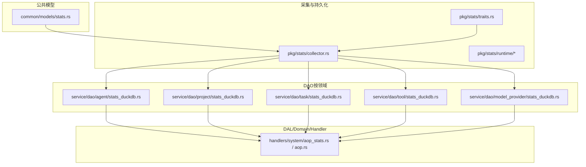
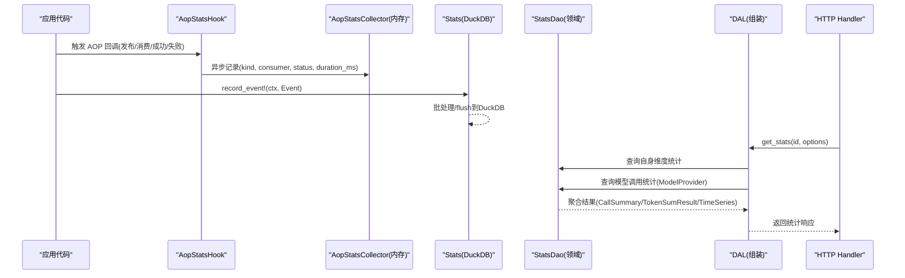
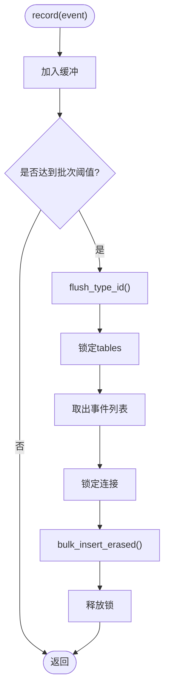
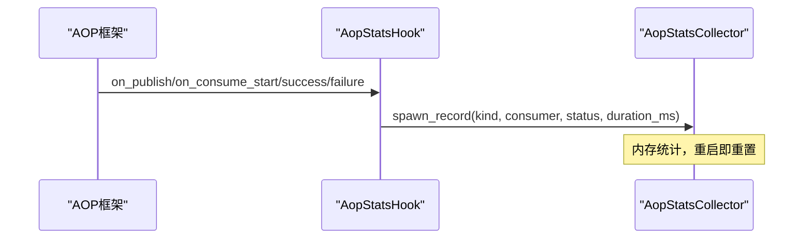
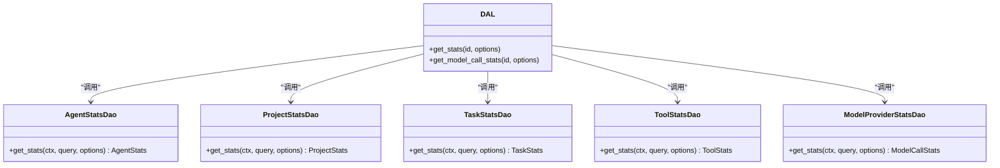
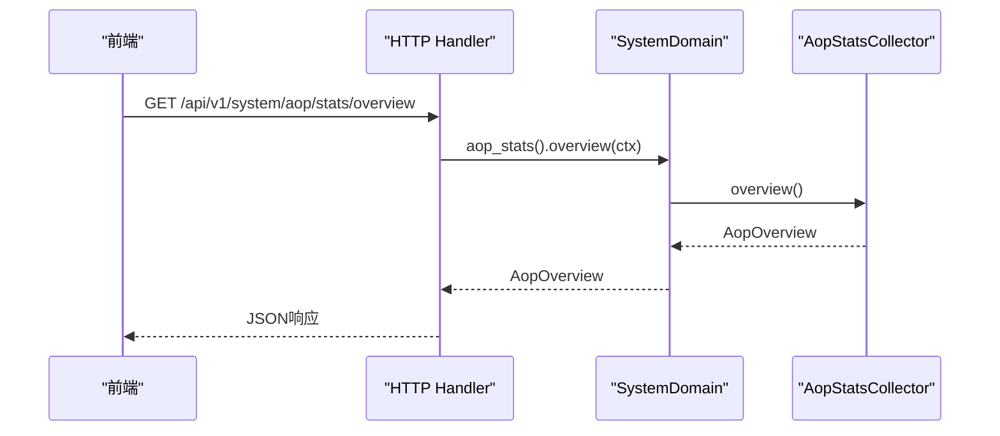
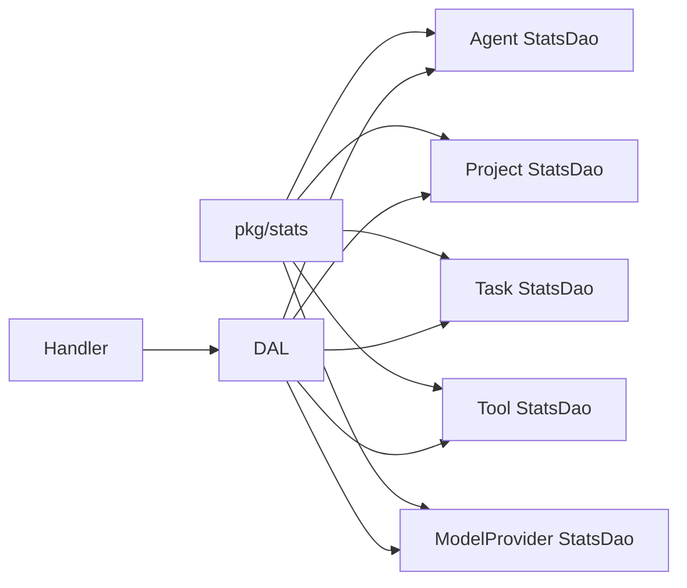

# 多维统计系统

<cite>
**本文引用的文件**
- [stats_query_design.md](docs/stats_query_design.md)
- [mod.rs](src/pkg/stats/mod.rs)
- [traits.rs](src/pkg/stats/traits.rs)
- [collector.rs](src/pkg/stats/collector.rs)
- [aop_stats_collector.rs](src/consumer/aop_stats_collector.rs)
- [aop_stats_hook.rs](src/consumer/aop_stats_hook.rs)
- [aop_stats.rs](src/handlers/system/aop_stats.rs)
- [aop.rs](src/handlers/system/aop.rs)
- [stats.rs](common/src/models/stats.rs)
- [stats_duckdb.rs（Agent）](src/service/dao/agent/stats_duckdb.rs)
- [stats_duckdb.rs（Project）](src/service/dao/project/stats_duckdb.rs)
- [stats_duckdb.rs（Task）](src/service/dao/task/stats_duckdb.rs)
- [stats_duckdb.rs（Tool）](src/service/dao/tool/stats_duckdb.rs)
- [stats_duckdb.rs（ModelProvider）](src/service/dao/model_provider/stats_duckdb.rs)

**本文关联三类文档（四类互引闭环）**
- 【① Design 决策快照】
  - [stats_module_design.md](docs/archive/design-archive/stats_module_design.md) — DuckDB 持久化 + Runtime 内存双层互补架构，5 类表默认实现
  - [stats_query_design.md](docs/archive/design-archive/stats_query_design.md) — StatFilter + StatAggregation 五维度 Domain 层封装
- 【② Plan 落地快照】
  - [统计图表Phase1基础设施与时序图展示重构.md](docs/archive/plan-archive/统计图表Phase1基础设施与时序图展示重构.md) — DuckDB 表 + record_event! 宏自动推断
  - [统计图表Phase2.md](docs/archive/plan-archive/统计图表Phase2.md) — 五维度面板 + TokenSumResult 接口
  - [统计图表第三期.md](docs/archive/plan-archive/统计图表第三期.md) — RuntimeStatsCollector 接入 AOP 监控面板
- 【④ RAG 原子知识卡】
  - [DuckDB 多维统计双层互补：record_event! 宏自动表推断 + RuntimeStatsCollector 内存滑动窗口 + 5 维度开箱即用表](docs/wiki/knowledge/zh/DuckDB%20多维统计双层互补：record_event!%20宏自动表推断%20+%20RuntimeStatsCollector%20内存滑动窗口%20+%205%20维度开箱即用表/DuckDB%20多维统计双层互补：record_event!%20宏自动表推断%20+%20RuntimeStatsCollector%20内存滑动窗口%20+%205%20维度开箱即用表.md) — §3 架构选型表（持久化 vs 内存适用场景分界）+ §4 红线 batch_size 10-5000/WINDOW_MINUTES 10-240 阈值
- 【③ Wiki 关联长文】
  - [Agent 维度统计.md](docs/wiki/zh/content/项目概述/核心功能特性/多维统计系统/Agent%20维度统计.md) — 维度 1/5：Agent 日调用、Token 饼图
  - [Tool 维度统计.md](docs/wiki/zh/content/项目概述/核心功能特性/多维统计系统/Tool%20维度统计.md) — 维度 5/5：工具成功失败率 + 平均耗时箱线图
  - [AOP 事件系统 统计与监控.md](docs/wiki/zh/content/基础设施/AOP%20事件系统/统计与监控.md) — 内存版 AopStatsCollector 展示链路
- [统计查询 API 与前端仪表盘：DuckDB 5 维表查询 + RuntimeStats 内存滑动聚合 + StatsHandler REST API + 前端 Line/Donut/Gauge 展示](docs/wiki/knowledge/zh/统计查询 API 与前端仪表盘：DuckDB 5 维表查询 + RuntimeStats 内存滑动聚合 + StatsHandler REST API + 前端 Line/Donut/Gauge 展示/统计查询 API 与前端仪表盘：DuckDB 5 维表查询 + RuntimeStats 内存滑动聚合 + StatsHandler REST API + 前端 Line/Donut/Gauge 展示.md)
</cite>

## 目录
1. [简介](#简介)
2. [项目结构](#项目结构)
3. [核心组件](#核心组件)
4. [架构总览](#架构总览)
5. [详细组件分析](#详细组件分析)
6. [依赖关系分析](#依赖关系分析)
7. [性能考虑](#性能考虑)
8. [故障排查指南](#故障排查指南)
9. [结论](#结论)
10. [附录](#附录)

## 简介
本文件面向“多维统计系统”，围绕 Agent、Project、Task、Tool、ModelProvider 五个维度，系统化说明统计指标的采集、聚合、存储与查询流程；解释 AOP 事件中心在统计收集中的作用（钩子注册与触发机制）；给出统计 API 的使用示例（指标获取、趋势分析、异常检测等）；说明可视化展示、报表生成与导出能力；并覆盖性能优化、数据压缩、历史归档以及扩展自定义指标与分析维度的方法。

## 项目结构
统计系统采用“领域先行、职责分离”的分层设计：
- 公共模型层：跨层共享的统计结果类型（如 CallSummary、TimeSeriesPoint、TokenSumResult、StatsFetchOptions）。
- 采集与持久化层：基于 DuckDB 的 Stats 实现，提供批量写入、通用聚合与时序查询能力；同时提供内存版运行时统计（AOP 实时）。
- DAO 层：按领域划分（Agent/Project/Task/Tool/ModelProvider），每个 StatsDao 只负责自身维度或模型调用领域的统计。
- DAL 层：组合多个 DAO，对外暴露简洁的 get_stats/get_model_call_stats 接口。
- Domain/Handler 层：业务域与 HTTP 接口，按需注入统计数据，提供前端展示与导出能力。

图表来源
- [collector.rs:102-132](src/pkg/stats/collector.rs#L102-L132)
- [traits.rs:44-113](src/pkg/stats/traits.rs#L44-L113)
- [stats.rs:8-72](common/src/models/stats.rs#L8-L72)

章节来源
- [stats_query_design.md:12-75](docs/stats_query_design.md#L12-L75)
- [collector.rs:102-132](src/pkg/stats/collector.rs#L102-L132)
- [traits.rs:44-113](src/pkg/stats/traits.rs#L44-L113)
- [stats.rs:8-72](common/src/models/stats.rs#L8-L72)

## 核心组件
- 统计事件与表抽象
  - StatEvent：统一事件接口（时间戳、标签、指标）。
  - StatTable：统计表抽象（建表、插入、批量插入、列引用方式、过滤条件 SQL 生成）。
- 统计引擎 Stats
  - 管理多张统计表，自动批处理与 flush。
  - 提供 query_aggregation、query_time_series、query 等通用查询能力。
  - 初始化默认表（default_events、model_call_events、tool_call_events、agent_awake_events、project_events、task_events）。
- 领域 StatsDao
  - Agent/Project/Task/Tool：仅负责自身维度的 call_summary。
  - ModelProvider：负责模型调用领域的所有统计（call_summary、token_summary、time_series），支持多维度过滤。
- AOP 实时统计
  - AopStatsCollector：内存统计收集器，提供 overview/time_series/distribution 等快照查询。
  - AopStatsHook：AOP 生命周期回调（发布、消费开始、成功、失败）中异步记录统计。
- 公共模型
  - CallSummary、TokenSumResult、TimeSeriesPoint、StatsFetchOptions、各实体 Stats 结构体。

章节来源
- [traits.rs:10-113](src/pkg/stats/traits.rs#L10-L113)
- [collector.rs:102-132](src/pkg/stats/collector.rs#L102-L132)
- [collector.rs:314-527](src/pkg/stats/collector.rs#L314-L527)
- [aop_stats_collector.rs:43-196](src/consumer/aop_stats_collector.rs#L43-L196)
- [aop_stats_hook.rs:14-82](src/consumer/aop_stats_hook.rs#L14-L82)
- [stats.rs:8-149](common/src/models/stats.rs#L8-L149)

## 架构总览
统计系统遵循四层单向调用：Adapter（HTTP Handler/AOP Producer）→ Domain → DAL → DAO。统计事件通过 AOP 钩子与 record_event! 宏进入 Stats 引擎，持久化为 DuckDB 事件表；DAL 组合各 StatsDao 返回统一结果；Handler 暴露 REST 接口供前端使用。

图表来源
- [aop_stats_hook.rs:35-82](src/consumer/aop_stats_hook.rs#L35-L82)
- [aop_stats_collector.rs:61-196](src/consumer/aop_stats_collector.rs#L61-L196)
- [collector.rs:195-294](src/pkg/stats/collector.rs#L195-L294)
- [stats_query_design.md:299-374](docs/stats_query_design.md#L299-L374)

章节来源
- [stats_query_design.md:12-75](docs/stats_query_design.md#L12-L75)
- [stats_query_design.md:299-374](docs/stats_query_design.md#L299-L374)

## 详细组件分析

### 数据采集与持久化（Stats + 事件表）
- 事件注册与表初始化
  - Stats.initialize_default() 注册默认事件表，包含 default_events、model_call_events、tool_call_events、agent_awake_events、project_events、task_events。
- 批量写入与 flush
  - record() 将事件推入缓冲，达到 batch_size 时 flush 到 DuckDB。
  - flush_type_id() 保证锁顺序 tables → conn，避免死锁。
- 通用聚合与时序查询
  - query_aggregation()：支持 equals/range 过滤、group by、count/sum/avg 聚合。
  - query_time_series()：按 Hourly/Daily 分组，计算 tokens_input/output/call_count。
  - append_filters()：根据 StatTable 的 column_sql/metric_sql/filter_equals_sql/filter_range_sql 生成 SQL。

图表来源
- [collector.rs:195-294](src/pkg/stats/collector.rs#L195-L294)
- [collector.rs:314-527](src/pkg/stats/collector.rs#L314-L527)
- [traits.rs:44-113](src/pkg/stats/traits.rs#L44-L113)

章节来源
- [collector.rs:102-132](src/pkg/stats/collector.rs#L102-L132)
- [collector.rs:195-294](src/pkg/stats/collector.rs#L195-L294)
- [collector.rs:314-527](src/pkg/stats/collector.rs#L314-L527)
- [traits.rs:44-113](src/pkg/stats/traits.rs#L44-L113)

### AOP 事件中心与统计钩子
- AopStatsHook 实现 AopMetricsHook 的四个回调：on_publish、on_consume_start、on_consume_success、on_consume_failure。
- 回调内通过 spawn_record 异步调用 AopStatsCollector::record，不阻塞主流程。
- AopStatsCollector 维护内存快照，提供 overview/time_series/distribution 查询。

图表来源
- [aop_stats_hook.rs:35-82](src/consumer/aop_stats_hook.rs#L35-L82)
- [aop_stats_collector.rs:61-196](src/consumer/aop_stats_collector.rs#L61-L196)

章节来源
- [aop_stats_hook.rs:14-82](src/consumer/aop_stats_hook.rs#L14-L82)
- [aop_stats_collector.rs:43-196](src/consumer/aop_stats_collector.rs#L43-L196)

### 领域 DAO 与 DAL 组装
- 领域 StatsDao
  - Agent/Project/Task/Tool：仅负责自身维度的 call_summary（次数与 QPS）。
  - ModelProvider：负责模型调用领域（call_summary、token_summary、time_series），支持 agent_id/project_id/task_id/model_provider_id 多维度过滤。
- DAL 统一接口
  - get_stats(id, options)：实体自身统计。
  - get_model_call_stats(id, options)：模型调用统计。
- FetchOptions 模式
  - 详情页按需动态注入统计数据，列表接口默认不加载，避免无谓 DuckDB 聚合。

图表来源
- [stats_query_design.md:189-289](docs/stats_query_design.md#L189-L289)
- [stats_query_design.md:299-374](docs/stats_query_design.md#L299-L374)

章节来源
- [stats_query_design.md:189-289](docs/stats_query_design.md#L189-L289)
- [stats_query_design.md:299-374](docs/stats_query_design.md#L299-L374)

### 统计 API 与使用示例
- AOP 实时统计接口
  - GET /api/v1/system/aop/stats/overview：概览（published/consuming/success/failed、平均耗时）。
  - GET /api/v1/system/aop/stats/time-series：时序（支持 event_kind/consumer_name/status 过滤）。
  - GET /api/v1/system/aop/stats/distribution：分布（按 consumer/status/kind 分组）。
- 队列监控接口
  - GET /api/v1/system/aop/stats：所有消费者队列统计。
  - GET /api/v1/system/aop/{consumer}/stats：指定消费者队列统计。
  - GET /api/v1/system/aop/{consumer}/events：事件列表。
  - GET /api/v1/system/aop/{consumer}/events/{event_id}：事件详情。

图表来源
- [aop_stats.rs:16-72](src/handlers/system/aop_stats.rs#L16-L72)
- [aop_stats_collector.rs:74-196](src/consumer/aop_stats_collector.rs#L74-L196)

章节来源
- [aop_stats.rs:16-72](src/handlers/system/aop_stats.rs#L16-L72)
- [aop.rs:14-145](src/handlers/system/aop.rs#L14-L145)

### 可视化、报表与导出
- 可视化
  - 前端通过 AOP 统计接口获取概览、时序、分布数据，渲染为折线图、柱状图、饼图等。
- 报表生成
  - 后端可基于 Stats.query_aggregation/query_time_series 生成汇总报表（如 Token 消耗、调用次数趋势）。
- 导出
  - 将聚合结果序列化为 CSV/JSON，供下载或外部系统消费。

[本节为概念性内容，无需源码引用]

### 高级特性：性能优化、数据压缩、历史归档
- 性能优化
  - 批处理写入：batch_size 控制 flush 频率，减少 DB 写入开销。
  - 内存统计：AOP 实时统计使用内存收集器，零 DB 查询，毫秒级响应。
  - 索引与分区：对 timestamp、tags 字段建立合适索引；按天/月分表或分区提升查询性能。
- 数据压缩
  - 对历史大表进行压缩存储（如 DuckDB 原生压缩或外部归档工具）。
- 历史归档
  - 定期将旧数据迁移至归档库或冷存储，保留热数据以提升查询速度。

[本节为概念性内容，无需源码引用]

### 扩展自定义统计指标与分析维度
- 新增事件类型
  - 实现 StatEvent trait，定义 timestamp/tags/metrics。
  - 实现 StatTable trait，定义表名、建表语句、插入逻辑、列引用与过滤 SQL。
  - 通过 Stats.register_table() 注册新表。
- 新增领域 DAO
  - 参照现有 StatsDao 接口，实现新的统计查询（如新增维度过滤、聚合函数）。
- 扩展 DAL/Handler
  - 在 DAL 层组合新 DAO，暴露 get_stats/get_model_call_stats 扩展。
  - 在 Handler 层增加对应 HTTP 接口。

章节来源
- [traits.rs:10-113](src/pkg/stats/traits.rs#L10-L113)
- [collector.rs:134-173](src/pkg/stats/collector.rs#L134-L173)
- [stats_query_design.md:378-393](docs/stats_query_design.md#L378-L393)

## 依赖关系分析
- 模块耦合
  - pkg/stats 提供底层能力（事件/表抽象、聚合/时序查询），被 DAO 层复用。
  - DAO 层按领域解耦，DAL 层组合 DAO，Domain/Handler 仅依赖 DAL。
- 外部依赖
  - DuckDB：持久化统计事件，支持复杂 SQL 查询。
  - AOP：事件中心，驱动实时统计。
- 循环依赖
  - 通过 Trait 与 DAL 组合避免 DAO 间直接依赖。

图表来源
- [collector.rs:102-132](src/pkg/stats/collector.rs#L102-L132)
- [stats_query_design.md:189-289](docs/stats_query_design.md#L189-L289)

章节来源
- [collector.rs:102-132](src/pkg/stats/collector.rs#L102-L132)
- [stats_query_design.md:189-289](docs/stats_query_design.md#L189-L289)

## 性能考虑
- 写入路径
  - 批处理：合理设置 batch_size，平衡延迟与吞吐。
  - 内存优先：AOP 实时统计使用内存收集器，避免 DB 压力。
- 查询路径
  - 聚合与时序：利用 query_aggregation/query_time_series 的通用 SQL 构建，减少重复开发。
  - 过滤优化：使用 StatFilter 的 equals/range 精确过滤，减少扫描范围。
- 存储优化
  - 专用表 vs 默认表：高频实体使用专用表（如 model_call_events），提高查询效率。
  - 历史归档：定期归档旧数据，保持热表轻量。

[本节为通用指导，无需源码引用]

## 故障排查指南
- 常见问题
  - 事件未落库：检查 Stats.initialize_default() 是否执行，表是否创建成功。
  - 查询结果为空：确认时间范围、过滤条件是否正确；检查 tags/metrics 字段名。
  - AOP 统计不更新：确认 AopStatsHook 已注入 Registry，回调是否被触发。
- 调试建议
  - 启用日志：记录 SQL 与参数，定位查询问题。
  - 单元测试：参考现有测试用例，验证 DAO 与 DAL 行为。

章节来源
- [collector.rs:102-132](src/pkg/stats/collector.rs#L102-L132)
- [collector.rs:314-527](src/pkg/stats/collector.rs#L314-L527)
- [aop_stats_hook.rs:35-82](src/consumer/aop_stats_hook.rs#L35-L82)

## 结论
多维统计系统通过“领域先行、职责分离”的设计，实现了 Agent、Project、Task、Tool、ModelProvider 五维度的统一采集、聚合、存储与查询。AOP 事件中心提供实时统计能力，Stats 引擎提供持久化与通用查询，DAL 层封装复杂逻辑，Handler 层暴露简洁 API。系统具备良好的可扩展性与性能表现，适合大规模统计场景。

[本节为总结性内容，无需源码引用]

## 附录
- 关键数据结构
  - CallSummary：调用次数汇总（total_calls、avg_qps、instant_qps）。
  - TokenSumResult：Token 汇总（输入/输出 token、总调用次数）。
  - TimeSeriesPoint：时序点（interval_start、tokens_input/output、call_count）。
  - StatsFetchOptions：统计查询选项（with_call_summary、with_token_summary、with_time_series、time_range、interval）。
- 事件类型
  - ModelCallEvent、ToolCallEvent、AgentAwakeEvent、ProjectEvent、TaskEvent。

章节来源
- [stats.rs:8-149](common/src/models/stats.rs#L8-L149)
- [stats_query_design.md:396-570](docs/stats_query_design.md#L396-L570)