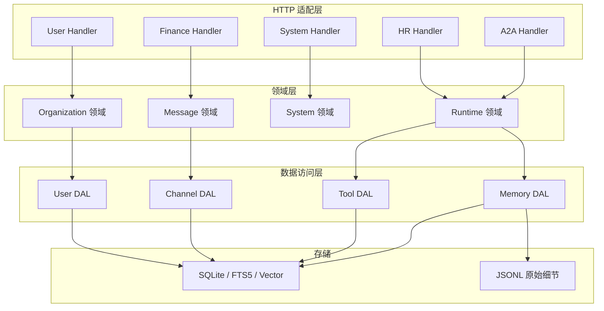
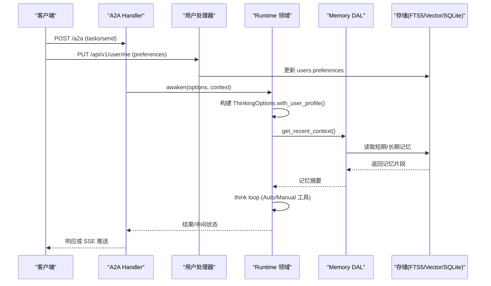
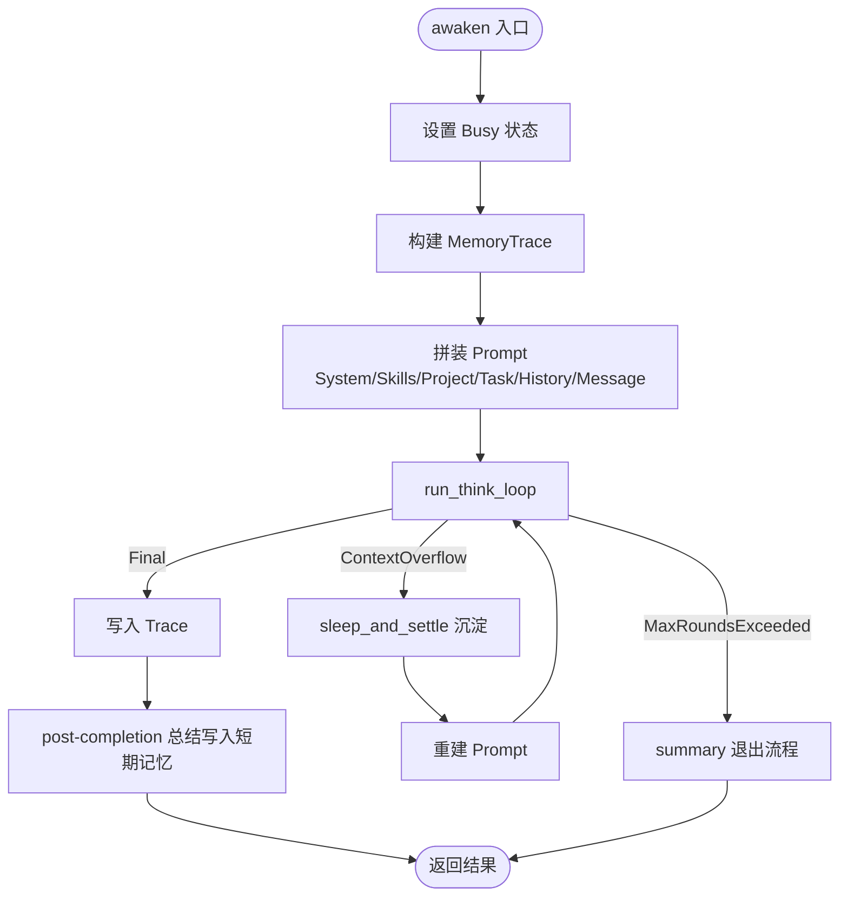
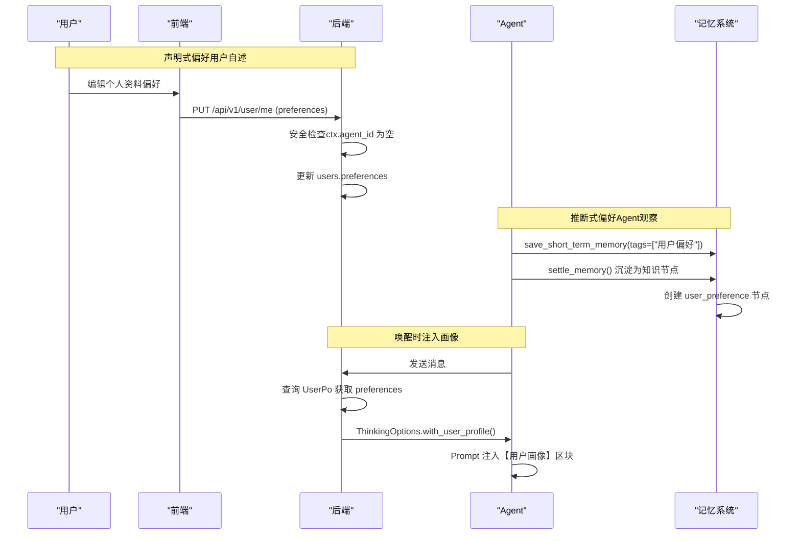
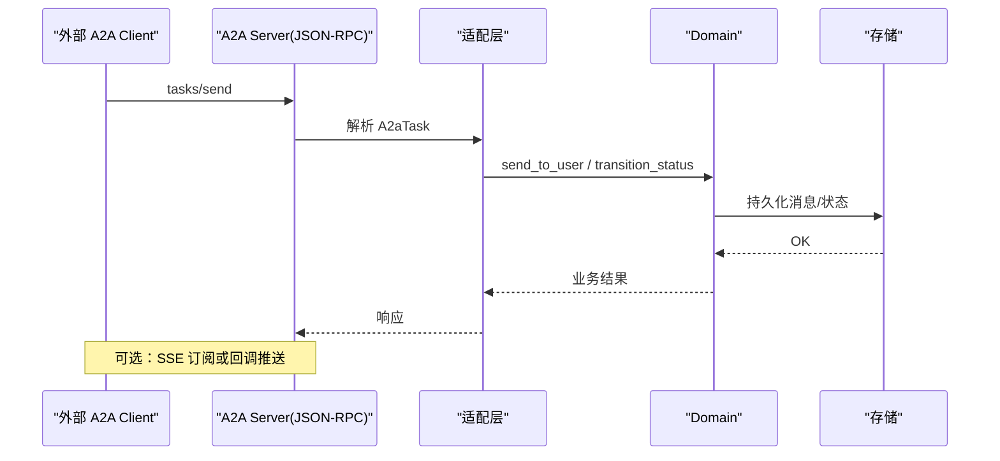
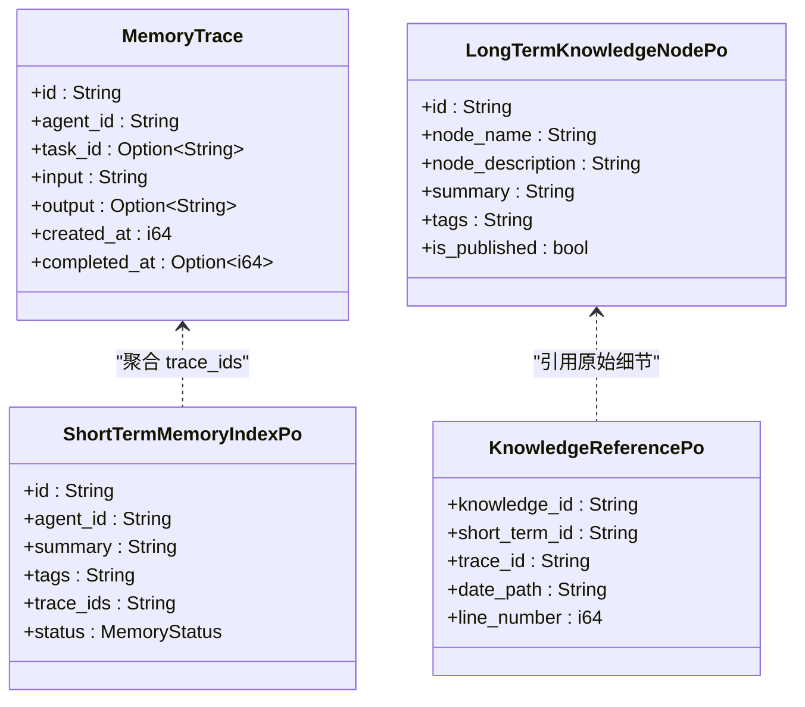
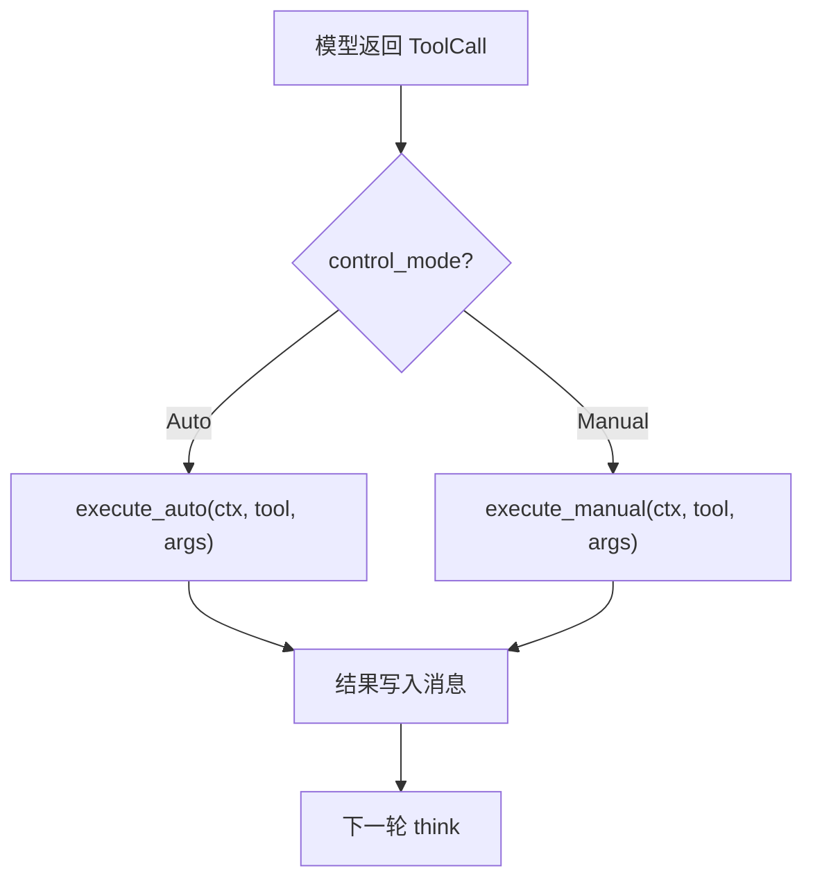
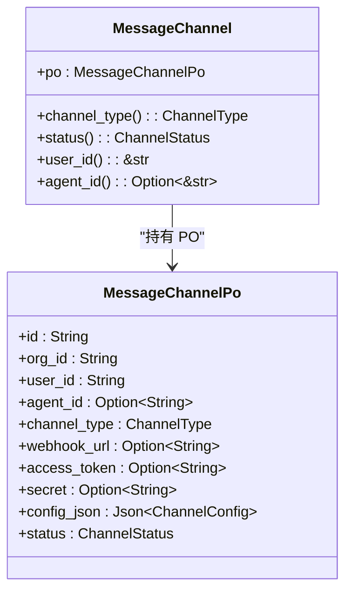
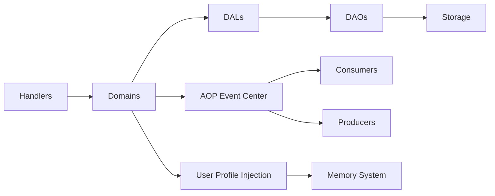

# 核心功能特性

<cite>
**本文引用的文件**
- [awakening.rs](src/service/domain/runtime/awakening.rs)
- [memory.rs](src/models/memory.rs)
- [mod.rs（工具注册表）](src/pkg/tool_registry/mod.rs)
- [mod.rs（A2A 协议模块）](src/handlers/a2a/mod.rs)
- [callback.rs（A2A 回调）](src/handlers/a2a/callback.rs)
- [send_task.rs（A2A 发送任务）](src/handlers/a2a/send_task.rs)
- [get_task.rs（A2A 查询任务）](src/handlers/a2a/get_task.rs)
- [cancel_task.rs（A2A 取消任务）](src/handlers/a2a/cancel_task.rs)
- [jsonrpc.rs（A2A JSON-RPC 入口）](src/handlers/a2a/jsonrpc.rs)
- [mapper.rs（A2A 映射）](src/handlers/a2a/mapper.rs)
- [message_channel.rs（消息渠道实体）](src/models/message_channel.rs)
- [message_channel_domain.rs（消息渠道领域）](src/service/domain/finance/message_channel.rs)
- [system_mod.rs（系统领域）](src/service/domain/system/mod.rs)
- [stats_query_design.md（统计查询设计）](docs/stats_query_design.md)
- [external_agent_design.md（外部 Agent/A2A 异步机制）](docs/external_agent_design.md)
- [ARCHITECTURE.md（架构总览）](docs/ARCHITECTURE.md)
- [save_short_term_memory.rs（短期记忆保存）](src/handlers/hr/agent/save_short_term_memory.rs)
- [user.rs（用户模型）](src/models/user.rs)
- [update_current_user.rs（更新当前用户处理器）](src/handlers/user/profile/update_current_user.rs)
- [profile.rs（前端个人资料页）](frontend/src/pages/user/profile.rs)
- [user.rs（API DTO）](common/src/api/user.rs)
- [message.rs（消息消费者）](src/consumer/message.rs)
- [skill.md（记忆认知技能）](src/service/domain/system/seed/skills/TEMPLATE_MEMORY_COGNITION/skill.md)
- [preset_skills_test.rs（预置技能测试）](tests/integration/preset_skills_test.rs)
- [20260810000000_users_preferences.sql（迁移脚本）](migrations/20260810000000_users_preferences.sql)
- [markdown.rs（Markdown渲染组件）](frontend/src/components/markdown.rs)
</cite>

## 更新摘要
**变更内容**
- 新增「用户偏好双源机制」作为核心特性章节，涵盖声明式偏好（用户自述）与推断式偏好（Agent观察总结）的完整实现
- 更新 Agent 唤醒流程，增加用户画像注入到 Prompt 的【用户画像】区块
- 扩展用户管理 API，支持 preferences 字段的读写与安全守卫
- 增强记忆系统与知识图谱的用户偏好沉淀规范
- 更新前端个人资料页面，支持偏好的 Markdown 编辑与渲染
- 统一前端 Markdown 渲染组件，确保展示一致性

## 目录
1. [简介](#简介)
2. [项目结构](#项目结构)
3. [核心组件](#核心组件)
4. [架构总览](#架构总览)
5. [详细组件分析](#详细组件分析)
6. [依赖关系分析](#依赖关系分析)
7. [性能考量](#性能考量)
8. [故障排查指南](#故障排查指南)
9. [结论](#结论)
10. [附录](#附录)

## 简介
本文件面向 AI Orz 项目的核心能力，系统性说明以下关键特性：Agent 全生命周期管理、A2A 协议完整支持、四层记忆系统、统一工具调用架构、多渠道消息系统、任务协作与执行计划追踪、综合搜索能力（FTS5 + 向量 + 知识图谱）、多维统计系统、系统管理功能，以及新增的**用户偏好双源机制**。每个特性均从工作原理、使用场景与技术实现要点展开，并给出代码路径与配置要点，便于快速定位与二次开发。

## 项目结构
AI Orz 采用"三级 cargo workspace"组织：common（前后端共享 DTO/枚举/错误）、ai-orz-macros（日志与统计宏）、后端 src（handlers/service/pkg/consumer/producer 等）。服务层严格分层：DAO（数据访问）→ DAL（业务数据）→ Domain（领域编排）→ Handlers（HTTP 适配），并通过 AOP 事件中心解耦生产消费。

图表来源
- [ARCHITECTURE.md:11-46](docs/ARCHITECTURE.md#L11-L46)
- [ARCHITECTURE.md:150-184](docs/ARCHITECTURE.md#L150-L184)

章节来源
- [ARCHITECTURE.md:11-46](docs/ARCHITECTURE.md#L11-L46)
- [ARCHITECTURE.md:150-184](docs/ARCHITECTURE.md#L150-L184)

## 核心组件
- Agent 运行时与唤醒/沉睡：通过 ThinkingScene/ThinkingOptions 控制工具过滤与上下文注入，think loop 统一处理超时、压缩与轮次限制。
- **用户偏好双源机制**：声明式偏好（users.preferences 用户自述）+ 推断式偏好（知识图谱 user_preference tag Agent 观察），唤醒时自动注入【用户画像】到 Prompt。
- 记忆系统：四层（Core/Working/Short-term/Long-term），短期与长期分别建 FTS5 索引与向量集合，支持混合检索与关系查询。
- 统一工具调用：全局 ToolRegistry 按协议分发（Builtin/MCP/Http），Auto/Manual 模式在 think loop 中自动分发。
- 多渠道消息：MessageChannel 实体与领域 CRUD，支持多通道投递与状态流转。
- A2A 协议：JSON-RPC 2.0 暴露 tasks/send、tasks/get、tasks/cancel、agent card、回调与 SSE 订阅。
- 统计与监控：基于 AOP 的队列监控与指标采集，结合 DuckDB 的多维统计查询。
- 系统管理：Cron 触发器、备份、日志查询、AOP 监控与统计。

章节来源
- [awakening.rs:48-147](src/service/domain/runtime/awakening.rs#L48-L147)
- [memory.rs:15-340](src/models/memory.rs#L15-L340)
- [mod.rs（工具注册表）:29-132](src/pkg/tool_registry/mod.rs#L29-L132)
- [mod.rs（A2A 协议模块）:1-28](src/handlers/a2a/mod.rs#L1-L28)
- [system_mod.rs:102-204](src/service/domain/system/mod.rs#L102-L204)

## 架构总览
AI Orz 以 Domain 为核心编排，Handler 作为适配层接收外部协议（HTTP/A2A/消息渠道），DAL 组合 DAO 完成数据操作，存储层包含 SQLite、FTS5、向量索引与 JSONL 原始细节。AOP 事件中心贯穿运行期，提供消费者、生产者与监控能力。

图表来源
- [mod.rs（A2A 协议模块）:1-28](src/handlers/a2a/mod.rs#L1-L28)
- [awakening.rs:415-748](src/service/domain/runtime/awakening.rs#L415-L748)
- [memory.rs:158-340](src/models/memory.rs#L158-L340)

## 详细组件分析

### Agent 全生命周期管理（创建、入职、绑定工具、唤醒执行）
- 工作原理
  - 装配 Brain：wake_agent_brain 根据 agent.kind 构造本地或外部虚拟 Brain，并 enrich RequestContext（model_provider_id/model_name）。
  - 唤醒流程：awaken 设置 Busy 状态、构建 MemoryTrace、拼装 Prompt（含 System/Skills/Project/Task/History/Current Message），进入统一 think loop。
  - 思考循环：run_think_loop 控制超时、上下文压缩阈值、最大轮次；模型返回 Final/ToolCall，Auto/Manual 工具由 tool_dal 分发执行；上下文超限触发 sleep_and_settle 沉淀后重试；轮次耗尽进入 summary 退出流程。
  - 沉睡沉淀：sleep_and_settle 设置 Resting 状态，读取历史，生成沉淀 Prompt（仅记忆相关工具），写入 Trace 并恢复 Idle。
  - 总结退出：awaken_for_summary 将工作对话总结为短期记忆，trace_ids 记录依赖链。
- 使用场景
  - 用户向 Agent 发消息 → 自动唤醒并执行工具 → 必要时沉淀记忆 → 最终输出答案。
  - 定时任务触发 Agent 睡眠沉淀，避免上下文膨胀。
- 技术要点
  - ThinkingScene/ThinkingOptions 控制工具过滤与上下文注入。
  - ThinkLoopResult 三种退出条件：Final、ContextOverflow、MaxRoundsExceeded。
  - 统计埋点：AgentAwakeEvent 记录成功/失败与耗时。
- 配置选项
  - 上下文压缩阈值：优先 model_provider.recommended_context_length，否则 max_context_length * 60%。
  - 最大思考轮次：默认 90，可通过 ThinkingOptions 覆盖。
- 代码示例路径
  - 唤醒/沉睡/总结：[awakening.rs:415-748](src/service/domain/runtime/awakening.rs#L415-L748)
  - 思考循环：[awakening.rs:166-363](src/service/domain/runtime/awakening.rs#L166-L363)
  - 场景与选项：[awakening.rs:48-147](src/service/domain/runtime/awakening.rs#L48-L147)

图表来源
- [awakening.rs:415-748](src/service/domain/runtime/awakening.rs#L415-L748)
- [awakening.rs:166-363](src/service/domain/runtime/awakening.rs#L166-L363)

章节来源
- [awakening.rs:48-147](src/service/domain/runtime/awakening.rs#L48-L147)
- [awakening.rs:166-363](src/service/domain/runtime/awakening.rs#L166-L363)
- [awakening.rs:415-748](src/service/domain/runtime/awakening.rs#L415-L748)

### 用户偏好双源机制（用户表自述 + 组织级图谱总结）
- 工作原理
  - **声明式偏好**：users.preferences 字段承载用户本人自述的偏好（Markdown 自由文本），是权威画像，只允许用户本人通过 update_current_user 修改。
  - **推断式偏好**：Agent 通过对话观察总结用户习惯/偏好/沟通风格，以知识图谱节点形式存储（tags 含 `user_preference`），可演进、可修正。
  - **唤醒注入**：消息消费者在唤醒时按 message.from_role=User 查询 UserPo，通过 ThinkingOptions.with_user_profile() 注入到 Prompt 的【用户画像】区块。
  - **安全守卫**：update_current_user handler 检查 ctx.agent_id，Agent 上下文调用时忽略 preferences 字段，维持「Agent 不写用户表」边界。
  - **展示统一**：前端个人资料页使用 MarkdownRenderer 组件统一渲染偏好内容，编辑态 textarea，展示态 Markdown 渲染。
- 使用场景
  - 用户在个人资料中声明自己的沟通偏好（如"回复请用中文"、"汇报要简洁"）。
  - Agent 在对话中观察用户行为，沉淀推断式偏好到知识图谱。
  - 唤醒时自动拼接用户画像，使 Agent 回答更符合用户期望。
- 技术要点
  - 数据库迁移：ALTER TABLE users ADD COLUMN preferences TEXT NOT NULL DEFAULT ''。
  - 模型扩展：UserPo 新增 preferences 字段，to_basic_info_prompt() 方法非空时拼入【用户偏好】行。
  - 技能约定：TEMPLATE_MEMORY_COGNITION/skill.md 新增「用户偏好沉淀」小节，规范节点格式与标签。
  - 测试覆盖：集成测试验证预设技能包含用户偏好沉淀规范。
- 配置选项
  - 偏好内容：Markdown 自由文本，无结构化约束。
  - 图谱节点：node_name 固定格式 `用户偏好-{display_name}（{user_id}）`，tags 必须含 `user_preference` 与 `published`。
- 代码示例路径
  - 迁移脚本：[20260810000000_users_preferences.sql](migrations/20260810000000_users_preferences.sql)
  - 用户模型：[user.rs:37-41](src/models/user.rs#L37-L41)
  - 处理器守卫：[update_current_user.rs:51-57](src/handlers/user/profile/update_current_user.rs#L51-L57)
  - 消息消费者注入：[message.rs:340-349](src/consumer/message.rs#L340-L349)
  - 前端页面：[profile.rs:21-24](frontend/src/pages/user/profile.rs#L21-L24)
  - 技能规范：[skill.md:47-60](src/service/domain/system/seed/skills/TEMPLATE_MEMORY_COGNITION/skill.md#L47-L60)

图表来源
- [update_current_user.rs:51-57](src/handlers/user/profile/update_current_user.rs#L51-L57)
- [message.rs:340-349](src/consumer/message.rs#L340-L349)
- [skill.md:47-60](src/service/domain/system/seed/skills/TEMPLATE_MEMORY_COGNITION/skill.md#L47-L60)

章节来源
- [20260810000000_users_preferences.sql:1-13](migrations/20260810000000_users_preferences.sql#L1-L13)
- [user.rs:37-41](src/models/user.rs#L37-L41)
- [update_current_user.rs:51-57](src/handlers/user/profile/update_current_user.rs#L51-L57)
- [message.rs:340-349](src/consumer/message.rs#L340-L349)
- [profile.rs:21-24](frontend/src/pages/user/profile.rs#L21-L24)
- [skill.md:47-60](src/service/domain/system/seed/skills/TEMPLATE_MEMORY_COGNITION/skill.md#L47-L60)

### A2A 协议完整支持（Client/Server 模式、异步结果回传）
- 工作原理
  - Server 侧暴露 JSON-RPC 2.0 端点：agent card 发现、tasks/send 异步提交、tasks/get 查询、tasks/cancel 取消、tasks/sendSubscribe SSE 流式。
  - 回调与轮询双通道：外部 Agent 可 POST 到 /a2a/callback/:task_id 推送更新；若未推送，A2aPollingProducer 每 30 秒轮询远程 Agent 获取最新状态。
  - 适配层直接处理业务：解析 A2aTask → 提取消息文本/状态 → 调用 Domain 方法（send_to_user、transition_status），不进入事件中心。
  - 幂等与去重：终态任务直接返回 ok；通过 Task.tags 中的 a2a_synced_msgs 计数做消息去重。
- 使用场景
  - 前台 Agent 作为 A2A Server 被外部 Remote Agent 调用；或作为 Client 委托外部 Agent 完成任务。
- 技术要点
  - 状态映射：Completed/Failed/Canceled ↔ 本地 Task 状态。
  - 标签工具：a2a_task_id 提取/构造、消息计数、文本提取。
- 配置选项
  - 回调 URL：tasks/send 时构造 notification_url 传入。
  - 轮询间隔：A2aPollingProducer 固定 30 秒。
- 代码示例路径
  - 模块入口：[mod.rs（A2A 协议模块）:1-28](src/handlers/a2a/mod.rs#L1-L28)
  - 回调处理：[callback.rs](src/handlers/a2a/callback.rs)
  - 发送任务：[send_task.rs](src/handlers/a2a/send_task.rs)
  - 查询任务：[get_task.rs](src/handlers/a2a/get_task.rs)
  - 取消任务：[cancel_task.rs](src/handlers/a2a/cancel_task.rs)
  - JSON-RPC 入口：[jsonrpc.rs](src/handlers/a2a/jsonrpc.rs)
  - 映射工具：[mapper.rs](src/handlers/a2a/mapper.rs)
  - 异步机制文档：[external_agent_design.md:107-210](docs/external_agent_design.md#L107-L210)

图表来源
- [mod.rs（A2A 协议模块）:1-28](src/handlers/a2a/mod.rs#L1-L28)
- [external_agent_design.md:107-210](docs/external_agent_design.md#L107-L210)

章节来源
- [mod.rs（A2A 协议模块）:1-28](src/handlers/a2a/mod.rs#L1-L28)
- [external_agent_design.md:107-210](docs/external_agent_design.md#L107-L210)

### 四层记忆系统（Core/Working/Short-term/Long-term 含知识图谱）
- 工作原理
  - Core Memory：Agent 灵魂与能力，每次调用全部拼入 prompt。
  - Working Memory：当前会话工作记忆，内存中维护。
  - Short-term Memory：SQLite 索引 + JSONL 原始细节，FTS5 全文检索，向量语义检索，最近 N 条按需注入。
  - Long-term Knowledge：SQLite 知识节点 + 关系，FTS5 + 向量，支持关系查询与推荐种子节点。
- 使用场景
  - 唤醒时加载近期短期记忆；沉淀时将短期记忆归纳为长期知识节点；检索时混合排序（Hybrid > Vector > Keyword）。
- 技术要点
  - MemoryTrace：思考闭环追踪，ID=内容 hash，支持位置信息（date_path + line_number）。
  - ShortTermMemoryIndexPo/LongTermKnowledgeNodePo：实现 Vectorizable，统一向量化行为。
  - 知识图谱：KnowledgeReferencePo/KnowledgeNodeRelationPo 支持引用与关系维护。
- 配置选项
  - 向量距离阈值：MemorySearch.vector_distance_threshold（默认 0.8）。
  - FTS5 分词器：trigram 支持中文。
- 代码示例路径
  - 记忆模型：[memory.rs:15-340](src/models/memory.rs#L15-L340)
  - 短期记忆保存：[save_short_term_memory.rs:30-57](src/handlers/hr/agent/save_short_term_memory.rs#L30-L57)

图表来源
- [memory.rs:15-340](src/models/memory.rs#L15-L340)

章节来源
- [memory.rs:15-340](src/models/memory.rs#L15-L340)
- [save_short_term_memory.rs:30-57](src/handlers/hr/agent/save_short_term_memory.rs#L30-L57)

### 统一工具调用架构
- 工作原理
  - 全局 ToolRegistry 按协议分发：Builtin（工厂注册）、MCP（配置驱动）、Http（数据库配置）。
  - think loop 中模型返回 ToolCall，根据 control_mode 选择 Auto（自动执行）或 Manual（人工确认/内部转发）。
  - 工具描述通过 ToolDescriptor 传递给模型 function calling，不在 Prompt 中硬编码。
- 使用场景
  - 内置工具（文件系统、Shell、HTTP 等）、MCP 工具、HTTP 工具统一管理；支持安全策略与追踪。
- 技术要点
  - 工厂模式：BuiltinToolFactory 按 ToolPo 创建实例；HTTP 工具使用 HttpToolFactory。
  - 安全与追踪：tool_security、tool_tracing 集成。
- 配置选项
  - HTTP 工具：config 中存储 HttpToolConfig（URL、Headers、Timeout 等）。
  - MCP 工具：server 配置（command/args/url/headers/env）。
- 代码示例路径
  - 工具注册表：[mod.rs（工具注册表）:29-132](src/pkg/tool_registry/mod.rs#L29-L132)
  - think loop 分发：[awakening.rs:248-297](src/service/domain/runtime/awakening.rs#L248-L297)

图表来源
- [mod.rs（工具注册表）:29-132](src/pkg/tool_registry/mod.rs#L29-L132)
- [awakening.rs:248-297](src/service/domain/runtime/awakening.rs#L248-L297)

章节来源
- [mod.rs（工具注册表）:29-132](src/pkg/tool_registry/mod.rs#L29-L132)
- [awakening.rs:248-297](src/service/domain/runtime/awakening.rs#L248-L297)

### 多渠道消息系统
- 工作原理
  - MessageChannel 实体支持多类型渠道（飞书、微信、Slack、邮件、Webhook 等），CRUD 与状态流转由领域封装。
  - 消息投递：DAL 组合渠道 DAO，统一 send_to_user/send_to_agent，失败聚合不抛错。
- 使用场景
  - 用户通过不同渠道与 Agent 交互；Agent 回复通过配置的渠道推送给用户。
- 技术要点
  - 渠道配置脱敏：redacted_for_management 隐藏敏感字段。
  - 状态机：transition_status 校验权限与状态合法性。
- 配置选项
  - 各渠道凭据：access_token、secret、config_json（如 lark_app_secret、wechat_app_secret 等）。
- 代码示例路径
  - 渠道实体：[message_channel.rs:1-195](src/models/message_channel.rs#L1-L195)
  - 领域接口：[message_channel_domain.rs:1-72](src/service/domain/finance/message_channel.rs#L1-L72)

图表来源
- [message_channel.rs:1-195](src/models/message_channel.rs#L1-L195)

章节来源
- [message_channel.rs:1-195](src/models/message_channel.rs#L1-L195)
- [message_channel_domain.rs:1-72](src/service/domain/finance/message_channel.rs#L1-L72)

### 任务协作与执行计划追踪
- 工作原理
  - 任务状态流转：Pending → InProgress → Completed/Cancelled；软删除（status=0）常规查询过滤。
  - 执行计划：execution_plan_result 表记录计划步骤与结果，支持进度追踪。
  - A2A 任务映射：A2A Task ↔ 本地 Task，通过 tags 存储外部 task_id，消息通过 send_to_user 投递。
- 使用场景
  - 项目内任务分配给 Agent 或用户；外部 Agent 通过 A2A 协作；前端展示任务 DAG 与进度。
- 技术要点
  - 状态映射：A2A Working/Submitted/InputRequired → Pending/InProgress；Completed/Failed/Canceled → Completed/Cancelled。
  - 消息去重：a2a_synced_msgs 计数。
- 配置选项
  - Cron 触发器：project_followup 每小时巡检项目进度。
- 代码示例路径
  - 系统 Cron 初始化：[system_mod.rs:358-416](src/service/domain/system/mod.rs#L358-L416)
  - A2A 异步机制文档：[external_agent_design.md:107-210](docs/external_agent_design.md#L107-L210)

章节来源
- [system_mod.rs:358-416](src/service/domain/system/mod.rs#L358-L416)
- [external_agent_design.md:107-210](docs/external_agent_design.md#L107-L210)

### 综合搜索能力（FTS5 + 向量 + 知识图谱）
- 工作原理
  - FTS5：短期记忆与知识节点建立虚拟表，BM25 相关性排序，支持 trigram 中文分词。
  - 向量：ShortTermMemoryIndexPo/LongTermKnowledgeNodePo 实现 Vectorizable，支持语义相似度检索。
  - 混合排序：Hybrid（FTS5+向量）优先，其次 Vector-only，最后 Keyword-only；组内按 vector_distance/fts_rank 排序。
  - 关系搜索：search_relations_internal 通过 knowledge_node_fts 搜索节点并返回关联关系。
- 使用场景
  - 用户输入关键词或自然语言问题，系统召回最相关的记忆片段与知识节点，辅助 Agent 回答。
- 技术要点
  - 向量距离阈值：可配置（默认 0.8）。
  - 空关键词处理：不执行 FTS5 搜索，走纯向量或返回空。
- 配置选项
  - MemorySearch.vector_distance_threshold。
- 代码示例路径
  - 记忆模型（向量化）：[memory.rs:186-266](src/models/memory.rs#L186-L266)
  - 搜索设计文档：[stats_query_design.md:1-252](docs/stats_query_design.md#L1-L252)

章节来源
- [memory.rs:186-266](src/models/memory.rs#L186-L266)
- [stats_query_design.md:1-252](docs/stats_query_design.md#L1-L252)

### 多维统计系统
- 工作原理
  - AOP 指标采集：AopMetricsHook 在 consume_start/success/failure 埋点，AopStatsCollector 收集快照。
  - DuckDB 统计：按 Agent/Project/Task/Tool/ModelProvider 维度聚合 call_summary、token_summary、time_series。
  - 系统 API：/api/v1/system/aop/* 提供队列监控与统计查询。
- 使用场景
  - 运维查看队列健康、消费者吞吐、错误分布；业务查看 Agent 唤醒次数、QPS、Token 消耗。
- 技术要点
  - 时间序列：滑动窗口 60 分钟，按分钟桶。
  - 分布查询：group_by 支持多种维度。
- 配置选项
  - 统计区间：StatsInterval（Hourly/Daily）。
- 代码示例路径
  - 系统领域（AOP 监控/统计）：[system_mod.rs:172-204](src/service/domain/system/mod.rs#L172-L204)
  - 统计设计文档：[stats_query_design.md:511-557](docs/stats_query_design.md#L511-L557)

章节来源
- [system_mod.rs:172-204](src/service/domain/system/mod.rs#L172-L204)
- [stats_query_design.md:511-557](docs/stats_query_design.md#L511-L557)

### 系统管理功能
- 工作原理
  - Cron 触发器：系统级默认任务（agent_rest 每 4 小时、project_followup 每小时）幂等初始化。
  - 备份：create_backup/list_backups/delete_backup/generate_restore_script。
  - 日志查询：query_logs/level_distribution/time_series。
  - AOP 监控：all_queue_stats/queue_stats/list_events/get_event。
- 使用场景
  - 管理员维护系统健康、排查问题、恢复数据。
- 技术要点
  - 幂等性：ensure_system_cron_triggers 检查已有同类型 trigger 避免重复。
  - 日志聚合：按级别/时间桶聚合，上限 10000 条。
- 配置选项
  - Cron payload：action 与 extra 参数。
- 代码示例路径
  - 系统领域（Cron/Backup/Log/AOP）：[system_mod.rs:116-342](src/service/domain/system/mod.rs#L116-L342)
  - 系统 Cron 初始化：[system_mod.rs:358-416](src/service/domain/system/mod.rs#L358-L416)

章节来源
- [system_mod.rs:116-342](src/service/domain/system/mod.rs#L116-L342)
- [system_mod.rs:358-416](src/service/domain/system/mod.rs#L358-L416)

## 依赖关系分析
- 组件耦合
  - Runtime 依赖 Memory DAL、Tool DAL、Brain DAL；Handler 仅依赖 Domain。
  - A2A Handler 作为适配层，直接调用 Domain，不进入事件中心。
  - 工具注册表与具体协议实现松耦合，通过工厂创建实例。
  - 用户偏好机制依赖 Organization 领域进行用户信息查询。
- 外部依赖
  - SQLite/FTS5/向量索引用于存储与检索。
  - AOP 事件中心用于消费者/生产者与监控。
- 潜在循环依赖
  - 严格分层避免跨层调用，无循环依赖风险。

图表来源
- [ARCHITECTURE.md:150-184](docs/ARCHITECTURE.md#L150-L184)

章节来源
- [ARCHITECTURE.md:150-184](docs/ARCHITECTURE.md#L150-L184)

## 性能考量
- 上下文压缩：当 input_tokens 达到阈值时中断 think loop，触发 sleep_and_settle 沉淀，避免无限增长。
- 向量检索：混合排序减少 I/O，空关键词跳过 FTS5。
- 工具调用：Auto/Manual 分流，减少不必要的人工干预。
- AOP 监控：零开销 Hook（None 时不执行），批量统计降低查询成本。
- 消息投递：失败聚合不抛错，提升鲁棒性。
- **用户偏好注入**：仅在 User 发送的消息时查询用户画像，查询失败仅记日志不阻塞唤醒，避免额外性能开销。

## 故障排查指南
- Agent 唤醒失败
  - 检查 Brain 是否已装配（wake_agent_brain 是否调用）。
  - 查看 ThinkLoopResult 错误分支（超时/上下文溢出/轮次耗尽）。
  - 参考：[awakening.rs:624-661](src/service/domain/runtime/awakening.rs#L624-L661)
- A2A 回调异常
  - 校验本地 Task 存在且状态活跃，外部 task_id 一致。
  - 检查回调 URL 可达性与幂等处理。
  - 参考：[external_agent_design.md:107-210](docs/external_agent_design.md#L107-L210)
- 记忆检索为空
  - 确认 FTS5 触发器同步正常，向量索引维护完成。
  - 调整 vector_distance_threshold。
  - 参考：[memory.rs:186-266](src/models/memory.rs#L186-L266)
- 工具调用失败
  - 检查 ToolRegistry 是否注册对应工厂。
  - 查看 Auto/Manual 分发逻辑。
  - 参考：[mod.rs（工具注册表）:81-102](src/pkg/tool_registry/mod.rs#L81-L102)
- **用户偏好相关问题**
  - 检查 users.preferences 字段是否正确迁移和填充。
  - 验证 update_current_user 的安全守卫逻辑（ctx.agent_id 检查）。
  - 确认前端 MarkdownRenderer 组件正确渲染偏好内容。
  - 参考：[update_current_user.rs:51-57](src/handlers/user/profile/update_current_user.rs#L51-L57)

章节来源
- [awakening.rs:624-661](src/service/domain/runtime/awakening.rs#L624-L661)
- [external_agent_design.md:107-210](docs/external_agent_design.md#L107-L210)
- [memory.rs:186-266](src/models/memory.rs#L186-L266)
- [mod.rs（工具注册表）:81-102](src/pkg/tool_registry/mod.rs#L81-L102)
- [update_current_user.rs:51-57](src/handlers/user/profile/update_current_user.rs#L51-L57)

## 结论
AI Orz 通过清晰的三层架构与 AOP 事件中心，实现了 Agent 全生命周期管理、A2A 协议支持、四层记忆系统、统一工具调用、多渠道消息、任务协作、综合搜索、多维统计与系统管理。**新增的用户偏好双源机制**进一步增强了系统的个人化能力，通过声明式偏好（用户自述）与推断式偏好（Agent观察）的有机结合，使 Agent 能够提供更符合用户期望的个性化服务。各模块职责明确、扩展性强，适合企业级智能体平台演进。

## 附录
- 架构图总览：[ARCHITECTURE.md:11-46](docs/ARCHITECTURE.md#L11-L46)
- 记忆系统最终架构：[ARCHITECTURE.md:150-184](docs/ARCHITECTURE.md#L150-L184)
- A2A 异步机制：[external_agent_design.md:107-210](docs/external_agent_design.md#L107-L210)
- 统计查询设计：[stats_query_design.md:1-252](docs/stats_query_design.md#L1-L252)
- 用户偏好双源机制：[20260810000000_users_preferences.sql](migrations/20260810000000_users_preferences.sql)
- 记忆认知技能规范：[skill.md:47-60](src/service/domain/system/seed/skills/TEMPLATE_MEMORY_COGNITION/skill.md#L47-L60)
- 前端 Markdown 渲染组件：[markdown.rs:1-206](frontend/src/components/markdown.rs#L1-L206)