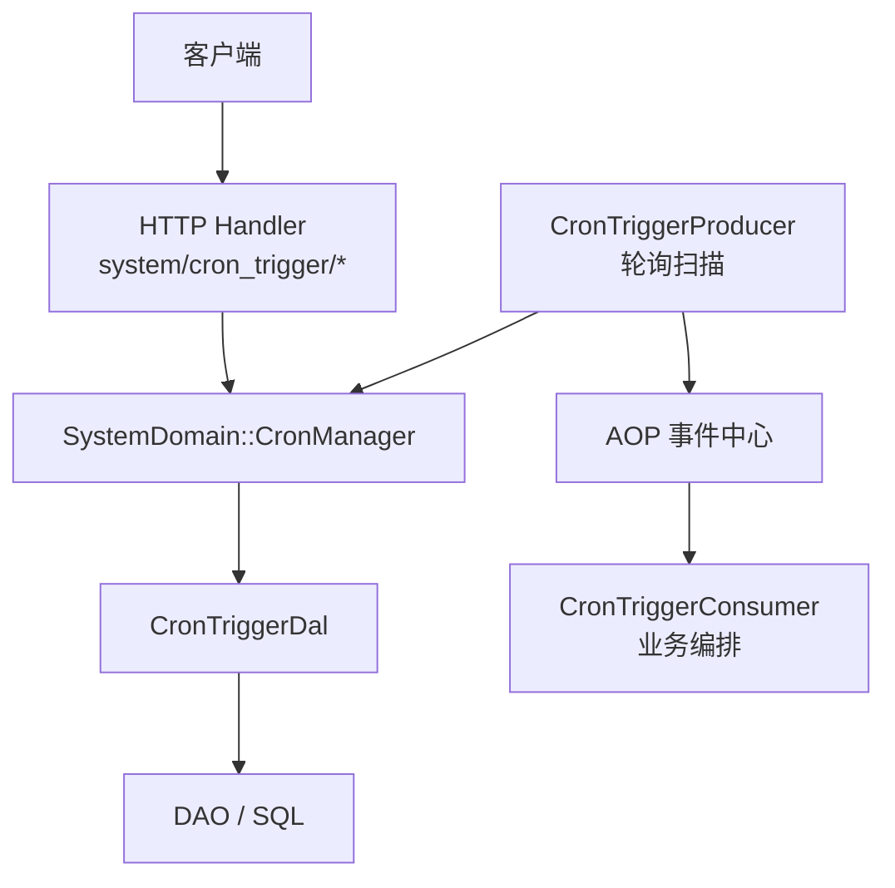
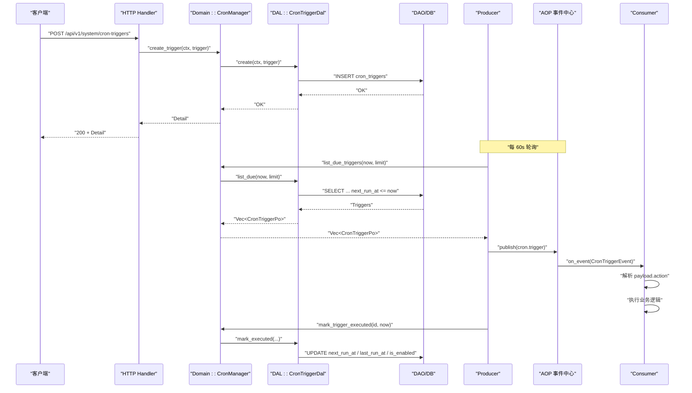
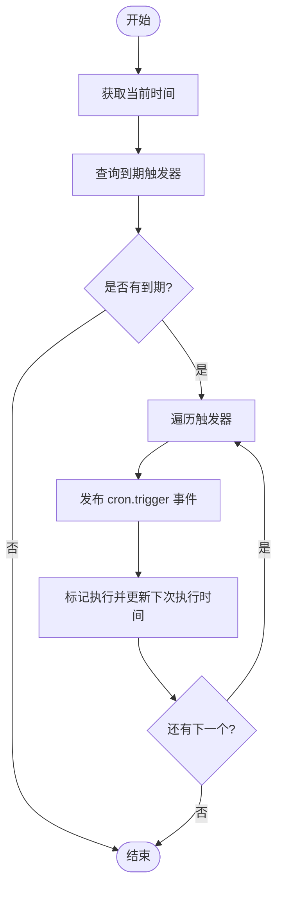
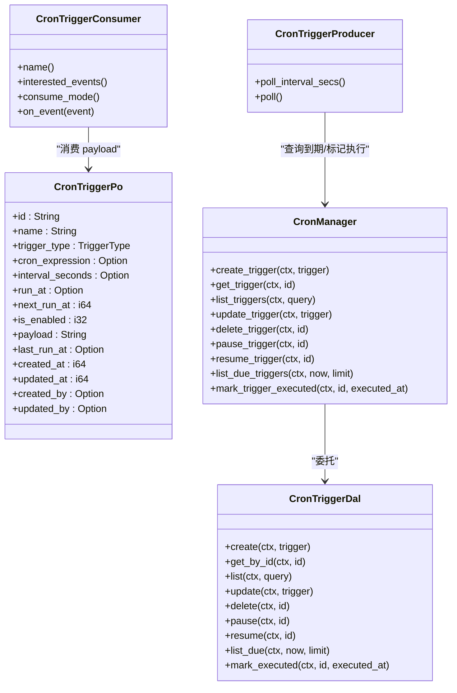

# 定时任务管理

<cite>
**本文引用的文件**
- [common/src/api/cron_trigger.rs](common/src/api/cron_trigger.rs)
- [common/src/enums/cron_trigger.rs](common/src/enums/cron_trigger.rs)
- [src/models/cron_trigger.rs](src/models/cron_trigger.rs)
- [src/models/events/cron_trigger.rs](src/models/events/cron_trigger.rs)
- [src/service/dal/cron_trigger.rs](src/service/dal/cron_trigger.rs)
- [src/service/domain/system/mod.rs](src/service/domain/system/mod.rs)
- [src/producer/cron_trigger.rs](src/producer/cron_trigger.rs)
- [src/consumer/scheduler.rs](src/consumer/scheduler.rs)
- [src/handlers/system/cron_trigger/create_cron_trigger.rs](src/handlers/system/cron_trigger/create_cron_trigger.rs)
- [src/handlers/system/cron_trigger/update_cron_trigger.rs](src/handlers/system/cron_trigger/update_cron_trigger.rs)
- [src/handlers/system/cron_trigger/get_cron_trigger.rs](src/handlers/system/cron_trigger/get_cron_trigger.rs)
- [src/handlers/system/cron_trigger/response.rs](src/handlers/system/cron_trigger/response.rs)
- [migrations/20260711000000_cron_triggers.sql](migrations/20260711000000_cron_triggers.sql)

### 本文关联的三类文档（四类互引闭环）

**① 设计文档（Design）**：
- [任务调度器设计](docs/design/task_scheduler_design.md) — Cron 解析、生产者消费者与两阶段初始化规范

**② 落地计划（Plan）**：
- [唤醒上下文与睡眠约束](docs/plan/唤醒上下文与睡眠约束.md) — Agent 睡眠沉淀与唤醒上下文落地点

**④ RAG 原子知识卡**：
- [Cron 任务调度与系统启动顺序 RAG 卡](docs/wiki/knowledge/zh/Cron%20%E4%BB%BB%E5%8A%A1%E8%B0%83%E5%BA%A6%E4%B8%8E%E7%B3%BB%E7%BB%9F%E5%90%AF%E5%8A%A8%E9%A1%BA%E5%BA%8F%EF%BC%9A5%E5%AD%97%E6%AE%B5cron%E8%A7%A3%E6%9E%90%20+%20ensure_system_cron_triggers%202%E6%9D%A1%E6%B3%A8%E5%85%A5%20+%20CronTriggerConsumer%20%E4%BA%8B%E4%BB%B6%20+%20%E4%B8%A4%E9%98%B6%E6%AE%B5init/aop%E4%B8%A5%E6%A0%BC%E5%88%86%E7%A6%BB/Cron%20%E4%BB%BB%E5%8A%A1%E8%B0%83%E5%BA%A6%E4%B8%8E%E7%B3%BB%E7%BB%9F%E5%90%AF%E5%8A%A8%E9%A1%BA%E5%BA%8F%EF%BC%9A5%E5%AD%97%E6%AE%B5cron%E8%A7%A3%E6%9E%90%20+%20ensure_system_cron_triggers%202%E6%9D%A1%E6%B3%A8%E5%85%A5%20+%20CronTriggerConsumer%20%E4%BA%8B%E4%BB%B6%20+%20%E4%B8%A4%E9%98%B6%E6%AE%B5init/aop%E4%B8%A5%E6%A0%BC%E5%88%86%E7%A6%BB.md) — 5 字段 cron 解析 + 2 条系统触发器 + 两阶段 init/aop 分离速查
</cite>

## 目录
1. [简介](#简介)
2. [项目结构](#项目结构)
3. [核心组件](#核心组件)
4. [架构总览](#架构总览)
5. [详细组件分析](#详细组件分析)
6. [依赖关系分析](#依赖关系分析)
7. [性能与并发](#性能与并发)
8. [故障排查指南](#故障排查指南)
9. [结论](#结论)
10. [附录：API 接口文档](#附录api-接口文档)

## 简介
本模块提供“定时任务（Cron Trigger）”的完整管理能力，包括触发器配置、调度扫描、事件投递与业务消费。当前实现支持一次性触发（Once）和固定间隔触发（Interval），Cron 表达式类型已预留字段但尚未启用解析；系统启动时会幂等注入两条默认系统级定时任务（Agent 睡眠沉淀、项目进度巡检）。

## 项目结构
围绕定时任务的关键代码按四层组织：
- Adapter 层：HTTP Handler 暴露 REST API，负责参数校验与响应转换。
- Domain 层：SystemDomain::CronManager 定义领域能力边界，统一对外暴露 Cron 触发器管理能力。
- DAL 层：封装 DAO 调用，处理暂停/恢复、下次执行时间计算等轻量业务规则。
- DAO 层：数据库访问（SQL 迁移与查询由 sqlx 管理）。
- Producer/Consumer：Producer 周期性扫描到期触发器并投递事件；Consumer 订阅事件并路由到具体业务逻辑。

图表来源
- [src/handlers/system/cron_trigger/create_cron_trigger.rs:1-68](src/handlers/system/cron_trigger/create_cron_trigger.rs#L1-L68)
- [src/service/domain/system/mod.rs:116-141](src/service/domain/system/mod.rs#L116-L141)
- [src/service/dal/cron_trigger.rs:37-74](src/service/dal/cron_trigger.rs#L37-L74)
- [src/producer/cron_trigger.rs:26-87](src/producer/cron_trigger.rs#L26-L87)
- [src/consumer/scheduler.rs:39-95](src/consumer/scheduler.rs#L39-L95)

章节来源
- [src/handlers/system/cron_trigger/mod.rs:1-20](src/handlers/system/cron_trigger/mod.rs#L1-L20)
- [src/service/domain/system/mod.rs:20-58](src/service/domain/system/mod.rs#L20-L58)
- [src/service/dal/cron_trigger.rs:13-32](src/service/dal/cron_trigger.rs#L13-L32)
- [migrations/20260711000000_cron_triggers.sql:1-25](migrations/20260711000000_cron_triggers.sql#L1-L25)

## 核心组件
- 数据模型与枚举
  - 触发器持久化对象：CronTriggerPo（包含名称、类型、表达式/间隔/单次时间、下次执行时间、负载 JSON、审计字段等）。
  - 触发类型：TriggerType（Once/Cron/Interval），Cron 类型当前未启用。
- 领域能力
  - SystemDomain::CronManager：创建、查询、更新、删除、暂停/恢复、列出到期触发器、标记执行完成。
- 数据访问
  - CronTriggerDal：封装 DAO 调用，并在 mark_executed 中根据类型计算下次执行时间或禁用一次性任务。
- 生产者与消费者
  - CronTriggerProducer：每 60 秒轮询一次，查询到期触发器，发布 cron.trigger 事件，并立即更新下次执行时间。
  - CronTriggerConsumer：同步消费 cron.trigger 事件，按 payload.action 分发到具体业务处理（如 agent_rest、project_followup）。
- 存储
  - cron_triggers 表及索引，用于高效查询到期触发器与状态过滤。

章节来源
- [src/models/cron_trigger.rs:1-66](src/models/cron_trigger.rs#L1-L66)
- [common/src/enums/cron_trigger.rs:1-47](common/src/enums/cron_trigger.rs#L1-L47)
- [src/service/domain/system/mod.rs:116-141](src/service/domain/system/mod.rs#L116-L141)
- [src/service/dal/cron_trigger.rs:76-177](src/service/dal/cron_trigger.rs#L76-L177)
- [src/producer/cron_trigger.rs:1-87](src/producer/cron_trigger.rs#L1-L87)
- [src/consumer/scheduler.rs:1-95](src/consumer/scheduler.rs#L1-L95)
- [migrations/20260711000000_cron_triggers.sql:1-25](migrations/20260711000000_cron_triggers.sql#L1-L25)

## 架构总览
定时任务的运行链路如下：
- 创建/修改触发器时，Handler 将请求转换为领域模型，通过 Domain → DAL → DAO 持久化。
- Producer 周期扫描到期触发器，发布事件并更新下次执行时间。
- Consumer 接收事件后，解析 payload.action 并调用对应业务方法。

图表来源
- [src/handlers/system/cron_trigger/create_cron_trigger.rs:14-68](src/handlers/system/cron_trigger/create_cron_trigger.rs#L14-L68)
- [src/service/domain/system/mod.rs:207-259](src/service/domain/system/mod.rs#L207-L259)
- [src/service/dal/cron_trigger.rs:83-177](src/service/dal/cron_trigger.rs#L83-L177)
- [src/producer/cron_trigger.rs:26-87](src/producer/cron_trigger.rs#L26-L87)
- [src/consumer/scheduler.rs:39-95](src/consumer/scheduler.rs#L39-L95)

## 详细组件分析

### 数据模型与存储
- CronTriggerPo：承载触发器全部配置与审计信息，包含触发类型、表达式/间隔/单次时间、下次执行时间、负载 JSON、最后执行时间等。
- 表结构与索引：cron_triggers 表使用严格模式，next_run_at、is_enabled、trigger_type、created_at 建立索引以优化查询与过滤。

章节来源
- [src/models/cron_trigger.rs:10-65](src/models/cron_trigger.rs#L10-L65)
- [migrations/20260711000000_cron_triggers.sql:4-24](migrations/20260711000000_cron_triggers.sql#L4-L24)

### 领域能力：CronManager
- 职责：统一对外暴露触发器的 CRUD、暂停/恢复、到期列表与执行标记。
- 关键行为：
  - create_trigger：写入新触发器。
  - list_due_triggers：查询到期触发器供 Producer 使用。
  - mark_trigger_executed：根据类型更新下次执行时间或禁用一次性任务。

章节来源
- [src/service/domain/system/mod.rs:116-141](src/service/domain/system/mod.rs#L116-L141)
- [src/service/domain/system/mod.rs:207-259](src/service/domain/system/mod.rs#L207-L259)

### 数据访问层：CronTriggerDal
- 暂停/恢复：读取记录，切换 is_enabled，并更新时间戳与操作人。
- 标记执行：
  - Once：设置 last_run_at，禁用触发器。
  - Interval：基于 executed_at + interval_seconds 计算 next_run_at 并更新。
  - Cron：当前返回不支持错误，表示 Cron 表达式解析尚未实现。

章节来源
- [src/service/dal/cron_trigger.rs:109-177](src/service/dal/cron_trigger.rs#L109-L177)

### 生产者：CronTriggerProducer
- 轮询间隔：60 秒。
- 流程：
  - 获取系统上下文与当前时间。
  - 调用 Domain::list_due_triggers 获取到期触发器。
  - 为每个触发器构造 CronTriggerEvent 并发布到 AOP 事件中心。
  - 立即调用 Domain::mark_trigger_executed 更新下次执行时间。

图表来源
- [src/producer/cron_trigger.rs:26-87](src/producer/cron_trigger.rs#L26-L87)

章节来源
- [src/producer/cron_trigger.rs:1-87](src/producer/cron_trigger.rs#L1-L87)

### 消费者：CronTriggerConsumer
- 订阅事件：cron.trigger。
- 消费模式：同步（ConsumeMode::Sync）。
- 处理逻辑：反序列化事件与 payload，按 action 分发到不同业务处理（如 agent_rest、project_followup）。

章节来源
- [src/consumer/scheduler.rs:39-95](src/consumer/scheduler.rs#L39-L95)
- [src/models/events/cron_trigger.rs:1-30](src/models/events/cron_trigger.rs#L1-L30)

### HTTP 接口层
- 创建触发器：校验必填字段并根据类型计算 next_run_at；Cron 类型当前返回不支持错误。
- 更新/获取/删除/暂停/恢复：均委托 Domain::CronManager。
- 响应结构：统一使用 CronTriggerDetail 描述触发器详情。

章节来源
- [src/handlers/system/cron_trigger/create_cron_trigger.rs:14-68](src/handlers/system/cron_trigger/create_cron_trigger.rs#L14-L68)
- [src/handlers/system/cron_trigger/update_cron_trigger.rs:11-57](src/handlers/system/cron_trigger/update_cron_trigger.rs#L11-L57)
- [src/handlers/system/cron_trigger/get_cron_trigger.rs:11-25](src/handlers/system/cron_trigger/get_cron_trigger.rs#L11-L25)
- [src/handlers/system/cron_trigger/response.rs:8-125](src/handlers/system/cron_trigger/response.rs#L8-L125)

### 系统级默认任务
- 启动时幂等注入两条系统级定时任务：
  - Agent 睡眠沉淀：每 4 小时执行一次。
  - 项目进度巡检：每 1 小时执行一次。
- 通过检查 payload 是否包含特定 action 字符串进行去重，避免重复创建。

章节来源
- [src/service/domain/system/mod.rs:358-416](src/service/domain/system/mod.rs#L358-L416)

## 依赖关系分析
- Handler 仅依赖 Domain，不直接访问 DAL/DAO。
- Domain 通过 trait 组合多个管理器（CronManager、BackupManager、LogQuery 等）。
- DAL 依赖 DAO，封装事务与业务规则。
- Producer/Consumer 通过 AOP 事件中心解耦调度与执行。

图表来源
- [src/models/cron_trigger.rs:10-65](src/models/cron_trigger.rs#L10-L65)
- [src/service/dal/cron_trigger.rs:37-74](src/service/dal/cron_trigger.rs#L37-L74)
- [src/service/domain/system/mod.rs:116-141](src/service/domain/system/mod.rs#L116-L141)
- [src/producer/cron_trigger.rs:26-87](src/producer/cron_trigger.rs#L26-L87)
- [src/consumer/scheduler.rs:39-95](src/consumer/scheduler.rs#L39-L95)

章节来源
- [src/service/domain/system/mod.rs:20-58](src/service/domain/system/mod.rs#L20-L58)
- [src/service/dal/cron_trigger.rs:13-32](src/service/dal/cron_trigger.rs#L13-L32)

## 性能与并发
- 轮询频率：Producer 每 60 秒扫描一次到期触发器，limit=100，避免单次扫描过多。
- 数据库索引：next_run_at、is_enabled、trigger_type、created_at 提升查询效率。
- 事件驱动：Producer 与 Consumer 通过 AOP 解耦，降低耦合度与阻塞风险。
- 并发控制：当前实现未显式限制同一触发器的并发执行；如需增强，可在 Consumer 侧增加基于 trigger_id 的去重锁或队列限流。
- 超时与重试：当前未实现任务执行超时与自动重试机制；建议在 Consumer 扩展中引入超时控制与重试策略。

[本节为通用指导，无需引用具体文件]

## 故障排查指南
- 创建失败
  - 检查必填字段：Once 需要 run_at，Interval 需要 interval_seconds；Cron 类型当前不支持。
  - 参考路径：[创建处理器:14-68](src/handlers/system/cron_trigger/create_cron_trigger.rs#L14-L68)
- 无法触发
  - 确认 is_enabled 是否为 1。
  - 检查 next_run_at 是否小于等于当前时间。
  - 参考路径：[DAL 标记执行逻辑:140-177](src/service/dal/cron_trigger.rs#L140-L177)
- 事件未消费
  - 确认 Consumer 已注册并订阅 cron.trigger。
  - 检查 payload 中的 action 是否被识别。
  - 参考路径：[消费者处理:53-95](src/consumer/scheduler.rs#L53-L95)
- 日志与统计
  - 可通过系统日志与 AOP 统计面板查看事件流转与队列状态。
  - 参考路径：[AOP 统计接口](src/service/domain/system/mod.rs#L172-L204)

章节来源
- [src/handlers/system/cron_trigger/create_cron_trigger.rs:14-68](src/handlers/system/cron_trigger/create_cron_trigger.rs#L14-L68)
- [src/service/dal/cron_trigger.rs:140-177](src/service/dal/cron_trigger.rs#L140-L177)
- [src/consumer/scheduler.rs:53-95](src/consumer/scheduler.rs#L53-L95)
- [src/service/domain/system/mod.rs:172-204](src/service/domain/system/mod.rs#L172-L204)

## 结论
当前定时任务管理实现了稳定的 Once/Interval 调度能力，并通过 AOP 事件机制解耦生产与消费。Cron 表达式解析尚未启用，后续可在此基础上扩展更丰富的调度语法与时区支持。建议在生产环境补充超时控制、重试机制与并发控制，以提升鲁棒性与可观测性。

[本节为总结，无需引用具体文件]

## 附录：API 接口文档

### 公共数据结构
- 触发类型：Once/Cron/Interval（Cron 当前不可用）。
- 触发器详情：包含 ID、名称、类型、表达式/间隔/单次时间、下次执行时间、是否启用、负载 JSON、最后执行时间、创建/更新时间与操作人。

章节来源
- [common/src/enums/cron_trigger.rs:9-22](common/src/enums/cron_trigger.rs#L9-L22)
- [common/src/api/cron_trigger.rs:45-88](common/src/api/cron_trigger.rs#L45-L88)
- [src/handlers/system/cron_trigger/response.rs:64-105](src/handlers/system/cron_trigger/response.rs#L64-L105)

### 接口清单
- 创建触发器
  - 方法：POST
  - 路径：/api/v1/system/cron-triggers
  - 请求体：CreateCronTriggerRequest（name、trigger_type、cron_expression、interval_seconds、run_at、payload）
  - 说明：Once 需 run_at；Interval 需 interval_seconds；Cron 当前返回不支持错误。
  - 参考路径：[创建处理器:14-68](src/handlers/system/cron_trigger/create_cron_trigger.rs#L14-L68)
- 获取触发器
  - 方法：GET
  - 路径：/api/v1/system/cron-triggers/{trigger_id}
  - 参考路径：[获取处理器:11-25](src/handlers/system/cron_trigger/get_cron_trigger.rs#L11-L25)
- 更新触发器
  - 方法：PUT
  - 路径：/api/v1/system/cron-triggers/{trigger_id}
  - 请求体：UpdateCronTriggerRequest（可选字段覆盖）
  - 参考路径：[更新处理器:11-57](src/handlers/system/cron_trigger/update_cron_trigger.rs#L11-L57)
- 删除触发器
  - 方法：DELETE
  - 路径：/api/v1/system/cron-triggers/{trigger_id}
  - 参考路径：[删除处理器](src/handlers/system/cron_trigger/delete_cron_trigger.rs)
- 暂停触发器
  - 方法：POST
  - 路径：/api/v1/system/cron-triggers/{trigger_id}/pause
  - 参考路径：[暂停处理器](src/handlers/system/cron_trigger/pause_cron_trigger.rs)
- 恢复触发器
  - 方法：POST
  - 路径：/api/v1/system/cron-triggers/{trigger_id}/resume
  - 参考路径：[恢复处理器](src/handlers/system/cron_trigger/resume_cron_trigger.rs)
- 列出触发器
  - 方法：GET
  - 路径：/api/v1/system/cron-triggers
  - 查询参数：trigger_type、is_enabled、limit
  - 参考路径：[列表处理器](src/handlers/system/cron_trigger/list_cron_triggers.rs)

### Cron 表达式与时区
- 当前 Cron 类型未启用解析，创建时将返回不支持错误。
- 时区处理：调度基于 Unix 毫秒时间戳，未体现时区转换；如需多时区支持，应在 DAL 层增加时区感知逻辑。

章节来源
- [src/handlers/system/cron_trigger/create_cron_trigger.rs:32-37](src/handlers/system/cron_trigger/create_cron_trigger.rs#L32-L37)
- [src/service/dal/cron_trigger.rs:168-173](src/service/dal/cron_trigger.rs#L168-L173)

### 常见使用场景
- 数据同步：通过 Interval 触发器定期拉取外部数据，payload 中包含 action 与同步参数。
- 报告生成：Interval 或 Once 触发报表生成任务，payload 指定报表模板与范围。
- 清理任务：Interval 触发清理过期数据，payload 指定保留策略。
- 健康检查：Interval 触发健康检查，payload 包含目标服务与检查项。

[本节为概念性内容，无需引用具体文件]