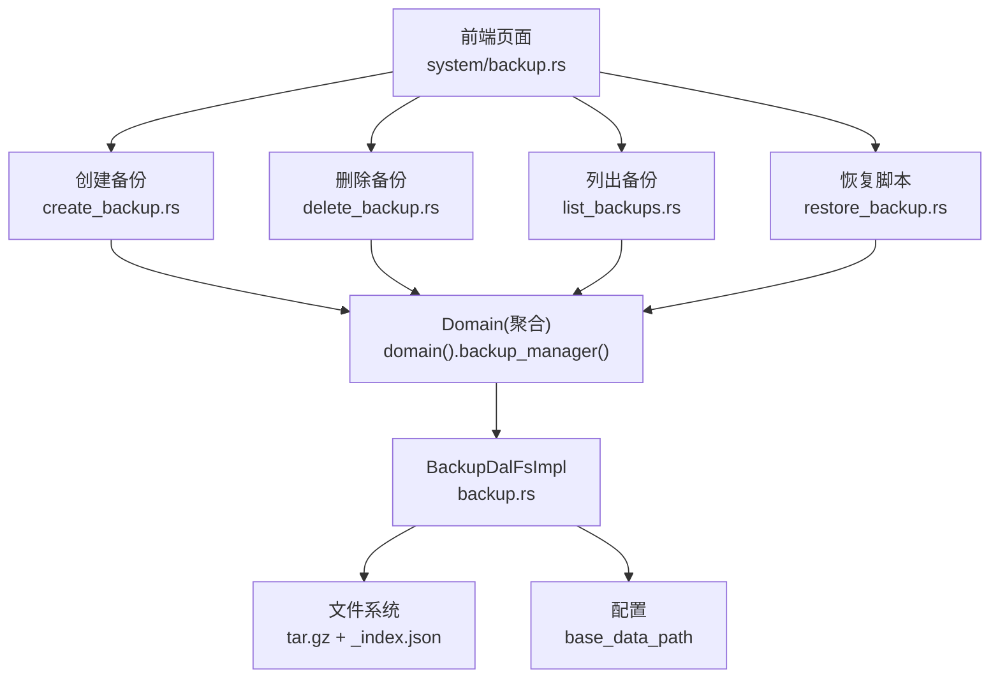
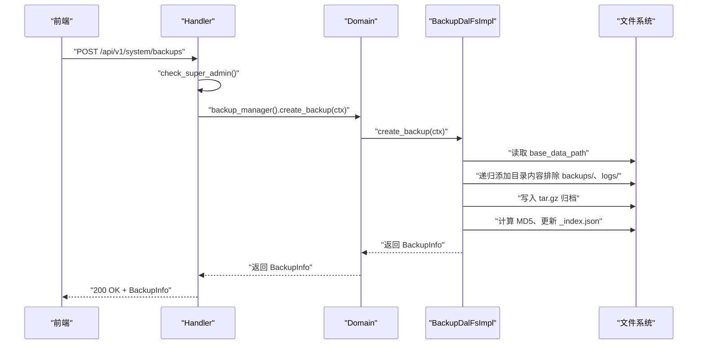
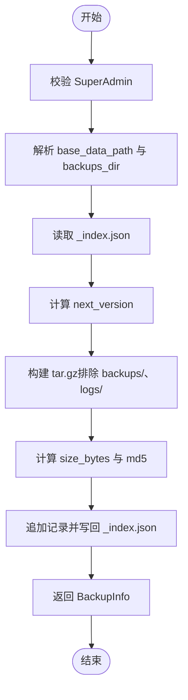
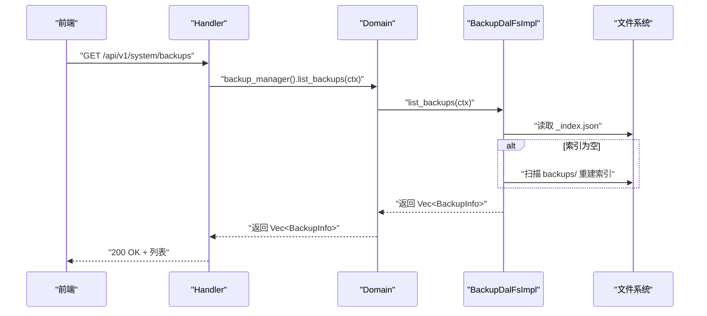
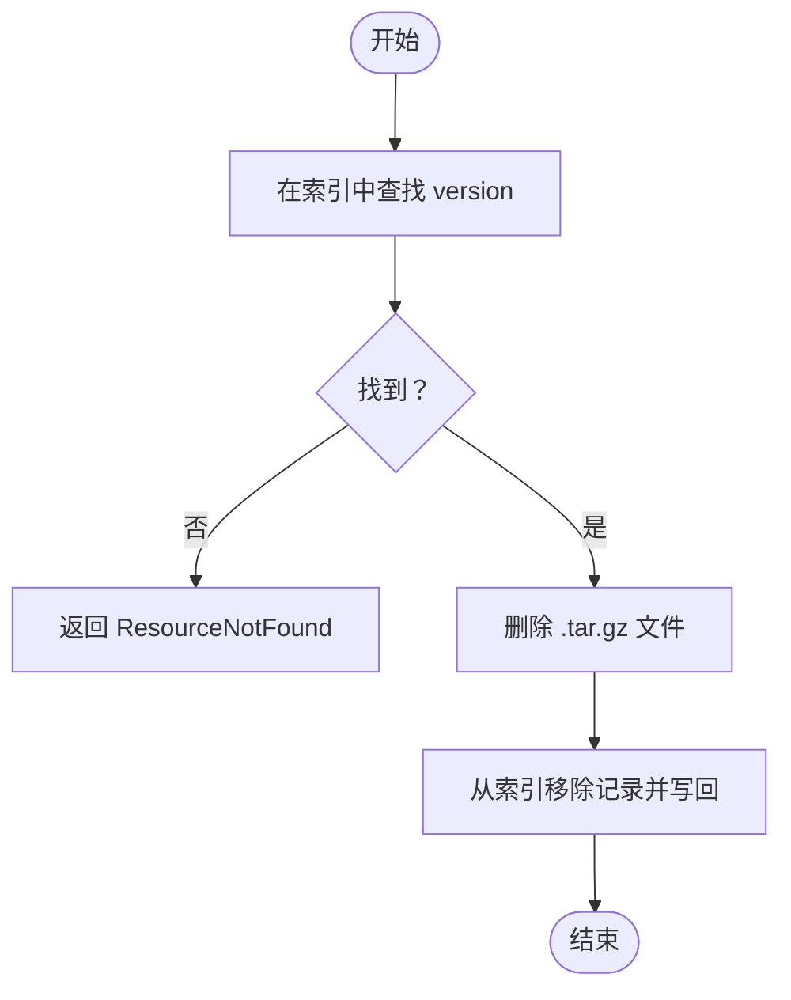
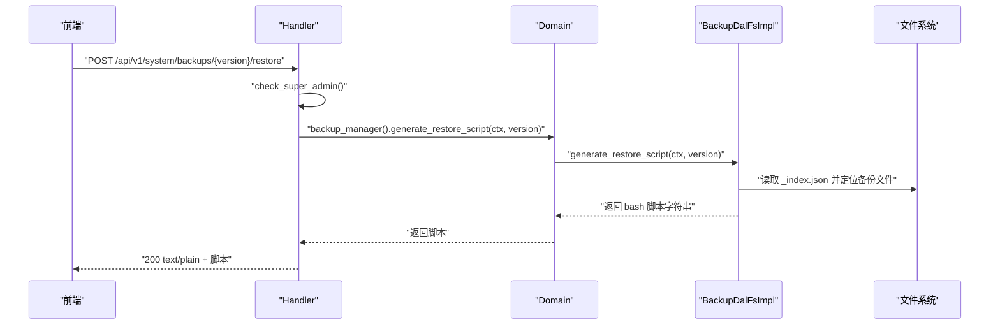
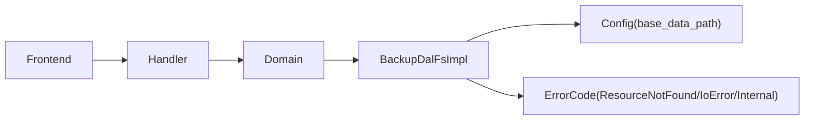

# 数据备份与恢复

<cite>
**本文引用的文件**
- [src/service/dal/backup.rs](src/service/dal/backup.rs)
- [src/handlers/system/backup/mod.rs](src/handlers/system/backup/mod.rs)
- [src/handlers/system/backup/create_backup.rs](src/handlers/system/backup/create_backup.rs)
- [src/handlers/system/backup/delete_backup.rs](src/handlers/system/backup/delete_backup.rs)
- [src/handlers/system/backup/list_backups.rs](src/handlers/system/backup/list_backups.rs)
- [src/handlers/system/backup/restore_backup.rs](src/handlers/system/backup/restore_backup.rs)
- [common/src/config.rs](common/src/config.rs)
- [common/src/error/code.rs](common/src/error/code.rs)
- [frontend/src/pages/system/backup.rs](frontend/src/pages/system/backup.rs)
</cite>

## 目录
1. [简介](#简介)
2. [项目结构](#项目结构)
3. [核心组件](#核心组件)
4. [架构总览](#架构总览)
5. [详细组件分析](#详细组件分析)
6. [依赖关系分析](#依赖关系分析)
7. [性能考虑](#性能考虑)
8. [故障排查指南](#故障排查指南)
9. [结论](#结论)
10. [附录：API 接口文档](#附录api-接口文档)

## 简介
本章节面向数据备份与恢复能力，围绕 SQLite 数据库所在的数据目录进行全量归档备份、列表查询、删除清理以及恢复脚本生成。系统采用“四层单向调用”的架构：Adapter（HTTP Handler）→ Domain → DAL → DAO，禁止跨层调用与同层互调；DAL 层负责将数据目录打包为 tar.gz 归档并维护索引；Handler 层负责鉴权与路由；前端提供可视化操作界面。

## 项目结构
备份功能涉及以下关键位置：
- Handler 层：位于 src/handlers/system/backup，按方法粒度拆分，包含创建、删除、列表、恢复脚本获取等入口。
- DAL 层：位于 src/service/dal/backup.rs，实现备份创建、列表、删除、恢复脚本生成等核心逻辑。
- 配置：base_data_path 决定数据根目录，backups/ 子目录用于存放备份归档与索引。
- 前端：frontend/src/pages/system/backup.rs 提供备份管理页面，支持创建、删除、查看恢复脚本等操作。

图表来源
- [src/handlers/system/backup/create_backup.rs:1-27](src/handlers/system/backup/create_backup.rs#L1-L27)
- [src/handlers/system/backup/delete_backup.rs:1-25](src/handlers/system/backup/delete_backup.rs#L1-L25)
- [src/handlers/system/backup/list_backups.rs:1-22](src/handlers/system/backup/list_backups.rs#L1-L22)
- [src/handlers/system/backup/restore_backup.rs:1-35](src/handlers/system/backup/restore_backup.rs#L1-L35)
- [src/service/dal/backup.rs:1-243](src/service/dal/backup.rs#L1-L243)
- [common/src/config.rs:244-252](common/src/config.rs#L244-L252)

章节来源
- [src/handlers/system/backup/mod.rs:1-32](src/handlers/system/backup/mod.rs#L1-L32)
- [src/service/dal/backup.rs:1-243](src/service/dal/backup.rs#L1-L243)
- [common/src/config.rs:244-252](common/src/config.rs#L244-L252)

## 核心组件
- BackupInfo：单个备份元信息，包含版本号、时间戳、文件名、大小、MD5。
- BackupIndex：备份索引文件（_index.json），包含 schema_version 与 backups 列表。
- BackupDal 接口：定义 create_backup、list_backups、delete_backup、generate_restore_script。
- BackupDalFsImpl：基于文件系统的实现，负责归档、索引读写、MD5 计算、目录排除策略。
- Handler 校验：check_super_admin 确保仅 SuperAdmin 可执行高危操作。

章节来源
- [src/service/dal/backup.rs:21-84](src/service/dal/backup.rs#L21-L84)
- [src/handlers/system/backup/mod.rs:19-32](src/handlers/system/backup/mod.rs#L19-L32)

## 架构总览
备份流程遵循 Adapter → Domain → DAL → 文件系统的单向调用链。Handler 接收请求并进行权限校验，随后委托 Domain 的 backup_manager 调用 DAL 的具体实现。DAL 通过配置获取 base_data_path，对数据目录进行递归遍历并生成 tar.gz 归档，同时维护 _index.json 索引。

图表来源
- [src/handlers/system/backup/create_backup.rs:16-26](src/handlers/system/backup/create_backup.rs#L16-L26)
- [src/service/dal/backup.rs:102-152](src/service/dal/backup.rs#L102-L152)
- [common/src/config.rs:244-252](common/src/config.rs#L244-L252)

## 详细组件分析

### 备份创建流程
- 权限校验：Handler 内部二次校验 SuperAdmin。
- 路径解析：从配置获取 base_data_path，构建 backups_dir。
- 索引读取：读取或初始化 _index.json，计算下一个版本号。
- 归档构建：使用 tar::Builder + GzEncoder 递归添加数据目录内容，排除顶层 backups/ 和 logs/。
- 元信息计算：计算文件大小与 MD5，追加到索引并持久化。
- 返回结果：返回 BackupInfo。

图表来源
- [src/handlers/system/backup/create_backup.rs:16-26](src/handlers/system/backup/create_backup.rs#L16-L26)
- [src/service/dal/backup.rs:102-152](src/service/dal/backup.rs#L102-L152)

章节来源
- [src/handlers/system/backup/create_backup.rs:1-27](src/handlers/system/backup/create_backup.rs#L1-L27)
- [src/service/dal/backup.rs:102-152](src/service/dal/backup.rs#L102-L152)

### 备份列表查询
- 读取索引：若索引不存在或为空，扫描 backups/ 目录重建索引。
- 排序返回：按 version 降序返回备份列表。
- 前端展示：显示版本、时间、文件名、大小、MD5，并提供恢复与删除操作。

图表来源
- [src/handlers/system/backup/list_backups.rs:13-21](src/handlers/system/backup/list_backups.rs#L13-L21)
- [src/service/dal/backup.rs:154-174](src/service/dal/backup.rs#L154-L174)
- [src/service/dal/backup.rs:358-394](src/service/dal/backup.rs#L358-L394)

章节来源
- [src/handlers/system/backup/list_backups.rs:1-22](src/handlers/system/backup/list_backups.rs#L1-L22)
- [src/service/dal/backup.rs:154-174](src/service/dal/backup.rs#L154-L174)
- [frontend/src/pages/system/backup.rs:59-78](frontend/src/pages/system/backup.rs#L59-L78)

### 备份删除管理
- 定位备份：根据 version 在索引中查找对应记录。
- 删除文件：移除对应的 .tar.gz 归档文件。
- 更新索引：从索引中移除该记录并写回。
- 错误处理：若版本不存在，返回 ResourceNotFound。

图表来源
- [src/handlers/system/backup/delete_backup.rs:14-24](src/handlers/system/backup/delete_backup.rs#L14-L24)
- [src/service/dal/backup.rs:176-196](src/service/dal/backup.rs#L176-L196)

章节来源
- [src/handlers/system/backup/delete_backup.rs:1-25](src/handlers/system/backup/delete_backup.rs#L1-L25)
- [src/service/dal/backup.rs:176-196](src/service/dal/backup.rs#L176-L196)

### 数据恢复流程
- 恢复脚本生成：根据 version 查找备份文件路径，生成 bash 脚本。
- 脚本内容：提示停止服务、移动当前数据目录、解压归档、重启服务。
- 前端交互：弹出恢复脚本预览，支持复制脚本到剪贴板。

图表来源
- [src/handlers/system/backup/restore_backup.rs:18-35](src/handlers/system/backup/restore_backup.rs#L18-L35)
- [src/service/dal/backup.rs:198-243](src/service/dal/backup.rs#L198-L243)
- [frontend/src/pages/system/backup.rs:98-114](frontend/src/pages/system/backup.rs#L98-L114)

章节来源
- [src/handlers/system/backup/restore_backup.rs:1-35](src/handlers/system/backup/restore_backup.rs#L1-L35)
- [src/service/dal/backup.rs:198-243](src/service/dal/backup.rs#L198-L243)
- [frontend/src/pages/system/backup.rs:98-114](frontend/src/pages/system/backup.rs#L98-L114)

### 备份存储格式与命名规范
- 存储格式：tar.gz 归档，包含数据目录内容（排除 backups/ 与 logs/）。
- 索引格式：_index.json，包含 schema_version 与 backups 列表。
- 命名规范：v{version}_{YYYYMMDD_HHMMSS}.tar.gz，例如 v1_20260717_153000.tar.gz。
- 元信息：每个备份记录包含 version、timestamp、file_name、size_bytes、md5。

章节来源
- [src/service/dal/backup.rs:21-43](src/service/dal/backup.rs#L21-L43)
- [src/service/dal/backup.rs:114-118](src/service/dal/backup.rs#L114-L118)
- [src/service/dal/backup.rs:358-394](src/service/dal/backup.rs#L358-L394)

### 锁表机制、事务处理与并发控制
- 锁表机制：当前实现未显式对 SQLite 数据库加锁；备份针对数据目录进行文件级归档。
- 事务处理：备份过程不涉及数据库事务；索引读写为文件 I/O。
- 并发控制：无全局锁；多实例并发备份可能产生竞争，建议外部协调（如进程锁或任务队列）。

章节来源
- [src/service/dal/backup.rs:102-152](src/service/dal/backup.rs#L102-L152)
- [src/service/dal/backup.rs:247-266](src/service/dal/backup.rs#L247-L266)

### 存储空间管理与保留策略
- 空间管理：备份文件占用 backups/ 目录空间；可通过删除旧备份释放空间。
- 保留策略：当前未内置自动清理策略；需结合外部工具或定时任务按版本或时间清理。
- 建议：定期评估备份数量与大小，避免磁盘耗尽。

章节来源
- [src/service/dal/backup.rs:176-196](src/service/dal/backup.rs#L176-L196)
- [frontend/src/pages/system/backup.rs:122-149](frontend/src/pages/system/backup.rs#L122-L149)

## 依赖关系分析
- Handler 依赖 Domain 的 backup_manager 抽象，实际由 DAL 实现。
- DAL 依赖配置模块获取 base_data_path。
- 错误码统一来自 common::error，包括 ResourceNotFound、IoError、Internal 等。
- 前端依赖后端 API 进行备份管理操作。

图表来源
- [src/handlers/system/backup/mod.rs:19-32](src/handlers/system/backup/mod.rs#L19-L32)
- [src/service/dal/backup.rs:102-152](src/service/dal/backup.rs#L102-L152)
- [common/src/error/code.rs:22-66](common/src/error/code.rs#L22-L66)

章节来源
- [common/src/error/code.rs:1-146](common/src/error/code.rs#L1-L146)
- [common/src/config.rs:244-252](common/src/config.rs#L244-L252)

## 性能考虑
- 归档性能：tar.gz 压缩影响 CPU 与 IO，大目录备份耗时较长。
- 索引重建：当索引缺失时扫描 backups/ 目录，可能带来额外 IO。
- 建议：在低峰期执行备份；合理设置备份频率；监控磁盘 IO 与 CPU 使用率。

[本节为通用指导，不直接分析具体文件]

## 故障排查指南
- 权限不足：确认当前用户角色为 SuperAdmin。
- 资源未找到：检查备份版本是否存在于索引中。
- IO 错误：检查 backups/ 目录权限与磁盘空间。
- 索引损坏：系统将尝试重建索引；若失败，手动修复 _index.json。

章节来源
- [src/handlers/system/backup/mod.rs:19-32](src/handlers/system/backup/mod.rs#L19-L32)
- [src/service/dal/backup.rs:176-196](src/service/dal/backup.rs#L176-L196)
- [src/service/dal/backup.rs:247-266](src/service/dal/backup.rs#L247-L266)
- [src/service/dal/backup.rs:358-394](src/service/dal/backup.rs#L358-L394)

## 结论
本实现提供了基于文件系统的 SQLite 数据目录全量备份能力，具备备份创建、列表查询、删除清理与恢复脚本生成功能。通过统一的索引机制与权限校验，保障了备份的可追溯性与安全性。未来可扩展增量备份、自动保留策略与更严格的并发控制。

[本节为总结性内容，不直接分析具体文件]

## 附录：API 接口文档

### 创建备份
- 方法：POST
- 路径：/api/v1/system/backups
- 权限：SuperAdmin
- 请求体：CreateBackupRequest（空参数）
- 响应：BackupInfo（version、timestamp、file_name、size_bytes、md5）
- 错误码：Forbidden（权限不足）、IoError（IO 失败）、Internal（索引序列化失败）

章节来源
- [src/handlers/system/backup/create_backup.rs:16-26](src/handlers/system/backup/create_backup.rs#L16-L26)
- [src/service/dal/backup.rs:102-152](src/service/dal/backup.rs#L102-L152)
- [common/src/error/code.rs:62-66](common/src/error/code.rs#L62-L66)

### 列出备份
- 方法：GET
- 路径：/api/v1/system/backups
- 权限：Admin/SuperAdmin（路由层限制）
- 响应：Vec<BackupInfo>（按 version 降序）
- 错误码：IoError（IO 失败）、Internal（索引解析失败）

章节来源
- [src/handlers/system/backup/list_backups.rs:13-21](src/handlers/system/backup/list_backups.rs#L13-L21)
- [src/service/dal/backup.rs:154-174](src/service/dal/backup.rs#L154-L174)
- [common/src/error/code.rs:62-66](common/src/error/code.rs#L62-L66)

### 删除备份
- 方法：DELETE
- 路径：/api/v1/system/backups/{version}
- 权限：SuperAdmin
- 路径参数：version（u64）
- 响应：空
- 错误码：ResourceNotFound（版本不存在）、IoError（IO 失败）

章节来源
- [src/handlers/system/backup/delete_backup.rs:14-24](src/handlers/system/backup/delete_backup.rs#L14-L24)
- [src/service/dal/backup.rs:176-196](src/service/dal/backup.rs#L176-L196)
- [common/src/error/code.rs:22-26](common/src/error/code.rs#L22-L26)

### 获取恢复脚本
- 方法：POST
- 路径：/api/v1/system/backups/{version}/restore
- 权限：SuperAdmin
- 路径参数：version（u64）
- 响应：text/plain（bash 脚本）
- 错误码：ResourceNotFound（版本不存在）、IoError（IO 失败）

章节来源
- [src/handlers/system/backup/restore_backup.rs:18-35](src/handlers/system/backup/restore_backup.rs#L18-L35)
- [src/service/dal/backup.rs:198-243](src/service/dal/backup.rs#L198-L243)
- [common/src/error/code.rs:22-26](common/src/error/code.rs#L22-L26)

### 实际使用示例与最佳实践
- 定时备份：结合 Cron Trigger 或外部调度器定期调用创建备份接口。
- 灾难恢复：通过恢复脚本在停机窗口内执行，先停止服务再恢复数据。
- 数据迁移：在不同环境间通过备份归档迁移数据目录。
- 最佳实践：
  - 仅在低峰期执行备份。
  - 定期清理过期备份以释放空间。
  - 验证备份完整性（MD5）后再用于恢复。

[本节为通用指导，不直接分析具体文件]