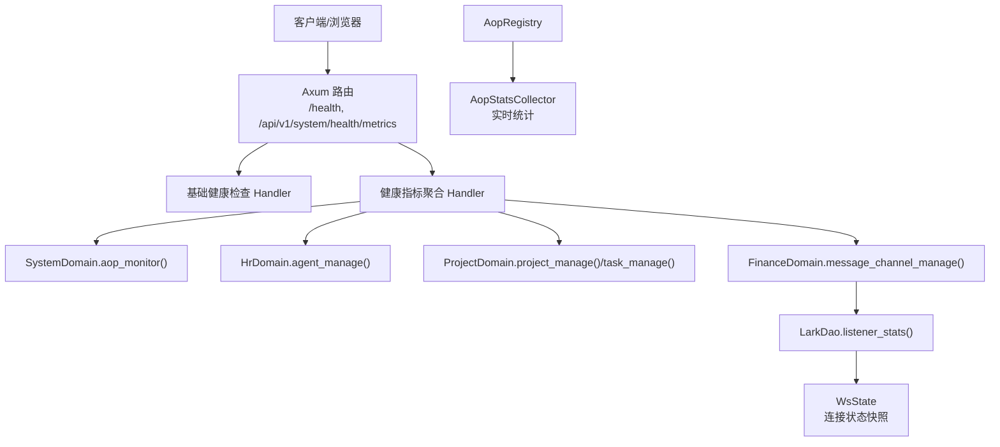
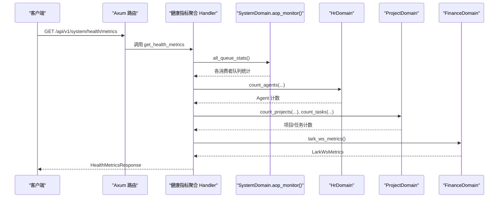
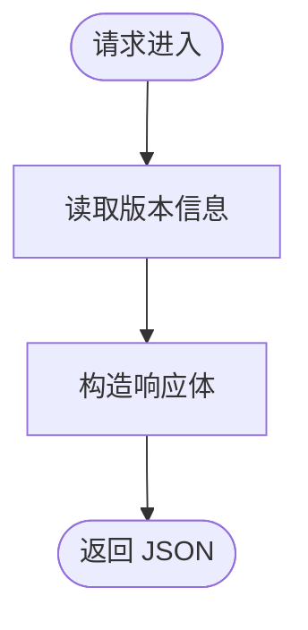
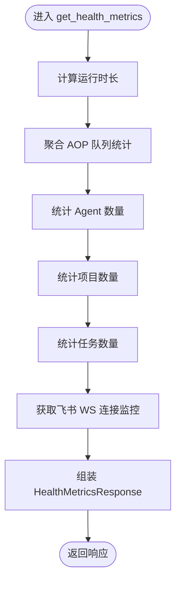
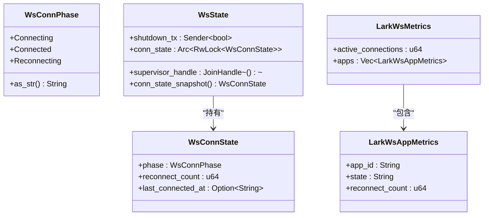
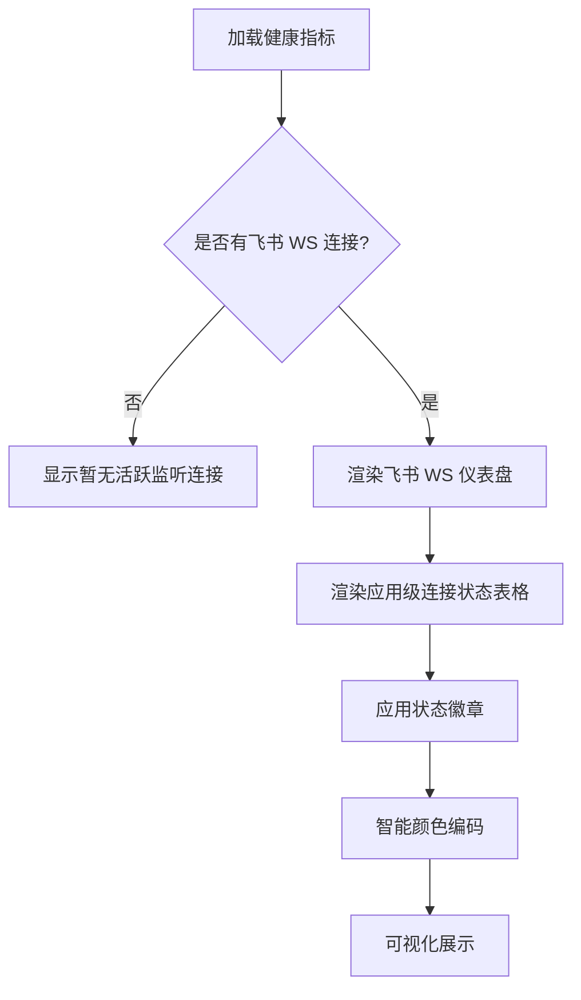
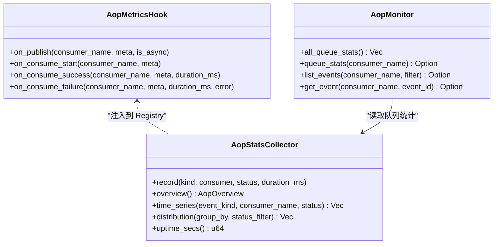
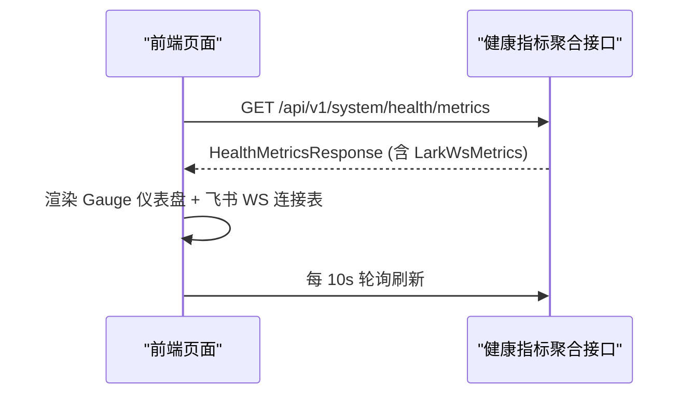
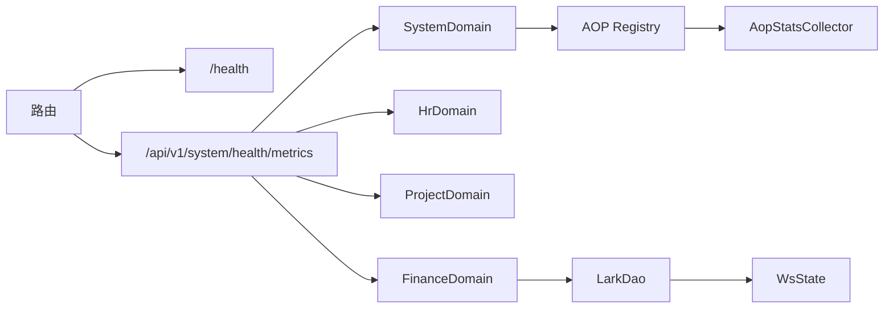

# 系统健康检查

<cite>
**本文引用的文件**
- [src/handlers/health.rs](src/handlers/health.rs)
- [src/handlers/system/health_metrics.rs](src/handlers/system/health_metrics.rs)
- [common/src/api/system.rs](common/src/api/system.rs)
- [src/router.rs](src/router.rs)
- [src/service/domain/system/aop_monitor.rs](src/service/domain/system/aop_monitor.rs)
- [src/pkg/aop/core/metrics_hook.rs](src/pkg/aop/core/metrics_hook.rs)
- [src/consumer/aop_stats_collector.rs](src/consumer/aop_stats_collector.rs)
- [frontend/src/pages/system/health.rs](frontend/src/pages/system/health.rs)
- [src/service/domain/finance/message_channel.rs](src/service/domain/finance/message_channel.rs)
- [src/service/dao/lark/mod.rs](src/service/dao/lark/mod.rs)
- [src/service/dao/lark/ws.rs](src/service/dao/lark/ws.rs)
- [src/service/dao/lark/http.rs](src/service/dao/lark/http.rs)
- [common/config/ai_orz.toml](common/config/ai_orz.toml)
- [common/src/config.rs](common/src/config.rs)
- [src/config.rs](src/config.rs)
</cite>

## 更新摘要
**变更内容**
- 新增飞书 WebSocket 连接监控维度到系统健康检查页面
- 实现 Lark WS Connections 仪表盘和应用级连接状态表格
- 添加智能颜色编码逻辑（重连橙色、活跃绿色、空闲灰色）
- 实现三个核心函数：ws_state_badge()、ws_state_text()、ws_gauge_color()
- 扩展 HealthMetricsResponse 结构以支持飞书 WS 监控数据

## 目录
1. [简介](#简介)
2. [项目结构](#项目结构)
3. [核心组件](#核心组件)
4. [架构总览](#架构总览)
5. [详细组件分析](#详细组件分析)
6. [依赖关系分析](#依赖关系分析)
7. [性能考量](#性能考量)
8. [故障诊断指南](#故障诊断指南)
9. [结论](#结论)
10. [附录](#附录)

## 简介
本章节面向"系统健康检查"能力，覆盖服务可用性检测、依赖服务状态监控、资源使用情况检查；并说明性能指标收集（CPU、内存、磁盘、网络 I/O、数据库连接池等）的落地方式与扩展点。**最新更新**：新增飞书 WebSocket 连接监控维度，包括应用级连接状态追踪、重连次数统计和智能可视化展示。文档同时给出健康检查端点设计（/health 基础健康检查、/api/v1/system/health/metrics 聚合指标）、告警机制建议、监控系统集成方案（Prometheus/Grafana/日志聚合），以及配置选项与最佳实践、故障诊断与性能优化指南。

## 项目结构
健康检查相关代码主要分布在以下位置：
- HTTP 路由注册：根路由挂载 /health，系统管理路由下挂载 /api/v1/system/health/metrics
- Handler 实现：基础健康检查与健康指标聚合
- AOP 监控：队列统计、事件生命周期 Hook、实时统计收集器
- **新增**：飞书 WebSocket 连接监控：WS 连接状态追踪、重连策略、连接快照采集
- 前端 HUD：系统健康监控页面，轮询刷新指标，**新增飞书 WS 连接仪表盘**
- 配置：应用配置加载与默认配置

**图表来源**
- [src/router.rs:57-58](src/router.rs#L57-L58)
- [src/router.rs:691-695](src/router.rs#L691-L695)
- [src/handlers/health.rs:1-16](src/handlers/health.rs#L1-L16)
- [src/handlers/system/health_metrics.rs:1-142](src/handlers/system/health_metrics.rs#L1-L142)
- [src/service/domain/system/aop_monitor.rs:1-28](src/service/domain/system/aop_monitor.rs#L1-L28)
- [src/service/domain/finance/message_channel.rs:113-120](src/service/domain/finance/message_channel.rs#L113-L120)
- [src/service/dao/lark/mod.rs:184-185](src/service/dao/lark/mod.rs#L184-L185)
- [src/consumer/aop_stats_collector.rs:372-818](src/consumer/aop_stats_collector.rs#L372-L818)

**章节来源**
- [src/router.rs:57-58](src/router.rs#L57-L58)
- [src/router.rs:691-695](src/router.rs#L691-L695)
- [src/handlers/health.rs:1-16](src/handlers/health.rs#L1-L16)
- [src/handlers/system/health_metrics.rs:1-142](src/handlers/system/health_metrics.rs#L1-L142)
- [src/service/domain/system/aop_monitor.rs:1-28](src/service/domain/system/aop_monitor.rs#L1-L28)
- [src/service/domain/finance/message_channel.rs:113-120](src/service/domain/finance/message_channel.rs#L113-L120)
- [src/service/dao/lark/mod.rs:184-185](src/service/dao/lark/mod.rs#L184-L185)
- [src/consumer/aop_stats_collector.rs:372-818](src/consumer/aop_stats_collector.rs#L372-L818)

## 核心组件
- 基础健康检查端点：返回服务版本与状态，用于存活探针与快速可达性验证
- 健康指标聚合端点：统一聚合 AOP 队列、Agent/Project/Task 计数、运行时长等，供前端 HUD 展示
- **新增**：飞书 WebSocket 连接监控：追踪应用级 WS 连接状态、重连次数、连接阶段
- AOP 监控与指标采集：通过 Hook 在事件发布/消费成功/失败时记录指标，提供概览、时序、分布查询
- **新增**：前端健康监控页面增强：包含飞书 WS 连接仪表盘、应用级连接状态表格、智能颜色编码
- **新增**：连接状态管理：WsConnState、WsState、指数退避重连策略

**章节来源**
- [src/handlers/health.rs:1-16](src/handlers/health.rs#L1-L16)
- [src/handlers/system/health_metrics.rs:1-142](src/handlers/system/health_metrics.rs#L1-L142)
- [src/service/domain/finance/message_channel.rs:113-120](src/service/domain/finance/message_channel.rs#L113-L120)
- [src/service/dao/lark/ws.rs:94-176](src/service/dao/lark/ws.rs#L94-L176)
- [frontend/src/pages/system/health.rs:51-80](frontend/src/pages/system/health.rs#L51-L80)
- [common/src/api/system.rs:38-56](common/src/api/system.rs#L38-L56)

## 架构总览
健康检查由两层组成：
- 轻量级存活检查：/health，无业务依赖，仅返回进程状态与版本
- 综合健康指标：/api/v1/system/health/metrics，聚合多域数据与 AOP 队列快照，**新增飞书 WS 连接监控**

**图表来源**
- [src/router.rs:691-695](src/router.rs#L691-L695)
- [src/handlers/system/health_metrics.rs:33-142](src/handlers/system/health_metrics.rs#L33-L142)
- [src/service/domain/system/aop_monitor.rs:7-26](src/service/domain/system/aop_monitor.rs#L7-L26)
- [src/service/domain/finance/message_channel.rs:113-120](src/service/domain/finance/message_channel.rs#L113-L120)

## 详细组件分析

### 基础健康检查端点 /health
- 功能：返回服务在线状态与版本信息，适合 Kubernetes Liveness/Readiness 探针或外部监控
- 特点：无业务依赖，极低开销
- 路由：根路径 /health

**图表来源**
- [src/handlers/health.rs:1-16](src/handlers/health.rs#L1-L16)
- [src/router.rs:57-58](src/router.rs#L57-L58)

**章节来源**
- [src/handlers/health.rs:1-16](src/handlers/health.rs#L1-L16)
- [src/router.rs:57-58](src/router.rs#L57-L58)

### 健康指标聚合端点 /api/v1/system/health/metrics
- 功能：为前端 HUD 提供单一聚合接口，避免多次并发请求多个域接口
- 指标维度：
  - backend_online：handler 能响应即视为 true
  - aop_pending / aop_in_progress：所有消费者队列待处理与处理中数量之和
  - active_agents / total_agents：按状态过滤后的 Agent 计数
  - active_projects / total_projects：按状态过滤后的项目计数
  - pending_tasks / total_tasks：按状态过滤后的任务计数
  - uptime_secs：首次调用时记录的启动锚点到当前时间的秒数
  - **新增**：lark_ws：飞书 WebSocket 连接监控数据，包含活跃连接数和每应用连接状态
- 降级策略：跨域获取成本高时允许部分维度降级为 0

**图表来源**
- [src/handlers/system/health_metrics.rs:28-142](src/handlers/system/health_metrics.rs#L28-L142)
- [common/src/api/system.rs:7-36](common/src/api/system.rs#L7-L36)

**章节来源**
- [src/handlers/system/health_metrics.rs:1-142](src/handlers/system/health_metrics.rs#L1-L142)
- [common/src/api/system.rs:1-56](common/src/api/system.rs#L1-L56)

### 飞书 WebSocket 连接监控
**新增功能**：完整的飞书 WebSocket 连接监控体系，包括连接状态追踪、重连策略和可视化展示。

#### 连接状态管理
- **WsConnPhase**：定义连接阶段枚举（Connecting、Connected、Reconnecting）
- **WsConnState**：连接运行时状态快照，包含连接阶段、重连次数、最近连接时间
- **WsState**：WebSocket 连接运行时状态，持有 supervisor 任务句柄与关闭信号

#### 指数退避重连策略
- 初始延迟 1s，每次倍增，封顶 60s，±20% 随机抖动
- 连接成功后重置退避计数器
- 记录重连次数和连接阶段变化

#### 连接监控快照
- **listener_stats()**：全量 WS 连接监控快照，返回 LarkWsMetrics
- **LarkWsMetrics**：包含活跃连接数和每个应用的连接状态明细
- **LarkWsAppMetrics**：单个飞书应用的 WS 连接状态，包含 app_id、state、reconnect_count

**图表来源**
- [src/service/dao/lark/ws.rs:94-176](src/service/dao/lark/ws.rs#L94-L176)
- [common/src/api/system.rs:38-56](common/src/api/system.rs#L38-L56)

**章节来源**
- [src/service/dao/lark/ws.rs:94-176](src/service/dao/lark/ws.rs#L94-L176)
- [src/service/dao/lark/http.rs:383-398](src/service/dao/lark/http.rs#L383-L398)
- [src/service/domain/finance/message_channel.rs:113-120](src/service/domain/finance/message_channel.rs#L113-L120)
- [common/src/api/system.rs:38-56](common/src/api/system.rs#L38-L56)

### 前端健康监控页面增强
**新增功能**：飞书 WebSocket 连接监控仪表板和可视化展示。

#### 核心函数实现
- **ws_state_badge(state)**：根据连接阶段返回对应的徽章样式类名
  - connected → badge-success（绿色）
  - connecting → badge-warning（黄色）
  - reconnecting → badge-error（红色）
  - 其他 → badge-ghost（灰色）

- **ws_state_text(state)**：将连接阶段转换为中文显示文本
  - connected → "已连接"
  - connecting → "连接中"
  - reconnecting → "重连中"
  - 其他 → "未知"

- **ws_gauge_color(active_connections, any_reconnecting)**：智能 Gauge 颜色逻辑
  - 存在重连中的应用 → 橙色 (#fa520f)
  - 有活跃连接且无重连 → 绿色 (#10b981)
  - 无连接 → 灰色 (#64748b)

#### 仪表盘组件
- **飞书 WS 连接仪表盘**：显示活跃连接数和应用监听数量
- **应用级连接状态表格**：展示每个应用的 App ID、连接状态徽章、累计重连次数
- **智能颜色编码**：根据连接状态自动调整视觉呈现

**图表来源**
- [frontend/src/pages/system/health.rs:51-80](frontend/src/pages/system/health.rs#L51-L80)
- [frontend/src/pages/system/health.rs:245-288](frontend/src/pages/system/health.rs#L245-L288)

**章节来源**
- [frontend/src/pages/system/health.rs:1-338](frontend/src/pages/system/health.rs#L1-L338)

### AOP 监控与指标采集
- 指标采集 Hook：在事件发布、消费开始、消费成功、消费失败四个节点触发回调，支持零开销空实现
- 实时统计收集器：内存中的滑动窗口（最近 60 分钟，按分钟桶），提供概览、时序、分布查询
- 队列监控：通过 SystemDomain.aop_monitor() 暴露 all_queue_stats、queue_stats、事件列表与详情

**图表来源**
- [src/pkg/aop/core/metrics_hook.rs:1-90](src/pkg/aop/core/metrics_hook.rs#L1-L90)
- [src/consumer/aop_stats_collector.rs:372-818](src/consumer/aop_stats_collector.rs#L372-L818)
- [src/service/domain/system/aop_monitor.rs:1-28](src/service/domain/system/aop_monitor.rs#L1-L28)

**章节来源**
- [src/pkg/aop/core/metrics_hook.rs:1-90](src/pkg/aop/core/metrics_hook.rs#L1-L90)
- [src/consumer/aop_stats_collector.rs:372-818](src/consumer/aop_stats_collector.rs#L372-L818)
- [src/service/domain/system/aop_monitor.rs:1-28](src/service/domain/system/aop_monitor.rs#L1-L28)

### 前端健康监控页面
- 功能：使用 Gauge 组件展示后端在线、AOP 队列深度、活跃 Agent/项目比例、待处理任务数、运行时长
- **新增**：飞书 WS 连接监控仪表盘和应用级连接状态表格
- 刷新策略：初始加载后每 10 秒轮询一次，错误时通过 Toast 提示
- 手动检查：可主动调用基础健康检查接口进行校验

**图表来源**
- [frontend/src/pages/system/health.rs:82-295](frontend/src/pages/system/health.rs#L82-L295)
- [src/handlers/system/health_metrics.rs:33-142](src/handlers/system/health_metrics.rs#L33-L142)

**章节来源**
- [frontend/src/pages/system/health.rs:1-338](frontend/src/pages/system/health.rs#L1-L338)

## 依赖关系分析
- 路由层：将 /health 与 /api/v1/system/health/metrics 映射到对应 Handler
- Handler 层：健康指标聚合依赖 SystemDomain、HrDomain、ProjectDomain 的计数接口，**新增 FinanceDomain 的飞书 WS 监控**
- AOP 层：通过 Registry 暴露队列统计，供健康指标聚合使用
- **新增**：飞书 WS 监控层：通过 LarkDao 暴露连接状态快照，供健康指标聚合使用
- 配置层：应用配置加载与默认配置生成，影响日志、存储路径等

**图表来源**
- [src/router.rs:57-58](src/router.rs#L57-L58)
- [src/router.rs:691-695](src/router.rs#L691-L695)
- [src/handlers/system/health_metrics.rs:19-26](src/handlers/system/health_metrics.rs#L19-L26)
- [src/service/domain/system/aop_monitor.rs:7-26](src/service/domain/system/aop_monitor.rs#L7-L26)
- [src/service/domain/finance/message_channel.rs:113-120](src/service/domain/finance/message_channel.rs#L113-L120)

**章节来源**
- [src/router.rs:57-58](src/router.rs#L57-L58)
- [src/router.rs:691-695](src/router.rs#L691-L695)
- [src/handlers/system/health_metrics.rs:19-26](src/handlers/system/health_metrics.rs#L19-L26)
- [src/service/domain/system/aop_monitor.rs:7-26](src/service/domain/system/aop_monitor.rs#L7-L26)
- [src/service/domain/finance/message_channel.rs:113-120](src/service/domain/finance/message_channel.rs#L113-L120)

## 性能考量
- 健康指标聚合端点采用一次性聚合，减少前端多次并发请求带来的压力
- AOP 指标采集基于内存滑动窗口，避免落库开销；默认保留最近 60 分钟数据
- 运行时长通过 OnceLock 初始化锚点，避免侵入启动流程
- **新增**：飞书 WS 连接监控采用内存快照方式，通过 RwLock 保护连接状态，避免阻塞主流程
- **新增**：指数退避重连策略有效降低频繁重连对系统的冲击
- 建议：
  - 合理设置轮询频率（前端默认 10 秒）
  - 在高负载场景下对聚合端点增加超时与重试退避
  - 对跨域计数接口增加降级策略，必要时返回 0 保证整体可用性
  - 监控飞书 WS 连接重连频率，异常时及时告警

## 故障诊断指南
- 基础健康检查失败：
  - 检查路由是否注册 /health
  - 确认进程是否正常运行且端口监听正常
- 健康指标聚合异常：
  - 检查 SystemDomain.aop_monitor() 是否能返回队列统计
  - 检查 HrDomain/ProjectDomain 计数接口是否可用
  - **新增**：检查 FinanceDomain.lark_ws_metrics() 是否正常返回飞书 WS 监控数据
  - 关注前端 Toast 错误提示
- **新增**：飞书 WS 连接问题：
  - 检查 ws_state_badge() 是否正确映射连接状态
  - 检查 ws_gauge_color() 颜色逻辑是否符合预期
  - 查看应用级连接状态表格中的重连次数
  - 确认指数退避重连策略是否正常工作
- AOP 指标缺失：
  - 确认 AopMetricsHook 已注入到 Registry
  - 检查 AopStatsCollector 是否记录事件（可通过 distribution/time_series 查询）
- 配置问题：
  - 检查 ai_orz.toml 与运行时环境变量是否正确
  - 确认日志目录与数据存储路径存在

**章节来源**
- [src/router.rs:57-58](src/router.rs#L57-L58)
- [src/router.rs:691-695](src/router.rs#L691-L695)
- [src/handlers/system/health_metrics.rs:42-142](src/handlers/system/health_metrics.rs#L42-L142)
- [frontend/src/pages/system/health.rs:51-80](frontend/src/pages/system/health.rs#L51-L80)
- [src/service/dao/lark/ws.rs:167-176](src/service/dao/lark/ws.rs#L167-L176)
- [src/pkg/aop/core/metrics_hook.rs:57-90](src/pkg/aop/core/metrics_hook.rs#L57-L90)
- [src/consumer/aop_stats_collector.rs:550-679](src/consumer/aop_stats_collector.rs#L550-L679)
- [common/config/ai_orz.toml:1-43](common/config/ai_orz.toml#L1-L43)
- [common/src/config.rs:244-284](common/src/config.rs#L244-L284)
- [src/config.rs:26-74](src/config.rs#L26-L74)

## 结论
本项目提供了轻量级的基础健康检查与综合健康指标聚合能力，结合 AOP 监控与前端 HUD，形成完整的系统健康观测闭环。**最新更新**：新增的飞书 WebSocket 连接监控维度进一步完善了系统健康检查能力，通过应用级连接状态追踪、智能颜色编码和可视化展示，为飞书渠道的稳定性提供了重要保障。通过合理的配置与降级策略，可在高负载环境下保持健康检查的稳定与低开销。后续可扩展 Prometheus 指标暴露、Grafana 仪表板与日志聚合分析，进一步完善告警与运维体系。

## 附录

### 健康检查端点清单
- /health：基础健康检查，返回服务状态与版本
- /api/v1/system/health/metrics：健康指标聚合，返回 AOP 队列、Agent/Project/Task 计数、运行时长、**飞书 WS 连接监控**等

**章节来源**
- [src/router.rs:57-58](src/router.rs#L57-L58)
- [src/router.rs:691-695](src/router.rs#L691-L695)
- [common/src/api/system.rs:7-36](common/src/api/system.rs#L7-L36)

### 性能指标收集现状与建议
- 现状：
  - AOP 事件生命周期指标（发布、消费成功/失败、耗时）
  - 队列统计（待处理、处理中）
  - 运行时长
  - **新增**：飞书 WebSocket 连接监控（活跃连接数、连接阶段、重连次数）
- 建议：
  - 引入进程级指标（CPU、内存、磁盘、网络 I/O）并通过 Prometheus 暴露
  - 接入数据库连接池指标（如 SQLite 连接数、DuckDB 统计写入延迟）
  - 建立告警规则（阈值配置、通知渠道集成）
  - **新增**：针对飞书 WS 连接异常的重连频率告警

### 配置选项与最佳实践
- 配置项：
  - 服务器监听地址、数据库文件路径、向量存储类型、日志格式与保留天数、JWT 配置、消费者并发与重试策略、A2A Server 开关与端点
- 最佳实践：
  - 生产环境修改 JWT 密钥
  - 根据负载调整消费者并发与重试睡眠
  - 合理设置日志保留天数与输出格式（JSON 便于分析）
  - 健康检查轮询频率与超时设置需匹配业务 SLA
  - **新增**：监控飞书 WS 连接重连频率，设置合理的退避策略参数

**章节来源**
- [common/config/ai_orz.toml:9-43](common/config/ai_orz.toml#L9-L43)
- [common/src/config.rs:70-168](common/src/config.rs#L70-L168)
- [common/src/config.rs:418-488](common/src/config.rs#L418-L488)
- [common/src/config.rs:510-548](common/src/config.rs#L510-L548)
- [src/config.rs:26-74](src/config.rs#L26-L74)

### 飞书 WebSocket 连接监控技术细节
- **连接状态枚举**：WsConnPhase 定义了三种连接阶段（Connecting、Connected、Reconnecting）
- **状态快照机制**：WsConnState 提供线程安全的连接状态快照，支持并发读取
- **指数退避算法**：next_backoff() 函数实现智能重连间隔计算，包含随机抖动避免雪崩效应
- **监控数据采集**：listener_stats() 方法定期采集所有应用的连接状态，生成 LarkWsMetrics 快照
- **前端可视化**：通过三个核心函数实现智能颜色编码和状态映射，提供直观的连接状态展示

**章节来源**
- [src/service/dao/lark/ws.rs:94-176](src/service/dao/lark/ws.rs#L94-L176)
- [src/service/dao/lark/http.rs:383-398](src/service/dao/lark/http.rs#L383-L398)
- [frontend/src/pages/system/health.rs:51-80](frontend/src/pages/system/health.rs#L51-L80)
- [common/src/api/system.rs:38-56](common/src/api/system.rs#L38-L56)