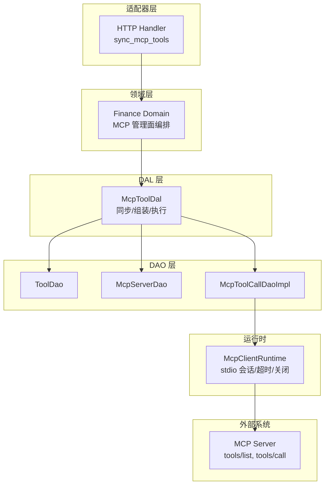
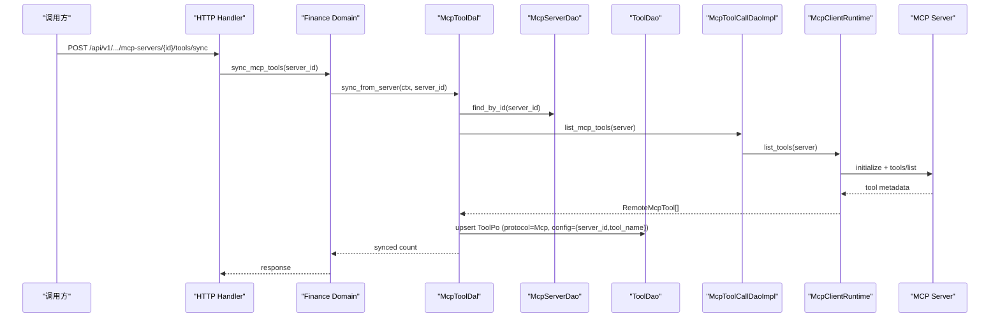
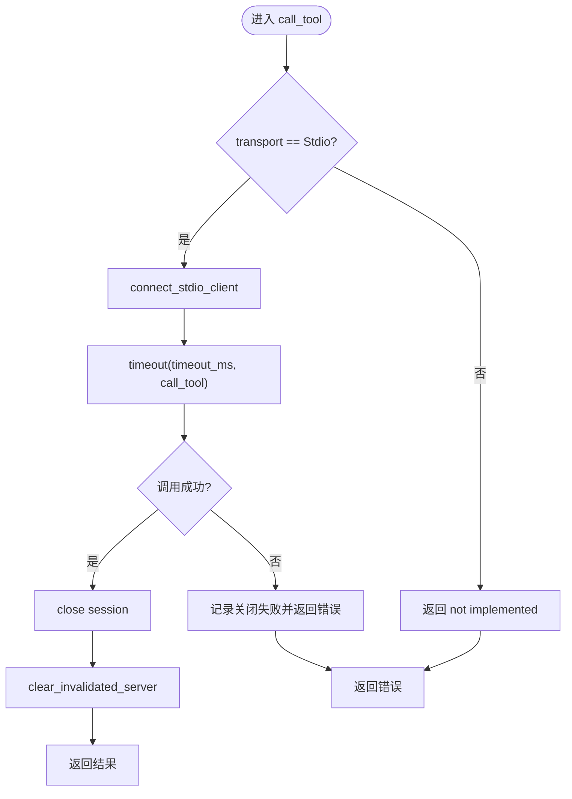
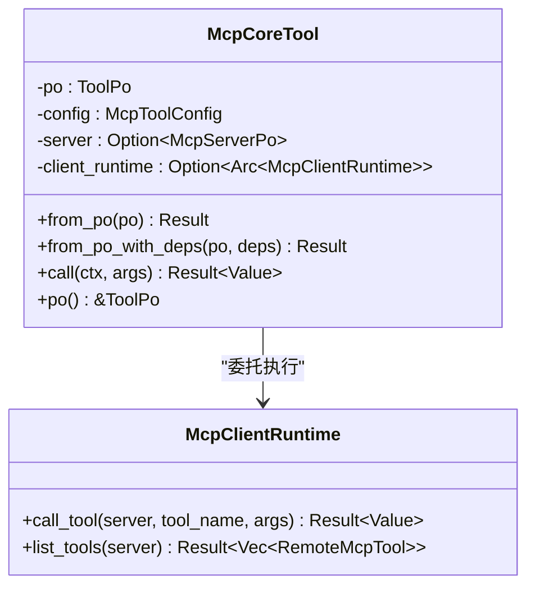
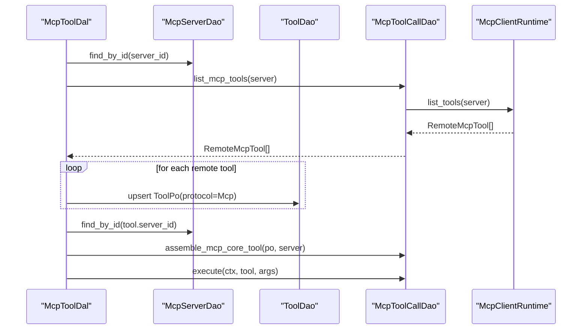
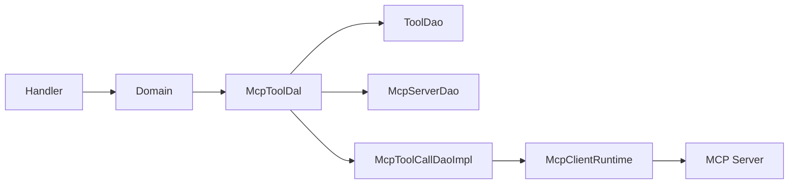

# MCP 工具集成（入门概览层）

<cite>
**本文引用的文件**
- [src/pkg/tool_registry/mcp.rs](src/pkg/tool_registry/mcp.rs)
- [src/models/mcp_server.rs](src/models/mcp_server.rs)
- [common/src/api/mcp_server.rs](common/src/api/mcp_server.rs)
- [common/src/enums/mcp_server.rs](common/src/enums/mcp_server.rs)
- [src/service/dal/mcp_tool.rs](src/service/dal/mcp_tool.rs)
- [src/handlers/finance/mcp_tool/sync_mcp_tools.rs](src/handlers/finance/mcp_tool/sync_mcp_tools.rs)
- [docs/mcp_tool_design.md](docs/mcp_tool_design.md)
</cite>

## 目录
1. [简介](#简介)
2. [项目结构](#项目结构)
3. [核心组件](#核心组件)
4. [架构总览](#架构总览)
5. [详细组件分析](#详细组件分析)
6. [依赖关系分析](#依赖关系分析)
7. [性能与超时控制](#性能与超时控制)
8. [调试与故障排除](#调试与故障排除)
9. [结论](#结论)
10. [附录：开发指南与协议规范](#附录：协议规范与开发指南)

## 简介
本文件面向需要在系统中集成 Model Context Protocol（MCP）工具的开发者，系统性说明 MCP 服务器的配置、连接管理、工具发现与同步、工具执行封装、错误处理、超时控制、多服务器管理与生命周期管理，并提供 MCP 工具开发指南、调试技巧、性能监控与故障排除方法。

本项目采用严格四层单向调用：Adapter（HTTP Handler / AOP Producer）→ Domain → DAL → DAO；通用基础设施工具放在 src/pkg/；PO 仅存在于 DAO/DAL 内部；Domain 输入输出为业务实体与事件；service 层公共方法首参统一为 RequestContext。

> 📌 视角说明（AGENTS §2.1.3 Level 3 互补视角平行卡）：
> 本长文是「MCP 工具集成」主题的 **入门概览层** 视角。同主题还有以下平行视角卡，请按需交叉阅读：
> - [MCP 工具集成（代码落地层）](docs/wiki/zh/content/核心模块/工具注册表/MCP 工具集成.md)

## 项目结构
围绕 MCP 的核心代码分布在以下位置：
- 工具注册与运行时：src/pkg/tool_registry/mcp.rs
- 数据模型与配置：src/models/mcp_server.rs、common/src/api/mcp_server.rs、common/src/enums/mcp_server.rs
- DAL 编排与同步：src/service/dal/mcp_tool.rs
- HTTP 入口（示例）：src/handlers/finance/mcp_tool/sync_mcp_tools.rs
- 设计文档与约定：docs/mcp_tool_design.md

图表来源
- [src/handlers/finance/mcp_tool/sync_mcp_tools.rs:1-27](src/handlers/finance/mcp_tool/sync_mcp_tools.rs#L1-L27)
- [src/service/dal/mcp_tool.rs:108-167](src/service/dal/mcp_tool.rs#L108-L167)
- [src/pkg/tool_registry/mcp.rs:90-140](src/pkg/tool_registry/mcp.rs#L90-L140)

章节来源
- [docs/mcp_tool_design.md:120-195](docs/mcp_tool_design.md#L120-L195)
- [src/service/dal/mcp_tool.rs:1-85](src/service/dal/mcp_tool.rs#L1-L85)

## 核心组件
- McpClientRuntime：最小化 MCP 客户端运行时，负责 stdio 子进程启动、会话初始化、工具列表获取、工具调用、超时控制、会话关闭与失效缓存。
- McpCoreTool：实现 CoreTool 的可执行工具对象，封装 ToolPo、McpToolConfig、McpServerPo 与 McpClientRuntime 引用，在 call 中委托 runtime 执行。
- McpToolDal：MCP 专属 DAL，负责从数据库读取 ToolPo 与 McpServerPo，组装可执行工具，同步远程工具元数据，按 server 查询与管理，以及执行 MCP 工具。
- McpServer/McpServerConfig：持久化的 MCP 服务器连接配置与状态，支持 stdio 与 streamable_http 两种传输，提供脱敏能力。
- API DTOs：common/src/api/mcp_server.rs 定义前后端共享的 MCP Server 请求/响应 DTO。

章节来源
- [src/pkg/tool_registry/mcp.rs:28-48](src/pkg/tool_registry/mcp.rs#L28-L48)
- [src/pkg/tool_registry/mcp.rs:50-198](src/pkg/tool_registry/mcp.rs#L50-L198)
- [src/models/mcp_server.rs:17-123](src/models/mcp_server.rs#L17-L123)
- [common/src/api/mcp_server.rs:10-179](common/src/api/mcp_server.rs#L10-L179)

## 架构总览
MCP 工具集成分为两条主线：
- 管理面：创建/更新/删除 MCP Server，同步远端工具到本地 Tool 表，按 server 列出已同步工具。
- 运行面：根据 ToolId 或 Tool 实体执行 MCP 工具，底层通过 McpClientRuntime 与 MCP Server 交互。

图表来源
- [src/handlers/finance/mcp_tool/sync_mcp_tools.rs:1-27](src/handlers/finance/mcp_tool/sync_mcp_tools.rs#L1-L27)
- [src/service/dal/mcp_tool.rs:108-167](src/service/dal/mcp_tool.rs#L108-L167)
- [src/pkg/tool_registry/mcp.rs:90-140](src/pkg/tool_registry/mcp.rs#L90-L140)

章节来源
- [docs/mcp_tool_design.md:196-321](docs/mcp_tool_design.md#L196-L321)

## 详细组件分析

### McpClientRuntime：连接、工具发现与调用
- 职责
  - 维护失效服务器集合，用于配置变更后刷新会话。
  - 基于 McpTransport::Stdio 启动子进程并建立 rmcp 会话。
  - 调用 tools/list 获取远端工具元数据。
  - 调用 tools/call 执行具体工具。
  - 对 list 与 call 设置超时，并在完成后关闭会话。
  - 成功时清除失效标记，失败时保留以便后续刷新。
- 关键流程
  - 工具列表：connect_stdio_client → timeout(list_all_tools) → close → map to RemoteMcpTool。
  - 工具调用：connect_stdio_client → timeout(call_tool) → close → serialize result。
  - 命令解析：resolve_command_path 支持绝对路径或 PATH 查找。
- 错误与超时
  - 连接超时：connect_timeout_ms。
  - 调用超时：timeout_ms。
  - 会话关闭失败：返回明确错误信息。
  - 参数校验：args 必须为 JSON object。

图表来源
- [src/pkg/tool_registry/mcp.rs:72-192](src/pkg/tool_registry/mcp.rs#L72-L192)
- [src/pkg/tool_registry/mcp.rs:200-268](src/pkg/tool_registry/mcp.rs#L200-L268)

章节来源
- [src/pkg/tool_registry/mcp.rs:50-198](src/pkg/tool_registry/mcp.rs#L50-L198)
- [src/pkg/tool_registry/mcp.rs:200-268](src/pkg/tool_registry/mcp.rs#L200-L268)

### McpCoreTool：工具调用封装与错误处理
- 构造方式
  - from_po：仅解析并校验 ToolPo.config，不注入 server/runtime。
  - from_po_with_deps：由 DAL 注入 server 与 client_runtime，确保 server_id 一致。
- 执行逻辑
  - call 检查 server 与 client_runtime 是否可用，否则返回 ToolExecutionFailed。
  - 委托 McpClientRuntime.call_tool 执行，并将错误映射为 ToolExecutionFailed。
- 安全边界
  - 不在工具对象内直接访问 DAO，避免泄露敏感配置。
  - 错误消息不包含 command/env/url/headers。

图表来源
- [src/pkg/tool_registry/mcp.rs:270-355](src/pkg/tool_registry/mcp.rs#L270-L355)

章节来源
- [src/pkg/tool_registry/mcp.rs:270-355](src/pkg/tool_registry/mcp.rs#L270-L355)

### McpToolDal：同步、组装与执行
- 同步远端工具
  - 读取 McpServerPo，调用 McpToolCallDao.list_mcp_tools 获取 RemoteMcpTool。
  - 将远端元数据映射为 ToolPo（protocol=Mcp，control_mode=Manual，config={server_id,tool_name}）。
  - upsert 到 ToolDao，并对已存在但不再出现在远端的启用工具标记为 Stale。
- 组装可执行工具
  - 校验 ToolPo.protocol 与 status。
  - 解析 McpToolConfig，读取对应 McpServerPo 并校验其 status。
  - 通过 McpToolCallDao.assemble_mcp_core_tool 生成可执行工具。
- 执行工具
  - call_tool_by_id：先 get_by_id 再 call_tool。
  - call_tool：直接委托 McpToolCallDao.execute，复用 tracing。
- 失效管理
  - invalidate_server：通知底层 runtime 失效指定 server 的会话缓存。

图表来源
- [src/service/dal/mcp_tool.rs:108-167](src/service/dal/mcp_tool.rs#L108-L167)
- [src/service/dal/mcp_tool.rs:219-254](src/service/dal/mcp_tool.rs#L219-L254)
- [src/pkg/tool_registry/mcp.rs:90-140](src/pkg/tool_registry/mcp.rs#L90-L140)

章节来源
- [src/service/dal/mcp_tool.rs:1-385](src/service/dal/mcp_tool.rs#L1-L385)

### MCP Server 配置与状态
- 传输类型
  - Stdio：command + args + env，默认不继承系统环境。
  - StreamableHttp：url + headers（当前未实现，显式 not implemented）。
- 配置项
  - timeout_ms、connect_timeout_ms、response_max_bytes。
- 状态
  - Deleted、Enabled、Disabled。
- 脱敏
  - redacted_for_management 对 env、headers、url 进行脱敏，便于管理面展示。

章节来源
- [src/models/mcp_server.rs:17-123](src/models/mcp_server.rs#L17-L123)
- [common/src/enums/mcp_server.rs:7-49](common/src/enums/mcp_server.rs#L7-L49)
- [common/src/api/mcp_server.rs:10-179](common/src/api/mcp_server.rs#L10-L179)

## 依赖关系分析
- 模块耦合
  - McpToolDal 组合 ToolDao、McpServerDao、McpToolCallDao，职责清晰且单向依赖。
  - McpClientRuntime 依赖 rmcp 与 tokio 进程管理，对外暴露简洁接口。
  - McpCoreTool 仅持有必要依赖，避免在工具对象中直接访问 DAO。
- 外部依赖
  - rmcp：MCP 协议客户端。
  - tokio：异步运行时与子进程管理。
- 潜在循环
  - 无循环依赖；DAL 之间不互调，Domain 层做协议路由。

图表来源
- [src/service/dal/mcp_tool.rs:22-46](src/service/dal/mcp_tool.rs#L22-L46)
- [src/pkg/tool_registry/mcp.rs:270-355](src/pkg/tool_registry/mcp.rs#L270-L355)

章节来源
- [docs/mcp_tool_design.md:152-195](docs/mcp_tool_design.md#L152-L195)

## 性能与超时控制
- 超时策略
  - connect_timeout_ms：MCP stdio 会话初始化超时。
  - timeout_ms：工具列表与工具调用超时。
  - response_max_bytes：最大响应体大小（配置项）。
- 资源释放
  - 每次 list 与 call 后均尝试关闭会话，关闭失败会返回错误以提示上层关注。
- 失效与缓存
  - McpClientRuntime 维护 invalidated_servers，配置变更后自动刷新会话。
- 建议
  - 合理设置超时，避免长耗时阻塞。
  - 对高频调用场景考虑后续引入会话复用与连接池（需评估安全性与 SSRF 防护）。
  - 使用 tracing/stats 观测工具调用耗时与失败率。

章节来源
- [src/pkg/tool_registry/mcp.rs:107-192](src/pkg/tool_registry/mcp.rs#L107-L192)
- [src/models/mcp_server.rs:117-123](src/models/mcp_server.rs#L117-L123)

## 调试与故障排除
- 常见问题
  - 命令不可用：resolve_command_path 找不到命令，建议使用绝对路径并确保 PATH 正确。
  - 会话初始化超时：检查 connect_timeout_ms 与 MCP Server 启动时间。
  - 调用超时：检查 timeout_ms 与远端工具耗时。
  - 会话关闭失败：关注 close 返回值，必要时重启服务或强制刷新。
  - 非 object 参数：MCP 工具参数必须为 JSON object。
- 定位步骤
  - 确认 McpServerPo.status 为 Enabled。
  - 确认 ToolPo.protocol 为 Mcp 且 status 为 Enabled。
  - 查看 McpToolDal 的错误信息，避免包含敏感配置。
  - 使用 tracing/stats 收集调用链路与耗时。
- 安全注意
  - 管理面展示与日志需脱敏 env、headers、url。
  - 错误消息不应泄露 command/env/url/credential。

章节来源
- [src/pkg/tool_registry/mcp.rs:200-268](src/pkg/tool_registry/mcp.rs#L200-L268)
- [src/models/mcp_server.rs:152-167](src/models/mcp_server.rs#L152-L167)
- [src/service/dal/mcp_tool.rs:325-384](src/service/dal/mcp_tool.rs#L325-L384)

## 结论
本项目实现了 MCP 工具的最小闭环：管理面可配置 MCP Server 并同步远端工具到标准 Tool 表；运行面可通过 ToolId 或 Tool 实体执行 MCP 工具，底层通过 McpClientRuntime 与 MCP Server 交互。整体遵循分层架构与单向依赖，具备超时控制、错误处理与脱敏能力。后续可扩展 streamable_http 传输与安全策略，并优化会话复用与性能监控。

## 附录：协议规范与开发指南
- 协议与消息
  - 使用 rmcp 提供的 RoleClient 与服务端交互，支持 initialize、tools/list、tools/call。
  - 第一版仅支持 stdio transport；streamable_http 在未实现前返回 not implemented。
- 错误码与语义
  - ToolExecutionFailed：工具执行失败（包括超时、参数错误、会话关闭失败等）。
  - ResourceNotFound：MCP Server 或 Tool 不存在。
  - Conflict：同步目标冲突（如 ID 已被非 MCP 工具占用或绑定不一致）。
- 开发要点
  - 新增 MCP Server：创建 McpServerPo，配置 command/args/env 或 url/headers，设置超时。
  - 同步工具：调用 McpToolDal.sync_from_server，确保 ToolPo 的 protocol 与 control_mode 正确。
  - 执行工具：通过 McpToolDal.call_tool_by_id 或 call_tool，传入 JSON object 参数。
  - 失效管理：配置变更后调用 invalidate_server 刷新会话。
- 调试技巧
  - 打印 McpServerConfig 时使用脱敏版本。
  - 使用 tracing/stats 记录工具调用耗时与失败原因。
  - 优先使用绝对路径避免 PATH 解析问题。
- 性能监控
  - 统计超时次数与比例。
  - 监控会话创建与关闭成功率。
  - 观察远端工具元数据变化频率，合理设置同步周期。

章节来源
- [docs/mcp_tool_design.md:323-349](docs/mcp_tool_design.md#L323-L349)
- [src/pkg/tool_registry/mcp.rs:72-192](src/pkg/tool_registry/mcp.rs#L72-L192)
- [src/service/dal/mcp_tool.rs:108-167](src/service/dal/mcp_tool.rs#L108-L167)