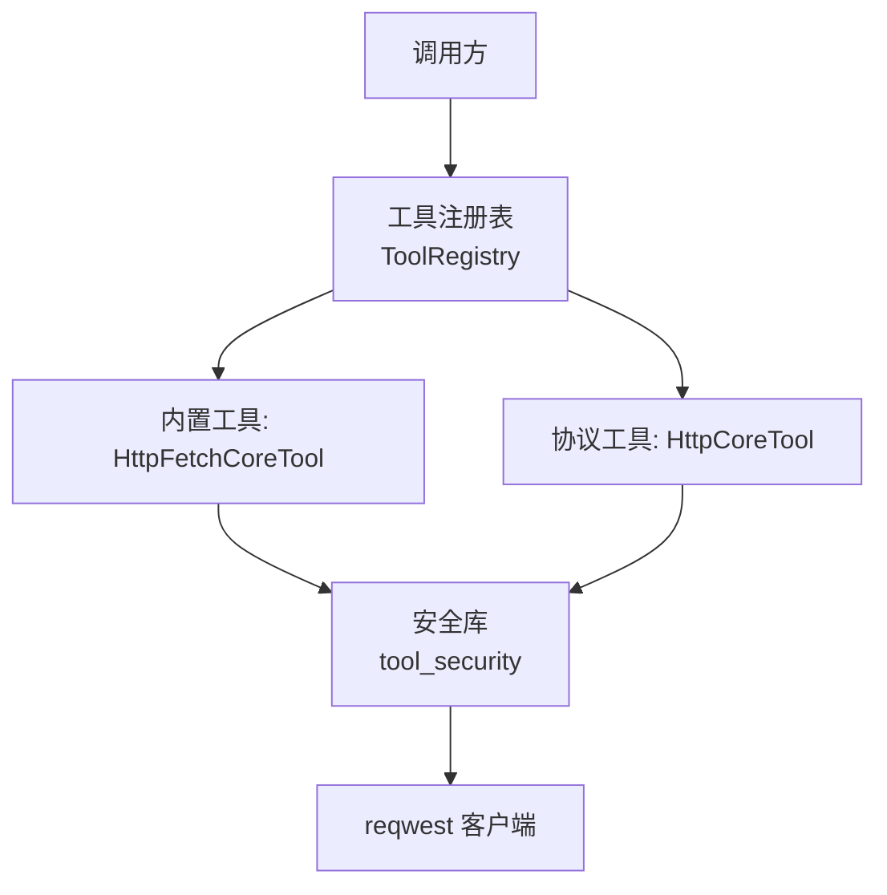
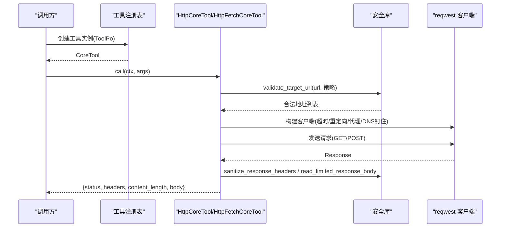
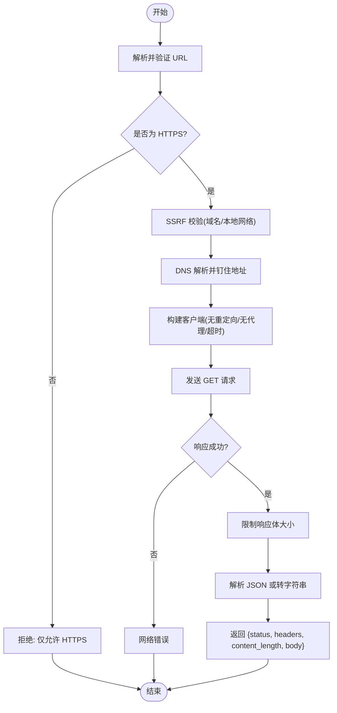
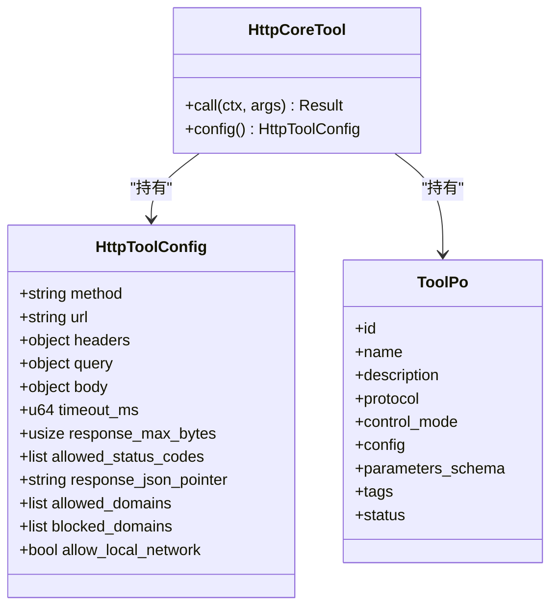
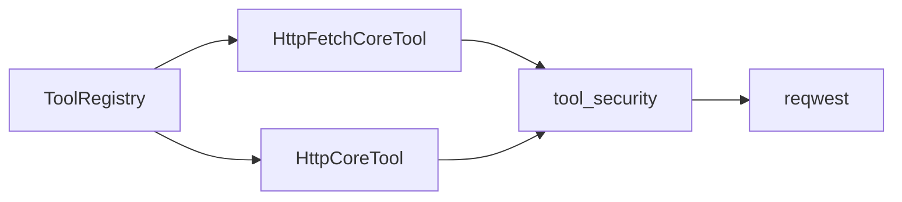

# HTTP 请求工具 (http_fetch)

<cite>
**本文引用的文件**
- [src/pkg/tool_registry/http_fetch.rs](src/pkg/tool_registry/http_fetch.rs)
- [src/pkg/tool_registry/http.rs](src/pkg/tool_registry/http.rs)
- [src/pkg/tool_registry/mod.rs](src/pkg/tool_registry/mod.rs)
- [src/pkg/tool_registry/tool_security.rs](src/pkg/tool_registry/tool_security.rs)
- [src/models/tool.rs](src/models/tool.rs)
- [src/pkg/tool_registry/http_tests.rs](src/pkg/tool_registry/http_tests.rs)
</cite>

## 目录
1. [简介](#简介)
2. [项目结构](#项目结构)
3. [核心组件](#核心组件)
4. [架构总览](#架构总览)
5. [详细组件分析](#详细组件分析)
6. [依赖关系分析](#依赖关系分析)
7. [性能与并发](#性能与并发)
8. [安全控制机制](#安全控制机制)
9. [使用示例](#使用示例)
10. [故障排除指南](#故障排除指南)
11. [结论](#结论)

## 简介
本文件为 HTTP 请求工具 http_fetch 的权威技术文档。该工具用于在运行时从受控的 HTTPS URL 获取内容，内置严格的 SSRF 防护、响应大小限制、超时控制与重定向禁用等安全策略。同时，项目还提供可配置的 HTTP 工具（HttpCoreTool），支持 GET/POST、模板化参数、头部与查询参数渲染、JSON 指针提取响应体等能力。

## 项目结构
HTTP 相关能力集中在工具注册中心模块中：
- 内置 HTTP Fetch 工具：固定行为、最小暴露面，默认仅允许 HTTPS 且禁止本地网络访问。
- 协议级 HTTP 工具：通过数据库配置驱动，支持方法、URL 模板、头部、查询、请求体、超时、最大响应字节、状态码白名单、JSON 指针、域名白/黑名单、是否允许本地网络等。
- 共享安全库：提供 SSRF 防护、敏感头脱敏、响应体大小限制、URL 模板校验等通用能力。
- 工具注册表：统一创建并分发不同协议的 ToolPo 到对应执行器。

图表来源
- [src/pkg/tool_registry/mod.rs:29-102](src/pkg/tool_registry/mod.rs#L29-L102)
- [src/pkg/tool_registry/http_fetch.rs:19-143](src/pkg/tool_registry/http_fetch.rs#L19-L143)
- [src/pkg/tool_registry/http.rs:23-114](src/pkg/tool_registry/http.rs#L23-L114)
- [src/pkg/tool_registry/tool_security.rs:92-170](src/pkg/tool_registry/tool_security.rs#L92-L170)

章节来源
- [src/pkg/tool_registry/mod.rs:29-102](src/pkg/tool_registry/mod.rs#L29-L102)
- [src/pkg/tool_registry/http_fetch.rs:19-143](src/pkg/tool_registry/http_fetch.rs#L19-L143)
- [src/pkg/tool_registry/http.rs:23-114](src/pkg/tool_registry/http.rs#L23-L114)
- [src/pkg/tool_registry/tool_security.rs:92-170](src/pkg/tool_registry/tool_security.rs#L92-L170)

## 核心组件
- HttpFetchCoreTool（内置）
  - 固定实现：仅支持 GET，强制 HTTPS，默认拒绝本地网络，禁用重定向，关闭代理，DNS 解析后地址钉住，限制响应体大小，返回结构化结果。
  - 参数：仅 url（字符串）。
  - 返回值：包含 status、headers（敏感头已脱敏）、content_length、body（优先 JSON，否则字符串）。
- HttpCoreTool（协议级）
  - 由数据库中的 ToolPo.config 驱动，支持 GET/POST，支持 URL/Query/Header/Body 模板渲染，支持超时、最大响应字节、允许的状态码、JSON 指针提取、域名白/黑名单、是否允许本地网络等。
  - 参数：由 parameters_schema 约束，模板占位符形式为 {{args.key}}。
  - 返回值：同内置工具，增加可选的 body 经 JSON 指针裁剪后的子集。
- 工具注册表 ToolRegistry
  - 根据 ToolPo.protocol 分派到内置或协议工具工厂，构造可执行 CoreTool。
- 安全库 tool_security
  - 提供常量（默认/硬上限）、SSRF 检查、域名匹配、URL 模板边界校验、响应体读取限制、敏感头脱敏等。

章节来源
- [src/pkg/tool_registry/http_fetch.rs:19-143](src/pkg/tool_registry/http_fetch.rs#L19-L143)
- [src/pkg/tool_registry/http.rs:41-114](src/pkg/tool_registry/http.rs#L41-L114)
- [src/pkg/tool_registry/mod.rs:29-102](src/pkg/tool_registry/mod.rs#L29-L102)
- [src/pkg/tool_registry/tool_security.rs:8-15](src/pkg/tool_registry/tool_security.rs#L8-L15)
- [src/pkg/tool_registry/tool_security.rs:92-170](src/pkg/tool_registry/tool_security.rs#L92-L170)
- [src/pkg/tool_registry/tool_security.rs:172-231](src/pkg/tool_registry/tool_security.rs#L172-L231)

## 架构总览
HTTP 工具的执行链路如下：
- 调用方通过工具注册表获取具体工具实例。
- 内置工具直接执行固定逻辑；协议工具先校验配置与参数，再构建 reqwest 客户端发起请求。
- 所有外部网络访问均经过安全库校验（协议、域名、本地网络、DNS 解析结果）。
- 响应体按配置限制大小，敏感头自动脱敏，最终返回统一的结构化结果。

图表来源
- [src/pkg/tool_registry/mod.rs:81-102](src/pkg/tool_registry/mod.rs#L81-L102)
- [src/pkg/tool_registry/http.rs:126-220](src/pkg/tool_registry/http.rs#L126-L220)
- [src/pkg/tool_registry/http_fetch.rs:60-143](src/pkg/tool_registry/http_fetch.rs#L60-L143)
- [src/pkg/tool_registry/tool_security.rs:92-170](src/pkg/tool_registry/tool_security.rs#L92-L170)
- [src/pkg/tool_registry/tool_security.rs:184-231](src/pkg/tool_registry/tool_security.rs#L184-L231)

## 详细组件分析

### 内置 HTTP Fetch 工具（HttpFetchCoreTool）
- 功能
  - 仅支持 GET 方法。
  - 强制 HTTPS 协议，拒绝 HTTP。
  - 默认拒绝本地网络目标（localhost、私有 IP、回环等），除非显式开启 allow_local_network（但内置工具未暴露此开关，默认严格）。
  - 禁用重定向，关闭代理，DNS 解析后对主机地址进行钉住。
  - 限制响应体大小，默认 1MB，硬上限 10MB。
  - 返回结构化结果：status、headers（敏感头脱敏）、content_length、body（优先 JSON，否则 UTF-8 字符串）。
- 参数
  - url：HTTPS 字符串。
- 返回值
  - JSON 对象，包含 status、headers、content_length、body。
- 错误处理
  - 非法 URL、非 HTTPS、本地网络、网络错误、响应过大等都会返回错误。

图表来源
- [src/pkg/tool_registry/http_fetch.rs:60-143](src/pkg/tool_registry/http_fetch.rs#L60-L143)
- [src/pkg/tool_registry/tool_security.rs:92-170](src/pkg/tool_registry/tool_security.rs#L92-L170)
- [src/pkg/tool_registry/tool_security.rs:184-231](src/pkg/tool_registry/tool_security.rs#L184-L231)

章节来源
- [src/pkg/tool_registry/http_fetch.rs:19-143](src/pkg/tool_registry/http_fetch.rs#L19-L143)

### 协议级 HTTP 工具（HttpCoreTool）
- 功能
  - 方法：GET、POST（其他方法在配置阶段即被拒绝）。
  - URL：固定 scheme 与 authority，路径/查询可通过模板注入。
  - 头部与查询：对象模板，键必须合法，值可为标量或模板。
  - 请求体：仅 POST 支持，值为 JSON 模板。
  - 超时与响应大小：可配置，受默认与硬上限约束。
  - 状态码白名单：默认接受 200/201/202/204，可自定义。
  - JSON 指针：可从响应体中提取子集。
  - 域名白/黑名单与本地网络策略：配置时校验，运行时再次校验 DNS 解析结果。
- 参数
  - 由 parameters_schema 定义，支持 required、type、enum 等校验。
  - 模板占位符：{{args.key}}，仅支持 args 前缀。
- 返回值
  - 与内置工具一致，body 可经 JSON 指针裁剪。
- 错误处理
  - 配置校验失败（方法、URL、头部、查询、状态码、指针、超时、响应大小等）在配置阶段拒绝。
  - 运行时参数校验失败（类型不匹配、未知参数、未解析占位符）立即报错。
  - 网络错误、响应过大、状态码不在白名单等均返回错误。

图表来源
- [src/pkg/tool_registry/http.rs:41-96](src/pkg/tool_registry/http.rs#L41-L96)
- [src/models/tool.rs:57-88](src/models/tool.rs#L57-L88)

章节来源
- [src/pkg/tool_registry/http.rs:41-228](src/pkg/tool_registry/http.rs#L41-L228)
- [src/pkg/tool_registry/http.rs:230-392](src/pkg/tool_registry/http.rs#L230-L392)
- [src/pkg/tool_registry/http.rs:394-594](src/pkg/tool_registry/http.rs#L394-L594)

### 工具注册表（ToolRegistry）
- 职责
  - 维护全局工具注册表，存储各协议工厂。
  - 根据 ToolPo.protocol 分派到内置或协议工具工厂，创建可执行 CoreTool。
  - 支持替换 HTTP 协议工厂以扩展行为。
- 关键点
  - 内置工具通过 BuiltinToolFactory 创建。
  - HTTP 工具通过 HttpToolFactory 创建，默认使用 DefaultHttpToolFactory。

章节来源
- [src/pkg/tool_registry/mod.rs:29-102](src/pkg/tool_registry/mod.rs#L29-L102)

## 依赖关系分析
- 内置工具依赖安全库进行 SSRF 防护、响应体限制与敏感头脱敏。
- 协议工具依赖安全库进行配置校验、URL 模板边界校验、域名匹配与 DNS 解析结果校验。
- 两者都使用 reqwest 发起网络请求，禁用重定向与代理，设置超时，并对主机地址进行 DNS 钉住。
- 工具注册表解耦了工具创建与执行，便于扩展与管理。

图表来源
- [src/pkg/tool_registry/http_fetch.rs:60-143](src/pkg/tool_registry/http_fetch.rs#L60-L143)
- [src/pkg/tool_registry/http.rs:126-220](src/pkg/tool_registry/http.rs#L126-L220)
- [src/pkg/tool_registry/mod.rs:81-102](src/pkg/tool_registry/mod.rs#L81-L102)
- [src/pkg/tool_registry/tool_security.rs:92-170](src/pkg/tool_registry/tool_security.rs#L92-L170)

章节来源
- [src/pkg/tool_registry/http_fetch.rs:60-143](src/pkg/tool_registry/http_fetch.rs#L60-L143)
- [src/pkg/tool_registry/http.rs:126-220](src/pkg/tool_registry/http.rs#L126-L220)
- [src/pkg/tool_registry/mod.rs:81-102](src/pkg/tool_registry/mod.rs#L81-L102)
- [src/pkg/tool_registry/tool_security.rs:92-170](src/pkg/tool_registry/tool_security.rs#L92-L170)

## 性能与并发
- 连接池
  - 当前实现每次请求构建新的 reqwest::Client，未复用连接池。建议在生产环境将客户端提升为单例或进程级共享，以减少握手开销。
- 并发控制
  - 工具执行本身异步，但未内置限流或队列。可在上层编排层引入令牌桶或信号量限制并发度，避免雪崩。
- 缓存策略
  - 未实现响应缓存。对于幂等 GET 请求，可在上游引入基于 URL+Header 的缓存层（如内存/Redis），减少重复网络请求。
- 超时与响应大小
  - 默认超时 30s，硬上限 10min；默认响应体 1MB，硬上限 10MB。可根据业务调整，但需遵守硬上限。
- 重定向与代理
  - 默认禁用重定向与代理，降低不可控跳转风险。如需启用，请在上层封装并加强审计。

[本节为通用指导，不直接分析具体文件]

## 安全控制机制
- URL 白名单与黑名单
  - 支持 allowed_domains 与 blocked_domains，匹配规则支持精确与后缀匹配，域名归一化（小写、去尾点、去除方括号）。
- 本地网络保护
  - 默认拒绝 localhost、私有 IP、回环、链路本地、广播、未指定、共享地址空间、IPv6 过渡地址等。
  - 若需访问本地网络，必须显式设置 allow_local_network=true，并在配置与运行时双重校验。
- 协议限制
  - 仅允许 http/https；内置工具默认仅允许 https。
- 重定向与代理
  - 默认禁用重定向与代理，防止 SSRF 与不可信跳转。
- 请求大小限制
  - 响应体读取限制默认 1MB，硬上限 10MB；超过限制立即中断并报错。
- 敏感信息脱敏
  - 响应头中的 Authorization、Cookie、Set-Cookie、含 api-key/token/secret/password 等字段会被脱敏为 [REDACTED]。
- 模板与参数校验
  - URL 的 scheme 与 authority 必须固定，不允许模板占位符；仅路径/查询可注入。
  - 头部名称必须合法，值必须为标量或模板；Body 仅 POST 支持，键名不允许模板。
  - 参数 schema 校验 required、type、enum，未知属性在 additionalProperties=false 时拒绝。
- 状态码白名单
  - 默认接受 200/201/202/204，可自定义；不在白名单则视为异常。

章节来源
- [src/pkg/tool_registry/tool_security.rs:17-90](src/pkg/tool_registry/tool_security.rs#L17-L90)
- [src/pkg/tool_registry/tool_security.rs:92-170](src/pkg/tool_registry/tool_security.rs#L92-L170)
- [src/pkg/tool_registry/tool_security.rs:172-231](src/pkg/tool_registry/tool_security.rs#L172-L231)
- [src/pkg/tool_registry/http.rs:222-228](src/pkg/tool_registry/http.rs#L222-L228)
- [src/pkg/tool_registry/http.rs:230-392](src/pkg/tool_registry/http.rs#L230-L392)
- [src/pkg/tool_registry/http.rs:394-594](src/pkg/tool_registry/http.rs#L394-L594)

## 使用示例
以下为常见场景的配置与调用思路（以配置与参数为主，不展示代码片段）：

- 调用 RESTful API（GET 查询）
  - 配置：method=GET，url=https://api.example.com/v1/items，query={q:"{{args.q}}", page:"{{args.page}}"}, allowed_domains=["api.example.com"], timeout_ms=5000, response_max_bytes=65536, allowed_status_codes=[200]。
  - 调用：传入 {q:"rust", page:1}。
  - 说明：URL 的 scheme 与 authority 固定，路径/查询通过模板注入；响应体优先 JSON。

- 提交表单（POST 提交）
  - 配置：method=POST，url=https://api.example.com/v1/users，body={username:"{{args.username}}", email:"{{args.email}}"}, allowed_domains=["api.example.com"], timeout_ms=10000, allowed_status_codes=[201,200]。
  - 调用：传入 {username:"alice", email:"alice@example.com"}。
  - 说明：仅 POST 支持 body；状态码白名单包含 201。

- 获取远程数据并裁剪响应
  - 配置：在 response_json_pointer 中指定路径，例如 "/data/items"，以便只返回需要的子集。
  - 说明：当响应较大时，结合 response_max_bytes 限制与 JSON 指针裁剪，可降低内存占用。

- 安全访问受控域名
  - 配置：allowed_domains 限定目标域；blocked_domains 屏蔽恶意域；allow_local_network=false（默认）。
  - 说明：即使域名解析到内网 IP，也会因 SSRF 保护被拒绝，除非显式允许。

- 认证与鉴权
  - 通过 headers 注入认证信息，例如 {"Authorization":"Bearer {{args.token}}"}。
  - 注意：响应头中的敏感字段会被脱敏，便于日志安全。

- 超时与重试
  - 配置 timeout_ms 控制单次请求超时；重试应在上层编排层实现，避免工具内部隐式重试。

章节来源
- [src/pkg/tool_registry/http.rs:41-220](src/pkg/tool_registry/http.rs#L41-L220)
- [src/pkg/tool_registry/http.rs:230-392](src/pkg/tool_registry/http.rs#L230-L392)
- [src/pkg/tool_registry/http.rs:394-594](src/pkg/tool_registry/http.rs#L394-L594)
- [src/pkg/tool_registry/tool_security.rs:172-231](src/pkg/tool_registry/tool_security.rs#L172-L231)

## 故障排除指南
- 网络错误
  - 现象：请求失败，错误信息包含网络错误。
  - 排查：检查域名可达性、DNS 解析、防火墙策略；确认未命中 blocked_domains 或本地网络限制。
- 认证失败
  - 现象：状态码非白名单（如 401/403）。
  - 排查：确认 headers 中认证信息正确；检查服务端鉴权逻辑；必要时调整 allowed_status_codes。
- 超时处理
  - 现象：请求超时。
  - 排查：增大 timeout_ms（不超过硬上限）；检查服务端性能；考虑在上层引入重试与熔断。
- 响应过大
  - 现象：响应体超过限制。
  - 排查：调整 response_max_bytes（不超过硬上限）；在服务端分页或裁剪响应；使用 response_json_pointer 提取必要部分。
- 重定向问题
  - 现象：收到 3xx 状态码。
  - 排查：默认不跟随重定向；如需处理，请在上层捕获并重发；或调整 allowed_status_codes。
- 模板占位符未解析
  - 现象：错误提示未解析或不受支持的模板占位符。
  - 排查：确保占位符形式为 {{args.key}}，且 key 存在于传入参数；检查 URL 的 scheme/authority 是否误用模板。
- 参数类型不匹配
  - 现象：错误提示参数类型无效。
  - 排查：对照 parameters_schema 检查类型（string/integer/number/boolean/object/array/null）；移除未知属性（当 additionalProperties=false）。

章节来源
- [src/pkg/tool_registry/http.rs:126-220](src/pkg/tool_registry/http.rs#L126-L220)
- [src/pkg/tool_registry/http.rs:230-392](src/pkg/tool_registry/http.rs#L230-L392)
- [src/pkg/tool_registry/http.rs:394-594](src/pkg/tool_registry/http.rs#L394-L594)
- [src/pkg/tool_registry/tool_security.rs:92-170](src/pkg/tool_registry/tool_security.rs#L92-L170)
- [src/pkg/tool_registry/tool_security.rs:184-231](src/pkg/tool_registry/tool_security.rs#L184-L231)

## 结论
http_fetch 工具提供了安全、可控的 HTTP 请求能力，内置工具适合快速抓取公开 HTTPS 资源，协议工具适合企业级集成与精细化配置。通过严格的 SSRF 防护、模板校验、响应限制与敏感信息脱敏，能够在保障安全的前提下满足多样化的外部服务调用需求。生产环境中建议结合连接池、并发控制与缓存策略进一步优化性能与稳定性。