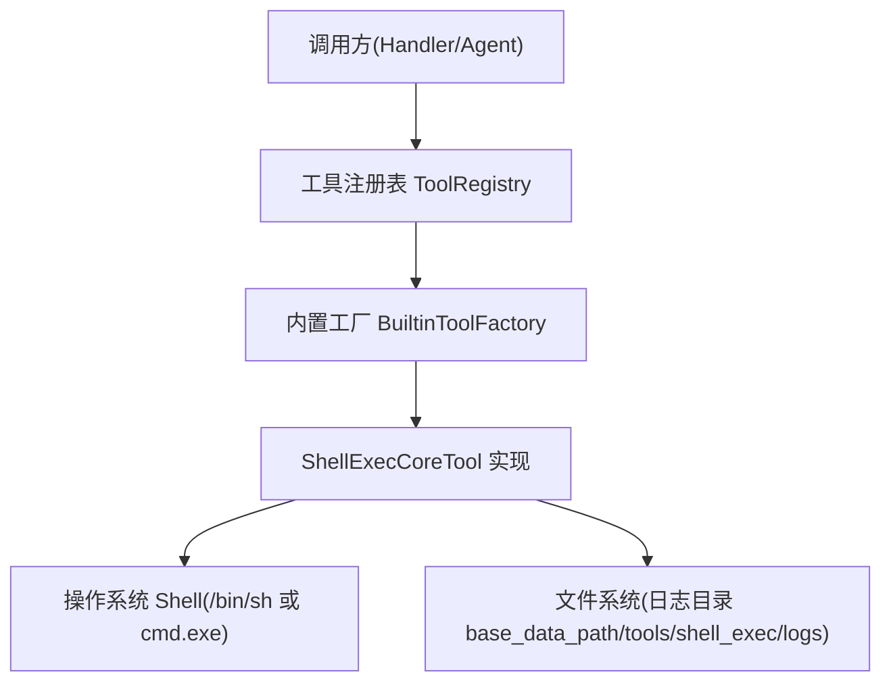
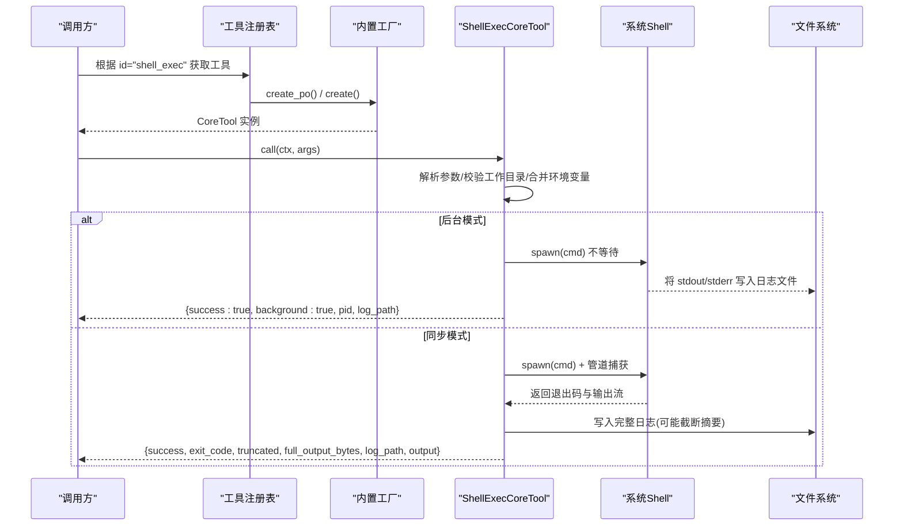
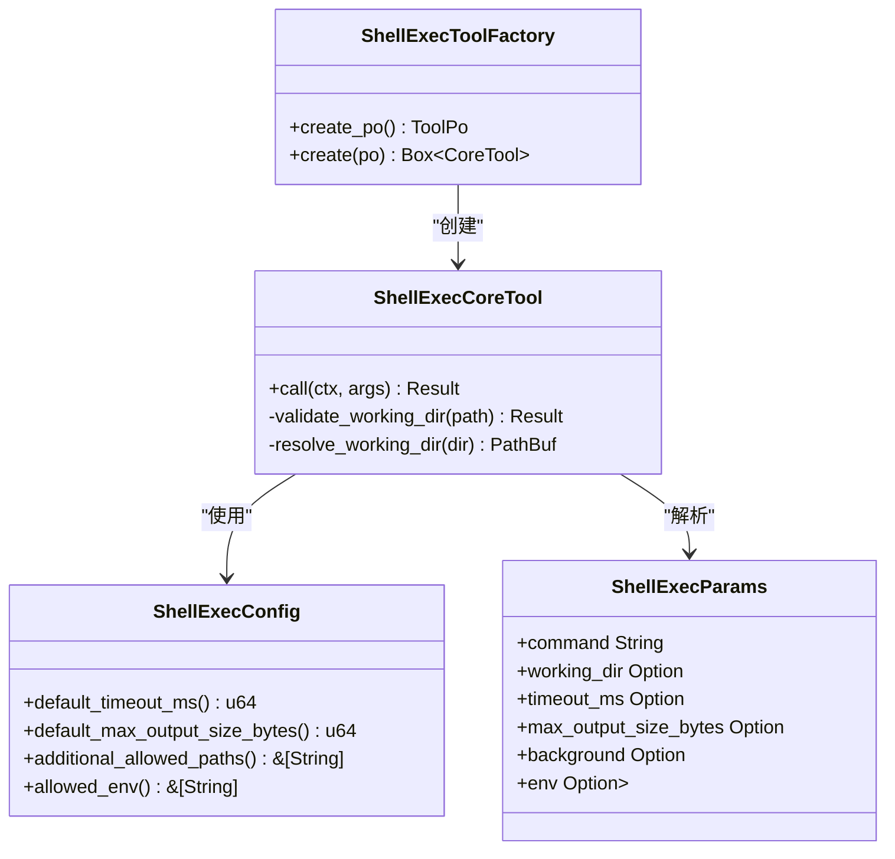
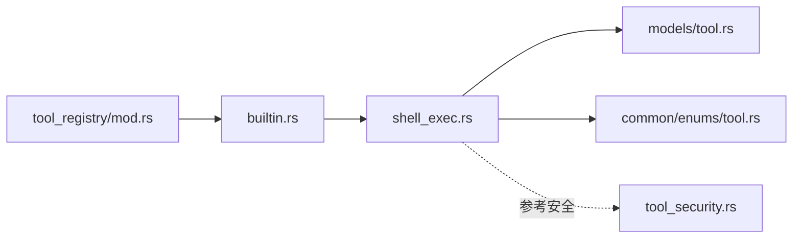

# Shell 执行工具 (shell_exec)

<cite>
**本文引用的文件**
- [src/pkg/tool_registry/shell_exec.rs](src/pkg/tool_registry/shell_exec.rs)
- [src/pkg/tool_registry/mod.rs](src/pkg/tool_registry/mod.rs)
- [src/pkg/tool_registry/builtin.rs](src/pkg/tool_registry/builtin.rs)
- [src/models/tool.rs](src/models/tool.rs)
- [common/src/enums/tool.rs](common/src/enums/tool.rs)
- [src/pkg/tool_registry/tool_security.rs](src/pkg/tool_registry/tool_security.rs)
- [src/pkg/tool_registry/shell_tests.rs](src/pkg/tool_registry/shell_tests.rs)
</cite>

## 目录
1. [简介](#简介)
2. [项目结构](#项目结构)
3. [核心组件](#核心组件)
4. [架构总览](#架构总览)
5. [详细组件分析](#详细组件分析)
6. [依赖关系分析](#依赖关系分析)
7. [性能与资源管理](#性能与资源管理)
8. [故障排除指南](#故障排除指南)
9. [结论](#结论)
10. [附录：参数、返回值与安全配置](#附录参数返回值与安全配置)

## 简介
本章节介绍 shell_exec 内置工具的能力边界与使用场景。该工具用于在沙箱化的环境中执行系统 Shell 命令，支持同步执行与后台运行两种模式；具备工作目录限制、环境变量白名单过滤、输出大小限制与日志落盘等安全与可观测性能力。适用于系统信息查询、文件处理、脚本执行等常见运维与自动化任务。

## 项目结构
shell_exec 作为“内置工具”注册到全局工具注册表，遵循四层单向调用（Adapter → Domain → DAL → DAO）的架构约束。其实现位于 pkg 层，无业务感知，符合通用基础设施工具的定位。

图表来源
- [src/pkg/tool_registry/mod.rs:29-131](src/pkg/tool_registry/mod.rs#L29-L131)
- [src/pkg/tool_registry/builtin.rs:8-33](src/pkg/tool_registry/builtin.rs#L8-L33)
- [src/pkg/tool_registry/shell_exec.rs:89-149](src/pkg/tool_registry/shell_exec.rs#L89-L149)

章节来源
- [src/pkg/tool_registry/mod.rs:29-131](src/pkg/tool_registry/mod.rs#L29-L131)
- [src/pkg/tool_registry/builtin.rs:8-33](src/pkg/tool_registry/builtin.rs#L8-L33)

## 核心组件
- ShellExecConfig：工具配置，包含默认超时、最大输出字节数、额外允许路径与环境变量白名单。
- ShellExecParams：调用参数，包含命令、工作目录、超时、输出上限、后台模式、附加环境变量。
- ShellExecCoreTool：核心执行逻辑，负责参数校验、环境隔离、进程创建、输出捕获、日志落盘与结果组装。
- ShellExecToolFactory：声明工具的元数据（id、名称、描述、参数 Schema、默认配置），并创建 CoreTool 实例。

章节来源
- [src/pkg/tool_registry/shell_exec.rs:20-87](src/pkg/tool_registry/shell_exec.rs#L20-L87)
- [src/pkg/tool_registry/shell_exec.rs:89-149](src/pkg/tool_registry/shell_exec.rs#L89-L149)
- [src/pkg/tool_registry/shell_exec.rs:151-471](src/pkg/tool_registry/shell_exec.rs#L151-L471)

## 架构总览
shell_exec 通过工具注册表以“内置工具”方式提供能力。调用流程如下：

图表来源
- [src/pkg/tool_registry/mod.rs:81-101](src/pkg/tool_registry/mod.rs#L81-L101)
- [src/pkg/tool_registry/shell_exec.rs:256-466](src/pkg/tool_registry/shell_exec.rs#L256-L466)

## 详细组件分析

### 参数定义与行为
- command（必填）：要执行的 Shell 命令字符串。底层会根据平台选择 /bin/sh -c 或 cmd.exe /C。
- working_dir（可选）：执行工作目录。若为相对路径则基于 base_data_path 拼接；若为绝对路径需满足“额外允许路径”或“base_data_path”前缀校验。
- timeout_ms（可选）：同步模式下的超时时间（毫秒）。未设置时使用配置的默认值。
- max_output_size_bytes（可选）：输出截断阈值（字节）。超过阈值时仅返回摘要，完整输出写入日志文件。
- background（可选）：是否后台运行。后台模式下不等待进程结束，直接返回 PID 与日志路径。
- env（可选）：附加的环境变量键值对，会与继承的环境变量合并后注入子进程。

章节来源
- [src/pkg/tool_registry/shell_exec.rs:70-87](src/pkg/tool_registry/shell_exec.rs#L70-L87)
- [src/pkg/tool_registry/shell_exec.rs:256-293](src/pkg/tool_registry/shell_exec.rs#L256-L293)

### 工作目录与路径安全
- 相对路径：始终视为在 base_data_path 下，安全。
- 绝对路径：必须属于 additional_allowed_paths 列表中的某一项，或以 base_data_path 为前缀，否则拒绝执行并提示需要确认。
- 不存在的工作目录：自动创建。

章节来源
- [src/pkg/tool_registry/shell_exec.rs:168-207](src/pkg/tool_registry/shell_exec.rs#L168-L207)
- [src/pkg/tool_registry/shell_exec.rs:264-279](src/pkg/tool_registry/shell_exec.rs#L264-L279)

### 环境变量传递与过滤
- 继承自父进程的环境变量会经过白名单过滤，仅保留 allowed_env 中列出的键。
- 即使键在白名单中，也会进一步过滤敏感关键字（如 home、user、password、token、secret、api_key、aws_*、google_application_credentials、ssh_auth_sock、git_config、git_ssh 等）。
- 可通过 env 参数追加额外的环境变量，最终合并为子进程的环境。

章节来源
- [src/pkg/tool_registry/shell_exec.rs:210-254](src/pkg/tool_registry/shell_exec.rs#L210-L254)
- [src/pkg/tool_registry/shell_exec.rs:289-293](src/pkg/tool_registry/shell_exec.rs#L289-L293)

### 进程执行与输出捕获
- 平台适配：Windows 使用 cmd.exe /C，其他平台使用 /bin/sh -c。
- 同步模式：
  - 通过管道捕获 stdout 与 stderr，合并写入日志文件。
  - 支持超时控制，超时会终止子进程并返回超时信息。
  - 输出超过阈值时进行截断，响应中包含 truncated 标志与完整输出字节数。
- 后台模式：
  - 将 stdout/stderr 重定向到日志文件，立即返回 PID 与日志路径，不阻塞。

章节来源
- [src/pkg/tool_registry/shell_exec.rs:307-466](src/pkg/tool_registry/shell_exec.rs#L307-L466)
- [src/pkg/tool_registry/shell_exec.rs:473-484](src/pkg/tool_registry/shell_exec.rs#L473-L484)

### 返回值格式
- 成功（同步）：
  - success: true/false（取决于子进程退出码）
  - exit_code: 子进程退出码
  - truncated: 是否被截断
  - full_output_bytes: 完整输出字节数
  - log_path: 日志文件路径
  - output: 摘要输出（可能被截断）
- 失败（同步）：
  - success: false
  - error: 错误信息
  - pid: 子进程 ID（如可获取）
  - log_path: 日志文件路径
- 超时：
  - success: false
  - timeout: true
  - timeout_ms: 超时阈值
  - pid: 子进程 ID
  - log_path: 日志文件路径
  - error: 超时消息
- 后台启动：
  - success: true
  - background: true
  - pid: 子进程 ID
  - log_path: 日志文件路径
  - message: 提示信息

章节来源
- [src/pkg/tool_registry/shell_exec.rs:350-356](src/pkg/tool_registry/shell_exec.rs#L350-L356)
- [src/pkg/tool_registry/shell_exec.rs:433-463](src/pkg/tool_registry/shell_exec.rs#L433-L463)

### 错误处理机制
- 参数解析失败：返回无效参数错误。
- 工作目录不在允许范围：返回需要确认的错误，阻止执行。
- 子进程创建失败：返回 spawn 错误信息。
- 等待失败：尝试终止子进程并返回错误。
- 超时：终止子进程并返回超时信息。
- 日志写入失败：返回 IO 错误。

章节来源
- [src/pkg/tool_registry/shell_exec.rs:258-273](src/pkg/tool_registry/shell_exec.rs#L258-L273)
- [src/pkg/tool_registry/shell_exec.rs:373-382](src/pkg/tool_registry/shell_exec.rs#L373-L382)
- [src/pkg/tool_registry/shell_exec.rs:442-463](src/pkg/tool_registry/shell_exec.rs#L442-L463)

### 类图（代码级）

图表来源
- [src/pkg/tool_registry/shell_exec.rs:20-87](src/pkg/tool_registry/shell_exec.rs#L20-L87)
- [src/pkg/tool_registry/shell_exec.rs:89-149](src/pkg/tool_registry/shell_exec.rs#L89-L149)
- [src/pkg/tool_registry/shell_exec.rs:151-207](src/pkg/tool_registry/shell_exec.rs#L151-L207)

## 依赖关系分析
- 工具注册表：集中管理内置工具工厂，按协议类型分发创建。
- 模型与枚举：ToolPo、ToolProtocol、ControlMode 等由 models 与 common 模块提供。
- 安全工具：tool_security 提供通用的安全能力（如 SSRF、URL 模板校验、敏感头过滤、文件路径校验等），虽非 shell_exec 直接依赖，但可作为同类工具的安全参考。

图表来源
- [src/pkg/tool_registry/mod.rs:29-131](src/pkg/tool_registry/mod.rs#L29-L131)
- [src/pkg/tool_registry/builtin.rs:8-33](src/pkg/tool_registry/builtin.rs#L8-L33)
- [src/pkg/tool_registry/shell_exec.rs:89-149](src/pkg/tool_registry/shell_exec.rs#L89-L149)
- [src/models/tool.rs:57-88](src/models/tool.rs#L57-L88)
- [common/src/enums/tool.rs:9-22](common/src/enums/tool.rs#L9-L22)
- [src/pkg/tool_registry/tool_security.rs:1-199](src/pkg/tool_registry/tool_security.rs#L1-L199)

章节来源
- [src/pkg/tool_registry/mod.rs:29-131](src/pkg/tool_registry/mod.rs#L29-L131)
- [src/pkg/tool_registry/builtin.rs:8-33](src/pkg/tool_registry/builtin.rs#L8-L33)
- [src/models/tool.rs:57-88](src/models/tool.rs#L57-L88)
- [common/src/enums/tool.rs:9-22](common/src/enums/tool.rs#L9-L22)
- [src/pkg/tool_registry/tool_security.rs:1-199](src/pkg/tool_registry/tool_security.rs#L1-L199)

## 性能与资源管理
- 进程生命周期：
  - 同步模式：使用超时控制避免僵尸进程；失败或超时时主动 kill。
  - 后台模式：不持有进程句柄，避免资源泄漏；通过日志文件追踪输出。
- I/O 与内存：
  - 输出流读取使用异步复制，避免阻塞；超大输出通过阈值截断减少内存占用。
  - 日志文件统一落盘至 base_data_path/tools/shell_exec/logs/{trace_id}.log，便于审计与排查。
- 并发控制：
  - 每个调用独立进程，天然隔离；建议在上层对高频调用做限流与队列化，避免系统负载过高。
- 资源清理：
  - 确保日志目录存在；必要时定期清理过期日志文件。
  - 后台进程无法由工具直接回收，建议在外部监控或任务调度中管理。

章节来源
- [src/pkg/tool_registry/shell_exec.rs:295-303](src/pkg/tool_registry/shell_exec.rs#L295-L303)
- [src/pkg/tool_registry/shell_exec.rs:385-463](src/pkg/tool_registry/shell_exec.rs#L385-L463)

## 故障排除指南
- 权限错误：
  - 现象：spawn 失败或无法写入日志。
  - 排查：检查运行用户权限、目标目录是否存在且可写、日志目录是否已创建。
- 命令不存在：
  - 现象：子进程立即退出，exit_code 非零。
  - 排查：确认 PATH 环境变量是否包含命令所在目录；检查命令是否在容器或受限环境中可用。
- 超时处理：
  - 现象：返回 timeout=true 且包含 timeout_ms。
  - 排查：适当增大 timeout_ms；检查命令是否卡死或依赖网络；后台模式需自行监控进程。
- 信号处理：
  - 现象：进程被异常终止。
  - 排查：检查是否有外部信号（如 kill）；后台进程建议使用进程管理器或 cron 监控。
- 工作目录拒绝：
  - 现象：返回 require_confirmation 且提示不在允许路径。
  - 排查：调整 working_dir 为相对路径或将其加入 additional_allowed_paths。
- 环境变量缺失：
  - 现象：命令依赖的环境变量未生效。
  - 排查：确认变量名在 allowed_env 白名单内；通过 env 参数显式传入。

章节来源
- [src/pkg/tool_registry/shell_exec.rs:264-273](src/pkg/tool_registry/shell_exec.rs#L264-L273)
- [src/pkg/tool_registry/shell_exec.rs:373-382](src/pkg/tool_registry/shell_exec.rs#L373-L382)
- [src/pkg/tool_registry/shell_exec.rs:452-463](src/pkg/tool_registry/shell_exec.rs#L452-L463)

## 结论
shell_exec 提供了安全可控的 Shell 执行能力，适合在 Agent 或自动化场景中执行系统命令。通过工作目录限制、环境变量白名单、输出截断与日志落盘，兼顾了安全性与可观测性。建议在生产环境中结合上层限流、监控与日志清理策略，确保稳定与高效。

## 附录：参数、返回值与安全配置

### 参数定义（JSON Schema 摘要）
- command：字符串，必填
- working_dir：字符串，可选
- timeout_ms：整数，可选
- max_output_size_bytes：整数，可选
- background：布尔，可选
- env：对象（键值均为字符串），可选

章节来源
- [src/pkg/tool_registry/shell_exec.rs:107-138](src/pkg/tool_registry/shell_exec.rs#L107-L138)

### 返回值字段说明
- success：布尔，表示执行是否成功
- exit_code：整数，子进程退出码（同步模式）
- truncated：布尔，输出是否被截断（同步模式）
- full_output_bytes：整数，完整输出字节数（同步模式）
- log_path：字符串，日志文件路径
- output：字符串，摘要输出（可能被截断）
- background：布尔，后台模式标识
- pid：整数，子进程 ID
- timeout：布尔，是否超时
- timeout_ms：整数，超时阈值
- error：字符串，错误信息
- message：字符串，提示信息

章节来源
- [src/pkg/tool_registry/shell_exec.rs:350-356](src/pkg/tool_registry/shell_exec.rs#L350-L356)
- [src/pkg/tool_registry/shell_exec.rs:433-463](src/pkg/tool_registry/shell_exec.rs#L433-L463)

### 安全控制机制
- 工作目录沙箱：限制在 base_data_path 或 additional_allowed_paths 范围内。
- 环境变量白名单：仅允许指定键从父进程继承，并过滤敏感关键字。
- 输出大小限制：防止大输出导致内存压力，超出阈值时截断并记录日志。
- 日志落盘：所有输出统一写入 base_data_path/tools/shell_exec/logs/{trace_id}.log，便于审计。
- 平台适配：根据平台选择合适 Shell，避免直接执行不可信命令。

章节来源
- [src/pkg/tool_registry/shell_exec.rs:168-207](src/pkg/tool_registry/shell_exec.rs#L168-L207)
- [src/pkg/tool_registry/shell_exec.rs:210-254](src/pkg/tool_registry/shell_exec.rs#L210-L254)
- [src/pkg/tool_registry/shell_exec.rs:295-303](src/pkg/tool_registry/shell_exec.rs#L295-L303)
- [src/pkg/tool_registry/shell_exec.rs:473-484](src/pkg/tool_registry/shell_exec.rs#L473-L484)

### 使用示例（场景指引）
- 系统信息查询：查询系统版本、磁盘空间、网络接口等。
- 文件处理：批量重命名、压缩解压、文本转换等。
- 脚本执行：运行本地脚本或 CI 流水线片段。
- 后台任务：启动长时间运行的服务或批处理任务，通过日志文件跟踪进度。

注意：示例仅为场景说明，实际调用请参考参数与返回值字段。

章节来源
- [src/pkg/tool_registry/shell_exec.rs:70-87](src/pkg/tool_registry/shell_exec.rs#L70-L87)
- [src/pkg/tool_registry/shell_exec.rs:256-466](src/pkg/tool_registry/shell_exec.rs#L256-L466)

### 测试覆盖要点
- 配置解析：默认值与自定义值均能正确解析。
- 环境变量过滤：仅允许白名单内的变量，并过滤敏感键。
- 参数解析：基本与完整参数均可正确解析。

章节来源
- [src/pkg/tool_registry/shell_tests.rs:4-41](src/pkg/tool_registry/shell_tests.rs#L4-L41)
- [src/pkg/tool_registry/shell_tests.rs:43-102](src/pkg/tool_registry/shell_tests.rs#L43-L102)
- [src/pkg/tool_registry/shell_tests.rs:104-145](src/pkg/tool_registry/shell_tests.rs#L104-L145)