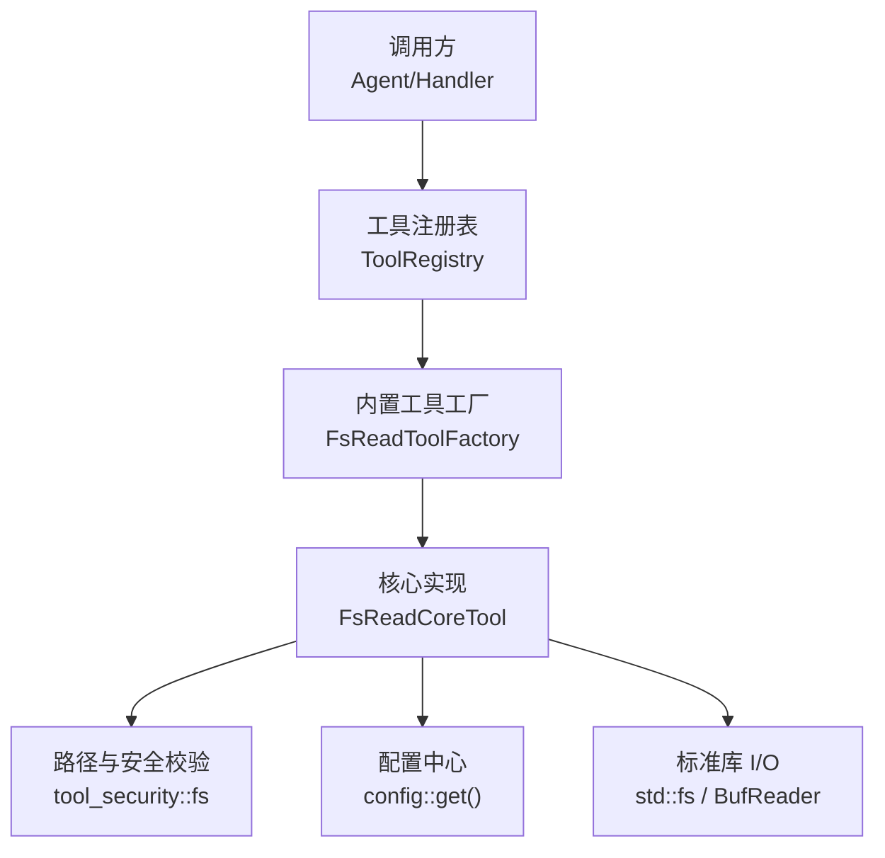
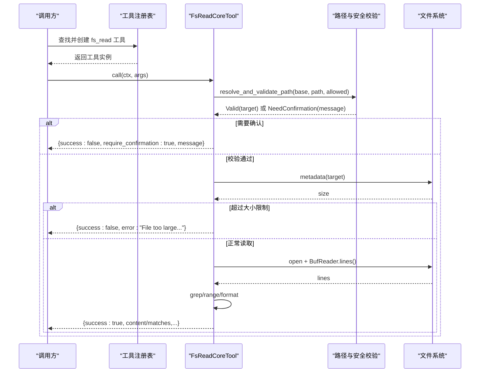
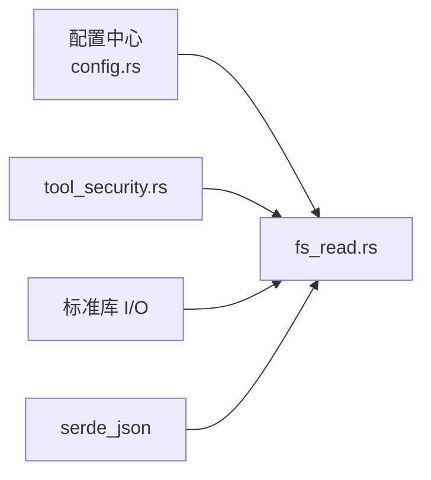

# 文件系统读取工具 (fs_read)

<cite>
**本文引用的文件**
- [src/pkg/tool_registry/fs_read.rs](src/pkg/tool_registry/fs_read.rs)
- [src/pkg/tool_registry/tool_security.rs](src/pkg/tool_registry/tool_security.rs)
- [src/pkg/tool_registry/builtin.rs](src/pkg/tool_registry/builtin.rs)
- [src/pkg/tool_registry/mod.rs](src/pkg/tool_registry/mod.rs)
- [src/config.rs](src/config.rs)
- [common/config/ai_orz.toml](common/config/ai_orz.toml)
- [src/pkg/tool_registry/fs_tests.rs](src/pkg/tool_registry/fs_tests.rs)
</cite>

## 目录
1. [简介](#简介)
2. [项目结构](#项目结构)
3. [核心组件](#核心组件)
4. [架构总览](#架构总览)
5. [详细组件分析](#详细组件分析)
6. [依赖关系分析](#依赖关系分析)
7. [性能与最佳实践](#性能与最佳实践)
8. [故障排除指南](#故障排除指南)
9. [结论](#结论)

## 简介
fs_read 是内置的文件系统读取工具，用于在受控沙箱内安全地读取项目工作区内的文件内容。它支持：
- 全文读取
- 按行号范围读取（1 起始）
- grep 模式匹配并返回上下文行
- 自动路径校验、敏感文件拦截、符号链接拒绝、文件大小限制等安全控制

该工具以“适配器”形式注册到全局工具注册表，调用入口统一通过 CoreTool::call 执行，返回值采用 JSON 结构，便于上层 Agent 或前端消费。

## 项目结构
fs_read 位于 pkg/tool_registry 子模块中，属于通用基础设施工具层（无业务感知），遵循四层单向调用原则：Adapter → Domain → DAL → DAO。fs_read 作为 Adapter 层的内置工具，不直接访问业务域模型，仅依赖配置与安全工具。

图表来源
- [src/pkg/tool_registry/builtin.rs:26-43](src/pkg/tool_registry/builtin.rs#L26-L43)
- [src/pkg/tool_registry/fs_read.rs:50-123](src/pkg/tool_registry/fs_read.rs#L50-L123)
- [src/pkg/tool_registry/tool_security.rs:314-419](src/pkg/tool_registry/tool_security.rs#L314-L419)
- [src/config.rs:38-74](src/config.rs#L38-L74)

章节来源
- [src/pkg/tool_registry/builtin.rs:26-43](src/pkg/tool_registry/builtin.rs#L26-L43)
- [src/pkg/tool_registry/mod.rs:34-73](src/pkg/tool_registry/mod.rs#L34-L73)

## 核心组件
- FsReadToolFactory：创建 fs_read 工具的 ToolPo（元数据、参数 Schema、默认配置）并生成实例
- FsReadCoreTool：实现 CoreTool::call，完成参数解析、路径校验、大小限制、读取与格式化输出
- FsToolConfig：工具配置项，包含 additional_allowed_paths，允许扩展白名单路径
- tool_security::fs：路径解析与校验、敏感文件名检测、错误信息脱敏

章节来源
- [src/pkg/tool_registry/fs_read.rs:15-123](src/pkg/tool_registry/fs_read.rs#L15-L123)
- [src/pkg/tool_registry/tool_security.rs:314-487](src/pkg/tool_registry/tool_security.rs#L314-L487)

## 架构总览
fs_read 的调用链路如下：
- 调用方通过工具注册表获取已注册的 fs_read 工具
- 构造参数后调用 CoreTool::call
- 内部先进行参数解析与路径校验（含敏感文件拦截、符号链接拒绝、白名单检查）
- 校验通过后读取文件元信息，执行硬编码大小限制
- 使用缓冲流逐行读取，支持 grep 模式匹配和行号范围截取
- 返回结构化 JSON 结果

图表来源
- [src/pkg/tool_registry/fs_read.rs:125-216](src/pkg/tool_registry/fs_read.rs#L125-L216)
- [src/pkg/tool_registry/tool_security.rs:335-419](src/pkg/tool_registry/tool_security.rs#L335-L419)

## 详细组件分析

### 参数定义与行为
- path（必填）：相对项目/工作区根的路径，将被解析为绝对路径并进行安全校验
- start_line（可选）：从第几行开始读取（1 起始）
- end_line（可选）：读到第几行（包含该行）
- grep（可选）：正则表达式字符串，仅返回匹配行及其上下文
- context_lines（可选）：grep 模式下每条匹配行的前后上下文行数，默认 2

行为说明：
- 若未提供 start_line/end_line，则读取全文并按行号格式化输出
- 若提供 grep，则返回匹配项列表，每项包含行号、内容、上下文前/后行
- 若路径不在默认工作目录且未在额外允许路径列表中，将返回 require_confirmation 提示，要求用户显式确认

章节来源
- [src/pkg/tool_registry/fs_read.rs:23-99](src/pkg/tool_registry/fs_read.rs#L23-L99)
- [src/pkg/tool_registry/fs_read.rs:127-216](src/pkg/tool_registry/fs_read.rs#L127-L216)

### 返回值格式
- 成功读取全文或范围：
  - success: true
  - path: 原始输入路径
  - size_bytes: 文件大小（字节）
  - total_lines: 总行数
  - content: 带行号的文本内容（每行格式为“行号|内容”）
- grep 模式匹配：
  - success: true
  - path: 原始输入路径
  - query: 匹配模式
  - total_matches: 匹配数量
  - matches: 数组，每项包含 line_number、content、context_before、context_after
- 需要确认：
  - success: false
  - require_confirmation: true
  - message: 提示信息，要求停止并请求用户确认
- 错误：
  - success: false
  - error: 错误描述（已脱敏，不包含绝对路径）

章节来源
- [src/pkg/tool_registry/fs_read.rs:140-216](src/pkg/tool_registry/fs_read.rs#L140-L216)

### 安全控制机制
- 敏感文件拦截：对 .env、.pem、.key、.p12、.pfx、id_rsa、id_dsa、id_ecdsa、password、secret、token、credential、auth 以及所有隐藏文件（以 . 开头）进行拦截
- 路径规范化：将相对路径拼接至 base_data_path，并对存在路径进行 canonicalize，不存在时规范父目录再拼接文件名，防止 .. 与符号链接绕过
- 白名单扩展：可通过 FsToolConfig.additional_allowed_paths 配置额外允许路径（同样基于 base_data_path 解析并 canonicalize）
- 符号链接拒绝：检测到符号链接直接拒绝访问
- 错误脱敏：IO 错误信息去除绝对路径前缀，避免泄露敏感路径

章节来源
- [src/pkg/tool_registry/tool_security.rs:314-487](src/pkg/tool_registry/tool_security.rs#L314-L487)
- [src/pkg/tool_registry/fs_tests.rs:12-80](src/pkg/tool_registry/fs_tests.rs#L12-L80)

### 文件大小限制
- 硬限制：10MB（HARD_READ_MAX_BYTES），超过即返回错误，避免内存占用过大
- 读取方式：使用 BufReader 逐行读取，降低一次性加载大文件的内存压力

章节来源
- [src/pkg/tool_registry/fs_read.rs:150-176](src/pkg/tool_registry/fs_read.rs#L150-L176)

### 行号范围解析
- 将 1 起始的行号转换为 0 起始索引
- 边界保护：start_line 小于等于 0 时视为从首行开始；end_line 大于总行数时截断到末尾
- 保证 start <= end，避免无效区间

章节来源
- [src/pkg/tool_registry/fs_read.rs:242-254](src/pkg/tool_registry/fs_read.rs#L242-L254)

### 工具注册与生命周期
- 内置工具通过 GENERIC_BUILTIN_TOOLS 静态列表注册，fs_read 在其中声明
- 工具注册表维护工厂映射，运行时根据 ToolPo 创建具体实例
- 每个请求可独立创建工具实例，注入数据库中的配置（名称、描述、控制模式等）

章节来源
- [src/pkg/tool_registry/builtin.rs:26-43](src/pkg/tool_registry/builtin.rs#L26-L43)
- [src/pkg/tool_registry/mod.rs:34-73](src/pkg/tool_registry/mod.rs#L34-L73)

## 依赖关系分析
- 配置依赖：fs_read 通过 config::get().base_data_path() 获取基础数据目录，该目录由应用配置加载器初始化并持久化
- 安全依赖：路径校验与敏感文件检测来自 tool_security::fs 模块
- 标准库依赖：std::fs、std::io::BufReader 用于文件元信息与逐行读取
- 序列化依赖：serde_json 用于参数解析与结果序列化

图表来源
- [src/config.rs:38-74](src/config.rs#L38-L74)
- [src/pkg/tool_registry/fs_read.rs:125-216](src/pkg/tool_registry/fs_read.rs#L125-L216)
- [src/pkg/tool_registry/tool_security.rs:314-487](src/pkg/tool_registry/tool_security.rs#L314-L487)

章节来源
- [src/config.rs:38-74](src/config.rs#L38-L74)
- [src/pkg/tool_registry/fs_read.rs:125-216](src/pkg/tool_registry/fs_read.rs#L125-L216)
- [src/pkg/tool_registry/tool_security.rs:314-487](src/pkg/tool_registry/tool_security.rs#L314-L487)

## 性能与最佳实践
- 大文件处理
  - 使用缓冲流逐行读取，避免一次性加载整个文件到内存
  - 启用 grep 模式可减少返回数据量，适合日志检索场景
- 缓存策略
  - 当前实现未内置缓存；对于频繁读取的小配置文件，可在上层引入进程级缓存（如内存哈希表），注意失效策略与一致性
- 并发与锁
  - 工具实例按请求创建，避免共享状态竞争；如需跨请求缓存，应使用线程安全的存储结构
- 资源释放
  - BufReader 与 File 在函数作用域结束时自动释放，无需手动关闭
- 错误处理
  - 所有 IO 错误均经过 sanitize_error 脱敏，避免泄露路径信息
  - 遇到权限不足或路径不存在时，返回明确错误消息以便排查

[本节为通用指导，不直接分析具体文件]

## 故障排除指南
常见错误与解决方案：
- 路径超出工作目录
  - 现象：返回 require_confirmation=true 的提示
  - 解决：确认路径是否应在额外允许路径列表中；必要时调整 FsToolConfig.additional_allowed_paths
- 敏感文件被拒绝
  - 现象：Access denied: cannot access sensitive file
  - 解决：避免访问 .env、密钥文件、隐藏文件等；如需访问，请评估风险并调整策略
- 符号链接被拒绝
  - 现象：Access denied: symbolic links are not allowed
  - 解决：改用真实文件或禁用符号链接
- 文件过大
  - 现象：File too large: ... bytes, maximum allowed is ... bytes
  - 解决：分块读取或使用 grep 缩小范围；考虑在上层实现分页或流式传输
- 权限不足或路径不存在
  - 现象：Failed to read file metadata / Failed to open file / Parent directory does not exist or permission denied
  - 解决：检查文件系统权限与路径有效性；确保基础数据目录存在且可写

章节来源
- [src/pkg/tool_registry/fs_read.rs:140-176](src/pkg/tool_registry/fs_read.rs#L140-L176)
- [src/pkg/tool_registry/tool_security.rs:335-419](src/pkg/tool_registry/tool_security.rs#L335-L419)

## 结论
fs_read 提供了安全、可控、易用的文件读取能力，适用于配置文件、日志文件与文本内容的读取与检索。其内置的安全校验、大小限制与错误脱敏机制，使其在 Agent 协作框架中具备高可靠性。建议在生产环境中结合业务需求合理配置额外允许路径，并在上层实现必要的缓存与分页策略以提升性能与用户体验。

[本节为总结性内容，不直接分析具体文件]