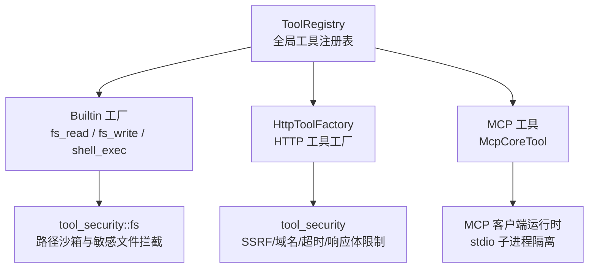
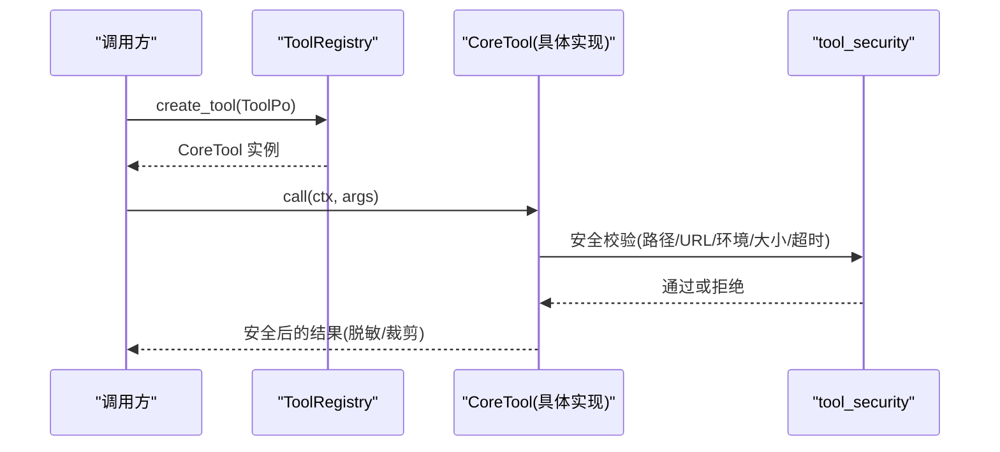
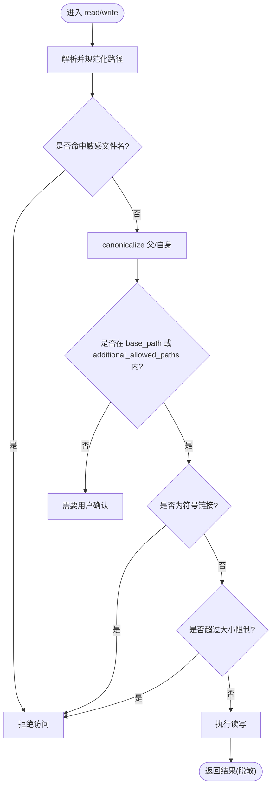
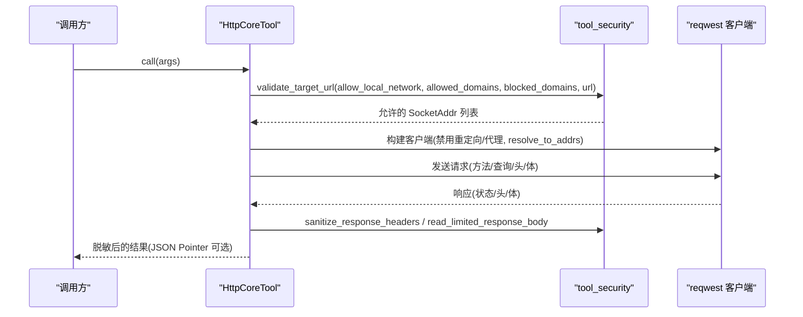
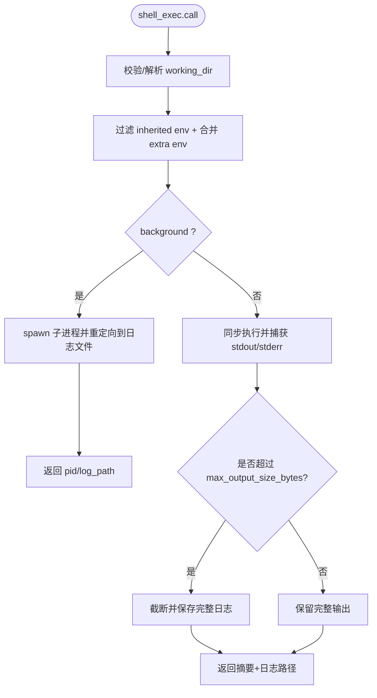
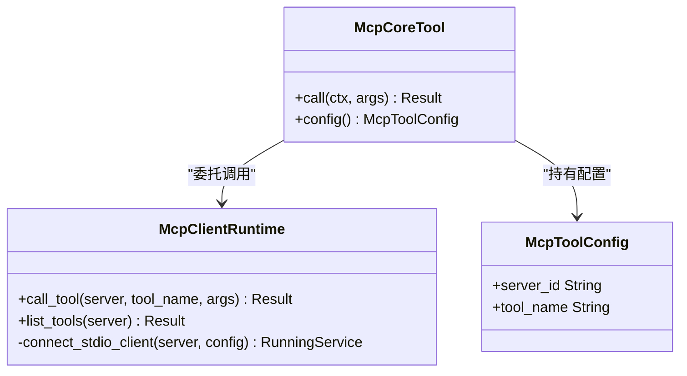
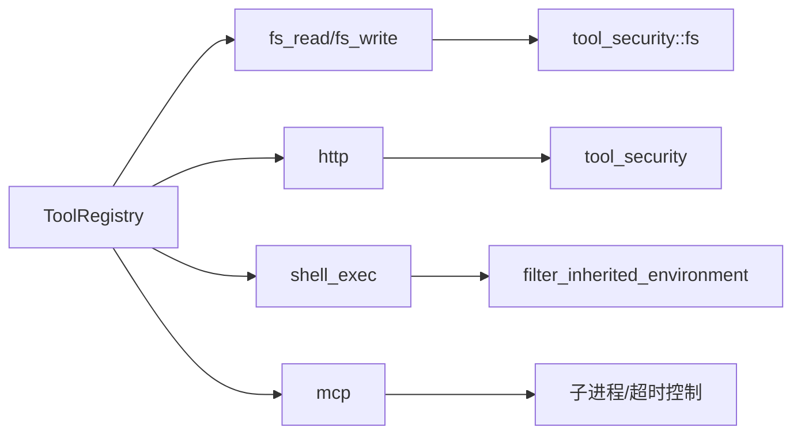

# 工具安全控制

<cite>
**本文引用的文件**
- [src/pkg/tool_registry/mod.rs](src/pkg/tool_registry/mod.rs)
- [src/pkg/tool_registry/tool_security.rs](src/pkg/tool_registry/tool_security.rs)
- [src/pkg/tool_registry/fs_read.rs](src/pkg/tool_registry/fs_read.rs)
- [src/pkg/tool_registry/fs_write.rs](src/pkg/tool_registry/fs_write.rs)
- [src/pkg/tool_registry/http.rs](src/pkg/tool_registry/http.rs)
- [src/pkg/tool_registry/shell_exec.rs](src/pkg/tool_registry/shell_exec.rs)
- [src/pkg/tool_registry/mcp.rs](src/pkg/tool_registry/mcp.rs)
- [src/pkg/tool_registry/fs_tests.rs](src/pkg/tool_registry/fs_tests.rs)
- [src/pkg/tool_registry/shell_tests.rs](src/pkg/tool_registry/shell_tests.rs)
</cite>

## 目录
1. [简介](#简介)
2. [项目结构](#项目结构)
3. [核心组件](#核心组件)
4. [架构总览](#架构总览)
5. [详细组件分析](#详细组件分析)
6. [依赖关系分析](#依赖关系分析)
7. [性能与安全特性](#性能与安全特性)
8. [故障排查指南](#故障排查指南)
9. [结论](#结论)
10. [附录](#附录)

## 简介
本文件面向“工具执行”的安全控制，覆盖权限验证、资源访问控制、输入输出过滤；并针对文件系统操作、HTTP 请求、Shell 执行、MCP 工具等类型给出特定安全策略与配置项。同时提供动态权限管理思路、最佳实践（敏感信息处理、资源泄漏防护、异常安全处理）、审计与日志记录机制，以及常见威胁的防护与修复建议。

## 项目结构
工具注册与执行位于 src/pkg/tool_registry 模块，采用“协议级工厂 + 运行时校验”的分层设计：
- 全局注册表：按协议类型维护工厂集合，从数据库加载 ToolPo 后创建可执行实例。
- 协议实现：内置工具（fs_read/fs_write/shell_exec）、HTTP 工具、MCP 工具各自实现安全边界与执行逻辑。
- 共享安全库：tool_security 提供 SSRF 防护、域名白/黑名单、响应体大小限制、头部脱敏、路径沙箱校验等通用能力。

图表来源
- [src/pkg/tool_registry/mod.rs:29-102](src/pkg/tool_registry/mod.rs#L29-L102)
- [src/pkg/tool_registry/tool_security.rs:17-139](src/pkg/tool_registry/tool_security.rs#L17-L139)
- [src/pkg/tool_registry/http.rs:23-114](src/pkg/tool_registry/http.rs#L23-L114)
- [src/pkg/tool_registry/mcp.rs:270-365](src/pkg/tool_registry/mcp.rs#L270-L365)

章节来源
- [src/pkg/tool_registry/mod.rs:29-132](src/pkg/tool_registry/mod.rs#L29-L132)

## 核心组件
- 全局工具注册表：集中管理不同协议的工厂，按 ToolProtocol 分发创建 CoreTool 实例。
- 文件系统工具：read_file/write_file 基于路径沙箱、敏感文件名拦截、符号链接拒绝、文件大小限制。
- HTTP 工具：固定 URL 模板、参数白名单渲染、SSRF 防护、域名白/黑名单、禁止重定向、无代理、响应体大小限制、状态码白名单、JSON Pointer 裁剪。
- Shell 工具：工作目录白名单、环境变量白名单+敏感词过滤、超时与输出大小限制、后台任务日志落盘。
- MCP 工具：仅绑定 server_id 与 tool_name，服务端连接细节在 McpServerPo；当前仅支持 stdio 模式，严格超时与进程生命周期管理。

章节来源
- [src/pkg/tool_registry/mod.rs:46-102](src/pkg/tool_registry/mod.rs#L46-L102)
- [src/pkg/tool_registry/fs_read.rs:15-123](src/pkg/tool_registry/fs_read.rs#L15-L123)
- [src/pkg/tool_registry/fs_write.rs:16-119](src/pkg/tool_registry/fs_write.rs#L16-L119)
- [src/pkg/tool_registry/http.rs:41-114](src/pkg/tool_registry/http.rs#L41-L114)
- [src/pkg/tool_registry/shell_exec.rs:20-68](src/pkg/tool_registry/shell_exec.rs#L20-L68)
- [src/pkg/tool_registry/mcp.rs:28-40](src/pkg/tool_registry/mcp.rs#L28-L40)

## 架构总览
工具执行的关键流程：
- 调用方通过 RequestContext 发起工具调用。
- ToolRegistry 根据 ToolPo.protocol 选择对应工厂创建 CoreTool。
- 各工具在执行前进行参数校验、资源访问校验、网络/系统调用安全限制。
- 执行结果经脱敏/裁剪后返回，并写入审计日志。

图表来源
- [src/pkg/tool_registry/mod.rs:81-102](src/pkg/tool_registry/mod.rs#L81-L102)
- [src/pkg/tool_registry/http.rs:126-220](src/pkg/tool_registry/http.rs#L126-L220)
- [src/pkg/tool_registry/fs_read.rs:125-216](src/pkg/tool_registry/fs_read.rs#L125-L216)
- [src/pkg/tool_registry/shell_exec.rs:256-466](src/pkg/tool_registry/shell_exec.rs#L256-L466)

## 详细组件分析

### 文件系统工具（读/写）
- 路径沙箱：以 base_data_path 为根，解析相对/绝对路径并 canonicalize，确保最终路径在允许范围内；支持 additional_allowed_paths 扩展白名单。
- 敏感文件拦截：对 .env/.key/.pem/id_rsa/password/secret/token 等命名模式直接拒绝；隐藏文件（以 . 开头）也拒绝。
- 符号链接拒绝：防止绕过沙箱。
- 大小限制：读取时检查文件大小上限，避免 OOM。
- 错误脱敏：IO 错误中剥离绝对路径片段，减少信息泄露。
- 写操作的原子性：先构建新行集再一次性覆写，保证一致性。

图表来源
- [src/pkg/tool_registry/tool_security.rs:314-486](src/pkg/tool_registry/tool_security.rs#L314-L486)
- [src/pkg/tool_registry/fs_read.rs:125-216](src/pkg/tool_registry/fs_read.rs#L125-L216)
- [src/pkg/tool_registry/fs_write.rs:121-275](src/pkg/tool_registry/fs_write.rs#L121-L275)

章节来源
- [src/pkg/tool_registry/fs_read.rs:15-216](src/pkg/tool_registry/fs_read.rs#L15-L216)
- [src/pkg/tool_registry/fs_write.rs:16-275](src/pkg/tool_registry/fs_write.rs#L16-L275)
- [src/pkg/tool_registry/tool_security.rs:314-486](src/pkg/tool_registry/tool_security.rs#L314-L486)
- [src/pkg/tool_registry/fs_tests.rs:12-81](src/pkg/tool_registry/fs_tests.rs#L12-L81)

### HTTP 工具
- 模板渲染：仅支持 {{args.key}} 形式的占位符，且 scheme 与 authority 必须固定，禁止 userinfo。
- SSRF 防护：默认禁止本地/私有网络目标；可通过 allow_local_network=true 显式放行；支持 allowed_domains/blocked_domains 白/黑名单。
- DNS 钉扎：resolve_to_addrs 将域名解析到受控地址列表，禁用重定向与代理。
- 超时与响应体限制：默认 30s/1MB，硬上限 10min/10MB。
- 响应脱敏：对 Authorization/Cookie/Token/Secret/Password 等头进行脱敏。
- 状态码白名单：默认仅接受 2xx/204；可自定义。
- JSON Pointer：可选裁剪响应体。

图表来源
- [src/pkg/tool_registry/http.rs:126-220](src/pkg/tool_registry/http.rs#L126-L220)
- [src/pkg/tool_registry/tool_security.rs:92-231](src/pkg/tool_registry/tool_security.rs#L92-L231)

章节来源
- [src/pkg/tool_registry/http.rs:41-599](src/pkg/tool_registry/http.rs#L41-L599)
- [src/pkg/tool_registry/tool_security.rs:92-231](src/pkg/tool_registry/tool_security.rs#L92-L231)

### Shell 执行工具
- 工作目录白名单：相对路径自动落入 base_data_path；绝对路径需匹配 additional_allowed_paths。
- 环境变量白名单：仅继承 allowed_env 中的变量，并额外过滤敏感键（如 HOME/TOKEN/SECRET 等）。
- 超时与输出限制：默认 5 分钟/10MB；超出部分截断并落盘日志。
- 后台任务：stdout/stderr 统一写入 base_data_path/tools/shell_exec/logs/{trace_id}.log，立即返回 PID。
- 命令注入缓解：使用系统 shell 并以单参形式传入命令，配合工作目录与环境最小化原则降低风险。

图表来源
- [src/pkg/tool_registry/shell_exec.rs:168-207](src/pkg/tool_registry/shell_exec.rs#L168-L207)
- [src/pkg/tool_registry/shell_exec.rs:210-254](src/pkg/tool_registry/shell_exec.rs#L210-L254)
- [src/pkg/tool_registry/shell_exec.rs:256-466](src/pkg/tool_registry/shell_exec.rs#L256-L466)

章节来源
- [src/pkg/tool_registry/shell_exec.rs:20-68](src/pkg/tool_registry/shell_exec.rs#L20-L68)
- [src/pkg/tool_registry/shell_exec.rs:168-466](src/pkg/tool_registry/shell_exec.rs#L168-L466)
- [src/pkg/tool_registry/shell_tests.rs:4-145](src/pkg/tool_registry/shell_tests.rs#L4-L145)

### MCP 工具
- 配置分离：ToolPo.config 仅包含 server_id 与 tool_name；服务器连接细节（命令、参数、环境变量、超时）保存在 McpServerPo.config。
- 运行时：当前仅支持 stdio 模式，通过子进程通信；建立会话与调用均带超时保护；失败时清理会话。
- 安全性：子进程环境清空并按配置注入；命令解析要求 PATH 或绝对路径；未实现的 Streamable HTTP 明确报错，避免未经验证的网络通道。

图表来源
- [src/pkg/tool_registry/mcp.rs:270-365](src/pkg/tool_registry/mcp.rs#L270-L365)
- [src/pkg/tool_registry/mcp.rs:72-192](src/pkg/tool_registry/mcp.rs#L72-L192)

章节来源
- [src/pkg/tool_registry/mcp.rs:28-399](src/pkg/tool_registry/mcp.rs#L28-L399)

## 依赖关系分析
- ToolRegistry 依赖各协议工厂与工具安全库；HTTP/MCP/Shell 分别依赖网络、进程、文件系统外部资源。
- 安全边界集中在 tool_security 与各自工具的入口处，形成“宽进严出”的防御面。
- 测试用例覆盖路径校验、环境变量过滤、配置解析等关键路径，保障安全行为稳定。

图表来源
- [src/pkg/tool_registry/mod.rs:29-102](src/pkg/tool_registry/mod.rs#L29-L102)
- [src/pkg/tool_registry/tool_security.rs:17-231](src/pkg/tool_registry/tool_security.rs#L17-L231)
- [src/pkg/tool_registry/shell_exec.rs:210-254](src/pkg/tool_registry/shell_exec.rs#L210-L254)
- [src/pkg/tool_registry/mcp.rs:200-240](src/pkg/tool_registry/mcp.rs#L200-L240)

章节来源
- [src/pkg/tool_registry/mod.rs:29-132](src/pkg/tool_registry/mod.rs#L29-L132)

## 性能与安全特性
- 网络 I/O：禁用重定向与代理，DNS 钉扎，限制响应体大小与超时，避免资源耗尽与劫持。
- 文件 I/O：流式读取、行级处理、大小限制、错误脱敏，降低内存占用与信息泄露风险。
- 进程执行：超时控制、输出截断与日志落盘、最小化环境变量，防止僵尸进程与敏感信息外泄。
- 配置校验：在配置阶段即拒绝非法/不安全定义（HTTP/MCP），提前暴露问题。

[本节为通用指导，不直接分析具体文件]

## 故障排查指南
- HTTP 工具
  - 现象：请求被拒绝或返回非预期状态码。
  - 排查：检查 allowed_domains/blocked_domains、allow_local_network、allowed_status_codes、response_max_bytes、timeout_ms；确认 URL 模板占位符已正确替换且无残留。
  - 参考路径
    - [src/pkg/tool_registry/http.rs:126-220](src/pkg/tool_registry/http.rs#L126-L220)
    - [src/pkg/tool_registry/http.rs:369-475](src/pkg/tool_registry/http.rs#L369-L475)
- 文件系统工具
  - 现象：无法访问文件或提示需要确认。
  - 排查：确认路径是否在 base_data_path 或 additional_allowed_paths；检查敏感文件名规则与符号链接；查看文件大小限制。
  - 参考路径
    - [src/pkg/tool_registry/tool_security.rs:314-486](src/pkg/tool_registry/tool_security.rs#L314-L486)
    - [src/pkg/tool_registry/fs_read.rs:125-216](src/pkg/tool_registry/fs_read.rs#L125-L216)
    - [src/pkg/tool_registry/fs_write.rs:121-275](src/pkg/tool_registry/fs_write.rs#L121-L275)
- Shell 工具
  - 现象：命令超时、输出过大、环境变量缺失。
  - 排查：调整 default_timeout_ms/default_max_output_size_bytes；检查 allowed_env 与敏感词过滤；确认 working_dir 在白名单内；查看日志文件路径。
  - 参考路径
    - [src/pkg/tool_registry/shell_exec.rs:20-68](src/pkg/tool_registry/shell_exec.rs#L20-L68)
    - [src/pkg/tool_registry/shell_exec.rs:210-254](src/pkg/tool_registry/shell_exec.rs#L210-L254)
    - [src/pkg/tool_registry/shell_exec.rs:256-466](src/pkg/tool_registry/shell_exec.rs#L256-L466)
- MCP 工具
  - 现象：工具不可执行或会话初始化超时。
  - 排查：确认 server_id 与 tool_name 配置正确；检查 McpServerPo.config 的命令与超时；确认 PATH 或绝对路径可用；关注会话关闭错误。
  - 参考路径
    - [src/pkg/tool_registry/mcp.rs:200-240](src/pkg/tool_registry/mcp.rs#L200-L240)
    - [src/pkg/tool_registry/mcp.rs:270-365](src/pkg/tool_registry/mcp.rs#L270-L365)

章节来源
- [src/pkg/tool_registry/http.rs:126-220](src/pkg/tool_registry/http.rs#L126-L220)
- [src/pkg/tool_registry/tool_security.rs:314-486](src/pkg/tool_registry/tool_security.rs#L314-L486)
- [src/pkg/tool_registry/shell_exec.rs:210-466](src/pkg/tool_registry/shell_exec.rs#L210-L466)
- [src/pkg/tool_registry/mcp.rs:200-365](src/pkg/tool_registry/mcp.rs#L200-L365)

## 结论
该工具子系统通过“注册表 + 协议工厂 + 共享安全库”的架构，实现了跨文件系统、HTTP、Shell、MCP 的统一安全边界。其核心在于：严格的输入校验与模板约束、资源访问白名单与敏感信息过滤、网络与进程资源的超时与大小限制、以及可配置的动态权限（additional_allowed_paths、allowed_domains、allow_local_network、allowed_env）。结合完善的测试与日志落盘，可在多 Agent 协作场景中提供可控、可观测、可审计的工具执行环境。

[本节为总结性内容，不直接分析具体文件]

## 附录

### 安全配置选项速查
- 文件系统
  - additional_allowed_paths：扩展允许的工作目录白名单
  - 敏感文件名拦截：.env/.key/.pem/id_rsa/password/secret/token 等
  - 符号链接拒绝、文件大小限制、错误脱敏
- HTTP
  - allowed_domains/blocked_domains：域名白/黑名单
  - allow_local_network：显式允许本地/私有网络目标
  - timeout_ms/response_max_bytes：超时与响应体限制
  - allowed_status_codes：接受的状态码集合
  - response_json_pointer：响应体 JSON 指针裁剪
- Shell
  - default_timeout_ms/default_max_output_size_bytes：默认超时与输出限制
  - additional_allowed_paths：工作目录白名单
  - allowed_env：环境变量白名单（叠加敏感词过滤）
- MCP
  - server_id/tool_name：工具绑定
  - McpServerPo.config：命令、参数、环境变量、超时等运行期配置

[本节为配置说明，不直接分析具体文件]

### 安全最佳实践
- 敏感信息处理
  - 使用环境变量白名单与敏感词过滤，避免泄露密钥与凭据。
  - HTTP 响应头脱敏，避免将认证信息回传到上层。
  - 文件系统拒绝敏感文件名与隐藏文件。
- 资源泄漏防护
  - 所有外部调用设置超时与大小限制；后台进程输出落盘并限制体积。
  - MCP 会话建立与关闭均有超时与错误处理，避免僵尸进程。
- 异常安全处理
  - 错误消息脱敏，避免泄露路径与内部细节。
  - 配置阶段即校验非法值，尽早失败。
- 审计与日志
  - Shell 工具将完整输出写入 base_data_path/tools/shell_exec/logs/{trace_id}.log。
  - HTTP 工具返回脱敏头与内容长度，便于审计追踪。
  - 建议在更高层接入 AOP 日志与指标采集，统一记录工具调用上下文。

[本节为通用指导，不直接分析具体文件]

### 常见威胁与修复建议
- SSRF（服务器端请求伪造）
  - 措施：默认拒绝本地/私有网络目标；域名白/黑名单；DNS 钉扎；禁用重定向与代理。
  - 参考：[src/pkg/tool_registry/http.rs:126-220](src/pkg/tool_registry/http.rs#L126-L220), [src/pkg/tool_registry/tool_security.rs:92-170](src/pkg/tool_registry/tool_security.rs#L92-L170)
- 路径遍历与越权访问
  - 措施：canonicalize 路径、白名单校验、拒绝符号链接、敏感文件名拦截。
  - 参考：[src/pkg/tool_registry/tool_security.rs:314-486](src/pkg/tool_registry/tool_security.rs#L314-L486)
- 命令注入与权限提升
  - 措施：最小化环境变量、工作目录白名单、超时与输出限制、后台任务日志隔离。
  - 参考：[src/pkg/tool_registry/shell_exec.rs:210-466](src/pkg/tool_registry/shell_exec.rs#L210-L466)
- 资源耗尽（OOM/DoS）
  - 措施：响应体大小限制、文件读取大小限制、超时控制、输出截断。
  - 参考：[src/pkg/tool_registry/http.rs:561-589](src/pkg/tool_registry/http.rs#L561-L589), [src/pkg/tool_registry/fs_read.rs:150-165](src/pkg/tool_registry/fs_read.rs#L150-L165)
- 凭证泄露
  - 措施：HTTP 头脱敏、Shell 环境变量过滤、MCP 子进程环境清空。
  - 参考：[src/pkg/tool_registry/tool_security.rs:172-198](src/pkg/tool_registry/tool_security.rs#L172-L198), [src/pkg/tool_registry/shell_exec.rs:210-254](src/pkg/tool_registry/shell_exec.rs#L210-L254), [src/pkg/tool_registry/mcp.rs:200-240](src/pkg/tool_registry/mcp.rs#L200-L240)

[本节为通用指导，不直接分析具体文件]