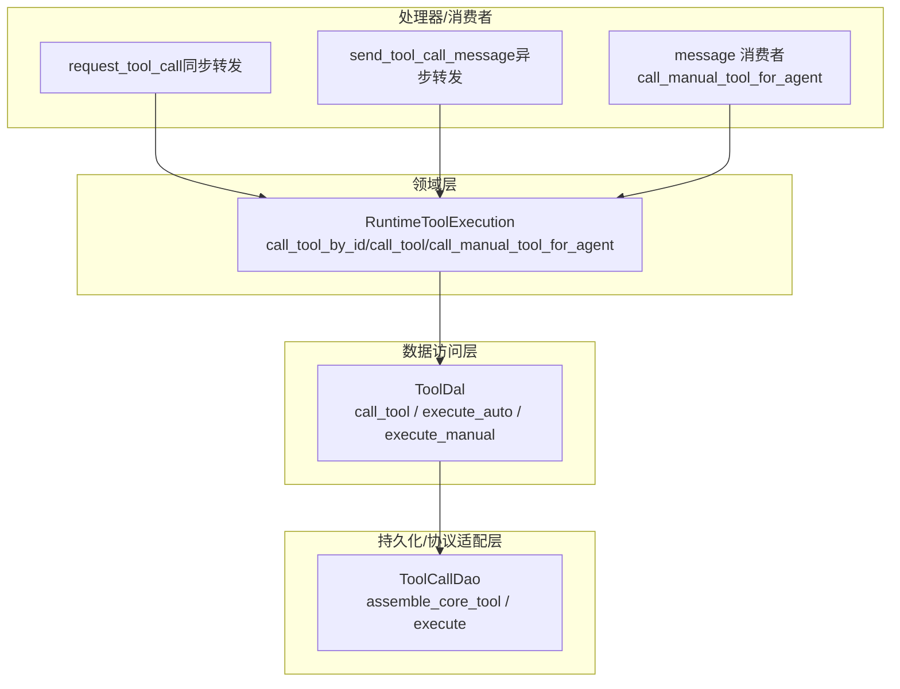
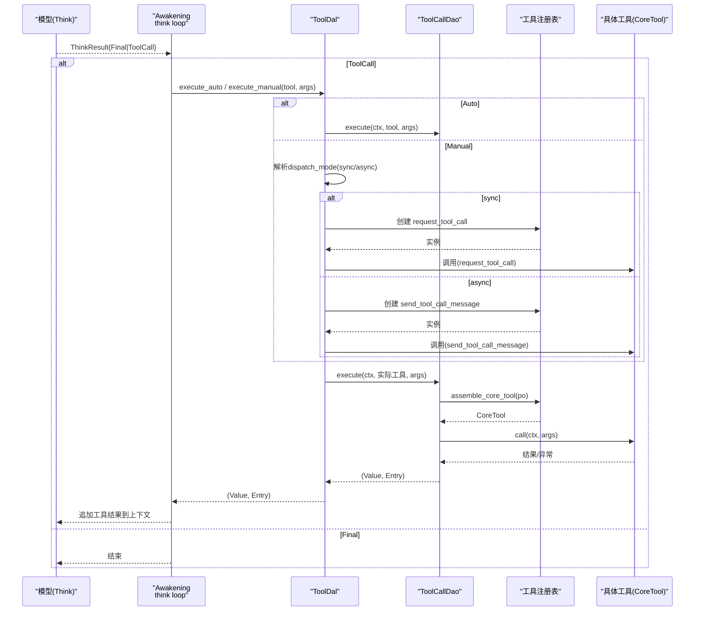
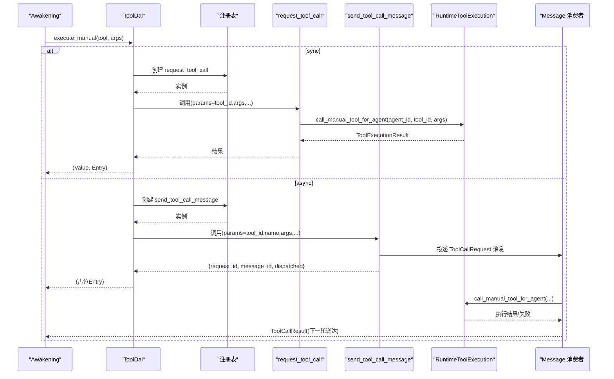
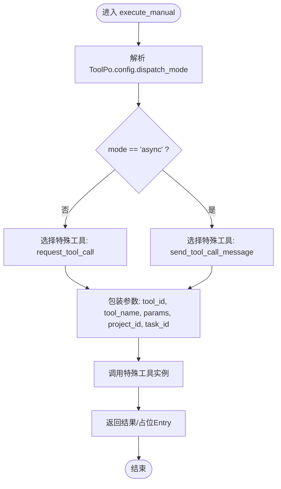
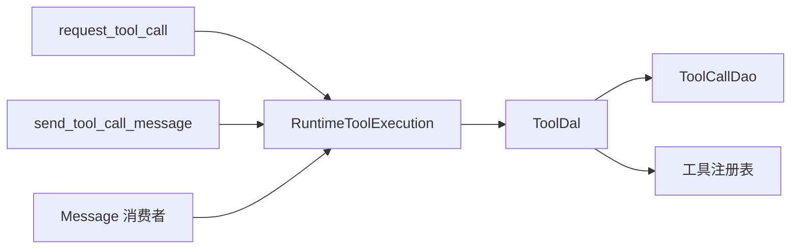

# 工具调用模式

<cite>
**本文引用的文件**
- [src/service/dao/tool_call/mod.rs](src/service/dao/tool_call/mod.rs)
- [src/service/dao/tool_call/impl.rs](src/service/dao/tool_call/impl.rs)
- [src/service/dal/tool.rs](src/service/dal/tool.rs)
- [src/service/domain/runtime/mod.rs](src/service/domain/runtime/mod.rs)
- [src/service/domain/runtime/awakening.rs](src/service/domain/runtime/awakening.rs)
- [src/handlers/finance/tool/request_tool_call.rs](src/handlers/finance/tool/request_tool_call.rs)
- [src/handlers/finance/tool/send_tool_call_message.rs](src/handlers/finance/tool/send_tool_call_message.rs)
- [src/consumer/message.rs](src/consumer/message.rs)
</cite>

## 目录
1. [简介](#简介)
2. [项目结构](#项目结构)
3. [核心组件](#核心组件)
4. [架构总览](#架构总览)
5. [详细组件分析](#详细组件分析)
6. [依赖关系分析](#依赖关系分析)
7. [性能考虑](#性能考虑)
8. [故障排查指南](#故障排查指南)
9. [结论](#结论)
10. [附录：使用场景与最佳实践](#附录使用场景与最佳实践)

## 简介
本文件系统化说明工具调用的三种分发模式及其实现机制：
- 自动调用（execute_auto）：由 Agent 的 awakening 循环在 think loop 中根据模型返回的 ToolCall 自动触发，适合短耗时、可立即返回结果的工具。
- 直接执行（call_tool）：通用执行入口，统一封装追踪、脱敏、AOP 事件发布等横切关注点。
- Manual 模式（execute_manual）：通过特殊 internal 工具转发到同步或异步通道，支持“立即返回”和“下一轮唤醒送达结果”两种语义。

三层分发机制贯穿：
- 第一层：awakening 循环自动调用（按 control_mode 选择 execute_auto 或 execute_manual）。
- 第二层：call_tool 直接执行（DAL 统一入口，委托 DAO）。
- 第三层：ToolCallDao::execute + 装饰器/追踪（DAO 层构造 trace entry、发布 AOP 事件、错误携带 trace_ref）。

## 项目结构
围绕工具调用，关键代码分布在 DAL、DAO、Domain 以及 Handler/Consumer 层：
- Domain（runtime）：定义工具执行接口，持有协议路由（MCP vs 内置/HTTP），并暴露 call_tool_by_id / call_tool / call_manual_tool_for_agent。
- DAL（tool.rs）：提供统一的工具执行入口 call_tool，以及模式化入口 execute_auto / execute_manual；Manual 模式通过特殊 internal 工具转发。
- DAO（tool_call）：底层原语 execute，负责真实工具实例组装、追踪 entry 构造、AOP 事件发布、错误携带 trace_ref。
- Handler/Consumer：request_tool_call（同步）、send_tool_call_message（异步）作为 Manual 模式的内部转发器；消息消费者将 Manual 结果投递回消息通道。

图表来源
- [src/service/domain/runtime/mod.rs:175-213](src/service/domain/runtime/mod.rs#L175-L213)
- [src/service/dal/tool.rs:146-196](src/service/dal/tool.rs#L146-L196)
- [src/service/dao/tool_call/mod.rs:23-43](src/service/dao/tool_call/mod.rs#L23-L43)
- [src/handlers/finance/tool/request_tool_call.rs:1-54](src/handlers/finance/tool/request_tool_call.rs#L1-L54)
- [src/handlers/finance/tool/send_tool_call_message.rs:1-57](src/handlers/finance/tool/send_tool_call_message.rs#L1-L57)
- [src/consumer/message.rs:439-477](src/consumer/message.rs#L439-L477)

章节来源
- [src/service/domain/runtime/mod.rs:175-213](src/service/domain/runtime/mod.rs#L175-L213)
- [src/service/dal/tool.rs:146-196](src/service/dal/tool.rs#L146-L196)
- [src/service/dao/tool_call/mod.rs:23-43](src/service/dao/tool_call/mod.rs#L23-L43)
- [src/handlers/finance/tool/request_tool_call.rs:1-54](src/handlers/finance/tool/request_tool_call.rs#L1-L54)
- [src/handlers/finance/tool/send_tool_call_message.rs:1-57](src/handlers/finance/tool/send_tool_call_message.rs#L1-L57)
- [src/consumer/message.rs:439-477](src/consumer/message.rs#L439-L477)

## 核心组件
- RuntimeToolExecution（Domain）：对外暴露工具执行能力，拥有协议路由职责（MCP 走 McpToolDal，其余走通用 ToolDal）。
- ToolDal（DAL）：统一执行入口 call_tool；模式化入口 execute_auto（Auto 工具）、execute_manual（Manual 工具，按 dispatch_mode 选择同步/异步转发）。
- ToolCallDao（DAO）：底层原语 execute，负责：
  - 从注册表组装 CoreTool 实例；
  - 构造 ToolCallEntry（含输入输出脱敏、调用位置、时长统计）；
  - 发布 AOP ToolExecEvent（同步消费：日志写入 + 统计记录）；
  - 失败时 Error 携带 trace_ref（便于上层关联追踪）。

章节来源
- [src/service/domain/runtime/mod.rs:175-213](src/service/domain/runtime/mod.rs#L175-L213)
- [src/service/dal/tool.rs:146-196](src/service/dal/tool.rs#L146-L196)
- [src/service/dao/tool_call/mod.rs:23-43](src/service/dao/tool_call/mod.rs#L23-L43)
- [src/service/dao/tool_call/impl.rs:56-179](src/service/dao/tool_call/impl.rs#L56-L179)

## 架构总览
下图展示从 awaken 循环到最终工具执行的完整链路，包括 Auto 与 Manual 的分发差异。

图表来源
- [src/service/domain/runtime/awakening.rs:250-343](src/service/domain/runtime/awakening.rs#L250-L343)
- [src/service/dal/tool.rs:742-824](src/service/dal/tool.rs#L742-L824)
- [src/service/dao/tool_call/impl.rs:70-179](src/service/dao/tool_call/impl.rs#L70-L179)

## 详细组件分析

### 三层分发机制与调用模式

#### 1) Awakening 循环自动调用（Auto）
- 触发条件：模型返回 ThinkResult::ToolCall，且工具 control_mode == Auto。
- 参数传递：tool.name -> 匹配 agent.tools 中的 Tool；arguments 为 JSON 值。
- 处理流程：
  - 在 think loop 内，对每个 ToolCall 按 control_mode 分发：
    - Auto：调用 ToolDal::execute_auto -> call_tool -> ToolCallDao::execute。
    - Manual：调用 ToolDal::execute_manual（见下节）。
- 错误处理：若执行失败，向消息追加错误信息，继续后续思考轮次。
- 性能与安全：
  - 单次 awaken 有最大工具调用轮次限制，防止无限循环。
  - 当输入 token 超过阈值时中断循环，交由外层进行上下文沉淀后重试。

章节来源
- [src/service/domain/runtime/awakening.rs:250-343](src/service/domain/runtime/awakening.rs#L250-L343)

#### 2) 直接执行（call_tool）
- 作用：DAL 的统一执行入口，所有工具（Auto/Manual/普通）都经过此路径。
- 行为：
  - 委托 ToolCallDao::execute，完成追踪、脱敏、AOP 事件发布。
  - 成功返回 (Value, ToolCallEntry)，失败返回带 trace_ref 的错误。
- 适用场景：
  - 已知 Tool 对象时的直接调用；
  - 测试或管理端调试（如 debug_call_tool）。

章节来源
- [src/service/dal/tool.rs:742-752](src/service/dal/tool.rs#L742-L752)
- [src/service/dao/tool_call/impl.rs:70-179](src/service/dao/tool_call/impl.rs#L70-L179)

#### 3) Manual 模式（execute_manual + 特殊 internal 工具转发）
- 触发条件：模型返回 ToolCall，且工具 control_mode == Manual。
- 分发策略：
  - 读取 ToolPo.config.dispatch_mode：
    - sync（默认）：通过特殊工具 request_tool_call 同步转发，立即得到结果。
    - async：通过特殊工具 send_tool_call_message 异步派发，立即返回请求 ID，结果在下一轮 awaken 以 ToolCallResult 消息送达。
- 参数组织：
  - 将真实工具调用包装成特殊工具的参数格式（包含 tool_id、tool_name、params、project_id、task_id）。
  - 特殊工具内部再调用 runtime::tool_execution().call_manual_tool_for_agent，完成授权校验与协议路由。
- 错误处理：
  - 同步：直接返回错误给调用方。
  - 异步：消息投递成功后，消费者在执行完成后发送 ToolCallResult（成功/失败）回消息通道。

章节来源
- [src/service/dal/tool.rs:764-824](src/service/dal/tool.rs#L764-L824)
- [src/handlers/finance/tool/request_tool_call.rs:1-54](src/handlers/finance/tool/request_tool_call.rs#L1-L54)
- [src/handlers/finance/tool/send_tool_call_message.rs:1-57](src/handlers/finance/tool/send_tool_call_message.rs#L1-L57)
- [src/consumer/message.rs:439-477](src/consumer/message.rs#L439-L477)

#### 4) ToolCallDao::execute + 装饰器/追踪
- 职责：
  - 组装 CoreTool 实例（基于 ToolPo 元数据与注册表）。
  - 构造 ToolCallEntry（call_id、工具标识、上下文、时间戳、输入输出大小、状态）。
  - 对输入/输出/错误进行脱敏（外部协议工具尤为关键）。
  - 发布 AOP ToolExecEvent（同步消费：日志写入 + 统计记录）。
  - 失败时将 trace_ref 注入错误，便于上层关联追踪。
- 注意：
  - 这是所有工具执行的底层原语，不区分 Auto/Manual/协议类型。
  - 调用方应使用返回的 entry.call_id 作为真实 call_id。

章节来源
- [src/service/dao/tool_call/mod.rs:23-43](src/service/dao/tool_call/mod.rs#L23-L43)
- [src/service/dao/tool_call/impl.rs:70-179](src/service/dao/tool_call/impl.rs#L70-L179)

### 调用时序图（Manual 同步/异步）

图表来源
- [src/service/dal/tool.rs:764-824](src/service/dal/tool.rs#L764-L824)
- [src/handlers/finance/tool/request_tool_call.rs:1-54](src/handlers/finance/tool/request_tool_call.rs#L1-L54)
- [src/handlers/finance/tool/send_tool_call_message.rs:1-57](src/handlers/finance/tool/send_tool_call_message.rs#L1-L57)
- [src/consumer/message.rs:439-477](src/consumer/message.rs#L439-L477)

### 流程图（execute_manual 分发决策）

图表来源
- [src/service/dal/tool.rs:764-824](src/service/dal/tool.rs#L764-L824)

## 依赖关系分析
- Domain（runtime）依赖 DAL 的工具执行接口，拥有协议路由职责。
- DAL（tool.rs）依赖 DAO（tool_call）进行底层执行，同时依赖工具注册表以创建特殊 internal 工具。
- DAO（tool_call）依赖注册表组装 CoreTool，并依赖 AOP 子系统发布事件。
- Handler（request_tool_call/send_tool_call_message）仅作为内部转发器，不承载业务逻辑。
- Consumer（message.rs）在收到 ToolCallRequest 后，调用 Domain 的 Manual 执行入口，并将结果投递回消息通道。

图表来源
- [src/service/domain/runtime/mod.rs:175-213](src/service/domain/runtime/mod.rs#L175-L213)
- [src/service/dal/tool.rs:146-196](src/service/dal/tool.rs#L146-L196)
- [src/service/dao/tool_call/mod.rs:23-43](src/service/dao/tool_call/mod.rs#L23-L43)
- [src/handlers/finance/tool/request_tool_call.rs:1-54](src/handlers/finance/tool/request_tool_call.rs#L1-L54)
- [src/handlers/finance/tool/send_tool_call_message.rs:1-57](src/handlers/finance/tool/send_tool_call_message.rs#L1-L57)
- [src/consumer/message.rs:439-477](src/consumer/message.rs#L439-L477)

章节来源
- [src/service/domain/runtime/mod.rs:175-213](src/service/domain/runtime/mod.rs#L175-L213)
- [src/service/dal/tool.rs:146-196](src/service/dal/tool.rs#L146-L196)
- [src/service/dao/tool_call/mod.rs:23-43](src/service/dao/tool_call/mod.rs#L23-L43)
- [src/handlers/finance/tool/request_tool_call.rs:1-54](src/handlers/finance/tool/request_tool_call.rs#L1-L54)
- [src/handlers/finance/tool/send_tool_call_message.rs:1-57](src/handlers/finance/tool/send_tool_call_message.rs#L1-L57)
- [src/consumer/message.rs:439-477](src/consumer/message.rs#L439-L477)

## 性能考虑
- 避免长耗时阻塞：
  - Auto 工具建议短耗时、可立即返回；长耗时任务建议使用 Manual 异步模式（dispatch_mode=async）。
- 控制 think loop 轮次：
  - 单次 awaken 内设置最大工具调用轮次，防止无限循环。
- 上下文溢出保护：
  - 当输入 token 超过阈值时中断循环，交由外层沉淀上下文后重试，降低内存与延迟压力。
- 追踪与脱敏：
  - DAO 层集中处理输入/输出/错误的脱敏与统计，减少重复开销。
- 向量索引重建：
  - 工具搜索与索引重建具备降级与幂等逻辑，不影响主流程。

[本节为通用性能建议，不直接分析具体文件]

## 故障排查指南
- 无法找到工具：
  - 检查 ToolPo 是否存在、是否启用、是否已绑定到 Agent。
  - 确认 ToolCallDao::assemble_core_tool 能从注册表创建实例。
- Manual 模式无结果：
  - 同步模式：检查 request_tool_call 返回值与错误信息。
  - 异步模式：检查消息是否投递成功，并在下一轮 awaken 中查找 ToolCallResult 消息。
- 追踪缺失：
  - 确认 ToolCallDao::execute 已发布 ToolExecEvent，且错误携带 trace_ref。
  - 在日志中查看 caller_location 定位调用点。
- 超时与上下文溢出：
  - 观察 think loop 是否达到最大轮次或触发上下文溢出阈值，必要时调整 prompt 长度或拆分任务。

章节来源
- [src/service/dao/tool_call/impl.rs:70-179](src/service/dao/tool_call/impl.rs#L70-L179)
- [src/consumer/message.rs:439-477](src/consumer/message.rs#L439-L477)
- [src/service/domain/runtime/awakening.rs:250-343](src/service/domain/runtime/awakening.rs#L250-L343)

## 结论
- execute_auto 适用于模型主动选择的短耗时工具，直接在 think loop 内同步执行并回填结果。
- call_tool 是统一执行入口，保证追踪、脱敏与 AOP 事件的一致性。
- execute_manual 通过特殊 internal 工具转发，支持同步与异步两种语义，满足不同延迟与交互需求。
- 三层分发清晰解耦：awakening 负责调度，DAL 负责模式化入口，DAO 负责底层执行与横切关注点。

[本节为总结性内容，不直接分析具体文件]

## 附录：使用场景与最佳实践
- 何时选择 Auto：
  - 工具执行快速、无需用户干预、结果可直接用于下一轮思考。
- 何时选择 Manual（sync）：
  - 需要立即返回结果，但工具本身不适合 Auto（例如需要额外授权或安全校验）。
- 何时选择 Manual（async）：
  - 工具执行耗时较长，不应阻塞当前 think loop；结果将在下一轮 awaken 通过消息送达。
- 参数传递：
  - 始终通过 ToolDal::call_tool / execute_auto / execute_manual 传入 RequestContext 与 JSON 参数，确保上下文一致。
- 错误处理：
  - 捕获错误并保留 trace_ref；对于异步模式，确保消费者正确发送 ToolCallResult。
- 性能优化：
  - 合理配置 dispatch_mode；避免在 Auto 中执行重任务；利用上下文溢出保护机制。

[本节为通用指导，不直接分析具体文件]