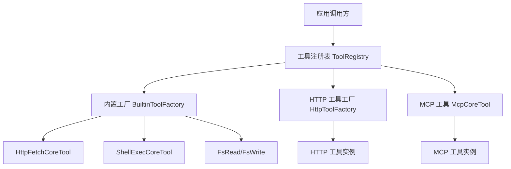
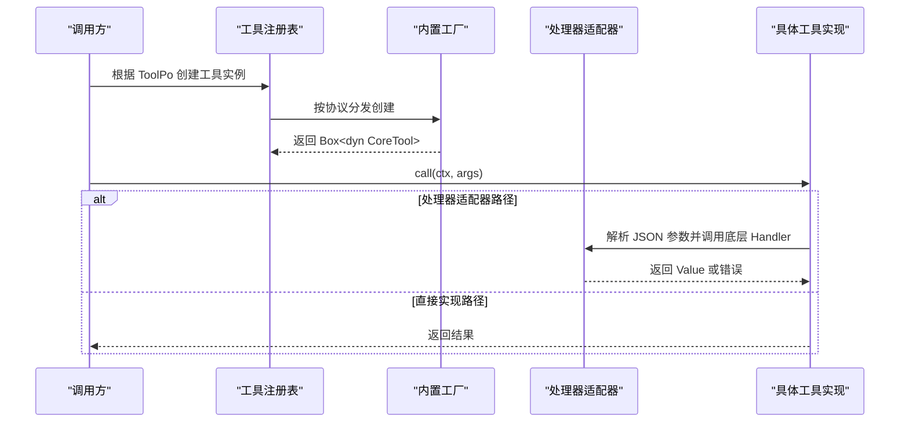
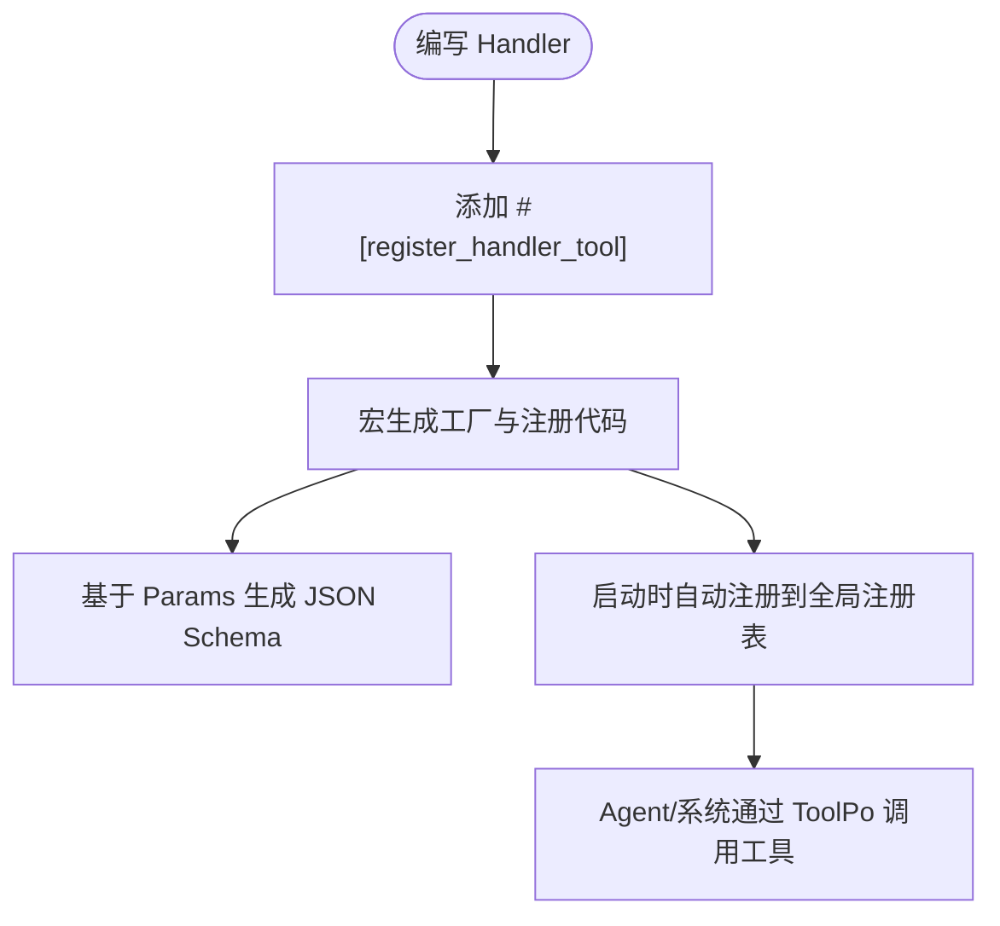
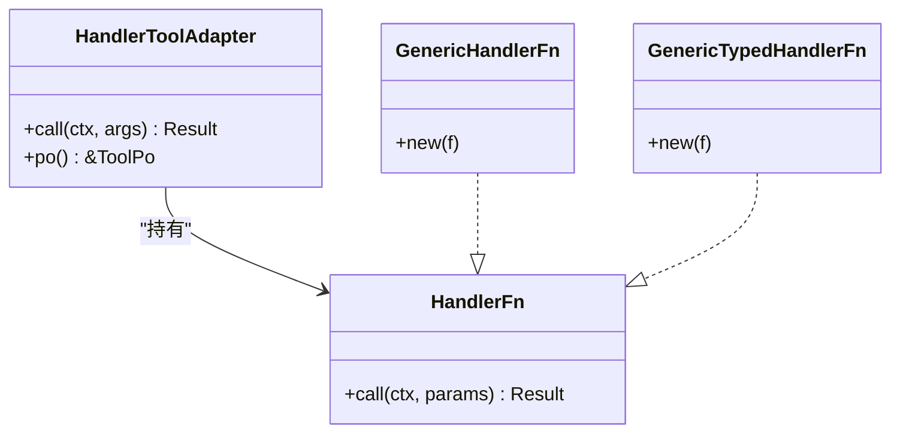
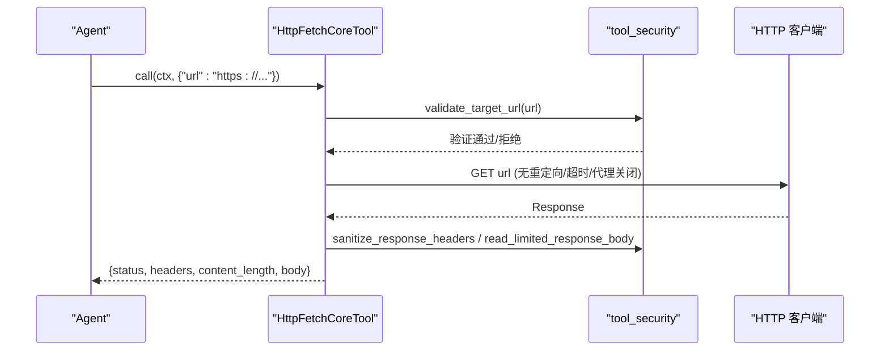
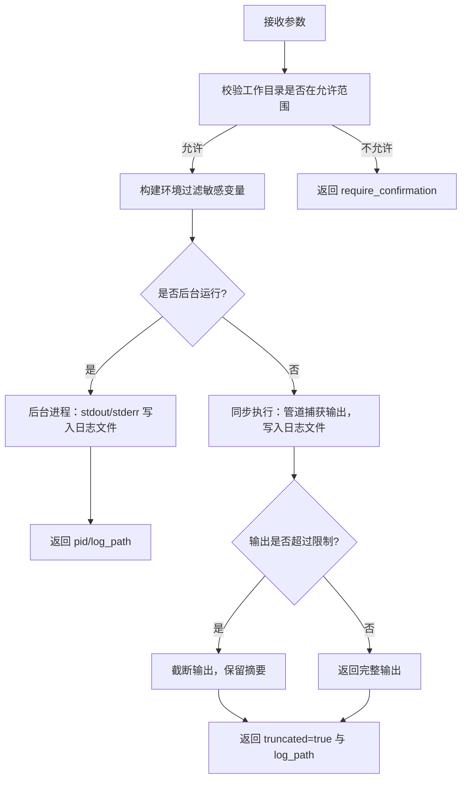
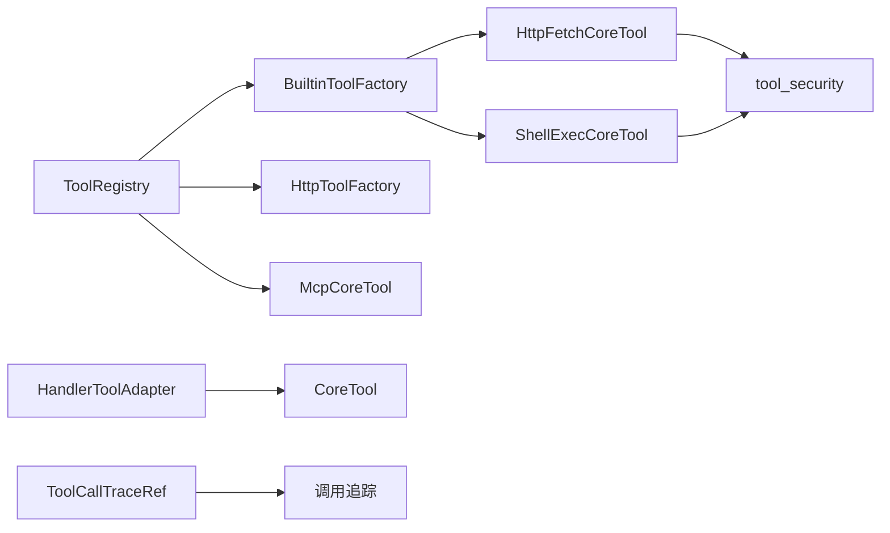

# 自定义工具开发

<cite>
**本文引用的文件**
- [handler-tool-registration-macro.md](docs/archive/design-archive/handler-tool-registration-macro.md)
- [mod.rs（工具注册表）](src/pkg/tool_registry/mod.rs)
- [mod.rs（处理器适配器）](src/pkg/tool_registry/handler_adapter/mod.rs)
- [builtin.rs（内置工厂）](src/pkg/tool_registry/builtin.rs)
- [http_fetch.rs（HTTP 抓取工具）](src/pkg/tool_registry/http_fetch.rs)
- [shell_exec.rs（Shell 执行工具）](src/pkg/tool_registry/shell_exec.rs)
- [tool_security.rs（工具安全）](src/pkg/tool_registry/tool_security.rs)
- [tool.rs（公共模型）](common/src/models/tool.rs)
</cite>

## 目录
1. [简介](#简介)
2. [项目结构](#项目结构)
3. [核心组件](#核心组件)
4. [架构总览](#架构总览)
5. [详细组件分析](#详细组件分析)
6. [依赖关系分析](#依赖关系分析)
7. [性能考量](#性能考量)
8. [故障排查指南](#故障排查指南)
9. [结论](#结论)
10. [附录](#附录)

## 简介
本指南面向希望在项目中扩展“工具”能力的开发者，围绕 CoreTool 接口、register_handler_tool 宏、工具元数据、安全性与测试调试等方面，提供从入门到进阶的完整说明。内容基于仓库中工具注册与实现的实际代码与设计文档，确保可落地、可复用、可演进。

## 项目结构
工具体系位于 src/pkg/tool_registry 下，采用“协议分层 + 工厂模式 + 全局注册表”的组织方式：
- 全局注册表：维护内置/动态工具的工厂或配置，按协议分发创建实例
- 处理器适配器：将现有 HTTP Handler 适配为 CoreTool，统一参数解析与错误转换
- 内置工具：如 http_fetch、fs_read/write、shell_exec 等通用能力
- 安全模块：统一的 SSRF、域名白黑名单、响应大小限制、敏感头脱敏、文件系统沙箱等

图表来源
- [mod.rs（工具注册表）:29-102](src/pkg/tool_registry/mod.rs#L29-L102)
- [builtin.rs:17-43](src/pkg/tool_registry/builtin.rs#L17-L43)
- [http_fetch.rs:23-51](src/pkg/tool_registry/http_fetch.rs#L23-L51)
- [shell_exec.rs:93-148](src/pkg/tool_registry/shell_exec.rs#L93-L148)

章节来源
- [mod.rs（工具注册表）:29-102](src/pkg/tool_registry/mod.rs#L29-L102)
- [builtin.rs:17-43](src/pkg/tool_registry/builtin.rs#L17-L43)

## 核心组件
- CoreTool 接口：所有工具的统一抽象，要求实现 call(ctx, args) -> Result<Value> 与 po() -> &ToolPo
- 工具注册表 ToolRegistry：集中管理工厂与实例创建，支持 Builtin/Mcp/Http 三类协议
- 处理器适配器 HandlerToolAdapter：将符合签名的 Handler 函数包装为 CoreTool，自动完成 JSON 参数解析与错误映射
- register_handler_tool 宏：声明式地将 Handler 注册为内置工具，自动生成工厂与注册逻辑
- 内置工具工厂 BuiltinToolFactory：定义 create_po/create 的工厂契约，用于内置工具初始化与实例化
- 安全模块 tool_security：提供网络与文件系统的统一安全校验与限制

章节来源
- [mod.rs（处理器适配器）:26-190](src/pkg/tool_registry/handler_adapter/mod.rs#L26-L190)
- [mod.rs（工具注册表）:29-102](src/pkg/tool_registry/mod.rs#L29-L102)
- [builtin.rs:17-43](src/pkg/tool_registry/builtin.rs#L17-L43)
- [tool_security.rs:17-170](src/pkg/tool_registry/tool_security.rs#L17-L170)

## 架构总览
下图展示了“Handler → 适配器 → 工具注册表 → 具体工具实现”的调用链，以及工具元数据的生成与使用流程。

图表来源
- [mod.rs（工具注册表）:81-102](src/pkg/tool_registry/mod.rs#L81-L102)
- [mod.rs（处理器适配器）:170-190](src/pkg/tool_registry/handler_adapter/mod.rs#L170-L190)
- [builtin.rs:17-43](src/pkg/tool_registry/builtin.rs#L17-L43)

## 详细组件分析

### CoreTool 接口与实现要求
- 方法签名
  - call(ctx: RequestContext, args: Value) -> Result<Value>
  - po() -> &ToolPo
- 参数处理
  - 由适配器或工具自身负责将 JSON Value 反序列化为强类型参数
  - 失败时转换为统一错误类型，便于上层追踪
- 返回值格式
  - 成功：JSON Value（对象/数组/标量均可）
  - 失败：包含错误码与消息的结构化错误

章节来源
- [mod.rs（处理器适配器）:170-190](src/pkg/tool_registry/handler_adapter/mod.rs#L170-L190)
- [http_fetch.rs:60-143](src/pkg/tool_registry/http_fetch.rs#L60-L143)
- [shell_exec.rs:256-471](src/pkg/tool_registry/shell_exec.rs#L256-L471)

### register_handler_tool 宏
- 作用
  - 将现有 Handler 直接注册为内置工具，复用权限校验、参数解析、错误处理与业务逻辑
  - 自动生成工厂结构体、create_po/create 实现，并在启动时自动注册到全局注册表
- 关键属性
  - id/name/description/params：必填；neural/tags：可选
- 生成产物
  - 工厂：{ID}_FACTORY
  - 元数据：parameters_schema 通过 schemars 从 Params 类型自动生成
  - 注册：通过 ctor 在程序启动时注入全局注册表

图表来源
- [handler-tool-registration-macro.md:97-133](docs/archive/design-archive/handler-tool-registration-macro.md#L97-L133)
- [handler-tool-registration-macro.md:124-154](docs/archive/design-archive/handler-tool-registration-macro.md#L124-L154)

章节来源
- [handler-tool-registration-macro.md:97-154](docs/archive/design-archive/handler-tool-registration-macro.md#L97-L154)

### 工具元数据定义
- 名称与描述：name/description，用于 UI 展示与 LLM 理解
- 参数 Schema：parameters_schema，由 Params 类型推导生成，保证类型安全与文档一致性
- 返回类型：由工具实现决定，通常以 JSON Value 表达
- 控制模式与状态：control_mode/status，区分自动/手动控制与启用/禁用
- 标签与神经标记：tags/neural，用于资源发现、内部工具分类与唤醒注入

章节来源
- [handler-tool-registration-macro.md:113-123](docs/archive/design-archive/handler-tool-registration-macro.md#L113-L123)
- [handler-tool-registration-macro.md:220-261](docs/archive/design-archive/handler-tool-registration-macro.md#L220-L261)

### 处理器适配器（Handler → CoreTool）
- 设计目标
  - 复用现有 Handler 的权限、参数解析、错误处理与业务逻辑
  - 保持 HTTP API 与工具调用行为一致
- 实现要点
  - HandlerFn trait：统一封装异步调用
  - GenericHandlerFn/GenericTypedHandlerFn：适配不同返回类型
  - HandlerToolAdapter：将 Handler 包装为 CoreTool，完成 JSON 参数解析与错误转换

图表来源
- [mod.rs（处理器适配器）:26-190](src/pkg/tool_registry/handler_adapter/mod.rs#L26-L190)

章节来源
- [mod.rs（处理器适配器）:26-190](src/pkg/tool_registry/handler_adapter/mod.rs#L26-L190)

### 内置工具示例

#### HTTP 抓取工具（http_fetch）
- 功能：仅允许 HTTPS 公网地址抓取，默认拒绝本地网络与 HTTP
- 安全：SSRF 防护、DNS 固定、重定向关闭、超时与响应大小限制、敏感头脱敏
- 参数：url（字符串）
- 返回：status、headers、content_length、body

图表来源
- [http_fetch.rs:23-143](src/pkg/tool_registry/http_fetch.rs#L23-L143)
- [tool_security.rs:92-170](src/pkg/tool_registry/tool_security.rs#L92-L170)

章节来源
- [http_fetch.rs:23-143](src/pkg/tool_registry/http_fetch.rs#L23-L143)

#### Shell 执行工具（shell_exec）
- 功能：在沙箱环境中执行命令，支持同步等待与后台运行
- 安全：工作目录限制、环境变量白名单过滤、输出大小限制、日志落盘
- 参数：command、working_dir、timeout_ms、max_output_size_bytes、background、env
- 返回：success、exit_code、truncated、log_path、output 等

图表来源
- [shell_exec.rs:256-471](src/pkg/tool_registry/shell_exec.rs#L256-L471)

章节来源
- [shell_exec.rs:256-471](src/pkg/tool_registry/shell_exec.rs#L256-L471)

### 工具安全性考虑
- 网络安全
  - SSRF 防护：禁止访问本地网络与私有 IP，默认拒绝 HTTP，仅允许 HTTPS
  - 域名白/黑名单：allowed_domains/blocked_domains 校验
  - DNS 固定：resolve_to_addrs 防止 DNS 劫持
  - 响应限制：最大响应字节数、超时时间
  - 敏感头脱敏：Authorization/Cookie/Token 等字段遮蔽
- 文件系统安全
  - 路径规范化与白名单校验，拒绝符号链接
  - 敏感文件名拦截（.env/.key/id_rsa 等）
  - 错误信息脱敏，避免泄露绝对路径
- 环境变量安全
  - 继承环境变量白名单过滤，屏蔽敏感键名
  - 额外环境变量合并前进行类型与值校验

章节来源
- [tool_security.rs:17-170](src/pkg/tool_registry/tool_security.rs#L17-L170)
- [tool_security.rs:314-487](src/pkg/tool_registry/tool_security.rs#L314-L487)
- [shell_exec.rs:210-254](src/pkg/tool_registry/shell_exec.rs#L210-L254)

### 完整的自定义工具开发示例

#### 简单计算器（处理器适配器路径）
- 步骤
  - 定义参数结构体（如 AddParams），实现 Serialize/Deserialize
  - 编写核心逻辑函数，签名：async fn add(ctx: RequestContext, params: AddParams) -> Result<Value>
  - 添加 #[register_handler_tool(id,name,description,params=...)]
  - 编译后自动注册，Agent 可通过 ToolPo 调用
- 关键点
  - parameters_schema 由 Params 类型自动生成
  - 错误统一转换为 AppError，再由适配器转为 ToolError

章节来源
- [handler-tool-registration-macro.md:97-154](docs/archive/design-archive/handler-tool-registration-macro.md#L97-L154)
- [mod.rs（处理器适配器）:170-190](src/pkg/tool_registry/handler_adapter/mod.rs#L170-L190)

#### 复杂业务逻辑工具（直接实现 CoreTool）
- 适用场景：需要精细控制输入校验、外部资源访问、复杂状态机
- 步骤
  - 实现 BuiltinToolFactory：create_po 定义元数据与 schema；create 返回 Box<dyn CoreTool>
  - 实现 CoreTool：call 中完成参数解析、安全检查、业务处理与结果序列化
  - 在启动阶段注册工厂到全局注册表
- 参考实现
  - http_fetch 与 shell_exec 展示了工厂与实现的完整范式

章节来源
- [builtin.rs:17-43](src/pkg/tool_registry/builtin.rs#L17-L43)
- [http_fetch.rs:23-143](src/pkg/tool_registry/http_fetch.rs#L23-L143)
- [shell_exec.rs:93-148](src/pkg/tool_registry/shell_exec.rs#L93-L148)

## 依赖关系分析
- 工具注册表依赖各协议的工厂或配置，按 ToolPo.protocol 分发
- 处理器适配器依赖 HandlerFn trait 与 serde_json 进行参数解析
- 内置工具依赖安全模块进行网络与文件系统的安全校验
- 公共模型 ToolCallTraceRef 用于工具调用追踪引用

图表来源
- [mod.rs（工具注册表）:29-102](src/pkg/tool_registry/mod.rs#L29-L102)
- [builtin.rs:17-43](src/pkg/tool_registry/builtin.rs#L17-L43)
- [http_fetch.rs:23-143](src/pkg/tool_registry/http_fetch.rs#L23-L143)
- [shell_exec.rs:93-148](src/pkg/tool_registry/shell_exec.rs#L93-L148)
- [tool.rs:1-22](common/src/models/tool.rs#L1-L22)

章节来源
- [mod.rs（工具注册表）:29-102](src/pkg/tool_registry/mod.rs#L29-L102)
- [tool.rs:1-22](common/src/models/tool.rs#L1-L22)

## 性能考量
- 网络请求
  - 关闭重定向与代理，减少不必要跳转与开销
  - 设置合理超时与最大响应大小，避免内存与 CPU 耗尽
  - DNS 固定降低解析成本与安全风险
- 文件与进程
  - 工作目录限制与输出截断，避免大文件写入与内存占用
  - 后台任务将 stdout/stderr 直接写入日志文件，减少内存缓冲
- 参数解析
  - 使用强类型参数结构体，借助 serde 高效解析与校验
  - 对大型 JSON 输入进行分块或流式处理（视工具而定）

[本节为通用指导，不直接分析具体文件]

## 故障排查指南
- 常见错误
  - JSON 参数解析失败：检查参数结构与 schema 是否匹配
  - 网络请求被拒：确认 URL 协议、域名白名单、本地网络策略
  - 工作目录越界：检查 working_dir 是否在允许范围
  - 环境变量泄露：确认 allowed_env 白名单与敏感键过滤
- 定位方法
  - 查看工具日志路径（如 shell_exec 的 log_path）
  - 检查响应头脱敏后的 headers 与 status
  - 使用集成测试覆盖边界条件（如 HTTP 抓取、Shell 执行）

章节来源
- [http_fetch.rs:145-243](src/pkg/tool_registry/http_fetch.rs#L145-L243)
- [shell_exec.rs:256-471](src/pkg/tool_registry/shell_exec.rs#L256-L471)

## 结论
通过 CoreTool 接口与 register_handler_tool 宏，项目实现了“一次实现、多处复用”的工具生态。结合严格的安全策略与完善的元数据管理，开发者可以快速构建从简单计算到复杂业务的各类工具，并确保其在 Agent 环境中的稳定性与安全性。建议在新工具开发中优先采用处理器适配器路径，必要时再选择直接实现 CoreTool 以获得更细粒度的控制。

## 附录
- 最佳实践
  - 优先使用强类型参数结构体，利用 serde/schemars 保证类型与文档一致性
  - 对所有外部资源访问（网络/文件/进程）实施最小权限原则
  - 为工具提供清晰的 description 与 tags，便于 Agent 发现与调度
  - 编写单元测试与集成测试，覆盖正常路径与异常分支
- 相关规范
  - 四层单向调用、PO 仅在 DAO/DAL 层使用、service 层 ctx 传递等架构约定需严格遵守

[本节为通用指导，不直接分析具体文件]