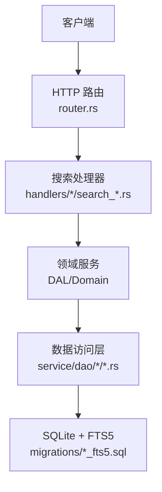
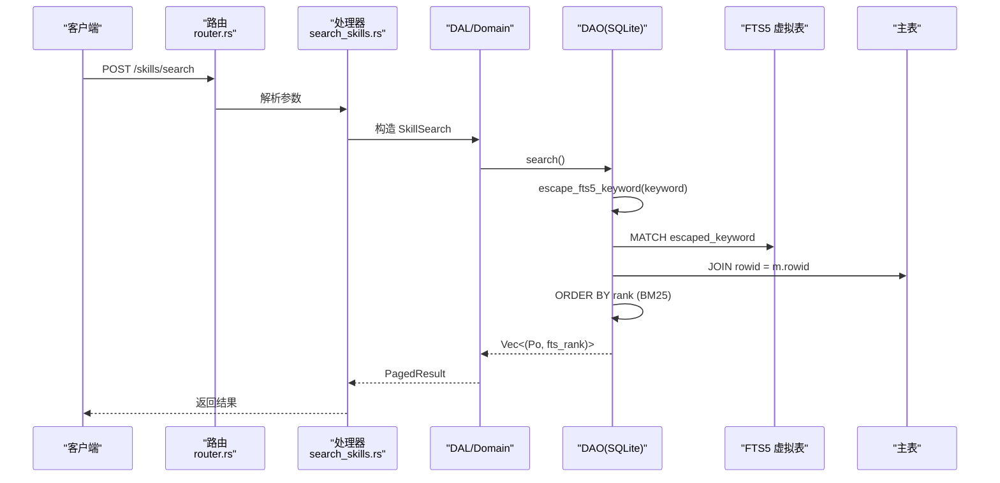
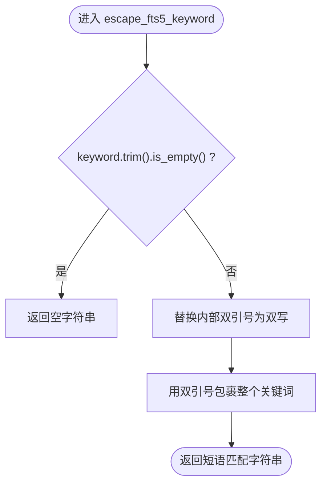
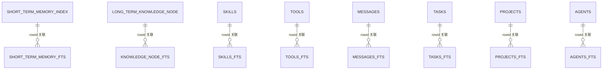
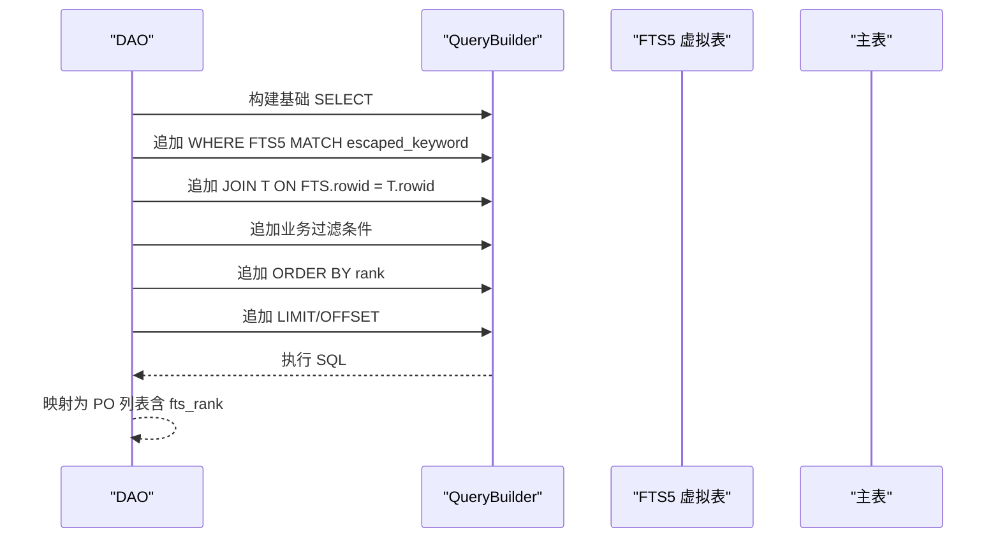
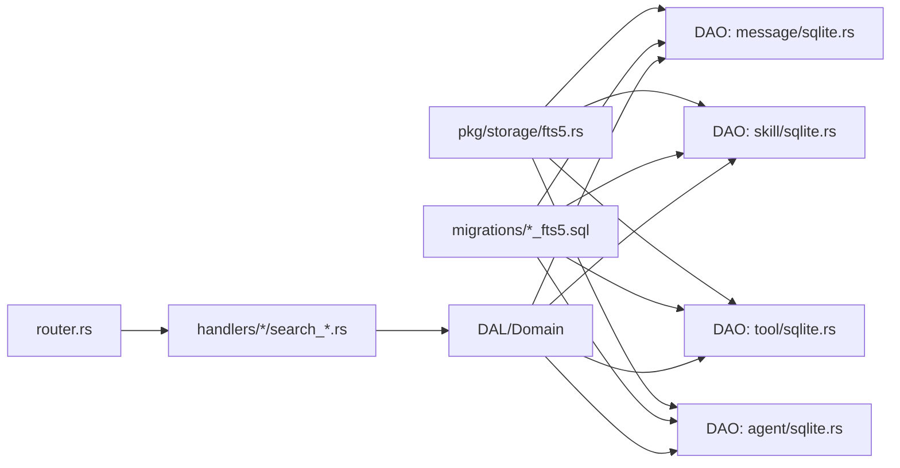

# FTS5 关键词搜索

<cite>
**本文引用的文件**
- [fts5.rs](src/pkg/storage/fts5.rs)
- [20260712000000_memory_fts5.sql](migrations/20260712000000_memory_fts5.sql)
- [20260712000001_entity_fts5.sql](migrations/20260712000001_entity_fts5.sql)
- [sqlite.rs（消息 DAO）](src/service/dao/message/sqlite.rs)
- [sqlite.rs（技能 DAO）](src/service/dao/skill/sqlite.rs)
- [sqlite.rs（工具 DAO）](src/service/dao/tool/sqlite.rs)
- [sqlite.rs（Agent DAO）](src/service/dao/agent/sqlite.rs)
- [vector.rs（模型与匹配信息）](src/models/vector.rs)
- [search_skills.rs（Handler）](src/handlers/hr/skill/search_skills.rs)
- [router.rs（路由注册）](src/router.rs)
</cite>

## 目录
1. [简介](#简介)
2. [项目结构](#项目结构)
3. [核心组件](#核心组件)
4. [架构总览](#架构总览)
5. [详细组件分析](#详细组件分析)
6. [依赖关系分析](#依赖关系分析)
7. [性能考量](#性能考量)
8. [故障排查指南](#故障排查指南)
9. [结论](#结论)
10. [附录：API 使用示例](#附录api-使用示例)

## 简介
本技术文档围绕 SQLite FTS5 全文搜索在本项目中的落地实现，系统性说明倒排索引构建、MATCH 查询语法、短语匹配策略、关键词转义函数 escape_fts5_keyword 的实现逻辑，以及 FTS5 表的创建与维护机制。同时给出各实体的搜索 API 调用方式、相关性排序、分页处理、缓存与监控调优建议，帮助读者快速掌握并高效使用 FTS5 关键词搜索能力。

## 项目结构
本项目采用四层单向调用：Adapter（HTTP Handler / AOP Producer）→ Domain → DAL → DAO。FTS5 相关能力主要分布在以下位置：
- 通用工具：src/pkg/storage/fts5.rs（escape_fts5_keyword）
- 数据层：migrations/*_fts5.sql（FTS5 虚拟表与触发器）、DAO 层 SQL（QueryBuilder 拼接 MATCH + JOIN + BM25）
- 领域与接口：Domain/DAL 组合向量与关键词混合搜索；Handler 暴露 HTTP 接口
- 路由：router.rs 注册搜索接口

图表来源
- [router.rs:329-401](src/router.rs#L329-L401)
- [search_skills.rs:14-49](src/handlers/hr/skill/search_skills.rs#L14-L49)
- [sqlite.rs（消息 DAO）:430-527](src/service/dao/message/sqlite.rs#L430-L527)
- [20260712000001_entity_fts5.sql:18-66](migrations/20260712000001_entity_fts5.sql#L18-L66)

章节来源
- [router.rs:329-401](src/router.rs#L329-L401)
- [search_skills.rs:14-49](src/handlers/hr/skill/search_skills.rs#L14-L49)

## 核心组件
- FTS5 关键词转义工具：escape_fts5_keyword，负责将用户输入安全地封装为 FTS5 短语匹配字符串，避免空格被解释为 AND，并对双引号等特殊字符进行转义。
- FTS5 虚拟表与触发器：通过迁移脚本为多张主表建立 FTS5 虚拟表，并使用 INSERT/UPDATE/DELETE 触发器自动维护索引一致性。
- DAO 层搜索实现：基于 QueryBuilder 动态拼装 MATCH + JOIN + BM25 排序的 SQL，支持业务过滤条件与分页。
- 搜索结果包装：SearchMatchInfo 携带 fts_rank（BM25 相关性评分），用于前端展示与排序参考。

章节来源
- [fts5.rs:6-18](src/pkg/storage/fts5.rs#L6-L18)
- [20260712000000_memory_fts5.sql:12-92](migrations/20260712000000_memory_fts5.sql#L12-L92)
- [20260712000001_entity_fts5.sql:14-246](migrations/20260712000001_entity_fts5.sql#L14-L246)
- [sqlite.rs（消息 DAO）:430-527](src/service/dao/message/sqlite.rs#L430-L527)
- [vector.rs:120-125](src/models/vector.rs#L120-L125)

## 架构总览
下图展示了从请求到数据库检索的关键路径，包括关键词转义、FTS5 MATCH、JOIN 主表、BM25 排序与分页。

图表来源
- [router.rs:329-401](src/router.rs#L329-L401)
- [search_skills.rs:14-49](src/handlers/hr/skill/search_skills.rs#L14-L49)
- [sqlite.rs（技能 DAO）:335-363](src/service/dao/skill/sqlite.rs#L335-L363)
- [fts5.rs:6-18](src/pkg/storage/fts5.rs#L6-L18)

## 详细组件分析

### 关键词转义函数 escape_fts5_keyword
- 功能：将用户输入的关键词转义后以双引号包裹，作为 FTS5 短语匹配（phrase match），避免空格被解释为 AND 操作符。
- 特殊字符处理：内部双引号会被双写转义，确保在 FTS5 中正确解析。
- 空值处理：空或仅空白字符串直接返回空串，避免后续 MATCH 报错。
- 适用场景：所有实体搜索入口统一使用该函数，保证语义一致性与安全性。

图表来源
- [fts5.rs:6-18](src/pkg/storage/fts5.rs#L6-L18)

章节来源
- [fts5.rs:6-18](src/pkg/storage/fts5.rs#L6-L18)

### FTS5 表创建与维护
- 虚拟表定义：为记忆与实体分别创建 FTS5 虚拟表，指定索引列与分词器 trigram（支持中文/英文混合）。
- 触发器同步：对每张主表定义 AFTER INSERT/UPDATE/DELETE 触发器，保持 FTS5 与主表数据一致。
- 存量回填：迁移时执行 INSERT INTO fts SELECT ... FROM main_table，完成历史数据索引构建。
- 设计要点：
  - 主表为 STRICT 且未声明 WITHOUT ROWID，因此具有隐式 rowid；FTS5 虚拟表自带 rowid，通过 rowid 关联。
  - DELETE/UPDATE 触发器使用 DELETE FROM fts WHERE rowid = old.rowid，避免使用 FTS5 的 'delete' 特殊命令导致值不匹配错误。

图表来源
- [20260712000000_memory_fts5.sql:12-92](migrations/20260712000000_memory_fts5.sql#L12-L92)
- [20260712000001_entity_fts5.sql:14-246](migrations/20260712000001_entity_fts5.sql#L14-L246)

章节来源
- [20260712000000_memory_fts5.sql:12-92](migrations/20260712000000_memory_fts5.sql#L12-L92)
- [20260712000001_entity_fts5.sql:14-246](migrations/20260712000001_entity_fts5.sql#L14-L246)

### 搜索实现与 MATCH 查询
- 统一模式：DAO 层使用 QueryBuilder 动态拼装 SQL，核心步骤如下：
  - 使用 escape_fts5_keyword 生成短语匹配字符串
  - 构造 FTS5 MATCH 条件，左侧必须使用完整表名（非别名）
  - JOIN 主表获取业务字段
  - 附加业务过滤条件（如状态、组织、任务等）
  - ORDER BY rank（BM25 相关性排序，越小越相关）
  - LIMIT/OFFSET 分页
- 典型实现：
  - 消息搜索：messages_fts MATCH + JOIN messages，按 status 过滤，ORDER BY rank，LIMIT
  - 技能搜索：skills_fts MATCH + JOIN skills，复用 push_query_filters，限制最大返回数量
  - 工具搜索：tools_fts MATCH + JOIN tools，可选 INNER JOIN agent_tools 按 agent_id 过滤
  - Agent 搜索：agents_fts MATCH + JOIN agents，支持 ids/status 等业务过滤

图表来源
- [sqlite.rs（消息 DAO）:430-527](src/service/dao/message/sqlite.rs#L430-L527)
- [sqlite.rs（技能 DAO）:335-363](src/service/dao/skill/sqlite.rs#L335-L363)
- [sqlite.rs（工具 DAO）:402-453](src/service/dao/tool/sqlite.rs#L402-L453)
- [sqlite.rs（Agent DAO）:155-186](src/service/dao/agent/sqlite.rs#L155-L186)

章节来源
- [sqlite.rs（消息 DAO）:430-527](src/service/dao/message/sqlite.rs#L430-L527)
- [sqlite.rs（技能 DAO）:335-363](src/service/dao/skill/sqlite.rs#L335-L363)
- [sqlite.rs（工具 DAO）:402-453](src/service/dao/tool/sqlite.rs#L402-L453)
- [sqlite.rs（Agent DAO）:155-186](src/service/dao/agent/sqlite.rs#L155-L186)

### 相关性排序与分页
- 相关性排序：FTS5 的 rank 字段由 BM25 算法计算，越小越相关；DAO 层统一 ORDER BY rank。
- 分页处理：
  - 默认 limit 与上限控制：例如技能搜索限制最大返回数量为 20，防止关键词失控返回全量结果。
  - offset 支持：根据 filters.pagination.offset 动态追加 OFFSET。
- 结果包装：SearchMatchInfo 包含 fts_rank，便于上层进行排序与展示。

章节来源
- [sqlite.rs（技能 DAO）:335-363](src/service/dao/skill/sqlite.rs#L335-L363)
- [sqlite.rs（工具 DAO）:429-453](src/service/dao/tool/sqlite.rs#L429-L453)
- [vector.rs:120-125](src/models/vector.rs#L120-L125)

### 增量更新与批量重建
- 增量更新：通过触发器自动维护 FTS5 索引，主表 INSERT/UPDATE/DELETE 时自动同步 FTS5 虚拟表，无需应用层干预。
- 批量重建：迁移脚本中包含存量数据回填（INSERT INTO fts SELECT ... FROM main_table），用于首次建索引或大规模修复。
- 注意事项：
  - 使用 DELETE FROM fts WHERE rowid = old.rowid 而非 FTS5 的 'delete' 特殊命令，避免值不匹配导致的 SQL logic error。
  - 对于大表重建，建议在低峰期执行，并结合事务与批处理优化。

章节来源
- [20260712000000_memory_fts5.sql:32-92](migrations/20260712000000_memory_fts5.sql#L32-L92)
- [20260712000001_entity_fts5.sql:68-246](migrations/20260712000001_entity_fts5.sql#L68-L246)

### 缓存机制
- 当前代码未显式实现 FTS5 查询结果的缓存层。如需提升热点查询性能，可在 DAL 层引入内存缓存（如 LRU）或 Redis 缓存，结合 key 设计（keyword + filters + page）与过期策略。
- 注意：缓存需考虑数据一致性，当主表变更时应失效对应缓存。

[本节为概念性内容，无直接文件引用]

## 依赖关系分析
- 模块耦合：
  - escape_fts5_keyword 位于 pkg/storage，供多个 DAO 复用，避免 DAO 间互相依赖。
  - DAO 层依赖 FTS5 虚拟表与触发器（由 migrations 管理），并通过 QueryBuilder 动态拼装 SQL。
  - Handler 与路由解耦，仅关注参数解析与响应转换。
- 外部依赖：
  - SQLite 引擎与 FTS5 扩展
  - sqlx 驱动与 QueryBuilder
  - trigram 分词器（SQLite 内置）

图表来源
- [fts5.rs:6-18](src/pkg/storage/fts5.rs#L6-L18)
- [sqlite.rs（消息 DAO）:430-527](src/service/dao/message/sqlite.rs#L430-L527)
- [sqlite.rs（技能 DAO）:335-363](src/service/dao/skill/sqlite.rs#L335-L363)
- [sqlite.rs（工具 DAO）:402-453](src/service/dao/tool/sqlite.rs#L402-L453)
- [sqlite.rs（Agent DAO）:155-186](src/service/dao/agent/sqlite.rs#L155-L186)
- [router.rs:329-401](src/router.rs#L329-L401)

章节来源
- [fts5.rs:6-18](src/pkg/storage/fts5.rs#L6-L18)
- [router.rs:329-401](src/router.rs#L329-L401)

## 性能考量
- 分词器选择：trigram 适合中英文混合文本，但会产生更多子串匹配，需注意索引大小与查询开销。
- 查询优化：
  - 使用短语匹配（escape_fts5_keyword）提高精确度，减少误命中。
  - 合理设置 LIMIT，避免全表扫描；技能搜索限制最大返回数量为 20。
  - 使用 ORDER BY rank 利用 FTS5 内置相关性排序。
- 索引维护：
  - 触发器自动维护，写入时有一定开销；高写入场景可评估异步重建或批量合并。
  - 存量回填建议在低峰期执行，分批提交以减少锁竞争。
- 监控指标：
  - 记录每次搜索的 keyword、filters、limit、offset、耗时、命中数、fts_rank 分布。
  - 关注慢查询日志，定位长尾关键词或过大结果集。
- 调优参数：
  - 调整 limit 上限与默认值，平衡用户体验与性能。
  - 针对高频实体可增加索引列权重（FTS5 不支持权重，可通过拆分列或业务过滤替代）。

[本节为通用指导，无直接文件引用]

## 故障排查指南
- 常见错误：
  - MATCH 空字符串：DAO 层在空关键词时直接返回空结果，避免 FTS5 报错。
  - 别名误用：MATCH 左侧必须使用完整表名（非别名），否则 SQLite 会将别名解释为列名。
  - 触发器删除命令：使用 DELETE FROM fts WHERE rowid = old.rowid，避免 'delete' 特殊命令值不匹配。
- 排查步骤：
  - 检查 escape_fts5_keyword 输出是否符合预期（双引号包裹、内部双引号双写）。
  - 验证 SQL 中 MATCH 左侧是否为完整表名。
  - 查看触发器是否存在，确认 FTS5 与主表 rowid 关联正确。
  - 检查分页参数是否合理，避免 OFFSET 过大导致性能问题。
- 日志与监控：
  - 在 DAO 层记录关键 SQL 与参数（脱敏），配合慢查询日志定位问题。
  - 统计不同 keyword 的命中率与平均 rank，识别异常查询。

章节来源
- [sqlite.rs（消息 DAO）:440-458](src/service/dao/message/sqlite.rs#L440-L458)
- [20260712000001_entity_fts5.sql:6-10](migrations/20260712000001_entity_fts5.sql#L6-L10)

## 结论
本项目通过统一的 escape_fts5_keyword 与标准化的 DAO 层搜索实现，结合 FTS5 虚拟表与触发器，实现了稳定高效的关键词搜索能力。BM25 相关性排序与分页控制保障了结果质量与性能。未来可在此基础上引入缓存、更精细的监控与调优策略，进一步提升搜索体验。

[本节为总结性内容，无直接文件引用]

## 附录：API 使用示例
以下为典型搜索接口的调用方式与参数说明（基于现有 Handler 与路由）：

- 技能搜索
  - 方法：POST /skills/search
  - 请求体：SearchSkillsRequest（包含 keyword、ids、status、category、author_id、parent_skill_id、tags、pagination 等）
  - 行为：keyword 经 escape_fts5_keyword 转义后执行 FTS5 MATCH，JOIN skills 主表，ORDER BY rank，LIMIT/OFFSET 分页
  - 参考实现：
    - [search_skills.rs:14-49](src/handlers/hr/skill/search_skills.rs#L14-L49)
    - [router.rs:357-366](src/router.rs#L357-L366)
    - [sqlite.rs（技能 DAO）:335-363](src/service/dao/skill/sqlite.rs#L335-L363)

- 消息搜索
  - 方法：POST /finance/messages/search（根据路由与 Handler 命名推断）
  - 请求体：MessageSearch（keyword、query_vector、top_k、filters）
  - 行为：keyword 转义后 MATCH messages_fts，JOIN messages，按 status 过滤，ORDER BY rank，LIMIT
  - 参考实现：
    - [sqlite.rs（消息 DAO）:430-527](src/service/dao/message/sqlite.rs#L430-L527)

- 工具搜索
  - 方法：POST /finance/tools/search（根据路由与 Handler 命名推断）
  - 请求体：ToolSearch（keyword、filters）
  - 行为：keyword 转义后 MATCH tools_fts，JOIN tools，可选 INNER JOIN agent_tools 按 agent_id 过滤，ORDER BY rank，LIMIT/OFFSET
  - 参考实现：
    - [sqlite.rs（工具 DAO）:402-453](src/service/dao/tool/sqlite.rs#L402-L453)

- Agent 搜索
  - 方法：POST /hr/agents/search（根据路由与 Handler 命名推断）
  - 请求体：AgentSearch（keyword、filters）
  - 行为：keyword 转义后 MATCH agents_fts，JOIN agents，支持 ids/status 过滤，ORDER BY rank
  - 参考实现：
    - [sqlite.rs（Agent DAO）:155-186](src/service/dao/agent/sqlite.rs#L155-L186)

章节来源
- [search_skills.rs:14-49](src/handlers/hr/skill/search_skills.rs#L14-L49)
- [router.rs:357-366](src/router.rs#L357-L366)
- [sqlite.rs（消息 DAO）:430-527](src/service/dao/message/sqlite.rs#L430-L527)
- [sqlite.rs（技能 DAO）:335-363](src/service/dao/skill/sqlite.rs#L335-L363)
- [sqlite.rs（工具 DAO）:402-453](src/service/dao/tool/sqlite.rs#L402-L453)
- [sqlite.rs（Agent DAO）:155-186](src/service/dao/agent/sqlite.rs#L155-L186)