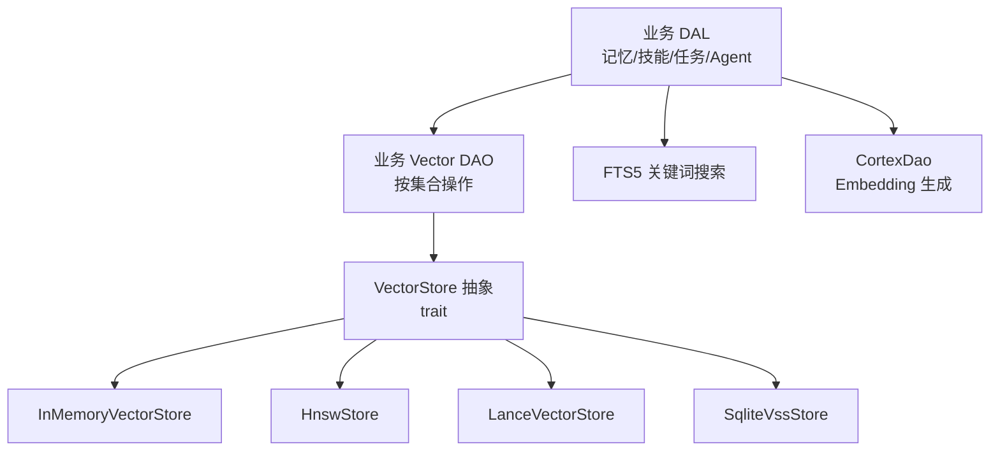
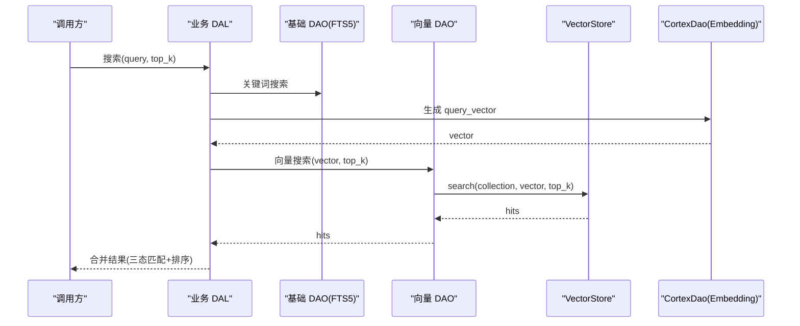
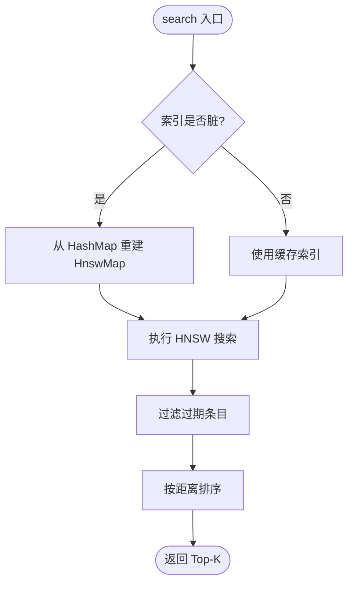
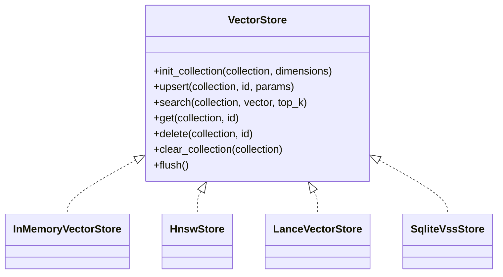
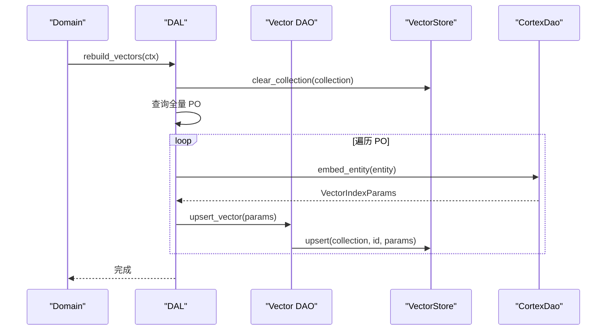
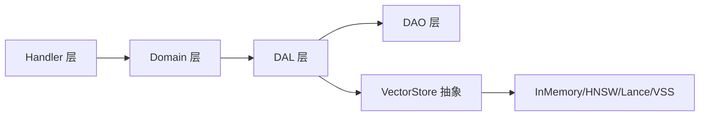

# 向量语义搜索

<cite>
**本文引用的文件**
- [vector_search_architecture.md](docs/vector_search_architecture.md)
- [hnsw.rs](src/pkg/storage/hnsw.rs)
- [lance.rs](src/pkg/storage/lance.rs)
- [mem_vector.rs](src/pkg/storage/mem_vector.rs)
- [vector.rs](src/pkg/storage/vector.rs)
- [mod.rs](src/pkg/storage/mod.rs)
- [vector.rs](src/models/vector.rs)
- [provider.rs](common/src/enums/provider.rs)
- [model_provider.rs](src/service/domain/finance/model_provider.rs)
- [memory.rs](src/service/dal/memory.rs)
- [skill.rs](src/service/dal/skill.rs)
- [task.rs](src/service/dal/task.rs)
- [agent.rs](src/service/dal/agent.rs)
- [create_model_provider.rs](src/handlers/finance/model_provider/create_model_provider.rs)
- [initialize_system.rs](src/handlers/organization/initialize_system.rs)
</cite>

## 目录
1. [简介](#简介)
2. [项目结构](#项目结构)
3. [核心组件](#核心组件)
4. [架构总览](#架构总览)
5. [详细组件分析](#详细组件分析)
6. [依赖关系分析](#依赖关系分析)
7. [性能与调优](#性能与调优)
8. [故障排查](#故障排查)
9. [结论](#结论)
10. [附录：API 使用示例](#附录api-使用示例)

## 简介
本技术文档围绕向量语义搜索能力，系统阐述向量嵌入的生成原理、HNSW 算法实现与应用、向量存储的内存管理与持久化机制、索引构建与重建流程、以及搜索 API 的使用方式。同时给出监控指标、调优参数、内存优化和故障排查方法，帮助读者在生产环境中高效部署与运维向量检索服务。

## 项目结构
向量搜索在项目中采用“通用存储抽象 + 多后端实现”的分层设计：
- 存储抽象层：定义统一的 VectorStore trait，屏蔽底层差异（InMemory/HNSW/LanceDB/SQLite VSS）。
- 业务 DAO/DAL：按实体维度组织向量索引生命周期（创建/更新/删除/重建），并组合关键词搜索与向量搜索形成混合检索。
- 模型提供商：通过 ModelProvider 管理 Embedding 模型，支持唯一性约束与切换重建。

图表来源
- [vector.rs:18-74](src/pkg/storage/vector.rs#L18-L74)
- [mod.rs:78-93](src/pkg/storage/mod.rs#L78-L93)
- [memory.rs:1392-1422](src/service/dal/memory.rs#L1392-L1422)

章节来源
- [vector_search_architecture.md:11-56](docs/vector_search_architecture.md#L11-L56)
- [mod.rs:78-93](src/pkg/storage/mod.rs#L78-L93)

## 核心组件
- 向量数据结构与可向量化接口：统一描述向量行、元数据、搜索结果、索引参数，并提供 Vectorizable trait 让实体自描述参与向量化的字段与过期策略。
- 存储抽象与后端实现：VectorStore trait 提供 init_collection/upsert/search/get/delete/clear_collection/flush 等统一接口；具体实现包括 InMemoryVectorStore、HnswStore、LanceVectorStore、SqliteVssStore。
- 模型提供商与唯一性约束：ModelProvider 支持 Agent/Embedding 能力区分，Domain 层保证同一时刻仅一个 Embedding Provider 启用，并提供 switch 接口进行原子切换与重建。
- 业务 DAL 编排：DAL 层负责组合基础 DAO（FTS5）与 Vector DAO（向量），实现混合搜索与索引生命周期管理（创建/更新/删除/重建）。

章节来源
- [vector.rs:9-168](src/models/vector.rs#L9-L168)
- [vector.rs:18-74](src/pkg/storage/vector.rs#L18-L74)
- [provider.rs:9-45](common/src/enums/provider.rs#L9-L45)
- [model_provider.rs:54-82](src/service/domain/finance/model_provider.rs#L54-L82)

## 架构总览
向量搜索作为“语义索引附加层”，与 FTS5 关键词搜索解耦，通过 ID 关联业务数据，不破坏现有表结构。DAL 层统一实现 search()，内部执行：
- FTS5 关键词搜索（Base Dao）
- 向量语义搜索（Vector Dao）
- 结果合并与三态匹配（Hybrid/Vector/Keyword）排序

图表来源
- [memory.rs:1111-1147](src/service/dal/memory.rs#L1111-L1147)
- [vector.rs:38-43](src/pkg/storage/vector.rs#L38-L43)

章节来源
- [vector_search_architecture.md:72-131](docs/vector_search_architecture.md#L72-L131)

## 详细组件分析

### 向量嵌入生成原理
- 模型选择：通过 ModelProvider 配置 Embedding 类型（FastEmbed、OpenAI兼容、DoubaoVision 等），由 CortexDao 调用对应 provider 的 /embeddings 或 /embeddings/multimodal 接口。
- 维度设置：由所选模型决定，不同模型输出维度不同（如 384/768/1536），需确保同一时刻仅一个 Embedding Provider 启用以避免维度不一致。
- 归一化处理：距离计算采用余弦相似度（1 - cos(θ)），对零向量返回最大距离，避免除零错误。

章节来源
- [openai.rs:46-59](src/service/dao/cortex/native/openai.rs#L46-L59)
- [provider.rs:9-45](common/src/enums/provider.rs#L9-L45)
- [hnsw.rs:24-33](src/pkg/storage/hnsw.rs#L24-L33)
- [mem_vector.rs:103-117](src/pkg/storage/mem_vector.rs#L103-L117)

### HNSW 算法的实现与应用
- 图结构构建：基于 instant-distance 库，每个 collection 独立维护 HnswMap；由于不支持增量插入，采用 lazy rebuild 策略（写入时标记 dirty，搜索时按需重建）。
- 邻居选择策略：自定义 FloatPoint 实现 Point trait，使用余弦距离；Search::default() 控制搜索过程。
- 精度与性能平衡：通过 top_k 控制返回数量；dirty flag 减少不必要的重建；后台定时落盘保障持久化。

图表来源
- [hnsw.rs:24-33](src/pkg/storage/hnsw.rs#L24-L33)
- [hnsw.rs:512-543](src/pkg/storage/hnsw.rs#L512-L543)

章节来源
- [vector_search_architecture.md:427-436](docs/vector_search_architecture.md#L427-L436)
- [hnsw.rs:1-554](src/pkg/storage/hnsw.rs#L1-L554)

### 向量存储的内存管理与持久化
- InMemoryVectorStore：纯 Rust 内存实现，懒加载持久化到 .bin 文件（bincode 序列化），异步保存不阻塞调用。
- HnswStore：内存驻留 + 持久化支持，后台 60s 定时扫描 dirty flag 落盘，Drop 兜底；冷启动扫描目录加载已有索引。
- LanceVectorStore：嵌入式列式存储，单文件持久化，内置 HNSW 索引，支持百万级向量快速检索。
- SqliteVssStore：基于 SQLite VSS 扩展，元数据与向量分离存储，查询时 JOIN 获取结果。

图表来源
- [vector.rs:18-74](src/pkg/storage/vector.rs#L18-L74)
- [mem_vector.rs:18-101](src/pkg/storage/mem_vector.rs#L18-L101)
- [lance.rs:26-62](src/pkg/storage/lance.rs#L26-L62)
- [vector.rs:76-235](src/pkg/storage/vector.rs#L76-L235)

章节来源
- [vector_search_architecture.md:161-206](docs/vector_search_architecture.md#L161-L206)
- [mod.rs:78-93](src/pkg/storage/mod.rs#L78-L93)

### 向量索引构建流程与增量更新
- 构建时机：实体创建/更新时，DAL 层尝试生成 embedding 并 upsert 向量索引；失败则 warn 降级，不影响主流程。
- 增量更新：通过 content_hash 判断内容是否变化，未变化则跳过重新向量化。
- 重建机制：switch 接口触发全量重建，依次清空各 collection，查询全量 PO，逐条 embed + upsert；支持异步任务与进度查询。

图表来源
- [skill.rs:723-757](src/service/dal/skill.rs#L723-L757)
- [task.rs:723-757](src/service/dal/task.rs#L723-L757)
- [memory.rs:1392-1422](src/service/dal/memory.rs#L1392-L1422)

章节来源
- [vector_search_architecture.md:120-131](docs/vector_search_architecture.md#L120-L131)
- [model_provider.rs:121-148](src/service/domain/finance/model_provider.rs#L121-L148)

### 搜索 API 使用示例
- 相似度计算：通过 VectorStore.search 返回 VectorSearchHit，包含 row 与 distance（越小越相似）。
- Top-K 检索：调用 search(collection, query_vector, top_k) 指定返回数量。
- 批量查询：结合 list_by_source_ids 或业务层 batch_get 获取实体详情。
- 混合搜索：DAL 层组合 FTS5 与向量搜索结果，标记 match_type（Hybrid/Vector/Keyword）并排序。

章节来源
- [vector.rs:38-43](src/pkg/storage/vector.rs#L38-L43)
- [memory.rs:1111-1147](src/service/dal/memory.rs#L1111-L1147)

## 依赖关系分析
- 单向依赖：Adapter → Domain → DAL → DAO，禁止跨层调用与同层互调。
- 存储抽象：VectorStore trait 隔离后端差异，DAL 层通过 ctx.vector_store() 访问。
- 模型提供商：Domain 层校验唯一性，Handler 层暴露 create/update/switch 接口。

图表来源
- [mod.rs:78-93](src/pkg/storage/mod.rs#L78-L93)
- [model_provider.rs:54-82](src/service/domain/finance/model_provider.rs#L54-L82)

章节来源
- [vector_search_architecture.md:46-69](docs/vector_search_architecture.md#L46-L69)

## 性能与调优
- 索引选择：小数据集/测试用 InMemory；生产大数据集用 LanceDB；需要纯 Rust 且可持久化用 HNSW。
- 搜索参数：top_k 控制返回数量；HNSW 通过 lazy rebuild 减少重建开销。
- 内存优化：InMemory 异步持久化；HNSW 后台定时落盘；LanceDB 单文件列式存储。
- 监控指标：记录向量搜索耗时、命中率、重建任务进度、错误率。
- 调优建议：根据数据规模选择后端；合理设置 top_k；监控 Embedding API 调用频率与成本。

章节来源
- [vector_search_architecture.md:178-184](docs/vector_search_architecture.md#L178-L184)
- [hnsw.rs:1-9](src/pkg/storage/hnsw.rs#L1-L9)

## 故障排查
- 无可用 Embedding Provider：DAL 层 log_debug 跳过向量索引，降级为 FTS5 搜索。
- 向量索引写入失败：log_warn 降级，不影响主流程。
- 维度不一致：Domain 层校验唯一性，返回 409 提示切换。
- 重建冲突：并发控制防止重复重建，返回 409 RebuildInProgress。

章节来源
- [memory.rs:1392-1422](src/service/dal/memory.rs#L1392-L1422)
- [model_provider.rs:54-82](src/service/domain/finance/model_provider.rs#L54-L82)

## 结论
本项目实现了可扩展的向量语义搜索能力，通过统一抽象与多后端实现，支持灵活的生产部署。DAL 层编排混合搜索，Domain 层保证模型唯一性与切换安全，存储层提供高性能与持久化保障。通过合理的监控与调优，可在大规模数据下保持高可用与低延迟。

## 附录：API 使用示例
- 创建 Embedding Provider：POST /api/v1/finance/model-providers（create_model_provider.rs）
- 初始化系统时可选配置：POST /api/v1/system/initialize（initialize_system.rs）
- 切换 Embedding Provider：POST /api/v1/finance/model-providers/:id/switch（Domain 层编排重建）

章节来源
- [create_model_provider.rs:33-68](src/handlers/finance/model_provider/create_model_provider.rs#L33-L68)
- [initialize_system.rs:167-198](src/handlers/organization/initialize_system.rs#L167-L198)
- [model_provider.rs:121-148](src/service/domain/finance/model_provider.rs#L121-L148)