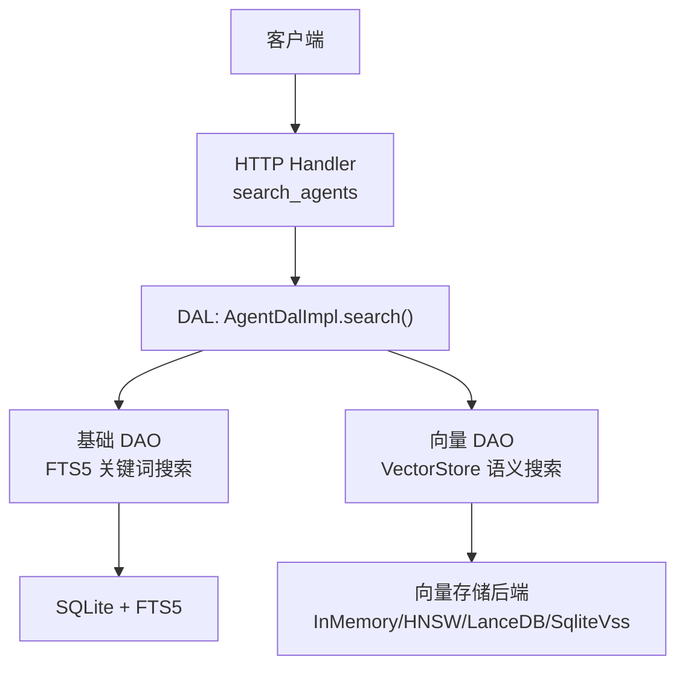
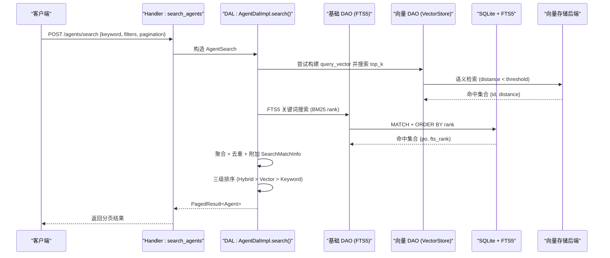
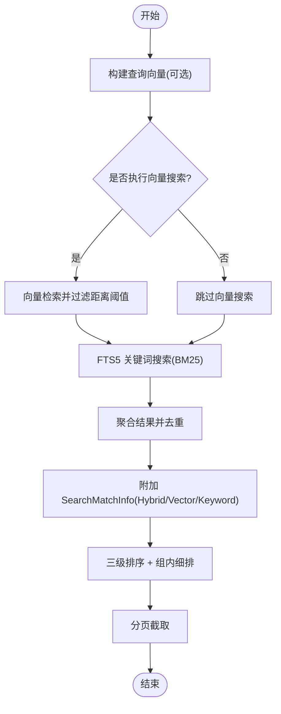
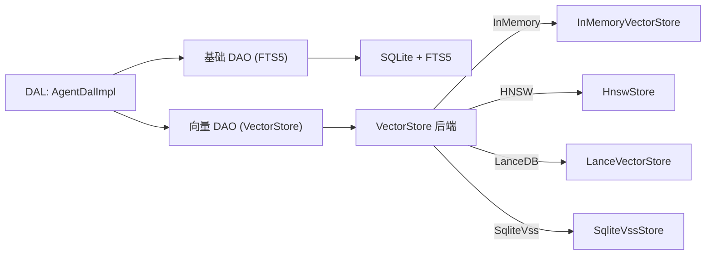

# 混合搜索引擎

<cite>
**本文引用的文件**
- [vector_search_architecture.md](docs/vector_search_architecture.md)
- [search_agents.rs](src/handlers/hr/agent/search_agents.rs)
- [agent.rs](src/service/dal/agent.rs)
- [vector.rs](src/models/vector.rs)
- [mod.rs（消息 DAO）](src/service/dao/message/mod.rs)
- [memory.rs](src/service/dal/memory.rs)
- [task.rs](src/service/dal/task.rs)
- [project.rs](src/service/dal/project.rs)
- [skill.rs](src/service/dal/skill.rs)
- [sqlite.rs（Agent DAO）](src/service/dao/agent/sqlite.rs)
- [sqlite.rs（Project DAO）](src/service/dao/project/sqlite.rs)
- [storage/mod.rs](src/pkg/storage/mod.rs)
- [2026-07-31-unify-agent-search-query.md](docs/superpowers/plans/2026-07-31-unify-agent-search-query.md)
- [entity_list_query_search_design.md](docs/entity_list_query_search_design.md)
- [checklist.md（记忆搜索增强）](docs/superpowers/specs/enhance-memory-search/checklist.md)
</cite>

## 目录
1. [简介](#简介)
2. [项目结构](#项目结构)
3. [核心组件](#核心组件)
4. [架构总览](#架构总览)
5. [详细组件分析](#详细组件分析)
6. [依赖关系分析](#依赖关系分析)
7. [性能与缓存](#性能与缓存)
8. [故障排查](#故障排查)
9. [结论](#结论)
10. [附录：API 使用示例与调优指南](#附录api-使用示例与调优指南)

## 简介
本技术文档面向“混合搜索引擎”，围绕关键词搜索、语义向量搜索以及图谱关联检索的融合策略展开，系统说明权重分配、结果合并、去重与排序机制；统一搜索接口设计（支持关键词、语义、图谱条件组合查询）；相关性评分模型（FTS5 BM25、向量相似度、图谱关联度）；并提供 API 使用示例、分页与缓存优化建议、监控与评估指标、调优最佳实践。

## 项目结构
本项目采用严格四层单向调用：Adapter（HTTP Handler / AOP Producer）→ Domain → DAL → DAO，禁止跨层调用与同层互调。搜索能力由以下层次协同实现：
- Adapter 层：HTTP Handler 接收请求并映射为统一的 Search 参数（如 AgentSearch）。
- Domain/DAL 层：组合基础 DAO（FTS5 关键词搜索）与向量 DAO（向量语义搜索），执行混合搜索、结果聚合、去重与排序。
- DAO 层：基础数据 DAO 负责 FTS5 全文检索；向量 DAO 封装向量存储抽象（VectorStore）进行语义检索。
- Storage 层：提供 FTS5 工具与多后端向量存储（InMemory/HNSW/LanceDB/SqliteVss）。

图表来源
- [search_agents.rs:1-68](src/handlers/hr/agent/search_agents.rs#L1-L68)
- [agent.rs:474-680](src/service/dal/agent.rs#L474-L680)
- [mod.rs（消息 DAO）:162-204](src/service/dao/message/mod.rs#L162-L204)
- [storage/mod.rs:56-122](src/pkg/storage/mod.rs#L56-L122)

章节来源
- [vector_search_architecture.md:1-56](docs/vector_search_architecture.md#L1-L56)
- [entity_list_query_search_design.md:1-25](docs/entity_list_query_search_design.md#L1-L25)

## 核心组件
- 三态匹配模型：Hybrid（双命中）、Vector（仅向量）、Keyword（仅关键词），用于标记每条结果的命中类型与排序优先级。
- 统一搜索参数：各实体通过 XxxSearch（含 keyword、filters、top_k、vector_distance_threshold 等）统一表达搜索意图。
- 向量索引生命周期：创建/更新/删除时维护向量索引，内容哈希避免重复向量化，失败降级不影响主流程。
- 存储门面：Storage 统一管理 SQLite 连接池与向量存储后端，支持配置化切换。

章节来源
- [vector.rs:94-125](src/models/vector.rs#L94-L125)
- [vector_search_architecture.md:120-131](docs/vector_search_architecture.md#L120-L131)
- [storage/mod.rs:56-122](src/pkg/storage/mod.rs#L56-L122)

## 架构总览
混合搜索在 DAL 层统一编排：先并行或顺序执行 FTS5 关键词搜索与向量语义搜索，再按三态匹配进行聚合、去重与综合排序，最终返回分页结果。

图表来源
- [search_agents.rs:15-68](src/handlers/hr/agent/search_agents.rs#L15-L68)
- [agent.rs:474-680](src/service/dal/agent.rs#L474-L680)
- [sqlite.rs（Agent DAO）:141-230](src/service/dao/agent/sqlite.rs#L141-L230)
- [storage/mod.rs:78-93](src/pkg/storage/mod.rs#L78-L93)

## 详细组件分析

### 混合搜索算法与排序策略
- 三态匹配：Hybrid（同时命中关键词与向量）、Vector（仅向量）、Keyword（仅关键词）。
- 排序规则：
  - 第一级：Hybrid > Vector > Keyword。
  - 组内细排：Hybrid/Vector 按 vector_distance 升序；Keyword 按 fts_rank 升序（BM25 越小越相关）。
- 去重：基于业务 ID 去重，避免同一实体被多次返回。
- 阈值过滤：可配置的 vector_distance_threshold 控制向量命中质量。

图表来源
- [agent.rs:474-680](src/service/dal/agent.rs#L474-L680)
- [checklist.md（记忆搜索增强）:38-59](docs/superpowers/specs/enhance-memory-search/checklist.md#L38-L59)

章节来源
- [agent.rs:594-680](src/service/dal/agent.rs#L594-L680)
- [checklist.md（记忆搜索增强）:38-59](docs/superpowers/specs/enhance-memory-search/checklist.md#L38-L59)

### 统一搜索接口设计
- 三场景规范：
  - list：默认列表（GET，仅分页）。
  - query：条件过滤（POST，完整过滤条件）。
  - search：关键词搜索（POST，FTS5 + 向量混合搜索，复用 query 的过滤条件）。
- 统一返回：PagedResult<T>，包含 items 与 total，支持分页。
- 最大结果限制：搜索场景限制 MAX_SEARCH_RESULTS = 20，避免关键词失控导致性能浪费。

章节来源
- [entity_list_query_search_design.md:8-25](docs/entity_list_query_search_design.md#L8-L25)
- [2026-07-31-unify-agent-search-query.md:28-44](docs/superpowers/plans/2026-07-31-unify-agent-search-query.md#L28-L44)
- [2026-07-31-unify-agent-search-query.md:131-155](docs/superpowers/plans/2026-07-31-unify-agent-search-query.md#L131-L155)

### 相关性评分计算模型
- FTS5 BM25：关键词命中携带 fts_rank（越小越相关），用于 Keyword 组内排序。
- 向量相似度：distance（越小越相似），用于 Hybrid/Vector 组内排序。
- 图谱关联度：当前实现以 ID 关联为主，图谱关联检索可通过知识节点与引用关系扩展（见 Memory 领域）。
- 综合评分：DAL 层不直接做加权打分，而是通过三态匹配与组内细排实现“软加权”效果；如需硬加权可在上层扩展。

章节来源
- [vector.rs:106-125](src/models/vector.rs#L106-L125)
- [agent.rs:631-680](src/service/dal/agent.rs#L631-L680)
- [memory.rs:1190-1222](src/service/dal/memory.rs#L1190-L1222)

### 结果合并与去重处理逻辑
- 合并策略：将 FTS5 与向量搜索结果按业务 ID 聚合，缺失的实体通过批量查询补齐，避免 N+1。
- 去重：对聚合后的 PO 列表按 id 排序并去重，确保唯一性。
- 元信息注入：根据命中情况注入 SearchMatchInfo（match_type、vector_distance、fts_rank 等）。

章节来源
- [agent.rs:563-593](src/service/dal/agent.rs#L563-L593)
- [skill.rs:351-385](src/service/dal/skill.rs#L351-L385)
- [project.rs:502-525](src/service/dal/project.rs#L502-L525)

### 向量索引生命周期与降级
- 触发式非全量索引：由各业务 DAL 决定何时索引、索引哪些字段、使用何种模型与维度。
- 降级策略：向量化失败或向量搜索不可用时，降级到纯关键词搜索，不影响主流程。
- 内容哈希：通过 content_hash 判断是否需要重索引，避免重复 Embedding 调用。

章节来源
- [vector_search_architecture.md:21-36](docs/vector_search_architecture.md#L21-L36)
- [task.rs:405-437](src/service/dal/task.rs#L405-L437)
- [memory.rs:1190-1222](src/service/dal/memory.rs#L1190-L1222)

## 依赖关系分析
- 分层解耦：DAO 层只做单一职责（基础数据 CRUD + FTS5；向量索引 CRUD），DAL 层组合两者实现混合搜索。
- 存储抽象：VectorStore trait 屏蔽后端差异（InMemory/HNSW/LanceDB/SqliteVss），上层零感知。
- 外部依赖：SQLite + FTS5（关键词搜索）、Embedding Provider（可选，用于生成查询向量）、向量存储后端（可配置）。

图表来源
- [storage/mod.rs:78-93](src/pkg/storage/mod.rs#L78-L93)
- [agent.rs:474-680](src/service/dal/agent.rs#L474-L680)

章节来源
- [vector_search_architecture.md:46-68](docs/vector_search_architecture.md#L46-L68)
- [storage/mod.rs:36-122](src/pkg/storage/mod.rs#L36-L122)

## 性能与缓存
- 分页与限制：
  - DAO 层 search 方法支持 LIMIT/OFFSET，限制 FTS5 结果数量（默认 20）。
  - DAL 层聚合后再次截断到 MAX_SEARCH_RESULTS，并在内存中完成最终分页。
- 批量获取：向量命中缺失的实体通过批量查询补齐，避免 N+1 问题。
- 存储后端选择：
  - InMemory：开发测试推荐，零系统依赖。
  - HNSW：高性能近似最近邻，支持持久化与 lazy rebuild。
  - LanceDB：生产级高性能嵌入式向量数据库。
  - SqliteVss：需系统依赖，向后兼容。
- 缓存优化建议：
  - 查询向量缓存：相同关键词可缓存 query_vector，减少重复 Embedding 调用。
  - 结果缓存：热点查询可按关键词+过滤条件缓存 PagedResult，设置合理 TTL。
  - 索引重建异步化：切换 Embedding Provider 时后台异步重建，避免阻塞。

章节来源
- [sqlite.rs（Agent DAO）:216-230](src/service/dao/agent/sqlite.rs#L216-L230)
- [sqlite.rs（Project DAO）:351-363](src/service/dao/project/sqlite.rs#L351-L363)
- [storage/mod.rs:78-93](src/pkg/storage/mod.rs#L78-L93)
- [vector_search_architecture.md:425-493](docs/vector_search_architecture.md#L425-L493)

## 故障排查
- 向量搜索失败：记录 warn 日志并降级到关键词搜索，确保主流程可用。
- 无 Embedding Provider：跳过向量搜索，仅走 FTS5 路径。
- 空关键词：FTS5 MATCH 空字符串会报错，DAO 层直接返回空结果。
- 性能问题：检查向量距离阈值、top_k、分页参数是否合理；确认存储后端是否适合数据规模。

章节来源
- [agent.rs:521-540](src/service/dal/agent.rs#L521-L540)
- [sqlite.rs（Agent DAO）:148-153](src/service/dao/agent/sqlite.rs#L148-L153)
- [task.rs:405-437](src/service/dal/task.rs#L405-L437)

## 结论
本混合搜索引擎通过 FTS5 关键词搜索与向量语义搜索的融合，结合三态匹配与综合排序，实现了高相关性、高可用性的检索能力。统一接口设计与分层解耦确保了可扩展性与可维护性。未来可进一步引入图谱关联度评分与更精细的加权策略，以满足复杂业务场景。

## 附录：API 使用示例与调优指南

### 统一搜索接口示例
- 搜索 Agent（POST /agents/search）：
  - 请求体：{ keyword, status, created_by, model_provider_id, roles, runtime_state, pagination }
  - 响应：PagedResult<AgentListItem>
  - 行为：keyword 存在时触发 FTS5 + 向量混合搜索；否则走 query 或 list 路径。

章节来源
- [search_agents.rs:15-68](src/handlers/hr/agent/search_agents.rs#L15-L68)
- [2026-07-31-unify-agent-search-query.md:28-44](docs/superpowers/plans/2026-07-31-unify-agent-search-query.md#L28-L44)

### 权重与阈值配置
- 向量距离阈值：vector_distance_threshold（默认 0.8），控制向量命中质量。
- 最大结果数：MAX_SEARCH_RESULTS = 20，防止关键词失控。
- 分页参数：limit/offset 在 DAO 层 SQL 限制，DAL 层最终分页。

章节来源
- [agent.rs:485-515](src/service/dal/agent.rs#L485-L515)
- [2026-07-31-unify-agent-search-query.md:131-155](docs/superpowers/plans/2026-07-31-unify-agent-search-query.md#L131-L155)

### 排序与分页
- 排序：Hybrid > Vector > Keyword；组内按 vector_distance 或 fts_rank 细排。
- 分页：DAO 层 LIMIT/OFFSET + DAL 层最终分页，返回 PagedResult。

章节来源
- [agent.rs:631-680](src/service/dal/agent.rs#L631-L680)
- [sqlite.rs（Agent DAO）:216-230](src/service/dao/agent/sqlite.rs#L216-L230)

### 监控与评估
- AOP 统计：通过 AopStatsCollector 收集事件发布/消费耗时与状态分布，提供毫秒级查询接口。
- 评估指标：命中率、平均响应时间、向量搜索成功率、FTS5 命中率、用户点击率（前端埋点）。
- A/B 测试：可基于不同权重/阈值分组，对比关键指标变化。

章节来源
- [2026-07-25-stats-charts-phase3.md:1786-1859](docs/superpowers/plans/2026-07-25-stats-charts-phase3.md#L1786-L1859)

### 调优最佳实践
- 选择合适的向量存储后端：小数据用 InMemory，大数据用 LanceDB，高性能需求用 HNSW。
- 合理设置阈值与 top_k：平衡召回率与性能。
- 避免重复向量化：利用 content_hash 判断是否需要重索引。
- 降级保障：向量搜索失败时自动降级到关键词搜索，确保可用性。

章节来源
- [vector_search_architecture.md:21-36](docs/vector_search_architecture.md#L21-L36)
- [storage/mod.rs:78-93](src/pkg/storage/mod.rs#L78-L93)
- [task.rs:405-437](src/service/dal/task.rs#L405-L437)