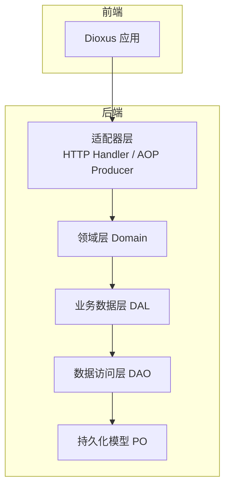
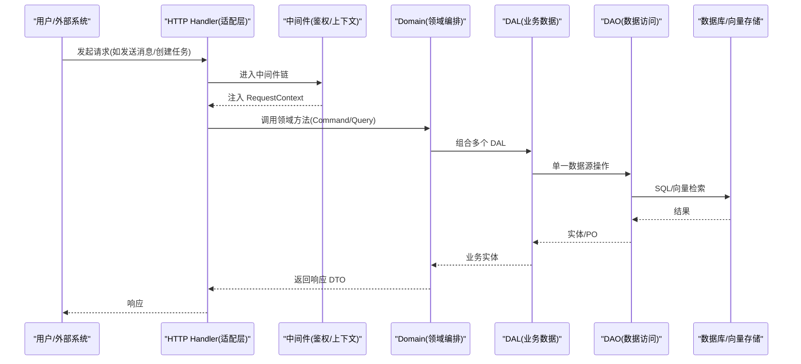
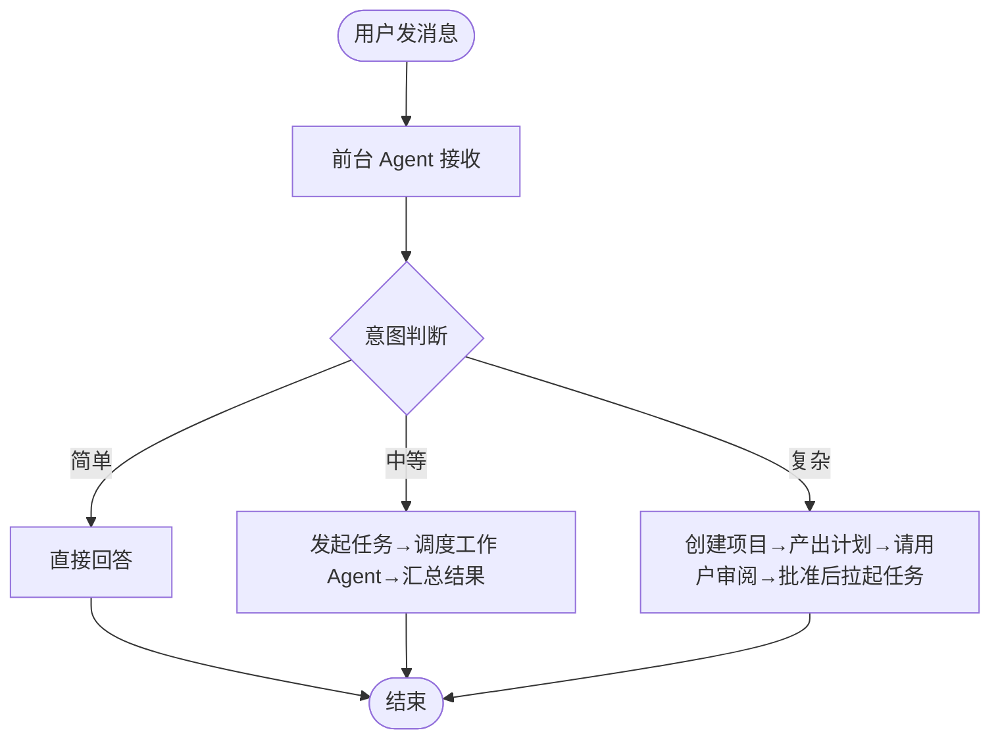
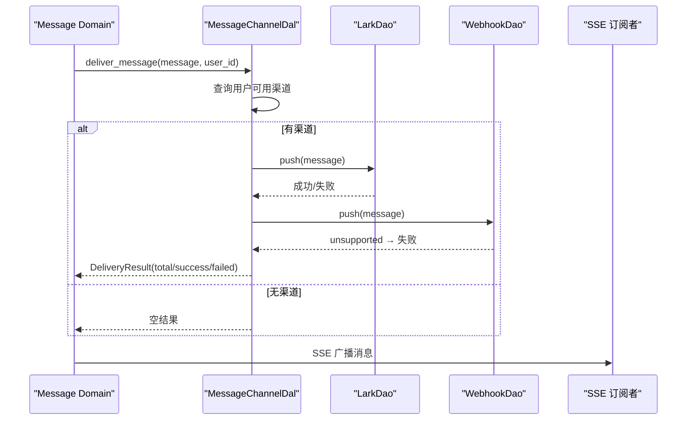
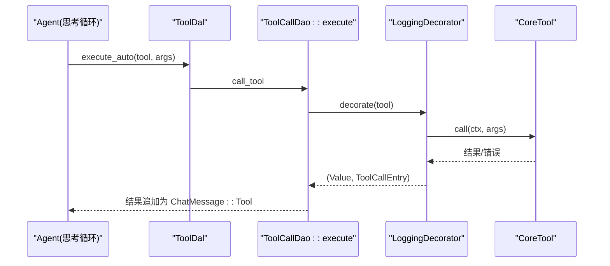
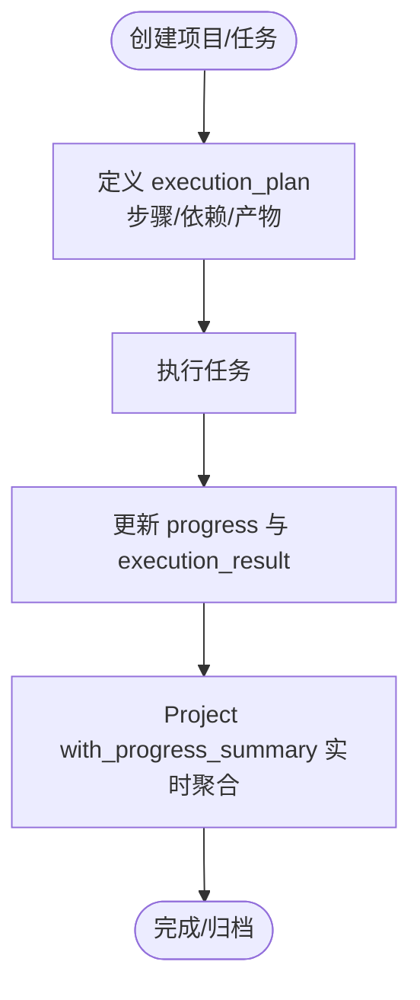
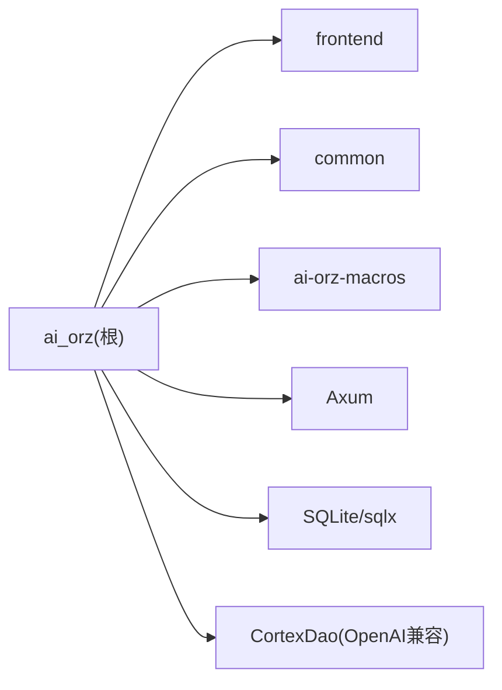

# 项目介绍与目标

<cite>
**本文引用的文件**   
- [README.md](README.md)
- [AGENTS.md](AGENTS.md)
- [ARCHITECTURE.md](docs/ARCHITECTURE.md)
- [message_interaction_design.md](docs/message_interaction_design.md)
- [message_channel_design.md](docs/message_channel_design.md)
- [tool_design.md](docs/tool_design.md)
- [project_management_design.md](docs/project_management_design.md)
- [external_agent_design.md](docs/external_agent_design.md)
- [Cargo.toml](Cargo.toml)
- [main.rs](src/main.rs)
</cite>

## 目录
1. [引言](#引言)
2. [项目结构](#项目结构)
3. [核心组件](#核心组件)
4. [架构总览](#架构总览)
5. [详细组件分析](#详细组件分析)
6. [依赖关系分析](#依赖关系分析)
7. [性能考量](#性能考量)
8. [故障排查指南](#故障排查指南)
9. [结论](#结论)
10. [附录](#附录)

## 引言
AI Orz 是一个“多 Agent 协作框架”，它的使命不是把 LLM 当作一次性函数调用，而是把 AI 代理当作长期角色来管理：每个 Agent 拥有身份、记忆、技能与工具，能在组织内像团队成员一样协作。它支持代理间消息通信、任务委派、记忆沉淀与工具调用，并通过多渠道接入（网页、飞书等）统一交互。与传统 chatbot 框架不同，AI Orz 定位为“AI 时代工作流平台”的底层：以严格分层、事件驱动、可观测与可扩展为核心，支撑复杂的多轮、多角色、跨系统的自动化流程。

- 愿景：将 Agent 以组织化形式管理，共同完成任务；通过组网实现更高级别的协作。
- 设计哲学：Agent 是自主主体，系统仅提供基础设施；所有中间过程可追溯；严格分层与适配层原则；人类可读的原始细节存储。
- 解决的问题：传统框架只关注单次对话；无法承载长期角色、团队协作、任务编排与记忆沉淀；缺乏统一的事件总线与工具治理。
- 预期价值：让多个 AI 代理像团队一样协作完成复杂任务，提供稳定、可观测、可扩展的工作流底座。

**章节来源**
- [README.md:13-25](README.md#L13-L25)
- [ARCHITECTURE.md:5-8](docs/ARCHITECTURE.md#L5-L8)
- [AGENTS.md:9-19](AGENTS.md#L9-L19)

## 项目结构
AI Orz 采用三层 cargo workspace：common（前后端共享）、ai-orz-macros（自定义宏）、后端服务与前端应用。后端遵循 Adapter → Domain → DAL → DAO 的严格单向依赖，启动分两阶段（单例注册 + 基础数据注入）。前端基于 Dioxus + Tailwind CSS + DaisyUI，提供丰富的管理与对话页面。

**图表来源**
- [ARCHITECTURE.md:11-46](docs/ARCHITECTURE.md#L11-L46)
- [AGENTS.md:148-186](AGENTS.md#L148-L186)

**章节来源**
- [README.md:99-123](README.md#L99-L123)
- [ARCHITECTURE.md:11-46](docs/ARCHITECTURE.md#L11-L46)
- [AGENTS.md:148-186](AGENTS.md#L148-L186)

## 核心组件
- 组织与用户权限：多级组织、角色继承、JWT Cookie 认证，RequestContext 自动注入当前用户与组织信息。
- Agent 全生命周期：创建、入职（自动安装工具包）、绑定工具、唤醒执行、休息沉淀。
- 记忆系统：四层记忆（Core/Working/Short-term/Long-term），FTS5 + 向量混合搜索，定时沉淀短期记忆到知识图谱。
- 消息与渠道：用户 ↔ Agent 双向对话，多渠道出站推送（飞书已上线），AOP 事件中心异步处理。
- 工具体系：统一工具调用架构（execute_auto / execute_manual），装饰器收敛日志追踪，internal 工具转发同步/异步调用。
- 任务与项目：项目聚合对话上下文，任务状态机与进度追踪，execution_plan/execution_result 显式记录。
- 外部 Agent 集成：完整 A2A 协议支持（Client/Server），Push 回调 + 轮询兜底双通道。
- 统计与监控：多维统计（Agent/Project/Task/Tool/ModelProvider），AOP 队列运行时监控。

**章节来源**
- [README.md:29-61](README.md#L29-L61)
- [AGENTS.md:19-78](AGENTS.md#L19-L78)
- [ARCHITECTURE.md:69-119](docs/ARCHITECTURE.md#L69-L119)

## 架构总览
AI Orz 的核心在于“Agent 作为长期角色”的协作框架。它以组织为单位管理多个 Agent，通过消息与事件驱动实现任务委派、工具调用与记忆沉淀。入口由 main.rs 启动，路由与中间件负责鉴权与上下文注入，Handler/Producer 作为适配层将外部输入转换为 Domain 方法调用，Domain 编排 DAL/DAO，最终落库或触发事件。

**图表来源**
- [main.rs:1-5](src/main.rs#L1-L5)
- [ARCHITECTURE.md:122-146](docs/ARCHITECTURE.md#L122-L146)
- [AGENTS.md:148-186](AGENTS.md#L148-L186)

**章节来源**
- [main.rs:1-5](src/main.rs#L1-L5)
- [ARCHITECTURE.md:122-146](docs/ARCHITECTURE.md#L122-L146)

## 详细组件分析

### 消息与协作：用户-Agent 双向对话
- 前台 Agent 接收用户消息，根据意图决策：简单问题直接回答；中等问题发起任务并调度工作 Agent；复杂问题先创建项目并产出计划，经用户审阅后再拉起任务。
- 消息消费通过 AOP 事件中心异步处理，更新状态、拼装目标 Agent、生成回复并 SSE 推送前端。

**图表来源**
- [message_interaction_design.md:1-24](docs/message_interaction_design.md#L1-L24)

**章节来源**
- [message_interaction_design.md:1-24](docs/message_interaction_design.md#L1-L24)
- [message_interaction_design.md:199-219](docs/message_interaction_design.md#L199-L219)

### 多渠道消息推送：出站分发与失败隔离
- 管理面暴露完整的 CRUD 接口，运行面按用户已启用渠道并发推送；各渠道独立 DAO，DAL 纯 match 分发，错误聚合不阻塞主流程。
- 飞书 P2P 私信已上线；Webhook 当前未实现，返回 unsupported_operation 并记录失败详情。

**图表来源**
- [message_channel_design.md:23-36](docs/message_channel_design.md#L23-L36)
- [message_channel_design.md:549-613](docs/message_channel_design.md#L549-L613)

**章节来源**
- [message_channel_design.md:23-36](docs/message_channel_design.md#L23-L36)
- [message_channel_design.md:549-613](docs/message_channel_design.md#L549-L613)

### 工具调用：Auto/Manual 混合模式与追踪
- Auto 模式：Awakening 循环中 LLM 主动调用的简单工具，走 execute_auto → call_tool → ToolCallDao::execute，装饰器记录日志。
- Manual 模式：关键工具走自建异步链路，通过 internal 工具转发 request_tool_call/send_tool_call_message，消费者执行后返回 ToolCallResult，再次唤醒 Agent。
- 所有调用汇聚到 ToolCallDao::execute，保证 trace_ref 强类型关联与日志完整性。

**图表来源**
- [tool_design.md:26-53](docs/tool_design.md#L26-L53)
- [tool_design.md:511-524](docs/tool_design.md#L511-L524)

**章节来源**
- [tool_design.md:26-53](docs/tool_design.md#L26-L53)
- [tool_design.md:511-524](docs/tool_design.md#L511-L524)

### 项目与任务：执行计划与进度追踪
- 项目聚合对话上下文，任务状态机与进度字段（0-100），complete 自动设 100，progress_updated 事件驱动更新。
- execution_plan/execution_result 显式记录步骤策略、依赖关系与实际产出，支持 DAG 与实时 progress summary。

**图表来源**
- [project_management_design.md:5-8](docs/project_management_design.md#L5-L8)
- [project_management_design.md:501-523](docs/project_management_design.md#L501-L523)

**章节来源**
- [project_management_design.md:5-8](docs/project_management_design.md#L5-L8)
- [project_management_design.md:501-523](docs/project_management_design.md#L501-L523)

### 外部 Agent 集成：A2A 协议与适配层原则
- 作为 Client：注册外部 Agent（CLI/Remote），通过 A2A 协议委派任务。
- 作为 Server：对外暴露 A2A 端点，Push 回调 + 30秒轮询兜底双通道。
- 适配层原则：Handler/回调/Producer 同属适配层，外部协议数据不进入事件中心，直接调用 Domain。

**章节来源**
- [README.md:43-46](README.md#L43-L46)
- [external_agent_design.md:137-150](docs/external_agent_design.md#L137-L150)

## 依赖关系分析
- 技术栈：Rust + Axum + SQLite + sqlx 0.8 + 原生 CortexDao（OpenAI 兼容）；前端 Dioxus 0.7 + Tailwind CSS v4 + DaisyUI v5。
- 工作区成员：根 crate、frontend、common、ai-orz-macros。
- 关键特性：clippy -D warnings 零容忍；cargo-llvm-cov 差异化覆盖率门槛；集成测试 3.7s 跑完。

**图表来源**
- [Cargo.toml:1-7](Cargo.toml#L1-L7)
- [Cargo.toml:17-71](Cargo.toml#L17-L71)

**章节来源**
- [Cargo.toml:1-7](Cargo.toml#L1-L7)
- [Cargo.toml:17-71](Cargo.toml#L17-L71)

## 性能考量
- 事件驱动与异步：AOP 事件中心支持同步/异步消费，内置内存队列，顺序保证与优先级排序。
- 向量搜索：默认 LanceDB + HNSW/inMemory/SqliteVss 多后端，Embedding Provider 唯一性与 Switch 接口。
- 分页与计数：统一 query/list 分页规范，count 通用方法与 push_query_filters 复用，避免 N+1 查询。
- 启动优化：两阶段初始化（单例注册 + 基础数据注入），默认定时任务幂等注入。

**章节来源**
- [ARCHITECTURE.md:229-242](docs/ARCHITECTURE.md#L229-L242)
- [AGENTS.md:585-754](AGENTS.md#L585-L754)
- [README.md:51-54](README.md#L51-L54)

## 故障排查指南
- 渠道推送失败：检查 MessageChannelDal::deliver_message 的失败聚合与 ChannelDeliveryDetail.error；Webhook 当前返回 unsupported_operation 属于预期行为。
- 工具调用异常：查看 ToolCallEntry 的 trace_ref 与 JSONL 日志，确认 call_id/tool_id/agent_id/task_id/project_id 关联是否正确。
- 消息投递边界：零渠道 + 零 SSE 订阅时仍返回 Ok，需确认是否有 SSE 订阅者与渠道配置。
- 向量降级：无 Embedding Provider 时主流程应可用，相关契约由集成测试守护。

**章节来源**
- [message_channel_design.md:23-36](docs/message_channel_design.md#L23-L36)
- [tool_design.md:48-53](docs/tool_design.md#L48-L53)
- [README.md:61](README.md#L61)

## 结论
AI Orz 以“长期角色”的 Agent 协作为核心，构建了从消息、记忆、工具到任务编排的完整工作流底座。它不同于传统 chatbot 框架，强调组织化协作、事件驱动、严格分层与可观测性。通过 A2A 协议、多渠道接入与混合工具调用，AI Orz 能够支撑复杂的企业级自动化场景，成为 AI 时代工作流平台的可靠底层。

[无需来源：本节为总结性内容]

## 附录
- 快速开始：./start.sh prod 启动服务，浏览器访问 http://localhost:3000。
- 开发模式：./start.sh dev 同时启动后端与前端热重载。
- 文档索引：AGENTS.md、ARCHITECTURE.md、各模块设计文档。

**章节来源**
- [README.md:67-93](README.md#L67-L93)
- [README.md:127-136](README.md#L127-L136)